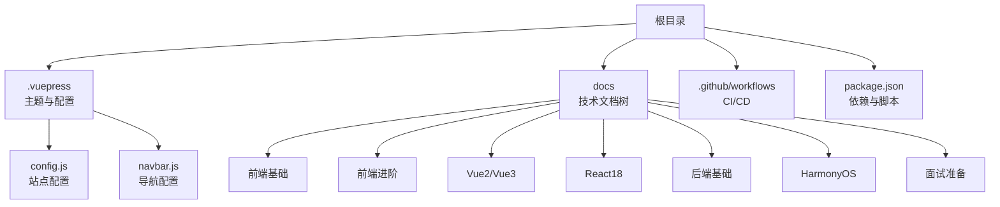
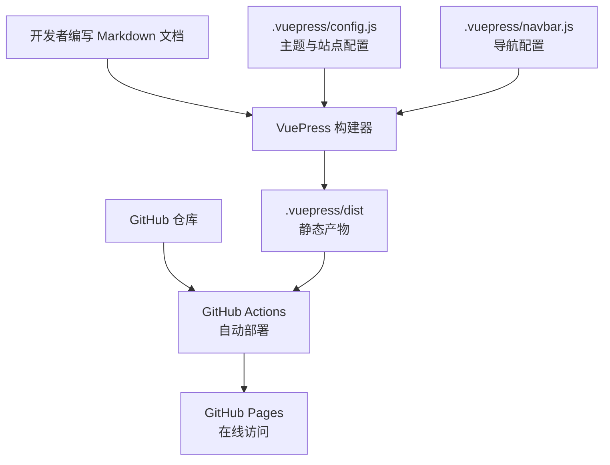
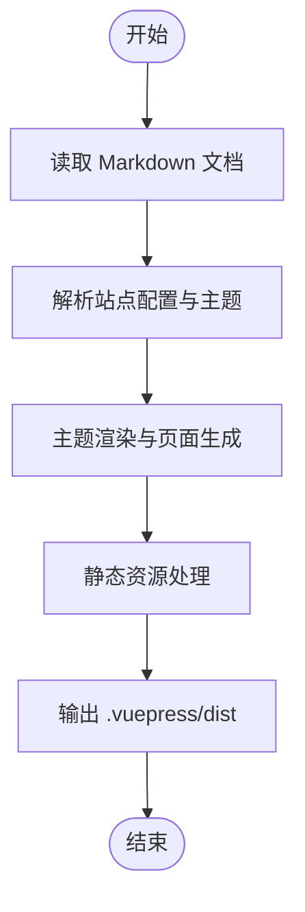
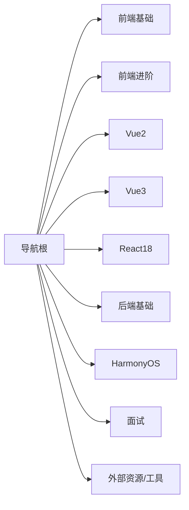
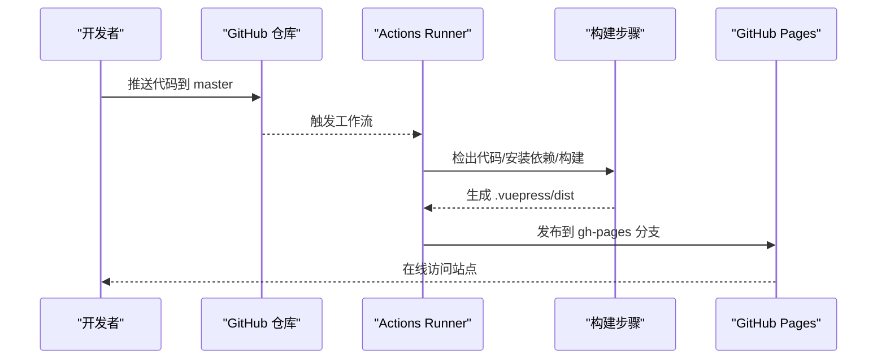
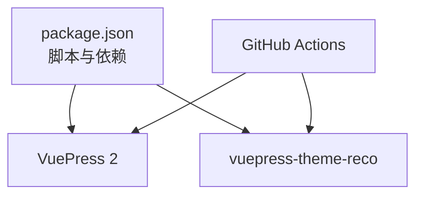

# 项目概述

<cite>
**本文档引用的文件**
- [README.md](file://README.md)
- [.vuepress/config.js](file://.vuepress/config.js)
- [.vuepress/navbar.js](file://.vuepress/navbar.js)
- [package.json](file://package.json)
- [.github/workflows/deploy.yml](file://.github/workflows/deploy.yml)
- [publish.sh](file://publish.sh)
- [docs/frontend-base/javascript/grammar.md](file://docs/frontend-base/javascript/grammar.md)
- [docs/vue2/vue/introduction/introduction.md](file://docs/vue2/vue/introduction/introduction.md)
- [docs/backend-base/java/DOS.md](file://docs/backend-base/java/DOS.md)
- [docs/interview/javascript/data_type.md](file://docs/interview/javascript/data_type.md)
</cite>

## 目录
1. [简介](#简介)
2. [项目结构](#项目结构)
3. [核心组件](#核心组件)
4. [架构总览](#架构总览)
5. [详细组件分析](#详细组件分析)
6. [依赖分析](#依赖分析)
7. [性能考虑](#性能考虑)
8. [故障排查指南](#故障排查指南)
9. [结论](#结论)
10. [附录](#附录)

## 简介
本项目是一个基于 VuePress 的技术博客与知识库，目标是以 Markdown 文档为核心，构建覆盖前端基础、前端进阶、Vue 框架、React、后端基础、HarmonyOS、面试准备等多个技术领域的静态知识库。项目通过 VuePress 静态站点生成器将 Markdown 内容编译为高性能的静态页面，并结合 GitHub Actions 实现自动化部署到 GitHub Pages。

- 项目定位：面向初学者的知识入口与进阶开发者的架构参考
- 技术选型：VuePress 2、vuepress-theme-reco 主题、GitHub Actions 自动化部署
- 内容组织：按技术领域划分的文档树，配合导航栏与系列配置形成清晰的知识脉络
- 特色功能：主题化的导航体系、响应式布局、自动化构建与发布

## 项目结构
项目采用“文档驱动 + 主题配置 + CI/CD 自动化”的组织方式：
- 根目录包含构建脚本、部署脚本与仓库配置
- .vuepress 目录存放主题与导航配置、公共资源与样式扩展
- docs 目录按技术领域组织大量 Markdown 文档，形成完整的知识库
- .github/workflows 目录包含自动化部署工作流

图表来源
- [.vuepress/config.js:1-18](file://.vuepress/config.js#L1-L18)
- [.vuepress/navbar.js:1-142](file://.vuepress/navbar.js#L1-L142)
- [package.json:1-17](file://package.json#L1-L17)

章节来源
- [.vuepress/config.js:1-18](file://.vuepress/config.js#L1-L18)
- [.vuepress/navbar.js:1-142](file://.vuepress/navbar.js#L1-L142)
- [package.json:1-17](file://package.json#L1-L17)

## 核心组件
- 站点配置与主题集成
  - 通过站点配置文件启用主题、设置标题、描述、图标与基础路径，并注入导航与系列配置。
- 导航与内容组织
  - 导航栏按“软件基础、前端基础、前端进阶、Vue2/Vue3、React18、后端基础、HarmonyOS、面试准备、外部资源、工具”等分类组织，覆盖从入门到面试的全链路知识。
- 构建与发布
  - 本地开发与构建脚本由 package.json 统一管理；GitHub Actions 在 master 推送时自动安装依赖、构建并发布到 gh-pages 分支；也可使用 publish.sh 执行本地构建与推送。

章节来源
- [.vuepress/config.js:1-18](file://.vuepress/config.js#L1-L18)
- [.vuepress/navbar.js:1-142](file://.vuepress/navbar.js#L1-L142)
- [package.json:1-17](file://package.json#L1-L17)
- [.github/workflows/deploy.yml:1-36](file://.github/workflows/deploy.yml#L1-L36)
- [publish.sh:1-20](file://publish.sh#L1-L20)

## 架构总览
下图展示了从文档编写到静态站点发布的整体流程，以及主题与导航在其中的角色。

图表来源
- [.vuepress/config.js:1-18](file://.vuepress/config.js#L1-L18)
- [.vuepress/navbar.js:1-142](file://.vuepress/navbar.js#L1-L142)
- [.github/workflows/deploy.yml:1-36](file://.github/workflows/deploy.yml#L1-L36)

## 详细组件分析

### VuePress 工作原理与静态站点生成
- 文档驱动：以 Markdown 为输入，通过主题与插件渲染为页面
- 主题集成：通过站点配置启用主题并注入导航与系列配置
- 构建产物：构建后生成 .vuepress/dist 静态资源，可直接托管于静态服务器或 GitHub Pages

图表来源
- [.vuepress/config.js:1-18](file://.vuepress/config.js#L1-L18)

章节来源
- [.vuepress/config.js:1-18](file://.vuepress/config.js#L1-L18)

### 导航系统与内容组织
- 导航结构：导航栏按技术领域分组，子项指向具体文档路径，便于快速定位
- 内容覆盖：涵盖前端基础、进阶、Vue2/Vue3、React18、后端基础、HarmonyOS、面试准备等
- 外部链接：提供外部优质资源与工具链接，作为补充学习入口

图表来源
- [.vuepress/navbar.js:1-142](file://.vuepress/navbar.js#L1-L142)

章节来源
- [.vuepress/navbar.js:1-142](file://.vuepress/navbar.js#L1-L142)

### 自动化部署流程
- 触发条件：master 分支有推送且未忽略特定文件
- 步骤概览：检出代码 → 安装依赖 → 构建 → 部署到 gh-pages 分支
- 产物路径：.vuepress/dist

图表来源
- [.github/workflows/deploy.yml:1-36](file://.github/workflows/deploy.yml#L1-L36)

章节来源
- [.github/workflows/deploy.yml:1-36](file://.github/workflows/deploy.yml#L1-L36)

### 本地构建与手动发布
- 本地构建：执行构建脚本生成静态站点
- 手动发布：初始化 Git 仓库、提交并推送到指定分支，实现快速发布

章节来源
- [publish.sh:1-20](file://publish.sh#L1-L20)

### 示例文档与知识覆盖
- 前端基础：以 JavaScript 基础语法为例，覆盖变量、表达式、注释、区块、条件语句等
- Vue2 源码导读：介绍核心思想、版本演进与虚拟 DOM 等要点
- 后端基础：以 Java 常用 DOS 命令为例，展示后端环境与工具使用
- 面试准备：以 JavaScript 数据类型为例，覆盖基本类型与引用类型、存储差异等

章节来源
- [docs/frontend-base/javascript/grammar.md:1-200](file://docs/frontend-base/javascript/grammar.md#L1-L200)
- [docs/vue2/vue/introduction/introduction.md:1-28](file://docs/vue2/vue/introduction/introduction.md#L1-L28)
- [docs/backend-base/java/DOS.md:1-75](file://docs/backend-base/java/DOS.md#L1-L75)
- [docs/interview/javascript/data_type.md:1-200](file://docs/interview/javascript/data_type.md#L1-L200)

## 依赖分析
- 构建与主题
  - VuePress 2 与 vuepress-theme-reco 主题负责站点渲染与主题样式
- 脚本与依赖
  - package.json 中定义 dev/build 脚本，统一管理依赖与命令
- CI/CD
  - GitHub Actions 通过官方 Action 完成 Node 环境设置、依赖安装与构建发布

图表来源
- [package.json:1-17](file://package.json#L1-L17)
- [.github/workflows/deploy.yml:1-36](file://.github/workflows/deploy.yml#L1-L36)

章节来源
- [package.json:1-17](file://package.json#L1-L17)
- [.github/workflows/deploy.yml:1-36](file://.github/workflows/deploy.yml#L1-L36)

## 性能考虑
- 静态化优势：构建产物为纯静态页面，加载速度快、成本低
- 主题与插件：主题与内置插件（搜索、放大镜、回到顶部等）在保证体验的同时需关注体积与加载时机
- 资源优化：合理组织文档与资源，避免冗余图片与大文件；利用浏览器缓存策略

## 故障排查指南
- 构建失败
  - 检查 Node 版本与依赖安装是否成功
  - 确认构建脚本与站点配置无误
- 部署异常
  - 核对 GitHub Pages 分支与发布目录配置
  - 检查密钥与用户信息配置是否正确
- 本地发布
  - 确认 Git 初始化与推送分支设置正确

章节来源
- [.github/workflows/deploy.yml:1-36](file://.github/workflows/deploy.yml#L1-L36)
- [publish.sh:1-20](file://publish.sh#L1-L20)

## 结论
本项目以 VuePress 为主题框架，围绕多技术领域的 Markdown 文档构建知识库，并通过主题配置与自动化部署实现高效产出与发布。对初学者而言，导航清晰、内容分层明确；对有经验的开发者而言，主题可扩展、构建流程可控，适合持续迭代与规模化维护。

## 附录
- 快速开始
  - 本地开发：执行开发脚本启动本地服务
  - 本地构建：执行构建脚本生成静态站点
  - 手动发布：使用发布脚本完成本地构建与推送
- 在线访问
  - 通过 GitHub Pages 访问已部署站点

章节来源
- [package.json:1-17](file://package.json#L1-L17)
- [publish.sh:1-20](file://publish.sh#L1-L20)
- [.github/workflows/deploy.yml:1-36](file://.github/workflows/deploy.yml#L1-L36)