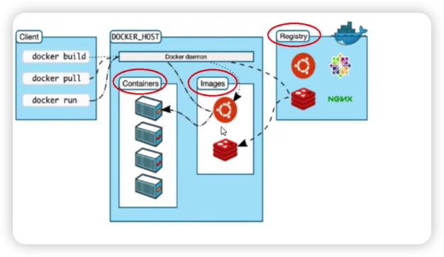

# Docker

## Docker三要素

### 镜像 Image

镜像是一个只读的模板，可以用来创建容器，一个镜像可以用来创建多个容器，镜像相当于一个文件系统

### 容器 Container

容器是使用镜像创建的一个虚拟的、隔离的运行环境，用于独立运行一个或者一组应用，应用程序或者服务运行在容器里面。

### 仓库 Repository

仓库是存放镜像文件的场所

## Docker架构图

### 基础架构



docker是一个c/s架构的系统，docker守护进程运行在主机上，客户端可以通过socket连接到主机，通过发送命令到docker主机来管理docker资源

### docker相比虚拟机的优势

1. docker有着比虚拟机更少的抽象层，docker不需要实现硬件资源的虚拟化，docker容器中的程序使用的是实际硬件资源
2. 新建一个docker容器，不需要重新加载一个操作系统内核，而是利用宿主机的内核

## 常用命令

### 帮助启动类命令

#### 启动docker

```bash
systemctl start docker
```

#### 停止docker

```bash
systemctl stop docker
```

#### 重启docker

```bash
systemctl restart docker
```

#### 查看docker状态

```bash
systemctl status docker
```

#### 开机启动docker

```bash
system enable docker
```

#### 查看docker概要信息

```bash
docker info
```

#### 查看总体帮助文档

```bash
docker --help
```

#### 查看单个命令帮助文档

```bash
docker 命令 --help
```

### 镜像命令

#### 本地镜像列表

```bash
docker images
docker images -a # 显示所有镜像
docker images -q # 显示所有镜像ID
```

#### 搜索镜像

```bash
docker search 镜像名
docker search 镜像名 -s 5 # 搜索镜像，并显示5个结果
```

#### 拉取镜像

```bash
docker pull 镜像名
docker pull 镜像名:标签
docker pull 镜像名:标签@sha256:镜像ID
docker pull 镜像名:latest
docker pull registry.cn-hangzhou.aliyuncs.com/library/nginx:latest
```

#### 删除镜像

```bash
docker rmi 镜像ID[:标签]
docker rmi 镜像名[:标签]
docker rmi -f 镜像ID[:标签]
```

#### 查看镜像、容器所占用空间

```bash
docker system df
docker system df -v
```

### 容器命令

#### 启动容器

```bash
# 创建并运行容器
docker run [options] 镜像名 [命令] [参数] 

# options
-d 后台运行容器并返回容器ID，也称启动守护式容器
-i 以交互模式运行容器，通常与-t同时使用
-t 为容器重新分配一个伪输入终端，通常与-i同时使用
-p 小写p，指定端口映射，hostPort:containerPort
-P 大写P，随机映射端口
--name 容器名
--rm 删除容器
--network=bridge 使用默认的网络
--network=host 使用主机网络
--network=自定义网络 使用自定义的网络

# 启动已经停止的容器
docker start 容器ID或容器名

# 重启容器
docker restart 容器ID或容器名
```

docker容器后台运行，必须有一个前台进程，如果容器运行的命令不是一直挂起的命令，就会自动退出，这个是docker的机制

最佳的解决方案是，将要运行的程序以前台进程的形式运行，常见的就是**命令行模式**

#### 列出容器

```bash
docker ps # 列出正在运行的容器
docker ps -a # 列出所有容器
docker ps -q # 列出所有容器ID
docker ps -aq # 列出所有容器ID并去重
```

#### 退出容器

```bash
exit # 退出容器 容器会自动停止
ctrl + p + q # 退出容器 容器不会自动停止
```

#### 停止容器

```bash
# 停止容器
docker stop 容器ID或容器名

# 强制停止容器
docker kill 容器ID或容器名
```

#### 删除容器

```bash
# 删除已停止的容器
docker rm 容器ID或容器名

# 强制删除容器
docker rm -f 容器ID或容器名
```

#### 查看容器日志

```bash
docker logs 容器ID或容器名
docker logs -f 容器ID或容器名 # 持续查看容器日志
docker logs -n 10 容器ID或容器名 # 查看最后10行日志
docker logs --since 1h 容器ID或容器名 # 查看1小时内的日志
docker logs --tail 10 容器ID或容器名 # 查看最后10行日志
```

#### 容器信息

```bash
docker inspect 容器ID或容器名
docker top 容器ID或容器名
```

#### 进入容器

```bash
docker exec -it 容器ID或容器名 bash
docker exec -it 容器ID或容器名 /bin/bash
docker exec -it 容器ID或容器名 /bin/sh
docker exec -it 容器ID或容器名 /bin/sh -c "ls -l"

docker attach 容器ID或容器名
```

attach命令和exec命令一样，attach不会创建一个新的进程，使用exit退出容器终端会导致容器停止；使用exec命令可以创建一个新的进程，使用exit退出容器终端不会导致容器停止

#### 容器文件导出到宿主机

```bash
docker cp 容器ID或容器名:/文件路径 宿主机路径
```

#### 容器导入导出

```bash
# 导出容器内容为一个tar包
docker export 容器ID或容器名 > 文件名.tar

# 从tar包中的内容创建一个新的镜像
docker import 文件名.tar 镜像名:标签
```

#### 提交容器为镜像

```bash
docker commit 容器ID或容器名 镜像名:标签
docker commit -a "作者" -m "镜像描述" 容器ID或容器名 镜像名:标签
```

## 镜像

### 什么是镜像

镜像是一种轻量级、可执行的独立软件包，它包含运行某个软件所需的所有内容，我们把应用程序和配置依赖打包好形成一个可交付的运行环境(包括代码、运行时需要的库、环境变量和配置文件等)，这个打包好的运行环境就是image镜像文件

### 镜像分层

镜像分层是指一层一层的文件系统，分层的好处是方便复用和迁移

镜像都是可读的，容器启动时，会在容器的顶部加载一个新的可写层，这一层通常被称为“容器层”，容器层以下的都称为镜像层

镜像层和容器层是隔离的，容器层上的修改不会影响镜像层，镜像层上的修改也不会影响容器层

### 联合文件系统

Union文件系统（UnionFS）是一种分层、轻量级并且高性能的文件系统，它支持对文件系统的修改作一次提交来一层层的叠加，同时可以将不同目录桂载到同一个虚拟文件系统 下(unite several directories into a single virtual filesystem)。 Union 文件系统是 Docker 镜像的基础。镜像可以通过分层来进行维承，基于基础镜像（没有父镜像），可以制作各种具体的应用镜像。

特性：一次同时加载多个文件系统，但从外面看起来，只能看到一个文件系统，联合加载会把各层文件系统叠加起来，这样最终的文件系统会包含所有底层的文件和目录

### 镜像加载原理

docker的镜像实际上由一层一层的文件系统组成，这种层级的文件系统UnionFs

bootfs(bootTile system)主要包含bootloader和kernel, bootloader主要是引导加载kernel, Linux刚启动时会加载bootfs文件系统，在Docker镜像的最底层是引导文件系统bootfs。这一层与我们典型的Linux/Unix系统是一样的，包含boot加载器和内核。当boot加载完成之后整个内核就都在内存中了，此时内存的使用权己由bootfs转交给内核，此时系统也会卸载bootfs。

rootfs (root file system)，在bootfs之上。包含的就是典型 Linux 系统中的 /dev, /proc, /bin, /etc 等标准目录和文件。rootfs就是各种不同的操作系统发行版，比如Ubuntu,Centos等等。
