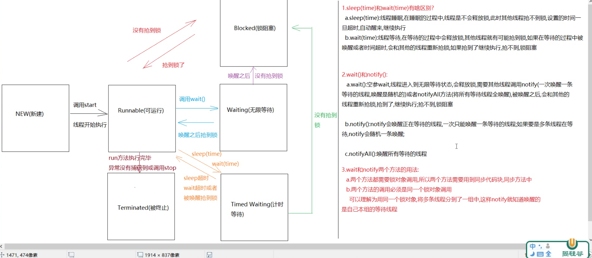
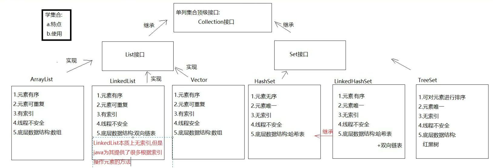
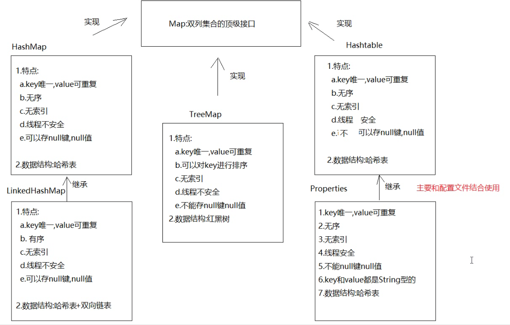

# Java语法基础

## 常用到的DOS命令

### 切换盘符

盘符名+:+回车
> 示例：D:+回车
>
### 查看文件或者文件夹

1. 查看当前路径下的文件或者文件夹

使用dir命令

> 示例：dir

2. 查看指定路径下的文件或者文件夹

使用dir命令 + 路径

> 示例：dir D:\Java

3. 查看指定路径下的文件或者文件夹的详细信息

使用dir命令 + /s + 路径
> 示例：dir /s D:\Java
>
### 进入指定文件夹

1. 使用cd命令

> 示例：cd D:\Java

2. 使用cd命令 + ..  进入上一级目录

> 示例：cd ..
>
### 文件夹操作

1. 在当前目录下创建文件夹

使用mkdir命令
> 示例：mkdir Java

2. 在当前目录下创建多级文件夹

使用mkdir + 路径

> 示例：mkdir \Java\learn

3. 删除文件夹

使用rmdir + /s + 路径

> 示例：rmdir /s D:\Java

4. 删除文件夹下的所有文件

使用del + /q + 路径，删除之后不走回收站
> 示例：del /q D:\Java

5. 删除文件夹下的所有文件及子文件夹

使用rd + /s + /q + 路径，删除之后不走回收站
> 示例：rd /s /q D:\Java

6. 重命名文件夹

使用ren + 旧文件夹名 + 新文件夹名
> 示例：ren D:\Java D:\Java_learn

7. 移动文件夹

使用move + 源文件夹 + 目标文件夹
> 示例：move D:\Java D:\Java_learn
>
## 常量

程序运行中，值不会发生改变的数据

### 整数常量

所有的整数

### 小数常量

所有带小数点的数字，如1.2，2.0

### 字符常量

使用单引号括号包裹的字符，内容必须有且为一个字符，如 'a'、' '
> 注意：不能使用''的形式
>
### 字符串常量

使用双引号包裹的若干字符，内容可以是任何形式

### 布尔常量

只有两个值，true和false

### 空常量

表示数据不存在，只有一个值null

## 变量

### 变量的数据类型

#### 基本数据类型

基本数据类型分为四类八种

1. 整型：

byte：字节型，占用一个字节，基本不用

short：短整型，占用两个字节

int：整型，数字的默认类型，占用4个字节

long：长整型，占用8个字节

2. 浮点型：

float：单精度浮点型，占用4个字节

double：双精度浮点型，占用8个字节，是浮点型的默认类型
> float与double的区别
> float:小数位只有23位二进制，能表示的最大的十进制位2的23次方，即8388608，是七位数
> double:小数位只有52位二进制，能表示的最大的十进制位2的52次方，即4503599627370496，是16位

3. 布尔型：

boolean：布尔型，只有两个值true和false，占用1个字节

4. 字符型：

char：占用2个字节

#### 引用数据类型

类、数组、接口、枚举、注解

#### 数组

定义一个数组

数组是一个固定长度的容器，既可以存储基本数据类型也可以存储引用数据类型，数组存储的数据类型必须一致

动态声明数组：通过指定数组长度而不对数组进行初始化来声明一个数组，例如：int[] a = new int[10];

静态声明数组：通过指定数组内容来声明一个数组，例如：int[] a = {1,2,3,4,5};

数组操作：

1. 获取数组长度：a.length

2. 获取数组元素：a[i]

3. 赋值：a[i] = 1

4. 创建静态数组：int[] a = {1,2,3,4,5};

5. 创建动态数组：int[] a = new int[10];

### 变量使用注意事项

1. 变量未声明或未赋值不能直接使用

2. 同一作用域不能重复声明变量

3. 静态变量和实例变量不能有相同的名称

4. 变量声明不能使用数字开头，变量名可以包含字母、数字、下划线_、$符号

### 数据类型转换

当等号两边的数据类型不一致时，数据类型转换；当不同的数据类型进行运算时，数据类型转换

#### 自动类型转换

1. 当取值范围小的数据类型赋值到取值范围大的数据类型时，数据类型小转大

2. 当取值范围小的数据类型与取值范围大的数据类型进行运算时，数据类型小转大

#### 强制类型转换

当取值范围的大的数据类型赋值给取值范围小的数据类型时，数据类型大转小

#### 数据转换的注意事项

1. 不应随意转换数据类型，会有精度丢失或者数据溢出的情况

2. byte，short类型定义时，如果等号右边是整数字面量且没有超出范围，不需要手动转换

3. char类型如果参与运算，会提升为int型，值为ASCII码，如果码表中没有，则在unicode码表中找

#### 数据类型取值范围比较

byte \< short,char \< int \< long \< float \< double

### 内存图

在java程序中，内存分为5大块

#### 栈内存

存放基本数据类型，对象引用，方法参数，局部变量，方法的运行也在栈内存中进行

#### 堆内存

存放引用类型的数据，每个数据在堆内存中开辟一个空间，并在栈内存中保存这块空间的地址，堆内存是动态分配的，并且堆内存的数据都是有默认值的，比如int型变量，默认值为0；

#### 方法区

方法区存放类和方法的信息，class文件也是被加载到方法区中，方法区是静态分配的，方法区中的数据没有默认值

#### 本地方法栈

专门运行本地方法

#### 寄存器

待补充

## 面向对象

### 类

类是对一类事物的抽象表示，由属性(成员变量)和行为(成员方法)组成

测试类：带main方法的类，主要用于运行代码

实体类：无main方法的类，主要用来表示对象

抽象类：抽象类不能实例化，只能被继承，抽象类中可以有抽象方法，抽象方法没有方法体，抽象方法必须被继承类实现

抽象类和实体类区别：抽象类不能实例化，只能被继承

### 抽象

抽象是指不具体实现，抽象方法不能有方法体并且一定要在抽象类中，抽象类中可以有抽象方法，也可以没有抽象方法

抽象类不能实例化，只能被继承；非抽象子类的继承必须重写父类的所有抽象方法

抽象类可以看做是一个事物的标准模板，属于这个父类的子类，所有抽象方法都必须得到具体实现

定义一个抽象类：abstract class 类名{}

定义抽象方法：abstract 返回值类型 方法名(参数列表);

### 封装

将实现的细节封装起来，对外提供接口

使用private修饰的成员变量，外部类不能直接访问，只能通过getter和setter方法访问

如果成员变量和局部变量重名时，优先访问局部变量，也就是就近原则，使用this关键字可以访问成员变量，this代表调用this所在方法的对象

构造方法：构造方法名与类型相同，没有返回值，并且不适用void，分为有参构造和无参构造

定义一个类时，jvm内部默认会有一个无参构造方法

```java
public class Person {
    public Person(){
        System.out.println('我是无参构造方法');
    }
}
```

有参构造方法可以在new的时候为对象的成员变量进行赋值，当定义了一个有参构造方法后，jvm提供的默认无参构造方法会被覆盖，我们可以自己定义一个无参构造方法，此时实例化对象时既可以传参也可以不传参

```java
public class Person {
    String name;
    public Person(){
        System.out.println('我是无参构造方法');
    }
    public Person(String name){
        this.name = name;
    }
}
```

#### javabean

javabean是一种编码规范，类必须是具体的和公共的，不能是抽象类；类中包含无参构造和有参构造方法；成员的变量私有化，提供getter和setter方法

#### static

静态关键字，用于修饰成员变量和成员方法，通过static修饰的变量和方法属于类的属性和方法，加载时随着类的加载而加载

使用包含静态成员的类创建出来的所有对象共享静态成员

静态成员访问特点：

1. 静态成员访问非静态成员：需要通过new创建对象后调用

2. 静态成员访问静态成员：本类可以直接访问，也可以通过类名访问，他类需要通过类名访问

3. 非静态成员访问非静态成员：本类可以直接访问，他类需要通过new创建对象访问

4. 非静态成员访问静态成员：本类可以直接访问，他类需要通过类名访问

#### final关键字

final修饰符用于修饰类，类中的成员变量、成员方法、局部变量和对象

1. 修饰类

使用final修饰符修饰类时，类不能被继承，类中的成员不能被重写

2. 修饰方法

使用final修饰符修饰父类方法时，子类继承父类不能重写父类被final修饰的方式；final修饰符不能修饰构造方法和静态方法，并且不能与abstract同时使用

3. 修饰成员变量

成员变量在定义类的时候需要手动赋值，包括在构造函数中也不能对其赋值

4. 修饰局部变量

使用final修饰符修饰局部变量时，不能对局部变量进行赋值，如果局部变量是引用类型，可以修改引用类型中的值

#### 访问修饰符

权限修饰符用于修饰类和类中的成员，只有default和public可以用于修饰类，不使用任何修饰符时，表示default(友好型)

1. public：如果一个类或者类的成员被public访问控制符修饰，那么这个类或者类的成员能被所有的类访问，不管访问类与被访问类是否在同一个包中
2. protected：如果一个类的成员被protected访问控制符修饰，那么这个成员既能被同一包下的其他类访问，也能被不同包下该类的子类访问
3. default：如果一个类或者类的成员不使用任何访问控制符修饰，则称它为默认访问控制级别，这个类或者类的成员只能被本包中的其他类访问
4. private：如果类的成员被private访问控制符来修饰，则这个成员只能被该类的其他成员访问，其他类无法直接访问。类的良好封装就是通过private关键字来实现的；使用private
   修饰的方法不能被子类重写

表格总结：

| 形式 | public | protected | default | private |
|---|:---:|---:|:---:|---:|
| 同包同类 | yes | yes |yes | yes |
| 同包不同类 | yes | yes |yes | no |
| 不同包继承 | yes | yes |no | no |
| 不同包非继承 | yes | no |no | no |

### 继承

继承是子类可以继承父类中的属性和方法，是java中实现复用的重要手段，在java中继承是单一的，即一个子类只能有一个父类，但是一个父类可以有多个子类

继承通过extends实现一个子类继承一个父类，子类有自己的构造方法，可以`继承`父类的私有和非私有成员，但是不能继承父类的构造方法，也不能`使用`父类中的私有成员

java中所有的类都继承自Object类，所以除了Object类，所有的类都有一个父类

#### 成员变量访问

当子类和父类有相同的成员变量时，子类会覆盖父类成员变量，此时使用子类对象访问成员变量时，会优先使用子类成员变量，如果使用父类对象访问成员变量，则优先使用父类成员变量

当子类和父类的成员变量不重名时，如果等号左边是父类类型，只能调用父类中的成员变量；如果等号左边是子类类型，优先调用子类成员变量，子类没有，再调用父类的非私有成员变量

#### 成员方法访问

在继承中，访问成员方法，看使用new时使用的哪个类，就优先调用哪个类的成员方法

如果是父类，则只能调用父类中的成员方法；如果是子类，则优先调用子类中的成员方法，子类没有，再调用父类的非私有成员方法

> 总结：访问方法和变量，都是子类可以访问父类非私有，父类不能访问子类;变量通过=左边确定类型，方法通过new确定类型

#### 方法重写

在继承关系中，当父类和子类拥有相同的方法名和参数列表时，此时父类的方法被子类重写，方法的调用符合继承中成员方法的访问特点

- 子类重写父类方法后，访问权限必须大于等于父类
- 父类中的构造方法、私有方法(private)、静态方法(static)不能被重写
- 子类方法抛出的异常应该是父类方法抛出异常的子类类型

#### Super

Super代表父类的引用，可以调用父类中的成员

1. 调用父类构造函数：在子类的构造函数中第一行调用Super()或者Super(参数)
2. 调用父类的成员变量：在子类中成员方法中使用Super.a
3. 调用父类的成员方法：在子类中成员方法中使用Super.a()

#### this

表示调用this所在方法的调用对象

1. 用与区分成员变量和局部变量
2. 调用对象的成员

除了指向对象，this还可以单独调用，即this()，这种使用方式可以调用当前对象的构造方法

### 接口

接口是一种抽象的类型，不能实例化对象，只能通过implements关键字实现，一个类可以继承一个或多个接口；一个接口可以继承一个或多个接口

定义接口：public interface 接口名{}

实现接口:public class 类名 implements 接口名{}

接口中的成员变量默认是public static final的，如果不加public static，编译器会自动为我们加上，所以在接口中，只能使用静态变量，并且必须初始化，按照规范，变量名最好使用大写。接口中的成员方法默认是public abstract的，如果不加public abstract，编译器会自动加上

> jdk8以后新增了默认方法和静态方法，jdk9以后新增了私有方法

一个类实现的多个接口有相同名称和参数的抽象方法，实现类需要且只需要重写一次；

一个类实现的多个接口有相同名称和参数的默认方法，实现类需要且必须重写该方法

#### 抽象类与接口

接口是抽象的，抽象类是具体的，抽象类可以有抽象方法，抽象类也可以有具体方法

一个接口可以继承多个接口，如public interface 接口名 extends 接口名1,接口名2{}

一个实现类可以实现多个接口，如public class 类名 implements 接口名1,接口名2{}

当多个接口有相同的抽象方法且参数相同时，实现类只需要重写一次即可

当多个接口有相同的默认方法且参数相同时，实现类必须重写一次默认方法

### 多态

多态是指在面向对象编程中，同一个类的对象在不同情况下表现出来的不同行为和状态。 多态的目的是为了提高代码的灵活性和可扩展性，使得代码更容易维护和扩展。

多态的前提：

1. 必须和一个类有继承关系或者和一个接口有实现关系
2. 必须有方法的重写，多态的意义主要就是方法的重写
3. 必须有父类引用指向子类对象

多态的实现：父类可以接收子类对象

#### 转型

多态中的父类引用变量指向子类对象，这种方式是一种向上转型，只能使用父类已声明的方法，但方法如果被重写会执行子类的方法，如果方法未被重写那么将执行父类的方法,例如：

```java
    Animal animal = new Dog();
```

向下转型是指，将父类对象转为子类类型，在书写上父类对象需要加括号()强制转换为子类类型。但父类引用变量实际引用必须是子类对象才能成功转型，就可以调用一些子类特有而父类没有的方法 例如：

```java
    Animal animal = new Dog();
    Dog dog = (Dog) animal;
```

转型过程中，可能会转成错误类型，这时会抛出ClassCastException异常，通过instanceof关键字判断对象类型，然后再进行转型。

## 内部类

当一个类中，对事物的描述过于复杂时，可以使用内部类，内部类是对事物一部分的描述，内部氛围成员内部类、静态内部类、局部内部类

### 成员内部类

在类的内部定义，不使用static修饰

定义方式：一般不可以定义静态成员，除非同时使用static和final进行修饰

访问权限：成员内部类可以访问外部类的所有成员变量和方法

被访问权限：在实例方法中访问，可以直接使用new Inner()的方式，外部类的静态方法和外部类的外部，需要使用new Outer().new Inner()

### 静态内部类

在类的内部定义，使用static修饰

访问权限：可以直接访问外部类的静态变量和静态方法，要访问外部类的实例变量和实例方式需要使用new Outer()的方式

被访问权限：外部类的静态变量和静态方法以及外部类以外的类，需要通过完整的路径访问，即Outer.Inner.method()

### 局部内部类

在方法的内部定义，不能定义静态成员，不能定义静态方法，不能使用static进行修饰

## 异常

代码的编写出现非正常现象，称为异常，异常分为编译时异常和运行时异常，编译时异常必须处理，运行时异常可以不处理，但是建议处理
异常都是一个一个的类型，继承自Throwable类，除了RuntimeException及其子类，其他都是编译时异常

异常处理常用的两种方式：try-catch和throws

### try-catch

try-catch使用代码块包括语句，可以使用多个catch处理不同的异常类型，的语法格式如下：

```java
try {
    // 代码块1
} catch(exceptionType1 e) {
    // 代码块2
} catch(exceptionType2 e) {
    // 代码块3
}
```

如果 try 语句块中发生异常，那么一个相应的异常对象就会被拋出，然后 catch 语句就会依据所拋出异常对象的类型进行捕获，并处理。处理之后，程序会跳过 try 语句块中剩余的语句，转到 catch 语句块后面的第一条语句开始执行

如果 try 语句块中没有异常发生，那么 try 块正常结束，后面的 catch 语句块被跳过，程序将从 catch 语句块后的第一条语句开始执行

catch处理异常，可以使用以下三种方式对异常信息进行输出

- e.printStackTrace()：指出异常的类型、性质、栈层次及出现在程序中的位置
- e.getMessage()：返回异常的性质
- e.toString()：返回异常的性质和类型

finally用于指定无论try和catch中的代码是否执行完，都会执行的代码

### throws

throws用于指定方法中可能发生的异常，编译器检查方法调用时是否处理了异常，如果处理了，则编译通过；如果未处理，则编译不通过

一般用于在该方法中不处理异常，交给方法的调用者

格式如下：

```java
returnType methodName() throws 异常类1,异常类2,异常类3{}
```

## String

String代表字符串类

### 特点

1. java中所有的双引号字面值都是String类的对象实现
2. 字符串是不可变的，对字符串进行拼接、截取、替换、转换、替换、遍历等操作，都会产生新的字符串对象，不会改变原来的字符串对象
3. 相同的字符串在内存中只有一份对象，相同字符串内容的不同变量`共享`同一个对象

### 创建String对象

1. 通过字面值创建String对象:String s = "hello";
2. 通过有参构造传入字符串创建:String s = new String("hello");
3. 通过char数组创建String对象:String s = new String(char[] {'h','e','l','l','o'});
4. 通过字节数组创建String对象:String s = new String(byte[] {104,101,108,108,111});

### 常用方法

#### 比较方法

1. boolean equals(String s) 判断两个字符串是否相等
2. boolean equalsIgnoreCase(String s) 忽略大小写判断两个字符串是否相等
3. int compareTo(String s) 比较两个字符串的大小
4. int compareToIgnoreCase(String s) 忽略大小写比较两个字符串的大小

#### 获取方法

1. int length() 获取字符串的长度
2. char charAt(int index) 获取指定索引处的字符
3. int indexOf(String s) 获取指定字符串在字符串中的索引
4. int indexOf(String s, int fromIndex) 获取指定字符串在字符串中的索引，从指定索引开始
5. int lastIndexOf(String s) 获取指定字符串在字符串中的索引，从字符串末尾开始
6. int lastIndexOf(String s, int fromIndex) 获取指定字符串在字符串中的索引，从指定索引开始，从字符串末尾开始
7. String substring(int beginIndex) 获取指定索引开始到字符串末尾的子字符串
8. String substring(int beginIndex, int endIndex) 获取指定索引开始到指定索引结束的子字符串

#### 转换方法

1. String toLowerCase() 将字符串转换为小写
2. String toUpperCase() 将字符串转换为大写
3. String trim() 删除字符串两端的空格
4. String replace(char oldChar, char newChar) 替换字符串中指定的字符
5. String replace(CharSequence target, CharSequence replacement) 替换字符串中指定的字符序列
6. String replaceAll(String regex, String replacement) 替换字符串中指定的正则表达式
7. String replaceFirst(String regex, String replacement) 替换字符串中指定的正则表达式的第一个匹配项
8. String[] split(String regex) 分割字符串，返回一个字符串数组
9. Char[] toCharArray() 将字符串转换为字符数组
10. byte[] getBytes() 将字符串转换为字节数组

#### 拼接字符串

1. String concat(String str) 拼接字符串，返回一个新字符串

#### 判断方法

1. boolean startsWith(String prefix) 判断字符串是否以指定前缀开头
2. boolean endsWith(String suffix) 判断字符串是否以指定后缀结尾
3. boolean contains(CharSequence seq) 判断字符串是否包含指定字符序列

### StringBuilder

stringBuilder 是一个可变字符串，主要用于字符串拼接，string使用+每拼接一次字符串，就会创建一个新的字符串对象，消耗内存；stringbuilder自带一个缓冲区，每次拼接都会将结果放到缓冲区，不会创建新的对象，拼接结束后，将缓冲区中的内容复制到新的字符串对象中，不会产生垃圾。

使用StringBuilder做字符串拼接， 线程是不安全的

## 数学类

### Math类

1. int abs(int a)、long abs(long a)、double abs(double a)、float abs(float a)：求绝对值
2. double floor(double a)：向下取整，返回double a的整数部分
3. double ceil(double a)：向上取整
4. double round(double a)：四舍五入
5. int max(int a, int b)、long max(long a, long b)、double max(double a, double b)、float max(float a, float b)：求最大值
6. int min(int a, int b)、long min(long a, long b)、double min(double a, double b)、float min(float a, float b)：求最小值

### BigInteger类

1. BigInteger add(BigInteger val)：求和
2. BigInteger subtract(BigInteger val)：求差
3. BigInteger multiply(BigInteger val)：求积
4. BigInteger divide(BigInteger val)：求商
5. BigInteger mod(BigInteger m)：求余
6. BigInteger pow(int n)：求幂

### BigDecimal类

1. BigDecimal add(BigDecimal val)：求和
2. BigDecimal subtract(BigDecimal val)：求差
3. BigDecimal multiply(BigDecimal val)：求积
4. BigDecimal divide(BigDecimal val)：求商
5. BigDecimal divide(BigDecimal val, int scale, int roundingMode)：求商，scale表示精度，roundingMode表示舍入模式，可以解决除不尽的问题
6. BigDecimal pow(int n)：求幂

## Date类

1. new Date()：创建一个Date对象，该对象表示当前时间
2. new Date(long millis)：创建一个Date对象，该对象表示1970年1月1日0时0分0秒到当前时间之间所经过的毫秒数
3. Date.parse(String s)：将字符串s转换成Date对象，字符串s必须遵循"yyyy-MM-dd HH:mm:ss"的格式，否则将返回-1
4. Date.getTime()：返回1970年1月1日0时0分0秒到当前时间之间所经过的毫秒数
5. Date.toString()：返回当前时间对应的字符串，格式为"EEE MMM dd HH:mm:ss zzz yyyy"
6. Date.getYear()/Date.getFullYear()：返回当前时间对应的年份，从1900年开始计算
7. Date.getMonth()：返回当前时间对应的月份，从0开始计算
8. Date.getDate()：返回当前时间对应的日期，从1开始计算
9. Date.getHours()：返回当前时间对应的小时，从0开始计算
10. Date.getMinutes()：返回当前时间对应的分钟，从0开始计算
11. Date.getSeconds()：返回当前时间对应的秒钟，从0开始计算
12. Date.getMilliseconds()：返回当前时间对应的毫秒，从0开始计算
13. Date.getDay()：返回当前时间对应的星期，从0开始计算，0表示星期天，1表示星期一，以此类推
14. Date.setTime(long time)：设置当前时间，参数为毫秒数

## Calendar类

Calendar 类是一个抽象类，它提供了在特定时刻和一组 calendar fields 之间转换的方法，例如 YEAR 、 MONTH 、 DAY_OF_MONTH 、 HOUR 等，以及用于操作日历字段的方法，例如获取日期下个星期。即时时间可以用毫秒值表示，该值是从 Epoch 开始的偏移量，1970 年 1 月 1 日 00:00:00.000 GMT（公历）。
该类还提供了额外的字段和方法，用于在包外实现具体的日历系统。这些字段和方法定义为 protected 。

与其他locale敏感的类一样，Calendar 提供了一个类方法 getInstance ，用于获取此类型的普遍有用的对象。 Calendar 的 getInstance 方法返回一个 Calendar 对象，其日历字段已用当前日期和时间初始化

### 常用静态值

表示年月日时分秒的字段：YEAR、MONTH、DAY_OF_MONTH、HOUR_OF_DAY、MINUTE、SECOND、MILLISECOND，Calendar.getInstance()方法获取当前时间对应的日历对象

### 比较方法

1. int compareTo(Calendar anotherCalendar)：比较两个日历对象的大小，返回一个整数，如果当前日历对象早于 anotherCalendar，则返回一个负数；如果当前日历对象晚于 anotherCalendar，则返回一个正数；如果两个日历对象相等，则返回 0
2. boolean after(Object when)：返回此 Calendar 是否表示指定 Object 表示的时间之后的时间。
3. boolean before(Object when)： 返回此 Calendar 是否表示指定 Object 表示的时间之前的时间。
4. boolean equals(Object obj)： 将此 Calendar 与指定的 Object 进行比较。

### 获取日历对象相关信息

1. int get(int field)：返回给定日历字段的值。
2. String getCalendarType()：返回此 Calendar 的日历类型
3. int getFirstDayOfWeek()：获取一周的第一天是什么；例如，SUNDAY 在美国，MONDAY 在法国
4. final Date getTime()：返回表示此 Calendar 的时间值的 Date 对象（与 时代 的毫秒偏移量）
5. long getTimeInMillis()：以毫秒为单位返回此日历的时间值
6. TimeZone getTimeZone()：获取时区。

### 设置日历对象相关信息

1. void set(int field, int value)：将给定的日历字段设置为给定的值
2. final void set(int year, int month, int date)：设置日历字段 YEAR 、 MONTH 和 DAY_OF_MONTH 的值
3. final void set(int year, int month, int date, int hourOfDay, int minute)：设置日历字段 YEAR、MONTH、DAY_OF_MONTH、HOUR_OF_DAY 和 MINUTE 的值
4. final void set(int year, int month, int date, int hourOfDay, int minute, int second)：设置字段 YEAR、MONTH、DAY_OF_MONTH、HOUR_OF_DAY、MINUTE 和 SECOND 的值。
5. void setFirstDayOfWeek(int value)：设置一周的第一天是什么；例如，SUNDAY 在美国，MONDAY 在法国
6. abstract void add(int field, int amount)：根据日历的规则向给定的日历字段添加或减去指定的时间量。

## SimpleDateFormat类

SimpleDateFormat是以locale敏感的方式格式化和解析日期的具体类，用于格式化日期。它允许格式化（日期→文本）、解析（文本→日期）和规范化

创建sdf对象，SimpleDateFormat sdf = new SimpleDateFormat("yyyy-MM-dd HH:mm:ss");

1. 格式化日期：String format(Date date)
2. 解析日期：Date parse(String source)

## 包装类

基本类型对应的类就是包装类，例如int对应的包装类是Integer

### 拆箱与装箱

装箱：将基本类型转换为对应的包装类，如Integer提供了valueOf()方法。Integer i = Integer.valueOf(100);

拆箱：将包装类转换为对应的基本类型，如integer提供了intValue()方法。int a = i.intValue();

```java
Integer chenmo = new Integer(10); // 手动装箱
int wanger = chenmo.intValue();  // 手动拆箱

Integer chenmo  = 10;  // 自动装箱
int wanger = chenmo;     // 自动拆箱
```

字符串转包装类：在包装类中，都有一个类似parseXXX的方法，用于将字符串转换为对应的基本类型。如Integer提供了parseInt()方法。int a = Integer.parseInt("100");

包装类转字符串：在包装类中，还有一个类似toString()的方法，用于将基本类型转换为字符串。如Integer提供了toString()方法。String s = Integer.toString(100);

> 当需要进行自动装箱时，如果数字在 -128 至 127 之间时，会直接使用缓存中的对象，而不是重新创建一个对象

### 包装类型与基本类型的区别

1. 包装类型可以为null，基本类型不可以

在POJO中，这点区别尤为重要，数据库的查询结果可能是null，如果使用基本类型，当自动拆箱时就是抛出`NullPointerException`异常

2. 基本类型比包装类型更高效

作为局部变量时，基本数据类型在栈中直接存储的具体数值，而包装类型则存储的是堆中的引用。相比较于基本类型而言，包装类型需要占用更多的内存空间，占用的内存空间要大得多，因为它们是对象，并且要存储对象的元数据，并且不仅要存储对象，还要存储引用

### 数据存储区域

1. 寄存器。这是最快的存储区，因为它位于 CPU 内部，用来暂时存放参与运算的数据和运算结果。

2. 栈：位于 RAM（Random Access Memory，也叫主存，与 CPU
直接交换数据的内部存储器）中，速度仅次于寄存器。但是，在分配内存的时候，存放在栈中的数据大小与生存周期必须在编译时是确定的，缺乏灵活性。基本数据类型的值和对象的引用通常存储在这块区域。

3. 堆：也位于 RAM 区，可以动态分配内存大小，编译器不必知道要从堆里分配多少存储空间，生存周期也不必事先告诉编译器，Java
的垃圾收集器会自动收走不再使用的数据，因此可以得到更大的灵活性。但是，运行时动态分配内存和销毁对象都需要占用时间，所以效率比栈低一些。new 创建的对象都会存储在这块区域。

4. 磁盘：如果数据完全存储在程序之外，就可以不受程序的限制，在程序没有运行时也可以存在。像文件、数据库，就是通过持久化的方式，让对象存放在磁盘上。当需要的时候，再反序列化成程序可以识别的对象。

## 工具类

### Arrays

数组专用工具类指的是 java.util.Arrays 类，基本上常见的数组操作，这个类都提供了静态方法可供直接调用

#### 创建数组

1. T[] copyOf(T[] origin, int newLength)：复制指定的数组，如果长度小于数组长度则截取，如果长度大于数组长度则用`null`填充
2. T[] copyOfRange(T[] origin, int start, int end)：复制指定范围内的数组到一个新的数组
3. void fill(T[] a, T val)：对数组进行填充
3. void fill(T[] a, int from ,int to, T val)：对数组进行填充

#### 比较数组

1. static boolean equals(Object[] a, Object[] b)：判断两个数组是否相等

Arrays类的`equals()`方法用来判断两个数组是否相等，除了 equals() 方法，还有另外一个诀窍可以判断两个数组是否相等，尽管可能会出现误差。那就是Arrays.hashCode()方法

2. static boolean equals(boolean[] a, int aFromIndex, int aToIndex, boolean[] b, int bFromIndex, int bToIndex)：判断两个数组指定范围内是否相等

源码实现：

```java
public static boolean equals(Object[] a, Object[] a2) {
    if (a==a2)
        return true;
    if (a==null || a2==null)
        return false;

    int length = a.length;
    if (a2.length != length)
        return false;

    for (int i=0; i<length; i++) {
        if (!Objects.equals(a[i], a2[i]))
            return false;
    }

    return true;
}
```

3. static boolean deepEquals(Object[] a1, Object[] a2)：如果两个指定的数组是深度相等，则返回true

#### 数组排序

Arrays类的sort()方法用来对数组进行排序，排序会改变原有的数组

#### 数组元素查询

数组排序后就可以使用Arrays类的binarySearch()方法进行二分查找，线性检索，效率就会低很多

Arrays.binarySearch()方法既可以精确检索，也可以模糊检索，比如说忽略大小写，Arrays.binarySearch(sorted, "Wang",
String::compareToIgnoreCase)

#### 数组打印

因为数组是一个对象，直接 System.out.println 的话，结果是对象的内存地址，要争取打印出数组，需要使用Arrays.toString()，源码实现如下：

```java
public static String toString(Object[] a) {
    if (a == null)
        return "null";

    int iMax = a.length - 1;
    if (iMax == -1)
        return "[]";

    StringBuilder b = new StringBuilder();
    b.append('[');
    for (int i = 0; ; i++) {
        b.append(String.valueOf(a[i]));
        if (i == iMax)
            return b.append(']').toString();
        b.append(", ");
    }
}
```

#### 数组转List

尽管数组非常强大，但它自身可以操作的工具方法很少，比如说判断数组中是否包含某个值。如果能转成 List 的话，需要使用Arrays.asList()方法，但是该方法返回的是java.util. Arrays.ArrayList类型，它的长度是固定的，无法进行元素的删除或者添加。要想操作元素的话，需要多一步转化，将返回值作为ArrayList构造函数的参数

代码示例：

```java
List<String> result = new ArrayList<>(Arrays.asList({1,2,3}));
```

### StringUtils

StringUtils工具类用于对字符串判空，截取字符串、转换大小写、分隔字符串、比较字符串、去掉多余空格、拼接字符串、使用正则表达式

#### 字符串判空

空字符串，不只是null一种，还有""，" "，"null"等等，多种情况

1. isEmpty与isNotEmpty：用于判断是否是null或者""
2. isBlank与isNotBlank：除了上述情况，会把" "也考虑进去

#### 分隔字符串

分割字符串可以使用String类的split方法，但是可能会出现空指针异常，所以StringUtils提供了split方法

```java
System.out.println(StringUtils.split(str1,","));
System.out.println(str1.split(","));
```

#### 拼接字符串

将某个集合的内容，拼接成一个字符串，然后输出，这时可以使用join方法

```java
List<String> list = new ArrayList<>("a", "b", "c");
List<Integer> list2 = new ArrayList<>(1, 2, 3);
System.out.println(StringUtils.join(list, ","));
System.out.println(StringUtils.join(list2, " "));
```

#### 其他方法

- trim(String str)：去除字符串首尾的空白字符。
- trimToEmpty(String str)：去除字符串首尾的空白字符，如果字符串为 null，则返回空字符串。
- trimToNull(String str)：去除字符串首尾的空白字符，如果结果为空字符串，则返回 null。
- equals(String str1, String str2)：比较两个字符串是否相等。
- equalsIgnoreCase(String str1, String str2)：比较两个字符串是否相等，忽略大小写。
- startsWith(String str, String prefix)：检查字符串是否以指定的前缀开头。
- endsWith(String str, String suffix)：检查字符串是否以指定的后缀结尾。
- contains(String str, CharSequence seq)：检查字符串是否包含指定的字符序列。
- indexOf(String str, CharSequence seq)：返回指定字符序列在字符串中首次出现的索引，如果没有找到，则返回 -1。
- lastIndexOf(String str, CharSequence seq)：返回指定字符序列在字符串中最后一次出现的索引，如果没有找到，则返回 -1。
- substring(String str, int start, int end)：截取字符串中指定范围的子串。
- replace(String str, String searchString, String replacement)：替换字符串中所有出现的搜索字符串为指定的替换字符串。
- replaceAll(String str, String regex, String replacement)：使用正则表达式替换字符串中所有匹配的部分。
- join(Iterable<?> iterable, String separator)：使用指定的分隔符将可迭代对象中的元素连接为一个字符串。
- split(String str, String separator)：使用指定的分隔符将字符串分割为一个字符串数组。
- capitalize(String str)：将字符串的第一个字符转换为大写。
- uncapitalize(String str)：将字符串的第一个字符转换为小写。

### Objects

Java 的 Objects 类是一个实用工具类，包含了一系列静态方法，用于处理对象。它位于 java.util 包中，自 Java 7 引入。Objects 类的主要目的是降低代码中的空指针异常 (NullPointerException) 风险

#### 对象判空

Objects的isNull 方法用于判断对象是否为空，而nonNull方法判断对象是否不为空，requireNonNull方法如果对象为空，抛出空指针异常

```java
Integer integer = new Integer(1);

if (Objects.isNull(integer)) {
    System.out.println("对象为空");
}

if (Objects.nonNull(integer)) {
    System.out.println("对象不为空");
}

Objects.requireNonNull(integer, "参数不能为空");
Objects.requireNonNull(integer, () -> "参数不能为空");
```

#### 判断对象相等

要判断两个对象是否相等，Objects给我们提供了equals方法， Objects.equals()方法本身是用来避免坑的，因为它可以处理null值的比较，而不会抛出空指针异常。然而，这并不意味着它没有任何潜在问题。实际上，Objects.equals() 方法的一个潜在问题是依赖于被比较对象的equals()方法实现。当两个对象的类没有正确实现equals()方法时，Objects.equals()方法可能会产生不符合预期的结果，没有正确地实现equals()方法，默认情况下会使用Object类的 equals()方法，它只比较对象引用是否相同

#### 获取对象的hashCode

获取某个对象的 hashCode，可以使用 Objects 的 hashCode 方法

#### 比较数组

deepEquals()用于比较两个数组类型的对象，当对象是非数组的话，行为和equals()一致

```java
int[] array1 = {1, 2, 3};
int[] array2 = {1, 2, 3};
int[] array3 = {1, 2, 4};

System.out.println(Objects.deepEquals(array1, array2)); // 输出：true（因为 array1 和 array2 的内容相同）
System.out.println(Objects.deepEquals(array1, array3)); // 输出：false（因为 array1 和 array3 的内容不同）

// 对于非数组对象，deepEquals() 的行为与 equals() 相同
String string1 = "hello";
String string2 = "hello";
String string3 = "world";

System.out.println(Objects.deepEquals(string1, string2)); // 输出：true（因为 string1 和 string2 相同）
System.out.println(Objects.deepEquals(string1, string3)); // 输出：false（因为 string1 和 string3 不同）
```

### Collections

#### 排序操作

1. reverse(List list)：反转顺序
2. shuffle(List list)：将顺序打乱
3. sort(List list)：自然升序
4. sort(List list, Comparator c)：按照自定义的比较器排序
5. swap(List list, int i, int j)：将 i 和 j 位置的元素交换位置

#### 查找操作

1. binarySearch(List list, Object key)：二分查找法，前提是 List 已经排序过了
2. max(Collection coll)：返回最大元素
3. max(Collection coll, Comparator comp)：根据自定义比较器，返回最大元素
4. min(Collection coll)：返回最小元素
5. min(Collection coll, Comparator comp)：根据自定义比较器，返回最小元素
6. fill(List list, Object obj)：使用指定对象填充
7. frequency(Collection c, Object o)：返回指定对象出现的次数

#### 其他方法

1. addAll(Collection\<? super T> c, T... elements)，往集合中添加元素
2. disjoint(Collection\<?> c1, Collection\<?> c2)，判断两个集合是否没有交集

## 多线程

进程：是系统分配资源的最小单位
线程：是系统执行任务(系统调度)的最小单元
并行：在同一时刻，有多个任务在多个cpu上同时进行
并发：在同一时刻，有多个任务在单个cpu上交替进行

### 创建线程

#### 通过继承Thread类

1. 继承Thread类，并重写run()方法
3. 使用子类创建对象
4. 调用对象的start()方法启动线程，启动以后，jvm会自动调用run()方法

```java
public class MyThread extends Thread {
    @Override
    public void run() {
        for (int i = 0; i < 100; i++) {
            System.out.println(getName() + ":打了" + i + "个小兵");
        }
    }
}
```

#### 通过实现Runnable接口

1. 创建Runnable接口的实现类，并重写run()方法
2. 创建Thread对象，并将创建的Runnable接口实现类对象作为参数传递给Thread对象
3. 调用start()方法启动线程

实现Runnable接口

```java
public class MyRunnable implements Runnable {
    @Override
    public void run() {
        for (int i = 0; i < 10; i++) {
            try {//sleep会发生异常要显示处理
                Thread.sleep(20);//暂停20毫秒
            } catch (InterruptedException e) {
                e.printStackTrace();
            }
            System.out.println(Thread.currentThread().getName() + "打了:" + i + "个小兵");
        }
    }
}
```

创建线程对象并调用start方法

```java
//创建MyRunnable类
MyRunnable mr = new MyRunnable();
//创建Thread类的有参构造,并设置线程名
Thread t1 = new Thread(mr, "张飞");
Thread t2 = new Thread(mr, "貂蝉");
Thread t3 = new Thread(mr, "吕布");
//启动线程
t1.start();
t2.start();
t3.start();
```

#### 通过实现Callable接口

1. 创建Callable接口的实现类，并重写call()方法
2. 创建FutureTask对象，将Callable接口实现类对象作为参数传递给FutureTask对象
3. 创建Thread对象，将FutureTask对象作为参数传递给Thread对象
4. 调用start()方法启动线程
5. 调用FutureTask对象的get()方法获取线程执行结果

> call方法与run方法的区别
> call方法有返回值，run方法没有返回值
> call方法可以抛出异常，run方法不可以抛出异常

```java
public class CallerTask implements Callable<String> {
    public String call() throws Exception {
        return "Hello,i am running!";
    }

    public static void main(String[] args) {
        //创建异步任务
        FutureTask<String> task=new FutureTask<String>(new CallerTask());
        //启动线程
        new Thread(task).start();
        try {
            //等待执行完成，并获取返回结果
            String result=task.get();
            System.out.println(result);
        } catch (InterruptedException e) {
            e.printStackTrace();
        } catch (ExecutionException e) {
            e.printStackTrace();
        }
    }
}
```

#### 线程池

1. 使用Executors类中的static ExecutorService newFixedThreadPool(int nThreads)方法创建线程池
2. 使用ExecutorService中的submit(Runnable task)方法提交任务

### 线程常用方法

1. start()：启动线程，调用run()方法
2. run()：线程要执行的任务，线程启动后，会自动调用此方法，不应该在代码中主动调用
3. sleep(long millis)：让当前线程休眠指定的时间
4. setName(String name)：设置线程名称
5. getName()：获取线程名称
6. static currentThread()：返回当前线程对象
7. setPriority(int priority)：设置线程优先级
8. getPriority()：获取线程优先级
9. setDaemon(boolean on)：设置线程为守护线程，非守护线程结束后，守护线程也会结束
10. static void yield()：设置线程为礼让线程, 让当前线程暂停，但是不释放锁
11. join()：将线程插入到当前线程之前

### 线程安全

线程安全是指多个线程并发访问同一个数据时，产生数据不一致的问题。

1. synchronized同步代码块：同步锁，保证线程安全
当一个线程拿到锁对象后，进入到同步代码块，其他线程拿到锁对象后，无法进入同步代码块，只能等待；当synchronized代码块执行完毕，锁对象释放，其他线程拿到锁对象后，进入同步代码块。

```java
public class SynchronizeDemo {
    int count =  100;
    Object obj = new Object();
    void run() {
        synchronized (obj) {
            // some codes
            count--;
        }
    }
}
```

2. 非静态同步方法,此时默认的锁对象就是所在对象，即this

对有线程安全的代码使用synchronized修饰

```java
public class Demo {
    public void run() {
        getCount();
    }
    public synchronized void getCount() {
        // some codes
    }
}
```

3. 静态同步方法,此时默认的锁对象就是所在类的Class对象

```java
public class Demo {
    public void run() {
        getCount();
    }
    public static synchronized void getCount() {
        // some codes
    }
}
```

### 线程状态

1. new=>创建状态：线程对象创建后，还没有调用start()方法，线程处于new状态。
2. runnable=>可运行状态：线程对象调用start()方法后，线程就进入可运行状态，此时可能在运行代码，也可能在等待cpu时间片。
3. blocked=>阻塞状态：线程在等待锁的释放。
4. waiting=>无限等待状态：一个线程等待另一个线程唤醒，使用空参调用了wait方法。
5. timed waiting=>限时等待状态：一个线程等待另一个线程唤醒，调用了sleep或者有参wait方法。
6. terminated=>结束状态：run方法执行完毕，或者有未捕获的异常终止了run方法，或者调用了过时的stop()方法，线程就进入终止状态。

> wait方法和sleep方法都是Object类的方法，sleep方法属于Thread类。
wait方法：会释放锁，进入等待状态，当到达时间或者被其他线程唤醒后，会重新获取锁，获取到锁后继续执行
sleep方法：不会释放锁，进入等待状态，时间到后会醒来继续执行



## 集合

集合是一个长度可变的容器，提供了一系列方法来操作集合，集合中只能存放引用类型的数据，如果存放的是基本类型数据，那么会自动封装成对象。

单列集合：一个元素只包含一个部分

双列结合：一个元素含两个部分，如map包含key和value

集合的实现类

set接口、map接口和list接口都继承自collection接口，list接口下有ArrayList、LinkedList、Vector三种实现类，map接口下有HashMap、LinkedHashMap、TreeMap三种实现类，set接口下有HashSet、LinkedHashSet、TreeSet三种实现类

继承关系如下：


### 单列集合

#### Collection

单列集合的顶级接口

创建一个集合

```java
Collection<E> 对象名 = new 实现类<E>()
```

常用方法：

```java
boolean add(E e): 将元素添加到集合中

boolean addAll(Connection connection): 将一个集合添加到当前集合后面，集合合并的效果

boolean remove(E e): 从集合中删除指定元素，删除成功返回true

void clear(): 清除集合中的所有元素

boolean contains(E e): 判断集合中是否含有某个元素

boolean isEmpty(): 查询集合是否为空

int size(): 查询集合中元素的数量

Object[] toArray(): 将集合中的元素转换为数组形式
```

迭代器

通过集合的iterator方法可以获取集合的迭代器

```java
    ArrayList<String> al = new ArrayList<String>()
    Iterator<String> iterator = al.iterator()
    boolean hasNext = iterator.hasNext()
    String next = iterator.next()
```

#### ArrayList

底层由数组实现，线程不安全；ArrayList中的元素都是有序、有索引的，并且可以重复

创建一个ArrayList：

```java
ArrayList<String> alist = new ArrayList<String>();
```

由于 ArrayList 实现了 List 接口，所以 alist 变量的类型可以是 List 类型；new 关键字声明后的尖括号中可以不再指定元素的类型，因为编译器可以通过前面尖括号中的类型进行智能推断

```java
List<String> alist = new ArrayList<>();
```

如果非常确定 ArrayList 中元素的个数，在创建的时候还可以指定初始大小，可以有效地避免在添加新的元素时进行不必要的扩容

```java
List<String> alist = new ArrayList<>(20);
```

常用方法：

```java
boolean add(int index,E e): 将元素添加到指定位置

boolean add(E e): 将元素添加list中

E set(int index, E e): 将指定位置的元素设置为新的元素，返回被替换的元素

E remove(int index): 删除指定位置的元素，并返回删除的元素

boolean remove( E e): 删除指定的元素，并返回删除的结果

E get(int index): 获取指定位置的元素

int size(): 获取集合中元素的个数

int indexOf(E e): 查询指定元素在集合中的索引，如果元素不存在，则返回-1

int lastIndexOf(E e): 从后往前查询指定元素在集合中的索引，如果元素不存在，则返回-1

boolean contains(E e): 判断集合中是否包含某个元素
```

#### LinkedList

底层由链表实现，线程不安全；LinkedList中的元素是有序、有基于索引的操作方法，本质没有索引，并且可以重复

常用方法

```java
void addFirst(E e): 在链表开头添加元素

void addLast(E e): 在链表末尾添加元素

E remove()：删除头部的元素并返回

E removeFirst(): 删除链表开头的元素，并返回删除的元素

E removeLast(): 删除链表末尾的元素，并返回删除的元素

E set(int index,E e)：修改指定位置的元素，并返回该位置之前的元素

int indexOf(E e): 查询指定元素在集合中的索引，如果元素不存在，则返回-1

E get(int index)：获取指定位置的元素

E getFirst(): 获取链表开头的元素

E getLast(): 获取链表末尾的元素

void push(E e): 添加元素到头部

E pop(): 删除链表开头的元素，并返回删除的元素
```

#### HashSet

底层由哈希表实现，线程不安全；HashSet中的元素是无序、无索引的，并且不能重复

#### LinkedHashSet

底层由链表+哈希表实现，线程不安全；LinkedHashSet中的元素是有序、无索引的，并且不能重复

#### TreeSet

底层由红黑树实现，线程不安全；TreeSet可以对元素进行排序，元素没有索引，并且不能重复

#### 集合工具类

Collection工具类提供了一系列静态方法，用于操作集合，类名为Collections，工具类的构造方法私有，不能创建对象，方法都是静态的

常用方法

public static void reverse(List list): 反转集合中的元素顺序

public static void addAll(Collection c1, Collection c2): 将c2集合中的元素添加到c1集合中

public static void shuffle(List list): 随机打乱集合中的元素顺序

public static void sort(List list): 对集合中的元素按照默认规则(ascII码值)排序

public static void sort(List list, Comparator c): 对集合中的元素进行指定排序

public static void swap(List list, int i, int j): 交换集合中指定位置的元素

public static int binarySearch(List list, Object key): 二分查找集合中指定元素，返回索引，找不到返回-1

public static int frequency(Collection c, Object o): 统计集合中指定元素的数量

public static void copy(List dest, List src): 将src集合中的元素复制到dest集合中

public static boolean replaceAll(List list, Object oldVal, Object newVal): 替换集合中的元素，返回替换的元素数量

### 双列集合

#### Map

Map是双列集合的顶级接口


#### hashMap

具有key唯一，无序无索引，线程不安全，可以存null键null值的特点，底层结构是hash表

常用方法：

- V put(K key, V value): 添加/修改元素，返回被覆盖的value，如果没有发生覆盖，返回null
- V get(Object key): 获取指定key对应的value
- V remove(Object key): 删除指定key对应的元素，并返回被删除的value
- boolean containsKey(Object key): 判断集合中是否包含指定key
- boolean containsValue(Object value): 判断集合中是否包含指定value
- Collection values(): 获取集合中所有value
- Set entrySet(): 获取集合中所有key和value
- Set keySet(): 获取集合中所有key

#### linkedHashMap

继承自hashMap，有序无索引，线程不安全，可以存null键null值，底层结构式hash表+双向链表

常用方法同hashMap

#### hashTable

key唯一，value可重复，无序无索引，线程安全，不可以存null键null值，底层结构是hash表

#### properties

继承自hashTable，key和value都是string，key不能重复，value可重复，无序无索引，线程安全，不可以存null键null值，底层结构是hash表

常用方法同hashTable，特有方法：

- String getProperty(String key): 获取指定key对应的value
- String getProperty(String key, String defaultValue): 获取指定key对应的value，如果key不存在，返回默认值
- Object setProperty(String key, String value): 设置指定key对应的value
- void load(InputStream inStream): 从输入流中加载数据
- Set\<String\> stringPropertyNames(): 获取所有key

#### TreeMap

key唯一，可对key进行排序，value可重复，无序无索引，线程不安全，不可以存null键null值，底层结构是红黑树

## 泛型

在定义时无法确定具体的类型，需要等到使用的时候才能确定类型，为了避免数据类型转换异常，可以使用泛型，泛型可以理解为参数化的类型，泛型可以用在集合、数组、方法、类、接口等地方

### 定义泛型

定义泛型类

```java
public class GenericClass<T>{
    private T t;  
}   
```

定义泛型方法

```java
修饰符 <T> 返回值类型 方法名(参数列表){}
修饰符 <T> 返回值类型 方法名(T t){} // 在调用时确定类型
修饰符 <T> 返回值类型 方法名(ArrayList<T> list,T...t){}
```

定义泛型接口

```java
public interface GenericInterface<T>{}
class GenericClass<T> implements GenericInterface<T>{}
class GenericClass<T> implements GenericInterface<String>{}
```

泛型类、泛型方法、泛型接口的泛型参数可以有多个，多个参数之间用逗号隔开，如：\<T1,T2,T3\>

### 类型限定

类型限定规定在使用泛型类、泛型方法、泛型接口时，只能使用限定的参数类型及其继承的子类

### 通配符

1. 泛型通配符：\<?\>

泛型通配符?可以表示任意类型，如：

```java
List<?> list = new ArrayList<>();
```

2. 泛型上限：<? extends 类型>

问号只能接收extends类型的本类类型及其子类类型，如：

```java
List<? extends Number> list = new ArrayList<>();
```

3. 泛型下限：\<? super 类型\>

问号只能接收super类型的本类类型及其父类类型，如：

```java
List<? super Number> list = new ArrayList<>();
```

## IO

### 文件操作

File类是java.io包下的类，用于操作文件

#### 静态成员

- public static final String pathSeparator: 与系统有关的路径分隔符，如：Windows是; Linux是:
- public static final String separator: 与系统有关的路径名称分隔符，如：Windows是\ Linux是/

#### 构造方法

- public File(String pathname): 根据文件路径创建File对象
- public File(String parent, String child): 根据父路径和子路径创建File对象
- public File(File parent, String child): 根据父File对象和子路径创建File对象

#### 常用方法

- public String getPath(): 获取路径，new对象时传入的路径
- public String getAbsolutePath(): 获取绝对路径，如果new对象时传入的路径是绝对路径，则返回该路径，否则返回当前路径+new对象时传入的路径
- public String getName(): 获取文件或文件夹名称
- public boolean exists(): 判断文件或文件夹是否存在
- public boolean isFile(): 判断是否是文件
- public boolean isDirectory(): 判断是否是文件夹
- long length(): 获取文件的字节大小
- boolean createNewFile(): 创建文件，创建成功返回true，否则返回false
- boolean mkdir(): 创建文件夹，创建成功返回true，否则返回false
- boolean mkdirs(): 创建文件夹,可创建多级文件夹，创建成功返回true，否则返回false
- boolean delete(): 删除文件或者文件夹，删除成功返回true，否则返回false，删除的内容不会在回收站中；如果删除的是文件夹，则文件夹必须为空才能删除成功
- String[] list(): 获取文件夹下的所有文件名
- File[] listFiles(): 获取文件夹下的所有文件

### IO流

流（Stream），是一个抽象的概念，是指一连串的数据（字符或字节），是以先进先出的方式发送信息的通道。

当程序需要读取数据的时候，就会开启一个通向数据源的流，这个数据源可以是文件，内存，或是网络连接。类似的，当程序需要写入数据的时候，就会开启一个通向目的地的流。这时候你就可以想象数据好像在这其中“流”动一样。

一般来说关于流的特性有下面几点：

1. 先进先出：最先写入输出流的数据最先被输入流读取到。
2. 顺序存取：可以一个接一个地往流中写入一串字节，读出时也将按写入顺序读取一串字节，不能随机访问中间的数据。（RandomAccessFile除外）
3. 只读或只写：每个流只能是输入流或输出流的一种，不能同时具备两个功能，输入流只能进行读操作，对输出流只能进行写操作。在一个数据传输通道中，如果既要写入数据，又要读取数据，则要分别提供两个流。

#### FileOutputStream

文件输出流，是抽象类OutputStream的子类

构造方法：

- FileOutputStream(File file)：传入一个文件对象
- FileOutputStream(String name)：传入一个文件路径，指定文件如果没有，则会自动创建，如果有，则会创建一个对老的文件进行覆盖
- FileOutputStream(File file, boolean append)：传入一个文件对象，第二个参数表示是否追加，true表示追加，false表示覆盖
- FileOutputStream(String name, boolean append)：传入一个文件路径，第二个参数表示是否追加，true表示追加，false表示覆盖

常用方法：

- void write(byte b)：向硬板写入一个字节
- void write(byte[] b)：向硬板写入一个字节数组
- void write(byte[] b, int off, int length)：向硬盘写入一个字节数组的一部分
- void close()：关闭输出流，此时流对象就不能再使用了

#### FileInputStream

文件输入流，是抽象类InputStream的子类

构造方法：

- FileInputStream(File file)：创建一个输入流，该输入流从指定的File对象表示的文件中读取字节
- FileInputStream(String name)：创建一个输入流，该输入流从指定的文件名中读取字节

> 如果硬板中不存在该文件，则抛出FileNotFoundException异常，不会创建文件

常用方法：

- int read()：从输入流中读取一个字节
- int read(byte[] b)：从输入流中读取字节数组，返回读取的个数
- int read(byte[] b, int off, int len)：从输入流中读取字节数组，返回读取的个数
- void close()：关闭输入流

#### FileReader

FileReader类继承Reader类，用于从文件中读取字符。

构造方法：

- FileReader(File file)
- FileReader(String fileName)

常用方法：

- int read()：一次一个字符，返回读取的字符，如果到达文件末尾，则返回-1
- int read(char[] cbuf)：一次一个字符数组，返回读取的字符个数
- int read(char[] cbuf, int off, int len)：一次一个字符数组，返回读取的个数
- void close()：关闭输入流

#### FileWriter

FileWriter类继承Writer类，用于向文件中写入字符。

构造方法：

- FileWriter(File file)：创建一个向指定File对象表示的文件中写入数据的FileWriter对象
- FileWriter(String fileName)：创建一个向具有指定名称的文件中写入数据的FileWriter对象
- FileWriter(File file, boolean append)：创建一个向指定File对象表示的文件中写入数据的FileWriter对象，如果第二个参数为true，则将数据写入文件末尾，而不是写入文件开头

常用方法：

- void write(int c)：写入单个字符
- void write(char[] cbuf)：写入字符数组
- void write(char[] cbuf, int off, int len)：写入字符数组的某一部分
- void write(String str)：写入字符串
- void write(String str, int off, int len)：写入字符串的某部分
- void flush()：刷新该流的缓冲，将缓冲区的数据刷入到文件中
- void close()：关闭此流并释放与之关联的所有资源

#### BufferedInputStream

 BufferedInputStream(InputStream in)创建一个字节缓冲流 BufferedInputStream，它将输入数据读入一个缓冲区，缓冲区会自动扩容

#### BufferedOutputStream

 BufferedOutputStream(OutputStream out)创建一个字节缓冲流 BufferedOutputStream，它将输入数据写入一个缓冲区，缓冲区会自动扩容

#### BufferedReader

 BufferedReader(Reader in)创建一个字符缓冲流 BufferedReader，它将输入数据读入一个缓冲区，缓冲区会自动扩容

#### BufferedWriter

 BufferedWriter(Writer out)创建一个字符缓冲流 BufferedWriter，它将输入数据写入一个缓冲区，缓冲区会自动扩容

## 反射

### 获取Class对象

1. Class.forName("包名.类名")
2. 对象.getClass()
3. 类名.class

### 获取class对象的构造方法

 获取所有public构造方法

 Constructor\<?\>[] constructors = class.getConstructors();

 ```java
Class<?> aClass = Person.class;
Constructor<?>[] constructors = aClass.getConstructors();
  for (Constructor<?> constructor : constructors) {
    System.out.println(constructor);
  }
 ```

获取空参的public构造方法

 Constructor\<?\> constructor = class.getConstructor();

 ```java
Class<?> bClass  = Person.class
Constructor<?> constructor = bClass.getConstructor();
// 使用构造方法创建对象
constructor.newInstance()
```

获取有参的public构造方法

Constructor\<?\> constructor = class.getConstructor(Class\<?\>...parameterTypes)

```java
Class<?> cClass = Person.class;
Constructor<?> constructor = cClass.getConstructor(String.class, Integer.class);
// 使用构造方法创建对象
constructor.newInstance("张三", 18);
```

获取所有构造方法
Constructor\<?\>[] constructors = class.getDeclaredConstructors()

获取指定的构造方法

Constructor\<?\> constructor = class.getDeclaredConstructor(Class\<?\>... parameterTypes)

解除私有构造限制

constructor.setAccessible(true);

### 获取class对象的成员方法

获取所有的public方法

Method[] methods = class.getMethods()

获取指定的public方法

Method method = class.getMethod(methodName, Class\<?\>...parameterTypes)

调用通过反射获取到的方法

method.invoke(Object object, Object... parameterValues)

获取所有方法，包括private

Method[] methods = class.getDeclaredMethods()

获取指定的方法，包括private

Method method = class.getDeclaredMethod(methodName, Class\<?\>...parameterTypes)

解除私有方法限制

method.setAccessible(true)

### 获取class对象的成员变量

获取所有public成员变量

Field[] fields = class.getFields()

获取指定的public成员变量

Field field = class.getField(fieldName)

获取所有成员变量

Field[] fields = class.getDeclaredFields()

获取指定的成员变量

Field field = class.getDeclaredField(fieldName)

解除成员变量限制

field.setAccessible(true)

获取成员变量的值

Object value = field.get(Object object)

设置成员变量的值

field.set(Object obj, Object val))

## 注解

### 注解的作用

说明：对代码进行说明，生成api文档

检查：检查代码是否符合条件，如@Override检查方式是否为重写方法，@FunctionalInterface检查是否为函数式接口

分析：对代码进行分析，起到代替配置文件的作用

### 注解的生命周期

1. SOURCE：@Retention(RetentionPolicy.SOURCE)，在源文件中有效，被编译器丢弃
2. CLASS：@Retention(RetentionPolicy.CLASS)，在class文件中有效，被JVM加载，但JVM退出时丢弃
3. RUNTIME：@Retention(RetentionPolicy.RUNTIME)，在JVM加载时有效，可以通过反射获取注解信息，并根据注解的定义执行相应的代码

### 注解的作用目标

注解的目标定义了注解将适用于哪一种级别的 Java 代码上，有些注解只适用于方法，有些只适用于成员变量，有些只适用于类，有些则都适用。截止到 Java 9，注解的类型一共有 11 种，定义在 ElementType 枚举中。

- TYPE：用于类、接口、注解、枚举
- FIELD：用于字段（类的成员变量），或者枚举常量
- METHOD：用于方法
- PARAMETER：用于普通方法或者构造方法的参数
- CONSTRUCTOR：用于构造方法
- LOCAL_VARIABLE：用于变量
- ANNOTATION_TYPE：用于注解
- PACKAGE：用于包
- TYPE_PARAMETER：用于泛型参数
- TYPE_USE：用于声明语句、泛型或者强制转换语句中的类型
- MODULE：用于模块

### 注解的定义

```java
@Retention(RetentionPolicy.RUNTIME)
@Target(ElementType.FIELD)
public @interface 注解名称 {
    数据类型 属性名();
    数据类型 属性名() default 默认值;
}
```

数据类型可以是8中基本类型、String、Class、enum、注解以及以上的一维数组组合

```java
@Retention(RetentionPolicy.RUNTIME)
@Target(ElementType.FIELD)
public @interface Book{
    String name();
    double price() default 12.34;
}
```

### 注解的使用

注解的使用本质上是给注解的属性赋值，注解可以在类、方法、属性、参数、局部变量上使用

使用格式：

- @注解名(属性名=值,属性名=值)
- @注解名(属性名={a,b,c},属性名=属性值)
- @注解名(value=值)，这种情况可以省略value使用`@注解名(值)`的形式

### 注解的解析

注解的解析，本质上是将注解中的属性值获取出来

## spring boot参数配置

### 文件属性配置

1. application.properties

此方式使用key=value的方式对程序支持参数配置，如server.port=8080

2. application.yml

此方式使用两个空格缩进的方式来表示属性的层级，在yml文件中，缩进表示层级关系，而空格表示键值对之间的间隔，也就是yml文件比properties文件更易读。属性的冒号后要使用一个空格，如

```yml
server:
  port: 8080
```

3. application.yaml

与yml的方式相同

优先级关系：

application.properties > application.yml > application.yaml > application-{env}.yml > application-{env}.yaml

### 系统属性配置

系统属性可以在ida中进行配置，格式为：-Dkey=value，如：-Dserver.port=8080

也可以在启动命令行中进行指定，如java -jar xxx.jar --Dserver.port=8080

### 命令行参数配置

命令行参数可以在ida中进行配置，格式为：--key=value，如：--server.port=8080，优先级高于系统属性

也可以在启动命令行中进行指定，如java -jar xxx.jar --server.port=8080

> 参数配置优先级从高到低
> 命令行参数 > 系统属性 > properties > yml > yaml
