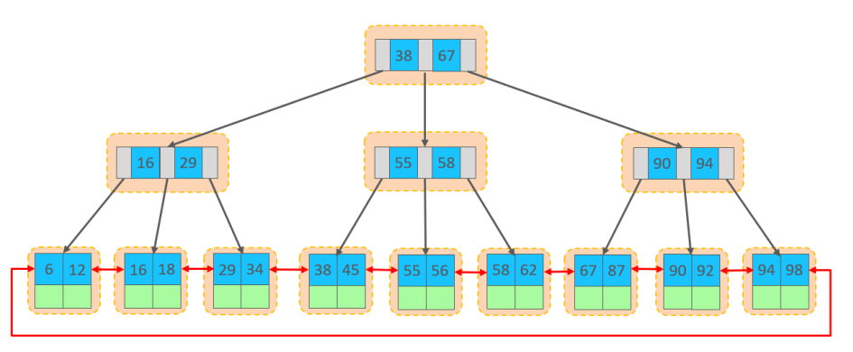

# SQL

## MySQL

mysql是一种关系型数据库

关系型数据库：建立在关系型数据模型上，由多张相互连接的二维表组成的数据库

### sql语句通用语法

- sql语句可以单行或者多行书写，以分号结尾
- sql语句可以使用空格或缩进来增强sql语句的可读性
- sql语句可以不区分大小写，但建议使用大写
- sql语句可以注释，使用#作为单行注释，使用/**/作为多行注释，在mysql中还可以使用#来进行单行注释

### mysql的启动与停止

```bash
# 启动
net start mysql80

#停止
net stop mysql80
```

### 客户端连接

1. 使用mysql的客户端连接，打开后输入密码
2. 使用系统命令行工具进行连接，输入`mysql [-h host] [-P port] -u user -p`

> 该方式需要配置系统的环境变量

## 数据类型

### 数值型

#### 1. 整数类型

| 类型 | 大小 | 有符号范围 | 无符号范围 | 描述 |
|------|------|------------|------------|------|
| TINYINT | 1byte | (-128，127) | (0，255) | 小整数值 |
| SMALLINT | 2bytes | (-32768，32767) | (0，65535) | 大整数值 |
| MEDIUMINT | 3bytes | (-8388608，8388607) | (0，16777215) | 大整数值 |
| INT/INTEGER | 4bytes | (-2147483648，2147483647) | (0，4294967295) | 大整数值 |
| BIGINT | 8bytes | (-2^63，2^63-1) | (0，2^64-1) | 极大整数值 |

#### 2. 浮点数类型

| 类型 | 大小 | 有符号范围 | 无符号范围 | 描述 |
|------|------|------------|------------|------|
| FLOAT | 4bytes | (-3.402823466 E+38，3.402823466351 E+38) | 0 和 (1.175494351 E-38，3.402823466 E+38) | 单精度浮点数值 |
| DOUBLE | 8bytes | (-1.7976931348623157 E+308，1.7976931348623157 E+308) | 0 和 (2.2250738585072014 E-308，1.7976931348623157 E+308) | 双精度浮点数值 |

#### 3. 精确数值类型

| 类型 | 大小 | 有符号范围 | 无符号范围 | 描述 |
|------|------|------------|------------|------|
| DECIMAL | - | 依赖于M(精度)和D(标度)的值 | 依赖于M(精度)和D(标度)的值 | 小数值(精确定点数) |

修饰符

- unsigned：表示为无符号
- auto_increment：表示自增

### 字符串

| 类型       | 大小                  | 描述                         |
| ---------- | --------------------- | ---------------------------- |
| CHAR       | 0-255 bytes           | 定长字符串(需要指定长度)     |
| VARCHAR    | 0-65535 bytes         | 变长字符串(需要指定长度)     |
| TINYBLOB   | 0-255 bytes           | 不超过255个字符的二进制数据  |
| TINYTEXT   | 0-255 bytes           | 短文本字符串                 |
| BLOB       | 0-65 535 bytes        | 二进制形式的长文本数据       |
| TEXT       | 0-65 535 bytes        | 长文本数据                   |
| MEDIUMBLOB | 0-16 777 215 bytes    | 二进制形式的中等长度文本数据 |
| MEDIUMTEXT | 0-16 777 215 bytes    | 中等长度文本数据             |
| LONGBLOB   | 0-4 294 967 295 bytes | 二进制形式的极大文本数据     |
| LONGTEXT   | 0-4 294 967 295 bytes | 极大文本数据                 |

char 与 varchar 都可以描述字符串，char是定长字符串，指定长度多长，就占用多少个字符，和字段值的长度无关 。而varchar是变长字符串，指定的长度为最大占用长度 。相对来说，char的性能会更高些。

### 日期类型

| 类型      | 大小 | 范围                                       | 格式                | 描述                     |
| --------- | ---- | ------------------------------------------ | ------------------- | ------------------------ |
| DATE      | 3    | 1000-01-01 至  9999-12-31                  | YYYY-MM-DD          | 日期值                   |
| TIME      | 3    | -838:59:59 至  838:59:59                   | HH:MM:SS            | 时间值或持续时间         |
| YEAR      | 1    | 1901 至 2155                               | YYYY                | 年份值                   |
| DATETIME  | 8    | 1000-01-01 00:00:00 至 9999-12-31 23:59:59 | YYYY-MM-DD HH:MM:SS | 混合日期和时间值         |
| TIMESTAMP | 4    | 1970-01-01 00:00:01 至 2038-01-19 03:14:07 | YYYY-MM-DD HH:MM:SS | 混合日期和时间值，时间戳 |

## 语句分类

### DDL语句

数据库定义语言，用于创建和删除数据库、表、字段

#### 数据库操作

- 查询所有数据库: show databases
- 查询当前使用的数据库：select database()
- 创建数据库：create database [if not exists] 数据库名 [default charset 字符集]
- 删除数据库：drop database [if exists] 数据库名
- 使用数据库：use 数据库名

#### 表操作

- 创建表：create table 表名(字段1 字段1类型 [约束] [comment  字段1注释 ],字段2  字段2类型 [约束]  [comment  字段2注释 ],......字段n  字段n类型 [约束]  [comment  字段n注释 ]) [ comment  表注释 ] ;
- 创建包含外键的表：create table (字段名 字段类型 字段约束 字段注释, ..., [constraint] [外键名称] foreign key (外键字段名) references 主表 主表(字段名))
- 删除表：drop table [if exists] 表名;
- 修改表名: rename table 表名 to 新表名;
- 查询表结构：desc 表名;
- 查询所有的表: show tables;
- 查询建表语句：show create table 表名;

#### 字段操作

- 添加字段：alter table 表名 add 字段名称 字段类型(长度) [comment 注释]  [约束]
- 添加字段外键约束： alter table 表名 add [constraint] [外键名称] foreign key (外键字段名) references 主表 主表(字段名))
- 修改字段类型：alter table 表名 modify 字段名称 字段类型(长度) [comment 注释]  [约束]
- 修改字段名称和类型：alter table 表名 change 旧名称字段 新名称字段 字段类型(长度) [comment 注释]  [约束]
- 删除字段：alter table 表名 drop column 字段名称
- 删除外键：alter table 表名 drop foreign key 字段名称

#### 字段约束

字段约束用于保证表中字段数据的正确性和完整性，是作用于字段的规则

- 默认约束 default：如果没有指定字段的值，则使用默认值
- 非空约束 not null：存储在表中的字段数据不能为null
- 唯一约束 unique：存储在表中的字段数据必须唯一，不能重复
- 主键约束 primary key：存储在表中的字段数据必须唯一且不能重复，并且不能为null
- 自增约束 auto_increment：字段值自动增长
- 外键约束 foreign key：让两张表建立联系，从而保证数据的完整性和一致性

### DML语句

数据库操作语句，用于对数据的增删改

- 添加表指定字段数据：insert into 表名(字段1,字段2,字段3) values（值1,值2,值3)\[,(值1,值2,值3)]
- 添加表所有字段数据：insert into 表名 values(值1,值2,值3,...),(值1,值2,值3,...)
- 修改表指定字段数据：update 表名 set 字段1=值1,字段2=值2,字段3=值3 [where 条件]
- 删除表指定字段数据：delete from 表名 [where 条件]

### DQL语句

#### 基本查询

1. 查询所有字段：select * from 表名
2. 查询多个字段：select 字段1,字段2[,...] from 表名
3. 查询后设置别名 select 字段1 [as] 字段1别名,字段2 from 表名
4. 查询后去除重复值 select distinct 字段列表 from 表名

#### 条件查询

基本语法

```bash
select 字段列表 from 表名 where 条件列表
```

运算符：条件列表中的条件运算符主要分为比较运算符和逻辑运算符

比较运算符：

- \>, >=, \<, \<=, =, !=：做相等和大小判断
- between A and B：在A与B的这个范围之内
- in (...)：值为in后面的列表之一
- like 占位符：模糊匹配，_匹配单个字符；%匹配任意个字符，包括0个；[] 可以匹配集合内的字符,用脱字符 ^ 可以对其进行否定
- is null：值为null，不能使用`=null`
- is not null：值不为null

逻辑运算符：

- and或者&&：逻辑与，同时满足
- or或者||；逻辑或，满足其中一个
- not或者!：逻辑非，不满足条件

#### 分组查询

分组查询语法：select 字段列表 from 表名 [where 条件列表] group by 分组字段名 [having 分组后过滤条件]

示例：select gender,count("date") as "date_count" from user where date <= "2021-12-21" group by date having count("date") > 10

where与having的区别：

- where是在分组之前使用，是对分组前的数据进行过滤，符合条件的才参与分组；having是对分组后的数据进行过滤
- where不能对聚合函数进行判断，having可以

```bash
聚合函数：将一列的数据作为一个整体，进行纵向计算。进行计算时，所有的null值不参与计算
- count：统计查询结果的数量
- min：统计某一列的最小值
- max：统计某一列的最大值
- avg：统计某一列的平均值
- sum：统计某一列的总和
```

#### 排序查询

排序查询，需要使用order by，支持两种排序方式，asc升序，desc降序，如果不写，默认为asc

基本语法：select 字段列表 from 表名 [where 条件列表] [group by 分组字段名] [having 分组后过滤条件] order by 排序字段1 [asc/desc],排序字段2 [asc/desc]...

#### 分页查询

分页查询中，需要使用limit，数据开始索引从0开始

基本语法为：select 字段列表 from 表名 [where 筛选条件] limit 数据开始索引，单页数量

#### 执行顺序

DQL中，语句的执行顺序为

from -> where -> group by -> having -> select -> order by -> limit

### DCL语句

数据库控制语言，用于操作数据库的用户及数据库访问权限

#### 用户管理

查询用户

```bash
use mysql
select * from user
```

创建用户

```bash
create user '用户名'@'主机名' identified by '密码'
create user '用户名'@'%' identified by '密码' # 任意主机都可以访问
```

修改密码

```bash
alter user '用户名'@'主机名' identified with mysql_native_password by "密码"
```

删除用户

```bash
drop user '用户名'@'主机名'
```

#### 权限控制

mysql中定义了很多种权限，常用的有以下几种：

- ALL：所有权限
- SELECT：数据查询权限
- INSERT：数据插入权限
- UPDATE：数据更新权限
- DELETE：数据删除权限
- CREATE：创建数据库、表的权限
- ALTER：修改表的权限
- DROP：删除数据库、表、视图的权限

查询用户拥有的权限

```bash
show grants for '用户名'@'主机名'
```

授予用户权限

```bash
grant 权限列表 on 数据库名.表名 to '用户名'@'主机名'
```

删除用户权限

```bash
revoke 权限列表 on 数据库名.表名 from '用户名'@'主机名'
```

## 多表设计

### 表间关系

1. 一对多/多对一

一对多主要通过外键约束来进行实现，外键约束是指一个表中的数据必须与另一个表中的数据一致，在多的一方建立外键，指向一的一方的主键

基本语法如下：

- 创建表时添加外键约束：create table 表名称 (字段名称 字段类型 字段约束,... ) CONSTRAINT 外键名称 FOREIGN KEY (外键字段) REFERENCES 主表名称 (主键字段))

- 添加外键约束：alter table 表名称 add constraint 外键名称 foreign key (外键字段) references 主表名称 (主键字段)

物理外键：

使用foreign key指定的外键是物理外键，使用物理外键有个以下几个缺点

- 影响增删改的效率，每次操作都需要检查外键关系
- 不适用于分布式、集群的情况
- 容易引发数据库死锁问题，影响性能

逻辑外键：

在逻辑层中，解决外键关联

2. 一对一

一对一常用于对复杂单表的拆分，将一个单表拆分为多个小的表，在任意一张表中添加外键，关联另一方的主键，并设置为外键为唯一

3. 多对多

多对多的实现通过建立第三张表成为中间表，中间表记录两个外键，分别对应另外两张表

### 多表查询

查询多张表中的数据

#### 连接查询

1. 内连接查询：查询两个表的交集

内连接查询有两种语法，分别是隐式内连接和显式内连接

- 隐式内连接语法：select * from 表1,表2 where 表1.字段=表2.字段;

- 显示内连接语法：select * from 表1 [inner] join 表2 on 表1.字段=表2.字段;

2. 左外连接查询：查询左表所有的数据，包含于右表交集的部分，语法如下：

select * from 表1 left [outer] join 表2 on 表1.字段=表2.字段;

3. 右外连接查询：查询右表所有的数据，包含于左表交集的部分，语法如下：

select * from 表1 right [outer] join 表2 on 表1.字段=表2.字段;

#### 联合查询

使用union或者union all关键字，将多次查询的结果合并起来，形成一个新的结果集

联合查询的多张表中，列数和字段类型必须保持一致

1. union：对合并后的数据会进行去重

```sql
select 字段列表 from 表名 条件
union
select 字段列表 from 表名 条件
```

2. union all：将所有数据合并在一起

```sql
select 字段列表 from 表名 条件
union all
select 字段列表 from 表名 条件
```

#### 子查询

1. 标量子查询：子查询返回的是一个单行单列的值，比如日期、数值、字符串、日期等，语法如下:

select * from 表名 where 字段名 [=|!=|>|>=|<|<=] (select 字段名 from 表名 where 条件);

2. 列子查询：子查询返回的是多行单列的值，子查询的结果常用于条件满足结果值其中一个的情况，语法如下：

select * from 表名 where 字段名 [in|not in] (select 字段名 from 表名 where 条件)

常用操作符：

- in：在指定的集合范围内，为其中一个
- not in：不在指定的集合范围内，不等于其中任何一个
- any、some：常与=、>等比较逻辑一起使用，表示满足任意一个
- all：常与=、>等比较逻辑一起使用，表示满足所有

3. 行子查询：子查询返回的结果是一行多列的值，子查询的结果常用于条件满足多个字段结果的情况，语法如下：

select * from 表名 where (字段1,字段2...) [=|!=|in|not in] (select 字段1,字段2... from 表名 where 条件)

4. 表子查询：子查询返回的结果是一个多行多列的值，子查询的结果常用于作为一张新的表，语法如下：

select e.\* from (select* from 表名 where 条件) as e [inner join|left join|right join|in] 表名 on e.id=表名.id

## 事务

### 事务简介

事务是一系列操作的集合，是数据库操作的一个单位，这些操作要么同时成功，要么同时失败

事务的控制包括开启事务、提交事务、回滚事务

### 事务操作

开启事务 start transaction / begin：事务的开头

提交事务 commit：事务提交给数据库软件执行

回滚事务 rollback：当事务失败后取消事务的所有操作

### 事务特性

- 原子性 Atomicity：事务是不可分割的最小单元，要么全部成功，要么全部失败
- 一致性 Consistency：事务完成后，所有数据必须保持一致性
- 隔离性 Isolation：事务的执行，是在不受外部并发的影响下在独立的环境中执行
- 持久性 Durability：事务一旦完成或者回滚，对数据的改变就是永久的

### 事务并发问题

#### 脏读

一个事务读到另一个事务未提交的数据

#### 不可重复读

一个事务先后读取同一条记录，但两次读取的数据不同

#### 幻读

一个事务按照条件查询某条记录时，没有查询到，但是在插入的时候，又发现这条数据存在

## 索引

索引是一种帮助高效查询数据的数据结构，这些数据结构以某种方式引用（指向）数据，这样就可以在这些数据结构上实现高级查找算法，但是更新、删除、新增的效率不高，同时索引会占用额外的硬盘空间

### 索引分类

|分类|含义|特点|关键字|
|----|----|----|----|
|主键索引|针对于表中主键创建的索引|默认自动创建，只能有一个|PRIMARY|
|唯一索引|避免同一个表中某数据列中的值重复|可以有多个|UNIQUE|
|常规索引|快速定位特定数据|可以有多个|-|
|全文索引|全文索引查找的是文本中的关键词，而不是比较索引中的值|可以有多个|FULLTEXT|

innodb中，根据索引的存储形式，可以分为：

1. 聚集索引l(Clustered Index)：

将数据存储与索引放到了一块，索引结构的叶子节点保存了行数据必须有，而且只有一个

聚集索引选取规则：

- 如果存在主键，主键索引就是聚集索引
- 如果不存在主键，将使用第一个唯一（UNIQUE）索引I作为聚集索引
- 如果表没有主键，或没有合适的唯一索引，则innoDB会自动生成一个rowid作为隐藏的聚集索引l

2. 二级索引(Secondary Index)：

将数据与索引分开存储，索引结构的叶子节点关联的是对应的主键，可以存在多个

### 索引语法

创建索引：create [unique] index 索引名称 on 表名(字段名,...)

查询索引：show index from 表名

删除索引：drop index 索引名 on 表名

建表时，如果之定义一个字段为主键，那么数据库会使用这个字段创建`主键索引`，如果指定了字段对应的值为唯一值，那么也会创建对应的`唯一索引`

### 性能分析

#### 执行频率

MySQL客户端连接成功后，通过show[session|global]status命令可以提供服务器状态信息。通过如下指令，可以查看当前数据库的
INSERT、UPDATE、DELETE、SELECT的访问频次：

```bash
SHOW GLOBAL|SESSION STATUS LIKE 'Com____'
```

#### 慢查询日志

慢查询日志记录了所有执行时间超过指定参数（long_query_time，单位：秒，默认10秒）的所有sQL语句的日志

MySQL的慢查询日志默认没有开启，需要在MySQL的配置文件（/etc/my.cnf）中配置如下信息：

```bash
# 开启MySQL慢日志查询开关
slow_query_log=1

# 设置慢日志的时间为2秒，SQL语句执行时间超过2秒，就会视为慢查询，记录慢查询日志
long_query_time=2
```

### 执行规则

1. 最左前缀法则

如果索引了多列（联合索引），要遵守最左前缀法则，最左前法则指的是查询从索引的最左列开始，并且不跳过索引中的列，如果跳跃某一列，索引将部分失效(后面的字段索引失效)，与字段的位置无关

2. 索引列运算

在索引列上使用了运算，索引列将失效

3. 字符串不加引号

字符串类型列使用时不加引号，索引列将失效

3. 模糊查询

如果仅仅是尾部模糊匹配，索引不会失效，如果是头部模糊匹配，索引失效

4. or连接条件

用or分割开的条件，如果or前的条件中的列有索引l，而后面的列中没有索引，那么涉及的索引都不会被用到

5. SQL提示

SQL提示，是优化数据库的一个重要手段，简单来说，就是在SQL语句中加入一些人为的提示来达到优化操作的目的

use index：建议使用索引

```sql
explain select * from tb_user use index(idx_user_pro) where profession = '软件工程';
```

ignore index：忽略索引

```sql
explain select * from tb_user ignore index(idx_user_pro) where profession = '软件工程';
```

force index：强制使用索引

```sql
explain select * from tb_user force index(idx_user_pro) where profession = '软件工程';
```

6. 前缀索引

当字段类型为字符串（varchar，text等）时，有时候需要索引很长的字符串，这会让索引变得很大，查询时，浪费大量的磁盘iO，影响查
询效率。此时可以只将字符串的一部分前缀建立索引，这样可以大大节约索引空间，从而提高索引效率

```sql
create index idx_xxxx on table_name(column(n)) ;
```

## SQL优化

### insert优化

1. 批量插入

```sql
insert into tb_test values(1,'Tom'),(2,'Cat'),(3,'Jerry');
```

2. 手动提交事务

```sql
start transaction;
insert into tb_test values(1,'Tom'),(2,'Cat'),(3,'Jerry');
insert into tb_test values(4,'Tom'),(5,'Cat'),(6,'Jerry');
insert into tb_test values(7,'Tom'),(8,'Cat'),(9,'Jerry');
commit;
```

3. 主键按顺序插入

```sql
主键乱序插入：82 18 8
主键顺序插入：8 21 88
```

4. 大批量插入数据
如果一次性需要插入大批量数据，使用insert语句插入性能较低，此时可以使用MySQL数据库提供的load指令进行插入

```sql
# 客户端连接服务端时，加上参数--local-infile
mysql --local-infile -u root -p
# 设置全局参数local_infile为1，开启从本地加载文件导入数据的开关
set global local_infile = 1;
# 执行load指令将准备好的数据，加载到表结构中
load data local infile '/root/sql1.log' into table tb_user fields terminated by ',' lines terminated by '\n';
```

### 主键优化

在InnoDB存储引擎中，表数据都是根据主键顺序组织存放的，这种存储方式的表称为索引组织表

行数据，都是存储在聚集索引的叶子节点上的



在InnoDB引擎中，数据行是记录在逻辑结构 page 页中的，而每一个页的大小是固定的，默认16K。
那也就意味着， 一个页中所存储的行也是有限的，如果插入的数据行row在该页存储不小，将会存储
到下一个页中，页与页之间会通过指针连接


页分裂:

页可以为空，也可以填充一半，也可以填充100%。每个页包含了2-N行数据(如果一行数据过大，会行
溢出)，根据主键排列

页合并：

当删除一行记录时，实际上记录并没有被物理删除，只是记录被标记（flaged）为删除并且它的空间
变得允许被其他记录声明使用

当页中删除的记录达到 MERGE_THRESHOLD（默认为页的50%），InnoDB会开始寻找最靠近的页（前
或后）看看是否可以将两个页合并以优化空间使用

### order by优化

MySQL的排序，有两种方式：

Using filesort : 通过表的索引或全表扫描，读取满足条件的数据行，然后在排序缓冲区sort
buffer中完成排序操作，所有不是通过索引直接返回排序结果的排序都叫 FileSort 排序

Using index : 通过有序索引顺序扫描直接返回有序数据，这种情况即为 using index，不需要
额外排序，操作效率高

对于以上的两种排序方式，Using index的性能高，而Using filesort的性能低，我们在优化排序
操作时，尽量要优化为 Using index

order by优化原则:

1. 根据排序字段建立合适的索引，多字段排序时，也遵循最左前缀法则。
2. 尽量使用覆盖索引。
3. 多字段排序, 一个升序一个降序，此时需要注意联合索引在创建时的规则（ASC/DESC）。
4. 如果不可避免的出现filesort，大数据量排序时，可以适当增大排序缓冲区sort_buffer_size大小(默认256k)

### limit优化

在数据量比较大时，如果进行limit分页查询，在查询时，越往后，分页查询效率越低

 一般分页查询时，通过创建`覆盖索引`能够比较好地提高性能，可以通过覆盖索引加子查
询形式进行优化

```sql
select * from tb_sku t , (select id from tb_sku order by id limit 2000000,10) a where t.id = a.id
```

### count优化

如果数据量很大，在执行count操作时，是非常耗时的

- MyISAM 引擎把一个表的总行数存在了磁盘上，因此执行 count(*) 的时候会直接返回这个
数，效率很高； 但是如果是带条件的count，MyISAM也慢。
- InnoDB 引擎就麻烦了，它执行 count(*) 的时候，需要把数据一行一行地从引擎里面读出
来，然后累积计数

如果说要大幅度提升InnoDB表的count效率，主要的优化思路：自己计数(可以借助于redis这样的数据库进行,但是如果是带条件的count又比较麻烦了)

count用法:

|count用法|含义|
|----|----|
|count(主键)|InnoDB 引擎会遍历整张表，把每一行的 主键id 值都取出来，返回给服务层。服务层拿到主键后，直接按行进行累加(主键不可能为null)|
|count(字段)|没有not null 约束 : InnoDB 引擎会遍历整张表把每一行的字段值都取出来，返回给服务层，服务层判断是否为null，不为null，计数累加。有not null 约束：InnoDB 引擎会遍历整表把每一行的字段值都取出来，返回给服务层，直接按行进行累加。|
|count(数字)|nnoDB 引擎遍历整张表，但不取值。服务层对于返回的每一行，放一个数字“1”进去，直接按行进行累加。|
|count(*)|nnoDB引擎并不会把全部字段取出来，而是专门做了优化，不取值，服务层直接按行进行累加|

按照效率排序的话，count(字段) < count(主键 id) < count(1) ≈ count(*)，所以尽量使用 count(\*)

### update优化

InnoDB的行锁是针对索引加的锁，不是针对记录加的锁 ,并且该索引不能失效，否则会从行锁升级为表锁

## 视图

视图（View）是一种虚拟存在的表。视图中的数据并不在数据库中实际存在，行和列数据来自定义视
图的查询中使用的表，并且是在使用视图时动态生成的

通俗的讲，视图只保存了查询的SQL逻辑，不保存查询结果。所以我们在创建视图的时候，主要的工作
就落在创建这条SQL查询语句上

### 语法

1. 创建

```sql
CREATE [OR REPLACE] VIEW 视图名称[(列名列表)] AS SELECT语句 [ WITH [CASCADED | LOCAL ] CHECK OPTION ]
```

2. 查询

```sql
# 查看创建视图语句
SHOW CREATE VIEW 视图名称;

# 查看视图数据
SELECT * FROM 视图名称 ...... ;
```

3. 修改

```sql
# 方式一
CREATE [OR REPLACE] VIEW 视图名称[(列名列表)] AS SELECT语句 [ WITH[ CASCADED | LOCAL ] CHECK OPTION ]
# 方式二
ALTER VIEW 视图名称[(列名列表)] AS SELECT语句 [ WITH [ CASCADED |LOCAL ] CHECK OPTION ]
```

4. 删除

```sql
DROP VIEW [IF EXISTS] 视图名称 [,视图名称] ...
```

### 检查选项

当使用WITH CHECK OPTION子句创建视图时，MySQL会通过视图检查正在更改的每个行，例如 插入，更新，删除，以使其符合视图的定义。 MySQL允许基于另一个视图创建视图，它还会检查依赖视图中的规则以保持一致性。为了确定检查的范围，mysql提供了两个选项： CASCADED 和 LOCAL ，默认值为 CASCADE

CASCADED 级联：

v2视图是基于v1视图的，如果在v2视图创建的时候指定了检查选项为 cascaded，但是v1视图创建时未指定检查选项。 则在执行检查时，不仅会检查v2，还会级联检查v2的关联视图v1

LOCAL 本地：

v2视图是基于v1视图的，如果在v2视图创建的时候指定了检查选项为 local ，但是v1视图创建时未指定检查选项。 则在执行检查时，只会检查v2，不会检查v2的关联视图v1

## 存储过程

### 定义

存储过程是事先经过编译并存储在数据库中的一段 SQL 语句的集合，调用存储过程可以简化应用开发人员的很多工作，减少数据在数据库和应用服务器之间的传输，对于提高数据处理的效率是有好处的。

存储过程思想上很简单，就是数据库 SQL 语言层面的代码封装与重用

### 特点

封装，复用：可以把某一业务SQL封装在存储过程中，需要用到的时候直接调用即可

可以接收参数，也可以返回数据：再存储过程中，可以传递参数，也可以接收返回值

减少网络交互，效率提升：如果涉及到多条SQL，每执行一次都是一次网络传输。 而如果封装在存储过程中，我们只需要网络交互一次可能就可以了

### 语法

1. 创建

```sql
CREATE PROCEDURE 存储过程名称 ([ 参数列表 ])
BEGIN
 -- SQL语句
END ;


# 在命令行中，执行创建存储过程的SQL时，需要通过关键字 delimiter 指定SQL语句的结束符

delimiter $$

CREATE PROCEDURE 存储过程名称 ([ 参数列表 ])
BEGIN
 -- SQL语句
END$$
```

2. 调用

```sql
CALL 储过程 ([ 参数 ]);
```

3. 查看

```sql
SELECT * FROM INFORMATION_SCHEMA.ROUTINES WHERE ROUTINE_SCHEMA = 'xxx'; -- 查询指定数据库的存储过程及状态信息
SHOW CREATE PROCEDURE 存储过程名称 ; -- 查询某个存储过程的定义
```

4. 删除

```sql
DROP PROCEDURE [ IF EXISTS ] 存储过程名称;
```

### 变量

在MySQL中变量分为三种类型: 系统变量、用户定义变量、局部变量

#### 系统变量

系统变量 是MySQL服务器提供，不是用户定义的，属于服务器层面。分为全局变量（GLOBAL）、会话变量（SESSION）

全局变量(GLOBAL): 针对于所有的会话

会话变量(SESSION): 针对于单个会话，在另外一个会话窗口就不生效了

如果没有指定SESSION/GLOBAL，默认是SESSION，会话变量

查看系统变量：

```sql
SHOW [ SESSION | GLOBAL ] VARIABLES ; -- 查看所有系统变量
SHOW [ SESSION | GLOBAL ] VARIABLES LIKE '......'; -- 可以通过LIKE模糊匹配方式查找变量
SELECT @@[SESSION | GLOBAL].系统变量名; -- 查看指定变量的值
```

设置系统变量:

```sql
SET [ SESSION | GLOBAL ] 系统变量名 = 值 ;
SET @@[SESSION | GLOBAL].系统变量名 = 值 ;
```

mysql服务重新启动之后，所设置的全局参数会失效，要想不失效，可以在 /etc/my.cnf 中配置

#### 用户定义变量

用户定义变量 是用户根据需要自己定义的变量，用户变量不用提前声明，在用的时候直接用 "@变量名" 使用就可以。其作用域为当前连接

设置用户定义变量：

```sql
SET @var_name = expr [, @var_name = expr] ... ; 
SET @var_name := expr [, @var_name := expr] ... ;

SELECT @var_name := expr [, @var_name := expr] ... ; 
SELECT 字段名 INTO @var_name FROM 表名;
```

查看用户定义变量：

```sql
SELECT @var_name;
```

> 用户定义的变量无需对其进行声明或初始化，只不过获取到的值为NULL

#### 局部变量

局部变量 是根据需要定义的在局部生效的变量，访问之前，需要DECLARE声明。可用作存储过程内的局部变量和输入参数，局部变量的范围是在其内声明的BEGIN ... END块

声明局部变量：

```sql
DECLARE 变量名 变量类型 [DEFAULT ... ] ;
```

> 变量类型就是数据库字段类型：INT、BIGINT、CHAR、VARCHAR、DATE、TIME等

赋值局部变量：

```sql
SET 变量名 = 值 ;
SET 变量名 := 值 ;
SELECT 字段名 INTO 变量名 FROM 表名 ... 
```

### if判断

if 用于做条件判断，具体的语法结构为：

```sql
IF 条件1 THEN 
 .....
ELSEIF 条件2 THEN -- 可选
 .....
ELSE -- 可选
 .....
END IF;
```

在if条件判断的结构中，ELSE IF 结构可以有多个，也可以没有。 ELSE结构可以有，也可以没有

### case

语法1：

```sql
CASE case_value
 WHEN when_value1 THEN statement_list1
 [ WHEN when_value2 THEN statement_list2] ...
 [ ELSE statement_list ]
END CASE;
```

语法2：

```sql
CASE
 WHEN search_condition1 THEN statement_list1
 [WHEN search_condition2 THEN statement_list2] ...
 [ELSE statement_list]
END CASE;
```

### 循环

#### while循环

while 循环是有条件的循环控制语句。满足条件后，再执行循环体中的SQL语句

```sql
WHILE 条件 DO
 SQL逻辑...
END WHILE;
```

#### repeat循环

repeat是有条件的循环控制语句, 当满足until声明的条件的时候，则退出循环

```sql
REPEAT
 SQL逻辑... 
 UNTIL 条件
END REPEAT;
```

#### loop循环

LOOP 实现简单的循环，如果不在SQL逻辑中增加退出循环的条件，可以用其来实现简单的死循环

```sql
[begin_label:] LOOP
 SQL逻辑... 
END LOOP [end_label];
```

LOOP可以配合一下两个语句使用：

- LEAVE ：配合循环使用，退出循环。
- ITERATE：必须用在循环中，作用是跳过当前循环剩下的语句，直接进入下一次循环

```sql
LEAVE label; -- 退出指定标记的循环体
ITERATE label; -- 直接进入下一次循环
```

### 游标

游标（CURSOR）是用来存储查询结果集的数据类型 , 在存储过程和函数中可以使用游标对结果集进行循环的处理。游标的使用包括游标的声明、OPEN、FETCH 和 CLOSE

声明游标：

```sql
DECLARE 游标名称 CURSOR FOR 查询语句
```

打开游标:

```sql
OPEN 游标名称
```

获取游标记录:

```sql
FETCH 游标名称 INTO 变量 [, 变量 ]
```

关闭游标:

```sql
CLOSE 游标名称
```

#### 条件处理程序

条件处理程序（Handler）可以用来定义在流程控制结构执行过程中遇到问题时相应的处理步骤。具体语法为：

```sql
DECLARE handler_action HANDLER FOR condition_value [, condition_value] ... statement ;

handler_action 的取值： 
 CONTINUE: 继续执行当前程序
 EXIT: 终止执行当前程序
 
condition_value 的取值： 
 SQLSTATE: 状态码，如 02000
 SQLWARNING: 所有以01开头的SQLSTATE代码的简写
 NOT FOUND: 所有以02开头的SQLSTATE代码的简写
 SQLEXCEPTION: 所有没有被SQLWARNING 或 NOT FOUND捕获的SQLSTATE代码的简写
 ```

### 参数

参数的类型，主要分为以下三种：IN、OUT、INOUT

|类型 |含义| 备注|
|---- |----| ----|
|IN |该类参数作为输入，也就是需要调用时传入值| 默认|
|OUT| 该类参数作为输出，也就是该参数可以作为返回值|
|INOUT |既可以作为输入参数，也可以作为输出参数 |

用法：

```sql
CREATE PROCEDURE 存储过程名称 ([ IN/OUT/INOUT 参数名 参数类型 ])
BEGIN
 -- SQL语句
END ;
```

### 存储函数

存储函数是有返回值的存储过程，存储函数的参数只能是IN类型的

```sql
CREATE FUNCTION 存储函数名称 ([ 参数列表 ])
RETURNS type [characteristic ...]
BEGIN
 -- SQL语句
 RETURN ...;
END ;
```

characteristic说明：

- DETERMINISTIC：相同的输入参数总是产生相同的结果
- NO SQL：不包含 SQL 语句。
- READS SQL DATA：包含读取数据的语句，但不包含写入数据的语句

## 触发器

触发器是与表有关的数据库对象，指在insert/update/delete之前(BEFORE)或之后(AFTER)，触发并执行触发器中定义的SQL语句集合。触发器的这种特性可以协助应用在数据库端确保数据的完整性 , 日志记录 , 数据校验等操作

使用别名OLD和NEW来引用触发器中发生变化的记录内容，这与其他的数据库是相似的。现在触发器还只支持行级触发，不支持语句级触发

|触发器类型|NEW和OLD|
|----|----|
|INSERT 型触发器 |NEW 表示将要或者已经新增的数据|
|UPDATE 型触发器 |OLD 表示修改之前的数据 , NEW 表示将要或已经修改后的数据|
|DELETE 型触发器 |OLD 表示将要或者已经删除的数据|

创建触发器

```sql
CREATE TRIGGER trigger_name 
BEFORE/AFTER INSERT/UPDATE/DELETE
ON tbl_name FOR EACH ROW -- 行级触发器
BEGIN
 trigger_stmt ;
END;
```

查看触发器

```sql
SHOW TRIGGERS
```

删除触发器

```sql
DROP TRIGGER [schema_name.]trigger_name ; -- 如果没有指定 schema_name，默认为当前数据库
```

## 锁

锁是计算机协调多个进程或线程并发访问某一资源的机制。在数据库中，除传统的计算资源（CPU、RAM、I/O）的争用以外，数据也是一种供许多用户共享的资源。如何保证数据并发访问的一致性、有效性是所有数据库必须解决的一个问题，锁冲突也是影响数据库并发访问性能的一个重要因素。从这个角度来说，锁对数据库而言显得尤其重要，也更加复杂

MySQL中的锁，按照锁的粒度分，分为以下三类：

全局锁：锁定数据库中的所有表

表级锁：每次操作锁住整张表

行级锁：每次操作锁住对应的行数据

### 全局锁

全局锁就是对整个数据库实例加锁，加锁后整个实例就处于只读状态，后续的DML的写语句，DDL语句，已经更新操作的事务提交语句都将被阻塞。

其典型的使用场景是做全库的逻辑备份，对所有的表进行锁定，从而获取一致性视图，保证数据的完整性

加全局锁

```sql
flush tables with read lock;
```

释放全局锁

```sql
unlock tables;
```

### 表级锁

表级锁，每次操作锁住整张表。锁定粒度大，发生锁冲突的概率最高，并发度最低。应用在MyISAM、InnoDB、BDB等存储引擎中

对于表级锁，主要分为以下三类:

1. 表锁

对于表锁，分为两类：表共享读锁（read lock），表独占写锁（write lock）

加锁

```sql
lock tables 表名... read/write
```

释放锁

```sql
unlock tables 或者 客户端断开连接
```

> 读锁不会阻塞其他客户端的读，但是会阻塞写。写锁既会阻塞其他客户端的读，又会阻塞其他客户端的写，但是不会影响当前客户端的读写

2. 元数据锁

元数据锁，简写MDL，MDL加锁过程是系统自动控制，无需显式使用，在访问一张表的时候会自动加上

MDL锁主要作用是维护表元数据的数据一致性，在表上有活动事务的时候，不可以对元数据进行写入操作。为了避免DML与DDL冲突，保证读写的正确性

元数据可以简单理解为就是一张表的表结构。 也就是说，某一张表涉及到未提交的事务时，是不能够修改这张表的表结构的

当对一张表进行增删改查的时候，加MDL读锁(共享)；当对表结构进行变更操作的时候，加MDL写锁(排他)

3. 意向锁

为了避免DML在执行时，加的行锁与表锁的冲突，在InnoDB中引入了意向锁，使得表锁不用检查每行数据是否加锁，使用意向锁来减少表锁的检查

### 行级锁

行级锁，每次操作锁住对应的行数据。锁定粒度最小，发生锁冲突的概率最低，并发度最高，应用在InnoDB存储引擎中

InnoDB的数据是基于索引组织的，行锁是通过对索引上的索引项加锁来实现的，而不是对记录加的锁

1. 行锁（Record Lock）

锁定单个行记录的锁，防止其他事务对此行进行update和delete。在RC、RR隔离级别下都支持

共享锁（S）：允许一个事务去读一行，阻止其他事务获得相同数据集的排它锁

排他锁（X）：允许获取排他锁的事务更新数据，阻止其他事务获得相同数据集的共享锁和排他锁

常见的SQL语句，在执行时，所加的行锁如下

|SQL |行锁类型 |说明|
|----|----|----|
|INSERT ... |排他锁 |自动加锁|
|UPDATE ... |排他锁| 自动加锁|
|DELETE ... |排他锁| 自动加锁|
|SELECT（正常）|不加任何锁|
|SELECT ... LOCK IN SHARE MODE| 共享锁| 需要手动在SELECT之后加LOCK IN SHARE MODE|
|SELECT ... FOR UPDATE |排他锁| 需要手动在SELECT之后加FOR UPDATE|

2. 间隙锁（Gap Lock）

锁定索引记录间隙（不含该记录），确保索引记录间隙不变，防止其他事务在这个间隙进行insert，产生幻读。在RR隔离级别下都支持

默认情况下，InnoDB在 REPEATABLE READ事务隔离级别运行，InnoDB使用 next-key 锁进行搜索和索引扫描，以防止幻读

- 索引上的等值查询(唯一索引)，给不存在的记录加锁时, 优化为间隙锁
- 索引上的等值查询(非唯一普通索引)，向右遍历时最后一个值不满足查询需求时，next-key lock 退化为间隙锁
- 索引上的范围查询(唯一索引)--会访问到不满足条件的第一个值为止

间隙锁唯一目的是防止其他事务插入间隙。间隙锁可以共存，一个事务采用的间隙锁不会阻止另一个事务在同一间隙上采用间隙锁

3. 临键锁（Next-Key Lock）

行锁和间隙锁组合，同时锁住数据，并锁住数据前面的间隙Gap。在RR隔离级别下支持

## 函数

函数是指一段可以被直接调用的程序或者代码

### 聚合函数

分组查询中，经常会用到聚合函数，常见的聚合函数有以下几种：

- count(字段/*)：根据某个字段统计数量
- max(字段)：某个字段为表中最大值的数据
- min(字段)：某个字段为表中最小值的数据
- avg(字段)：计算某个字段的平均值
- sum(字段)：计算某个字段之和

### 字符串函数

- LEFT(str,len)：左边的len个字符
- RIGHT(str,len)：右边的len个字符
- CONCAT(S1,S2,...,Sn)：字符串拼接
- LOWER(str)：转换为小写字符
- UPPER(str)：转换为大写字符
- LTRIM(str)：去除左边的空格
- RTRIM(str)：去除右边的空格
- TRIM(str)：去除字符串两边的空格
- LENGTH(str)：长度
- LPAD(str,len,s)：用s左填充str到长度len
- RPAD(str,len,s)：用s右填充str到长度len
- SUBSTRING(str,from,len)：从str截取字符串str的len个字符
- OUNDEX()：转换为语音值

### 日期和时间处理

日期格式为`YYYY-MM-DD`，时间格式为`HH:MM:SS`

- CurDate()：返回当前日期
- CurTime()：返回当前时间
- NOW()：当前的日期和时间
- date_add(date,interval count type)：将日期增加count个type
- Date_Format(date,format)：返回一个格式化的日期或时间串
- DateDiff(date1, date2)：计算两个日期相差的天数，date1减date2
- AddTime()：增加一个时间(时、分)等
- Date('2020-12-12 22:23:12')：返回日期时间的日期部分
- DayOfWeek(date)：对于一个日期，返回对应的星期几
- Year(date)：返回一个日期的年份部分
- Month(date)：返回一个日期的月份部分
- Day(date)：返回一个日期的天数部分
- Hour(date)：返回一个时间的小时部分
- Minute(date)：返回一个时间的分钟部分
- Second()：返回一个时间的秒部分
- Time()：返回一个日期时间的时间部分

### 数值函数

- SIN()：正弦
- COS()：余弦
- TAN()：正切
- ABS()：绝对值
- SQRT()：平方根
- MOD(x, y)：取x/y的模(余数)
- FLOOR(X)：向下取整
- CEIL(x)：向上取整
- ROUND(x, y)：求参数x的四舍五入值，保留y位小数
- EXP()：指数
- PI()：圆周率
- RAND()：0-1的随机数

### 流程函数

- if(value, t, f)：如果value为true，则返回t，否则返回f
- ifnull(value1,value2)：如果value1不为空则返回，否则返回value2
- case when exp then res1,...else [default] end：如果val1为true，则返回res1,..，否则返回default默认值，when和then可以有多个，以end结尾
- case exp when val1 then res1,...else [default] end：如果exp等于val1，则返回res1,...，否则返回default默认值，when和then可以有多个，以end结尾

## SQL 的执行过程详解

### MySQL 驱动

MySQL 驱动在底层帮我们做了对数据库的连接，只有建立了连接了，才能够有后面的交互

java 系统在通过 MySQL 驱动和 MySQL 数据库连接的时候是基于 TCP/IP 协议的，所以如果每个请求都是新建连接和销毁连接，多线程请求的时候频繁的创建和销毁连接显然是不合理的，这样势必会造成不必要的浪费和性能的下降

数据库连接池：维护一定的连接数，方便系统获取连接，使用就去池子中获取，用完放回去就可以了。常见的数据库连接池有 Druid、C3P0、DBCP

MySQL 的架构体系中也已经提供了这样的一个池子，也是数据库连池。双方都是通过数据库连接池来管理各个连接的，这样一方面线程之前不需要是争抢连接，更重要的是不需要反复的创建的销毁连接

MySQL语句执行流程如下：


### 存储引擎

真正执行 SQL 的动作是在存储引擎中完成的。数据是被存放在内存或者是磁盘中的，执行器最终根据一系列的执行计划去调用存储引擎的接口去完成 SQL 的执行

存储引擎就是存储数据、建立索引、更新/查询数据等技术的实现方式，存储引擎是基于表的，而不是基于库的，所以存储引擎也可被称为表类型

查看所有支持的引擎使用命令`show engines`

#### 缓冲池

SQL 语句对应的数据要么是在内存中，要么是在磁盘中，如果直接在磁盘中操作，那这样的随机IO读写的速度肯定让人无法接受的，所以每次在执行 SQL 的时候都会将其数据加载到内存中，这块内存就是 InnoDB 中一个非常重要的组件：缓冲池 `Buffer Pool`

Buffer Pool （缓冲池）是 InnoDB 存储引擎中非常重要的内存结构，顾名思义，缓冲池其实就是类似 Redis 一样的作用，起到一个缓存的作用，因为我们都知道 MySQL 的数据最终是存储在磁盘中的，如果没有这个 Buffer Pool 那么我们每次的数据库请求都会磁盘中查找，这样必然会存在 IO 操作，这肯定是无法接受的。但是有了 Buffer Pool 就是我们第一次在查询的时候会将查询的结果存到 Buffer Pool 中，这样后面再有请求的时候就会先从缓冲池中去查询，如果没有再去磁盘中查找，然后在放到 Buffer Pool 中

有了缓冲池，存储引擎的执行顺序：

1. InnoDB存储引擎会在缓冲池中查找 id=1 的这条数据是否存在
2. 发现不存在，那么就会去磁盘中加载，并将其存放在缓冲池中
3. 该条记录会被加上一个独占锁

#### undo日志

Innodb 存储引擎的最大特点就是支持事务，如果本次更新失败，也就是事务提交失败，那么该事务中的所有的操作都必须回滚到执行前的样子，也就是说当事务失败的时候，也不会对原始数据有影响

在准备更新一条语句的时候，该条语句已经被加载到 Buffer pool 中了，实际上这里还有这样的操作，就是在将该条语句加载到 Buffer Pool 中的时候同时会往 undo 日志文件中插入一条日志，也就是将 id=1 的这条记录的原来的值记录下来

#### redo日志

redo日志(重做日志)是 InnoDB 特有的，他是存储引擎级别的，不是 MySQL 级别的

MySQL 中数据是以页为单位，你查询一条记录，会从硬盘把一页的数据加载出来，加载出来的数据叫数据页，会放入到 Buffer Pool 中

后续的查询都是先从 Buffer Pool 中找，没有命中再去硬盘加载，减少硬盘 IO 开销，提升性能

更新表数据的时候，也是如此，发现 Buffer Pool 里存在要更新的数据，就直接在 Buffer Pool 里更新

然后会把“在某个数据页上做了什么修改”记录到重做日志缓存（redo log buffer）里，接着刷盘到 redo log 文件里

存储引擎流程图如下：


#### bin日志

binlog 是逻辑日志，记录内容是语句的原始逻辑，类似于“给 ID=2 这一行的 c 字段加 1”，属于MySQL Server 层

不管用什么存储引擎，只要发生了表数据更新，都会产生 binlog 日志

binlog 会记录所有涉及更新数据的逻辑操作，并且是顺序写，可以用来同步数据，保证数据一致性

binlog 日志有三种格式，可以通过binlog_format参数指定

1. STATEMENT

默认值，记录每条语句的完整内容，同步数据时，会执行记录的SQL语句，但是有个问题，update_time=now()这里会获取当前系统时间，直接执行会导致与原库的数据不一致

2. row

记录的内容不再是简单的SQL语句了，还包含操作的具体数据

3. mixed

记录的内容是前两者的混合，MySQL 会判断这条SQL语句是否可能引起数据不一致，如果是，就用row格式，否则就用statement格式
