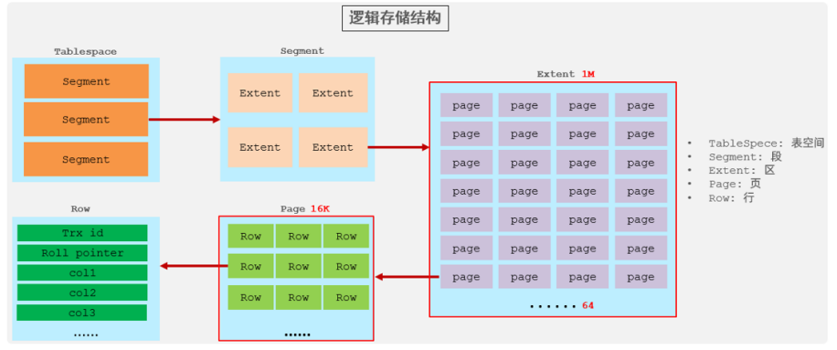

# SQL优化

## insert优化

1. 批量插入

```sql
insert into tb_test values(1,'Tom'),(2,'Cat'),(3,'Jerry');
```

2. 手动提交事务

```sql
start transaction;
insert into tb_test values(1,'Tom'),(2,'Cat'),(3,'Jerry');
insert into tb_test values(4,'Tom'),(5,'Cat'),(6,'Jerry');
insert into tb_test values(7,'Tom'),(8,'Cat'),(9,'Jerry');
commit;
```

3. 主键按顺序插入

```sql
主键乱序插入：82 18 8
主键顺序插入：8 21 88
```

4. 大批量插入数据
如果一次性需要插入大批量数据，使用insert语句插入性能较低，此时可以使用MySQL数据库提供的load指令进行插入

```sql
# 客户端连接服务端时，加上参数--local-infile
mysql --local-infile -u root -p
# 设置全局参数local_infile为1，开启从本地加载文件导入数据的开关
set global local_infile = 1;
# 执行load指令将准备好的数据，加载到表结构中
load data local infile '/root/sql1.log' into table tb_user fields terminated by ',' lines terminated by '\n';
```

## 主键优化

在InnoDB存储引擎中，表数据都是根据主键顺序组织存放的，这种存储方式的表称为索引组织表

行数据，都是存储在聚集索引的叶子节点上的


在InnoDB引擎中，数据行是记录在逻辑结构 page 页中的，而每一个页的大小是固定的，默认16K。
那也就意味着， 一个页中所存储的行也是有限的，如果插入的数据行row在该页存储不小，将会存储
到下一个页中，页与页之间会通过指针连接



页分裂:

页可以为空，也可以填充一半，也可以填充100%。每个页包含了2-N行数据(如果一行数据过大，会行
溢出)，根据主键排列

页合并：

当删除一行记录时，实际上记录并没有被物理删除，只是记录被标记（flaged）为删除并且它的空间
变得允许被其他记录声明使用

当页中删除的记录达到 MERGE_THRESHOLD（默认为页的50%），InnoDB会开始寻找最靠近的页（前
或后）看看是否可以将两个页合并以优化空间使用

## order by优化

MySQL的排序，有两种方式：

Using filesort : 通过表的索引或全表扫描，读取满足条件的数据行，然后在排序缓冲区sort
buffer中完成排序操作，所有不是通过索引直接返回排序结果的排序都叫 FileSort 排序

Using index : 通过有序索引顺序扫描直接返回有序数据，这种情况即为 using index，不需要
额外排序，操作效率高

对于以上的两种排序方式，Using index的性能高，而Using filesort的性能低，我们在优化排序
操作时，尽量要优化为 Using index

order by优化原则:

1. 根据排序字段建立合适的索引，多字段排序时，也遵循最左前缀法则。
2. 尽量使用覆盖索引。
3. 多字段排序, 一个升序一个降序，此时需要注意联合索引在创建时的规则（ASC/DESC）。
4. 如果不可避免的出现filesort，大数据量排序时，可以适当增大排序缓冲区sort_buffer_size大小(默认256k)

## limit优化

在数据量比较大时，如果进行limit分页查询，在查询时，越往后，分页查询效率越低

 一般分页查询时，通过创建`覆盖索引`能够比较好地提高性能，可以通过覆盖索引加子查
询形式进行优化

```sql
select * from tb_sku t , (select id from tb_sku order by id limit 2000000,10) a where t.id = a.id
```

## count优化

如果数据量很大，在执行count操作时，是非常耗时的

- MyISAM 引擎把一个表的总行数存在了磁盘上，因此执行 count(*) 的时候会直接返回这个
数，效率很高； 但是如果是带条件的count，MyISAM也慢。
- InnoDB 引擎就麻烦了，它执行 count(*) 的时候，需要把数据一行一行地从引擎里面读出
来，然后累积计数

如果说要大幅度提升InnoDB表的count效率，主要的优化思路：自己计数(可以借助于redis这样的数据库进行,但是如果是带条件的count又比较麻烦了)

count用法:

|count用法|含义|
|----|----|
|count(主键)|InnoDB 引擎会遍历整张表，把每一行的 主键id 值都取出来，返回给服务层。服务层拿到主键后，直接按行进行累加(主键不可能为null)|
|count(字段)|没有not null 约束 : InnoDB 引擎会遍历整张表把每一行的字段值都取出来，返回给服务层，服务层判断是否为null，不为null，计数累加。有not null 约束：InnoDB 引擎会遍历整表把每一行的字段值都取出来，返回给服务层，直接按行进行累加。|
|count(数字)|nnoDB 引擎遍历整张表，但不取值。服务层对于返回的每一行，放一个数字“1”进去，直接按行进行累加。|
|count(*)|nnoDB引擎并不会把全部字段取出来，而是专门做了优化，不取值，服务层直接按行进行累加|

按照效率排序的话，count(字段) < count(主键 id) < count(1) ≈ count(*)，所以尽量使用 count(\*)

## update优化

InnoDB的行锁是针对索引加的锁，不是针对记录加的锁 ,并且该索引不能失效，否则会从行锁升级为表锁
