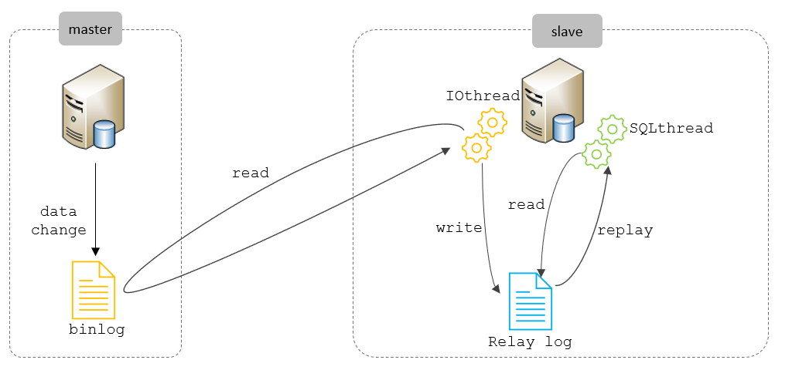
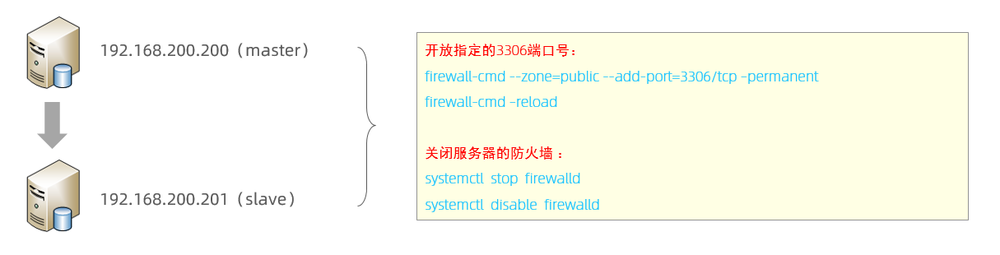

# 主从复制

## 定义

主从复制是指将主数据库的 DDL 和 DML 操作通过二进制日志传到从库服务器中，然后在从库上对这些日志重新执行（也叫重做），从而使得从库和主库的数据保持同步

## 应用场景

- 主库出现问题，可以快速切换到从库提供服务
- 实现读写分离，降低主库的访问压力
- 可以在从库中执行备份，以避免备份期间影响主库服务

## 原理

MySQL主从复制的核心就是 二进制日志，具体的过程如下



从上图来看，复制分成三步：

1. Master 主库在事务提交时，会把数据变更记录在二进制日志文件Binlog中
2. 从库读取主库的二进制日志文件Binlog ，写入到从库的中继日志Relay Log
3. slave重做中继日志中的事件，将改变反映它自己的数据

## 搭建

### 服务器准备

准备好两台服务器之后，在上述的两台服务器中分别安装好MySQL，并完成基础的初始化准备(安装、密码配置等操作)工作



### 主库配置

1. 修改配置文件 /etc/my.cnf

```bash
# mysql 服务ID，保证整个集群环境中唯一，取值范围：1 – 232-1，默认为1
server-id=1
# 是否只读,1 代表只读, 0 代表读写
read-only=0
# 忽略的数据, 指不需要同步的数据库
# binlog-ignore-db=mysql
# 指定同步的数据库
# binlog-do-db=db01
```

2. 重启MySQL服务器

```bash
systemctl restart mysqld
```

3. 登录mysql，创建远程连接的账号，并授予主从复制权限

```bash
# 创建itcast用户，并设置密码，该用户可在任意主机连接该MySQL服务
CREATE USER 'itcast'@'%' IDENTIFIED WITH mysql_native_password BY 'Root@123456';
# 为 'itcast'@'%' 用户分配主从复制权限
GRANT REPLICATION SLAVE ON *.* TO 'itcast'@'%';
```

4. 通过指令，查看二进制日志坐标

```bash
show master status ;
```

- file : 从哪个日志文件开始推送日志文件
- position ： 从哪个位置开始推送日志
- binlog_ignore_db : 指定不需要同步的数据库

### 从库配置

1. 修改配置文件 /etc/my.cnf

```bash
# mysql 服务ID，保证整个集群环境中唯一，取值范围：1 – 2^32-1，和主库不一样即可
server-id=2
# 是否只读,1 代表只读, 0 代表读写
read-only=1
```

2. 重新启动MySQL服务

```bash
systemctl restart mysqld
```

3. 登录mysql，设置主库配置

8.0.23及以后

```bash
CHANGE REPLICATION SOURCE TO SOURCE_HOST='192.168.200.200', SOURCE_USER='itcast',
SOURCE_PASSWORD='Root@123456', SOURCE_LOG_FILE='binlog.000004',
SOURCE_LOG_POS=663;
```

8.0.23 之前

```bash
CHANGE MASTER TO MASTER_HOST='192.168.200.200', MASTER_USER='itcast',
MASTER_PASSWORD='Root@123456', MASTER_LOG_FILE='binlog.000004',
MASTER_LOG_POS=663;
```

4. 开启同步操作

```bash
start replica ; # 8.0.22之后
start slave ; # 8.0.22之前
```

5. 查看主从同步状态

```bash
show replica status ; # 8.0.22之后
show slave status ; # 8.0.22之前
```
