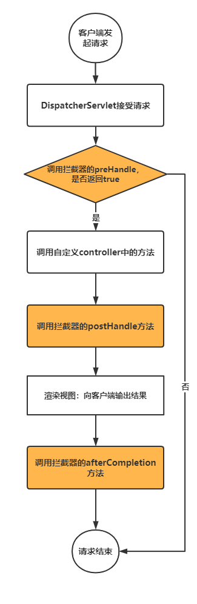
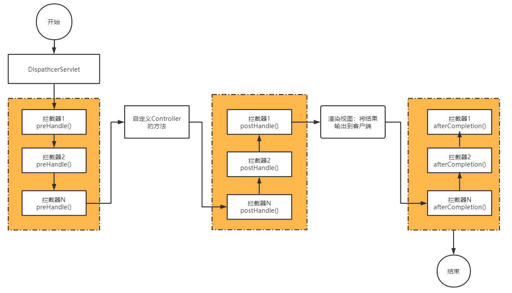

# Spring框架

## Spring Framework

### IoC容器

IoC也被称为依赖注入（DI）。它是一个过程，对象仅通过构造参数、工厂方法的参数或在对象实例被构造或从工厂方法返回后在其上设置的属性来定义其依赖关系（即它们与之合作的其他对象）。然后容器在创建 bean 时注入这些依赖关系。这个过程从根本上说是Bean本身通过使用直接构建类或诸如服务定位模式的机制来控制其依赖关系的实例化或位置的逆过程（因此被称为控制反转）

### bean

一个Spring IoC容器管理着一个或多个Bean。这些Bean是用你提供给容器的配置元数据创建的（例如，以XML <bean/> 定义的形式）。

在容器本身中，这些Bean定义被表示为 BeanDefinition 对象，它包含（除其他信息外）以下元数据。

- 一个全路径类名：通常，被定义的Bean的实际实现类。
- Bean的行为配置元素，它说明了Bean在容器中的行为方式（scope、生命周期回调，等等）。
- 对其他Bean的引用，这些Bean需要做它的工作。这些引用也被称为合作者或依赖。
- 要在新创建的对象中设置的其他配置设置—​例如，pool的大小限制或在管理连接池的Bean中使用的连接数

#### bean的命名

每个Bean都有一个或多个标识符（identifier）。这些标识符在承载Bean的容器中必须是唯一的。一个Bean通常只有一个标识符。然而，如果它需要一个以上的标识符，多余的标识符可以被视为别名。这些名字是字母数字（'myBean'、'someService’等），但它们也可以包含特殊字符

#### bean的定义

bean 定义（definition）本质上是创建一个或多个对象的“配方”。容器在被要求时查看命名的Bean的“配方”，并使用该Bean定义所封装的配置元数据来创建（或获取）一个实际的对象

通常，在容器本身通过反射式地调用构造函数直接创建Bean的情况下，指定要构造的Bean类，有点相当于Java代码中的 new 操作符。 在不太常见的情况下，即容器在一个类上调用 static 工厂方法来创建 bean 时，要指定包含被调用的 static 工厂方法的实际类。从 static 工厂方法的调用中返回的对象类型可能是同一个类或完全是另一个类

1. 用构造函数进行实例化

当你用构造函数的方法创建一个Bean时，所有普通的类都可以被Spring使用并与之兼容。也就是说，被开发的类不需要实现任何特定的接口，也不需要以特定的方式进行编码。只需指定Bean类就足够了。然而，根据你对该特定Bean使用的IoC类型，你可能需要一个默认（空）构造函数。

Spring IoC容器几乎可以管理任何你希望它管理的类。它并不局限于管理真正的JavaBean。大多数Spring用户更喜欢真正的JavaBean，它只有一个默认的（无参数）构造函数，以及按照容器中的属性建模的适当的setter和getter。你也可以在你的容器中拥有更多奇特的非bean风格的类。例如，如果你需要使用一个绝对不遵守JavaBean规范的传统连接池，Spring也可以管理它

2. 用静态工厂方法进行实例化

在定义一个用静态工厂方法创建的Bean时，使用 class 属性来指定包含 static 工厂方法的类，并使用名为 factory-method 的属性来指定工厂方法本身的名称。你应该能够调用这个方法（有可选的参数，如后文所述）并返回一个活的对象，随后该对象被视为通过构造函数创建的。这种Bean定义的一个用途是在遗留代码中调用 static 工厂

### 依赖

#### 依赖注入

依赖注入（DI）是一个过程，对象仅通过构造参数、工厂方法的参数或在对象实例被构造或从工厂方法返回后在其上设置的属性来定义它们的依赖（即与它们一起工作的其它对象）。然后，容器在创建 bean 时注入这些依赖。这个过程从根本上说是Bean本身通过使用类的直接构造或服务定位模式来控制其依赖的实例化或位置的逆过程（因此被称为控制反转）

1. 基于构造器的依赖注入

基于构造函数的 DI 是通过容器调用带有许多参数的构造函数来完成的，每个参数代表一个依赖。调用带有特定参数的 static 工厂方法来构造 bean 几乎是等价的，本讨论对构造函数的参数和 static 工厂方法的参数进行类似处理。下面的例子显示了一个只能用构造函数注入的依赖注入的类

```java
public class SimpleMovieLister {

    // the SimpleMovieLister has a dependency on a MovieFinder
    private final MovieFinder movieFinder;

    // a constructor so that the Spring container can inject a MovieFinder
    public SimpleMovieLister(MovieFinder movieFinder) {
        this.movieFinder = movieFinder;
    }

    // business logic that actually uses the injected MovieFinder is omitted...
}
```

2. 基于Setter的依赖注入

基于 Setter 的 DI 是通过容器在调用无参数的构造函数或无参数的 static 工厂方法来实例化你的 bean 之后调用 Setter 方法来实现的

#### 依赖的解析过程

容器按如下方式执行 bean 依赖解析。

1. ApplicationContext 是用描述所有bean的配置元数据创建和初始化的。配置元数据可以由XML、Java代码或注解来指定。
2. 对于每个Bean来说，它的依赖是以属性、构造函数参数或静态工厂方法的参数（如果你用它代替正常的构造函数）的形式表达的。在实际创建Bean时，这些依赖被提供给Bean。
3. 每个属性或构造函数参数都是要设置的值的实际定义，或对容器中另一个Bean的引用。
4. 每个作为值的属性或构造函数参数都会从其指定格式转换为该属性或构造函数参数的实际类型。默认情况下，Spring 可以将以字符串格式提供的值转换为所有内置类型，如
   int、long、String、boolean 等等。

当容器被创建时，Spring容器会验证每个Bean的配置。然而，在实际创建Bean之前，Bean的属性本身不会被设置。当容器被创建时，那些具有单例作用域并被设置为预实例化的Bean（默认）被创建。作用域在 Bean Scope 中定义。否则，Bean只有在被请求时才会被创建。创建 bean 有可能导致创建 bean 图（graph），因为 bean 的依赖关系和它的依赖关系（等等）被创建和分配

#### 依赖范围

1. singleton：（默认情况下）为每个Spring IoC容器将单个Bean定义的Scope扩大到单个对象实例。

2. prototype：将单个Bean定义的Scope扩大到任何数量的对象实例。

3. request：将单个Bean定义的Scope扩大到单个HTTP请求的生命周期。也就是说，每个HTTP请求都有自己的Bean实例，该实例是在单个Bean定义的基础上创建的。只在Web
   感知的Spring ApplicationContext 的上下文中有效。

4. session：将单个Bean定义的Scope扩大到一个HTTP Session 的生命周期。只在Web感知的Spring ApplicationContext 的上下文中有效。

5. application：将单个Bean定义的 Scope 扩大到 ServletContext 的生命周期中。只在Web感知的Spring ApplicationContext 的上下文中有效。

6. websocket：将单个Bean定义的 Scope 扩大到 WebSocket 的生命周期。仅在具有Web感知的 Spring ApplicationContext 的上下文中有效。

### 基于注解的容器配置

基于注解的配置提供了XML设置的替代方案，它依靠字节码元数据来注入组件而不是XML声明。开发者通过在相关的类、方法或字段声明上使用注解，将配置移入组件类本身，而不是使用XML来描述bean的装配

#### @Autowired

JSR 330的 @Inject 注解可以代替Spring的 @Autowired 注解

1. @Autowired 注解应用于构造函数

```java
public class MovieRecommender {

    private final CustomerPreferenceDao customerPreferenceDao;

    @Autowired
    public MovieRecommender(CustomerPreferenceDao customerPreferenceDao) {
        this.customerPreferenceDao = customerPreferenceDao;
    }
    // ...
}
```

从Spring Framework 4.3开始，如果目标Bean一开始就只定义了一个构造函数，那么在这样的构造函数上就不再需要 @Autowired 注解。然而，如果有几个构造函数，而且没有主要/默认构造函数，那么至少有一个构造函数必须用 @Autowired 注解，以便指示容器使用哪一个

2. @Autowired 注解应用于传统的setter方法

```java
public class SimpleMovieLister {

    private MovieFinder movieFinder;

    @Autowired
    public void setMovieFinder(MovieFinder movieFinder) {
        this.movieFinder = movieFinder;
    }
    // ...
}
```

3. @Autowired 应用于字段，甚至将其与构造函数混合

```java
public class MovieRecommender {

    private final CustomerPreferenceDao customerPreferenceDao;

    @Autowired
    private MovieCatalog movieCatalog;

    @Autowired
    public MovieRecommender(CustomerPreferenceDao customerPreferenceDao) {
        this.customerPreferenceDao = customerPreferenceDao;
    }
    // ...
}
```

4. 指示Spring从 ApplicationContext 中提供所有特定类型的Bean，方法是将 @Autowired 注解添加到期望有该类型数组的字段或方法中，假如有一个MovieCatalog，Spring会自动把所有类型为MovieCatalog的Bean装配为一个List注入进来，这样一来，我们每新增一个MovieCatalog类型，就自动被Spring装配到MovieCatalogs中了，非常方便

```java
public interface MovieCatalog {
    void validate(String email, String password, String name);
}
// 数组，
public class MovieRecommender {
    @Autowired
    private MovieCatalogs[] movieCatalogs;
}
// 集合
public class MovieRecommender {
    @Autowired
    private Set<MovieCatalog> movieCatalogs;
}
```

因为Spring是通过扫描classpath获取到所有的Bean，而List是有序的，要指定List中Bean的顺序，可以加上@Order注解

```java
@Component
@Order(1)
public class EmailValidator implements Validator {
}

@Component
@Order(2)
public class PasswordValidator implements Validator {
}

@Component
@Order(3)
public class NameValidator implements Validator {
}
```

#### @Bean

如果一个Bean不在我们自己的package管理之内，在@Configuration类中编写一个Java方法创建并返回它，注意给方法标记一个@Bean注解

```java
@Configuration
@ComponentScan
public class AppConfig {
    // 创建一个Bean:
    @Bean
    ZoneId createZoneId() {
        return ZoneId.of("Z");
    }
}
```

Spring也提供了工厂模式，允许定义一个工厂，然后由工厂创建真正的Bean，用工厂模式创建Bean需要实现FactoryBean接口：

```java
@Component
public class ZoneIdFactoryBean implements FactoryBean<ZoneId> {

    String zone = "Z";

    @Override
    public ZoneId getObject() throws Exception {
        return ZoneId.of(zone);
    }

    @Override
    public Class<?> getObjectType() {
        return ZoneId.class;
    }
}

```

当一个Bean实现了FactoryBean接口后，Spring会先实例化这个工厂，然后调用getObject()创建真正的Bean。getObjectType()可以指定创建的Bean的类型，因为指定类型不一定与实际类型一致，可以是接口或抽象类

#### @Primary

按类型自动注入可能会导致多个候选者，所以经常需要对选择过程进行更多的控制。实现这一目标的方法之一是使用Spring的 @Primary 注解。@Primary 表示，当多个Bean是自动注入到一个单值（single value）依赖的候选者时，应该优先考虑一个特定的Bean。如果在候选者中正好有一个主要（primary）Bean存在，它就会成为自动注入的值

```java
@Configuration
public class MovieConfiguration {

    @Bean
    @Primary
    public MovieCatalog firstMovieCatalog() {  }

    @Bean
    public MovieCatalog secondMovieCatalog() {  }

    // ...
}
```

#### @Qualifier

默认情况下，对一种类型的Bean，容器只创建一个实例。但有些时候，我们需要对一种类型的Bean创建多个实例

```java
@Configuration
@ComponentScan
public class AppConfig {
    @Bean
    ZoneId createZoneOfZ() {
        return ZoneId.of("Z");
    }

    @Bean
    ZoneId createZoneOfUTC8() {
        return ZoneId.of("UTC+08:00");
    }
}
```

Spring会报NoUniqueBeanDefinitionException异常，意思是出现了重复的Bean定义。 这个时候，需要给每个Bean添加不同的名字，可以用@Bean("name")指定别名，也可以用@Bean+@Qualifier("name")指定别名：

```java
@Configuration
@ComponentScan
public class AppConfig {
    @Bean("z")
    ZoneId createZoneOfZ() {
        return ZoneId.of("Z");
    }

    @Bean
    @Qualifier("utc8")
    ZoneId createZoneOfUTC8() {
        return ZoneId.of("UTC+08:00");
    }
}
```

存在多个同类型的Bean时，注入ZoneId又会报错，spring期望找到唯一的ZoneId类型Bean，但是找到两个，因此注入时，要指定Bean的名称：

```java
@Component
public class MailService {
 @Autowired(required = false)
 @Qualifier("z") // 指定注入名称为"z"的ZoneId
 ZoneId zoneId = ZoneId.systemDefault();
}
```

#### @Resource

Spring还支持通过在字段或Bean属性设置方法上使用JSR-250 @Resource 注解（jakarta.annotation.Resource）进行注入，@Resource 需要一个
name 属性。默认情况下，Spring将该值解释为要注入的Bean名称，如果没有明确指定名字，默认的名字来自于字段名或setter方法。如果是一个字段，它采用字段名。如果是setter 方法，则采用Bean的属性名，在没有明确指定名称的 @Resource 使用的特殊情况下，与 @Autowired 类似

```java
// setter方法
public class SimpleMovieLister {

    private MovieFinder movieFinder;

    @Resource(name="myMovieFinder") 
    public void setMovieFinder(MovieFinder movieFinder) {
        this.movieFinder = movieFinder;
    }
}

// 字段
public class SimpleMovieLister {

    @Resource(name="myMovieFinder")
    private MovieFinder movieFinder;

    public void setMovieFinder(MovieFinder movieFinder) {
        this.movieFinder = movieFinder;
    }
}
```

#### @Value

@Value 通常用于注入外部化properties，Spring提供了一个默认的宽松的嵌入式值解析器（value resolver）。它将尝试解析属性值，如果无法解析，属性名称（例如 ${catalog.name}）将被注入作为值

当存在application.properties文件，并做以下配置

```properties
catalog.name=MovieCatalog
```

在配置类中读取配置文件

```java
@Configuration
@PropertySource("classpath:application.properties")
public class AppConfig { }
```

在bean中注入配置的值，如果不存在，则使用aliasName

```java
@Component
public class MovieRecommender {
    private final String catalog;
    public MovieRecommender(@Value("${catalog.name:aliasName}") String catalog) {
        this.catalog = catalog;
    }
}
```

另一种注入配置的方式是先通过一个简单的JavaBean持有所有的配置

```java
@Component
public class SmtpConfig {
    @Value("${smtp.host}")
    private String host;

    @Value("${smtp.port:25}")
    private int port;

    public String getHost() {
        return host;
    }

    public int getPort() {
        return port;
    }
}
```

在需要读取的地方，使用#{smtpConfig.host}注入

```java
@Component
public class MailService {
    @Value("#{smtpConfig.host}")
    private String smtpHost;

    @Value("#{smtpConfig.port}")
    private int smtpPort;
}
```

> 注意观察#{}这种注入语法，它和${key}不同的是，#{}表示从JavaBean读取属性

#### @Profile

Spring为应用程序准备了Profile这一概念，用来表示不同的环境，我们在开发应用程序的时候根据自身的环境做一些适配

在运行程序时，加上JVM参数-Dspring.profiles.active=test/dev/production就可以指定环境启动

创建某个Bean时，Spring容器可以根据注解@Profile来决定是否创建

```java
@Configuration
@ComponentScan
public class AppConfig {
    @Bean
    @Profile("!test")
    ZoneId createZoneId() {
        return ZoneId.systemDefault();
    }

    @Bean
    @Profile("test")
    ZoneId createZoneIdForTest() {
        return ZoneId.of("America/New_York");
    }
}
```

当多条件时，可以使用以下方式：

```java
@Bean
@Profile({ "test", "master" }) // 满足 test 或 master
ZoneId createZoneId() {}
```

#### @Configuration

@Configuration 是一个类级注解，表示一个对象是Bean定义的来源。@Configuration 类通过 @Bean 注解的方法声明bean。对 @Configuration 类上的 @Bean 方法的调用也可以用来定义bean间的依赖关系

声明bean间依赖关系的方法只有在 @Configuration 类中声明了 @Bean 方法时才有效。你不能通过使用普通的 @Component 类来声明bean间的依赖关系

#### @Import

@Import 注解允许从另一个配置类中加载 @Bean 定义

```java
@Configuration
public class ConfigA {

    @Bean
    public A a() {
        return new A();
    }
}

@Configuration
@Import(ConfigA.class)
public class ConfigB {

    @Bean
    public B b() {
        return new B();
    }
}
```

现在，在实例化上下文时不需要同时指定 ConfigA.class 和 ConfigB.class，而只需要明确提供 ConfigB

```java
public static void main(String[] args) {
    ApplicationContext ctx = new AnnotationConfigApplicationContext(ConfigB.class);

    // now both beans A and B will be available...
    A a = ctx.getBean(A.class);
    B b = ctx.getBean(B.class);
}
```

### 元注解

Spring提供的许多注解都可以在你自己的代码中作为元注解使用。元注解是一个可以应用于另一个注解的注解，例如，Spring MVC的 @RestController 注解是由 @Controller 和 @ResponseBody 组成。

组合注解可以选择性地重新声明来自元注解的属性以允许定制。当你想只暴露元注解的一个子集的属性时，这可能特别有用。例如，Spring的 @SessionScope 注解将 scope 名称硬编码为 session，但仍然允许自定义 proxyMode。下面的列表显示了 SessionScope 注解的定义

```java
@Target({ElementType.TYPE, ElementType.METHOD})
@Retention(RetentionPolicy.RUNTIME)
@Documented
@Scope(WebApplicationContext.SCOPE_SESSION)
public @interface SessionScope {
    /**
     * Alias for {@link Scope#proxyMode}.
     * <p>Defaults to {@link ScopedProxyMode#TARGET_CLASS}.
     */
    @AliasFor(annotation = Scope.class)
    ScopedProxyMode proxyMode() default ScopedProxyMode.TARGET_CLASS;
}
```

然后，你可以使用 @SessionScope，而不用声明 proxyMode，也可以覆盖 proxyMode

```java
@Service
@SessionScope(proxyMode = ScopedProxyMode.INTERFACES)
public class SessionScopedUserService implements UserService {
}
```

### AOP

AOP, Aspect Oriented Programming, 是一种编程范式，直译过来就是面向切面编程，其实就是面向`特定方法`编程，主流的实现方式是动态代理

springAOP也是在管理bean对象的过程中，通过底层的动态代理机制，来实现对特定方法的编程

#### springAOP操作

1. 引入springAOP依赖
2. 创建AOP类，在类上添加注解@Component，将类注入到ioc容器中，添加@Aspect注解，表明是一个AOP类
3. 编写类方法，并在类方法中添加@Arround注解，通过execution指定方法的切入点
4. 方法中通过ProceedingJoinPoint调用原始方法，并返回原始方法的返回值

#### AOP的应用场景

1. 记录操作日志
2. 权限控制
3. 事务管理

#### AOP的优势

1. 无代码侵入，不修改原始业务代码
2. 减少重复代码，提高开发效率
3. 易于维护

#### AOP核心概念

1. 连接点：JoinPoint，满足execution规则的方法，也就是可以被AOP控制的方法，并包含方法在执行时的相关信息
2. 切入点：Pointcut，通过execution表达式定义的规则
3. 通知：Advice，AOP中定义的切点所对应的方法，可以添加到切点中

#### 通知类型

1. @Around：环绕通知，在原始方法执行前后执行
2. @Before：前置通知，在原始方法执行前执行
3. @After：后置通知，在原始方法执行后执行，无论原始方法是否异常，都会执行
4. @AfterReturning：返回通知，在原始方法返回后执行
5. @AfterThrowing：异常通知，在原始方法抛出异常后执行

#### 切入点表达式

1. execution：匹配方法执行

execution表示表达式的语法为：

```java
execution(访问修饰符? 返回值 包名.类名.方法名?(参数类型列表) throws 异常类型)?
// 示例
execution(public * com.example.demo.controller.*.*(..))：匹配com.example.demo.controller包下的所有方法，方法返回值任意，方法参数任意
execution(* com.example.demo.controller.*.*(..))：匹配com.example.demo.controller包下的所有方法，方法返回值任意，方法参数任意
execution(* *.*.*.*.*.*(..))：匹配所有方法，方法返回值任意，方法参数任意
```

当多个表达式组合使用时，可以以使用&&、||、!进行组合。

2. @anotation：
   匹配方法上指定注解，表达式语法为

```
@annotation(包名.注解名)
```

#### 连接点

在@around注解的切面方法中，连接点只能使用ProceedingJoinPoint，在其他四个注解类型中，只能使用JoinPoint。JoinPoint是ProceedingJoinPoint的父类，JoinPoint可以获取连接点信息，如方法参数，方法返回值，方法签名等信息。

- 获取目标对象的类：String ClassName = joinPoint.getTarget().getClass().getName()
- 获取目标方法的方法名：String methodName = joinPoint.getSignature().getName()
- 获取方法运行时的参数：Object[] args = joinPoint.getArgs()
- 获取方法执行后的返回值：Object[] result = joinPoint.proceed(ObJect[] args)

### 过滤器

过滤器是javaWeb三大组件之一，过滤器可以把请求拦截下来，做一些特殊处理，比如权限验证，日志记录，数据过滤、统一编码处理、敏感字符处理等

#### 定义过滤器

1. 创建一个过滤器类，继承Filter接口，并实现init、doFilter、destroy方法
2. 添加@WebFilter注解，通过patterns属性配置拦截的请求路径
3. 在启动类中通过@ServletComponentScan注解来扫描过滤器类

```java

@WebFilter(urlPatterns = "/*")
public class MyFilter implements Filter { 
    @Override
    void init(FilterConfig filterConfig) throws ServletException {}

    @Override
    void doFilter(ServletRequest servletRequest, ServletResponse servletResponse, FilterChain filterChain) throws IOException, ServletException {
        // 放行处理
        filterChain.doFilter(servletRequest,servletResponse);
    }

    @Override
    void destroy() {}
}
```

#### doFilter执行流程

doFilter方法执行以调用放行逻辑chain.doFilter()方法为界限，执行前会执行放行前的逻辑，放行逻辑chain.doFilter()会访问web资源，即controller方法，然后执行放行后的逻辑。

如果要阻止放行操作，可以调用servletResponse.getWriter().write(data)方法写入响应数据，并结束响应。需要注意的是，data为序列化后的字符串，不能是对象，然后return

#### 拦截路径配置

拦截路径配置通过@WebFilter注解的patterns属性来配置，通常有三种模式：

1. /url：匹配指定url，如@WebFilter(urlPatterns = "/user")
2. /url/*：匹配指定url下的所有子路径，如@WebFilter(urlPatterns = "/user/*")
3. /*： 匹配所有路径，如@WebFilter(urlPatterns = "/*")

#### 过滤器链

在web应用中，可以配置多个过滤器，多个过滤器就形成了过滤器链，过滤器链的执行顺序是按照过滤器类名顺序执行的，即先执行第一个过滤器，然后执行第二个过滤器，依次类推直到访问web资源。

web应用的方法执行完成后，会执行过滤器的放行后逻辑，放行后的逻辑为放行顺序的反向执行。

### 拦截器

拦截器类似于过滤器，是spring框架提供的用于动态拦截控制器方法的执行

#### 定义拦截器

1. 创建一个拦截器类，实现HandlerInterceptor接口，并实现preHandle、postHandle、afterCompletion方法
2. 在拦截器类中通过@Component注解来将拦截器交给IOC容器管理
3. 创建一个配置类，实现WebMvcConfigurer接口，并实现addInterceptors方法
4. 在配置类中通过@Configuration注解来标识配置类
5. 注入拦截器对象，在addInterceptors方法中通过registry参数的addInterceptor方法添加创建的拦截器对象
6. 调用addPathPatterns方法指定拦截的请求路径

### 全局异常处理器

全局异常处理器是springMVC提供的一种处理全局异常的机制，它可以处理项目中所有未处理的异常，并返回错误信息给前端。

#### 创建全局异常处理器

1. 创建一个全局处理器类，并在类上添加@RestControllerAdvice注解，表名是全局异常处理器
2. 在全局处理器类中通过@ExceptionHandler注解来标识处理异常的方法，并指定异常类型，如@ExceptionHandler(Exception.class)
3. 在处理异常的方法中，可以通过参数获取异常信息，并返回错误信息给前端

```java
@RestControllerAdvice
public class GlobalExceptionHandler {

    @ExceptionHandler(Exception.class)
    public Result handleException(Exception e) {
        return Result.error(e.getMessage());
    }
}
```

## Spring MVC

### MVC概念

MVC是一种软件架构的思想，将软件按照模型、视图、控制器来划分。

M：Model，模型层，指工程中的JavaBean，作用是处理数据。JavaBean分为两类：一类称为实体类Bean：专门存储业务数据的，如Student，User等。一类称为业务处理Bean：指Service或Dao对象，专门用于处理业务逻辑和数据访问。

V：View，视图层，指工程中的html或jsp等页面，作用是与用户进行交互，展示数据。

C：Controller，控制层，指工程中的servlet，作用是接收请求和响应浏览器。

MVC的工作流程：用户通过视图层发送请求到服务器，在服务器中请求被Controller接收，Controller调用相应的Model层处理请求，处理完毕将结果返回到Controller，Controller再根据请求处理的结果找到相应的View视图，渲染数据后最终响应给浏览器。

### SpringMVC的特点

- Spring家族原生产品，与IOC容器等基础设施无缝对接
- 基于原生的Servlet，通过功能强大的前端控制器DispatcherServlet，对请求和响应进行统一处理
- 表述层各细分领域需要解决的问题全方位覆盖，提供全面解决方案
- 代码清新简洁，大幅度提升开发效率
- 内部组件化程度高，可插拔式组件即插即用，想要什么功能配置相应组件即可
- 性能卓著，尤其适合现代大型、超大型互联网项目要求

### web.xml配置

```xml
<?xml version="1.0" encoding="UTF-8"?>
<web-app xmlns="http://xmlns.jcp.org/xml/ns/javaee"
         xmlns:xsi="http://www.w3.org/2001/XMLSchema-instance"
         xsi:schemaLocation="http://xmlns.jcp.org/xml/ns/javaee http://xmlns.jcp.org/xml/ns/javaee/web-app_4_0.xsd"
         version="4.0">
    <!--
         声明springmvc核心配置对象：DispatcherServlet,这是一个servlet
         这个servlet的url-parttern配置的是：*.do
         表示以.do结尾的请求都发送给DispatcherServlet这个servlet去处理
     -->
    <servlet>
        <servlet-name>springmvc</servlet-name>
        <servlet-class>org.springframework.web.servlet.DispatcherServlet</servlet-class>
        <init-param>
            <!-- contextConfigLocation 用来指定springmvc配置文件的位置，文件名称不一定要交springmvc，大家可以随意起名 -->
            <param-name>contextConfigLocation</param-name>
            <param-value>classpath:springmvc.xml</param-value>
        </init-param>
        <!-- load-on-startup：表示web容器启动的时，当前对象创建的顺序，值越小初始化越早，大于等于0 -->
        <load-on-startup>0</load-on-startup>
    </servlet>
    <servlet-mapping>
        <servlet-name>springmvc</servlet-name>
        <url-pattern>*.do</url-pattern>
    </servlet-mapping>
</web-app>
```

### springmvc.xml配置

```xml
<?xml version="1.0" encoding="UTF-8"?>
<beans xmlns="http://www.springframework.org/schema/beans"
       xmlns:xsi="http://www.w3.org/2001/XMLSchema-instance"
       xmlns:context="http://www.springframework.org/schema/context"
       xsi:schemaLocation="http://www.springframework.org/schema/beans http://www.springframework.org/schema/beans/spring-beans.xsd http://www.springframework.org/schema/context https://www.springframework.org/schema/context/spring-context.xsd">
    <!-- springmvc容器（也就是一个spring容器）会扫描指定包中的组件，将其注册到springmvc容器中 -->
    <context:component-scan base-package="com.javacode2018.springmvcseries.chat01"/>
</beans>
```

手动配置需要注入的bean

```xml
<bean id="viewResolver" class="org.thymeleaf.spring5.view.ThymeleafViewResolver">
    <property name="order" value="1"/>
    <property name="characterEncoding" value="UTF-8"/>
    <property name="templateEngine">
        <bean class="org.thymeleaf.spring5.SpringTemplateEngine">
            <property name="templateResolver">
                <bean class="org.thymeleaf.spring5.templateresolver.SpringResourceTemplateResolver">
                    <!-- 视图前缀 -->
                    <property name="prefix" value="/WEB-INF/templates/"/>
                    <!-- 视图后缀 -->
                    <property name="suffix" value=".html"/>
                    <property name="templateMode" value="HTML5"/>
                    <property name="characterEncoding" value="UTF-8" />
                </bean>
            </property>
        </bean>
    </property>
</bean>
```

### @Controller

用来标注在类上，表示这个类是一个控制器类，可以用来处理http请求，通常会和@RequestMapping一起使用。

源码如下，这个注解上面有@Component注解，说明被@Controller标注的类会被注册到spring容器中，value属性用来指定这个bean的名称，也可以不指定，由容器自动生成

```java
@Target({ElementType.TYPE})
@Retention(RetentionPolicy.RUNTIME)
@Documented
@Component
public @interface Controller {
    @AliasFor(annotation = Component.class)
    String value() default "";
}
```

### @RequestMapping

表示请求映射，一般用在我们自定义的Controller类上或者Controller内部的方法上。

通过这个注解指定配置一些规则，满足这些规则的请求会被标注了@RequestMapping的方法处理

@RequestMapping包含了8个属性，这些属性都是用来配置规则的

```java
@Target({ElementType.TYPE, ElementType.METHOD})
@Retention(RetentionPolicy.RUNTIME)
@Documented
@Mapping
public @interface RequestMapping {
    String name() default "";
    @AliasFor("path")
    String[] value() default {};
    @AliasFor("value")
    String[] path() default {};
    RequestMethod[] method() default {};
    String[] params() default {};
    String[] headers() default {};
    String[] produces() default {};
}
```

当springmvc容器启动时，会扫描标注有@Controller注解的类，将这些Controller中标注有@RequestMapping的方法收集起来，得到一个Map<@RequestMapping,Method>（@RequestMapping和方法的映射），当一个请求到达DispatcherServlet的时候，其内部会根据请求的信息（url、参数、header、请求的类型【通过头中的Content-type指定】、可以接受的类型【可以通过头中的Accept指定】）去这个Map中和@RequestMapping中的规则进行匹配，从而得到可以处理这个请求的方法，然后进行调用，所有的@RequestMapping都匹配失败的时候，会返回404

@RequestMapping支持6种规则，这些规则都是通过@RequestMapping中的属性进行配置的，多个属性的值是AND关系

#### 1. 通过value、path来限制请求地址

这几个属性的类型都是String类型的数组，说明可以指定多个值，多个值之间是OR关系

| url的值 | 说明 |
| --- | --- |
| {“/user/insert”} | 可以处理/user/insert这个请求 |
| {“/user/list”,”/user/getList”} | 可以同时处理/user/list和/user/getList这2个请求 |

#### 2. 通过header属性来限制请求头

通过header属性来对请求中的header进行限制，比如我们希望请求中必须必须携带token这个头，那么就可以使用这个。

多个值的关系为AND关系

| header的值 | 说明 |
| --- | --- |
| {“header1”} | 请求的header中必须有header1这个头，值随意 |
| {“header1=v1”} | 必须包含header1为v1的头 |
| {“!header1} | 这里用到了!符号，表示头中不能有header1这个头 |
| {“header1”,“header2=v2”} |header的值是and关系，所以这个值表示：头中必须包含header1以及header2，且header2的值为v2 |

#### 3. 通过params属性来限制请求参数

通过params属性来限制请求中的参数，比如我们希望请求中必须有某些指定的参数时，才能被指定的方法处理，可以使用这个，多个值的关系为AND关系。配置方式同headers

#### 4. 通过method属性来限制http请求额方法

如果需要限制某个方法只能处理http的post请求，那么就可以通过method属性来进行设置，如果不指定method的值，表示对http请求额method无限制。

多个值的关系为OR关系

| method的值 | 说明 |
| --- | --- |
| {POST} | 只能接受post请求 |
| {POST,GET} | post、get请求都可以处理 |

#### 5. 通过consumes属性来限制请求的Content-type

Content-Type用来指定http请求中body的数据的类型，是Json呢？还是文本呢？还是图片、pdf呢？

通过Content-Type来进行指定，这样服务器接受到请求的时候，就知道body中数据的类型了，比如application/json，就表示body中是一个json数据，那么服务器就可以以json的方式来解析body中的数据。Content-Type通常有主类型和子类型，中间通过/分割

多个值的关系为OR关系

| consumes的值 | 说明 |
| --- | --- |
|{“application/x-www-form-urlencoded”} | 请求中Content-Type的类型必须是application/x-www-form-urlencoded类型 |
| {“application/*”} | Content-Type的类型必须是application类型的，比如：application/json、application/pdf、application/x-www-form-urlencoded |
| {“image/gif”, “image/png”} | Content-Type的可以是[“image/gif”, “image/png”]中的任意一种 |

#### 6. 通过produces属性来限制返回的Accept

Accept是用来指定客户端希望接受的数据的类型的，produces指定返回的内容类型，仅当request请求头中的(Accept)类型中包含该指定类型时，接口才能够正常返回

多个值的关系为OR关系

配置方式同consumes

### 参数接收

#### 接收Servlet中的参数

直接在方法的参数中声明这些对象即可，SpringMVC会自动将这些参数传递进来，用到哪个就声明哪个

```java
@RequestMapping("/receiveparam/test1.do")
public ModelAndView test1(HttpServletRequest request,
                          HttpServletResponse response,
                          HttpSession session) {
    String name = request.getParameter("name");
    String age = request.getParameter("age");
    String msg = String.format("name:%s,age:%s", name, age);
    System.out.println(msg);
    ModelAndView modelAndView = new ModelAndView();
    modelAndView.setViewName("/WEB-INF/view/result.jsp");
    modelAndView.addObject("msg", msg);
    return modelAndView;
}
```

#### 通过方法形参名称接收参数

form表单中的参数名称和控制器方法中的参数名称一样，会按照名称一一对应进行赋值

```java
/**
 * springmvc调用这个方法之前，会根据方法参数名称，请求中获取参数的值，将其传入
 * 过程：
 * 1、将request.getParameter("name")传递给方法的第1个参数name
 * 2、将Integer.valueOf(request.getParameter("age"))传递给方法的第2个参数age
 *
 * @param name
 * @param age
 * @return
 */
@RequestMapping("/receiveparam/test2.do")
public ModelAndView test2(String name, Integer age) {
    String msg = String.format("name:%s,age:%s", name, age);
    System.out.println(msg);
    ModelAndView modelAndView = new ModelAndView();
    modelAndView.setViewName("/WEB-INF/view/result.jsp");
    modelAndView.addObject("msg", msg);
    return modelAndView;
}
```

#### 通过@RequestParam接收参数

方法的参数名称和表单中的参数名称不一致的时候，可以通过 @RequestParam注解的value属性来指定表单中参数的名称，required属性来指定参数是否是必须的，defaultValue属性来指定参数的默认值。

```java
/**
 * 如果方法的参数名称和表单中的参数名称不一致的时候，可以通过 @RequestParam注解的value属性来指定表单中参数的名称
 * 比如：@RequestParam("pname") String name 接收 request.getParameter("pname") 的值
 * 1、将request.getParameter("pname")传递给方法的第1个参数name
 * 2、将Integer.valueOf(request.getParameter("page"))传递给方法的第2个参数age
 *
 * @param name
 * @param age
 * @return
 */
@RequestMapping("/receiveparam/test3.do")
public ModelAndView test3(@RequestParam("pname") String name,
                          @RequestParam("page") Integer age) {
    String msg = String.format("name:%s,age:%s", name, age);
    System.out.println(msg);
    ModelAndView modelAndView = new ModelAndView();
    modelAndView.setViewName("/WEB-INF/view/result.jsp");
    modelAndView.addObject("msg", msg);
    return modelAndView;
}
```

#### 通过1个对象接收参数

通常方法不要超过5个，当http请求的参数多的时候，我们可以使用一个对象来接收，对象中的参数名称和http请求中的参数名称一致

```java
/**
 * 传递对象信息，参数比较多的时候，可以通过对象来传递信息
 * 比如表单中2个参数（name、age）
 * 那么可以定义一个类 UserInfoDto(2个属性：name、age) 来接收表单提交的参数
 * 控制器的方法参数为：(UserInfoDto userInfoDto)
 * springmvc调用这个方法的时候，会自动将UserModel创建好，并且将请求中的参数按名称设置到 UserInfoDto 的属性中，然后传递进来
 * 相当于会执行下面代码：
 * UserInfoDto user = new UserInfoDto();
 * user.setName(request.getParameter("name"));
 * user.setAge(Integer.valueOf(request.getParameter("age")));
 * 然后将user对象传给当前方法的第一个参数
 *
 * @param userInfoDto
 * @return
 */
@RequestMapping("/receiveparam/test4.do")
public ModelAndView test4(UserInfoDto userInfoDto) {
    String msg = String.format("userDto：%s", userInfoDto);
    System.out.println(msg);
    ModelAndView modelAndView = new ModelAndView();
    modelAndView.setViewName("/WEB-INF/view/result.jsp");
    modelAndView.addObject("msg", msg);
    return modelAndView;
}
```

#### 通过多个对象接收参数

将form表单有一个对象来接收，实际上也可以用多个对象来接收

```java
/**
 * 也可以用多个对象来接收
 * 比如表单有4个元素[name,age,workYear,workAddress]
 * 其中请求的参数 name,age 赋值给UserInfoDto中的2个属性（name,age）
 * 另外2个参数 workYear,workAddress 赋值给WorkInfoDto中的2个属性（workYear,workAddress）
 *
 * @param userInfoDto
 * @param workInfoDto
 * @return
 */
@RequestMapping("/receiveparam/test5.do")
public ModelAndView test5(UserInfoDto userInfoDto, WorkInfoDto workInfoDto) {
    String msg = String.format("userInfoDto：[%s], workInfoDto：[%s]", userInfoDto, workInfoDto);
    System.out.println(msg);
    ModelAndView modelAndView = new ModelAndView();
    modelAndView.setViewName("/WEB-INF/view/result.jsp");
    modelAndView.addObject("msg", msg);
    return modelAndView;
}
```

通过对象接收参数时，对象可以是多层级的，比如：

```java
/**
 * 用户信息
 */
public class UserDto {
    //个人基本信息
    private UserInfoDto userInfo;
    //工作信息
    private WorkInfoDto workInfo;
    //工作经验（0到n个）
    private List<ExperienceInfoDto> experienceInfos;
    //省略了get、set方法
    @Override
    public String toString() {
        return "UserDto{" +
                "userInfo=" + userInfo +
                ", workInfo=" + workInfo +
                ", experienceInfos=" + experienceInfos +
                '}';
    }
}
```

#### 通过@PathVariable接受动态url中的参数

我们请求的url有一部是动态的，被{}包裹的部分就是动态的部分，方法参数中可以通过@PathVariable取到url动态部分的值

```java
/**
 * 动态url：url中可以使用{变量名称}来表示动态的部分，{}包裹的部分可以替换为任意内容
 * 比如：/receiveparam/{v1}/{v2}.do可以接受:/receiveparam/1/2.do、/receiveparam/路人/30.do 等等
 * @PathVariable("变量名称")可以获取到url中动态部分的内容，将其赋值给方法的形参
 * 比如当前方法收到了请求：/receiveparam/路人/30.do
 * 那么方法的第1个参数p1的值为：路人
 * 第2个参数p2的职位30
 *
 * @param p1
 * @param p2
 * @return
 */
@RequestMapping("/receiveparam/{v1}/{v2}.do")
public ModelAndView test7(@PathVariable("v1") String p1, @PathVariable("v2") String p2) {
    String msg = String.format("p1：[%s]，p2：[%s]", p1, p2);
    System.out.println(msg);
    ModelAndView modelAndView = new ModelAndView();
    modelAndView.setViewName("/WEB-INF/view/result.jsp");
    modelAndView.addObject("msg", msg);
    return modelAndView;
}
```

#### 通过@RequestBody注解接收json参数

body中json格式的数据转换为java对象，spring mvc需要使用json转换器，框架推荐使用jackson

添加jackson依赖

```xml
<!-- 添加jackson配置 -->
<dependency>
    <groupId>com.fasterxml.jackson.core</groupId>
    <artifactId>jackson-core</artifactId>
    <version>2.11.4</version>
</dependency>
<dependency>
    <groupId>com.fasterxml.jackson.core</groupId>
    <artifactId>jackson-databind</artifactId>
    <version>2.11.4</version>
</dependency>
```

spring mvc中添加mvc驱动配置

```xml
<!-- 添加mvc注解驱动 -->
<mvc:annotation-driven/>
```

原理：spring mvc容器中被添加了一个MappingJackson2HttpMessageConverter对象，这个类可以将body中json格式的数据转换为java对象，内部用到的是jackson

当我们希望controller中处理器的方法参数的数据来源于http请求的body时，需要在参数的前面加上@RequestBody注解

```java
@PostMapping("/user/add.do")
public ModelAndView add(@RequestBody UserDto user) {
    System.out.println("user:" + user);
    ModelAndView modelAndView = new ModelAndView();
    modelAndView.setViewName("/WEB-INF/view/result.jsp");
    modelAndView.addObject("msg", user);
    return modelAndView;
}
```

@RequestBody除了接收对象类型，还可以接收其他形式：

使用String类型接受body

```java
public void m1(@RequestBody String body)
```

使用字节数组接受body的数据

```java
public void m1(@RequestBody byte[] bytes);
```

### 文件上传

http上传的请求类型为multipart/form-data类型，spring mvc内部需要为这种请求指定解析器

解析器的类型为org.springframework.web.multipart.MultipartResolver，两个比较有用的属性：

1. maxUploadSizePerFile：单个文件大小限制（byte）
2. maxUploadSize：整个请求大小限制（byte）

使用解析器后，当前台发起文件上传请求，我们可以在controller中通过@RequestParam注解获取上传的MultipartFile类型文件。

```java
@RequestMapping("/upload1.do")
public ModelAndView upload1(@RequestParam("file1") MultipartFile f1){
    //destFile为目标文件，即将上传的文件写到destFile中
    f1.transferTo(destFile);
}
```

MultipartFile对象的常用方法：

1. String getName() 用来获取\<input name=””/\>中name的名称
2. String getOriginalFilename() 获取文件的原始名称
3. String getContentType() 获取文件类型
4. long getSize() 获取文件大小（byte）
5. byte[] getBytes() 获取文件内容
6. InputStream getInputStream() 获取文件流
7. void transferTo(File dest) 将上传的文件写到dest中

#### 单文件上传

```java
/**
 * 单文件上传
 * 1、MultipartFile用来接收表单中上传的文件
 * 2、每个MultipartFile对应表单中的一个元素
 * 3、@RequestParam("f1")用来自动接受表单中的哪个元素？value用来指定表单元素的名称
 *
 * @param f1
 * @return
 * @throws IOException
 */
@RequestMapping("/upload1.do")
public ModelAndView upload1(@RequestParam("file1") MultipartFile f1) throws IOException {
    //获取文件名称
    String originalFilename = f1.getOriginalFilename();
    String destFilePath = String.format("E:\\idea\\springmvc-series\\chat04-uploadfile\\src\\main\\webapp\\upfile\\%s", originalFilename);
    File destFile = new File(destFilePath);
    //调用transferTo将上传的文件保存到指定的地址
    f1.transferTo(destFile);
    ModelAndView modelAndView = new ModelAndView();
    modelAndView.setViewName("/WEB-INF/view/result.jsp");
    modelAndView.addObject("msg", destFile.getAbsolutePath());
    return modelAndView;
}
```

#### 多文件上传

```java
/**
 * 多文件上传
 * 1、方法中指定多个MultipartFile，每个MultipartFile对应一个上传的文件
 * 2、@RequestParam("file1") 用来指定具体接受上传的表单中哪个元素的名称
 *
 * @param f1
 * @param f2
 * @return
 */
@RequestMapping("/upload2.do")
public ModelAndView upload2(@RequestParam("file1") MultipartFile f1,
                            @RequestParam("file2") MultipartFile f2) {
    System.out.println("f1：" + f1);
    System.out.println("f2：" + f2);
    ModelAndView modelAndView = new ModelAndView();
    modelAndView.setViewName("/WEB-INF/view/result.jsp");
    modelAndView.addObject("msg", null);
    return modelAndView;
}
```

#### 通过MultipartHttpServletRequest处理文件上传

spring mvc接受到上传文件的的请求之后，会将请求转换为`MultipartHttpServletRequest`类型的对象，控制器中使用MultipartHttpServletRequest来获取所有参数信息

MultipartHttpServletRequest继承自HttpServletRequest和MultipartRequest，提供了一系列方法来获取请求中的所有参数信息，其中`getParameterMap`用来获取非文件类型的参数列表，`getMultiFileMap`方法用来获取上传的文件列表

#### 自定义对象接收多文件上传

自定义了一个UserDto，来接收上面表单的参数

```java

public class UserDto {
    //姓名
    private String name;
    //年龄
    private Integer age;
    //头像
    private MultipartFile headImg;
    //身份证（多张图像）
    private List<MultipartFile> idCardImg;
    //省略了get、set方法...
}
```

控制器中接收

```java
@RequestMapping("/upload4.do")
public ModelAndView upload4(UserDto userDto) {
    System.out.println("姓名：" + userDto.getName());
    System.out.println("年龄：" + userDto.getAge());
    System.out.println("头像文件：" + userDto.getHeadImg());
    System.out.println("多张身份证文件：" + Arrays.asList(userDto.getIdCardImg()));
    ModelAndView modelAndView = new ModelAndView();
    modelAndView.setViewName("/WEB-INF/view/result.jsp");
    modelAndView.addObject("msg", "上传成功");
    return modelAndView;
}
```

### 数据返回

目前比较流行前后端分离，后端只需为前端提供restfull接口，所有的接口都返回json格式的数据，前端接收到json数据之后再进行处理

#### @ResponseBody注解方法返回json数据

方法上面添加一个@ResponseBody注解，SpringMVC发现这个方法上有@ResponseBody这个注解，并且方法返回值是一个普通的java对象的时候，会将方法的返回值使用jackson转换为json格式的字符串，然后输出到客户端

```java
@Controller
public class UserController {
    /**
     * 用户列表(用户id->用户信息)
     */
    Map<Long, UserDto> userDtoMap = new ConcurrentHashMap<>();
    {
        userDtoMap.put(1L, new UserDto(1L, "路人", 30));
        userDtoMap.put(2L, new UserDto(2L, "张三", 20));
        userDtoMap.put(3L, new UserDto(3L, "李四", 18));
    }
    @GetMapping("/user/list.do")
    @ResponseBody
    public Collection<UserDto> list() {
        return this.userDtoMap.values();
    }
}
```

#### @ResponseBody注解控制器返回json数据

将所有方法上的@ResponseBody注解都去掉，然后在Controller上加上@ResponseBody，此时所有方法都会返回json数据。

```java
@Controller
@ResponseBody
public class UserController {
    Map<Long, UserDto> userDtoMap = new ConcurrentHashMap<>();
    {
        userDtoMap.put(1L, new UserDto(1L, "路人", 30));
        userDtoMap.put(2L, new UserDto(2L, "张三", 20));
        userDtoMap.put(3L, new UserDto(3L, "李四", 18));
    }
    @GetMapping("/user/list.do")
    public Collection<UserDto> list() {
        return this.userDtoMap.values();
    }
    @GetMapping("/user/{id}.do")
    public UserDto user(@PathVariable("id") Long id) {
        return this.userDtoMap.get(id);
    }
}
```

#### @RestController控制器返回json数据

@RestController注解相当于@Controller和@ResponseBody的组合注解，可以进行替换

```java
@RestController
public class UserController {
    Map<Long, UserDto> userDtoMap = new ConcurrentHashMap<>();
    {
        userDtoMap.put(1L, new UserDto(1L, "路人", 30));
        userDtoMap.put(2L, new UserDto(2L, "张三", 20));
        userDtoMap.put(3L, new UserDto(3L, "李四", 18));
    }
    @GetMapping("/user/list.do")
    public Collection<UserDto> list() {
        return this.userDtoMap.values();
    }
    @GetMapping("/user/{id}.do")
    public UserDto user(@PathVariable("id") Long id) {
        return this.userDtoMap.get(id);
    }
}
```

> 当控制器方法返回值为void或者为null时，Spring MVC会认为请求已经通过response进行处理并且已经结束
>
### 拦截器

我们的系统中，除了登录的方法，其他所有方法都需要先验证一下用户是否登录了，若未登录，让用户先跳转到登录页面

如果我们将验证登录的代码放在调用自定义controller的方法之前，就不用在所有代码中都添加验证代码了，spring MVC提供了拦截器，拦截器可以拦截所有的请求，然后进行拦截处理，比如验证用户是否登录，若未登录，就跳转到登录页面

拦截器需要实现HandlerInterceptor接口，该接口定义了3个方法：

```java
public interface HandlerInterceptor {
   default boolean preHandle(HttpServletRequest request, HttpServletResponse response, Object handler)
         throws Exception {
      return true;
   }
   default void postHandle(HttpServletRequest request, HttpServletResponse response, Object handler,
         @Nullable ModelAndView modelAndView) throws Exception {
   }
   default void afterCompletion(HttpServletRequest request, HttpServletResponse response, Object handler,
         @Nullable Exception ex) throws Exception {
   }
}
```

1. preHandle方法：在调用自定义的controller之前会调用这个方法，若返回false，将跳过controller方法的调用，否则将进入到controller的方法中。

2. postHandle方法：调用自定义controller中的方法之后会调用这个方法，此时还没有渲染视图，也就是还没有将结果输出到客户端

3. afterCompletion方法：整个请求处理完毕之后，即结果以及输出到客户端之后，调用这个方法，此时可以做一些清理的工作，注意这个方法最后一个参数是Exception类型的，说明这个方法不管整个过程是否有异常，这个方法都会被调用。

3个方法中的handler参数表示处理器，通常就是我们自定义的controller

加入拦截器后，请求的执行流程为：


如果加入多个拦截器，请求执行流程为：


#### 使用拦截器

1. 创建拦截器类，实现HandlerInterceptor接口

```java
public class HandlerInterceptor1 implements HandlerInterceptor {
    @Override
    public boolean preHandle(HttpServletRequest request, HttpServletResponse response, Object handler) throws Exception {
        System.out.println(this.getClass().getSimpleName() + ".preHandle");
        return true;
    }
    @Override
    public void postHandle(HttpServletRequest request, HttpServletResponse response, Object handler, ModelAndView modelAndView) throws Exception {
        System.out.println(this.getClass().getSimpleName() + ".postHandle");
    }
    @Override
    public void afterCompletion(HttpServletRequest request, HttpServletResponse response, Object handler, Exception ex) throws Exception {
        System.out.println(this.getClass().getSimpleName() + ".afterCompletion");
    }
}
```

2. 配置拦截器

可以通过xml的方式配置拦截器

```xml
<!-- interceptors用来定义拦截器，其内部可以定义多个拦截器 -->
<mvc:interceptors>
    <!-- mvc:interceptor 标签用来定义一个拦截器 -->
    <mvc:interceptor>
        <!-- 用来指定拦截器匹配的url，比如/user/**会拦截所有以/user开头的url -->
        <mvc:mapping path="/user/**"/>
        <!-- 用来指定拦截器排除的url，即这些url不会被拦截器拦截 -->
        <mvc:exclude-mapping path="/user/login"/>
        <!-- 用来指定拦截器 -->
        <bean class="com.javacode2018.springmvc.chat09.intercetor.LogInterceptor"/>
    </mvc:interceptor>
    <!-- 其他拦截器配置信息 -->
    <mvc:interceptor>
        .....
    </mvc:interceptor>
</mvc:interceptors>
```

拦截器与Spring MVC环境紧密结合，并且是作用范围通常是全局性的，因此大多数情况建议使用api配置

```java
@Configuration
@EnableWebMvc
public class MvcConfig implements WebMvcConfigurer {
    
    @Override
    public void addInterceptors(InterceptorRegistry registry) {
        registry.addInterceptor(new LogInterceptor());
        registry.addInterceptor(new LoginInterceptor()).addPathPatterns("/user/**").excludePathPatterns("/login");
    }
}
```

### 全局异常处理

采用aop的方式，将异常处理和业务代码进行分离，让框架拦截所有方法的执行，目标方法中不要在捕获异常了，直接将异常抛出去，由统一的地方进行进行处理

第1步：创建一个普通的类，作为全局异常处理类

第2步：在类上添加@ControllerAdvice注解，这个注解是对Controller的功能进行增强，用来集中处理Controller的所有异常。

第3步：添加处理异常的方法，方法上需要加上@ExceptionHandler注解，这个注解有个value属性，用来指定匹配的异常类型，当spring mvc捕获到控制器异常后，会和这个异常类型进行匹配，匹配成功了，将调用@ExceptionHandler标注的方法；如果未指定value的值，表示匹配所有类型的异常。

```java
@ControllerAdvice
public class GlobalExceptionHandle {
    /**
     * 此方法用来处理 NameException 类型的异常，
     * 当controller抛出NameException异常的时候，此方法会被调用
     *
     * @param e
     * @return
     */
    @ExceptionHandler({NameException.class})
    public ModelAndView doNameException(Exception e) {
        System.out.println("-----doNameException-----");
        ModelAndView modelAndView = new ModelAndView();
        modelAndView.setViewName("error");
        modelAndView.addObject("msg", "登录名有误!");
        modelAndView.addObject("e", e);
        return modelAndView;
    }
    /**
     * 此方法用来处理 AgeException 类型的异常，
     * 当controller抛出NameException异常的时候，此方法会被调用
     *
     * @param e
     * @return
     */
    @ExceptionHandler({PassException.class})
    public ModelAndView doPassException(Exception e) {
        System.out.println("-----doPassException-----");
        ModelAndView modelAndView = new ModelAndView();
        modelAndView.setViewName("error");
        modelAndView.addObject("msg", "密码有误!");
        modelAndView.addObject("e", e);
        return modelAndView;
    }
    /**
     * 此方法用来处理任意异常（也就是上面2个方法不能够处理的异常都会被这个方法处理）
     *
     * @param e
     * @return
     */
    @ExceptionHandler
    public ModelAndView doException(Exception e) {
        System.out.println("-----doException-----");
        ModelAndView modelAndView = new ModelAndView();
        modelAndView.setViewName("error");
        modelAndView.addObject("msg", "系统异常!");
        modelAndView.addObject("e", e);
        return modelAndView;
    }
}
```

handler函数的返回值可以为一个java对象，spring mvc会自动将这个对象转为json，并返回给前端

### 跨域配置

#### 方法或者类上标注@CrossOrigin注解

```java
@RestController
public class CorsController {
    @RequestMapping("/cors/test1")
    @CrossOrigin
    public List<String> test1() {
        List<String> result = Arrays.asList("www.itsoku.com",
                "Spring高手系列",
                "SpringMVC系列",
                "MySQL系列",
                "高并发系列");
        return result;
    }
}
```

#### 全局配置的方式

除了细粒度、基于注释的配置之外，您还可能需要定义一些全局CORS配置，这类似于使用筛选器，但可以声明为Spring MVC并结合细粒度@CrossOrigin配置。默认情况下，所有origins and GET, HEAD and POST methods是允许的。

```java
@EnableWebMvc
@Configuration
public class MvcConfig implements WebMvcConfigurer {
    @Override
    public void addCorsMappings(CorsRegistry registry) {
        //每次调用registry.addMappin可以添加一个跨域配置，需要多个配置可以多次调用registry.addMapping
        registry.addMapping("/**")
                .allowedOrigins("*") //放行哪些原始域
                .allowedMethods("PUT", "DELETE"，"POST", "GET") //放行哪些请求方式
                .allowedHeaders("header1", "header2", "header3") //放行哪些原始请求头部信息
                .exposedHeaders("header1", "header2") //暴露哪些头部信息
                .allowCredentials(false) //是否发送 Cookie
                .maxAge(3600);
        // Add more mappings...
    }
}
```

## SpringBoot

### 参数配置

#### 文件属性配置

1. application.properties

此方式使用key=value的方式对程序支持参数配置，如server.port=8080

2. application.yml

此方式使用两个空格缩进的方式来表示属性的层级，在yml文件中，缩进表示层级关系，而空格表示键值对之间的间隔，也就是yml文件比properties文件更易读。属性的冒号后要使用一个空格，如

```yml
server:
  port: 8080
```

3. application.yaml

与yml的方式相同

优先级关系：

application.properties > application.yml > application.yaml > application-{env}.yml > application-{env}.yaml

#### 系统属性配置

系统属性可以在ida中进行配置，格式为：-Dkey=value，如：-Dserver.port=8080

也可以在启动命令行中进行指定，如java -jar xxx.jar --Dserver.port=8080

#### 命令行参数配置

命令行参数可以在ida中进行配置，格式为：--key=value，如：--server.port=8080，优先级高于系统属性

也可以在启动命令行中进行指定，如java -jar xxx.jar --server.port=8080

> 参数配置优先级从高到低
> 命令行参数 > 系统属性 > properties > yml > yaml

### 常用注解

#### @SpringBootApplication

定义在main方法入口类处，用于启动spring boot应用项目

```java
@Target(ElementType.TYPE)
@Retention(RetentionPolicy.RUNTIME)
@Documented
@Inherited
@Configuration
@EnableAutoConfiguration
@ComponentScan
public @interface SpringBootApplication {

 /**
  * Exclude specific auto-configuration classes such that they will never be applied.
  * @return the classes to exclude
  */
 Class<?>[] exclude() default {};

}
```

#### @EnableAutoConfiguration

让spring boot根据类路径中的jar包依赖当前项目进行自动配置

#### @ImportResource

加载xml配置，一般是放在启动main类上

```java
@ImportResource("classpath*:/spring/*.xml")  单个

@ImportResource({"classpath*:/spring/1.xml","classpath*:/spring/2.xml"})   多个
```

#### @Value

application.properties定义属性，直接使用@Value注入即可

```java
public class A{
    @Value("${push.start:0}")    如果缺失，默认值为0
    private Long  id;
}
```

#### @EnableConfigurationProperties与@ConfigurationProperties(prefix="xxx")

用`@EnableConfigurationProperties`注解使`@ConfigurationProperties`生效，并从IOC容器中获取bean

可以新建一个properties文件，@ConfigurationProperties的属性prefix指定properties的配置的前缀，通过location指定properties文件的位置

```java
@ConfigurationProperties(prefix="person")
public class PersonProperties {
 
 private String name ;
 private int age;
}
```

#### @RestController

组合@Controller和@ResponseBody，当你开发一个和页面交互数据的控制时，比如bbs-web的api接口需要此注解

#### @RequestMapping("/api2/copper")

用来映射web请求(访问路径和参数)、处理类和方法，可以注解在类或方法上。

注解在方法上的路径会继承注解在类上的路径。

produces属性: 定制返回的response的媒体类型和字符集，或需返回值是json对象

```java
@RequestMapping(value="/api2/copper",produces="application/json;charset=UTF-8",method = RequestMethod.POST)
```

#### @RequestParam

获取request请求的参数值

```java
public List<CopperVO> getOpList(HttpServletRequest request,
                                    @RequestParam(value = "pageIndex", required = false) Integer pageIndex,
                                    @RequestParam(value = "pageSize", required = false) Integer pageSize) {
 
}
```

#### @PathVariable

用来获得请求url中的动态参数

```java
@Controller  
public class TestController {  

     @RequestMapping(value="/user/{userId}/roles/{roleId}",method = RequestMethod.GET)  
     public String getLogin(@PathVariable("userId") String userId,  
         @PathVariable("roleId") String roleId){
           
         System.out.println("User Id : " + userId);  
         System.out.println("Role Id : " + roleId);  
         return "hello";  
     
     }  
}
```

#### @ResponseBody

支持将返回值放在response体内，而不是返回一个页面。比如Ajax接口，可以用此注解返回数据而不是页面。此注解可以放置在返回值前或方法前

#### @Bean

@Bean(name="bean的名字",initMethod="初始化时调用方法名字",destroyMethod="close")

定义在方法上，在容器内初始化一个bean实例类

```java
@Bean(destroyMethod="close")
@ConditionalOnMissingBean
public PersonService registryService() {
  return new PersonService();
}
```

#### @Controller、@Service、@Repository、@Component

@Service用于标注业务层组件

@Controller用于标注控制层组件(如struts中的action)

@Repository用于标注数据访问组件，即DAO组件

@Component泛指组件，当组件不好归类的时候，我们可以使用这个注解进行标注

#### @ComponentScan

注解会告知Spring扫描指定的包来初始化Spring

```java
@ComponentScan(basePackages = "com.bbs.xx")
```

#### @Autowired

在默认情况下使用 @Autowired 注释进行自动注入时，Spring 容器中匹配的候选 Bean 数目必须有且仅有一个。当找不到一个匹配的 Bean 时，Spring 容器将抛出 BeanCreationException 异常，并指出必须至少拥有一个匹配的 Bean。当不能确定 Spring 容器中一定拥有某个类的 Bean 时，可以在需要自动注入该类 Bean 的地方可以使用 @Autowired(required = false)，这等于告诉 Spring: 在找不到匹配 Bean 时也不报错

#### @Configuration

表示这是一个配置信息类

```java
@Configuration("name")//表示这是一个配置信息类,可以给这个配置类也起一个名称
@ComponentScan("spring4")//类似于xml中的<context:component-scan base-package="spring4"/>
public class Config {

    @Autowired//自动注入，如果容器中有多个符合的bean时，需要进一步明确
    @Qualifier("component")//进一步指明注入bean名称为component的bean
    private Component component;

    @Bean//类似于xml中的<bean id="newBean" class="spring4.Component"/>
    public Component newBean(){
        return new Component();
    }   
}
```

#### @Import(Config1.class)

导入Config1配置类里实例化的bean

```java
@Configuration
public class CDConfig {

    @Bean   // 将compactDisc注册为 SpringContext中的bean
    public CompactDisc compactDisc() {
        return new CompactDisc();  // CompactDisc类型的
    }
}

@Configuration
@Import(CDConfig.class)  //导入CDConfig的配置
public class CDPlayerConfig {

    @Bean(name = "cDPlayer")
    public CDPlayer cdPlayer(CompactDisc compactDisc) {  
         // 这里会注入CompactDisc类型的bean
         // 这里注入的这个bean是CDConfig.class中的CompactDisc类型的那个bean
        return new CDPlayer(compactDisc);
    }
}
```

#### @ConditionalOnExpression

开关为true的时候才实例化bean

```java
@Configuration
@ConditionalOnExpression("${enabled:false}")
public class BigpipeConfiguration {
    @Bean
    public OrderMessageMonitor orderMessageMonitor(ConfigContext configContext) {
        return new OrderMessageMonitor(configContext);
    }
}
```

#### @ConditionalOnClass

该注解的参数对应的类必须存在，否则不解析该注解修饰的配置类

```java
@Configuration
@ConditionalOnClass({Gson.class})
public class GsonAutoConfiguration {
    public GsonAutoConfiguration() {
    }

    @Bean
    @ConditionalOnMissingBean
    public Gson gson() {
        return new Gson();
    }
}
```

#### @ConditionalOnProperty

这个注解能够控制某个 @Configuration 是否生效。具体操作是通过其两个属性name以及havingValue来实现的，其中name用来从application.properties中读取某个属性值，如果该值为空，则返回false;如果值不为空，则将该值与havingValue指定的值进行比较，如果一样则返回true;否则返回false。如果返回值为false，则该configuration不生效；为true则生效

#### @ConditionalOnMissingClass({ApplicationManager.class})

如果存在它修饰的类的bean，则不需要再创建这个bean；

#### @ConditionOnMissingBean(name = "example")

表示如果name为“example”的bean存在，该注解修饰的代码块不执行

### 参数校验

Spring Validation是对hibernate validation的二次封装，用于支持spring mvc参数自动校验

#### 实现步骤

**1. 添加pom依赖**

```xml
<!-- https://mvnrepository.com/artifact/org.springframework.boot/spring-boot-starter-validation -->
<dependency>
    <groupId>org.springframework.boot</groupId>
    <artifactId>spring-boot-starter-validation</artifactId>
</dependency>
```

**2. 请求参数封装**

单一职责，所以将查询用户的参数封装到DTO中， 而不是Entity（数据库实体）本身

```java
/**
 * user.
 *
 * @author pdai
 */
@Data
@Builder
@ApiModel(value = "User", subTypes = {AddressParam.class})
public class UserParam implements Serializable {

    private static final long serialVersionUID = 1L;

    @NotEmpty(message = "could not be empty")
    private String userId;

    @NotEmpty(message = "could not be empty")
    @Email(message = "invalid email")
    private String email;

    @NotEmpty(message = "could not be empty")
    @Pattern(regexp = "^(\\d{6})(\\d{4})(\\d{2})(\\d{2})(\\d{3})([0-9]|X)$", message = "invalid ID")
    private String cardNo;

    @NotEmpty(message = "could not be empty")
    @Length(min = 1, max = 10, message = "nick name should be 1-10")
    private String nickName;

    @NotEmpty(message = "could not be empty")
    @Range(min = 0, max = 1, message = "sex should be 0-1")
    private int sex;

    @Max(value = 100, message = "Please input valid age")
    private int age;

    @Valid
    private AddressParam address;

}
```

**3. Controller中获取参数绑定结果**

使用@Valid或者@Validated注解，参数校验的值放在BindingResult中

```java
/**
 * @author pdai
 */
@Slf4j
@Api(value = "User Interfaces", tags = "User Interfaces")
@RestController
@RequestMapping("/user")
public class UserController {

    /**
     * http://localhost:8080/user/add .
     *
     * @param userParam user param
     * @return user
     */
    @ApiOperation("Add User")
    @ApiImplicitParam(name = "userParam", type = "body", dataTypeClass = UserParam.class, required = true)
    @PostMapping("add")
    public ResponseEntity<String> add(@Valid @RequestBody UserParam userParam, BindingResult bindingResult) {
        if (bindingResult.hasErrors()) {
            List<ObjectError> errors = bindingResult.getAllErrors();
            errors.forEach(p -> {
                FieldError fieldError = (FieldError) p;
                log.error("Invalid Parameter : object - {},field - {},errorMessage - {}", fieldError.getObjectName(), fieldError.getField(), fieldError.getDefaultMessage());
            });
            return ResponseEntity.badRequest().body("invalid parameter");
        }
        return ResponseEntity.ok("success");
    }
}
```

#### 分组校验

上面的例子中，其实存在一个问题，UserParam既可以作为addUser的参数（id为空），又可以作为updateUser的参数（id不能为空），这时候需要使用分组校验
**1. 先定义分组（无需实现接口）**

```java
public interface AddValidationGroup {
}
public interface EditValidationGroup {
}
```

**2. 在UserParam的userId字段添加分组**

```java
@Data
@Builder
@ApiModel(value = "User", subTypes = {AddressParam.class})
public class UserParam implements Serializable {

    private static final long serialVersionUID = 1L;

    @NotEmpty(message = "{user.msg.userId.notEmpty}", groups = {EditValidationGroup.class}) // 这里
    private String userId;

}
```

**3. controller中的接口使用校验时使用分组**

```java
@Slf4j
@Api(value = "User Interfaces", tags = "User Interfaces")
@RestController
@RequestMapping("/user")
public class UserController {

    /**
     * http://localhost:8080/user/add .
     *
     * @param userParam user param
     * @return user
     */
    @ApiOperation("Add User")
    @ApiImplicitParam(name = "userParam", type = "body", dataTypeClass = UserParam.class, required = true)
    @PostMapping("add")
    public ResponseEntity<UserParam> add(@Validated(AddValidationGroup.class) @RequestBody UserParam userParam) {
        return ResponseEntity.ok(userParam);
    }

    /**
     * http://localhost:8080/user/add .
     *
     * @param userParam user param
     * @return user
     */
    @ApiOperation("Edit User")
    @ApiImplicitParam(name = "userParam", type = "body", dataTypeClass = UserParam.class, required = true)
    @PostMapping("edit")
    public ResponseEntity<UserParam> edit(@Validated(EditValidationGroup.class) @RequestBody UserParam userParam) {
        return ResponseEntity.ok(userParam);
    }
}
```

> 需要使用@Validated注解

#### @Validated和@Valid的区别

@Validated：

@Validated提供了一个分组功能，可以在入参验证时，根据不同的分组采用不同的验证机制

@Validated可以用在类型、方法和方法参数上。但是不能用在成员属性（字段）上

@Valid：

@Valid可以用在方法、构造函数、方法参数和成员属性（字段）上

@Valid可以用在嵌套类型上

#### 常用的校验注解

JSR-349

```java
@AssertFalse            被注释的元素只能为false
@AssertTrue             被注释的元素只能为true
@DecimalMax             被注释的元素必须小于或等于{value}
@DecimalMin             被注释的元素必须大于或等于{value}
@Digits                 被注释的元素数字的值超出了允许范围(只允许在{integer}位整数和{fraction}位小数范围内)
@Email                  被注释的元素不是一个合法的电子邮件地址
@Future                 被注释的元素需要是一个将来的时间
@FutureOrPresent        被注释的元素需要是一个将来或现在的时间
@Max                    被注释的元素最大不能超过{value}
@Min                    被注释的元素最小不能小于{value}
@Negative               被注释的元素必须是负数
@NegativeOrZero         被注释的元素必须是负数或零
@NotBlank               被注释的元素不能为空
@NotEmpty               被注释的元素不能为空
@NotNull                被注释的元素不能为null
@Null                   被注释的元素必须为null
@Past                   被注释的元素需要是一个过去的时间
@PastOrPresent          被注释的元素需要是一个过去或现在的时间
@Pattern                被注释的元素需要匹配正则表达式"{regexp}"
@Positive               被注释的元素必须是正数
@PositiveOrZero         被注释的元素必须是正数或零
@Size                   被注释的元素个数必须在{min}和{max}之间
```

spring validation

```java
@CreditCardNumber       被注释的元素不合法的信用卡号码
@Currency               被注释的元素不合法的货币 (必须是{value}其中之一)
@EAN                    被注释的元素不合法的{type}条形码
@Email                  被注释的元素不是一个合法的电子邮件地址  (已过期)
@Length                 被注释的元素长度需要在{min}和{max}之间
@CodePointLength        被注释的元素长度需要在{min}和{max}之间
@LuhnCheck              被注释的元素${validatedValue}的校验码不合法, Luhn模10校验和不匹配
@Mod10Check             被注释的元素${validatedValue}的校验码不合法, 模10校验和不匹配
@Mod11Check             被注释的元素${validatedValue}的校验码不合法, 模11校验和不匹配
@ModCheck               被注释的元素${validatedValue}的校验码不合法, ${modType}校验和不匹配  (已过期)
@NotBlank               被注释的元素不能为空  (已过期)
@NotEmpty               被注释的元素不能为空  (已过期)
@ParametersScriptAssert 被注释的元素执行脚本表达式"{script}"没有返回期望结果
@Range                  被注释的元素需要在{min}和{max}之间
@SafeHtml               被注释的元素可能有不安全的HTML内容
@ScriptAssert           被注释的元素执行脚本表达式"{script}"没有返回期望结果
@URL                    被注释的元素需要是一个合法的URL
@DurationMax            被注释的元素必须小于${inclusive == true ? '或等于' : ''}${days == 0 ? '' : days += '天'}${hours == 0 ? '' : hours += '小时'}${minutes == 0 ? '' : minutes += '分钟'}${seconds == 0 ? '' : seconds += '秒'}${millis == 0 ? '' : millis += '毫秒'}${nanos == 0 ? '' : nanos += '纳秒'}
@DurationMin            被注释的元素必须大于${inclusive == true ? '或等于' : ''}${days == 0 ? '' : days += '天'}${hours == 0 ? '' : hours += '小时'}${minutes == 0 ? '' : minutes += '分钟'}${seconds == 0 ? '' : seconds += '秒'}${millis == 0 ? '' : millis += '毫秒'}${nanos == 0 ? '' : nanos += '纳秒'}
```

#### 自定义校验注解

**1. 定义校验器**

```java
public class TelephoneNumberValidator implements ConstraintValidator<TelephoneNumber, String> {
    private static final String REGEX_TEL = "0\\d{2,3}[-]?\\d{7,8}|0\\d{2,3}\\s?\\d{7,8}|13[0-9]\\d{8}|15[1089]\\d{8}";

    @Override
    public boolean isValid(String s, ConstraintValidatorContext constraintValidatorContext) {
        try {
            return Pattern.matches(REGEX_TEL, s);
        } catch (Exception e) {
            return false;
        }
    }

}
```

**2. 定义注解**

```java
package tech.pdai.springboot.validation.group.validation.custom;

import javax.validation.Constraint;
import javax.validation.Payload;
import java.lang.annotation.Documented;
import java.lang.annotation.Retention;
import java.lang.annotation.Target;

import static java.lang.annotation.ElementType.*;
import static java.lang.annotation.RetentionPolicy.RUNTIME;

@Target({ METHOD, FIELD, ANNOTATION_TYPE, CONSTRUCTOR, PARAMETER, TYPE_USE })
@Retention(RUNTIME)
@Documented
@Constraint(validatedBy = {TelephoneNumberValidator.class}) // 指定校验器
public @interface TelephoneNumber {
    String message() default "Invalid telephone number";
    Class<?>[] groups() default { };
    Class<? extends Payload>[] payload() default { };
}
```

3. 使用

```java
@Data
@Builder
@ApiModel(value = "User", subTypes = {AddressParam.class})
public class UserParam implements Serializable {

    private static final long serialVersionUID = 1L;

    @NotEmpty(message = "{user.msg.userId.notEmpty}", groups = {EditValidationGroup.class})
    private String userId;

    @TelephoneNumber(message = "invalid telephone number") // 这里
    private String telephone;

}
```

#### 统一异常处理

@ControllerAdvice注解所注解的类，可以标识该类为全局异常处理类

```java
/**
 * Global exception handler.
 *
 * @author pdai
 */
@Slf4j
@RestControllerAdvice
public class GlobalExceptionHandler {

    /**
     * exception handler for bad request.
     *
     * @param e
     *            exception
     * @return ResponseResult
     */
    @ResponseBody
    @ResponseStatus(code = HttpStatus.BAD_REQUEST)
    @ExceptionHandler(value = { BindException.class, ValidationException.class, MethodArgumentNotValidException.class })
    public ResponseResult<ExceptionData> handleParameterVerificationException(@NonNull Exception e) {
        ExceptionData.ExceptionDataBuilder exceptionDataBuilder = ExceptionData.builder();
        log.warn("Exception: {}", e.getMessage());
        if (e instanceof BindException) {
            BindingResult bindingResult = ((MethodArgumentNotValidException) e).getBindingResult();
            bindingResult.getAllErrors().stream().map(DefaultMessageSourceResolvable::getDefaultMessage)
                    .forEach(exceptionDataBuilder::error);
        } else if (e instanceof ConstraintViolationException) {
            if (e.getMessage() != null) {
                exceptionDataBuilder.error(e.getMessage());
            }
        } else {
            exceptionDataBuilder.error("invalid parameter");
        }
        return ResponseResultEntity.fail(exceptionDataBuilder.build(), "invalid parameter");
    }

}
```

对于自定义异常类

```java
/**
 * handle business exception.
 *
 * @param businessException
 *            business exception
 * @return ResponseResult
 */
@ResponseBody
@ExceptionHandler(BusinessException.class)
public ResponseResult<BusinessException> processBusinessException(BusinessException businessException) {
    log.error(businessException.getLocalizedMessage(), businessException);
    // 这里可以屏蔽掉后台的异常栈信息，直接返回"business error"
    return ResponseResultEntity.fail(businessException, businessException.getLocalizedMessage());
}
```

## 日志类库

### 日志系统

#### java.util.logging (JUL)

JUL是java.util.logging的简称，java.util.logging是java自带的日志类库，由于性能和兼容性问题，一般不建议使用JUL

#### Log4j

Log4j 是 apache 的一个开源项目，创始人 Ceki Gulcu。Log4j 应该说是 Java 领域资格最老，应用最广的日志工具。Log4j 是高度可配置的，并可通过在运行时的外部文件配置。它根据记录的优先级别，并提供机制，以指示记录信息到许多的目的地，诸如：数据库，文件，控制台，UNIX 系统日志等

Log4j 中有三个主要组成部分：

1. loggers - 负责捕获记录信息。
2. appenders - 负责发布日志信息，以不同的首选目的地。
3. layouts - 负责格式化不同风格的日志信息

Log4j 的短板在于性能，在Logback 和 Log4j2 出来之后，Log4j的使用也减少了

#### Logback

Logback 是由 log4j 创始人 Ceki Gulcu 设计的又一个开源日志组件，是作为 Log4j 的继承者来开发的，提供了性能更好的实现，异步 logger，Filter等更多的特性。

logback 当前分成三个模块：

1. logback-core：是其它两个模块的基础模块
2. logback-classic：是 log4j 的一个 改良版本。此外 logback-classic 完整实现 SLF4J API 使你可以很方便地更换成其它日志系统如 log4j 或 JDK14 Logging
3. logback-access：访问模块与 Servlet 容器集成提供通过 Http 来访问日志的功能

#### Log4j2

Log4j2 和 Log4j1.x 并不兼容，设计上很大程度上模仿了 SLF4J/Logback，性能上也获得了很大的提升

> 从性能上Log4J2要强，但从生态上Logback+SLF4J优先
>
#### Log4j2与Logback对比

**差异：**

log4j2采用了更先进的锁机制和LMAX Disruptor库，性能优于logback，特别是在多线程环境下和使用异步日志的环境下

log4j2实现了“无垃圾”和“低垃圾”模式，减少因日志记录产生的垃圾对象，减少垃圾回收带来的性能下降

logback能够自动压缩/删除旧日志

logback提供了对日志的HTTP访问功能

**相同点：**

二者都支持Filter，能够实现灵活的日志记录规则（例如仅对一部分用户记录debug级别的日志）

二者都支持对配置文件的动态更新

二者都能够适配slf4j，logback与slf4j的适配应该会更好一些，毕竟省掉了一层适配库

### 日志门面

日志门面是一种提供统一日志接口的抽象层，它不负责实际的日志记录工作，而是充当应用程序与具体日志实现（如Logback、Log4j）之间的桥梁。其主要作用是让应用程序代码不直接依赖于具体的日志实现，从而能在不修改代码的情况下灵活地切换底层日志框架，解耦应用与日志系统的强耦合性

#### common-logging

common-logging 是 apache 的一个开源项目，缩写 JCL，提供日志功能的 API 接口，本身并不提供日志的具体实现，而是在运行时动态的绑定日志实现组件来工作（如 log4j、java.util.loggin）

#### slf4j

slf4j 是对不同日志框架提供的一个 API 封装，可以在部署的时候不修改任何配置即可接入一种日志实现方案。但是，slf4j 在编译时静态绑定真正的 Log 库。使用 SLF4J 时，如果你需要使用某一种日志实现，那么你必须选择正确的 SLF4J 的 jar 包的集合（各种桥接包）

slf4j不需要使用logger.isDebugEnabled()来解决日志因为字符拼接产生的性能问题。slf4j 的方式是使用{}作为字符串替换符

>slf4j 库类似于 Apache Common-Logging。但是，他在编译时静态绑定真正的日志库。这点似乎很麻烦，其实也不过是导入桥接 jar 包而已

### 日志库使用

使用日志解决方案基本可分为三步：引入 jar 包、配置、使用 API

强烈建议不要直接使用日志实现组件(logback、log4j、java.util.logging)，无法灵活替换日志库

首选推荐使用`slf4j + logback`的组合，也可以选择`common-logging+log4j`得组合

#### slf4j方案引入jar包

- slf4j + logback

logback-classic-1.0.13.jar 会自动将 slf4j-api-1.7.21.jar 和 logback-core-1.0.13.jar 也添加到你的项目中。

```xml
<dependency>
  <groupId>ch.qos.logback</groupId>
  <artifactId>logback-classic</artifactId>
  <version>1.0.13</version>
</dependency>
```

- slf4j + log4j

slf4j-log4j12-1.7.21.jar 会自动将 slf4j-api-1.7.21.jar 和 log4j-1.2.17.jar 也添加到你的项目中。

```xml
<dependency>
  <groupId>org.slf4j</groupId>
  <artifactId>slf4j-log4j12</artifactId>
  <version>1.7.21</version>
</dependency>
```

- slf4j + java.util.logging

slf4j-jdk14-1.7.21.jar 会自动将 slf4j-api-1.7.21.jar 也添加到你的项目中。

```xml
<dependency>
  <groupId>org.slf4j</groupId>
  <artifactId>slf4j-jdk14</artifactId>
  <version>1.7.21</version>
</dependency>
```

#### common-logging方案引入jar包

```xml
<dependency>
  <groupId>commons-logging</groupId>
  <artifactId>commons-logging</artifactId>
  <version>1.2</version>
</dependency>
<dependency>
  <groupId>log4j</groupId>
  <artifactId>log4j</artifactId>
  <version>1.2.17</version>
</dependency>
```

#### 桥接

spring 使用的日志解决方案是 common-logging + log4j，需要一个桥接 jar 包：logback-ext-spring

```xml
<dependency>
  <groupId>ch.qos.logback</groupId>
  <artifactId>logback-classic</artifactId>
  <version>1.1.3</version>
</dependency>
<dependency>
  <groupId>org.logback-extensions</groupId>
  <artifactId>logback-ext-spring</artifactId>
  <version>0.1.2</version>
</dependency>
<dependency>
  <groupId>org.slf4j</groupId>
  <artifactId>jcl-over-slf4j</artifactId>
  <version>1.7.12</version>
</dependency>
```

#### log4j 配置

```xml
<?xml version="1.0" encoding="UTF-8"?>
<!DOCTYPE log4j:configuration SYSTEM "log4j.dtd">
 
<log4j:configuration xmlns:log4j='http://jakarta.apache.org/log4j/'>
 
  <appender name="STDOUT" class="org.apache.log4j.ConsoleAppender">
    <layout class="org.apache.log4j.PatternLayout">
      <param name="ConversionPattern"
             value="%d{yyyy-MM-dd HH:mm:ss,SSS\} [%-5p] [%t] %c{36\}.%M - %m%n"/>
    </layout>
 
    <!--过滤器设置输出的级别-->
    <filter class="org.apache.log4j.varia.LevelRangeFilter">
      <param name="levelMin" value="debug"/>
      <param name="levelMax" value="fatal"/>
      <param name="AcceptOnMatch" value="true"/>
    </filter>
  </appender>
 
 
  <appender name="ALL" class="org.apache.log4j.DailyRollingFileAppender">
    <param name="File" value="${user.dir}/logs/spring-common/jcl/all"/>
    <param name="Append" value="true"/>
    <!-- 每天重新生成日志文件 -->
    <param name="DatePattern" value="'-'yyyy-MM-dd'.log'"/>
    <!-- 每小时重新生成日志文件 -->
    <!--<param name="DatePattern" value="'-'yyyy-MM-dd-HH'.log'"/>-->
    <layout class="org.apache.log4j.PatternLayout">
      <param name="ConversionPattern"
             value="%d{yyyy-MM-dd HH:mm:ss,SSS\} [%-5p] [%t] %c{36\}.%M - %m%n"/>
    </layout>
  </appender>
 
  <!-- 指定logger的设置，additivity指示是否遵循缺省的继承机制-->
  <logger name="org.zp.notes.spring" additivity="false">
    <level value="error"/>
    <appender-ref ref="STDOUT"/>
    <appender-ref ref="ALL"/>
  </logger>
 
  <!-- 根logger的设置-->
  <root>
    <level value="warn"/>
    <appender-ref ref="STDOUT"/>
  </root>
</log4j:configuration>
```

#### log4j2 配置

```xml
<?xml version="1.0" encoding="UTF-8"?>
<Configuration status="debug" strict="true" name="XMLConfigTest"
               packages="org.apache.logging.log4j.test">
  <Properties>
    <Property name="filename">target/test.log</Property>
  </Properties>
  <Filter type="ThresholdFilter" level="trace"/>
 
  <Appenders>
    <Appender type="Console" name="STDOUT">
      <Layout type="PatternLayout" pattern="%m MDC%X%n"/>
      <Filters>
        <Filter type="MarkerFilter" marker="FLOW" onMatch="DENY" onMismatch="NEUTRAL"/>
        <Filter type="MarkerFilter" marker="EXCEPTION" onMatch="DENY" onMismatch="ACCEPT"/>
      </Filters>
    </Appender>
    <Appender type="Console" name="FLOW">
      <Layout type="PatternLayout" pattern="%C{1}.%M %m %ex%n"/><!-- class and line number -->
      <Filters>
        <Filter type="MarkerFilter" marker="FLOW" onMatch="ACCEPT" onMismatch="NEUTRAL"/>
        <Filter type="MarkerFilter" marker="EXCEPTION" onMatch="ACCEPT" onMismatch="DENY"/>
      </Filters>
    </Appender>
    <Appender type="File" name="File" fileName="${filename}">
      <Layout type="PatternLayout">
        <Pattern>%d %p %C{1.} [%t] %m%n</Pattern>
      </Layout>
    </Appender>
  </Appenders>
 
  <Loggers>
    <Logger name="org.apache.logging.log4j.test1" level="debug" additivity="false">
      <Filter type="ThreadContextMapFilter">
        <KeyValuePair key="test" value="123"/>
      </Filter>
      <AppenderRef ref="STDOUT"/>
    </Logger>
 
    <Logger name="org.apache.logging.log4j.test2" level="debug" additivity="false">
      <AppenderRef ref="File"/>
    </Logger>
 
    <Root level="trace">
      <AppenderRef ref="STDOUT"/>
    </Root>
  </Loggers>
 
</Configuration>
```

#### logback 配置

```xml
<?xml version="1.0" encoding="UTF-8" ?>
 
<!-- logback中一共有5种有效级别，分别是TRACE、DEBUG、INFO、WARN、ERROR，优先级依次从低到高 -->
<configuration scan="true" scanPeriod="60 seconds" debug="false">
 
  <property name="DIR_NAME" value="spring-helloworld"/>
 
  <!-- 将记录日志打印到控制台 -->
  <appender name="STDOUT" class="ch.qos.logback.core.ConsoleAppender">
    <encoder>
      <pattern>%d{HH:mm:ss.SSS} [%thread] [%-5p] %c{36}.%M - %m%n</pattern>
    </encoder>
  </appender>
 
  <!-- RollingFileAppender begin -->
  <appender name="ALL" class="ch.qos.logback.core.rolling.RollingFileAppender">
    <!-- 根据时间来制定滚动策略 -->
    <rollingPolicy class="ch.qos.logback.core.rolling.TimeBasedRollingPolicy">
      <fileNamePattern>${user.dir}/logs/${DIR_NAME}/all.%d{yyyy-MM-dd}.log</fileNamePattern>
      <maxHistory>30</maxHistory>
    </rollingPolicy>
 
    <!-- 根据文件大小来制定滚动策略 -->
    <triggeringPolicy class="ch.qos.logback.core.rolling.SizeBasedTriggeringPolicy">
      <maxFileSize>30MB</maxFileSize>
    </triggeringPolicy>
 
    <encoder>
      <pattern>%d{HH:mm:ss.SSS} [%thread] [%-5p] %c{36}.%M - %m%n</pattern>
    </encoder>
  </appender>
 
  <appender name="ERROR" class="ch.qos.logback.core.rolling.RollingFileAppender">
    <!-- 根据时间来制定滚动策略 -->
    <rollingPolicy class="ch.qos.logback.core.rolling.TimeBasedRollingPolicy">
      <fileNamePattern>${user.dir}/logs/${DIR_NAME}/error.%d{yyyy-MM-dd}.log</fileNamePattern>
      <maxHistory>30</maxHistory>
    </rollingPolicy>
 
    <!-- 根据文件大小来制定滚动策略 -->
    <triggeringPolicy class="ch.qos.logback.core.rolling.SizeBasedTriggeringPolicy">
      <maxFileSize>10MB</maxFileSize>
    </triggeringPolicy>
 
    <filter class="ch.qos.logback.classic.filter.LevelFilter">
      <level>ERROR</level>
      <onMatch>ACCEPT</onMatch>
      <onMismatch>DENY</onMismatch>
    </filter>
 
    <encoder>
      <pattern>%d{HH:mm:ss.SSS} [%thread] [%-5p] %c{36}.%M - %m%n</pattern>
    </encoder>
  </appender>
 
  <appender name="WARN" class="ch.qos.logback.core.rolling.RollingFileAppender">
    <!-- 根据时间来制定滚动策略 -->
    <rollingPolicy class="ch.qos.logback.core.rolling.TimeBasedRollingPolicy">
      <fileNamePattern>${user.dir}/logs/${DIR_NAME}/warn.%d{yyyy-MM-dd}.log</fileNamePattern>
      <maxHistory>30</maxHistory>
    </rollingPolicy>
 
    <!-- 根据文件大小来制定滚动策略 -->
    <triggeringPolicy class="ch.qos.logback.core.rolling.SizeBasedTriggeringPolicy">
      <maxFileSize>10MB</maxFileSize>
    </triggeringPolicy>
 
    <filter class="ch.qos.logback.classic.filter.LevelFilter">
      <level>WARN</level>
      <onMatch>ACCEPT</onMatch>
      <onMismatch>DENY</onMismatch>
    </filter>
 
    <encoder>
      <pattern>%d{HH:mm:ss.SSS} [%thread] [%-5p] %c{36}.%M - %m%n</pattern>
    </encoder>
  </appender>
 
  <appender name="INFO" class="ch.qos.logback.core.rolling.RollingFileAppender">
    <!-- 根据时间来制定滚动策略 -->
    <rollingPolicy class="ch.qos.logback.core.rolling.TimeBasedRollingPolicy">
      <fileNamePattern>${user.dir}/logs/${DIR_NAME}/info.%d{yyyy-MM-dd}.log</fileNamePattern>
      <maxHistory>30</maxHistory>
    </rollingPolicy>
 
    <!-- 根据文件大小来制定滚动策略 -->
    <triggeringPolicy class="ch.qos.logback.core.rolling.SizeBasedTriggeringPolicy">
      <maxFileSize>10MB</maxFileSize>
    </triggeringPolicy>
 
    <filter class="ch.qos.logback.classic.filter.LevelFilter">
      <level>INFO</level>
      <onMatch>ACCEPT</onMatch>
      <onMismatch>DENY</onMismatch>
    </filter>
 
    <encoder>
      <pattern>%d{HH:mm:ss.SSS} [%thread] [%-5p] %c{36}.%M - %m%n</pattern>
    </encoder>
  </appender>
 
  <appender name="DEBUG" class="ch.qos.logback.core.rolling.RollingFileAppender">
    <!-- 根据时间来制定滚动策略 -->
    <rollingPolicy class="ch.qos.logback.core.rolling.TimeBasedRollingPolicy">
      <fileNamePattern>${user.dir}/logs/${DIR_NAME}/debug.%d{yyyy-MM-dd}.log</fileNamePattern>
      <maxHistory>30</maxHistory>
    </rollingPolicy>
 
    <!-- 根据文件大小来制定滚动策略 -->
    <triggeringPolicy class="ch.qos.logback.core.rolling.SizeBasedTriggeringPolicy">
      <maxFileSize>10MB</maxFileSize>
    </triggeringPolicy>
 
    <filter class="ch.qos.logback.classic.filter.LevelFilter">
      <level>DEBUG</level>
      <onMatch>ACCEPT</onMatch>
      <onMismatch>DENY</onMismatch>
    </filter>
 
    <encoder>
      <pattern>%d{HH:mm:ss.SSS} [%thread] [%-5p] %c{36}.%M - %m%n</pattern>
    </encoder>
  </appender>
 
  <appender name="TRACE" class="ch.qos.logback.core.rolling.RollingFileAppender">
    <!-- 根据时间来制定滚动策略 -->
    <rollingPolicy class="ch.qos.logback.core.rolling.TimeBasedRollingPolicy">
      <fileNamePattern>${user.dir}/logs/${DIR_NAME}/trace.%d{yyyy-MM-dd}.log</fileNamePattern>
      <maxHistory>30</maxHistory>
    </rollingPolicy>
 
    <!-- 根据文件大小来制定滚动策略 -->
    <triggeringPolicy class="ch.qos.logback.core.rolling.SizeBasedTriggeringPolicy">
      <maxFileSize>10MB</maxFileSize>
    </triggeringPolicy>
 
    <filter class="ch.qos.logback.classic.filter.LevelFilter">
      <level>TRACE</level>
      <onMatch>ACCEPT</onMatch>
      <onMismatch>DENY</onMismatch>
    </filter>
 
    <encoder>
      <pattern>%d{HH:mm:ss.SSS} [%thread] [%-5p] %c{36}.%M - %m%n</pattern>
    </encoder>
  </appender>
 
  <appender name="SPRING" class="ch.qos.logback.core.rolling.RollingFileAppender">
    <!-- 根据时间来制定滚动策略 -->
    <rollingPolicy class="ch.qos.logback.core.rolling.TimeBasedRollingPolicy">
      <fileNamePattern>${user.dir}/logs/${DIR_NAME}/springframework.%d{yyyy-MM-dd}.log
      </fileNamePattern>
      <maxHistory>30</maxHistory>
    </rollingPolicy>
 
    <!-- 根据文件大小来制定滚动策略 -->
    <triggeringPolicy class="ch.qos.logback.core.rolling.SizeBasedTriggeringPolicy">
      <maxFileSize>10MB</maxFileSize>
    </triggeringPolicy>
 
    <encoder>
      <pattern>%d{HH:mm:ss.SSS} [%thread] [%-5p] %c{36}.%M - %m%n</pattern>
    </encoder>
  </appender>
  <!-- RollingFileAppender end -->
 
  <!-- logger begin -->
  <!-- 本项目的日志记录，分级打印 -->
  <logger name="org.zp.notes.spring" level="TRACE" additivity="false">
    <appender-ref ref="STDOUT"/>
    <appender-ref ref="ERROR"/>
    <appender-ref ref="WARN"/>
    <appender-ref ref="INFO"/>
    <appender-ref ref="DEBUG"/>
    <appender-ref ref="TRACE"/>
  </logger>
 
  <!-- SPRING框架日志 -->
  <logger name="org.springframework" level="WARN" additivity="false">
    <appender-ref ref="SPRING"/>
  </logger>
 
  <root level="TRACE">
    <appender-ref ref="ALL"/>
  </root>
  <!-- logger end -->
 
</configuration>
```

#### slf4j 用法

```java
import org.slf4j.Logger;
import org.slf4j.LoggerFactory;
 
public class App {
    private static final Logger log = LoggerFactory.getLogger(App.class);
    public static void main(String[] args) {
        String msg = "print log, current level: {}";
        log.trace(msg, "trace");
        log.debug(msg, "debug");
        log.info(msg, "info");
        log.warn(msg, "warn");
        log.error(msg, "error");
    }
}
```

#### common-logging 用法

common-logging 用法和 slf4j 几乎一样，但是支持的打印等级多了一个更高级别的：fatal。

common-logging 不支持{}替换参数

```java
import org.apache.commons.logging.Log;
import org.apache.commons.logging.LogFactory;
 
public class JclTest {
    private static final Log log = LogFactory.getLog(JclTest.class);
 
    public static void main(String[] args) {
        String msg = "print log, current level: ";
        log.trace(msg + "trace");
        log.debug(msg + "debug");
        log.info(msg + "info");
        log.warn(msg + "warn");
        log.error(msg + "error");
        log.fatal(msg + "fatal");
    }
}
```

## JSON类库

Java中并没有内置JSON的解析，因此使用JSON需要借助第三方类库。下面是几个常用的 JSON 解析类库：

1. FastJson: 阿里巴巴开发的 JSON 库，性能优秀
2. Jackson: 社区十分活跃且更新速度很快
3. Gson: 谷歌开发的 JSON 库，功能十分全面

### FastJson使用

Fastjson 是一个 Java 库，可以将 Java 对象转换为 JSON 格式，当然它也可以将 JSON 字符串转换为 Java 对象

#### 下载和配置

```xml
<dependency>
    <groupId>com.alibaba</groupId>
    <artifactId>fastjson</artifactId>
    <version>x.x.x</version>
</dependency>
```

#### 序列化一个对象成JSON字符串

```java
User user = new User();
user.setName("校长");
user.setAge(3);
user.setSalary(new BigDecimal("123456789.0123"));
String jsonString = JSON.toJSONString(user);
System.out.println(jsonString);
// 输出 {"age":3,"name":"校长","old":false,"salary":123456789.0123}
```

#### 反序列化一个JSON字符串成Java对象

```java
String jsonString = "{\"age\":3,\"birthdate\":1496738822842,\"name\":\"校长\",\"old\":true,\"salary\":123456789.0123}";
 User u = JSON.parseObject(jsonString ,User.class);
 System.out.println(u.getName());
 // 输出 校长

String jsonStringArray = "[{\"age\":3,\"birthdate\":1496738822842,\"name\":\"校长\",\"old\":true,\"salary\":123456789.0123}]";
List<User> userList = JSON.parseArray(jsonStringArray, User.class);
System.out.println(userList.size());
// 输出 1
```

#### 对于日期的处理

默认序列化Date输出使用”yyyy-MM-dd HH:mm:ss”格式，可以用UseISO8601DateFormat特性换成”yyyy-MM-dd’T’HH:mm:ss”格式

```java
JSON.defaultTimeZone = TimeZone.getTimeZone("Asia/Shanghai");
JSON.defaultLocale = Locale.US;
        
public static class Model {
    @JSONField(format = "MMM dd, yyyy h:mm:ss aa")
    private java.util.Date date;

    public java.util.Date getDate() {
        return date;
    }

    public void setDate(java.util.Date date) {
        this.date = date;
    }

    @JSONField(format = "MMM-dd-yyyy h:mm:ss aa")
    public java.sql.Date date2;
}
```

#### 设置字段名

```java
public class A {
    @JSONField(name="ID")
    private int id;

    public int getId() {return id;}
    public void setId(int value) {this.id = id;}
}
// 输出：{"ID":1}
```

#### 设置是否不序列化某字段

```java
public class A {
    @JSONField(serialize=false)
    public Date date;
}

public class A {
    @JSONField(deserialize=false)
    public Date date;
}
```

#### 设置字段顺序

```java
public static class VO {
    @JSONField(ordinal = 3)
    private int f0;

    @JSONField(ordinal = 2)
    private int f1;

    @JSONField(ordinal = 1)
    private int f2;
}
```

> FastJson存在许多漏洞，尽量不要使用

### JackSon的使用

#### 依赖配置

```xml
<!-- https://mvnrepository.com/artifact/com.fasterxml.jackson.core/jackson-core -->
<dependency>
    <groupId>com.fasterxml.jackson.core</groupId>
    <artifactId>jackson-core</artifactId>
    <version>2.10.1</version>
</dependency>
<!-- https://mvnrepository.com/artifact/com.fasterxml.jackson.core/jackson-databind -->
<dependency>
    <groupId>com.fasterxml.jackson.core</groupId>
    <artifactId>jackson-databind</artifactId>
    <version>2.10.1</version>
</dependency>
<!-- https://mvnrepository.com/artifact/com.fasterxml.jackson.core/jackson-annotations -->
<dependency>
    <groupId>com.fasterxml.jackson.core</groupId>
    <artifactId>jackson-annotations</artifactId>
    <version>2.10.1</version>
</dependency>
```

#### 序列化一个对象成JSON字符串

```java
public void toJson() throws JsonProcessingException {

    ObjectMapper mapper = new ObjectMapper();

    City case1 = new City();
    case1.setCity("SZ");
    case1.setAge(123);

    String jsonStr = mapper.writeValueAsString(case1);
    System.out.println("JSON:" + jsonStr);
}
// 输出：JSON:{"city":"SZ","age":123}
```

#### 反序列化一个JSON字符串成Java对象

```java
public void toObj() throws JsonParseException, JsonMappingException, IOException {
    ObjectMapper mapper = new ObjectMapper();
    String inputjsonstr = "{\"city\":\"SZ\",\"age\":123}";
    
    City readcase = mapper.readValue(inputjsonstr, City.class);

    System.out.println("city info:" + readcase);
}
```

#### 常用注解

- @JsonProperty("xxx"): 将当前的属性名在json字符串中重新命名为当前设置的这个值，比如在示例中，将age-->mAge
- @JsonIgnore: 将被标注的属性在生成json字符串的时候，直接忽略
- @JsonInclude: 是一个类级别的设置，JsonInclude.Include.NON_EMPTY标识只有非NULL的值才会被纳入json string之中，其余的都被忽略
- @JsonSerialize: 使用自定义的类来实现自定义的字段转换。
- @JsonDeserialize: 解析的时候，自定义的转换器
- @JsonAutoDetect: 设置类的访问策略，是否所有的属性都可以，还是按照一定的方式来提取
- @JsonRawValue: 无转换的将属性值写入到json 字符串中
- @JsonValue: 标注方法，用以替代缺省的方法，由该方法来完成json的字符输出
- @JsonFormat(pattern = "yyyy-MM-dd")： 设置日期格式

## Lombok工具库

Lombok是一款非常实用Java工具，可用来帮助开发人员消除Java的冗长代码，尤其是对于简单的Java对象（POJO）。实际上我并不推荐使用Lombok（不主动使用它）, 但是因为它有着很大的使用量，我们仍然有必要掌握它，不仅知道如何使用和它解决的问题，还要知道它的坑

### Lombok配置

```xml
<dependency>
    <groupId>org.projectlombok</groupId>
    <artifactId>lombok</artifactId>
    <version>1.18.12</version>
    <scope>provided</scope>
</dependency>
```

### Lombok注解说明

- val：用在局部变量前面，相当于将变量声明为final

```java
public static void main(String[] args) {
    val sets = new HashSet<String>();
    val lists = new ArrayList<String>();
    val maps = new HashMap<String, String>();
    //=>相当于如下
    final Set<String> sets2 = new HashSet<>();
    final List<String> lists2 = new ArrayList<>();
    final Map<String, String> maps2 = new HashMap<>();
}
```

- @NonNull：给方法参数增加这个注解会自动在方法内对该参数进行是否为空的校验，如果为空，则抛出NPE（NullPointerException）

```java
public void notNullExample(@NonNull String string) {
    string.length();
}
//=>相当于
public void notNullExample(String string) {
    if (string != null) {
        string.length();
    } else {
        throw new NullPointerException("null");
    }
}
```

- @Cleanup：自动管理资源，用在局部变量之前，在当前变量范围内即将执行完毕退出之前会自动清理资源，自动生成try-finally这样的代码来关闭流

```java
public static void main(String[] args) {
    try {
        @Cleanup InputStream inputStream = new FileInputStream(args[0]);
    } catch (FileNotFoundException e) {
        e.printStackTrace();
    }
    //=>相当于
    InputStream inputStream = null;
    try {
        inputStream = new FileInputStream(args[0]);
    } catch (FileNotFoundException e) {
        e.printStackTrace();
    } finally {
        if (inputStream != null) {
            try {
                inputStream.close();
            } catch (IOException e) {
                e.printStackTrace();
            }
        }
    }
}
```

- @Getter/@Setter：用在属性上，再也不用自己手写setter和getter方法了，还可以指定访问范围

```java
@Setter(AccessLevel.PUBLIC)
@Getter(AccessLevel.PROTECTED)
private int id;
private String shape;
```

- @ToString：用在类上，可以自动覆写toString方法，当然还可以加其他参数，例如@ToString(exclude=”id”)排除id属性，或者@ToString(callSuper=true, includeFieldNames=true)调用父类的toString方法，包含所有属性

```java
@ToString(exclude = "id", callSuper = true, includeFieldNames = true)
public class LombokDemo {
    private int id;
    private String name;
    private int age;
    public static void main(String[] args) {
        //输出LombokDemo(super=LombokDemo@48524010, name=null, age=0)
        System.out.println(new LombokDemo());
    }
}
```

- @EqualsAndHashCode：用在类上，自动生成equals方法和hashCode方法

```java
@EqualsAndHashCode(exclude = {"id", "shape"}, callSuper = false)
public class LombokDemo {
    private int id;
    private String shape;
}
```

- @NoArgsConstructor, @RequiredArgsConstructor and @AllArgsConstructor：用在类上，自动生成无参构造和使用所有参数的构造函数以及把所有+ @NonNull属性作为参数的构造函数，如果指定staticName = “of”`参数，同时还会生成一个返回类对象的静态工厂方法，比使用构造函数方便很多

```java
@NoArgsConstructor
@RequiredArgsConstructor(staticName = "of")
@AllArgsConstructor
public class LombokDemo {
    @NonNull
    private int id;
    @NonNull
    private String shape;
    private int age;
    public static void main(String[] args) {
        new LombokDemo(1, "circle");
        //使用静态工厂方法
        LombokDemo.of(2, "circle");
        //无参构造
        new LombokDemo();
        //包含所有参数
        new LombokDemo(1, "circle", 2);
    }
}
```

- @Data：注解在类上，相当于同时使用了@ToString、@EqualsAndHashCode、@Getter、@Setter和- @RequiredArgsConstrutor这些注解，对于POJO类十分有用

```java
import lombok.Data;
@Data
public class Menu {
    private String shopId;
    private String skuMenuId;
    private String skuName;
    private String normalizeSkuName;
    private String dishMenuId;
    private String dishName;
    private String dishNum;
    //默认阈值
    private float thresHold = 0;
    //新阈值
    private float newThresHold = 0;
    //总得分
    private float totalScore = 0;
}
```

- @Value：用在类上，是@Data的不可变形式，相当于为属性添加final声明，只提供getter方法，而不提供setter方法

```java
@Value
public class LombokDemo {
    @NonNull
    private int id;
    @NonNull
    private String shap;
    private int age;
    //相当于
    private final int id;
    public int getId() {
        return this.id;
    }
    ...
}
```

- @Builder：用在类、构造器、方法上，为你提供复杂的builder APIs，让你可以像如下方式一样调用Person.builder().name("Adam Savage").city("San Francisco").job("Mythbusters").job("Unchained Reaction").build();更多说明参考Builder

```java
@Builder
public class BuilderExample {
    private String name;
    private int age;
    @Singular
    private Set<String> occupations;
    public static void main(String[] args) {
        LombokDemo3 test = LombokDemo3.builder().age(11).name("test")
                .occupation("1")
                .occupation("2")
                .build();
    }
}
```

@Singular可以为集合类型的参数或字段生成一种特殊的方法, 它采用修改列表中一个元素而不是整个列表的方式，可以是增加一个元素，也可以是删除一个元素。在使用@Singular注释注释一个集合字段（使用@Builder注释类），lombok会将该构建器节点视为一个集合，并生成两个adder方法而不是setter方法。

```java
public LombokDemo3.LombokDemo3Builder occupation(String occupation) {
    if (this.occupations == null) {
        this.occupations = new ArrayList();
    }

    this.occupations.add(occupation);
    return this;
}

public LombokDemo3.LombokDemo3Builder occupations(Collection<? extends String> occupations) {
    if (occupations == null) {
        throw new NullPointerException("occupations cannot be null");
    } else {
        if (this.occupations == null) {
            this.occupations = new ArrayList();
        }

        this.occupations.addAll(occupations);
        return this;
    }
}

public LombokDemo3.LombokDemo3Builder clearOccupations() {
    if (this.occupations != null) {
        this.occupations.clear();
    }

    return this;
}
```

- @Builder.Default：@Builder.Default注解可以用来设置默认值，当字段没有赋值时，默认值会生效  

```java
@Builder
@ToString
public class BuilderDefaultExample {

    @Builder.Default
    private final String id = UUID.randomUUID().toString();
    
    private String username;

    @Builder.Default
    private long insertTime = System.currentTimeMillis();

}
```

- @SneakyThrows：自动抛受检异常，而无需显式在方法上使用throws语句

```java
import lombok.SneakyThrows;
import java.io.FileInputStream;
import java.io.FileNotFoundException;
import java.io.InputStream;
import java.io.UnsupportedEncodingException;
public class Test {
    @SneakyThrows()
    public void read() {
        InputStream inputStream = new FileInputStream("");
    }
    @SneakyThrows
    public void write() {
        throw new UnsupportedEncodingException();
    }
    //相当于
    public void read() throws FileNotFoundException {
        InputStream inputStream = new FileInputStream("");
    }
    public void write() throws UnsupportedEncodingException {
        throw new UnsupportedEncodingException();
    }
}
```

- @Synchronized：用在方法上，将方法声明为同步的，并自动加锁，而锁对象是一个私有的属性$lock或$LOCK，而java中的synchronized关键字锁对象是this，锁在this或者自己的类对象上存在副作用，就是你不能阻止非受控代码去锁this或者类对象，这可能会导致竞争条件或者其它线程错误

```java
public class SynchronizedDemo {
    @Synchronized
    public static void hello() {
        System.out.println("world");
    }
    //相当于
    private static final Object $LOCK = new Object[0];
    public static void hello() {
        synchronized ($LOCK) {
            System.out.println("world");
        }
    }
}
```

- @Getter(lazy=true)：可以替代经典的Double Check Lock样板代码

```java
public class GetterLazyExample {
    @Getter(lazy = true)
    private final double[] cached = expensive();
    private double[] expensive() {
        double[] result = new double[1000000];
        for (int i = 0; i < result.length; i++) {
            result[i] = Math.asin(i);
        }
        return result;
    }
}

// 相当于如下所示: 

import java.util.concurrent.atomic.AtomicReference;
public class GetterLazyExample {
    private final AtomicReference<java.lang.Object> cached = new AtomicReference<>();
    public double[] getCached() {
        java.lang.Object value = this.cached.get();
        if (value == null) {
            synchronized (this.cached) {
                value = this.cached.get();
                if (value == null) {
                    final double[] actualValue = expensive();
                    value = actualValue == null ? this.cached : actualValue;
                    this.cached.set(value);
                }
            }
        }
        return (double[]) (value == this.cached ? null : value);
    }
    private double[] expensive() {
        double[] result = new double[1000000];
        for (int i = 0; i < result.length; i++) {
            result[i] = Math.asin(i);
        }
        return result;
    }
}
```

- @Log：根据不同的注解生成不同类型的log对象，但是实例名称都是log，有六种可选实现类
- @CommonsLog Creates log = org.apache.commons.logging.LogFactory.getLog(LogExample.class);
- @Log Creates log = java.util.logging.Logger.getLogger(LogExample.class.getName());
- @Log4j Creates log = org.apache.log4j.Logger.getLogger(LogExample.class);
- @Log4j2 Creates log = org.apache.logging.log4j.LogManager.getLogger(LogExample.class);
- @Slf4j Creates log = org.slf4j.LoggerFactory.getLogger(LogExample.class);
- @XSlf4j Creates log = org.slf4j.ext.XLoggerFactory.getXLogger(LogExample.class)
