# Spring Boot

## 第1章 First Spring Boot

Spring Boot倡导`约定优于配置`，将`简化开发`发挥到极致。使用Spring Boot框架可以快速构建Spring应用，再也不需要`大量的繁琐的`的各种配置。Spring Boot框架设计的目标是：程序员关注业务逻辑就行了，环境方面的事儿交给Spring Boot就行。

Spring Boot特性：

1. 快速创建独立的Spring应用程序。（Spring支持的SpringBoot都支持，也就是说SpringBoot全方位支持IoC，AOP等）
2. 嵌入式的Tomcat、Jetty、Undertow容器。（web服务器本身就是几个jar包，Spring Boot框架自动嵌入了。）
3. 需要什么功能时只需要引入对应的starter启动器即可。（启动器可以自动管理这个功能相关的依赖，自动管理依赖版本的控制）
4. 尽最大努力，最大可能的自动配置Spring应用和第三方库。（例如：如果要进行事务的控制，不用做任何事务相关的配置，只需要在service类上添加@Transactional注解即可。）
5. 没有代码生成，没有XML配置。（Spring Boot的应用程序在启动后不会动态地创建新的Java类，所有逻辑都是在编译期就已经确定好的）
6. 提供了生产监控的支持，例如健康检查，度量信息，跟踪信息，审计信息等。也支持集成外部监控系统。

Spring Boot的开箱即用和约定优于配置：

+ 开箱即用：Spring Boot框架设计得非常便捷，开发者能够在几乎不需要任何复杂的配置的情况下，快速搭建并运行一个功能完备的Spring应用。
+ 约定优于配置：“约定优于配置”（Convention Over Configuration, CoC）是一种软件设计哲学，核心思想是通过提供一组合理的默认行为来减少配置的数量，从而简化开发流程。例如：Spring Boot默认约定了使用某个事务管理器，在事务方面不需要做任何配置，只需要在对应代码的位置上使用`@Transactional`注解即可。

### 第一步：创建一个空的工程，并设置JDK版本21（Spring Boot 3要求JDK最低版本是17）
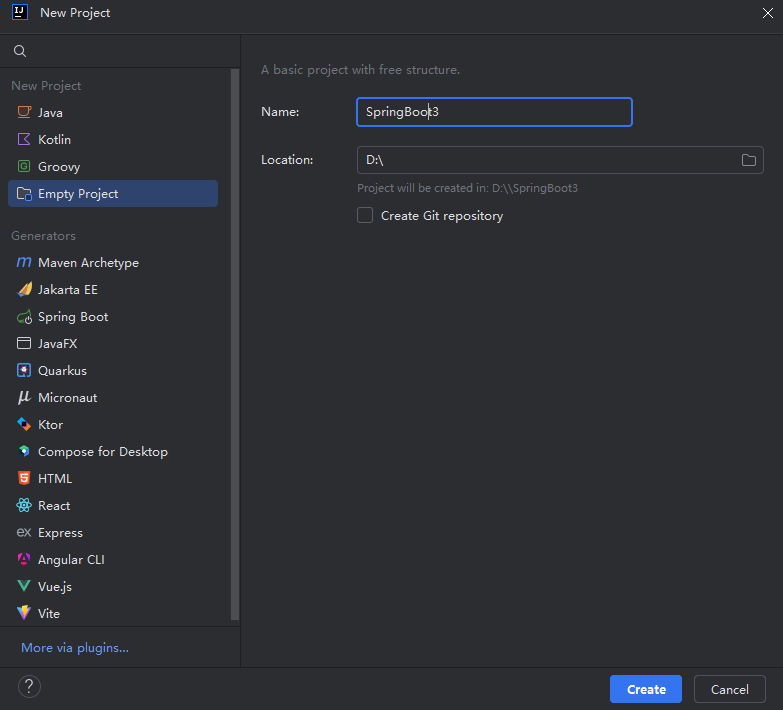

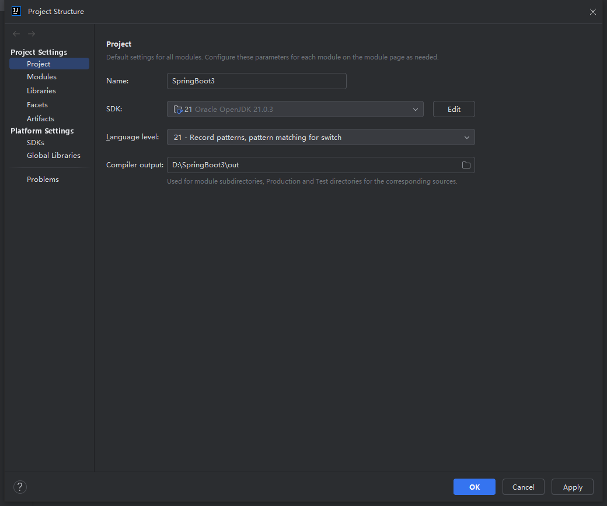

### 第二步：设置maven
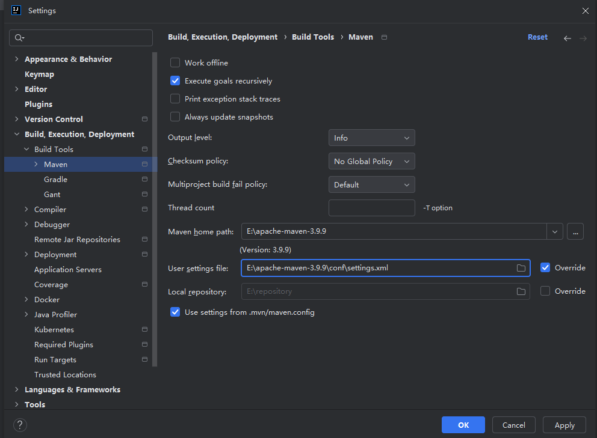

### 第三步：创建一个Maven模块 sb3-01-first-web
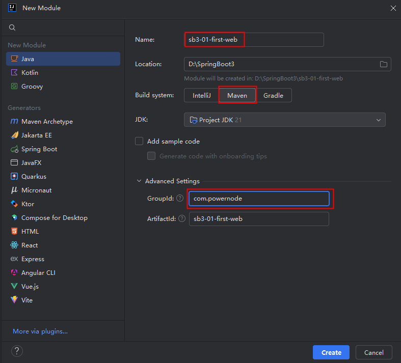

### 第四步：打开Spring Boot 3官方文档，按照文档一步一步进行


### 第五步：要使用Spring Boot 3，需要继承这个开源项目。从官方指导文档中复制以下内容：
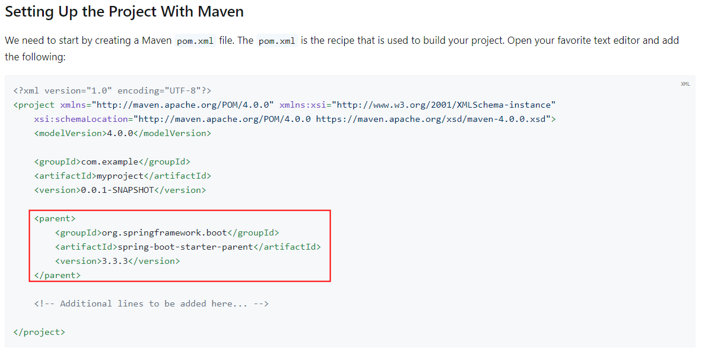

```xml
<!--继承Spring Boot 3.3.3开源项目-->
<parent>
  <groupId>org.springframework.boot</groupId>
  <artifactId>spring-boot-starter-parent</artifactId>
  <version>3.3.3</version>
</parent>
```

我们开发的每一个项目其实可以看做是 Spring Boot 项目下的子项目。

### 第六步：添加Spring Boot的web starter


在parent下立即添加如下配置，让Spring Boot项目具备开发web应用的依赖：

```xml
<dependencies>
    <!--引入Spring Boot web启动器依赖-->
    <dependency>
        <groupId>org.springframework.boot</groupId>
        <artifactId>spring-boot-starter-web</artifactId>
    </dependency>
</dependencies>
```

关联的依赖也被引入进来，如下：

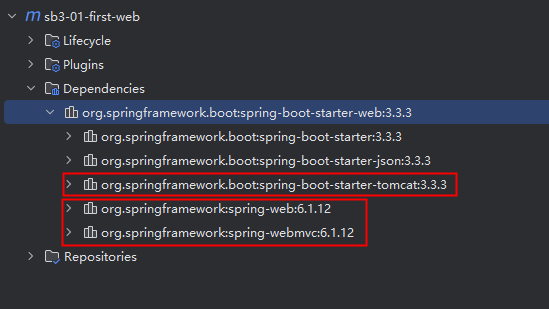

可以看到spring mvc被引入了，tomcat服务器也被引入了。

### 第七步：编写Spring Boot主入口程序

```java
package com.powernode.springboot3;

import org.springframework.boot.SpringApplication;
import org.springframework.boot.autoconfigure.SpringBootApplication;

@SpringBootApplication
public class MyApplication {

    public static void main(String[] args) {
        SpringApplication.run(MyApplication.class, args);
    }
}
```

### 第八步：编写controller

```java
package com.powernode.springboot3.controller;

import org.springframework.stereotype.Controller;
import org.springframework.web.bind.annotation.RequestMapping;
import org.springframework.web.bind.annotation.ResponseBody;

@Controller
@ResponseBody
public class MyController {

    @RequestMapping("/hello")
    public String index(){
        return "Hello World!";
    }
    
}

```

### 第九步：运行main方法就是启动web容器
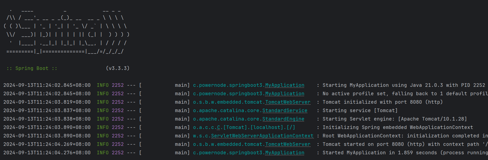

### 第十步：打开浏览器访问


## 便捷的部署方式
### 打jar包运行
Spring Boot提供了打包插件，可以将Spring Boot项目打包为**可执行 jar 包**。Web服务器（Tomcat）也会连同一块打入jar包中。只要电脑上安装了Java的运行环境（JDK），就可以启动Spring Boot项目。
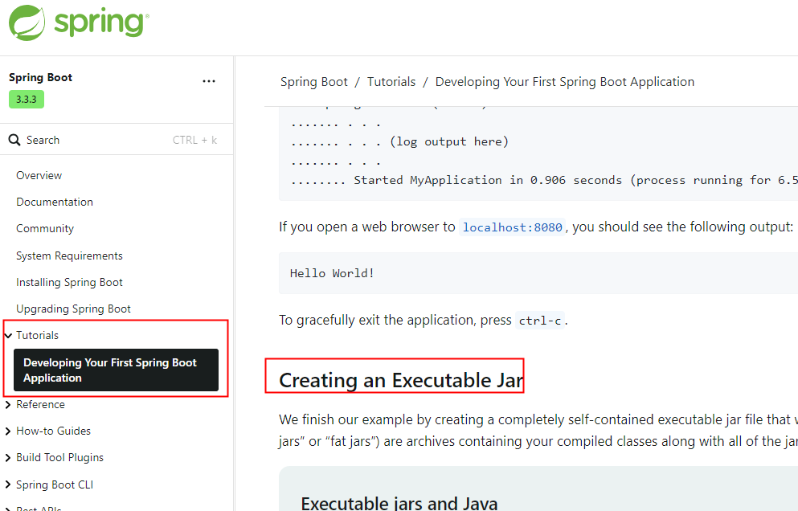
根据官方文档指导，使用打包功能需要引入以下的插件：

```xml
<build>
	<plugins>
		<plugin>
			<groupId>org.springframework.boot</groupId>
			<artifactId>spring-boot-maven-plugin</artifactId>
		</plugin>
	</plugins>
</build>
```

执行打包命令，生成可执行jar包：

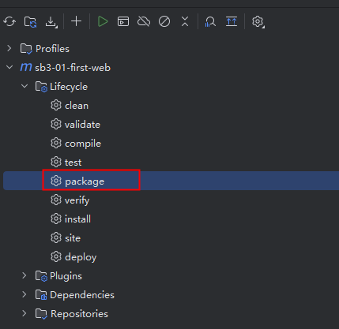


单独的将这个 jar 包可以拷贝到任何位置运行，通过`java -jar sb3-01-first-web-1.0-SNAPSHOT.jar`命令来启动 Spring Boot 项目：


打开浏览器访问：


另外，Spring Boot框架为我们提供了非常灵活的配置，在可执行jar包的同级目录下新建配置文件：application.properties，并配置以下信息：

```properties
server.port=8888
```

重新启动服务器，然后使用新的端口号访问：


## SpringBoot的jar包和普通jar包的区别
Spring Boot 打包成的 JAR 文件与传统的 Java 应用程序中的 JAR 文件相比确实有一些显著的区别，主要体现在`依赖管理`和`可执行性`上。

**依赖管理**：

+ Spring Boot 的 JAR 包通常包含了应用程序运行所需的所有依赖项，也就是说它是一个“fat jar”（胖 JAR 包），这种打包方式使得应用可以独立运行，而不需要外部的类路径或应用服务器上的其他依赖。
+ 普通的 JAR 文件一般只包含一个类库的功能，并且需要依赖于特定的类路径来找到其他的类库或者框架，这些依赖项通常在部署环境中已经存在，比如在一个应用服务器中。

**可执行性**：

+ Spring Boot 的 JAR 文件可以通过直接执行这个 JAR 文件来启动应用程序，也就是说它是一个可执行的 JAR 文件。通过 `java -jar your-application.jar` 命令就可以直接运行应用程序。
+ 而普通的 JAR 文件通常是不可直接执行的，需要通过指定主类（main class）的方式或者其他方式来启动一个应用程序，例如使用 `-cp` 或 `-classpath` 加上类路径以及主类名来执行。

Spring Boot 的这些特性使得部署和运行变得更加简单和方便，特别是在微服务架构中，每个服务都可以被打包成独立的 JAR 文件并部署到任何支持 Java 的地方。

SpringBoot的可执行jar包目录结构：

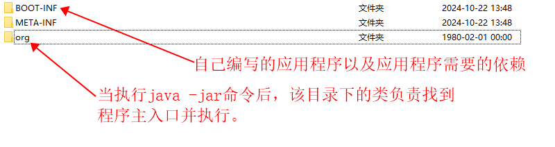

普通jar包的目录结构：


# Spring Boot脚手架
## 什么是脚手架
### 建筑工程中的脚手架
在建筑工程领域，“脚手架”指的是临时性的结构，用于支撑建筑物以及建筑材料，同时为建筑工人提供工作平台。这种脚手架通常是由钢管、扣件、木板和其他配件组成的，可以根据施工需要搭建不同高度和形状的结构。


### 软件开发中的脚手架
在软件开发领域，“脚手架”指的是用于快速创建项目基本结构的工具或模板。它帮助开发者初始化项目，设置必要的目录结构、文件模板以及依赖项。 

### Spring Boot脚手架
Spring Boot 脚手架（Scaffold）可以帮助开发者快速搭建一个Spring Boot项目结构，让开发者只专注于业务逻辑的开发，而不是在项目的初始阶段花费大量时间来配置环境或者解决依赖关系。

Spring Boot 脚手架工具存在多种形式，以下是一些常见的 Spring Boot 脚手架工具和方法：

+ **Spring Initializr：**

这是 Spring 官方提供的工具，可以在 [https://start.spring.io](https://start.spring.io) 上找到。它允许开发者选择所需的依赖、Java 版本、构建工具（Maven 或 Gradle）以及其他配置选项来生成一个新的 Spring Boot 项目。

+ **IntelliJ IDEA 内置支持：**

IntelliJ IDEA 集成了 Spring Initializr 的功能，可以在 IDE 内直接创建 Spring Boot 项目。

+ **Start Alibaba Cloud：**

阿里云提供的 Start Alibaba Cloud 增强版工具，除了基本的 Spring Boot 模块外，还集成了阿里云服务和中间件的支持。

+ **JHipster：**

JHipster 是一个流行的脚手架工具，用于生成完整的 Spring Boot 应用程序，包括前端（Angular, React 或 Vue.js）和后端。它还包括用户管理和认证等功能。

+ **Yeoman Generators：**

Yeoman 是一个通用的脚手架工具，它有一个庞大的插件生态系统，其中包括用于生成 Spring Boot 项目的插件。

+ **Bootify：**

Bootify 是另一个用于生成 Spring Boot 应用程序的脚手架工具，提供了一些预定义的应用模板。

+ **Spring Boot CLI：**

Spring Boot CLI 是一个命令行工具，允许用户通过命令行来编写和运行 Spring Boot 应用。

+ **Visual Studio Code 插件：**

Visual Studio Code 社区提供了多个插件，如 Spring Boot Extension Pack，可以帮助开发者生成 Spring Boot 项目的基本结构。

+ **GitHub Gist 和 Bitbucket Templates：**

在 GitHub 和 Bitbucket 上，有很多开发者分享了用于生成 Spring Boot 项目的脚本或模板。

+ **自定义脚手架：**

很多开发者也会根据自己的需求定制自己的脚手架工具，比如使用 Bash 脚本、Gradle 或 Maven 插件等。

## 使用官方提供的
### 使用官方脚手架生成Spring Boot项目
Spring Initializr：[https://start.spring.io](https://start.spring.io)

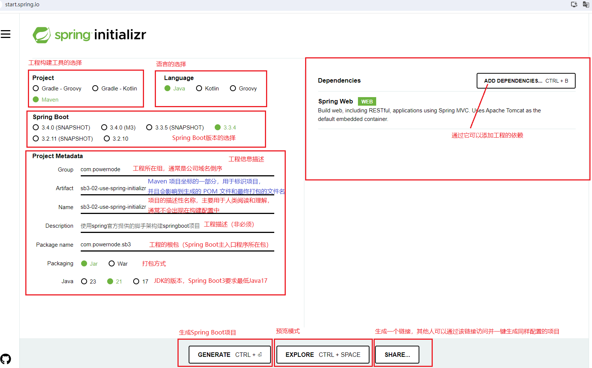

点击“GENERATE”后，生成zip压缩包：


将其解压后的目录结构是一个标准的maven 工程：


### 将项目放到IDEA当中
接下来将其导入到IDEA当中：直接将解压后的`sb3-02-use-spring-initializr`拷贝到我们新建的空工程`SpringBoot3`下，如图：

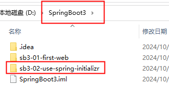

打开IDEA工具，你会看到如下图：


注意：如果`pom.xml`文件的图标颜色不是蓝色，而是橘色，需要在`pom.xml`文件上右键，选择：add as maven project。这样`pom.xml`文件的图标就会变为蓝色了。


### 脚手架生成的pom.xml文件
```xml
<?xml version="1.0" encoding="UTF-8"?>
<project xmlns="http://maven.apache.org/POM/4.0.0" xmlns:xsi="http://www.w3.org/2001/XMLSchema-instance"
	xsi:schemaLocation="http://maven.apache.org/POM/4.0.0 https://maven.apache.org/xsd/maven-4.0.0.xsd">
	<modelVersion>4.0.0</modelVersion>
  <!--继承Spring Boot父工程-->
	<parent>
		<groupId>org.springframework.boot</groupId>
		<artifactId>spring-boot-starter-parent</artifactId>
		<version>3.3.4</version>
		<relativePath/> <!-- lookup parent from repository -->
	</parent>
  <!--自己项目的坐标-->
	<groupId>com.powernode</groupId>
	<artifactId>sb3-02-use-spring-initializr</artifactId>
	<version>0.0.1-SNAPSHOT</version>
	<name>sb3-02-use-spring-initializr</name>
	<description>使用spring官方提供的脚手架构建springboot项目</description>
	<url/>
	<licenses>
		<license/>
	</licenses>
	<developers>
		<developer/>
	</developers>
	<scm>
		<connection/>
		<developerConnection/>
		<tag/>
		<url/>
	</scm>
	<properties>
		<java.version>21</java.version>
	</properties>
	<dependencies>
    <!--web起步依赖-->
		<dependency>
			<groupId>org.springframework.boot</groupId>
			<artifactId>spring-boot-starter-web</artifactId>
		</dependency>
    <!--单元测试起步依赖-->
		<dependency>
			<groupId>org.springframework.boot</groupId>
			<artifactId>spring-boot-starter-test</artifactId>
			<scope>test</scope>
		</dependency>
	</dependencies>

  <!--打包插件-->
	<build>
		<plugins>
			<plugin>
				<groupId>org.springframework.boot</groupId>
				<artifactId>spring-boot-maven-plugin</artifactId>
			</plugin>
		</plugins>
	</build>
  
</project>
```

可以看到脚手架生成的`pom.xml`文件的内容和我们手动创建Spring Boot项目的`pom.xml`文件是一样的。

### 脚手架生成的Spring Boot项目的结构
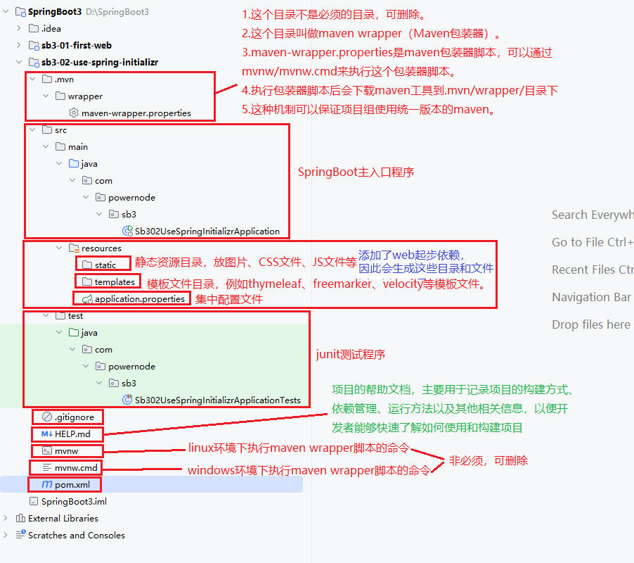

请仔细阅读上图来学习Spring Boot项目结构。

### 编写controller并测试
新建controller包，并新建HelloController类，如下图：

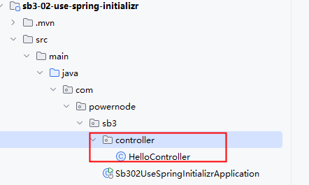

**\<font style="color:#DF2A3F;"\>重点：默认情况下，SpringBoot项目只扫描主入口程序所在目录以及子目录，因此创建的Controller类要求放在主入口程序的同级目录下或子目录下。其他位置默认情况下扫描不到。\</font\>**

启动应用并访问：


## 使用阿里提供的
阿里巴巴提供的 Spring Boot 项目脚手架服务称为 DragonBoot（也被称为 Alibaba Cloud Spring Boot Initializr）。DragonBoot 基于 Spring Initializr，并在此基础上增加了更多的定制选项，特别是针对阿里巴巴云服务和中间件的支持。脚手架地址：[https://start.aliyun.com/](https://start.aliyun.com/)

当下（2024年）阿里云提供的脚手架使用的版本较低，国内有一些公司在用。如果要求版本较高的，则阿里云脚手架不适用。

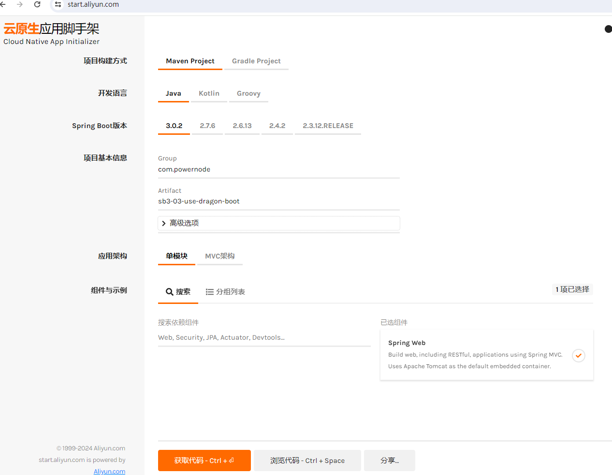

阿里提供的脚手架和spring官方脚手架基本上是相同的。不再赘述。点击`获取代码`也会生成zip压缩包：


解压：

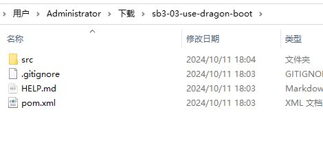

和之前操作一样，将其放到IDEA开发环境中：

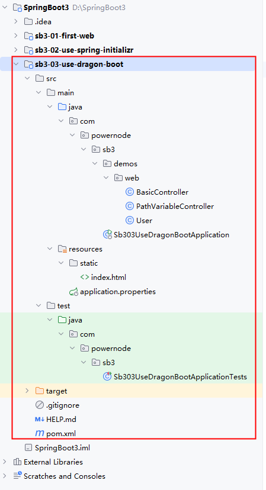

启动应用并访问：

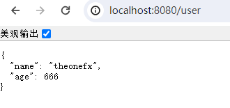

## 使用IDEA工具的脚手架插件
 IDEA工具自带了Spring Boot脚手架的插件，使用它会更加的方便，让我们来操作一下：

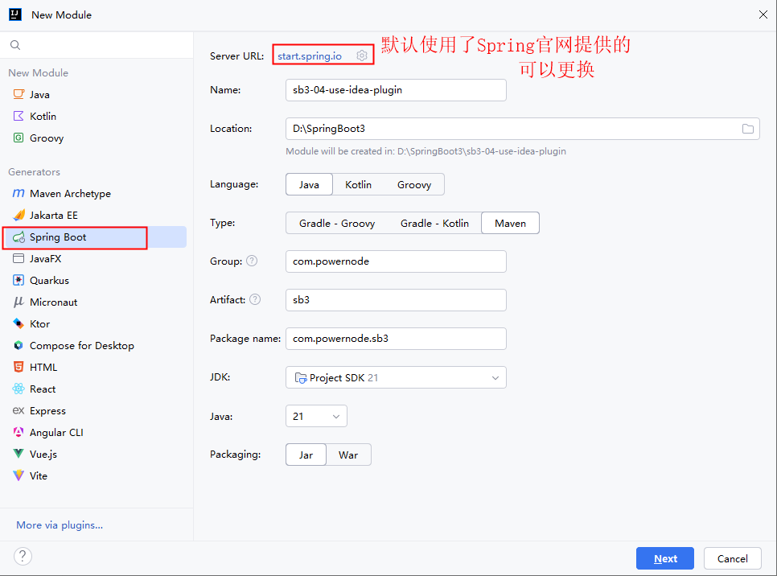

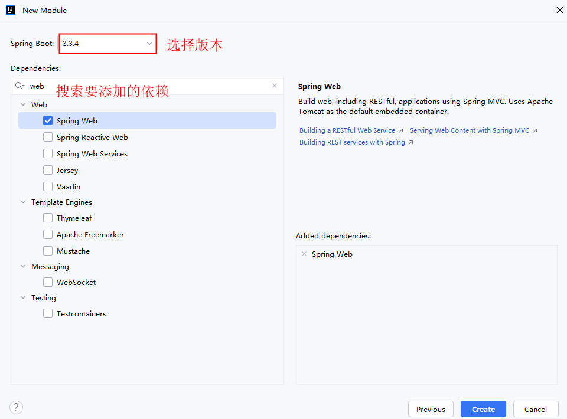

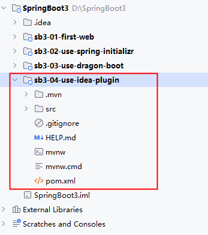

编写控制器，启动服务器测试：

 

---

## 第2章 Spring Boot核心机制

# 为何以继承方式引入SpringBoot
## 提出疑问
以前我们在开发项目时，需要什么，引入对应的依赖就行，比如我们需要连接mysql数据，则引入mysql驱动的依赖，如下：

```xml
<dependency>
  <groupId>com.mysql</groupId>
  <artifactId>mysql-connector-j</artifactId>
  <version>8.3.0</version>
</dependency>
```

现在我们要使用SpringBoot框架，按说也应该采用依赖的方式将SpringBoot框架引入，如下：

```xml
<dependency>
  <groupId>org.springframework.boot</groupId>
  <artifactId>spring-boot-starter-parent</artifactId>
  <version>3.3.3</version>
</dependency>
```

但是SpringBoot官方推荐的不是直接引入依赖，而是采用继承的方式实现，如下：

```xml
<parent>
    <groupId>org.springframework.boot</groupId>
    <artifactId>spring-boot-starter-parent</artifactId>
    <version>3.3.3</version>
</parent>
```

**\<font style="color:#DF2A3F;"\>为什么？\</font\>**

## 作为父项目和作为依赖的区别
**继承父工程的优势**

+ 依赖管理：可以在父工程中定义依赖的版本，子模块可以直接引用而不必指定版本号。
+ 插件管理：可以在父工程中配置常用的插件及其版本，子模块可以直接使用这些配置。
+ 属性设置：可以在父工程中定义一些通用的属性，如项目编码、Java 版本等。
+ 统一配置：可以统一多个子模块的构建配置，确保一致性。

**直接引入依赖的局限性**（如果你不使用继承父工程的方式，而是通过直接引入依赖的方式来管理项目，那么你将失去上述的一些优势）

+ 依赖版本管理：每个子模块都需要单独指定依赖的版本，这会导致大量的重复配置，并且难以维护。
+ 插件配置：每个子模块都需要单独配置插件及其版本，无法共享父工程中的插件配置。
+ 属性设置：每个子模块都需要单独设置通用的属性，如项目编码、Java 版本等。
+ 构建配置：每个子模块的构建配置需要单独维护，难以保证一致性。

**\<font style="color:#DF2A3F;"\>总结：选择哪种方式取决于你的具体需求。\</font\>**

+ **\<font style="color:#DF2A3F;"\>如果你希望多个项目之间共享构建配置，那么使用父项目是一个好的选择；\</font\>**
+ **\<font style="color:#DF2A3F;"\>如果你只是想在项目之间共享代码，那么应该使用依赖关系。\</font\>**

**\<font style="color:#DF2A3F;"\>\</font\>**

## 原理揭晓
通过源码来分析一下：


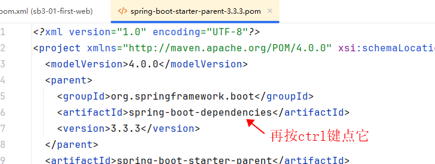


通过上图源码可以看到Spring Boot预先对开发中需要用到的依赖进行了版本的统一管理。我们需要和SpringBoot框架共享这个构建配置。因此官方推荐使用继承的方式引入SpringBoot框架。

## 依赖统一管理的好处
Spring Boot 框架的一个重要特性就是简化了项目依赖管理。它通过提供一个叫做“依赖管理”的功能来帮助开发者更容易地管理和使用第三方库和其他 Spring 组件。具体来说，Spring Boot 提供了一个包含多个 Spring 和其他常用库的依赖版本配置文件（通常是在 `spring-boot-dependencies` 文件中），这使得开发者不需要在自己的项目中显式指定这些依赖的版本号。

这样做有以下几个好处：

1. **简化依赖声明**：  
开发者只需要在 `pom.xml` 文件中声明需要的依赖而不需要指定其版本号，因为 Spring Boot 已经为这些依赖指定了版本。例如，如果你需要使用mysql驱动，你只需要添加相应的依赖声明而不需要关心版本。

```xml
<dependency>
    <groupId>com.mysql</groupId>
    <artifactId>mysql-connector-j</artifactId>
</dependency>
```

2. **避免版本冲突**：  
当多个库之间存在依赖关系的时候，如果手动管理版本可能会导致版本之间的冲突（即“依赖地狱”）。Spring Boot 提供的统一版本管理可以减少这种冲突的可能性。
3. **易于升级**：  
当 Spring Boot 发布新版本时，通常会更新其依赖库到最新稳定版。因此，当你升级 Spring Boot 版本时，它所管理的所有依赖也会随之更新到兼容的版本。
4. **减少配置错误**：  
由于 Spring Boot 自动处理了依赖的版本，减少了手动输入版本号可能引入的拼写或格式错误。
5. **提高开发效率**：  
开发者可以专注于业务逻辑的编写，而不是花费时间在解决依赖问题上。

总的来说，Spring Boot 的依赖管理功能使得开发者可以更加专注于业务逻辑的实现，同时减少了因依赖版本不一致而引发的问题，提高了项目的可维护性和开发效率。

当然，如果你在项目中需要更改某个依赖的版本号，不想使用SpringBoot框架指定的版本号，只需要在引入依赖时强行执行版本号即可，maven是支持就近原则的：

这样做就是采用SpringBoot指定版本的依赖：

```xml
<dependency>
    <groupId>com.mysql</groupId>
    <artifactId>mysql-connector-j</artifactId>
</dependency>
```

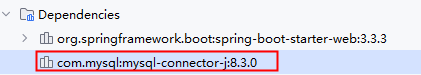

这样做就是不采用SpringBoot指定版本的依赖：

```xml
<dependency>
    <groupId>com.mysql</groupId>
    <artifactId>mysql-connector-j</artifactId>
    <version>8.2.0</version>
</dependency>
```


# Starter-启动器
在 Spring Boot 中，启动器（Starter）本质上是一个简化依赖管理的概念。

Spring Boot 的启动器本质上就是一组预定义的依赖集合，它们被组织成一个个 Maven的依赖，以方便开发者快速集成特定的功能模块。

如果你想做web开发，只需要引入web启动器。web启动器会自动引入web开发所需要的子依赖。

## 启动器实现原理
1. **依赖聚合**：  
每个启动器通常对应一个特定的功能集或者一个完整的应用模块，如 `spring-boot-starter-web` 就包含了构建 Web 应用所需的所有基本依赖项，如 Spring MVC, Tomcat 嵌入式容器等。
2. **依赖传递**：  
当你在项目中引入一个启动器时，它不仅会把自身作为依赖加入到你的项目中，还会把它的所有直接依赖项（transitive dependencies）也加入进来。这意味着你不需要单独声明这些依赖项，它们会自动成为项目的一部分。
3. **版本管理**：  
启动器内部已经指定了所有依赖项的具体版本，这些版本信息存储在一个公共的 BOM（Bill of Materials，物料清单）文件中，通常是 `spring-boot-dependencies`。当引入启动器时，实际上也间接引用了这个 BOM，从而确保了所有依赖项版本的一致性。
4. **自动配置**：  
许多启动器还提供了自动配置（Auto-configuration），这是一种机制，允许 Spring Boot 根据类路径上的可用组件自动设置你的应用程序。例如，如果类路径上有 Spring MVC 和嵌入式 Tomcat，则 Spring Boot 会自动配置它们，并准备好一个 web 应用程序。

**使用启动器的示例**

假设你想创建一个基于 Spring MVC 的 RESTful Web 应用，你可以简单地将 `spring-boot-starter-web` 添加到你的项目中：

```xml
<dependency>
    <groupId>org.springframework.boot</groupId>
    <artifactId>spring-boot-starter-web</artifactId>
</dependency>
```

当你添加这个依赖时，Spring Boot 会处理所有必要的细节，包括添加 Spring MVC 和 Tomcat 作为嵌入式 Servlet 容器，并且根据类路径上的内容进行适当的自动配置。如下图所示：


这就是 Spring Boot 启动器的基本实现原理，它简化了依赖管理，让开发者能够更专注于业务逻辑的实现。

## 都有哪些启动器
启动器通常包括：

+ SpringBoot官方提供的启动器
+ 非官方提供的启动器

### 官方提供的启动器
启动器命名特点：spring-boot-starter-*

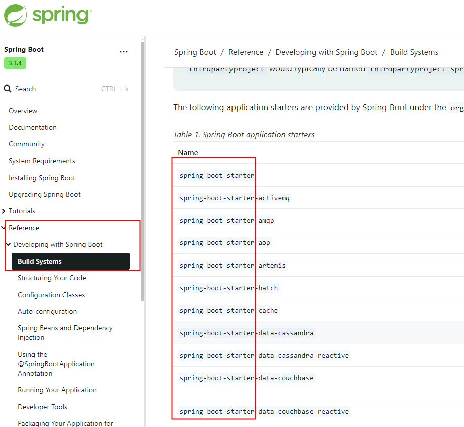

### 非官方的启动器
启动器命名特点：*-spring-boot-starter

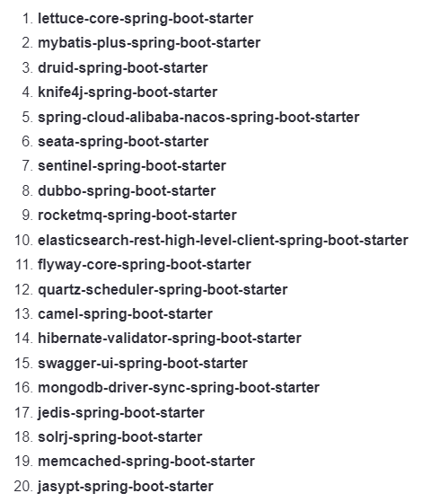

# Spring Boot核心注解
创建一个新的模块，来学习Spring Boot核心注解：


只加入web启动器。

## @SpringBootApplication注解
Spring Boot的主入口程序被`@SpringBootApplication`注解标注，可见这个注解的重要性，查看它的源码：


可以看出这个注解属于`组合注解`。拥有`@SpringBootConfiguration`、`@EnableAutoConfiguration`、`@ComponentScan`的功能。

## @SpringBootConfiguration注解
@SpringBootConfiguration注解的源码如下：


可以看到这个注解的被`@Configuration`标注，说明`主入口`程序是一个配置类。也就是说主入口中的方法可以被`@Bean`注解标注，被`@Bean`注解的标注的方法会被Spring容器自动调用，并且将该方法的返回对象纳入IoC容器的管理。测试一下：

```java
@SpringBootApplication
public class Sb305CoreApplication {
    @Bean
    public Date getNowDate(){ // 方法名作为bean的id
        return new Date();
    }
    public static void main(String[] args) {
        ConfigurableApplicationContext applicationContext = SpringApplication.run(Sb305CoreApplication.class, args);
        Date dateBean1 = applicationContext.getBean(Date.class);
        System.out.println(dateBean1);
        Date dateBean2 = applicationContext.getBean("getNowDate", Date.class);
        System.out.println(dateBean2);
    }
}
```

执行结果：


通过测试我们也认证了这一点：`SpringBoot主入口类实际上就是一个配置类`。

这个`配置类`也可以称为`源`，起源的意思，SpringBoot从这个配置类开始加载项目中所有的bean。

## @EnableAutoConfiguration注解
该注解表示`启用自动配置`。

Spring Boot 会根据你引入的依赖自动为你配置好一系列的 Bean，无需手动编写复杂的配置代码。

例如：如果你在SpringBoot项目中进行了如下配置：

```properties
spring.datasource.driver-class-name=com.mysql.cj.jdbc.Driver
spring.datasource.url=jdbc:mysql://localhost:3306/springboot
spring.datasource.username=root
spring.datasource.password=123456
```

并且在依赖中引入了`mybatis依赖`/`mybatis启动器`，那么SpringBoot框架将为你自动化配置以下bean：

+ **SqlSessionFactory**: MyBatis的核心工厂SqlSessionFactory会被自动配置。这个工厂负责创建SqlSession实例，后者用来执行映射文件中的SQL语句。
+ **TransactionManager**: DataSourceTransactionManager会被自动配置来管理与数据源相关的事务。

## @ComponentScan注解
这个注解的作用是：启动组件扫描功能，代替spring框架xml文件中这个配置：

```xml
<context:component-scan base-package="com.powernode.sb305core"/>
```

因此被`@SpringBootApplication`注解标注之后，会启动组件扫描功能，扫描的包是`主入口程序所在包及子包`，因此如果一个bean要纳入IoC容器的管理则必须放到主入口程序所在包及子包下。放到主入口程序所在包之外的话，扫描不到。测试一下：

### 扫描到
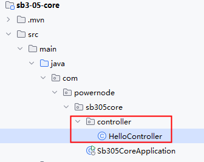

`HelloController`代码如下：

```java
@RestController
public class HelloController {
    @GetMapping("/hello")
    public String hello(){
        return "hello world!";
    }
}
```

启动服务器测试：


### 扫描不到
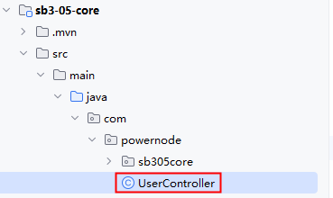

可以看到`UserController`没有在`sb305core`包下。

`UserController`代码如下：

```java
@RestController
public class UserController {
    @GetMapping("/list")
    public String list(){
        return "user list!";
    }
}
```

启动服务器测试：


通过测试得知`UserController`没有被纳入IoC容器的管理。

最终结论：要让bean纳入IoC容器的管理，必须将类放到主入口程序同级目录下，或者子目录下。

# Spring Boot的单元测试
## 不使用单元测试怎么调用service
### 创建模块
使用脚手架创建sb3-06-test模块，不添加任何启动器：

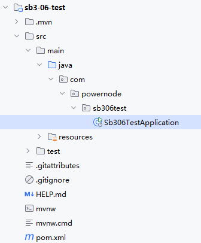

### 编写service
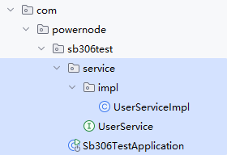

```java
package com.powernode.sb306test.service.impl;

import com.powernode.sb306test.service.UserService;
import org.springframework.stereotype.Service;

@Service("userService")
public class UserServiceImpl implements UserService {
    @Override
    public void save() {
        System.out.println("保存用户信息");
    }
}
```

### 直接在入口程序中调用service
```java
@SpringBootApplication
public class Sb306TestApplication {
    public static void main(String[] args) {
        ConfigurableApplicationContext applicationContext = SpringApplication.run(Sb306TestApplication.class, args);
        UserService userService = applicationContext.getBean("userService", UserService.class);
        userService.save();
    }
}
```

执行结果：


这种方式就是手动获取Spring上下文对象`ConfigurableApplicationContext`，然后调用getBean方法从Spring容器中获取service对象，然后调用方法。

## 使用单元测试怎么调用service
### test-starter引入以及测试类编写
使用单元测试应该如何调用service对象上的方法呢？

在使用脚手架创建Spring Boot项目时，为我们生成了单元测试类，如下：

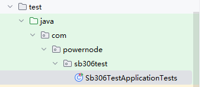

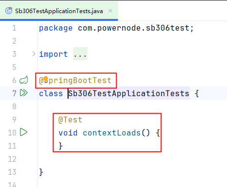

当然，如果要使用单元测试，需要引入单元测试启动器，如果使用脚手架创建SpringBoot项目，这个test启动器会自动引入：

```xml
<dependency>
    <groupId>org.springframework.boot</groupId>
    <artifactId>spring-boot-starter-test</artifactId>
    <scope>test</scope>
</dependency>
```

### @SpringBootTest注解
`@SpringBootTest` 会创建一个完整的 Spring 应用程序上下文（Application Context），这个上下文包含了应用程序的所有组件和服务。以下是 `@SpringBootTest` 做的一些主要工作：

1. **创建 ApplicationContext**：
    - `@SpringBootTest` 使用 `SpringApplication` 的 `run()` 方法来启动一个 Spring Boot 应用程序上下文。这意味着它会加载应用程序的主配置类和其他相关的配置类。
2. **加载配置文件**：
    - 它会查找并加载默认的配置文件，如 `application.properties`
3. **自动配置**：
    - 如果应用程序依赖于 Spring Boot 的自动配置特性，`@SpringBootTest` 会确保这些自动配置生效。这意味着它会根据可用的类和bean来自动配置一些组件，如数据库连接、消息队列等。
4. **注入依赖**：
    - 使用 `@SpringBootTest` 创建的应用程序上下文允许你在测试类中使用 `@Autowired` 注入需要的 bean，就像在一个真实的 Spring Boot 应用程序中一样。

总的来说，`@SpringBootTest` 为你的测试提供了尽可能接近实际运行时环境的条件，这对于验证应用程序的行为非常有用。

### 注入service并调用
```java
@SpringBootTest
class Sb306TestApplicationTests {

    @Autowired
    private UserService userService;
    
    @Test
    void contextLoads() {
        userService.save();
    }

}
```

测试结果如下：


# 外部化配置
## 什么是外部化配置
外部化配置是指：将`配置信息`存储在`应用程序代码`之外的地方。这样`配置信息`可以独立于代码进行管理。这样方便了配置的修改，并且修改后不需要重新编译代码，也不需要重新部署项目。

### 外部化配置的方式
SpringBoot支持多种外部化配置方式，包括但不限于：

+ properties文件
+ YAML文件
+ 系统环境变量
+ 命令行参数
+ ......

### 外部化配置的优势
1. **灵活性**：配置文件可以独立于应用程序部署，这使得可以根据运行环境的不同来调整配置，而无需修改代码。
2. **易于维护**：配置变更不需要重新构建和部署应用程序，降低了维护成本。
3. **安全性**：敏感信息如数据库密码、API密钥等可以存储在外部，并且可以限制谁有权限访问这些配置信息。
4. **共享性**：多实例或多服务可以共享相同的配置信息，减少重复配置的工作量。
5. **版本控制**：配置文件可以存放在版本控制系统中，便于跟踪历史版本和回滚配置。

总之，外部化配置使得配置更加灵活、安全、易于管理和共享，是现代云原生应用中非常推荐的做法

### 外部化配置对比传统配置
在传统的SSM三大框架中，如果修改XML的配置后，需要对应用重新打包，重新部署。

使用SpringBoot框架的`外部化配置`后，修改配置后，不需要对应用重新打包，也不需要重新部署，最多重启一下服务即可。

## application.properties
`application.properties`配置文件是SpringBoot框架默认的配置文件。

`application.properties`不是必须的，SpringBoot对于应用程序来说，都提供了一套默认配置（就是我们所说的自动配置）。

如果你要改变这些默认的行为，可以在`application.properties`文件中进行配置。

`application.properties`可以放在类路径当中，也可以放在项目之外。因此称为外部化配置。

Spring Boot 框架在启动时会尝试从以下位置加载 `application.properties` 配置文件：

1. **file:./config/**：首先在Spring Boot 当前工作目录下的 `config` 文件夹中查找。
    1. **\<font style="color:#DF2A3F;"\>注意：如果没有找到\</font\>**`**<font style="color:#DF2A3F;">application.properties</font>**`**\<font style="color:#DF2A3F;"\>会继续找\</font\>**`**<font style="color:#DF2A3F;">application.yml</font>**`**\<font style="color:#DF2A3F;"\>，如果这两个都没有找到，才会进入以下位置查找，以此类推。\</font\>**
2. **file:./**：如果在当前工作目录下`config`目录中找不到时，再从当前工作目录中查找。
3. **classpath:/config/**：如果从工作目录中找不到，会从类路径中找，先从类路径的 `/config/` 目录下寻找配置文件。
4. **classpath:/**：如果在 `/config/` 下没有找到，它会在类路径的根目录下查找。

Spring Boot 会按照这个顺序来加载配置文件，如果在多个位置有相同的属性定义，那么最先检查的位置中的属性值将优先使用。

如果你想要指定其他的配置文件位置或者改变默认的行为，可以通过 `--spring.config.location=` 后跟路径的方式来指定配置文件的具体位置。例如 ：

```plain
java -jar sb3-01-first-web-1.0-SNAPSHOT.jar --spring.config.location=file:///E:\a\b\application.properties
```

这样，Spring Boot 将会首先从 `E:\a\b\` 这个路径加载配置文件。注意，这种方式可以用来覆盖默认的配置文件位置，并且可以结合以上提到的位置一起使用。

注意：以上的`--spring.config.location=file:///E:\a\b\application.properties`就属于命令行参数，它将来会被传递到main方法的(String[] args)参数上。

## 使用@Value注解
@Value注解可以将`application.properties`/`application.yml`文件中的配置信息注入/绑定到java对象的属性上。

**\<font style="color:#DF2A3F;"\>语法格式：@Value("${key}")\</font\>**

使用脚手架创建SpringBoot项目，不添加任何启动器：


在`resources/application.properties`文件中进行如下配置：

```properties
myapp.username=jack
myapp.email=jack@123.com
myapp.age=30
```

编写service类：

```java
@Service("userService")
public class UserService {
    
    @Value("${myapp.username}")
    private String username;
    
    @Value("${myapp.email}")
    private String email;
    
    @Value("${myapp.age}")
    private Integer age;
    
    public void printInfo(){
        String str = String.join(",", username, email, String.valueOf(age));
        System.out.println(str);
    }
}
```

编写单元测试：

```java
@SpringBootTest
class Sb307ExternalConfigApplicationTests {
    @Autowired
    private UserService userService;
    @Test
    void test01() {
        userService.printInfo();
    }
}
```

运行结果：


使用@Value注解时也可以指定默认值，当指定默认值时，如果配置文件中没有指定配置值，则采用默认值。

**\<font style="color:#DF2A3F;"\>语法格式：@Value("${key:defalut}")\</font\>**

```java
@Service("userService")
public class UserService {

    @Value("${myapp.username}")
    private String username;

    @Value("${myapp.email}")
    private String email;

    @Value("${myapp.age}")
    private Integer age;
    
    @Value("${myapp.password:123456}")
    private String password;

    public void printInfo(){
        String str = String.join(",", username, email, String.valueOf(age), password);
        System.out.println(str);
    }
}
```

执行结果：


当然，如果配置文件进行了相关的配置，则不会采用默认值，修改配置文件`application.properties`：

```properties
myapp.username=jack
myapp.email=jack@123.com
myapp.age=30
myapp.password=888888
```

执行结果：


我们再来测试一下，如果在`resources`目录下新建`config`目录，在`config`目录下新建`application.properties`，配置信息如下：

```properties
myapp.username=lucy
myapp.email=lucy@123.com
myapp.age=20
myapp.password=666666
```

执行结果如下：

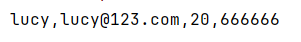

通过这个测试也验证了我们之前所说：SpringBoot会优先加载**classpath:/config/**目录下的`application.properties`。

## YAML
### YAML概述
SpringBoot采用集中式配置管理，所有的配置都编写到一个配置文件中：`application.properties`

如果配置非常多，层级不够分明，因此SpringBoot为了提高配置文件可读性，也支持YAML格式的配置文件：`application.yml`

YAML（YAML Ain't Markup Language）是一种人类可读的数据序列化格式，它通常用于配置文件，在各种编程语言中作为一种存储或传输数据的方式。YAML的设计目标是易于阅读和编写，同时保持足够的表达能力来表示复杂的数据结构。

**\<font style="color:#DF2A3F;"\>YAML文件的扩展名可以是\</font\>**`**<font style="color:#DF2A3F;">.yaml</font>**`**\<font style="color:#DF2A3F;"\>或\</font\>**`**<font style="color:#DF2A3F;">.yml</font>**`**\<font style="color:#DF2A3F;"\>。\</font\>**

### 常见的数据存储和交换格式
`properties`、`XML`、`JSON`、`YAML`这几种格式确实是用来存储和交换数据的常见方式，但它们各有特点和适用场景：

**Properties**

+ 这种格式主要用于Java应用程序中的配置文件。它是键值对的形式，每一行是一个键值对，使用等号或冒号分隔键和值。
+ 特点是简单易懂，但在处理复杂结构的数据时显得力不从心。

**XML (eXtensible Markup Language)**

+ XML是一种标记语言，用来描述数据的格式。它支持复杂的数据结构，包括嵌套和属性。
+ XML文档具有良好的结构化特性，适合传输和存储结构化的数据。但是，XML文档通常体积较大，解析起来也比较耗资源。

**JSON (JavaScript Object Notation)**

+ JSON是一种轻量级的数据交换格式，易于人阅读和编写，同时也易于机器解析和生成。它基于JavaScript的一个子集，支持多种数据类型，如数字、字符串、布尔值、数组和对象。
+ JSON因为简洁和高效而广泛应用于Web应用程序之间进行数据交换。

**YAML (YAML Ain't Markup Language)**

+ YAML设计的目标之一就是让人类更容易阅读。它支持类似JSON的数据序列化，但提供了更多的灵活性，例如缩进来表示数据结构。
+ YAML非常适合用来编写配置文件，因为它允许以一种自然的方式组织数据，并且可以包含注释和其他人类可读的元素。

总结来说，这四种格式都可以用来存储和交换数据，但它们的设计初衷和最佳使用场景有所不同。选择哪种格式取决于具体的应用需求、数据复杂度、性能要求等因素。

### YAML的语法规则
YAML的语法规则如下：

1. 数据结构：YAML支持多种数据类型，包括：
    1. 字符串、数字、布尔值
    2. 数组、list集合
    3. map键值对   等。
2. YAML使用`一个空格`来分隔`属性名`和`属性值`，例如：
    1. `properties`文件中这样的配置：name=jack
    2. `yaml`文件中需要这样配置：name: jack
3. YAML用`换行+空格`来表示层级关系。注意不能使用tab，必须是空格，空格数量无要求，大部分建议2个或4个空格。例如：
    1. `properties`文件中这样的配置：myapp.name=mall
    2. `yaml`文件中就需要这样配置：

```yaml
myapp:
  name: mall
```

4. 同级元素左对齐。例如：
    1. `properties`文件中有这样的配置：

```properties
myapp.name=mall
myapp.count=10
```

    2. `yaml`文件中就应该这样配置：

```yaml
myapp:
  name: mall
  count: 10
```

5. 键必须是唯一的：在一个映射中，键必须是唯一的。
6. 注释：使用`#`进行注释。
7. 大小写敏感

### YAML的使用小细节
第一：普通文本也可以使用单引号或双引号括起来：（当然普通文本也可以不使用单引号和双引号括起来。）

+ 单引号括起来：单引号内所有的内容都被当做普通文本，不转义（例如字符串中有\n，则\n被当做普通的字符串）
+ 双引号括起来：双引号中有 \n 则会被转义为换行符

第二：保留文本格式

+ |      将文本写到这个符号的下层，会自动保留格式。

第三：文档切割

+ --- 这个符号下面的配置可以认为是一个独立的yaml文件。便于庞大文件的阅读。

**\<font style="color:#DF2A3F;"\>\</font\>**

### application.yml
Spring Boot框架同时支持`properties`和`yaml`。

**\<font style="color:#DF2A3F;"\>强调：在同一个目录下同时存在\</font\>**`**<font style="color:#DF2A3F;">application.properties</font>**`**\<font style="color:#DF2A3F;"\>和\</font\>**`**<font style="color:#DF2A3F;">application.yml</font>**`**\<font style="color:#DF2A3F;"\>时，SpringBoot优先解析\</font\>**`**<font style="color:#DF2A3F;">application.properties</font>**`**\<font style="color:#DF2A3F;"\>文件。\</font\>**

在`resources/config`目录下新建`application.yml`文件，进行如下配置：

```yaml
myapp:
  username: jim
  email: jim@123.com
  age: 40
  password: jim123
```

一定要把`resources/config`目录下`application.properties`名字修改为`application2.properties`，这样Spring Boot才会解析`resources/config/application.yml`。

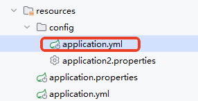

运行测试程序：


## 配置文件合并
一个项目中所有的配置全部编写到`application.properties`文件中，会导致配置臃肿，不易维护，有时我们会将配置编写到不同的文件中，例如：`application-mysql.properties`专门配置mysql的信息，`application-redis.properties`专门配置redis的信息，最终将两个配置文件合并到一个配置文件中。

### properties文件
`application-mysql.properties`

```properties
spring.datasource.username=root
spring.datasource.password=123456
```

`application-redis.properties`

```properties
spring.data.redis.host=localhost
spring.data.redis.port=6379
```

`application.properties`

```properties
spring.config.import=classpath:application-mysql.properties,classpath:application-redis.properties
```

编写service测试，看看能否拿到配置信息：

```java
package com.powernode.sb307externalconfig.service;

import org.springframework.beans.factory.annotation.Value;
import org.springframework.stereotype.Service;

@Service("userServiceMulti")
public class UserServiceMulti {
    @Value("${spring.datasource.username}")
    private String username;
    @Value("${spring.datasource.password}")
    private String password;
    @Value("${spring.data.redis.host}")
    private String host;
    @Value("${spring.data.redis.port}")
    private String port;
    
    public void printInfo(){
        String str = String.join(",", username, password, host, port);
        System.out.println(str);
    }
}
```

运行测试：


### yaml文件
`application-mysql.yml`

```yaml
spring:
  datasource:
    username: root
    password: 789789
```

`application-redis.yml`

```yaml
spring:
  data:
    redis:
      host: localhost
      port: 6379
```

`application.yml`

```yaml
spring:
  config:
    import:
      - classpath:application-mysql.yml
      - classpath:application-redis.yml
```

运行测试：

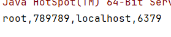

## 多环境切换
在Spring Boot中，多环境切换是指在一个应用程序中支持多种运行环境配置的能力。这通常用于区分开发（development）、测试（testing）、预生产（staging）和生产（production）等不同阶段的环境。

这种功能使得开发者能够在不同的环境中使用不同的配置，比如数据库连接信息、服务器端口、环境变量等，而不需要更改代码。这对于维护一个可移植且易于管理的应用程序非常重要。

1. 开发环境的配置文件名一般叫做：`application-dev.properties`

```properties
spring.datasource.username=dev
spring.datasource.password=dev123
spring.datasource.url=jdbc:mysql://localhost:3306/dev
```

2. 测试环境的配置文件名一般叫做：`application-test.properties`

```properties
spring.datasource.username=test
spring.datasource.password=test123
spring.datasource.url=jdbc:mysql://localhost:3306/test
```

3. 预生产环境的配置文件名一般叫做：`application-preprod.properties`

```properties
spring.datasource.username=preprod
spring.datasource.password=preprod123
spring.datasource.url=jdbc:mysql://localhost:3306/preprod
```

4. 生产环境的配置文件名一般叫做：`application-prod.properties`

```properties
spring.datasource.username=prod
spring.datasource.password=prod123
spring.datasource.url=jdbc:mysql://localhost:3306/prod
```

如果你希望该项目使用生产环境的配置，你可以这样做：

+ 第一种方式：在`application.properties`文件中添加这个配置：**spring.profiles.active=prod**
+ 第二种方式：在命令行参数上添加：**--spring.profiles.active=prod**

****

## 将配置绑定到bean
### 绑定简单bean
SpringBoot配置文件中的信息除了可以使用`@Value注解`读取之外，也可以将配置信息一次性赋值给Bean对象的属性。

例如有这样的配置：

`application.yml`

```yaml
app:
  name: jack
  age: 30
  email: jack@123.com
```

Bean需要这样定义：

```java
package com.powernode.sb307externalconfig.bean;

import org.springframework.boot.context.properties.ConfigurationProperties;
import org.springframework.stereotype.Component;

@Component
@ConfigurationProperties(prefix = "app")
public class AppBean {
    private String name;
    private Integer age;
    private String email;

    @Override
    public String toString() {
        return "AppBean{" +
                "name='" + name + '\'' +
                ", age=" + age +
                ", email='" + email + '\'' +
                '}';
    }

    public String getName() {
        return name;
    }

    public void setName(String name) {
        this.name = name;
    }

    public Integer getAge() {
        return age;
    }

    public void setAge(Integer age) {
        this.age = age;
    }

    public String getEmail() {
        return email;
    }

    public void setEmail(String email) {
        this.email = email;
    }
}
```

说明：

1. 被绑定的bean，需要使用`@ConfigurationProperties(prefix = "app")`注解进行标注，prefix用来指定前缀，哪个是前缀，如下图所示：

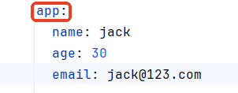

配置文件中的`name`、`age`、`email`要和bean对象的属性名`name`、`age`、`email`对应上。（属性名相同）

并且bean中的所有属性都提供了`setter`方法。因为底层是通过`setter`方法给bean属性赋值的。

2. 这样的bean需要使用`@Component`注解进行标注，纳入IoC容器的管理。`@Component`注解负责创建Bean对象，`@ConfigurationProperties(prefix = "app")`注解负责给bean对象的属性赋值。
3. bean的属性需要是`非static`的属性。

编写测试程序，将bean对象输出，结果如下：

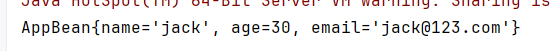

### @Configuration注解
以上操作中使用了`@Component注解`进行了标注，来纳入IoC容器的管理。也可以使用另外一个注解`@Configuration`，用这个注解将Bean标注为配置类。多数情况下我们会选择使用这个注解，因为该Bean对象的属性对应的就是配置文件中的配置信息，因此这个Bean我们也可以将其看做是一个配置类。

```java
@Configuration
@ConfigurationProperties(prefix = "app")
public class AppBean {
    private String name;
    private Integer age;
    private String email;
    //setter and getter
}
```

运行测试程序：

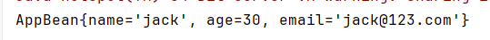

我们把这个Bean对象的类名打印一下看看：

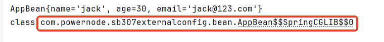

可以发现底层实际上创建了`AppBean`的代理对象`AppBean$$SpringCGLIB`。

生成代理对象会影响效率，这里我们不需要使用代理功能，可以通过以下配置来取消代理机制：

```java
@Configuration(proxyBeanMethods = false)
@ConfigurationProperties(prefix = "app")
public class AppBean {
    private String name;
    private Integer age;
    private String email;
    //setter and getter
}
```

执行结果如下：

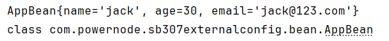

### 绑定嵌套bean
当一个Bean中嵌套了一个Bean，这种情况下可以将配置信息绑定到该Bean上吗？当然可以。

有这样的一个配置：

```yaml
app:
  name: jack
  age: 30
  email: jack@123.com
  address: 
    city: BJ
    street: ChaoYang
    zipcode: 123456
```

需要编写这样的两个Bean：

```java
package com.powernode.sb307externalconfig.bean;

import org.springframework.boot.context.properties.ConfigurationProperties;
import org.springframework.context.annotation.Configuration;

@Configuration(proxyBeanMethods = false)
@ConfigurationProperties(prefix = "app")
public class AppBean {
    private String name;
    private Integer age;
    private String email;
    private Address address;

    @Override
    public String toString() {
        return "AppBean{" +
                "name='" + name + '\'' +
                ", age=" + age +
                ", email='" + email + '\'' +
                ", address=" + address +
                '}';
    }

    public Address getAddress() {
        return address;
    }

    public void setAddress(Address address) {
        this.address = address;
    }

    public String getName() {
        return name;
    }

    public void setName(String name) {
        this.name = name;
    }

    public Integer getAge() {
        return age;
    }

    public void setAge(Integer age) {
        this.age = age;
    }

    public String getEmail() {
        return email;
    }

    public void setEmail(String email) {
        this.email = email;
    }
}

```

```java
package com.powernode.sb307externalconfig.bean;

public class Address {
    private String city;
    private String street;
    private String zipcode;

    public String getCity() {
        return city;
    }

    public void setCity(String city) {
        this.city = city;
    }

    public String getStreet() {
        return street;
    }

    public void setStreet(String street) {
        this.street = street;
    }

    public String getZipcode() {
        return zipcode;
    }

    public void setZipcode(String zipcode) {
        this.zipcode = zipcode;
    }

    @Override
    public String toString() {
        return "Address{" +
                "city='" + city + '\'' +
                ", street='" + street + '\'' +
                ", zipcode='" + zipcode + '\'' +
                '}';
    }
}

```

执行测试程序，结果如下：

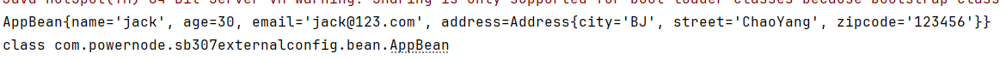

### \<font style="color:#080808;background-color:#ffffff;"\>@EnableConfigurationProperties与@ConfigurationPropertiesScan\</font\>
将`AppBean`纳入IoC容器的管理，之前我们说了两种方式：第一种是使用`@Component`，第二种是使用`@Configuration`。SpringBoot其实还提供了另外两种方式：

+ 第一种：@EnableConfigurationProperties
+ 第二种：@\<font style="color:#080808;background-color:#ffffff;"\>ConfigurationPropertiesScan\</font\>

\<font style="color:#080808;background-color:#ffffff;"\>这两个注解都是标注在SpringBoot主入口程序上的：\</font\>

```java
@EnableConfigurationProperties(AppBean.class)
@SpringBootApplication
public class Sb307ExternalConfigApplication {
    public static void main(String[] args) {
        SpringApplication.run(Sb307ExternalConfigApplication.class, args);
    }
}
```

或者

```java
@ConfigurationPropertiesScan(basePackages = "com.powernode.sb307externalconfig.bean")
@SpringBootApplication
public class Sb307ExternalConfigApplication {
    public static void main(String[] args) {
        SpringApplication.run(Sb307ExternalConfigApplication.class, args);
    }
}
```

运行测试程序，执行结果如下：

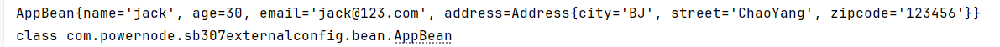

### 将配置赋值到Bean的Map/List/Array属性上
代码如下：

```java
package com.powernode.sb307externalconfig.bean;

import org.springframework.boot.context.properties.ConfigurationProperties;

import java.util.Arrays;
import java.util.List;
import java.util.Map;

@ConfigurationProperties
public class CollectionConfig {
    private String[] names;
    private List<Product> products;
    private Map<String, Vip> vips;

    @Override
    public String toString() {
        return "CollectionConfig{" +
                "names=" + Arrays.toString(names) +
                ", products=" + products +
                ", vips=" + vips +
                '}';
    }

    public String[] getNames() {
        return names;
    }

    public void setNames(String[] names) {
        this.names = names;
    }

    public List<Product> getProducts() {
        return products;
    }

    public void setProducts(List<Product> products) {
        this.products = products;
    }

    public Map<String, Vip> getVips() {
        return vips;
    }

    public void setVips(Map<String, Vip> vips) {
        this.vips = vips;
    }
}

class Product {
    private String name;
    private Double price;

    @Override
    public String toString() {
        return "Product{" +
                "name='" + name + '\'' +
                ", price=" + price +
                '}';
    }

    public String getName() {
        return name;
    }

    public void setName(String name) {
        this.name = name;
    }

    public Double getPrice() {
        return price;
    }

    public void setPrice(Double price) {
        this.price = price;
    }
}

class Vip {
    private String name;
    private Integer age;

    @Override
    public String toString() {
        return "Vip{" +
                "name='" + name + '\'' +
                ", age=" + age +
                '}';
    }

    public String getName() {
        return name;
    }

    public void setName(String name) {
        this.name = name;
    }

    public Integer getAge() {
        return age;
    }

    public void setAge(Integer age) {
        this.age = age;
    }
}
```

配置信息如下：`application.yml`

```yaml
#数组
names:
  - jackson
  - lucy
  - lili

#List集合
products: 
  - name: 西瓜
    price: 3.0
  - name: 苹果
    price: 2.0

#Map集合
vips:
  vip1:
    name: 张三
    age: 20
  vip2:
    name: 李四
    age: 22
```

提醒：记得入口程序使用\<font style="color:#080808;background-color:#ffffff;"\>@ConfigurationPropertiesScan(basePackages = "com.powernode.sb307externalconfig.bean")进行标注。\</font\>

\<font style="color:#080808;background-color:#ffffff;"\>\</font\>

\<font style="color:#080808;background-color:#ffffff;"\>编写测试程序，执行结果如下：\</font\>

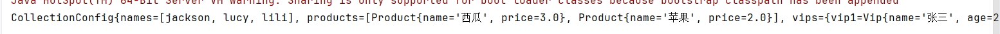

### 将配置绑定到第三方对象
将配置文件中的信息绑定到某个Bean对象上，如果这个Bean对象没有源码，是第三方库提供的，怎么办？

此时可以单独编写一个方法，在方法上使用以下两个注解进行标注：

+ **@Bean**
+ **@ConfigurationProperties**

假设我们有这样一个类`Address`，代码如下：

```java
package com.powernode.sb307externalconfig.bean;

public class Address {
    private String city;
    private String street;
    private String zipcode;

    public String getCity() {
        return city;
    }

    public void setCity(String city) {
        this.city = city;
    }

    public String getStreet() {
        return street;
    }

    public void setStreet(String street) {
        this.street = street;
    }

    public String getZipcode() {
        return zipcode;
    }

    public void setZipcode(String zipcode) {
        this.zipcode = zipcode;
    }

    @Override
    public String toString() {
        return "Address{" +
                "city='" + city + '\'' +
                ", street='" + street + '\'' +
                ", zipcode='" + zipcode + '\'' +
                '}';
    }
}

```

当然，我们是看不到这个源码的，只知道有这样一个字节码`Address.class`。大家也可以看到这个`Address`类上没有添加任何注解。假设我们要将以下配置绑定到这个Bean上应该怎么做？

```yaml
address:
  city: TJ
  street: XiangYangLu
  zipcode: 11111111
```

实现代码如下：

```java
@Configuration
public class ApplicationConfig {
    @Bean
    @ConfigurationProperties(prefix = "address")
    public Address getAddress(){
        return new Address();
    }
}
```

运行结果如下：


### 指定数据来源
之前所讲的内容是将Spring Boot框架默认的配置文件`application.properties`或`application.yml`作为数据的来源绑定到Bean上。如果配置信息没有在默认的配置文件中呢？可以使用@PropertySource注解指定配置文件的位置，这个配置文件可以是`.properties`，也可以是`.xml`。这里重点掌握`.properties`即可。

在`resources`目录下新建`a`目录，在`a`目录下新建`b`目录，`b`目录中新建`group-info.properties`文件，进行如下的配置：

```properties
group.name=IT
group.leader=LaoDu
group.count=20
```

定义Java类`Group`，然后进行注解标注：

```java
package com.powernode.sb307externalconfig.bean;

import org.springframework.boot.context.properties.ConfigurationProperties;
import org.springframework.context.annotation.Configuration;
import org.springframework.context.annotation.PropertySource;

@Configuration
@ConfigurationProperties(prefix = "group")
@PropertySource("classpath:a/b/group-info.properties")
public class Group {
    private String name;
    private String leader;
    private Integer count;

    @Override
    public String toString() {
        return "Group{" +
                "name='" + name + '\'' +
                ", leader='" + leader + '\'' +
                ", count=" + count +
                '}';
    }

    public String getName() {
        return name;
    }

    public void setName(String name) {
        this.name = name;
    }

    public String getLeader() {
        return leader;
    }

    public void setLeader(String leader) {
        this.leader = leader;
    }

    public Integer getCount() {
        return count;
    }

    public void setCount(Integer count) {
        this.count = count;
    }
}

```

以下三个注解分别起到什么作用：

+ @Configuration：指定该类为配置类，纳入Spring容器的管理
+ @ConfigurationProperties(prefix = "group")：将配置文件中的值赋值给Bean对象的属性
+ @PropertySource("classpath:a/b/group-info.properties")：指定额外的配置文件

编写测试程序，测试结果如下：


## @ImportResource注解
创建Bean的三种方式总结：

+ 第一种方式：编写applicationContext.xml文件，在该文件中注册Bean，Spring容器启动时实例化配置文件中的Bean对象。
+ 第二种方式：@Configuration注解结合@Bean注解。
+ 第三种方式：@Component、@Service、@Controller、@Repository等注解。

第二种和第三种我们都已经知道了。针对第一种方式，如果在SpringBoot框架中应该怎么实现呢？使用@ImportResource注解实现

定义一个普通的Java类：Person

```java
package com.powernode.sb307externalconfig.bean;

public class Person {
    private String name;
    private String age;

    @Override
    public String toString() {
        return "Person{" +
                "name='" + name + '\'' +
                ", age='" + age + '\'' +
                '}';
    }

    public String getName() {
        return name;
    }

    public void setName(String name) {
        this.name = name;
    }

    public String getAge() {
        return age;
    }

    public void setAge(String age) {
        this.age = age;
    }
}

```

在`resources`目录下新建`applicationContext.xml`配置文件：

```xml
<?xml version="1.0" encoding="UTF-8"?>
<beans xmlns="http://www.springframework.org/schema/beans"
       xmlns:xsi="http://www.w3.org/2001/XMLSchema-instance"
       xsi:schemaLocation="http://www.springframework.org/schema/beans http://www.springframework.org/schema/beans/spring-beans.xsd">
    <bean id="person" class="com.powernode.sb307externalconfig.bean.Person">
        <property name="name" value="jackson"/>
        <property name="age" value="20"/>
    </bean>
</beans>
```

在SpringBoot主入口类上添加@ImportResource进行资源导入，这样`applicationContext.xml`文件中的Bean将会纳入IoC容器的管理：

```java
@ImportResource("classpath:applicationContext.xml")
public class Sb307ExternalConfigApplication {}
```

编写测试程序，看看是否可以获取到`person`这个bean对象：

```java
@SpringBootTest
class Sb307ExternalConfigApplicationTests {
    @Autowired
    private Person person;
    @Test
    void test09(){
        System.out.println(person);
    }
}
```

执行结果如下：

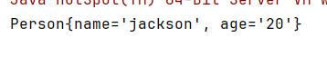

因此，项目中如果有类似于Spring的这种xml配置文件，要想纳入IoC容器管理，需要在入口类上使用`@ImportResource("classpath:applicationContext.xml")`注解即可。

## Environment
**\<font style="color:#DF2A3F;"\>SpringBoot框架在启动的时候会将系统配置，环境信息全部封装到\</font\>**`**<font style="color:#DF2A3F;">Environment</font>**`**\<font style="color:#DF2A3F;"\>对象中，如果要获取这些环境信息，可以调用\</font\>**`**<font style="color:#DF2A3F;">Environment</font>**`**\<font style="color:#DF2A3F;"\>接口的方法。\</font\>**

在Spring Boot中，`Environment`接口提供了访问应用程序环境信息的方法，比如活动配置文件、系统环境变量、命令行参数等。`Environment`接口由Spring框架提供，Spring Boot应用程序通常会使用Spring提供的实现类`AbstractEnvironment`及其子类来实现具体的环境功能。

`Environment`对象封装的主要数据包括：

1. **Active Profiles**: 当前激活的配置文件列表。Spring Boot允许应用程序定义不同的环境配置文件（如开发环境、测试环境和生产环境），通过激活不同的配置文件来改变应用程序的行为。
2. **System Properties**: 系统属性，通常是操作系统级别的属性，比如操作系统名称、Java版本等。
3. **System Environment Variables**: 系统环境变量，这些变量通常是由操作系统提供的，可以在启动应用程序时设置特定的值。
4. **Command Line Arguments**: 应用程序启动时传递给主方法的命令行参数。
5. **Property Sources**: `Environment`还包含了一个`PropertySource`列表，这个列表包含了从不同来源加载的所有属性。`PropertySource`可以来自多种地方，比如配置文件、系统属性、环境变量等。

在Spring Boot中，可以通过注入`Environment`来获取上述信息。例如：

```java
package com.powernode.springboot.bean;

import org.springframework.beans.factory.annotation.Autowired;
import org.springframework.core.env.Environment;
import org.springframework.stereotype.Component;

@Component
public class SomeBean {

    @Autowired
    private Environment environment;

    public void doSome(){
        // 直接使用这个环境对象，来获取环境信息，配置信息等。
        String[] activeProfiles = environment.getActiveProfiles();
        for (String activeProfile : activeProfiles) {
            System.out.println(activeProfile);
        }

        // 获取配置信息
        String street = environment.getProperty("app.xyz.addr.street");
        System.out.println(street);
    }
}

```

通过这种方式，你可以根据环境的不同灵活地配置你的应用程序。`Environment`是一个非常有用的工具，它可以帮助你管理各种类型的配置信息，并根据不同的运行时条件做出相应的调整。

# Spring Boot中如何进行AOP的开发
## Spring Boot AOP概述
面向切面编程AOP在Spring教程中已经进行了详细讲解，这里不再赘述，如果忘记的同学，可以重新听一下Spring教程中AOP相关的内容。这里仅带着大家在Spring Boot中实现AOP编程。

Spring Boot的AOP编程和Spring框架中AOP编程的唯一区别是：引入依赖的方式不同。其他内容完全一样。Spring Boot中AOP编程需要引入aop启动器：

```xml
<!--aop启动器-->
<dependency>
  <groupId>org.springframework.boot</groupId>
  <artifactId>spring-boot-starter-aop</artifactId>
</dependency>
```

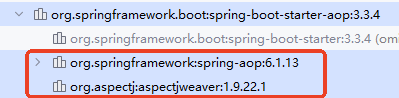

可以看到，当引入`aop启动器`之后，会引入`aop依赖`和`aspectj依赖`。

+ aop依赖：如果只有这一个依赖，也可以实现AOP编程，这种方式表示使用了纯Spring AOP实现aop编程。
+ aspectj依赖：一个独立的可以完成AOP编程的AOP框架，属于第三方的，不属于Spring框架。（我们通常用它，因为它的功能更加强大）

## Spring Boot AOP实现
实现功能：项目中很多service，要求执行`任何service中的任何方法之前`记录日志。

### 创建Spring Boot项目引入aop启动器
项目名：sb3-08-aop

```xml
<!--aop启动器-->
<dependency>
  <groupId>org.springframework.boot</groupId>
  <artifactId>spring-boot-starter-aop</artifactId>
</dependency>
```

### 编写service并提供方法
```java
package com.powernode.aop.service;

public interface OrderService {
    /**
     * 生成订单
     */
    void generate();

    /**
     * 订单详情
     */
    void detail();
}
```

```java
package com.powernode.aop.service.impl;

import com.powernode.aop.service.OrderService;
import org.springframework.stereotype.Service;

@Service("orderService")
public class OrderServiceImpl implements OrderService {
    @Override
    public void generate(Integer id, String name) {
        System.out.println("生成订单");
    }

    @Override
    public void detail(Integer id) {
        System.out.println("订单详情");
    }
}

```

### 编写切面
```java
package com.powernode.aop;

import org.aspectj.lang.JoinPoint;
import org.aspectj.lang.annotation.Aspect;
import org.aspectj.lang.annotation.Before;
import org.springframework.stereotype.Component;

import java.time.LocalDateTime;
import java.time.format.DateTimeFormatter;

@Component // 纳入IoC容器
@Aspect // 指定该类为切面类
public class LogAspect {

    // 日期格式化器
    private DateTimeFormatter formatter = DateTimeFormatter.ofPattern("yyyy-MM-dd HH:mm:ss SSS");

    // 前置通知
    // 切入点表达式：service包下任意类的任意方法
    @Before("execution(* com.powernode.aop.service..*.*(..))")
    public void sysLog(JoinPoint joinPoint) throws Throwable {
        StringBuilder log = new StringBuilder();
        LocalDateTime now = LocalDateTime.now();
        String strNow = formatter.format(now);
        // 追加日期
        log.append(strNow);
        // 追加冒号
        log.append(":");
        // 追加方法签名
        log.append(joinPoint.getSignature().getName());
        // 追加方法参数
        log.append("(");
        Object[] args = joinPoint.getArgs();
        for (int i = 0; i < args.length; i++) {
            log.append(args[i]);
            if(i < args.length - 1) {
                log.append(",");
            }
        }
        log.append(")");
        System.out.println(log);
    }
}

```

### 测试
```java
package com.powernode.aop;

import com.powernode.aop.service.OrderService;
import org.junit.jupiter.api.Test;
import org.springframework.beans.factory.annotation.Autowired;
import org.springframework.boot.test.context.SpringBootTest;

@SpringBootTest
class Sb308AopApplicationTests {

	@Autowired
	private OrderService orderService;

	@Test
	void contextLoads() {
		orderService.generate(10, "name");
		orderService.detail(10);
	}

}

```

执行结果如下：

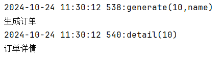

---

## 第3章 SSM整合

# 整合持久层框架MyBatis

## 准备数据库表及数据
创建数据库：springboot


使用IDEA工具自带的mysql插件来完成表的创建和数据的准备：


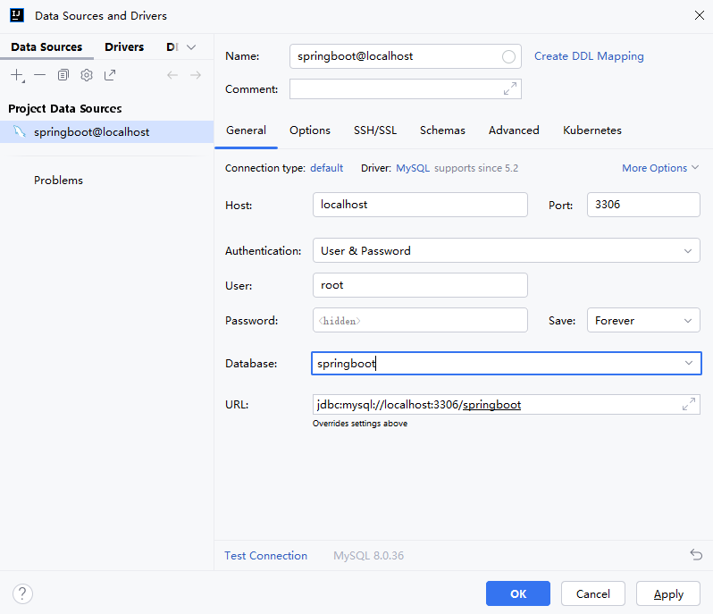


表创建成功后，为表准备数据，如下：

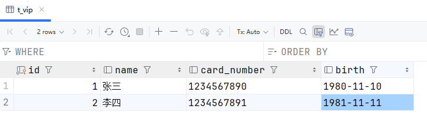

## 创建SpringBoot项目
使用脚手架创建Spring Boot项目

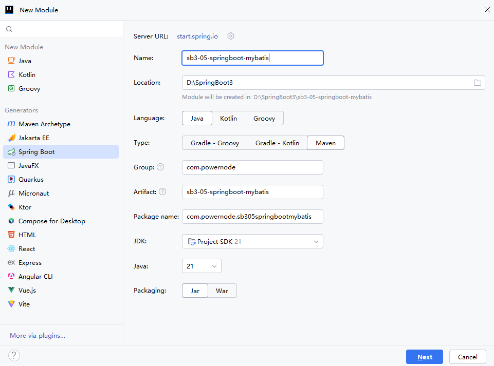

引入mysql驱动以及mybatis的启动器


依赖如下：

```xml
<!--mybatis的启动器-->
<dependency>
    <groupId>org.mybatis.spring.boot</groupId>
    <artifactId>mybatis-spring-boot-starter</artifactId>
    <version>3.0.3</version>
</dependency>
<!--mysql的驱动依赖-->
<dependency>
    <groupId>com.mysql</groupId>
    <artifactId>mysql-connector-j</artifactId>
    <scope>runtime</scope>
</dependency>
```

**\<font style="color:#DF2A3F;"\>注意，之前也提到过：\</font\>**

+ **\<font style="color:#DF2A3F;"\>Spring Boot官方提供的启动器的名字规则：spring-boot-starter-xxx\</font\>**
+ **\<font style="color:#DF2A3F;"\>第三方（非Spring Boot官方）提供的启动器的名字规则：xxx-spring-boot-starter\</font\>**

## 编写数据源配置
前面提到过，Spring Boot配置统一可以编写到application.properties中，配置如下：

```properties
# Spring Boot脚手架自动生成的
spring.application.name=sb3-05-springboot-mybatis

# mybatis连接数据库的数据源
spring.datasource.type=com.zaxxer.hikari.HikariDataSource
spring.datasource.driver-class-name=com.mysql.cj.jdbc.Driver
spring.datasource.url=jdbc:mysql://localhost:3306/springboot
spring.datasource.username=root
spring.datasource.password=123456
```

以上的配置属于连接池的配置，连接池使用的是Spring Boot默认的连接池：HikariCP

## 编写实体类Vip
表`t_vip`中的字段分别是：

+ id
+ name
+ card_number
+ birth

对应实体类`Vip`中的属性名分别是：

+ Long id;
+ String name;
+ String cardNumber;
+ String birth;

创建包`model`，在该包下新建Vip类，代码如下：

```java
package com.powernode.sb305springbootmybatis.model;

public class Vip {
    private Long id;
    private String name;
    private String cardNumber;
    private String birth;

    public Vip() {
    }

    public Vip(Long id, String name, String cardNumber, String birth) {
        this.id = id;
        this.name = name;
        this.cardNumber = cardNumber;
        this.birth = birth;
    }

    public Vip(String name, String cardNumber, String birth) {
        this.name = name;
        this.cardNumber = cardNumber;
        this.birth = birth;
    }

    public Long getId() {
        return id;
    }

    public void setId(Long id) {
        this.id = id;
    }

    public String getName() {
        return name;
    }

    public void setName(String name) {
        this.name = name;
    }

    public String getCardNumber() {
        return cardNumber;
    }

    public void setCardNumber(String cardNumber) {
        this.cardNumber = cardNumber;
    }

    public String getBirth() {
        return birth;
    }

    public void setBirth(String birth) {
        this.birth = birth;
    }

    @Override
    public String toString() {
        return "Vip{" +
                "id=" + id +
                ", name='" + name + '\'' +
                ", cardNumber='" + cardNumber + '\'' +
                ", birth='" + birth + '\'' +
                '}';
    }
}
```

以上代码可以使用第三方库Lombok进行改造，后面再说。

## 编写Mapper接口
创建`repository`包，在该包下新建`VipMapper`接口，代码如下：

```java
package com.powernode.sb305springbootmybatis.repository;

import com.powernode.sb305springbootmybatis.model.Vip;

import java.util.List;

public interface VipMapper {
    /**
     * 插入会员信息
     * @param vip
     * @return 1表示插入成功，其他值表示失败
     */
    int insert(Vip vip);

    /**
     * 根据id删除会员信息
     * @param id 会员唯一标识
     * @return 1表示删除成功，其他值表示失败
     */
    int deleteById(Long id);

    /**
     * 更新会员信息（id不可更新）
     * @param vip 会员信息
     * @return 1表示更新成功，其他值表示更新失败。
     */
    int update(Vip vip);

    /**
     * 根据id查询会员信息
     * @param id 会员的唯一标识
     * @return 会员信息
     */
    Vip selectById(Long id);

    /**
     * 获取所有会员信息
     * @return
     */
    List<Vip> selectAll();
}
```

## 编写Mapper接口的XML配置文件
在`resources`目录下新建`mapper`目录，将来的`mapper.xml`配置文件放在这个目录下。

安装`MyBatisX`插件，该插件可以根据我们编写的`VipMapper`接口自动生成mapper的XML配置文件。

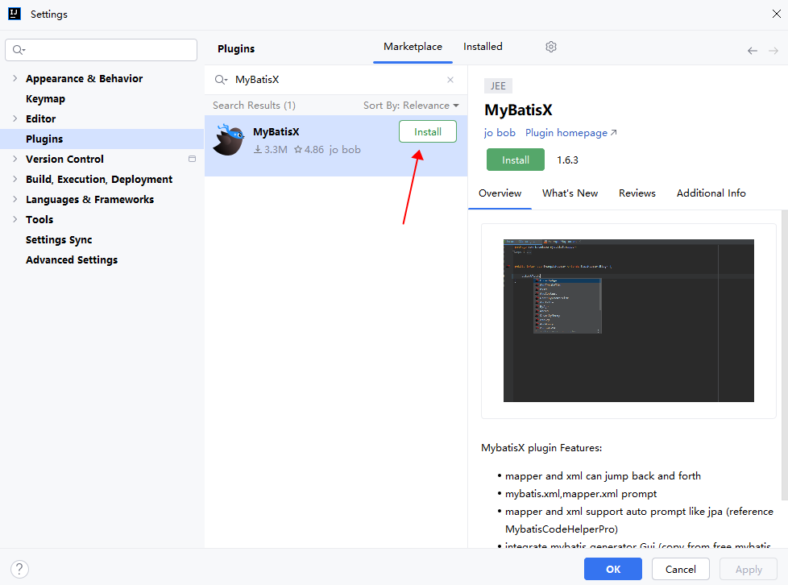

然后在`VipMapper`接口上：alt+enter

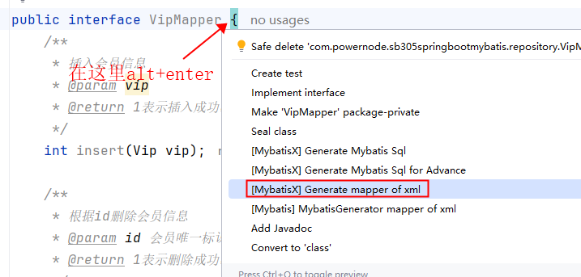

生成`mapper of xml`：需要选择一个生成的位置

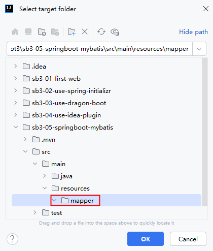

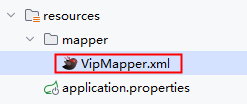

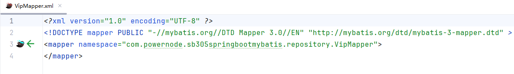

接下来，你会看到Mapper接口中方法报错了，可以在错误的位置上使用`alt+enter`，选择`Generate statement`：

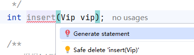

这个时候在mapper的xml配置文件中便生成了对应的配置，如下：

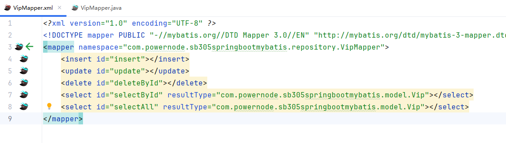

接下来就是编写SQL语句了，最终`VipMapper.xml`文件的配置如下：

```xml
<?xml version="1.0" encoding="UTF-8" ?>
<!DOCTYPE mapper PUBLIC "-//mybatis.org//DTD Mapper 3.0//EN" "http://mybatis.org/dtd/mybatis-3-mapper.dtd" >
<mapper namespace="com.powernode.sb305springbootmybatis.repository.VipMapper">
    <insert id="insert">
        insert into t_vip(id,name,card_number,birth) values(null,#{name},#{cardNumber},#{birth})
    </insert>
    <update id="update">
        update t_vip set name=#{name},card_number=#{cardNumber},birth=#{birth} where id=#{id}
    </update>
    <delete id="deleteById">
        delete from t_vip where id = #{id}
    </delete>
    <select id="selectById" resultType="com.powernode.sb305springbootmybatis.model.Vip">
        select * from t_vip where id=#{id}
    </select>
    <select id="selectAll" resultType="com.powernode.sb305springbootmybatis.model.Vip">
        select * from t_vip
    </select>
</mapper>
```

## 添加Mapper的扫描
在Spring Boot的入口程序上添加如下的注解，来完成`VipMapper`接口的扫描：

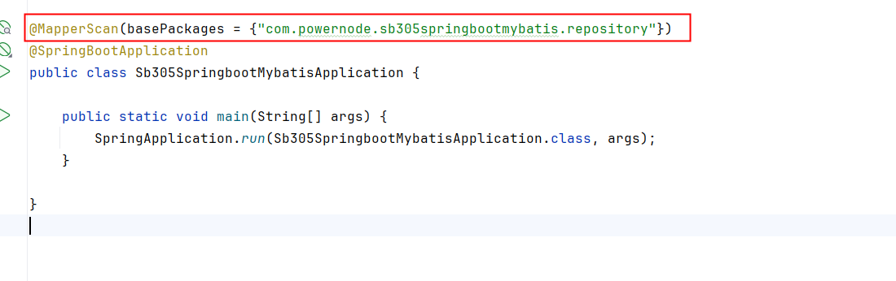

## 告诉MyBatis框架MapperXML文件的位置
在`application.properties`配置文件中进行如下配置：

```properties
mybatis.mapper-locations=classpath:mapper/*.xml
```

## 测试整合MyBatis是否成功
在Spring Boot主入口程序中获取Spring上下文对象`ApplicationContext`，从Spring容器中获取`VipMapper`对象，然后调用相关方法进行测试：

```java
package com.powernode.sb305springbootmybatis;

import com.powernode.sb305springbootmybatis.model.Vip;
import com.powernode.sb305springbootmybatis.repository.VipMapper;
import org.mybatis.spring.annotation.MapperScan;
import org.springframework.boot.SpringApplication;
import org.springframework.boot.autoconfigure.SpringBootApplication;
import org.springframework.context.ConfigurableApplicationContext;

@MapperScan(basePackages = {"com.powernode.sb305springbootmybatis.repository"})
@SpringBootApplication
public class Sb305SpringbootMybatisApplication {

    public static void main(String[] args) {
        // 获取Spring上下文
        ConfigurableApplicationContext applicationContext = SpringApplication.run(Sb305SpringbootMybatisApplication.class, args);
        // 根据id获取容器中的对象
        VipMapper vipMapper = applicationContext.getBean("vipMapper", VipMapper.class);
        Vip vip = vipMapper.selectById(1L);
        System.out.println(vip);
        // 关闭Spring上下文
        applicationContext.close();
    }

}

```

测试结果：

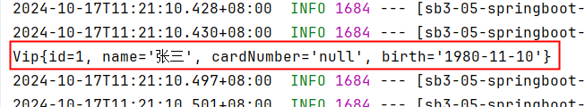

测试结果中可以看到`cardNumber`属性没有赋值成功，原因是：表中的字段名叫做`card_number`，和实体类`Vip`的属性名`cardNumber`对应不上。解决办法两个：

+ **第一种方式：查询语句使用as关键字起别名，让查询结果列名和实体类的属性名对应上。**

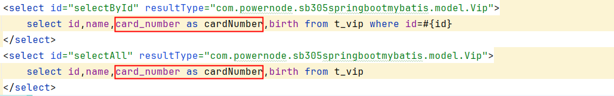

再次测试：


+ **第二种方式：通过配置自动映射**

在`application.properties`配置文件中进行如下配置：

```properties
mybatis.configuration.map-underscore-to-camel-case=true
```

map-underscore-to-camel-case 是一个配置项，主要用于处理数据库字段名与Java对象属性名之间的命名差异。在许多数据库中，字段名通常使用下划线（_）分隔单词，例如 first_name 或 last_name。而在Java代码中，变量名通常使用驼峰式命名法（camel case），如 firstName 和 lastName。

当使用MyBatis作为ORM框架时，默认情况下它会将SQL查询结果映射到Java对象的属性上。如果数据库中的字段名与Java对象的属性名不一致，那么就需要手动为每个字段指定相应的属性名，或者使用某种方式来自动转换这些名称。

map-underscore-to-camel-case 这个配置项的作用就是在查询结果映射到Java对象时，自动将下划线分隔的字段名转换成驼峰式命名法。这样可以减少手动映射的工作量，并提高代码的可读性和可维护性。

mapper的xml文件中的sql语句仍然使用`*`的方式：

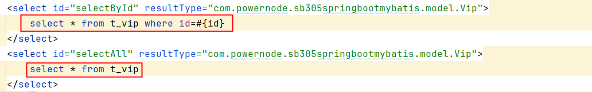

测试结果如下：


## 测试其他方法是否正常
测试程序如下：

```java
package com.powernode.sb305springbootmybatis;

import com.powernode.sb305springbootmybatis.model.Vip;
import com.powernode.sb305springbootmybatis.repository.VipMapper;
import org.mybatis.spring.annotation.MapperScan;
import org.springframework.boot.SpringApplication;
import org.springframework.boot.autoconfigure.SpringBootApplication;
import org.springframework.context.ConfigurableApplicationContext;

import java.util.List;

@MapperScan(basePackages = {"com.powernode.sb305springbootmybatis.repository"})
@SpringBootApplication
public class Sb305SpringbootMybatisApplication {

    public static void main(String[] args) {
        // 获取Spring上下文
        ConfigurableApplicationContext applicationContext = SpringApplication.run(Sb305SpringbootMybatisApplication.class, args);
        // 根据id获取容器中的对象
        VipMapper vipMapper = applicationContext.getBean("vipMapper", VipMapper.class);
        Vip vip = vipMapper.selectById(1L);
        System.out.println(vip);
        // 添加会员信息
        Vip newVip = new Vip("杰克", "1234567892", "1999-11-10");
        vipMapper.insert(newVip);
        // 查询所有会员信息
        List<Vip> vips = vipMapper.selectAll();
        System.out.println(vips);
        // 修改会员信息
        vip.setName("zhangsan");
        vipMapper.update(vip);
        // 查询所有会员信息
        List<Vip> vips2 = vipMapper.selectAll();
        System.out.println(vips2);
        // 删除会员信息
        vipMapper.deleteById(1L);
        // 查询所有会员信息
        List<Vip> vips3 = vipMapper.selectAll();
        System.out.println(vips3);
        // 关闭Spring上下文
        applicationContext.close();
    }

}

```

执行结果如下：


到此为止，我们已经完成了Spring Boot整合MyBatis的操作。

# Lombok库
Lombok 是一个 Java 库，它可以通过注解的方式减少 Java 代码中的样板代码。Lombok 自动为你生成构造函数、getter、setter、equals、hashCode、toString 方法等，从而避免了手动编写这些重复性的代码。这不仅减少了出错的机会，还让代码看起来更加简洁。

**\<font style="color:#DF2A3F;"\>Lombok只是一个编译阶段的库，能够帮我们自动补充代码，在Java程序运行阶段并不起作用。（因此Lombok库并不会影响Java程序的执行效率）\</font\>**

例如我们有这样一个java源文件`User.java`，代码如下：

```java
@Data
public class User{
    private String name;
}
```

以上代码在程序的编译阶段，Lombok库会将`User.java`文件编译生成这样的`User.class`字节码文件：

```java
public class com.powernode.lomboktest.model.User {
  public com.powernode.lomboktest.model.User();
    Code:
       0: aload_0
       1: invokespecial #1                  // Method java/lang/Object."<init>":()V
       4: return

  public java.lang.String getName();
    Code:
       0: aload_0
       1: getfield      #7                  // Field name:Ljava/lang/String;
       4: areturn

  public void setName(java.lang.String);
    Code:
       0: aload_0
       1: aload_1
       2: putfield      #7                  // Field name:Ljava/lang/String;
       5: return

  public boolean equals(java.lang.Object);
    Code:
       0: aload_1
       1: aload_0
       2: if_acmpne     7
       5: iconst_1
       6: ireturn
       7: aload_1
       8: instanceof    #8                  // class com/powernode/lomboktest/model/User
      11: ifne          16
      14: iconst_0
      15: ireturn
      16: aload_1
      17: checkcast     #8                  // class com/powernode/lomboktest/model/User
      20: astore_2
      21: aload_2
      22: aload_0
      23: invokevirtual #13                 // Method canEqual:(Ljava/lang/Object;)Z
      26: ifne          31
      29: iconst_0
      30: ireturn
      31: aload_0
      32: invokevirtual #17                 // Method getName:()Ljava/lang/String;
      35: astore_3
      36: aload_2
      37: invokevirtual #17                 // Method getName:()Ljava/lang/String;
      40: astore        4
      42: aload_3
      43: ifnonnull     54
      46: aload         4
      48: ifnull        65
      51: goto          63
      54: aload_3
      55: aload         4
      57: invokevirtual #21                 // Method java/lang/Object.equals:(Ljava/lang/Object;)Z
      60: ifne          65
      63: iconst_0
      64: ireturn
      65: iconst_1
      66: ireturn

  protected boolean canEqual(java.lang.Object);
    Code:
       0: aload_1
       1: instanceof    #8                  // class com/powernode/lomboktest/model/User
       4: ireturn

  public int hashCode();
    Code:
       0: bipush        59
       2: istore_1
       3: iconst_1
       4: istore_2
       5: aload_0
       6: invokevirtual #17                 // Method getName:()Ljava/lang/String;
       9: astore_3
      10: iload_2
      11: bipush        59
      13: imul
      14: aload_3
      15: ifnonnull     23
      18: bipush        43
      20: goto          27
      23: aload_3
      24: invokevirtual #24                 // Method java/lang/Object.hashCode:()I
      27: iadd
      28: istore_2
      29: iload_2
      30: ireturn

  public java.lang.String toString();
    Code:
       0: aload_0
       1: invokevirtual #17                 // Method getName:()Ljava/lang/String;
       4: invokedynamic #28,  0             // InvokeDynamic #0:makeConcatWithConstants:(Ljava/lang/String;)Ljava/lang/String;
       9: areturn
}
```

通过字节码可以看到Lombok库的`@Data`注解可以帮助我们生成`无参构造器`、`setter`、`getter`、`toString`、`hashCode`、`equals`。

## Lombok 的主要注解
**@Data**：

+ 等价于 `@ToString`, `@EqualsAndHashCode`, `@Getter`，`@Setter`, `@RequiredArgsConstructor`.
+ 用于生成：必要参数的构造方法、getter、setter、toString、equals 和 hashcode 方法。

**@Getter** / **@Setter**：

+ 分别用于生成所有的 getter 和 setter 方法。
+ 可以作用于整个类，也可以作用于特定的字段。

**@NoArgsConstructor**：

+ 生成一个无参构造方法。

**@AllArgsConstructor**：

+ 生成一个包含所有实例变量的构造器。

**@RequiredArgsConstructor**：

+ 生成包含所有被 `final` 修饰符修饰的实例变量的构造方法。
+ **\<font style="color:#DF2A3F;"\>如果没有\</font\>**`**<font style="color:#DF2A3F;">final</font>**`**\<font style="color:#DF2A3F;"\>的实例变量，则自动生成无参数构造方法。\</font\>**

**@ToString** / **@EqualsAndHashCode**：

+ 用于生成 toString 和 equals/hashCode 方法。
+ **\<font style="color:#DF2A3F;"\>这两个注解都有\</font\>**`**<font style="color:#DF2A3F;">exclude</font>**`**\<font style="color:#DF2A3F;background-color:#ffffff;"\>属性，通过这个属性可以定制toString、hashCode、equals方法。\</font\>**

**\<font style="color:#DF2A3F;background-color:#ffffff;"\>\</font\>**

## 如何使用 Lombok？
创建一个普通的Maven模块来快速测试一下Lombok库的使用：

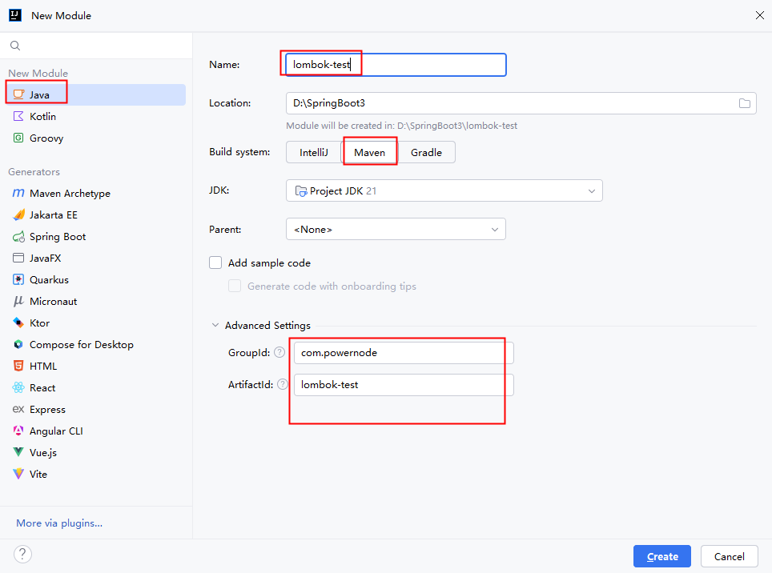

### 添加依赖
在 Maven 的 `pom.xml` 文件中添加 Lombok 依赖：

```xml
<dependency>
    <groupId>org.projectlombok</groupId>
    <artifactId>lombok</artifactId>
    <version>1.18.34</version>
    <scope>provided</scope>
</dependency>
```

### IDEA中安装Lombok插件
高版本的IntelliJ IDEA工具默认都是绑定Lombok插件的，不需要再额外安装：

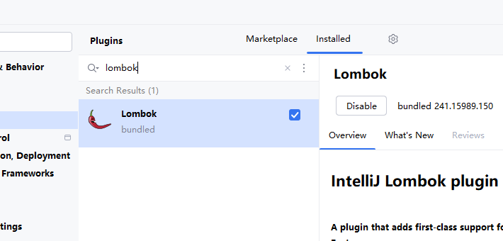

**\<font style="color:#DF2A3F;"\>Lombok插件不是必须要安装的\</font\>**，为了提高开发效率以及开发者的体验，安装Lombok插件是有必要的。

也就是说安装了Lombok插件之后，编写代码的时候，才会有方法的提示功能。

当IDEA中没有安装lombok插件时：

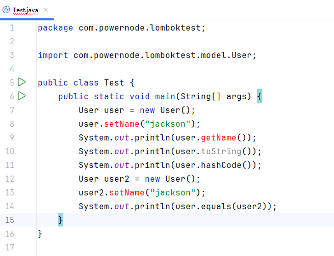

但是程序可以正常执行：

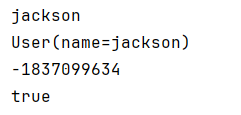

如果在IDEA中安装了lombok插件：

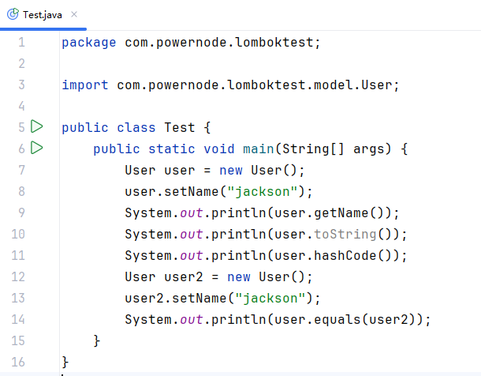

程序会有很好的提示功能。

### 使用 Lombok 注解
在 Java 类中使用 Lombok 提供的注解。

```java
import lombok.Data;

@Data
public class User {
    private String name;
}
```

编写测试程序：

```java
package com.powernode.lomboktest;

import com.powernode.lomboktest.model.User;

public class Test {
    public static void main(String[] args) {
        User user = new User();
        user.setName("jackson");
        System.out.println(user.getName());
        System.out.println(user.toString());
        System.out.println(user.hashCode());
        User user2 = new User();
        user2.setName("jackson");
        System.out.println(user.equals(user2));
    }
}

```

测试结果：

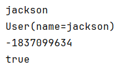

以下的注解可以自行测试：

+ @Getter
+ @Setter
+ @ToString【exclude属性】
+ @EqualsAndHashCode【exclude属性】
+ @NoArgsConstructor
+ @AllArgsConstructor
+ @RequiredArgsConstructor

**\<font style="color:#DF2A3F;"\>注：Lombok只能帮助我们生成无参数构造方法和全参数构造方法，其他定制参数的构造方法无法生成。\</font\>**

## Lombok的其他常用注解
@Value

@Builder

@Singular

@Slf4j

......

### @Value
该注解会给所有属性添加`final`，给所有属性提供`getter`方法，自动生成`toString`、`hashCode`、`equals`

**通过这个注解可以创建不可变对象。**

```java
package com.powernode.lomboktest.model;

import lombok.Value;

@Value
public class Customer {
    Long id;
    String name;
    String password;
}
```

测试程序：

```java
package com.powernode.lomboktest;

import com.powernode.lomboktest.model.Customer;

public class CustomerTest {
    public static void main(String[] args) {
        Customer c1 = new Customer(1L, "jackson", "123");
        System.out.println(c1);
        System.out.println(c1.getId());
        System.out.println(c1.getName());
        System.out.println(c1.getPassword());
        System.out.println(c1.hashCode());
        Customer c2 = new Customer(1L, "jackson", "123");
        System.out.println(c1.equals(c2));
    }
}

```

运行结果：


可以查看一下字节码，你会发现，@Value注解的作用只会生成：全参数构造方法、getter方法、hashCode、equals、toString方法。（没有setter方法。）

### @Builder
#### GoF23种设计模式之一：建造模式
建造模式（Builder Pattern）属于创建型设计模式。GoF23种设计模式之一。

用于解决对象创建时参数过多的问题。它通过将对象的构造过程与其表示分离，使得构造过程可以逐步完成，而不是一次性提供所有参数。建造模式的主要目的是让对象的创建过程更加清晰、灵活和可控。

简而言之，建造模式用于：

1. **简化构造过程**：通过逐步构造对象，避免构造函数参数过多。
2. **提高可读性和可维护性**：让构造过程更加清晰和有序。
3. **增强灵活性**：允许按需配置对象的不同部分。

这样可以更方便地创建复杂对象，并且使得代码更加易于理解和维护。

#### 建造模式的代码
建造模式代码如下：

```java
package com.powernode.lomboktest.model;

// 建造模式
public class Person {
    // 属性
    private final String name;
    private final int age;
    private final String email;

    // 私有的全参数构造方法
    private Person(String name, int age, String email) {
        this.name = name;
        this.age = age;
        this.email = email;
    }

    public String getName() {
        return name;
    }

    public int getAge() {
        return age;
    }

    public String getEmail() {
        return email;
    }

    public static PersonBuilder builder() {
        return new PersonBuilder();
    }

    // 静态内部类
    public static class PersonBuilder {
        private String name;
        private int age;
        private String email;

        public PersonBuilder name(String name) {
            this.name = name;
            return this;
        }

        public PersonBuilder age(int age) {
            this.age = age;
            return this;
        }

        public PersonBuilder email(String email) {
            this.email = email;
            return this;
        }

        // 建造对象的核心方法
        public Person build() {
            return new Person(name, age, email);
        }
    }

    @Override
    public String toString() {
        return "Person{" + "name='" + name + '\'' + ", age=" + age + ", email='" + email + '\'' + '}';
    }

    public static void main(String[] args) {
        Person person = Person.builder()
                .name("jackson")
                .age(20)
                .email("jackson@123.com")
                .build();
        System.out.println(person);
    }
}

```

执行结果如下：


#### 使用@Builder注解自动生成建造模式的代码
该注解可以直接帮助我们生成以上的代码。使用`@Builder`注解改造以上代码。

```java
package com.powernode.lomboktest.model;

import lombok.Builder;
import lombok.Data;

@Data
@Builder
// 建造模式
public class Person {
    // 属性
    private String name;
    private int age;
    private String email;

    public static void main(String[] args) {
        Person person = Person.builder()
                .name("jackson")
                .age(20)
                .email("jackson@123.com")
                .build();
        System.out.println(person);
    }
}

```

执行结果：


### @Singular
@Singular注解是辅助@Builder注解的。

当被建造的对象的属性是一个集合，这个集合属性使用@Singular注解进行标注的话，可以连续调用集合属性对应的方法完成多个元素的添加。如果没有这个注解，则无法连续调用方法完成多个元素的添加。代码如下：

```java
package com.powernode.lomboktest.model;

import lombok.Builder;
import lombok.Data;
import lombok.Singular;

import java.util.List;

@Data
@Builder
// 建造模式
public class Person {
    // 属性
    private final String name;
    private final int age;
    private final String email;
    // Singular翻译为：单数。表示一条一条添加
    @Singular("addPhone")
    private final List<String> phones;

    public static void main(String[] args) {
        Person person = Person.builder()
                .name("jackson")
                .age(20)
                .email("jackson@123.com")
                .addPhone("15222020214")
                .addPhone("14875421424")
                .addPhone("16855241424")
                .build();
        System.out.println(person);
    }
}

```

执行结果如下：


### @Slf4j
Lombok 支持多种日志框架的注解，可以根据你使用的日志框架选择合适的注解。以下是 Lombok 提供的**\<font style="color:#DF2A3F;"\>部分日志注解\</font\>**及其对应的日志框架：

1. `@Log4j`：
    - 自动生成一个 `org.apache.log4j.Logger` 对象。
    - 适用于 Apache Log4j 1.x 版本。
2. `@Slf4j`：
    - 自动生成一个 `org.slf4j.Logger` 对象。
    - 适用于 SLF4J（Simple Logging Facade for Java），这是一种日志门面，可以与多种实际的日志框架（如 Logback、Log4j 等）集成。
3. `@Log4j2`：
    - 自动生成一个 `org.apache.logging.log4j.Logger` 对象。
    - 适用于 Apache Log4j 2.x 版本。

#### 使用示例
假设我们有一个类 `ExampleClass`，并且我们想要使用 SLF4J 作为日志框架，我们可以这样使用 `@Slf4j` 注解：

```java
package com.powernode.lomboktest.service;

import lombok.extern.slf4j.Slf4j;

@Slf4j
public class UserService {
    public void login(){
        log.info("登录验证...");
    }
    // 测试
    public static void main(String[] args) {
        UserService userService = new UserService();
        userService.login();
    }
}
```

在这个例子中，`log` 是一个静态成员变量，表示一个 `org.slf4j.Logger` 对象。Lombok 自动生成了这个日志对象，并且你可以直接使用它来进行日志记录。

#### 选择合适的注解
选择哪个注解取决于你使用的日志框架。例如：

+ 如果你使用的是 SLF4J，可以选择 `@Slf4j`。
+ 如果你使用的是 Log4j 1.x，可以选择 `@Log4j`。
+ 如果你使用的是 Log4j 2.x，可以选择 `@Log4j2`。

#### 注意事项
确保在使用这些注解之前，已经在项目中引入了相应的日志框架依赖。例如，如果你使用 SLF4J，你需要在项目中添加 SLF4J 的依赖，以及一个具体的日志实现（如 Logback）。对于其他日志框架，也需要相应地添加依赖。

#### 示例依赖
如果你使用 Maven 项目，并且选择了 SLF4J + Logback 的组合，可以添加以下依赖：

```xml
<!--Slf4j日志规范-->
<dependency>
    <groupId>org.slf4j</groupId>
    <artifactId>slf4j-api</artifactId>
    <version>2.0.16</version>
</dependency>
<!--Slf4j日志实现：logback-->
<dependency>
    <groupId>ch.qos.logback</groupId>
    <artifactId>logback-classic</artifactId>
    <version>1.5.11</version>
</dependency>
```

通过这些日志注解，你可以方便地在类中使用日志记录功能，而无需手动创建日志对象。

执行结果：

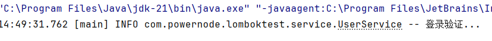

# MyBatis逆向生成
MyBatis逆向工程：使用IDEA插件可以根据数据库表的设计逆向生成MyBatis的Mapper接口 与 MapperXML文件。

## 安装插件`free mybatis tools`


## 在IDEA中配置数据源
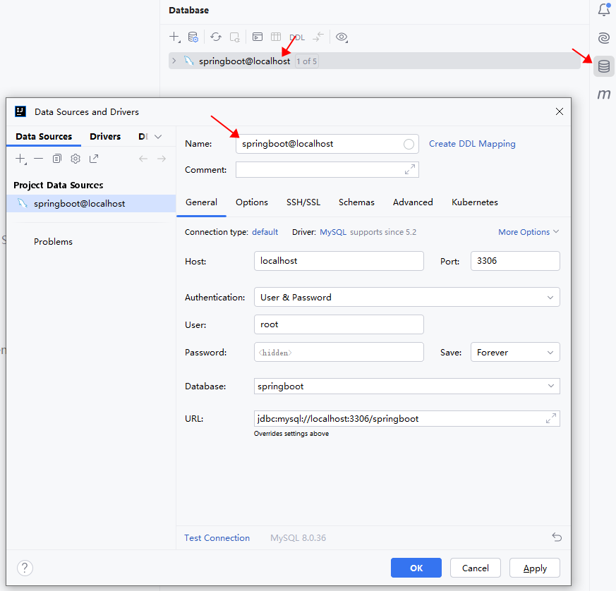

## 创建数据库，创建表，准备数据
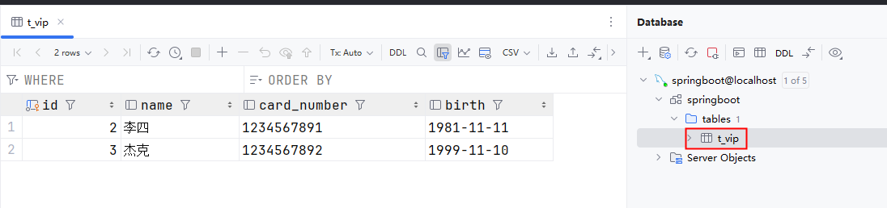

## 使用脚手架创建SpringBoot项目
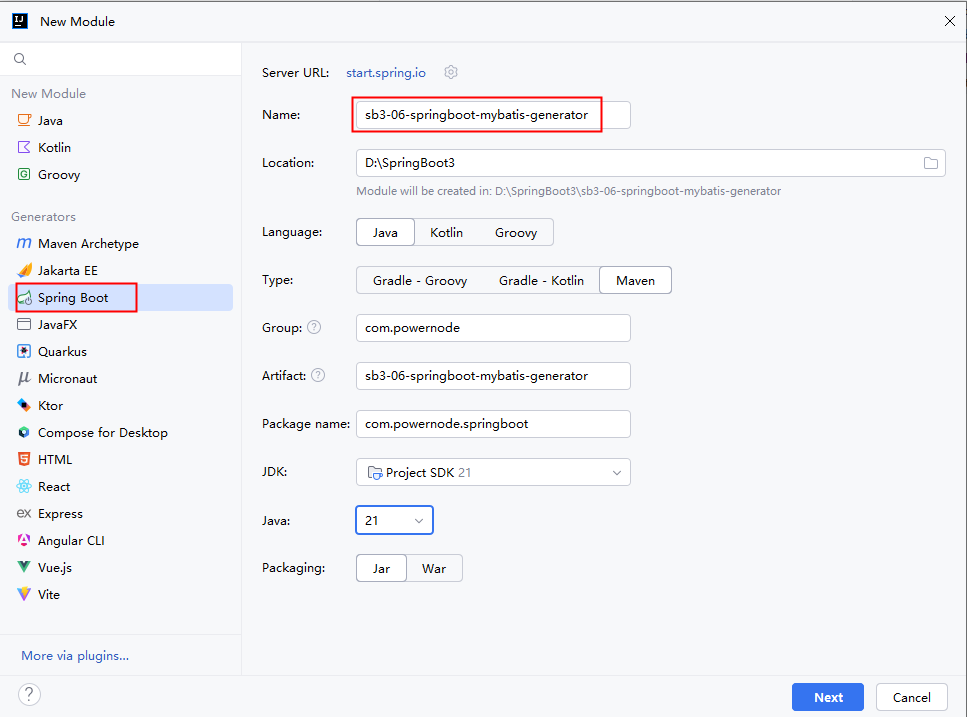

添加依赖：mybatis依赖、mysql驱动、Lombok库

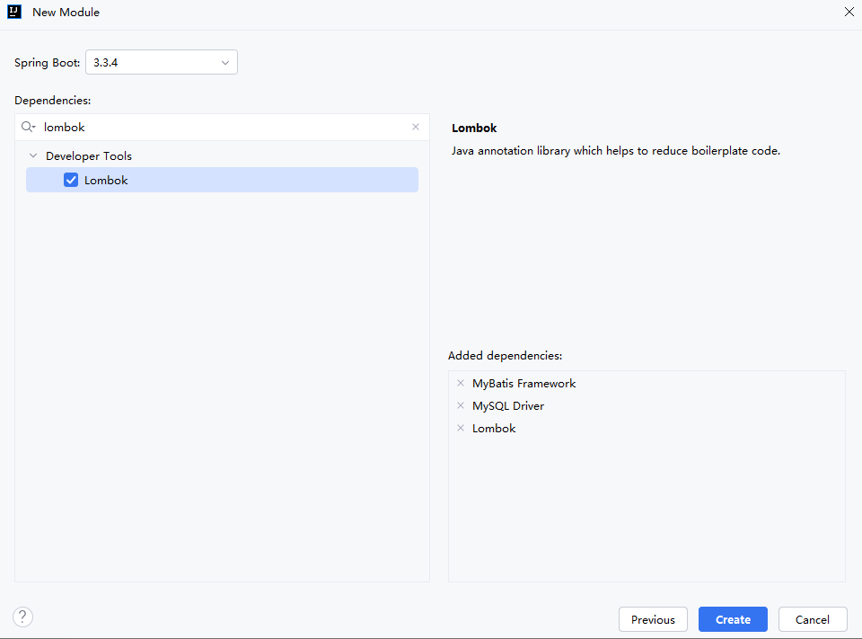

## 生成MyBatis代码放到SpringBoot项目中
在表上右键：Mybatis-Generator

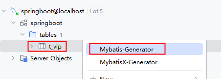


代码生成后，如果在IDEA中看不到，这样做（重新从硬盘加载）：


**\<font style="color:#DF2A3F;"\>注意：生成的\</font\>**`**<font style="color:#DF2A3F;">VipMapper</font>**`**\<font style="color:#DF2A3F;"\>接口上自动添加了\</font\>**`**<font style="color:#DF2A3F;">@Repository</font>**`**\<font style="color:#DF2A3F;"\>注解，这个注解没用，删除即可。\</font\>**

**\<font style="color:#DF2A3F;"\>\</font\>**

## 编写mybatis相关配置
application.properties属性文件的配置：

```properties
spring.datasource.type=com.zaxxer.hikari.HikariDataSource
spring.datasource.driver-class-name=com.mysql.cj.jdbc.Driver
spring.datasource.url=jdbc:mysql://localhost:3306/springboot
spring.datasource.username=root
spring.datasource.password=123456

mybatis.mapper-locations=classpath:com/powernode/springboot/repository/*.xml
mybatis.configuration.map-underscore-to-camel-case=true
```

## 编写测试程序
```java
package com.powernode.springboot;

import com.powernode.springboot.model.Vip;
import com.powernode.springboot.repository.VipMapper;
import org.mybatis.spring.annotation.MapperScan;
import org.springframework.boot.SpringApplication;
import org.springframework.boot.autoconfigure.SpringBootApplication;
import org.springframework.context.ConfigurableApplicationContext;

@MapperScan(basePackages = "com.powernode.springboot.repository")
@SpringBootApplication
public class Sb306SpringbootMybatisGeneratorApplication {

    public static void main(String[] args) {
        ConfigurableApplicationContext applicationContext = SpringApplication.run(Sb306SpringbootMybatisGeneratorApplication.class, args);
        VipMapper vipMapper = applicationContext.getBean("vipMapper", VipMapper.class);
        // 增
        Vip vip = new Vip();
        vip.setName("孙悟空");
        vip.setBirth("1999-11-11");
        vip.setCardNumber("1234567894");
        vipMapper.insert(vip);
        // 查一个
        Vip vip1 = vipMapper.selectByPrimaryKey(2L);
        System.out.println(vip1);
        // 改
        vip1.setName("孙行者");
        vipMapper.updateByPrimaryKey(vip1);
        // 删
        vipMapper.deleteByPrimaryKey(1L);

        // 关闭Spring容器
        applicationContext.close();
    }
}
```

到此，Spring Boot整合MyBatis结束！

# 整合SpringMVC（SSM整合）
SSM整合：Spring + SpringMVC + MyBatis

Spring Boot项目本身就是基于Spring框架实现的。因此SSM整合时，只需要在整合MyBatis框架之后，引入`web启动器`即可完成SSM整合。

## 使用脚手架创建SpringBoot项目
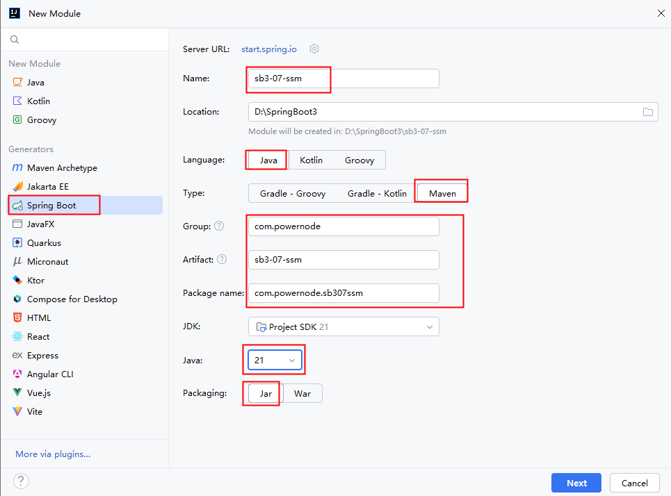

添加依赖：web启动器、mybatis启动器、mysql驱动依赖、lombok依赖

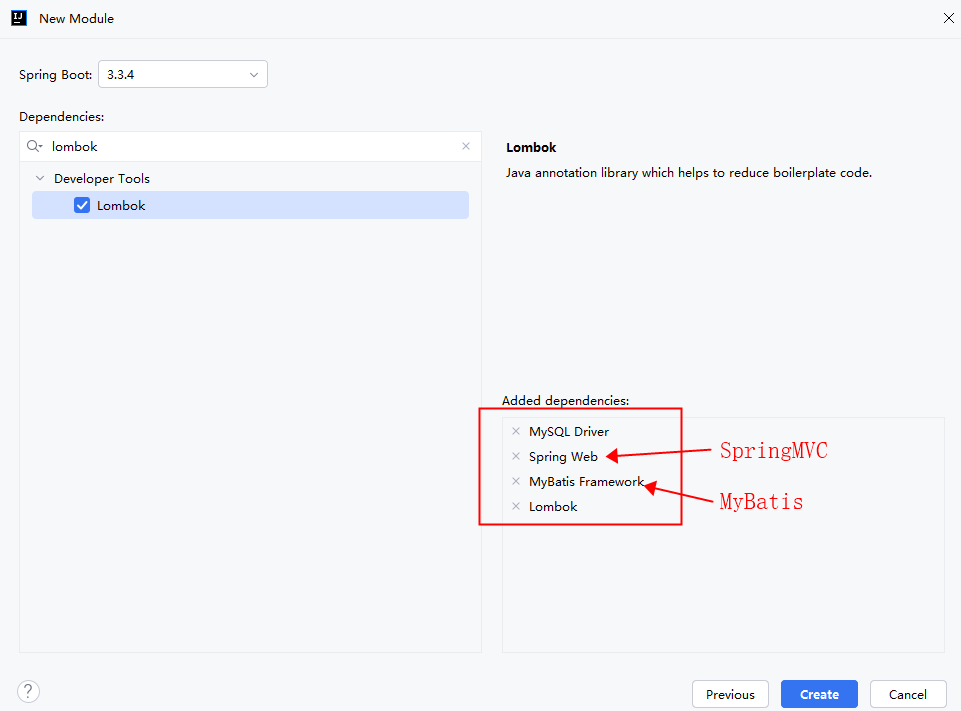

项目结构：

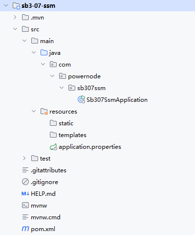

## 使用`free mybatis tool`插件逆向生成MyBatis代码
将`springboot`数据库中的`t_vip`表逆向生成mybatis代码。这里不再赘述。

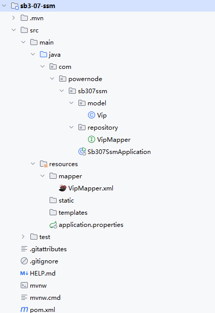

## 整合MyBatis
1. 编写数据源的配置

```properties
spring.datasource.driver-class-name=com.mysql.cj.jdbc.Driver
spring.datasource.url=jdbc:mysql://localhost:3306/springboot
spring.datasource.username=root
spring.datasource.password=123456
spring.datasource.type=com.zaxxer.hikari.HikariDataSource
```

2. 编写mapper xml配置文件的位置

```properties
mybatis.mapper-locations=classpath:mapper/*.xml
mybatis.configuration.map-underscore-to-camel-case=true
```

3. 在主入口类上添加`@MapperScan`注解

```java
package com.powernode.sb307ssm;

import org.mybatis.spring.annotation.MapperScan;
import org.springframework.boot.SpringApplication;
import org.springframework.boot.autoconfigure.SpringBootApplication;

@MapperScan(basePackages = {"com.powernode.sb307ssm.repository"})
@SpringBootApplication
public class Sb307SsmApplication {

    public static void main(String[] args) {
        SpringApplication.run(Sb307SsmApplication.class, args);
    }

}
```

## 编写service
编写`VipService`接口：

```java
package com.powernode.sb307ssm.service;

import com.powernode.sb307ssm.model.Vip;

public interface VipService {
    /**
     * 根据id获取会员信息
     * @param id 会员标识
     * @return 会员信息
     */
    Vip getById(Long id);
}

```

编写`VipServiceImpl`实现类：

```java
package com.powernode.sb307ssm.service.impl;

import com.powernode.sb307ssm.model.Vip;
import com.powernode.sb307ssm.repository.VipMapper;
import com.powernode.sb307ssm.service.VipService;
import org.springframework.beans.factory.annotation.Autowired;
import org.springframework.stereotype.Service;

@Service("vipService")
public class VipServiceImpl implements VipService {

    @Autowired
    private VipMapper vipMapper;

    @Override
    public Vip getById(Long id) {
        return vipMapper.selectByPrimaryKey(id);
    }
}

```

## 编写controller
编写`VipController`，代码如下：

```java
package com.powernode.sb307ssm.controller;

import com.powernode.sb307ssm.model.Vip;
import com.powernode.sb307ssm.service.VipService;
import org.springframework.beans.factory.annotation.Autowired;
import org.springframework.web.bind.annotation.GetMapping;
import org.springframework.web.bind.annotation.PathVariable;
import org.springframework.web.bind.annotation.RestController;

@RestController
public class VipController {
    
    @Autowired
    private VipService vipService;
    
    @GetMapping("/vip/{id}")
    public Vip detailById(@PathVariable("id") Long id){
        Vip vip = vipService.getById(id);
        return vip;
    }
}

```

\<font style="color:#DF2A3F;"\>提示：这里使用了RESTFul编程风格，这个内容在SpringMVC课程中已经讲过。忘了的同学可以回头观看一下。\</font\>

## 启动服务器测试
执行SpringBoot项目主入口的main方法，启动Tomcat服务器：

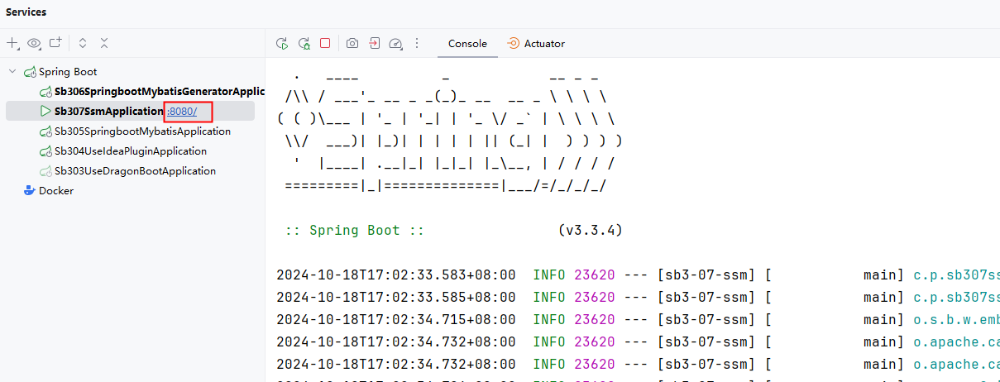

打开浏览器访问：


到此为止，SSM框架就集成完毕了，通过这个集成也可以感觉到SpringBoot简化了SSM三大框架的集成。

---

## 第4章 Spring Boot自动配置

# 自动配置概述
## SpringBoot的两大核心
Spring Boot 框架的两大核心特性可以概括为“启动器”（Starter）和“自动配置”（Auto-configuration）。

1. **启动器（Starter）**：  
Spring Boot 提供了一系列的 Starter POMs，它们是一组预定义的依赖关系。

当你在项目中引入一个 Starter POM 时，它会自动包含所有必要的 Spring 组件以及合理的默认设置。开发者不需要手动管理复杂的依赖关系，也不需要担心版本冲突的问题，减少了配置上的出错可能。

2. **自动配置（Auto-Configuration）**：  
当添加了特定的 Starter POM 后，Spring Boot 会**\<font style="color:#DF2A3F;"\>根据类路径上存在的 jar 包来自动配置 Bean（自动配置相关组件）（比如：SpringBoot发现类路径上存在mybatis相关的类，例如SqlSessionFactory.class，那么SpringBoot将自动配置mybatis相关的所有Bean。）\</font\>**。

如果开发者没有显式地提供任何与特定功能相关的配置，Spring Boot 将使用其默认配置来自动设置这些功能。当然，如果需要的话，用户也可以覆盖这些默认设置。

这两个特性结合在一起，使得使用 Spring Boot 开发应用程序变得更加简单快速，减少了大量的样板代码和重复配置的工作。**\<font style="color:#DF2A3F;"\>让程序员专注业务逻辑的开发，在环境方面耗费最少的时间\</font\>**。

## 体会自动配置带来的便捷
拿SpringBoot集成MyBatis为例。

以前，在没有SpringBoot框架的时候，我们用Spring集成MyBatis框架，需要进行如下的配置：

```xml
<?xml version="1.0" encoding="UTF-8"?>
<beans xmlns="http://www.springframework.org/schema/beans"
       xmlns:xsi="http://www.w3.org/2001/XMLSchema-instance"
       xmlns:context="http://www.springframework.org/schema/context"
       xmlns:tx="http://www.springframework.org/schema/tx"
       xsi:schemaLocation="
        http://www.springframework.org/schema/beans
        http://www.springframework.org/schema/beans/spring-beans.xsd
        http://www.springframework.org/schema/context
        http://www.springframework.org/schema/context/spring-context.xsd
        http://www.springframework.org/schema/tx
        http://www.springframework.org/schema/tx/spring-tx.xsd">

    <!-- 数据源配置 -->
    <bean id="dataSource" class="org.apache.commons.dbcp2.BasicDataSource">
        <property name="driverClassName" value="com.mysql.cj.jdbc.Driver"/>
        <property name="url" value="jdbc:mysql://localhost:3306/mydb"/>
        <property name="username" value="root"/>
        <property name="password" value="password"/>
    </bean>

    <!-- SqlSessionFactory -->
    <bean id="sqlSessionFactory" class="org.mybatis.spring.SqlSessionFactoryBean">
        <property name="dataSource" ref="dataSource"/>
        <property name="mapperLocations" value="classpath:mapper/*.xml"/>
        <property name="typeAliasesPackage" value="com.example.model"/>
    </bean>

    <!-- Mapper 扫描器 -->
    <bean class="org.mybatis.spring.mapper.MapperScannerConfigurer">
        <property name="basePackage" value="com.example.mapper"/>
        <property name="sqlSessionFactoryBeanName" value="sqlSessionFactory"/>
    </bean>

    <!-- 事务管理器 -->
    <bean id="transactionManager" class="org.springframework.jdbc.datasource.DataSourceTransactionManager">
        <property name="dataSource" ref="dataSource"/>
    </bean>

    <!-- 开启事务注解 -->
    <tx:annotation-driven transaction-manager="transactionManager"/>

    <!-- 扫描 service 层的包 -->
    <context:component-scan base-package="com.example.service"/>

</beans>
```

通过以上的配置可以看到Spring集成MyBatis的时候，需要手动提供`BasicDataSource`、`SqlSessionFactoryBean`、`MapperScannerConfigurer`、`DataSourceTransactionManager`等Bean的配置。

使用了Spring Boot框架之后，这些配置都不需要提供了，SpringBoot框架的自动配置机制可以全部按照默认的方式自动化完成。减少了大量的配置，在环境方面耗费很少的时间，让程序员更加专注业务逻辑的处理。我们只需要在`application.yml`中提供以下的配置即可：

```yaml
spring:
  datasource:
    driver-class-name: com.mysql.cj.jdbc.Driver
    url: jdbc:mysql://localhost:3306/springboot
    username: root
    password: 123456
    type: com.zaxxer.hikari.HikariDataSource
```

## 引入web启动器都有哪些组件会准备好
通过以下代码获取spring ioc容器中的所有注册的bean，一个Bean就是一个组件：

```java
package com.powernode.test;

import org.springframework.boot.SpringApplication;
import org.springframework.boot.autoconfigure.SpringBootApplication;
import org.springframework.context.ConfigurableApplicationContext;

@SpringBootApplication
public class TestApplication {

    public static void main(String[] args) {
        ConfigurableApplicationContext applicationContext = SpringApplication.run(TestApplication.class, args);
        String[] beanDefinitionNames = applicationContext.getBeanDefinitionNames();
        for (String beanDefinitionName : beanDefinitionNames) {
            System.out.println(beanDefinitionName);
        }
        applicationContext.close();
    }

}

```

在springboot没有引入任何启动器的情况下，默认提供了`59`bean：

```plain
org.springframework.context.annotation.internalConfigurationAnnotationProcessor
org.springframework.context.annotation.internalAutowiredAnnotationProcessor
org.springframework.context.annotation.internalCommonAnnotationProcessor
org.springframework.context.event.internalEventListenerProcessor
org.springframework.context.event.internalEventListenerFactory
testApplication
org.springframework.boot.autoconfigure.internalCachingMetadataReaderFactory
org.springframework.boot.autoconfigure.AutoConfigurationPackages
org.springframework.boot.autoconfigure.context.PropertyPlaceholderAutoConfiguration
propertySourcesPlaceholderConfigurer
org.springframework.boot.autoconfigure.jmx.JmxAutoConfiguration
mbeanExporter
objectNamingStrategy
mbeanServer
org.springframework.boot.context.properties.ConfigurationPropertiesBindingPostProcessor
org.springframework.boot.context.internalConfigurationPropertiesBinder
org.springframework.boot.context.properties.BoundConfigurationProperties
org.springframework.boot.context.properties.EnableConfigurationPropertiesRegistrar.methodValidationExcludeFilter
spring.jmx-org.springframework.boot.autoconfigure.jmx.JmxProperties
org.springframework.boot.autoconfigure.admin.SpringApplicationAdminJmxAutoConfiguration
springApplicationAdminRegistrar
org.springframework.boot.autoconfigure.aop.AopAutoConfiguration$ClassProxyingConfiguration
forceAutoProxyCreatorToUseClassProxying
org.springframework.boot.autoconfigure.aop.AopAutoConfiguration
org.springframework.boot.autoconfigure.availability.ApplicationAvailabilityAutoConfiguration
applicationAvailability
org.springframework.boot.autoconfigure.context.ConfigurationPropertiesAutoConfiguration
org.springframework.boot.autoconfigure.context.LifecycleAutoConfiguration
lifecycleProcessor
spring.lifecycle-org.springframework.boot.autoconfigure.context.LifecycleProperties
org.springframework.boot.autoconfigure.info.ProjectInfoAutoConfiguration
spring.info-org.springframework.boot.autoconfigure.info.ProjectInfoProperties
org.springframework.boot.autoconfigure.sql.init.SqlInitializationAutoConfiguration
spring.sql.init-org.springframework.boot.autoconfigure.sql.init.SqlInitializationProperties
org.springframework.boot.sql.init.dependency.DatabaseInitializationDependencyConfigurer$DependsOnDatabaseInitializationPostProcessor
org.springframework.boot.autoconfigure.ssl.SslAutoConfiguration
fileWatcher
sslPropertiesSslBundleRegistrar
sslBundleRegistry
spring.ssl-org.springframework.boot.autoconfigure.ssl.SslProperties
org.springframework.boot.autoconfigure.task.TaskExecutorConfigurations$ThreadPoolTaskExecutorBuilderConfiguration
threadPoolTaskExecutorBuilder
org.springframework.boot.autoconfigure.task.TaskExecutorConfigurations$TaskExecutorBuilderConfiguration
taskExecutorBuilder
org.springframework.boot.autoconfigure.task.TaskExecutorConfigurations$SimpleAsyncTaskExecutorBuilderConfiguration
simpleAsyncTaskExecutorBuilder
org.springframework.boot.autoconfigure.task.TaskExecutorConfigurations$TaskExecutorConfiguration
applicationTaskExecutor
org.springframework.boot.autoconfigure.task.TaskExecutionAutoConfiguration
spring.task.execution-org.springframework.boot.autoconfigure.task.TaskExecutionProperties
org.springframework.boot.autoconfigure.task.TaskSchedulingConfigurations$ThreadPoolTaskSchedulerBuilderConfiguration
threadPoolTaskSchedulerBuilder
org.springframework.boot.autoconfigure.task.TaskSchedulingConfigurations$TaskSchedulerBuilderConfiguration
taskSchedulerBuilder
org.springframework.boot.autoconfigure.task.TaskSchedulingConfigurations$SimpleAsyncTaskSchedulerBuilderConfiguration
simpleAsyncTaskSchedulerBuilder
org.springframework.boot.autoconfigure.task.TaskSchedulingAutoConfiguration
spring.task.scheduling-org.springframework.boot.autoconfigure.task.TaskSchedulingProperties
org.springframework.aop.config.internalAutoProxyCreator
```

引入web启动器：

```xml
<dependency>
  <groupId>org.springframework.boot</groupId>
  <artifactId>spring-boot-starter-web</artifactId>
</dependency>
```

可以发现，ioc容器中注册的bean总数量为`160`个：

```plain
org.springframework.context.annotation.internalConfigurationAnnotationProcessor
org.springframework.context.annotation.internalAutowiredAnnotationProcessor
org.springframework.context.annotation.internalCommonAnnotationProcessor
org.springframework.context.event.internalEventListenerProcessor
org.springframework.context.event.internalEventListenerFactory
testApplication
org.springframework.boot.autoconfigure.internalCachingMetadataReaderFactory
org.springframework.boot.autoconfigure.AutoConfigurationPackages
org.springframework.boot.autoconfigure.context.PropertyPlaceholderAutoConfiguration
propertySourcesPlaceholderConfigurer
org.springframework.boot.autoconfigure.ssl.SslAutoConfiguration
fileWatcher
sslPropertiesSslBundleRegistrar
sslBundleRegistry
org.springframework.boot.context.properties.ConfigurationPropertiesBindingPostProcessor
org.springframework.boot.context.internalConfigurationPropertiesBinder
org.springframework.boot.context.properties.BoundConfigurationProperties
org.springframework.boot.context.properties.EnableConfigurationPropertiesRegistrar.methodValidationExcludeFilter
spring.ssl-org.springframework.boot.autoconfigure.ssl.SslProperties
org.springframework.boot.autoconfigure.websocket.servlet.WebSocketServletAutoConfiguration$TomcatWebSocketConfiguration
websocketServletWebServerCustomizer
org.springframework.boot.autoconfigure.websocket.servlet.WebSocketServletAutoConfiguration
org.springframework.boot.autoconfigure.web.servlet.ServletWebServerFactoryConfiguration$EmbeddedTomcat
tomcatServletWebServerFactory
org.springframework.boot.autoconfigure.web.servlet.ServletWebServerFactoryAutoConfiguration
servletWebServerFactoryCustomizer
tomcatServletWebServerFactoryCustomizer
server-org.springframework.boot.autoconfigure.web.ServerProperties
webServerFactoryCustomizerBeanPostProcessor
errorPageRegistrarBeanPostProcessor
org.springframework.boot.autoconfigure.web.servlet.DispatcherServletAutoConfiguration$DispatcherServletConfiguration
dispatcherServlet
spring.mvc-org.springframework.boot.autoconfigure.web.servlet.WebMvcProperties
org.springframework.boot.autoconfigure.web.servlet.DispatcherServletAutoConfiguration$DispatcherServletRegistrationConfiguration
dispatcherServletRegistration
org.springframework.boot.autoconfigure.web.servlet.DispatcherServletAutoConfiguration
org.springframework.boot.autoconfigure.task.TaskExecutorConfigurations$ThreadPoolTaskExecutorBuilderConfiguration
threadPoolTaskExecutorBuilder
org.springframework.boot.autoconfigure.task.TaskExecutorConfigurations$TaskExecutorBuilderConfiguration
taskExecutorBuilder
org.springframework.boot.autoconfigure.task.TaskExecutorConfigurations$SimpleAsyncTaskExecutorBuilderConfiguration
simpleAsyncTaskExecutorBuilder
org.springframework.boot.autoconfigure.task.TaskExecutorConfigurations$TaskExecutorConfiguration
applicationTaskExecutor
org.springframework.boot.autoconfigure.task.TaskExecutionAutoConfiguration
spring.task.execution-org.springframework.boot.autoconfigure.task.TaskExecutionProperties
org.springframework.boot.autoconfigure.web.servlet.error.ErrorMvcAutoConfiguration$WhitelabelErrorViewConfiguration
error
beanNameViewResolver
org.springframework.boot.autoconfigure.web.servlet.error.ErrorMvcAutoConfiguration$DefaultErrorViewResolverConfiguration
conventionErrorViewResolver
spring.web-org.springframework.boot.autoconfigure.web.WebProperties
org.springframework.boot.autoconfigure.web.servlet.error.ErrorMvcAutoConfiguration
errorAttributes
basicErrorController
errorPageCustomizer
preserveErrorControllerTargetClassPostProcessor
org.springframework.boot.autoconfigure.web.servlet.WebMvcAutoConfiguration$EnableWebMvcConfiguration
welcomePageHandlerMapping
welcomePageNotAcceptableHandlerMapping
localeResolver
themeResolver
flashMapManager
mvcConversionService
mvcValidator
mvcContentNegotiationManager
requestMappingHandlerMapping
mvcPatternParser
mvcUrlPathHelper
mvcPathMatcher
viewControllerHandlerMapping
beanNameHandlerMapping
routerFunctionMapping
resourceHandlerMapping
mvcResourceUrlProvider
defaultServletHandlerMapping
requestMappingHandlerAdapter
handlerFunctionAdapter
mvcUriComponentsContributor
httpRequestHandlerAdapter
simpleControllerHandlerAdapter
handlerExceptionResolver
mvcViewResolver
mvcHandlerMappingIntrospector
viewNameTranslator
org.springframework.boot.autoconfigure.web.servlet.WebMvcAutoConfiguration$WebMvcAutoConfigurationAdapter
defaultViewResolver
viewResolver
requestContextFilter
org.springframework.boot.autoconfigure.web.servlet.WebMvcAutoConfiguration
formContentFilter
org.springframework.boot.autoconfigure.jmx.JmxAutoConfiguration
mbeanExporter
objectNamingStrategy
mbeanServer
spring.jmx-org.springframework.boot.autoconfigure.jmx.JmxProperties
org.springframework.boot.autoconfigure.admin.SpringApplicationAdminJmxAutoConfiguration
springApplicationAdminRegistrar
org.springframework.boot.autoconfigure.aop.AopAutoConfiguration$ClassProxyingConfiguration
forceAutoProxyCreatorToUseClassProxying
org.springframework.boot.autoconfigure.aop.AopAutoConfiguration
org.springframework.boot.autoconfigure.availability.ApplicationAvailabilityAutoConfiguration
applicationAvailability
org.springframework.boot.autoconfigure.jackson.JacksonAutoConfiguration$Jackson2ObjectMapperBuilderCustomizerConfiguration
standardJacksonObjectMapperBuilderCustomizer
spring.jackson-org.springframework.boot.autoconfigure.jackson.JacksonProperties
org.springframework.boot.autoconfigure.jackson.JacksonAutoConfiguration$JacksonObjectMapperBuilderConfiguration
jacksonObjectMapperBuilder
org.springframework.boot.autoconfigure.jackson.JacksonAutoConfiguration$ParameterNamesModuleConfiguration
parameterNamesModule
org.springframework.boot.autoconfigure.jackson.JacksonAutoConfiguration$JacksonObjectMapperConfiguration
jacksonObjectMapper
org.springframework.boot.autoconfigure.jackson.JacksonAutoConfiguration$JacksonMixinConfiguration
jsonMixinModuleEntries
jsonMixinModule
org.springframework.boot.autoconfigure.jackson.JacksonAutoConfiguration
jsonComponentModule
org.springframework.boot.autoconfigure.context.ConfigurationPropertiesAutoConfiguration
org.springframework.boot.autoconfigure.context.LifecycleAutoConfiguration
lifecycleProcessor
spring.lifecycle-org.springframework.boot.autoconfigure.context.LifecycleProperties
org.springframework.boot.autoconfigure.http.HttpMessageConvertersAutoConfiguration$StringHttpMessageConverterConfiguration
stringHttpMessageConverter
org.springframework.boot.autoconfigure.http.JacksonHttpMessageConvertersConfiguration$MappingJackson2HttpMessageConverterConfiguration
mappingJackson2HttpMessageConverter
org.springframework.boot.autoconfigure.http.JacksonHttpMessageConvertersConfiguration
org.springframework.boot.autoconfigure.http.HttpMessageConvertersAutoConfiguration
messageConverters
org.springframework.boot.autoconfigure.info.ProjectInfoAutoConfiguration
spring.info-org.springframework.boot.autoconfigure.info.ProjectInfoProperties
org.springframework.boot.autoconfigure.sql.init.SqlInitializationAutoConfiguration
spring.sql.init-org.springframework.boot.autoconfigure.sql.init.SqlInitializationProperties
org.springframework.boot.sql.init.dependency.DatabaseInitializationDependencyConfigurer$DependsOnDatabaseInitializationPostProcessor
org.springframework.boot.autoconfigure.task.TaskSchedulingConfigurations$ThreadPoolTaskSchedulerBuilderConfiguration
threadPoolTaskSchedulerBuilder
org.springframework.boot.autoconfigure.task.TaskSchedulingConfigurations$TaskSchedulerBuilderConfiguration
taskSchedulerBuilder
org.springframework.boot.autoconfigure.task.TaskSchedulingConfigurations$SimpleAsyncTaskSchedulerBuilderConfiguration
simpleAsyncTaskSchedulerBuilder
org.springframework.boot.autoconfigure.task.TaskSchedulingAutoConfiguration
spring.task.scheduling-org.springframework.boot.autoconfigure.task.TaskSchedulingProperties
org.springframework.boot.autoconfigure.web.client.RestClientAutoConfiguration
httpMessageConvertersRestClientCustomizer
restClientSsl
restClientBuilderConfigurer
restClientBuilder
org.springframework.boot.autoconfigure.web.client.RestTemplateAutoConfiguration
restTemplateBuilderConfigurer
restTemplateBuilder
org.springframework.boot.autoconfigure.web.embedded.EmbeddedWebServerFactoryCustomizerAutoConfiguration$TomcatWebServerFactoryCustomizerConfiguration
tomcatWebServerFactoryCustomizer
org.springframework.boot.autoconfigure.web.embedded.EmbeddedWebServerFactoryCustomizerAutoConfiguration
org.springframework.boot.autoconfigure.web.servlet.HttpEncodingAutoConfiguration
characterEncodingFilter
localeCharsetMappingsCustomizer
org.springframework.boot.autoconfigure.web.servlet.MultipartAutoConfiguration
multipartConfigElement
multipartResolver
spring.servlet.multipart-org.springframework.boot.autoconfigure.web.servlet.MultipartProperties
org.springframework.aop.config.internalAutoProxyCreator
```

也就是说，引入了`web启动器`后，ioc容器中增加了`101`个bean对象（**\<font style="color:#DF2A3F;"\>加入了101个组件\</font\>**）。这`101`个bean对象都是为web开发而准备的，例如我们常见的：

+ dispatcherServlet：DispatcherServlet 是 Spring MVC 的前端控制器，负责接收所有的 HTTP 请求，并将请求分发给适当的处理器（Controller）
+ viewResolver：ViewResolver 是 Spring MVC 中用于将逻辑视图名称解析为实际视图对象的组件。它的主要作用是根据控制器返回的视图名称，找到对应的视图实现（如 JSP、Thymeleaf、Freemarker 等），并返回给 DispatcherServlet 用于渲染视图。
+ characterEncodingFilter：字符集过滤器组件，解决请求和响应的乱码问题。
+ mappingJackson2HttpMessageConverter：负责处理消息转换的组件。它可以将json字符串转换成java对象，也可以将java对象转换为json字符串。
+ ......

每一个组件都有它特定的功能。

没有使用SpringBoot之前，以上的很多组件都是需要手动配置的。

## 默认的包扫描规则
之前我们已经说过并且测试过：springboot默认情况下只扫描`主入口类`所在包及子包下的类。

这是因为`@SpringBootApplication`注解被`@ComponentScan`标注，代替spring以前的这个配置：`<context:component-scan base-packages="主入口类所在包"/>`

当然，我们也可以打破这个规则，通过以下两种方式：

+ 第一种：@SpringBootApplication(scanBasePackages = "com")
+ 第二种：@ComponentScan("com")

```java
@SpringBootConfiguration
@EnableAutoConfiguration
@ComponentScan("com")
public class TestApplication {}
```

## 默认配置
springboot为功能的实现提供了非常多的默认配置.

例如：tomcat服务器端口号在没有配置的情况下，默认是`8080`

当然，也可以在`application.properties`文件中进行重新配置：

```properties
server.port=8081
```

再如，配置thymeleaf的模板引擎时，默认的模板引擎前缀是`classpath:/templates/`，默认的后缀是`.html`

当然，也可以重新配置：

```properties
spring.thymeleaf.prefix=classpath:/templates/
spring.thymeleaf.suffix=.html
```

这些配置最终都会通过`@ConfigurationProperties(prefix="")`注解绑定到对应的bean的属性上。这个Bean我们一般称为`属性类`。例如：

`ServerProperties`：服务器属性类，专门负责配置服务器相关信息。

```java
@ConfigurationProperties(prefix = "server", ignoreUnknownFields = true)
public class ServerProperties {}
```

`ThymeleafProperties`：Thymeleaf属性类，专门负责配置Thymeleaf模板引擎的。

```java
@ConfigurationProperties(prefix = "spring.thymeleaf")
public class ThymeleafProperties {}
```

SpringBoot官方文档当中也有指导，告诉你都有哪些`属性类`，告诉你在`application.properties`中都可以配置哪些东西。默认值都是什么：

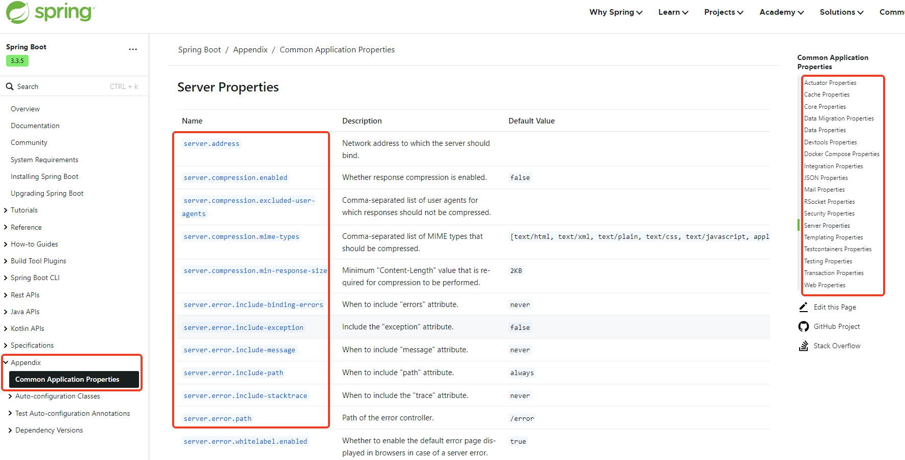

## 自动配置是按需加载的
SpringBoot提供了非常多的自动配置类，有的是`web`相关的自动配置，有的是`mail`相关的自动配置。但是这些自动配置并不是全部生效，它是按需加载的。**\<font style="color:#DF2A3F;"\>导入了哪个启动器，则该启动器对应的自动配置类才会被加载\</font\>**。

这些自动配置类在哪里？

任何启动器都会关联引入这样一个启动器：`spring-boot-starter`，它是springboot框架最核心的启动器。

`spring-boot-starter`又关联引入了`spring-boot-autoconfigure`。所有的自动配置类都在这里。


## SpringBoot框架提供的条件注解
如何做到按需加载的，依靠SpringBoot框架中的条件注解来实现的。

Spring Boot框架中的@ConditionalOnXxx系列注解属于条件注解（Conditional Annotations），它们用于基于某些条件来决定是否应该创建一个或一组Bean。这些注解通常用在自动配置类上，以确保只有在特定条件满足时才会应用相应的配置。

这里是一些常见的@ConditionalOnXxx注解及其作用：

+ @ConditionalOnClass：当指定的类存在时，才创建Bean。
+ @ConditionalOnMissingClass：当指定的类不存在时，才创建Bean。
+ @ConditionalOnBean：当容器中存在指定的Bean时，才创建Bean。
+ @ConditionalOnMissingBean：当容器中不存在指定的Bean时，才创建Bean。
+ @ConditionalOnProperty：当配置文件中存在指定的属性时，才创建Bean。也可以设置属性值需要匹配的值。
+ @ConditionalOnResource：当指定的资源存在时，才创建Bean。
+ @ConditionalOnWebApplication：当应用程序是Web应用时，才创建Bean。
+ @ConditionalOnNotWebApplication：当应用程序不是Web应用时，才创建Bean。

使用这些注解可以帮助开发者根据不同的运行环境或配置来灵活地控制Bean的创建，从而实现更智能、更自动化的配置过程。这对于构建可插拔的模块化系统特别有用，因为可以根据实际需求选择性地启用或禁用某些功能。

假设我们来实现这样一个功能：如果IoC容器当中**\<font style="color:#DF2A3F;"\>存在\</font\>**`**<font style="color:#DF2A3F;">A</font>**`**\<font style="color:#DF2A3F;"\>Bean\</font\>**，就创建`B`Bean，代码如下：

```java
@Configuration
public class AppConfig {

    @Bean
    public A a(){
        return new A();
    }

    @ConditionalOnBean(A.class)
    @Bean
    public B b(){
        return new B();
    }
}
```

如果IoC容器当中**\<font style="color:#DF2A3F;"\>不存在\</font\>**`**<font style="color:#DF2A3F;">A</font>**`**\<font style="color:#DF2A3F;"\>Bean\</font\>**，就创建`B`Bean，代码如下：

```java
@Configuration
public class AppConfig {

    @Bean
    public A a(){
        return new A();
    }

    @ConditionalOnMissingBean(A.class)
    @Bean
    public B b(){
        return new B();
    }
}
```

当类路径当中存在`DispatcherServlet`类，则启用配置，反之则不启用配置，代码如下：

```java
@ConditionalOnClass(name = {"org.springframework.web.servlet.DispatcherServlet"})
@Configuration
public class MyConfig {
    @Bean
    public A getA(){
        return new A();
    }
}
```

以上程序自行测试！

# 自动配置实现原理
我们来深入的分析一个问题：为什么导入`web启动器`，web开发相关的自动配置就会生效？

## 在程序没有开始执行之前都导入了哪些依赖
在程序没有开始运行之前，我们先来分析一下，当导入`web启动器`之后，底层都一连串的导入了哪些依赖！

1. 从这里开始：导入了`spring-boot-starter-web`【web启动器】
2. 然后关联导入了`spring-boot-starter`、`spring-boot-starter-json`、`spring-boot-starter-tomcat`、`spring-web`、`spring-webmvc`
    1. 注意：`spring-boot-starter`是springboot核心启动器，任何启动器在导入时，都会关联导入springboot核心启动器。
3. 核心启动器导入之后，关联导入了一个jar包：`spring-boot-autoconfigure`。
    1. 注意：这个jar包中存放的是springboot框架**\<font style="color:#DF2A3F;"\>官方支持的自动配置类\</font\>**。如下图：

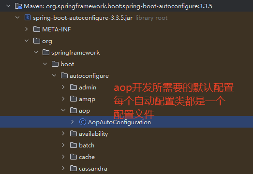

    2. 官方支持的自动配置类有多少个呢，可以通过下图位置查看：

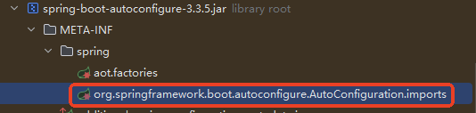


得知`springboot3.3.5`这个版本共`152`个自动配置类。自动配置类的命名规则是`XxxxAutoConfiguration`。

**\<font style="color:#DF2A3F;"\>提示：哪个自动配置类生效，就代表哪个配置文件生效，那么对应的技术就完成了整合，就可以进行对应技术的开发。\</font\>**

## 从main方法开始执行之后都发生了什么
以上分析的是在项目结构上已经完成了相关依赖的导入，这些自动配置了导入到了项目当中，那么在运行时哪些自动配置类会被加载？哪些自动配置类会生效呢？我们接下来进行程序运行阶段的分析：

1. 程序从main方法进入执行，主入口类上使用`@SpringBootApplication`进行了标注。
2. `@SpringBootApplication`注解是复合注解，代表以下三个注解的功能：
    1. `@SpringBootConfiguration`：它被`@Configuration`标注，说明主入口类就是一个配置类，此时该配置开始加载。
    2. `@ComponentScan`：默认扫描的是主入口所在包以及子包。因此`spring-boot-autoconfigure`包是扫描不到的，按说`XxxAutoConfiguration`自动配置类是无法加载的！！！那么这些自动配置类又是如何加载和生效的呢？
    3. `@EnableAutoConfiguration`：自动配置类的加载和生效全靠它了。该注解被翻译为：启用自动配置。
3. `@EnableAutoConfiguration`被`@Import(AutoConfigurationImportSelector.class)`标注
    1. `@Import(AutoConfigurationImportSelector.class)`的作用是：将`AutoConfigurationImportSelector`作为一个Bean加载到IoC容器中。
    2. 这个Bean的作用是：负责收集和选择所有符合条件的自动配置类。
4. 添加断点，跟踪`AutoConfigurationImportSelector`源码：

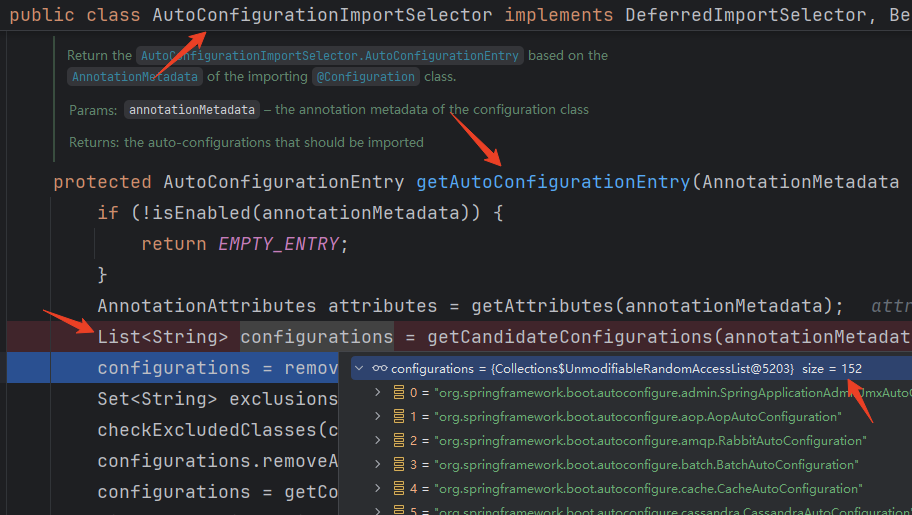

通过跟踪得知，这`152`个自动配置类的**类名**都会被加载到IoC容器中。**\<font style="color:#DF2A3F;"\>注意：加载了152，并不是152个全部生效\</font\>**。

5. 这`152`个自动配置类底层是怎么查找的？

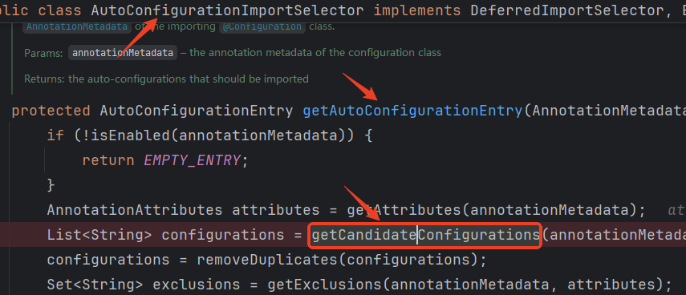

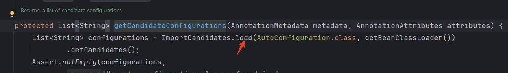

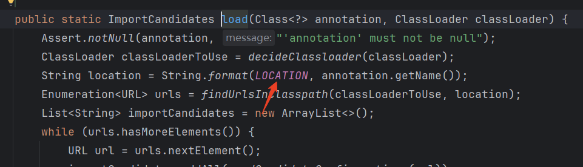

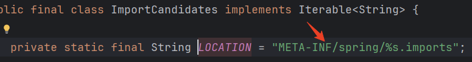

通过以上源码跟踪，得知，是从下图位置加载的：


6. 最终哪些自动配置类生效了？

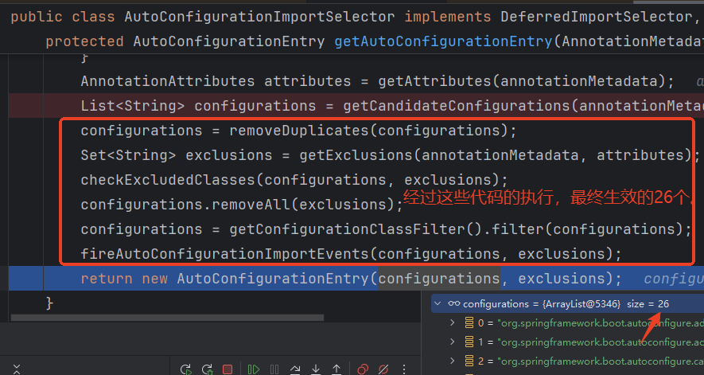

最先获取到`152`个，经过上图的一层一层的过滤（**条件注解**），**\<font style="color:#DF2A3F;"\>最终筛选了\</font\>**`**<font style="color:#DF2A3F;">26</font>**`**\<font style="color:#DF2A3F;"\>个自动配置类，为什么这么少，因为你只引入了\</font\>**`**<font style="color:#DF2A3F;">web starter</font>**`**\<font style="color:#DF2A3F;"\>。这26个配置就是做web开发需要的最少配置\</font\>**。

**具体怎么排除的，请看以下解释：**

+ configurations = removeDuplicates(configurations);

去重：移除 configurations 列表中的重复项，确保每个配置类只出现一次。

+ Set\<String\> exclusions = getExclusions(annotationMetadata, attributes);

获取排除列表：从注解元数据和属性中获取需要排除的配置类名称集合。因为`@EnableAutoConfiguration`注解还能这么用：`@EnableAutoConfiguration(exclude = {排除列表}, excludeName = {排除列表})`

+ checkExcludedClasses(configurations, exclusions);

检查排除：验证 configurations 中是否有被排除的类，如果有，可能会抛出异常或记录警告。

+ configurations.removeAll(exclusions);

移除排除项：从 configurations 列表中移除所有在 exclusions 集合中的配置类。

+ configurations = getConfigurationClassFilter().filter(configurations);

过滤配置类：使用 ConfigurationClassFilter 对 configurations 进行进一步过滤。**这一行通过条件注解进行判断**，例如 @ConditionalOnClass、@ConditionalOnMissingBean 等。

+ fireAutoConfigurationImportEvents(configurations, exclusions);

触发事件：触发自动配置导入事件，通知其他组件或监听器关于最终确定的配置类和排除的类。

## 自动配置类都干了啥
**\<font style="color:#DF2A3F;"\>自动配置类导入了一堆相关的组件（一个组件一个功能），而每个组件获取配置时都是从属性类中获取，而属性类恰好又和配置文件绑定。\</font\>**

以`DispatcherServletAutoConfiguration`自动配置类为例，这个自动配置类主要是配置了SpringMVC中的前端控制器。

请看源码：

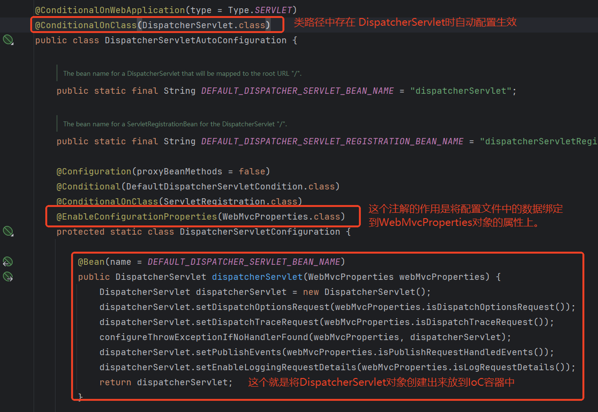

通过以上源码得知，`DispatcherServletConfiguration`组件的配置信息来源于`WebMvcProperties`属性类。`WebMvcProperties`类源码如下：

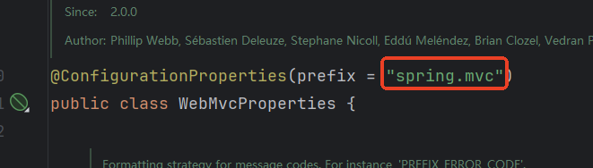

通过以上源码又得知，要对`DispatcherServletConfiguration`进行配置的话，应该在`application.properties`中使用这样的前缀配置：`spring.mvc....`

再来看`嵌入式Web服务器工厂自定义程序自动配置`：`EmbeddedWebServerFactoryCustomizerAutoConfiguration`，通俗讲：通过它可以配置web服务器。

请看源码：

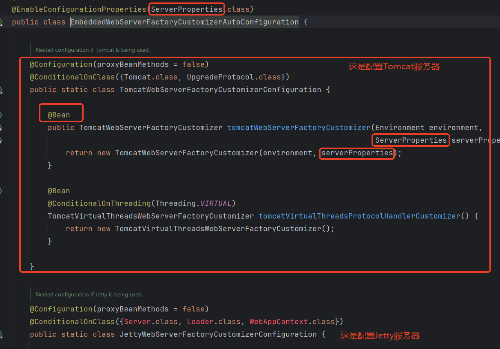

通过以上源码得知，这个自动配置类中也有很多组件，有tomcat组件，有jetty组件。单独看Tomcat，要配置Tomcat服务器，需要参照`ServerProperties`属性类，打开源码看看：

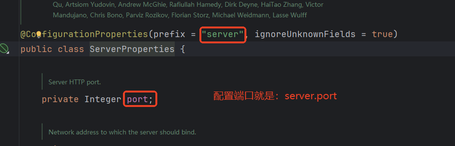

因此配置Tomcat服务器需要在`application.properties`文件中使用这样的前缀配置：`server.`

## 总结自动配置原理
1. 运行环境准备阶段
    1. 引入web启动器
    2. 最终传递引入了自动配置的jar包
    3. 自动配置的jar包中有152个自动配置类，到此运行环境准备完毕。
2. 运行阶段
    1. @EnableAutoConfiguration 启用自动配置，将152个自动配置类全部加载到IoC容器中，然后根据开发场景筛选出必须的自动配置类。
    2. 自动配置类加载了一堆组件。
    3. 每个组件需要的数据来自属性类。
    4. 属性类又和配置文件绑定在一起。
3. 因此，最终一句话：导入启动器，修改配置文件，就可以完成对应功能的开发。

---

## 第5章 Spring Boot的web开发

# SpringBoot的web自动配置
新建项目`sb3-09-web`：添加web启动器，添加Lombok依赖。

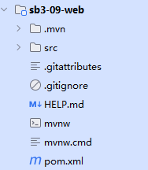

## web自动配置的依赖是如何传递的
1. 首先引入了`web启动器`，如下：

```xml
<dependency>
  <groupId>org.springframework.boot</groupId>
  <artifactId>spring-boot-starter-web</artifactId>
</dependency>
```

2. `web启动器`传递引入了`spring-boot-starter`，如下：

```xml
<dependency>
  <groupId>org.springframework.boot</groupId>
  <artifactId>spring-boot-starter</artifactId>
  <version>3.3.5</version>
  <scope>compile</scope>
</dependency>
```

3. `spring-boot-starter`会传递引入一个`spring-boot-autoconfigure`包，如下：

```xml
<dependency>
  <groupId>org.springframework.boot</groupId>
  <artifactId>spring-boot-autoconfigure</artifactId>
  <version>3.3.5</version>
  <scope>compile</scope>
</dependency>
```

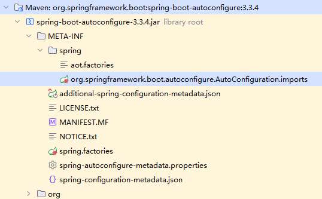

4. 在`spring-boot-autoconfigure`包中的`.imports`文件中罗列的需要导入的自动配置类，如下图：

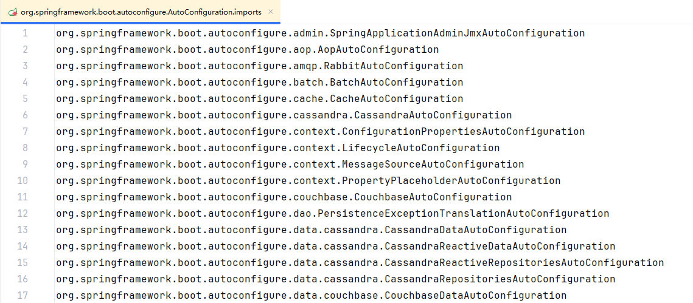

## web自动配置的实现原理
1. 从入口程序开始：

```java
package com.powernode.sb309web;

import org.springframework.boot.SpringApplication;
import org.springframework.boot.autoconfigure.SpringBootApplication;

@SpringBootApplication
public class Sb309WebApplication {

    public static void main(String[] args) {
        SpringApplication.run(Sb309WebApplication.class, args);
    }
}
```

入口程序被`@SpringBootApplication`注解标注。

2. `@SpringBootApplication`注解被`@EnableAutoConfiguration`\<font style="color:#080808;background-color:#ffffff;"\>注解标注。表示启用自动配置。\</font\>
3. `@EnableAutoConfiguration`\<font style="color:#080808;background-color:#ffffff;"\>注解被\</font\>`@Import({AutoConfigurationImportSelector.class})`\<font style="color:#080808;background-color:#ffffff;"\>注解标注。\</font\>
4. \<font style="color:#080808;background-color:#ffffff;"\>因此\</font\>`AutoConfigurationImportSelector`\<font style="color:#080808;background-color:#ffffff;"\>决定哪些自动配置类是需要导入的。\</font\>
5. `<font style="color:#080808;background-color:#ffffff;">AutoConfigurationImportSelector</font>`\<font style="color:#080808;background-color:#ffffff;"\>底层实现步骤具体如下：\</font\>

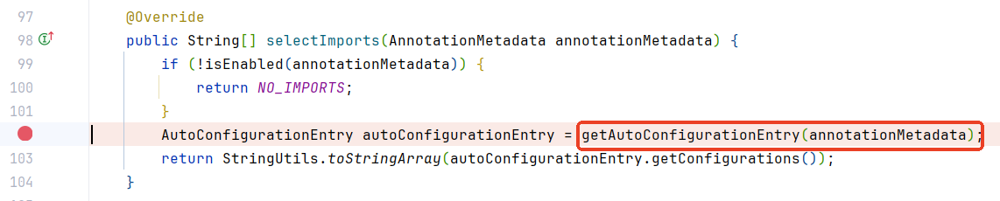

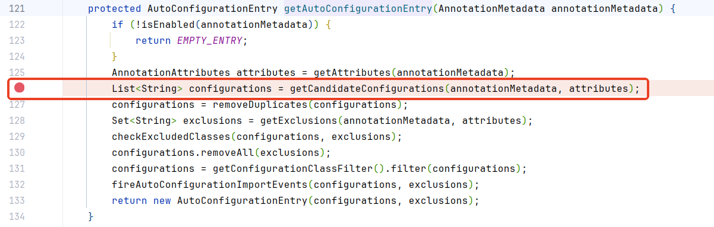

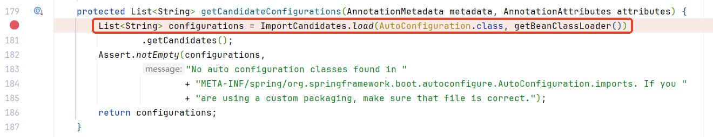

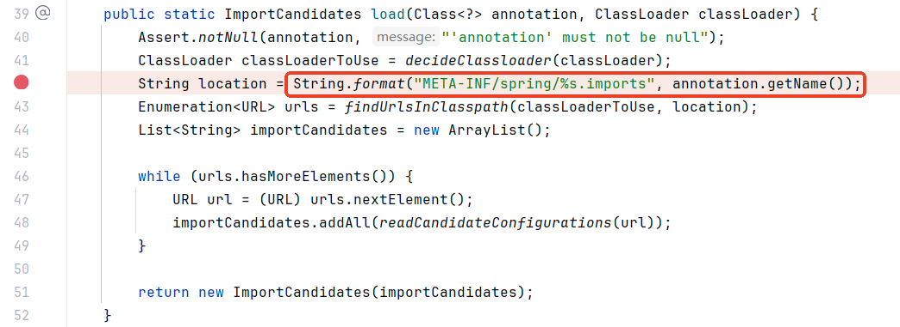

最终找的文件是：`META-INF/spring/org.springframework.boot.autoconfigure.AutoConfiguration.imports`

**注意：任何jar包，包括第三方的依赖，自动配置类所在的路径以及文件名都是完全相同的，都是**`**META-INF/spring/org.springframework.boot.autoconfigure.AutoConfiguration.imports**`

例如mybatis的自动配置类的列表文件也是这样，如下图：

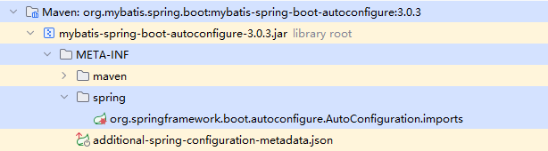

## 通过web自动配置类逆推web配置的prefix
在自动配置列表中找到web自动配置相关的类：

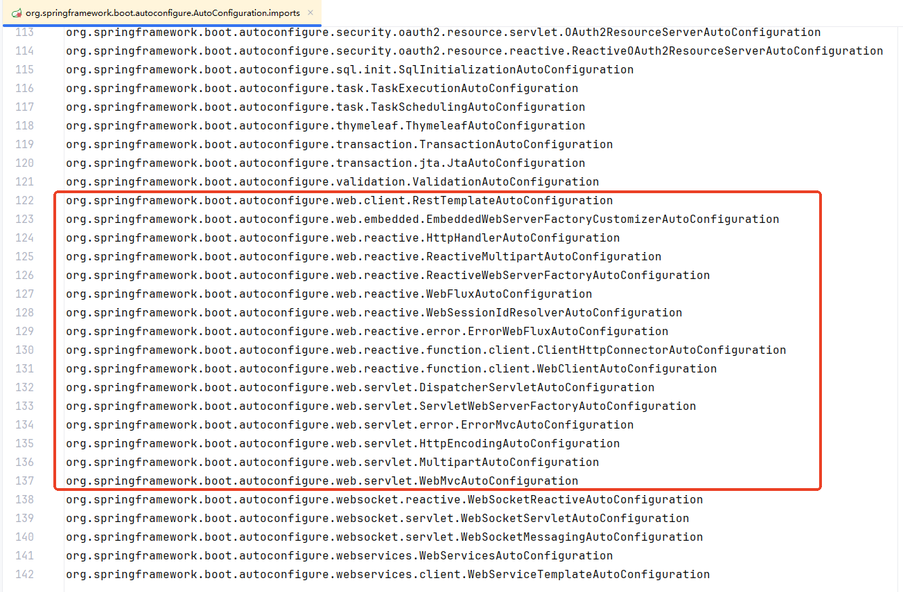

以下就是web自动配置类列表：

```java
org.springframework.boot.autoconfigure.web.client.RestTemplateAutoConfiguration
org.springframework.boot.autoconfigure.web.embedded.EmbeddedWebServerFactoryCustomizerAutoConfiguration
org.springframework.boot.autoconfigure.web.servlet.DispatcherServletAutoConfiguration
org.springframework.boot.autoconfigure.web.servlet.ServletWebServerFactoryAutoConfiguration
org.springframework.boot.autoconfigure.web.servlet.error.ErrorMvcAutoConfiguration
org.springframework.boot.autoconfigure.web.servlet.HttpEncodingAutoConfiguration
org.springframework.boot.autoconfigure.web.servlet.MultipartAutoConfiguration
org.springframework.boot.autoconfigure.web.servlet.WebMvcAutoConfiguration
```

通过web自动配置类的源码可以逆推web配置的prefix：

1. WebMvcAutoConfiguration

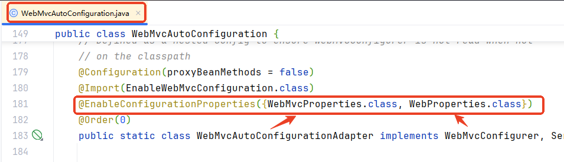

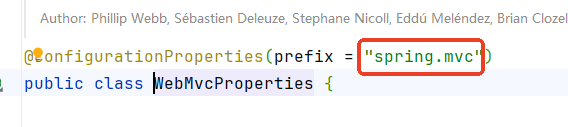

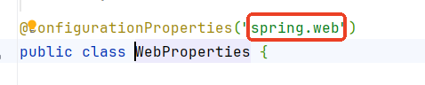

2. MultipartAutoConfiguration

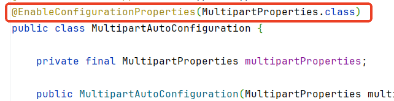

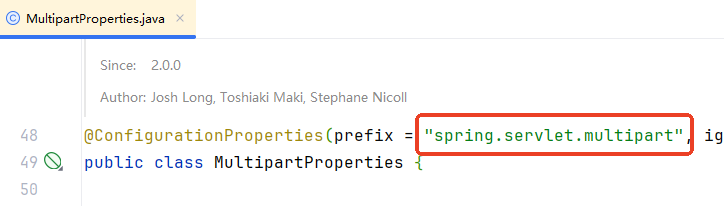

3. HttpEncodingAutoConfiguration

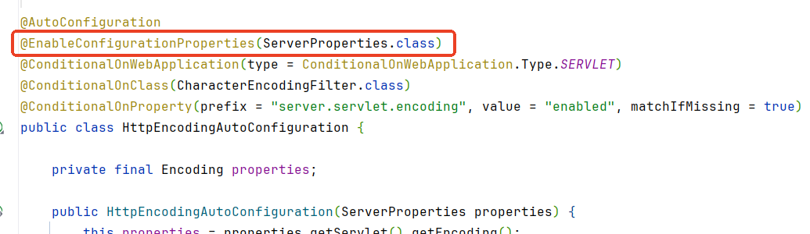

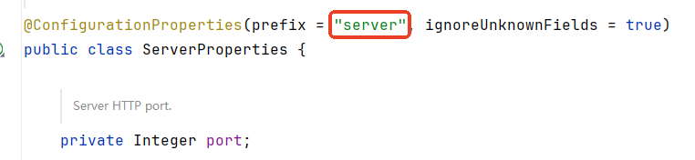

4. ErrorMvcAutoConfiguration
5. ServletWebServerFactoryAutoConfiguration
6. DispatcherServletAutoConfiguration
7. EmbeddedWebServerFactoryCustomizerAutoConfiguration
8. RestTemplateAutoConfiguration

通过查看源码，得知，web开发时，在`application.properties`配置文件中可以配置的前缀是：

```properties
# SpringMVC相关配置
spring.mvc.

# web开发通用配置
spring.web.

# 文件上传配置
spring.servlet.multipart.

# 服务器配置
server.
```

## Web自动配置都默认配置了什么
查看官方文档：

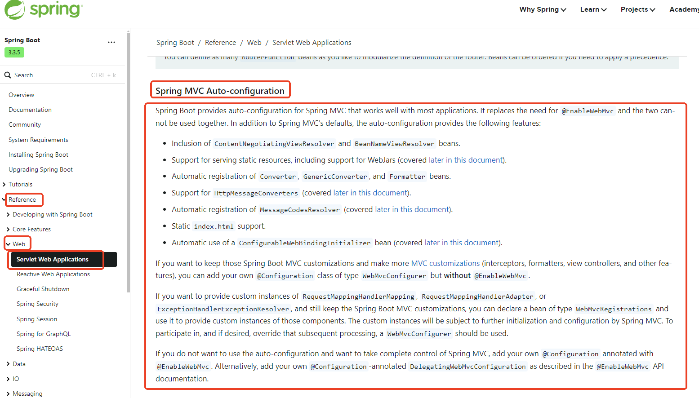

**翻译如下：**

Spring Boot 为 Spring MVC 提供了自动配置，这在大多数应用程序中都能很好地工作。除了已经实现了 Spring MVC 的默认功能外，自动配置还提供了以下特性：

+ 包括 `ContentNegotiatingViewResolver` 和 `BeanNameViewResolver` 的 Bean。
    - `ContentNegotiatingViewResolver` 自动根据HTTP请求头中Accept字段来选择合适的视图技术渲染响应。
    - `<font style="color:rgb(44, 44, 54);">BeanNameViewResolver</font>`\<font style="color:rgb(44, 44, 54);"\> 的作用是根据视图名称找到视图View对象。\</font\>
+ 支持提供静态资源，包括对 WebJars的支持。
    - 静态资源路径默认已经配置好了。默认会去static目录下找。
+ 自动注册 `Converter`、`GenericConverter` 和 `Formatter` 的 Bean。
    - `Converter`：转换器，做类型转换的，例如表单提交了用户数据，将表单数据转换成User对象。
    - `Formatter`：格式化器，做数据格式化的，例如将Java中的`日期类型对象`格式化为`特定格式的日期字符串`。或者将用户提交的日期字符串，转换为Java中的日期对象。
+ 支持 `HttpMessageConverters`。
    - 内置了很多的HTTP消息转换器。例如：`MappingJackson2HttpMessageConverter`可以将json转换成java对象，也可以将java对象转换为json字符串。
+ 自动注册 `MessageCodesResolver`。
    - SpringBoot会自动注册一个默认的`消息代码解析器`
    - 帮助你在表单验证出错时生成一些特殊的代码。这些代码让你能够更精确地定位问题，并提供更友好的错误提示。
+ 静态 `index.html` 文件支持。
    - Spring Boot 会自动处理位于项目静态资源目录下的 index.html 文件，使其成为应用程序的默认主页
+ 自动使用 `ConfigurableWebBindingInitializer` Bean。
    - 用它来指定默认使用哪个转换器，默认使用哪个格式化器。在这个类当中都已经配好了。

如果您不想使用自动配置并希望完全控制 Spring MVC，可以添加您自己的带有 `**<font style="color:#DF2A3F;">@EnableWebMvc</font>**` 注解的 `@Configuration`。

如果您希望保留这些 Spring Boot MVC 定制化设置并进行更多的 MVC 定制化（如拦截器、格式化程序、视图控制器等其他功能），可以添加您自己的类型为 `WebMvcConfigurer` 的 `@Configuration` 类。**\<font style="color:#DF2A3F;"\>但不能使用\</font\>**`**<font style="color:#DF2A3F;">@EnableWebMvc</font>**`**\<font style="color:#DF2A3F;"\>注解\</font\>**。

## \<font style="color:#080808;background-color:#ffffff;"\>WebMvcAutoConfiguration原理\</font\>
通过源码分析的方式，学习WebMvc的自动配置原理。

### WebMvc自动配置是否生效的条件
```java
@AutoConfiguration(after = { DispatcherServletAutoConfiguration.class, TaskExecutionAutoConfiguration.class,
		ValidationAutoConfiguration.class })
@ConditionalOnWebApplication(type = Type.SERVLET)
@ConditionalOnClass({ Servlet.class, DispatcherServlet.class, WebMvcConfigurer.class })
@ConditionalOnMissingBean(WebMvcConfigurationSupport.class)
@AutoConfigureOrder(Ordered.HIGHEST_PRECEDENCE + 10)
@ImportRuntimeHints(WebResourcesRuntimeHints.class)
public class WebMvcAutoConfiguration {}
```

+ @AutoConfiguration(after = { DispatcherServletAutoConfiguration.class, TaskExecutionAutoConfiguration.class,ValidationAutoConfiguration.class })
    - **WebMvcAutoConfiguration自动配置类**加载顺序在以上自动配置类加载后加载。
+ @ConditionalOnWebApplication(type = Type.SERVLET)
    - **WebMvcAutoConfiguration自动配置类**只在servlet环境中生效。
+ @ConditionalOnClass({ Servlet.class, DispatcherServlet.class, WebMvcConfigurer.class })
    - 类路径中必须存在`Servlet.class``DispatcherServlet.class``WebMvcConfigurer.class`，**WebMvcAutoConfiguration自动配置类才会生效。**
+ @ConditionalOnMissingBean(WebMvcConfigurationSupport.class)
    - 类路径中不存在`WebMvcConfigurationSupport.class`时**WebMvcAutoConfiguration自动配置类才会生效。**
    - 注意：当使用@EnableWebMvc注解后，类路径中就会注册一个WebMvcConfigurationSupport这样的bean。
+ @AutoConfigureOrder(Ordered.HIGHEST_PRECEDENCE + 10) **不重要**
    - 指定**WebMvcAutoConfiguration自动配置类**的加载顺序
+ @ImportRuntimeHints(WebResourcesRuntimeHints.class) **不重要**
    - 运行时引入**WebResourcesRuntimeHints**这个类，这个类的作用是给JVM或者其他组件提示信息的，提示一下系统应该如何处理类和资源。

总结来说，WebMvcAutoConfiguration类将在以下条件下生效：

1. 应用程序是一个Servlet类型的Web应用；
2. 环境中有Servlet、DispatcherServlet和WebMvcConfigurer类；
3. 容器中没有WebMvcConfigurationSupport的bean。

如果这些条件都满足的话，那么这个自动配置类就会被激活，并进行相应的自动配置工作。

### WebMvc自动配置生效后引入了两个Filter Bean
#### 引入了\<font style="color:#080808;background-color:#ffffff;"\>HiddenHttpMethodFilter Bean\</font\>
```java
@Bean
@ConditionalOnMissingBean(HiddenHttpMethodFilter.class)
@ConditionalOnProperty(prefix = "spring.mvc.hiddenmethod.filter", name = "enabled")
public OrderedHiddenHttpMethodFilter hiddenHttpMethodFilter() {
    return new OrderedHiddenHttpMethodFilter();
}
```

这个过滤器是专门处理Rest请求的。GET POST PUT DELETE请求。

#### 引入了\<font style="color:#080808;background-color:#ffffff;"\>FormContentFilter Bean\</font\>
```java
@Bean
@ConditionalOnMissingBean(FormContentFilter.class)
@ConditionalOnProperty(prefix = "spring.mvc.formcontent.filter", name = "enabled", matchIfMissing = true)
public OrderedFormContentFilter formContentFilter() {
    return new OrderedFormContentFilter();
}
```

OrderedFormContentFilter 是 Spring Boot 中用于处理 HTTP 请求的一个过滤器，特别是针对 PUT 和 DELETE 请求。这个过滤器的主要作用是在处理 PUT 和 DELETE 请求时，确保如果请求体中有表单格式的数据，这些数据会被正确解析并可用。

### WebMvc自动配置生效后引入了WebMvcConfigurer接口的实现类
在SpringBoot框架的`WebMvcAutoConfiguration`类中提供了一个内部类：`WebMvcAutoConfigurationAdapter`

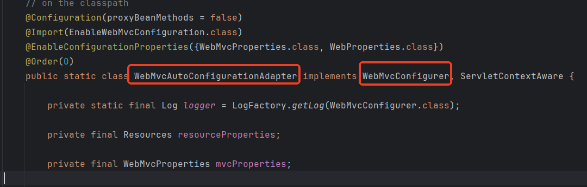

SpringBoot在这个类`WebMvcAutoConfigurationAdapter`中进行了一系列的Spring MVC相关配置。

**\<font style="color:#DF2A3F;"\>我们开发中要对Spring MVC的相关配置进行修改，可以编写一个类继承\</font\>**`**<font style="color:#DF2A3F;">WebMvcAutoConfigurationAdatper</font>**`**\<font style="color:#DF2A3F;"\>，然后重写对应的方法即可。\</font\>**

**\<font style="color:#DF2A3F;"\>因此，通过对\</font\>**`**<font style="color:#DF2A3F;">WebMvcAutoConfigurationAdapter</font>**`**\<font style="color:#DF2A3F;"\>类中的方法进行重写来\</font\>****\<font style="color:#74B602;"\>修改\</font\>****\<font style="color:#DF2A3F;"\>Web MVC的默认配置。\</font\>**

**\<font style="color:#DF2A3F;"\>\</font\>**

#### 关于`WebMvcConfigurer`接口
这个接口不是SpringBoot框架提供的，是Spring MVC提供的，在Spring框架4.3版本中引入的。这个接口的作用主要是**允许开发者通过实现这个接口来定制Spring MVC的行为**。

在这个接口中提供了很多方法，需要改变Spring MVC的哪个行为，则重写对应的方法即可，下面是这个接口中所有的方法，以及每个方法对应的Spring MVC行为的解释：

```java
public interface WebMvcConfigurer {
    // 用于定制 Spring MVC 如何匹配请求路径到控制器
    default void configurePathMatch(PathMatchConfigurer configurer) {}
    // 用于定制 Spring MVC 的内容协商策略，以确定如何根据请求的内容类型来选择合适的处理方法或返回数据格式
    default void configureContentNegotiation(ContentNegotiationConfigurer configurer) {}
    // 用于定制 Spring MVC 处理异步请求的方式
    default void configureAsyncSupport(AsyncSupportConfigurer configurer) {}
    // 用于定制是否将某些静态资源请求转发WEB容器默认的Servlet处理
    default void configureDefaultServletHandling(DefaultServletHandlerConfigurer configurer) {}
    // 用于定制 Spring MVC 解析视图的方式，以确定如何将控制器返回的视图名称转换为实际的视图资源。
    default void configureViewResolvers(ViewResolverRegistry registry) {}
    // 用于定制 Spring MVC 如何处理 HTTP 请求和响应的数据格式，包括 JSON、XML 等内容类型的转换
    default void configureMessageConverters(List<HttpMessageConverter<?>> converters) {}
    // 用于定制 Spring MVC 如何处理控制器方法中发生的异常，并提供相应的错误处理逻辑。
    default void configureHandlerExceptionResolvers(List<HandlerExceptionResolver> resolvers) {}

    // 用于定制 Spring MVC 如何处理数据的格式化和解析，例如日期、数值等类型的对象的输入和输出格式。
    default void addFormatters(FormatterRegistry registry) {}
    // 用于定制 Spring MVC 如何使用拦截器来处理请求和响应，包括在请求进入控制器之前和之后执行特定的操作。
    default void addInterceptors(InterceptorRegistry registry) {}
    // 用于定制 Spring MVC 如何处理静态资源（如 CSS、JavaScript、图片等文件）的请求。
    default void addResourceHandlers(ResourceHandlerRegistry registry) {}
    // 用于定制 Spring MVC 如何处理跨域请求，确保应用程序可以正确地响应来自不同域名的 AJAX 请求或其他跨域请求。
    default void addCorsMappings(CorsRegistry registry) {}
    // 用于快速定义简单的 URL 到视图的映射，而无需编写完整的控制器类和方法。
    default void addViewControllers(ViewControllerRegistry registry) {}
    // 用于定制 Spring MVC 如何解析控制器方法中的参数，包括如何从请求中获取并转换参数值。
    default void addArgumentResolvers(List<HandlerMethodArgumentResolver> resolvers) {}
    // 用于定制 Spring MVC 如何处理控制器方法的返回值，包括如何将返回值转换为实际的 HTTP 响应。
    default void addReturnValueHandlers(List<HandlerMethodReturnValueHandler> handlers) {}

    // 用于定制 Spring MVC 如何处理 HTTP 请求和响应的数据格式，允许你添加或调整默认的消息转换器，以支持特定的数据格式。
    default void extendMessageConverters(List<HttpMessageConverter<?>> converters) {}
    // 用于定制 Spring MVC 如何处理控制器方法中抛出的异常，允许你添加额外的异常处理逻辑。
    default void extendHandlerExceptionResolvers(List<HandlerExceptionResolver> resolvers) {}
}
```

#### `WebMvcConfigurer`接口的实现类`WebMvcAutoConfigurationAdapter`
`WebMvcAutoConfigurationAdapter`是Spring Boot框架提供的，实现了Spring MVC中的`WebMvcConfigurer`接口，对Spring MVC的所有行为进行了默认的配置。

如果想要改变这些默认配置，应该怎么办呢？看源码：


可以看到，该类上有一个注解`@EnableConfigurationProperties({ WebMvcProperties.class, WebProperties.class })`，该注解负责启用配置属性。会将配置文件`application.properties`或`application.yml`中的配置传递到该类中。因此可以通过`application.properties`或`application.yml`配置文件来改变Spring Boot对SpringMVC的默认配置。`WebMvcProperties`和`WebProperties`源码如下： 

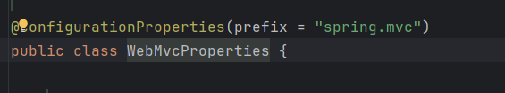

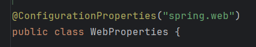

通过以上源码得知要改变SpringBoot对SpringMVC的默认配置，需要在配置文件中使用以下前缀的配置：

+ spring.mvc：\<font style="color:rgb(44, 44, 54);"\>主要用于配置 Spring MVC 的相关行为，例如路径匹配、视图解析、静态资源处理等\</font\>
+ spring.web：通常用于配置一些通用的 Web 层设置，如资源处理、安全性配置等。

## 自动配置中的静态资源处理
web站点中的静态资源指的是：js、css、图片等。

### 静态资源处理源码分析
关于**SpringBoot对静态资源处理的默认配置**，查看`WebMvcAutoConfigurationAdapter`源码，核心源码如下：


对以上源码进行解释：

```java
@Override
public void addResourceHandlers(ResourceHandlerRegistry registry) {

    // 检查 resourceProperties 中的 addMappings 属性是否为 false。如果为 false，则表示不启用默认的静态资源映射处理。
    // 在application.properties配置文件中进行`spring.web.resources.add-mappings=false`配置，可以将其设置为false。
    // 当然，如果没有配置的话，默认值是true。
    if (!this.resourceProperties.isAddMappings()) {
        logger.debug("Default resource handling disabled");
        return;
    }

    // 配置 WebJars 的静态资源处理。
    // this.mvcProperties.getWebjarsPathPattern()的执行结果是：/webjars/**
    // 也就是说，如果请求路径是 http://localhost:8080/webjars/** ，则自动去类路径下的 /META-INF/resources/webjars/ 目录中找静态资源。
    // 如果要改变这个默认的配置，需要在application.properties文件中进行这样的配置：`spring.mvc.webjars-path-pattern=...`
    addResourceHandler(registry, this.mvcProperties.getWebjarsPathPattern(),
            "classpath:/META-INF/resources/webjars/");

    // 配置普通静态资源处理
    // this.mvcProperties.getStaticPathPattern()的执行结果是：/**
    // this.resourceProperties.getStaticLocations()的执行结果是：{ "classpath:/META-INF/resources/","classpath:/resources/", "classpath:/static/", "classpath:/public/" }
    // 也就是说，如果请求路径是：http://localhost:8080/**，根据控制器方法优先原则，会先去找合适的控制器方法，如果没有合适的控制器方法，静态资源处理才会生效，则自动去类路径下的/META-INF/resources/、/resources/、/static/、/public/ 4个位置找。
    // 如果要改变这个默认的配置，需要在application.properties中进行如下的两个配置：
    // 配置URL：spring.mvc.static-path-pattern=...
    // 配置物理路径：spring.web.resources.static-locations=...,...,...,...
    addResourceHandler(registry, this.mvcProperties.getStaticPathPattern(), (registration) -> {
        registration.addResourceLocations(this.resourceProperties.getStaticLocations());
        if (this.servletContext != null) {
            ServletContextResource resource = new ServletContextResource(this.servletContext, SERVLET_LOCATION);
            registration.addResourceLocations(resource);
        }
    });
}
```

### 关于WebJars静态资源处理
默认规则是：当请求路径是`/webjars/**`，则会去`classpath:/META-INF/resources/webjars/`找。

**WebJars介绍**

\<font style="color:rgb(44, 44, 54);"\>WebJars 是一种将常用的前端库（如 jQuery、Bootstrap、Font Awesome 等）打包成 JAR 文件的形式，方便在 Java 应用程序中使用。WebJars 提供了一种标准化的方式来管理前端库，使其更容易集成到 Java 项目中，并且可以利用 Maven 的依赖管理功能。\</font\>

\<font style="color:rgb(44, 44, 54);"\>\</font\>

**\<font style="color:rgb(44, 44, 54);"\>WebJars在SpringBoot中的使用\</font\>**

\<font style="color:rgb(44, 44, 54);"\>WebJars官网：\</font\>[https://www.webjars.org/](https://www.webjars.org/)


在官网上可以找到某个webjars的maven依赖，将依赖加入到SpringBoot项目中，例如我们添加vue的依赖：

```xml
<dependency>
    <groupId>org.webjars.npm</groupId>
    <artifactId>vue</artifactId>
    <version>3.5.12</version>
</dependency>
```

如下图表示加入成功：


在jar包列表中也可以看到：


在SpringBoot中，对WebJars的默认访问规则是：当请求路径是`/webjars/**`，则会去`classpath:/META-INF/resources/webjars/`找。

因此我们要想访问上图的`index.js`，则应该发送这样的请求路径：`http://localhost:8080/webjars/vue/3.5.12/index.js`

启动服务器，打开浏览器，访问，测试结果如下：


和IDEA中的文件对比一下，完全一样则表示测试成功：


### 关于普通静态资源处理
SpringBoot对普通静态资源处理的规则是：

当请求路径是[http://localhost:8080/**](http://localhost:8080/**)，根据控制器方法优先原则，会先去找合适的控制器方法，如果没有合适的控制器方法，静态资源处理才会生效，则自动去类路径下的以下4个位置查找：

+ classpath:/META-INF/resources/
+ classpath:/resources/
+ classpath:/static/
+ classpath:/public/ 

我们可以在项目中分别创建以上4个目录，在4个目录当中放入静态资源，例如4张图片：


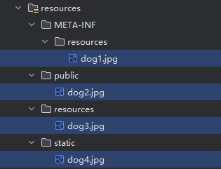

然后启动服务器，打开浏览器，访问，测试是否可以正常访问图片：


### 关于静态资源缓存处理
不管是webjars的静态资源还是普通静态资源，统一都会执行以下这个方法，这个方法最后几行代码就是关于静态资源的缓存处理方式。

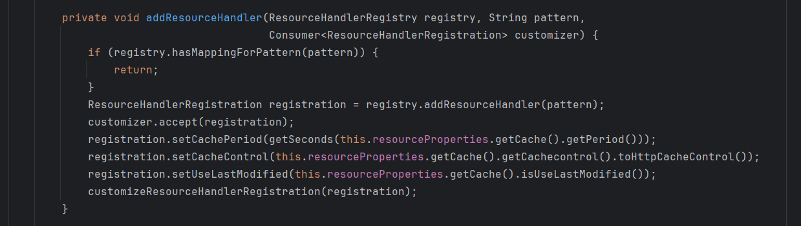

**什么是静态资源缓存，谁缓存，有什么用？**

静态资源缓存指的是浏览器的缓存行为，浏览器可以将静态资源（js、css、图片、声音、视频）缓存到浏览器中，只要下一次用户访问同样的静态资源直接从缓存中取，不再从服务器中获取，可以降低服务器的压力，提高用户的体验。而这个缓存策略可以在服务器端程序中进行设置，SpringBoot对静态资源缓存的默认策略就是以下这三行代码：


以上三行代码的解释如下：

+ registration.setCachePeriod(getSeconds(this.resourceProperties.getCache().getPeriod()));
    - 设置缓存的过期时间（如果没有指定单位，默认单位是秒）
    - 浏览器会**根据响应头中的缓存控制信息**决定是否从本地缓存中加载资源，而不是每次都从服务器重新请求。这有助于减少网络流量和提高页面加载速度。
    - 假设你配置了静态资源缓存过期时间为 1 小时（3600 秒），那么浏览器在首次请求某个静态资源后，会在接下来的一小时内从本地缓存加载该资源，而不是重新请求服务器。
    - 可以通过`application.properties`的来修改默认的过期时间，例如：`<font style="color:rgb(51, 51, 51);">spring.web.resources.cache.period=3600</font>`\<font style="color:rgb(51, 51, 51);"\>或者\</font\>`<font style="color:rgb(51, 51, 51);">spring.web.resources.cache.period=1h</font>`
+ registration.setCacheControl(this.resourceProperties.getCache().getCachecontrol().toHttpCacheControl());
    - 设置静态资源的 Cache-Control HTTP 响应头，告诉浏览器如何去缓存这些资源。
    - `<font style="color:rgb(44, 44, 54);">Cache-Control</font>`\<font style="color:rgb(44, 44, 54);"\> HTTP 响应头   是HTTP响应协议的一部分内容。如下图响应协议的响应头信息中即可看到\</font\>`<font style="color:rgb(44, 44, 54);">Cache-Control</font>`\<font style="color:rgb(44, 44, 54);"\>的字样：\</font\>


    - \<font style="color:rgb(44, 44, 54);"\>常见的 Cache-Control 指令包括：\</font\>
        * \<font style="color:rgb(44, 44, 54);"\>max-age=\<seconds\>：表示响应在多少秒内有效。\</font\>
        * \<font style="color:rgb(44, 44, 54);"\>public：表示响应可以被任何缓存机制（如代理服务器）缓存。\</font\>
        * \<font style="color:rgb(44, 44, 54);"\>private：表示响应只能被用户的浏览器缓存。\</font\>
        * \<font style="color:rgb(44, 44, 54);"\>no-cache：表示在使用缓存的资源之前必须重新发送一次请求进行验证。\</font\>
        * \<font style="color:rgb(44, 44, 54);"\>no-store：表示不缓存任何响应的资源。\</font\>
    - 例如：max-age=3600, public：表示响应在 3600 秒内有效，并且可以被任何缓存机制缓存。
    - 可以通过`spring.web.resources.cache.cachecontrol.max-age=3600`以及`spring.web.resources.cache.cachecontrol.cache-public=true`进行重新配置。
+ registration.setUseLastModified(this.resourceProperties.getCache().isUseLastModified());
    - 设置静态资源在响应时，是否在响应头中添加资源的最后一次修改时间。SpringBoot默认配置的是：在响应头中添加响应资源的最后一次修改时间。
    - 浏览器发送请求时，会将缓存中的资源的最后修改时间和服务器端资源的最后一次修改时间进行比对，如果没有变化，仍然从缓存中获取。
    - 可以通过`spring.web.resources.cache.use-last-modified=false`来进行重新配置。

### 静态资源缓存测试
根据之前源码分析，得知`静态资源缓存`相关的配置应该使用`spring.web.resources.cache`：


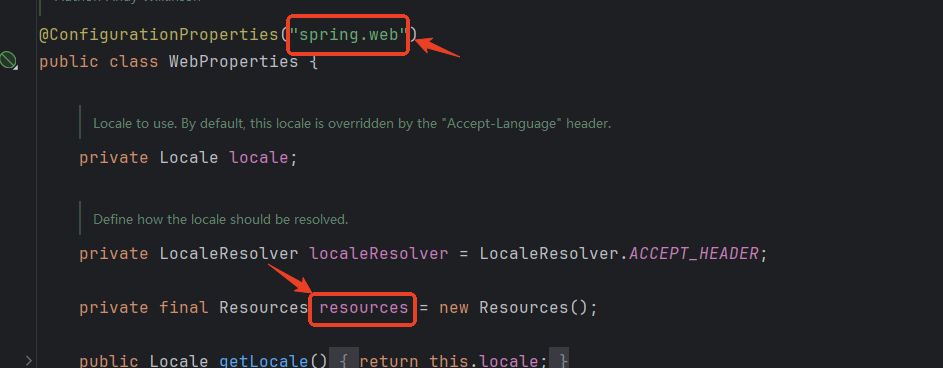

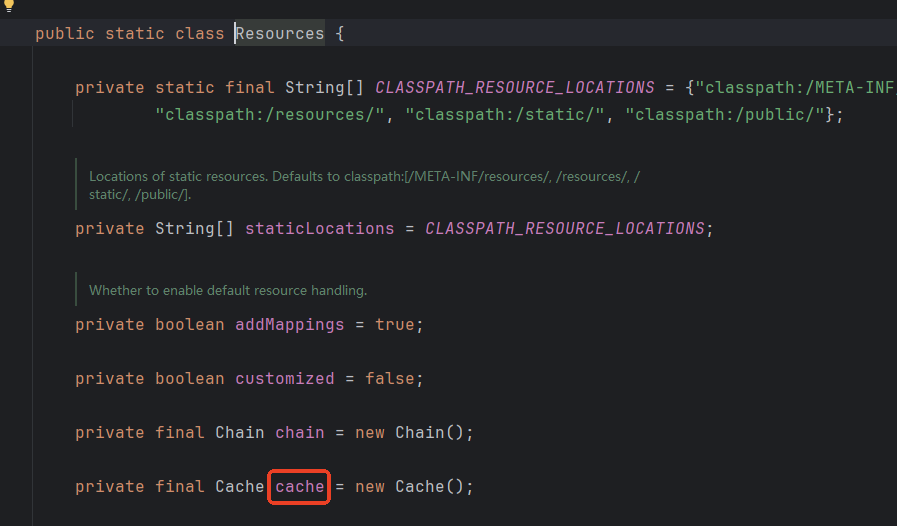


在`application.properties`文件中对缓存进行如下的配置：

```properties
# 静态资源缓存设置
# 1. 缓存有效期
spring.web.resources.cache.period=100
# 2. 缓存控制（cachecontrol配置的话，period会失效）
spring.web.resources.cache.cachecontrol.max-age=20
# 3. 是否使用缓存的最后修改时间（默认是：使用）
spring.web.resources.cache.use-last-modified=true
# 4. 是否开启静态资源默认处理方式（默认是：开启）
spring.web.resources.add-mappings=true
```

注意：`cachecontrol.max-age`配置的话，`period`会被覆盖。

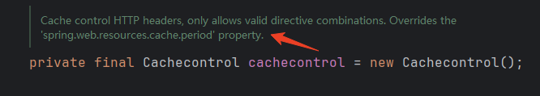

启动服务器测试：看看是否在20秒内走缓存，20秒之后是不是就不走缓存了！！！

第一次访问：请求服务器


第二次访问：20秒内开启一个新的浏览器窗口，再次访问，发现走了缓存

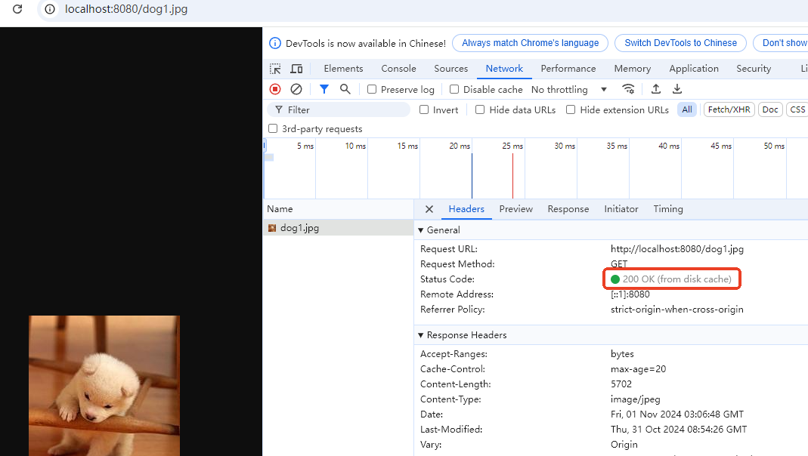

第三次访问：20秒后开启一个新的浏览器窗口，再次访问，发现重新请求服务器

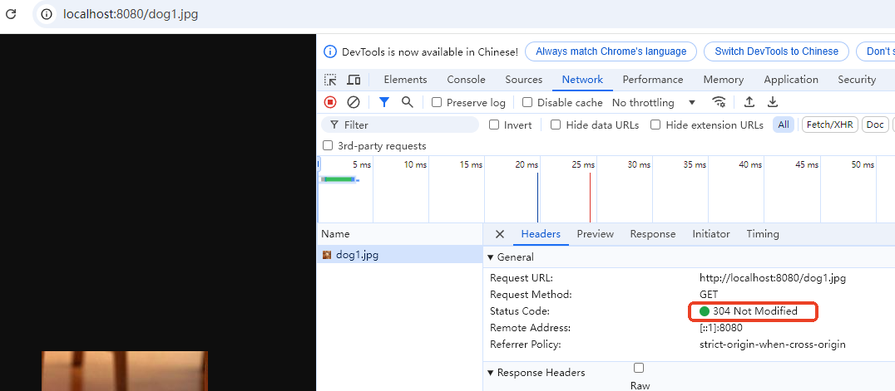

提示，为什么显示`304`，这是因为这个配置：`spring.web.resources.cache.use-last-modified=true`

### web应用的欢迎页面
#### 欢迎页测试
先说结论：只要在静态资源路径下提供`index.html`，则被当做欢迎页面。静态资源路径指的是之前的4个路径：

```plain
{ "classpath:/META-INF/resources/", "classpath:/resources/", "classpath:/static/", "classpath:/public/" }
```

测试一下，在`classpath:/static/`目录下新建`index.html`页面：

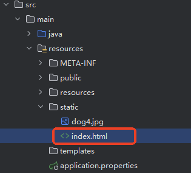

启动服务器，测试结果如下：


如果同时在4个静态资源路径下都提供`index.html`，哪个页面会被当做欢迎页呢？


启动服务器，测试结果如下：


原因是什么呢？这是因为`classpath:/META-INF/resources/`是数组的首元素，因此先从这个路径下找欢迎页。

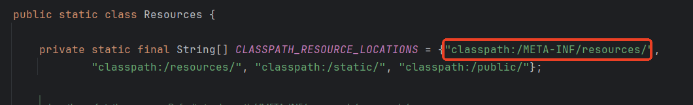

#### 欢迎页源码分析
在`WebMvcAutoConfiguration`类中有一个内部类`EnableWebMvcConfiguration`，这个类中有这样一段代码：

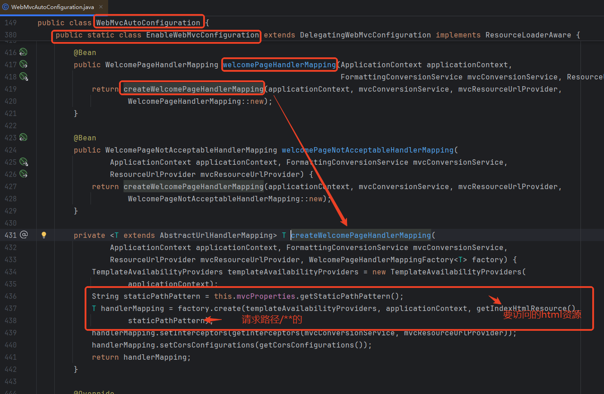

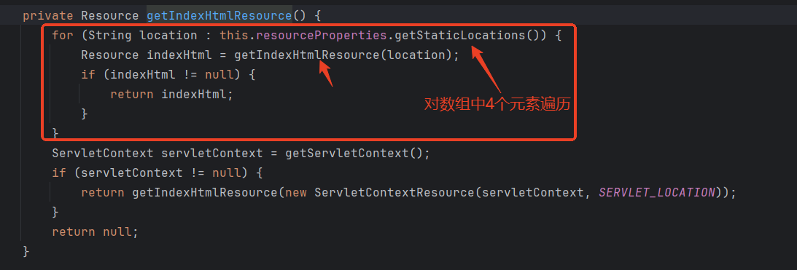

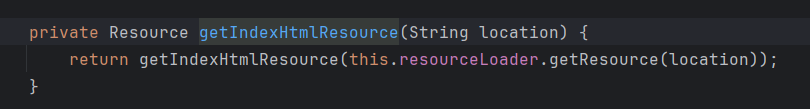

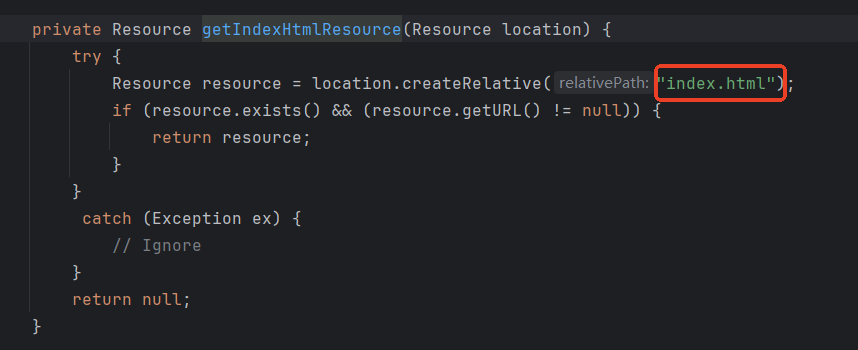

通过以上源码追踪，得出结论：只要请求路径是`/**`的，会依次去`{ "classpath:/META-INF/resources/", "classpath:/resources/", "classpath:/static/", "classpath:/public/" }`这四个位置找`index.html`页面作为欢迎页。

#### 一个小小的疑惑
我们来看一下`WebMvcAutoConfiguration`的生效条件：

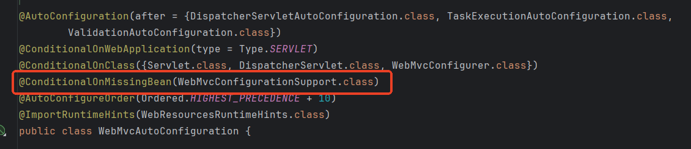

上图红框内表示，要求Spring容器中缺失`WebMvcConfigurationSupport`这个Bean，`WebMvcAutoConfiguration`才会生效。

但是我们来看一下`EnableWebMvcConfiguration`的继承结构：

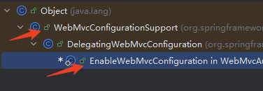

很明显，`EnableWebMvcConfiguration`就是一个`WebMvcConfigurationSupport`这样的Bean。

那疑问就有了：既然容器中存在`WebMvcConfigurationSupport`这样的Bean，`WebMvcAutoConfiguration`为什么还会生效呢？

原因是因为：`EnableWebMvcConfiguration`是`WebMvcAutoConfiguration`类的内部类。在`WebMvcAutoConfiguration`进行加载的时候，`EnableWebMvcConfiguration`这个内部类还没有加载。因此这个时候在容器中还不存在`WebMvcConfigurationSupport`的Bean，所以`WebMvcAutoConfiguration`仍然会生效。

**\<font style="color:#DF2A3F;"\>以上所说的\</font\>**`**<font style="color:#DF2A3F;">WebMvcAutoConfiguration</font>**`**\<font style="color:#DF2A3F;"\>类中的内部类\</font\>**`**<font style="color:#DF2A3F;">EnableWebMvcConfiguration</font>**`**\<font style="color:#DF2A3F;"\>，是用来启用Web MVC默认配置的。\</font\>**

**\<font style="color:#DF2A3F;"\>\</font\>**

**\<font style="color:#DF2A3F;"\>注意区分：WebMvcAutoConfiguration的两个内部类：\</font\>**

+ `WebMvcAutoConfigurationAdapter`作用是用来：修改配置的
+ `EnableWebMvcConfiguration`作用是用来：启用配置的

#### favorite icon
favicon（也称为“收藏夹图标”或“网站图标”）是大多数现代网页浏览器的默认行为之一。当用户访问一个网站时，浏览器通常会尝试从该网站的根目录下载名为 favicon.ico 的文件，并将其用作标签页的图标。

如果网站没有提供 favicon.ico 文件，浏览器可能会显示一个默认图标，或者根本不显示任何图标。为了确保良好的用户体验，网站开发者通常会在网站的根目录下放置一个 favicon.ico 文件。

Spring Boot项目中`favicon.ico`文件应该放在哪里呢？Spring Boot官方是这样说明的：


这段话翻译为：

与其他静态资源一样，Spring Boot 会在配置的静态内容位置检查是否存在 `favicon.ico`文件。如果存在这样的文件，它将自动作为应用程序的 favicon 使用。

以上官方说明的：将`favicon.ico`文件放到静态资源路径下即可。

web站点没有提供`favicon.ico`时：


我们在[https://www.iconfont.cn/](https://www.iconfont.cn/) （阿里巴巴提供的图标库）上随便找一个图标，然后将图片名字命名为`favicon.ico`，然后将其放到SpringBoot项目的静态资源路径下：

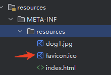

启动服务器测试：记住（ctrl + F5强行刷新一下，避免影响测试效果）


# SpringBoot的web手动配置(静态资源处理)
如果你对SpringBoot默认的静态资源处理方式不满意。可以通过两种方式来改变这些默认的配置：

+ 第一种：配置文件方式
    - 通过修改`application.properties`或`application.yml`
    - 添加`spring.mvc`和`spring.web`相关的配置。

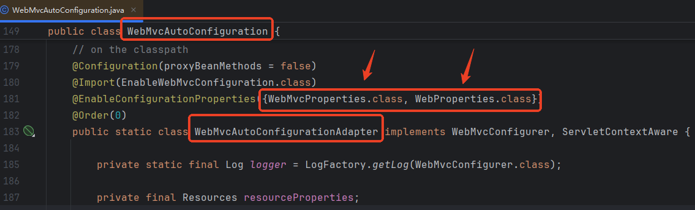

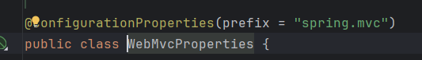

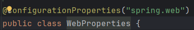

+ 第二种：编写代码方式
    - SpringMVC框架为我们提供了`WebMvcConfigurer`接口，需要改变默认的行为，可以`编写一个类`实现`WebMvcConfigurer`接口，并`对应重写`接口中的方法即可改变默认的配置行为。

## 配置文件方式
要修改`访问静态资源URL的前缀`，这样配置：

```properties
# Spring MVC的相关配置
# 1. 设置webjars静态资源的请求路径的前缀
spring.mvc.webjars-path-pattern=/wjs/**
# 2. 设置普通静态资源的请求路径的前缀
spring.mvc.static-path-pattern=/static/**
```

要修改`静态资源的存放位置`，这样配置：

```properties
spring.web.resources.static-locations=classpath:/static1/,classpath:/static2/
```

进行以上配置之后：

1. 访问webjars的请求路径应该是这样的：http://localhost:8080/wjs/....
2. 访问普通静态资源的请求路径应该是这样的：http://localhost:8080/static/....
3. 普通静态资源的存放位置也应该放到`classpath:/static1/,classpath:/static2/`下面，其他位置无效。

**访问webjars测试结果如下：**

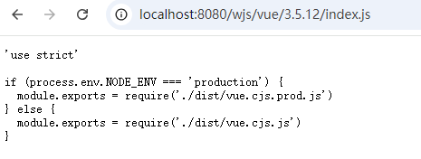

**访问普通静态资源测试结果如下：**


如果访问`dog2.jpg`，就无法访问了：


但是，存储在`classpath:/META-INF/resources/`目录下的`dog1.jpg`仍然是可以访问的：


因此，存储在`classpath:/META-INF/resources/`位置的静态资源会被默认加载，不受手动配置的影响。

## 编写代码方式
我们在前面提到过，想要定制Spring MVC的行为，也可以编写类实现Spring MVC框架提供的一个接口`WebMvcConfigurer`，想定制哪个行为就重写哪个方法即可。

编写的类只要纳入IoC容器的管理。因此有以下两种实现方式：

+ 第一种：编写类实现`WebMvcConfigurer`接口，重写对应的方法。
+ 第二种：以组件的形式存在：编写一个方法，用`@Bean`注解标注。

### 第一种方式
编写配置类，对于`web`开发来说，配置类一般起名为：`WebConfig`。配置类一般存放到`config`包下，因此在SpringBoot主入口程序同级目录下新建`config`包，在`config`包下新建`WebConfig`类：

```java
package com.powernode.springboot.config;

import org.springframework.context.annotation.Configuration;
import org.springframework.web.servlet.config.annotation.ResourceHandlerRegistry;
import org.springframework.web.servlet.config.annotation.WebMvcConfigurer;

// 使用该注解标注，表示该类为配置类。
@Configuration
public class WebConfig implements WebMvcConfigurer {
    @Override
    public void addResourceHandlers(ResourceHandlerRegistry registry) {
        registry.addResourceHandler("/static/**")
                .addResourceLocations("classpath:/static1/", "classpath:/static2/");
    }
}
```

注意：将`application.properties`文件中之前的所有配置全部注释掉。让其恢复到最原始的默认配置。

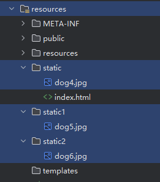

启动服务器进行测试：


通过测试，我们的配置是生效的。

我们再来看看，默认的配置是否还生效？


我们可以看到，Spring Boot对Spring MVC的默认自动配置是生效的。

**\<font style="color:#DF2A3F;"\>因此，以上的方式只是在Spring MVC默认行为之外扩展行为。\</font\>**

**\<font style="color:#DF2A3F;"\>\</font\>**

如果你不想再继续使用SpringBoot提供的默认行为，可以使用`@EnableWebMvc`进行标注。例如：

```java
package com.powernode.springboot.config;

import org.springframework.context.annotation.Configuration;
import org.springframework.web.servlet.config.annotation.EnableWebMvc;
import org.springframework.web.servlet.config.annotation.ResourceHandlerRegistry;
import org.springframework.web.servlet.config.annotation.WebMvcConfigurer;

@EnableWebMvc
// 使用该注解标注，表示该类为配置类。
@Configuration
public class WebConfig implements WebMvcConfigurer {
    @Override
    public void addResourceHandlers(ResourceHandlerRegistry registry) {
        registry.addResourceHandler("/static/**")
                .addResourceLocations("classpath:/static1/", "classpath:/static2/");
    }
}

```

测试结果：

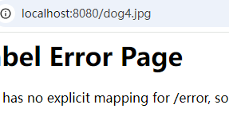

可以看到，默认配置已经不再生效。

再来看看，我们自己的配置是否仍然生效：


仍然生效。

### 第二种方式
采用`@Bean`注解提供一个`WebMvcConfigurer`组件，代码如下：

```java
package com.powernode.springboot.config;

import org.springframework.context.annotation.Bean;
import org.springframework.context.annotation.Configuration;
import org.springframework.web.servlet.config.annotation.ResourceHandlerRegistry;
import org.springframework.web.servlet.config.annotation.WebMvcConfigurer;

@Configuration
public class WebConfig2 {

    @Bean
    public WebMvcConfigurer addResourceHandlers(){
        return new WebMvcConfigurer() {
            @Override
            public void addResourceHandlers(ResourceHandlerRegistry registry) {
                registry.addResourceHandler("/static/**")
                        .addResourceLocations("classpath:/static1/", "classpath:/static2/");
            }
        };
    }
}

```

测试结果如下：


通过了测试，并且以上代码也是在原有配置基础上进行扩展。

如果要弃用默认配置，仍然使用	`@EnableWebMvc`注解进行标注。自行测试！

### 其他配置也这样做即可
以上对`静态资源处理`进行了手动配置，也可以做其他配置，例如拦截器：

```java
package com.powernode.springboot.config;

import jakarta.servlet.http.HttpServletRequest;
import jakarta.servlet.http.HttpServletResponse;
import org.springframework.context.annotation.Bean;
import org.springframework.context.annotation.Configuration;
import org.springframework.web.servlet.HandlerInterceptor;
import org.springframework.web.servlet.ModelAndView;
import org.springframework.web.servlet.config.annotation.InterceptorRegistry;
import org.springframework.web.servlet.config.annotation.ResourceHandlerRegistry;
import org.springframework.web.servlet.config.annotation.WebMvcConfigurer;

@Configuration
public class WebConfig2 {

    @Bean
    public WebMvcConfigurer addResourceHandlers(){
        return new WebMvcConfigurer() {
            @Override
            public void addResourceHandlers(ResourceHandlerRegistry registry) {
                registry.addResourceHandler("/static/**")
                        .addResourceLocations("classpath:/static1/", "classpath:/static2/");
            }
        };
    }

    // 拦截器配置。
    @Bean
    public WebMvcConfigurer addInterceptor(){
        return new WebMvcConfigurer() {
            @Override
            public void addInterceptors(InterceptorRegistry registry) {
                registry.addInterceptor(new HandlerInterceptor() {
                    @Override
                    public boolean preHandle(HttpServletRequest request, HttpServletResponse response, Object handler) throws Exception {
                        System.out.println("Interceptor's preHandle......");
                        return true;
                    }

                    @Override
                    public void postHandle(HttpServletRequest request, HttpServletResponse response, Object handler, ModelAndView modelAndView) throws Exception {
                        System.out.println("Interceptor's postHandle......");
                    }

                    @Override
                    public void afterCompletion(HttpServletRequest request, HttpServletResponse response, Object handler, Exception ex) throws Exception {
                        System.out.println("Interceptor's afterCompletion......");
                    }
                });
            }
        };
    }
}

```

启动服务器，打开浏览器，发送请求[http://localhost:8080/static/dog5.jpg](http://localhost:8080/static/dog5.jpg)，后台执行结果如下：


这说明拦截器生效。

### 为什么只要容器中有`WebMvcConfigurer`组件即可呢
源码分析：

`WebMvcAutoConfiguration`部分源码：

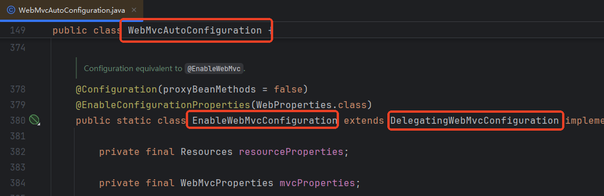

`WebMvcAutoConfiguration`类的内部类`EnableWebMvcConfiguration`，这个类继承了`DelegatingWebMvcConfiguration`（Delegating是委派的意思。）

`DelegatingWebMvcConfiguration`部分源码：

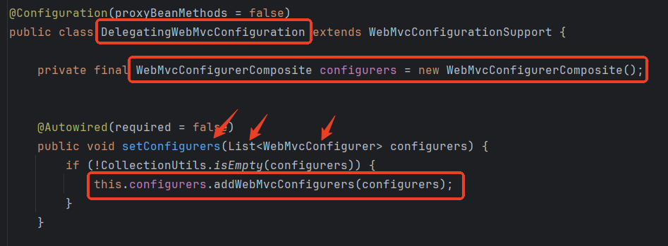

`DelegatingWebMvcConfiguration`中的`setConfigurers()`方法用来设置配置。而配置参数是一个List集合，这个List集合中存放的是`WebMvcConfigurer`接口的实例，并且可以看到这个方法上面使用了`@Autowired`进行了自动注入，这也就是说为什么只要是IoC容器中的组件就能生效的原因。

我们再次进入到`this.configurers.addWebMvcConfigurers(configurers);`方法中进一步查看源码：

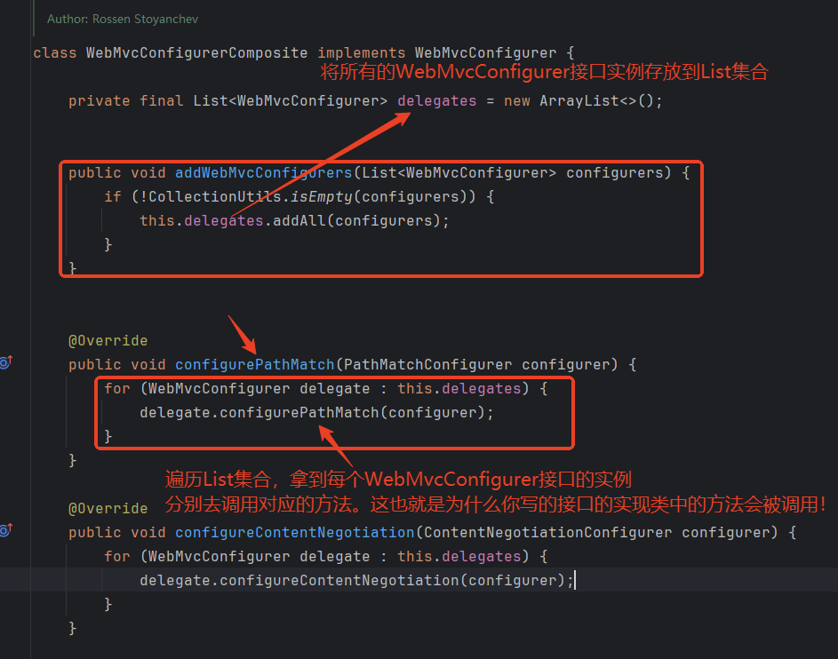

对于`WebMvcConfigurerComposite`类的代码来说，它是一个非常典型的`**<font style="color:#DF2A3F;">组合模式</font>**`。

组合模式的关键点：

1. 组合多个 WebMvcConfigurer 实例：WebMvcConfigurerComposite 通过 delegates 列表组合了多个 WebMvcConfigurer 实例。
2. 统一接口：WebMvcConfigurerComposite 实现了 WebMvcConfigurer 接口，因此可以像一个单一的 WebMvcConfigurer 一样被使用。
3. 代理调用：在实现 WebMvcConfigurer 接口的方法时，WebMvcConfigurerComposite 会遍历 delegates 列表，调用每个 WebMvcConfigurer 实例的相应方法。

总结：WebMvcConfigurerComposite 主要采用了组合模式的思想，将多个 WebMvcConfigurer 实例组合在一起，形成一个整体。

注意：组合模式是GoF 23种设计模式中的结构型设计模式。

# web请求的路径匹配
我们在学习SpringMVC的时候，路径匹配规则中学习了`Ant`风格的路径匹配规则。大家可以翻看一下之前的Spring MVC视频。

在`Spring Boot3`中，对web请求的路径匹配提供了两种规则：

+ 第一种：AntPathMatcher（Ant风格）【**\<font style="color:#DF2A3F;"\>较旧\</font\>**】
+ 第二种：PathPatternParser（从Spring5.3中引入的。在SpringBoot2.4中引入的。）【**\<font style="color:#DF2A3F;"\>较新：效率高\</font\>**】
    - **\<font style="color:#DF2A3F;"\>效率比Ant高，一般新项目中使用\</font\>**`**<font style="color:#DF2A3F;">PathPatternParser</font>**`

SpringBoot3中默认使用的是`PathPatternParser`，不需要任何配置。如果要使用`AntPathMatcher`，就需要进行如下的配置：

```properties
spring.mvc.pathmatch.matching-strategy=ant_path_matcher
```

## AntPathMatcher
Ant风格的路径匹配规则回顾：

**\<font style="color:#DF2A3F;"\>*\</font\>**	匹配任意长度的任意字符序列（不包括路径分隔符）。示例：/foo/*.html 匹配 /foo/bar.html 和 /foo/baz.html。

**\<font style="color:#DF2A3F;"\>**\</font\>**	匹配任意数量的目录层级。示例：/foo/** 匹配 /foo/bar、/foo/bar/baz 和 /foo/bar/baz/qux。

**\<font style="color:#DF2A3F;"\>?\</font\>****	**匹配**任意单个字符**。示例：/foo?bar 匹配 /foobar 和 /fooxbar。

**\<font style="color:#DF2A3F;"\>[]\</font\>****	**匹配指定范围内的单个字符。示例：/foo[a-z]bar 匹配 /fooabar、/foobbar 等。

**\<font style="color:#DF2A3F;"\>{}\</font\>****	**路径变量，用于提取路径的一部分作为参数。示例：/users/{userId} 匹配 /users/123，提取 userId=123。

如果在SpringBoot3中启用Ant风格，记得配置：

```properties
spring.mvc.pathmatch.matching-strategy=ant_path_matcher
```

如下代码：请分析以下路径匹配的是什么样的路径。

```java
package com.powernode.springboot.controller;

import jakarta.servlet.http.HttpServletRequest;
import org.springframework.web.bind.annotation.GetMapping;
import org.springframework.web.bind.annotation.PathVariable;
import org.springframework.web.bind.annotation.RestController;

@RestController
public class PathController {

    @GetMapping("/{path:[a-z]+}/a?/**/*.do")
    public String path(HttpServletRequest request, @PathVariable String path){
        return request.getRequestURI() + "," + path;
    }
}
```

启动服务器并测试路径：


## PathPatternParser
项目中不做配置，或者按照以下方式配置，都是`PathPatternParser`：

```properties
spring.mvc.pathmatch.matching-strategy=path_pattern_parser
```

`PathPatternParser`风格是兼容Ant风格的。只有一个地方`PathPatternParser`不支持，Ant支持。在Ant风格中，`**`可以出现在任意位置。在`PathPatternParser`中只允许`**`出现在路径的末尾。

可以测试一下，将配置文件中的Ant风格注释掉，采用`PathPatternParser`风格。然后控制器代码如下：

```java
package com.powernode.springboot.controller;

import jakarta.servlet.http.HttpServletRequest;
import org.springframework.web.bind.annotation.GetMapping;
import org.springframework.web.bind.annotation.PathVariable;
import org.springframework.web.bind.annotation.RestController;

@RestController
public class PathController {

    @GetMapping("/{path:[a-z]+}/a?/**/*.do")
    public String path(HttpServletRequest request, @PathVariable String path){
        return request.getRequestURI() + "," + path;
    }
}
```

启动服务器报错：

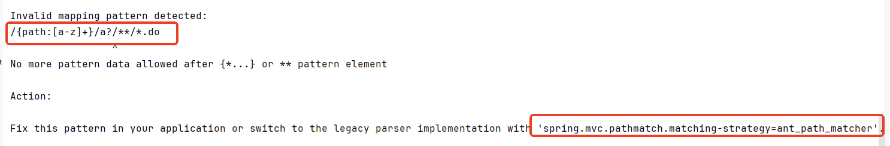

提示你，如果在路径当中出现了`**`，需要将路径匹配规则替换为Ant风格。因此路径当中如果出现`**`，那么必须使用Ant风格。除此之外，`PathPatternParser`均可用。

我们再来测试一下，`**`放到末尾，对于`PathPatternParser`是否可用？

```java
@GetMapping("/{path:[a-z]+}/a?/*.do/**")
public String path(HttpServletRequest request, @PathVariable String path){
    return request.getRequestURI() + "," + path;
}
```

启动服务器测试，可用：

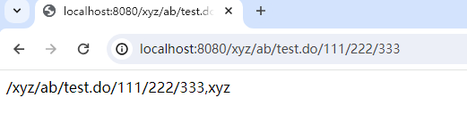

## 路径匹配相关源码
底层选择路径匹配规则的源码是：

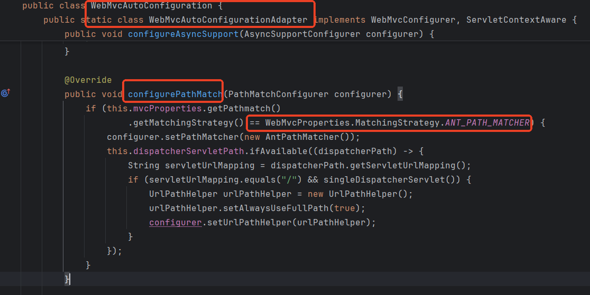

# 内容协商
内容协商机制是Spring MVC框架提供的，接下来主要是学习在SpringBoot中是如何支持SpringMVC内容协商机制的。

## 对内容协商的理解
内容协商机制是指服务器根据客户端的请求来决定返回资源的最佳表示形式。

白话文描述：客户端要什么格式的数据，咱后端就应该返回什么格式的数据。

+ 客户端要JSON，咱就响应JSON。
+ 客户端要XML，咱就响应XML。
+ 客户端要YAML，咱就响应YAML。

你可能会有疑问：客户端接收数据时统一采用一种格式，例如JSON，不就行了吗。哪那么多事儿呀！！！

但在实际的开发中，不是这样的，例如：

+ 遗留的老客户端系统，仍然处理的是XML格式的数据。
+ 要求处理速度快的这种客户端系统，一般要求返回JSON格式的数据。
+ 要求安全性高的客户端系统，一般要求返回XML格式的数据。

因此，在现代的开发中，不同的客户端可能需要后端系统返回不同格式的数据。总之后端应该满足这种多样化的需求。

## 实现内容协商的两种方式
通常通过HTTP请求头（如 Accept）或请求参数（如 format）来指定客户端偏好接收的内容类型（如JSON、XML等）。服务器会根据这些信息选择最合适的格式进行响应。

### 通过HTTP请求头（如 Accept）
SpringBoot框架中，在程序员不做任何配置的情况下，优先考虑的是这种方式。

服务器会根据客户端发送请求时提交的请求头中的"Accept: application/json" 或 "Accept: application/xml" 或 "Accept: text/html"来决定响应什么格式的数据。

客户端发送请求给服务器的时候，如何设置请求头的`Accept`？有以下几种常见实现方式：

+ 写代码
    - fetch API
    - ajax的XMLHttpRequest
    - axios库
    - jQuery库......
+ 用工具
    - 接口测试工具，例如：Postman、Apifox等。
    - 命令行工具：curl

对于我们编写的以下Controller来说：

```java
package com.powernode.springboot.controller;

import com.powernode.springboot.bean.User;
import com.powernode.springboot.service.UserService;
import org.springframework.beans.factory.annotation.Autowired;
import org.springframework.web.bind.annotation.GetMapping;
import org.springframework.web.bind.annotation.RestController;

@RestController
public class UserController {

    @Autowired
    private UserService userService;

    @GetMapping(value = "/detail")
    public User detail(){
        return userService.getUser();
    }
}
```

我们使用了`@RestController`，也就是使用了`@ResponseBody`。因此默认支持的是返回JSON数据。怎么才能支持返回XML格式的数据呢？需要做以下两步：

第一步：引入一个依赖

```xml
<dependency>
  <groupId>com.fasterxml.jackson.dataformat</groupId>
  <artifactId>jackson-dataformat-xml</artifactId>
</dependency>
```

第二步：在实体类上添加一个注解

```java
package com.powernode.springboot.bean;

import com.fasterxml.jackson.dataformat.xml.annotation.JacksonXmlRootElement;
import lombok.AllArgsConstructor;
import lombok.Data;
import lombok.NoArgsConstructor;

@JacksonXmlRootElement
@Data
@NoArgsConstructor
@AllArgsConstructor
public class User {
    private String name;
    private String password;
}
```

接下来，我们使用`curl`命令行工具，来模拟发送请求，并在请求头中设置`Accept`：

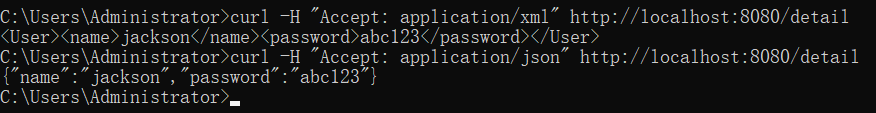

可以很清楚的看到，服务器根据不同的请求头返回了不同格式的数据。

+ `Accept: application/xml`则返回XML格式的数据
+ `Accept: application/json`则返回JSON格式的数据

### \<font style="color:rgb(44, 44, 54);"\>通过请求参数（如 \</font\>`<font style="color:rgb(44, 44, 54);">format</font>`\<font style="color:rgb(44, 44, 54);"\>）\</font\>
接下来我们使用请求参数的方式，来测试一下服务器的响应，注意：默认的请求参数名为`format`。

我们仍然使用`curl`命令行工具进行测试：

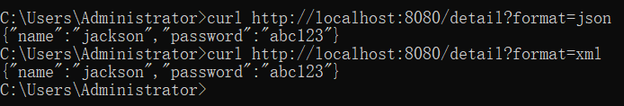

我们可以看到，并没有达到我们想要的效果，这是因为`SpringBoot优先考虑的不是通过请求参数format方式`。如何优先考虑使用`format`方式呢？做如下配置：

```properties
# 内容协商时，优先考虑请求参数format方式。
spring.mvc.contentnegotiation.favor-parameter=true
```

再次测试：

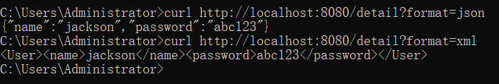

可以看到，现在SpringBoot已经优先考虑使用`请求参数format`方式了。

当然，请求参数的名字可以不使用`format`吗？支持定制化吗？答案是支持的，例如你希望请求参数的名字为`type`，可以做如下配置：

```properties
# 内容协商时，设置请求参数的名字，默认为format
spring.mvc.contentnegotiation.parameter-name=type
```

再次使用`curl`工具进行测试：

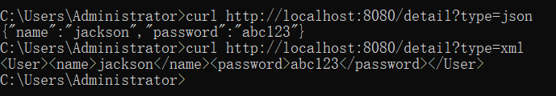

## HttpMessageConverter接口
### HttpMessageConverter的理解
`HttpMessageConverter`接口，对于这个接口来说，大家应该不陌生，在Spring MVC的课程当中咱们已经详细的学习过了。在这里简单回顾一下。

`HttpMessageConverter`接口被翻译为：`Http消息转换器`。它起到转换`Http消息`的作用。

什么是`Http消息`？所谓的`Http消息`本质上就是浏览器向服务器发送请求时提交的数据，或者服务器向浏览器响应的数据。

而`HttpMessageConverter`接口就是负责完成`请求/响应`时的数据格式转换的。

在Spring MVC中提供了很多`HttpMessageConverter`接口的实现类，不同的`Http消息转换器`具有不同的转换效果，有的负责将Java对象转换为JSON格式的字符串，有的负责将Java对象转换成XML格式的字符串。

### 常见的HttpMessageConverter
内置的常见的`HttpMessageConverter`的实现类包括：

+ \<font style="color:#DF2A3F;"\>【请求】提交的表单（form）数据转换成Java对象的主要任务是由 FormHttpMessageConverter 消息转换器完成的\</font\>
+ \<font style="color:#DF2A3F;"\>【请求】提交的JSON数据转换成Java对象的主要任务是由 MappingJackson2HttpMessageConverter 消息转换器完成的。（我们通常使用的\</font\>`<font style="color:#DF2A3F;">@RequestBody</font>`\<font style="color:#DF2A3F;"\>注解）\</font\>
+ 【响应】将Java对象转换成JSON格式的数据，并将其写入HTTP响应体的任务是由 MappingJackson2HttpMessageConverter 消息转换器完成。（我们通常使用的`@ResponseBody`注解)
+ 【响应】将Java对象转换成XML格式的数据，并将其写入HTTP响应体的任务通常由 Jaxb2RootElementHttpMessageConverter 消息转换器完成。
+ 【响应】将 String 直接写入到响应体的任务是由 StringHttpMessageConverter 消息转换器完成。
+ ......

### 请求时通过哪些条件确定使用哪个转换器
请求时通常根据以下条件来确定使用哪个消息转换器：

1. 请求的 Content-Type 字段：

Spring MVC 会检查请求的 Content-Type 字段，以确定请求体的数据格式（例如 application/json、application/x-www-form-urlencoded、application/xml 等）。

2. 方法参数类型：

控制器方法中接收请求体的参数类型（例如 @RequestBody）。

### 响应时通过哪些条件确定使用哪个转换器
响应时通常根据以下条件来确定使用哪个消息转换器：

1. 请求提交时，请求头上的Accept字段 ：

Spring MVC 会检查客户端请求的 Accept 字段，以确定客户端期望的响应格式（例如 application/json、application/xml 等）。

2. 方法返回值类型：

控制器方法的返回值类型（例如 @ResponseBody）。

例如1：@ResponseBody + 控制器方法的返回值是String，则使用StringHttpMessageConverter转换器。（将字符串直接写入响应体）

例如2：@ResponseBody + 控制器方法的返回值是User，则使用MappingJackson2HttpMessageConverter转换器。（将java对象转换成json格式的字符串写入到响应体）

### 系统默认提供了哪些HttpMessageConverter
查看源码：

WebMvcAutoConfiguration.EnableWebMvcConfiguration extends DelegatingWebMvcConfiguration extends WebMvcConfigurationSupport

`WebMvcAutoConfiguration`内部类`EnableWebMvcConfiguration`

`EnableWebMvcConfiguration`继承了`DelegatingWebMvcConfiguration`

`DelegatingWebMvcConfiguration`继承了`WebMvcConfigurationSupport`

在`WebMvcConfigurationSupport`类中有这样一个方法：`addDefaultHttpMessageConverters()` 用来添加默认的`HttpMessageConverter`对象。

通过断点调试，可以发现默认支持6个HttpMessageConverter，如下：

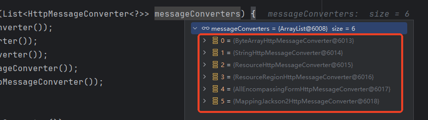

这6个`HttpMessageConverter`作用如下：

1. **ByteArrayHttpMessageConverter:**

用于将字节数组(byte[])与HTTP消息体之间进行转换。这通常用于处理二进制数据，如图片或文件。

2. **StringHttpMessageConverter:**

用于将字符串(String)与HTTP消息体之间进行转换。它支持多种字符集编码，能够处理纯文本内容。

3. **ResourceHttpMessageConverter:**

用于将Spring的Resource对象与HTTP消息体之间进行转换。Resource是Spring中表示资源的接口，可以读取文件等资源。这个转换器对于下载文件或发送静态资源有用。

4. **ResourceRegionHttpMessageConverter:**

用于处理资源的部分内容（即“Range”请求），特别是当客户端请求大文件的一部分时。这对于实现视频流媒体等功能很有用。

5. **AllEncompassingFormHttpMessageConverter:**

用于处理表单，是一个比较全面的form消息转换器。处理标准的application/x-www-form-urlencoded格式的数据，以及包含文件上传的multipart/form-data格式的数据。

6. **MappingJackson2HttpMessageConverter:**

使用Jackson库来序列化和反序列化JSON数据。可以将Java对象转换为JSON格式的字符串，反之亦然。

另外，通过以下源码，也可以看到SpringBoot是根据类路径中是否存在某个类，而决定是否添加对应的消息转换器的：


因此，我们只要引入相关的依赖，让类路径存在某个类，则对应的消息转换器就会被加载。

## 定义自己的HttpMessageConverter
可以看到以上6个消息转换器中没有yaml相关的消息转换器，可见，如果要实现yaml格式的内容协商，yaml格式的消息转换器就需要我们自定义了。

### 第一步：引入能够处理yaml格式的依赖
任何一个能够处理yaml格式数据的库都可以，这里选择使用`jackson`的库，因为它既可以处理json，xml，又可以处理yaml。

```xml
<dependency>
  <groupId>com.fasterxml.jackson.dataformat</groupId>
  <artifactId>jackson-dataformat-yaml</artifactId>
</dependency>
```

编写测试程序，简单测试一下这个库的用法：

```java
package com.powernode.springboot;

import com.fasterxml.jackson.core.JsonProcessingException;
import com.fasterxml.jackson.databind.ObjectMapper;
import com.fasterxml.jackson.dataformat.yaml.YAMLFactory;
import com.fasterxml.jackson.dataformat.yaml.YAMLGenerator;
import com.powernode.springboot.bean.User;

public class Jackson2YamlTest {
    public static void main(String[] args) throws JsonProcessingException {
        // 创建YAML工厂类
        YAMLFactory yamlFactory = new YAMLFactory().disable(YAMLGenerator.Feature.WRITE_DOC_START_MARKER); // 禁止使用文档头标记
        // 创建对象映射器
        ObjectMapper objectMapper = new ObjectMapper(yamlFactory);
        // 准备数据
        User user = new User("jackson", "jack123");
        // 将数据转换成YAML格式
        String s = objectMapper.writeValueAsString(user);
        System.out.println(s);
    }
}
```

执行结果如下：

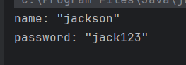

### 第二步：新增一种媒体类型yaml
默认支持xml和json两种媒体类型，要支持yaml格式的，需要新增一个yaml媒体类型，在springboot的配置文件中进行如下配置：

```properties
spring.mvc.contentnegotiation.media-types.yaml=text/yaml
```

注意，以上`types`后面的`yaml`是媒体类型的名字，名字随意，如果媒体类型起名为`xyz`，那么发送请求时的路径应该是这样的：http://localhost:8080/detail?format=xyz

### 第三步：自定义HttpMessageConverter
编写类`YamlHttpMessageConverter`继承`AbstractHttpMessageConverter`，代码如下：

```java
package com.powernode.springboot.config;

import com.fasterxml.jackson.databind.ObjectMapper;
import com.fasterxml.jackson.dataformat.yaml.YAMLFactory;
import com.fasterxml.jackson.dataformat.yaml.YAMLGenerator;
import com.powernode.springboot.bean.User;
import org.springframework.http.HttpInputMessage;
import org.springframework.http.HttpOutputMessage;
import org.springframework.http.MediaType;
import org.springframework.http.converter.AbstractHttpMessageConverter;
import org.springframework.http.converter.HttpMessageNotReadableException;
import org.springframework.http.converter.HttpMessageNotWritableException;

import java.io.IOException;
import java.nio.charset.Charset;

public class YamlHttpMessageConverter extends AbstractHttpMessageConverter<Object> {

    private ObjectMapper objectMapper = new ObjectMapper(new YAMLFactory().disable(YAMLGenerator.Feature.WRITE_DOC_START_MARKER));

    public YamlHttpMessageConverter() {
        // 让 消息转换器 和 媒体类型 application/yaml 绑定在一起。
        super(new MediaType("text", "yaml", Charset.forName("UTF-8")));
    }

    @Override
    protected boolean supports(Class<?> clazz) {
        // 表示User类型的数据支持yaml，其他类型不支持
        return User.class.isAssignableFrom(clazz);
    }

    // 处理 @RequestBody（将提交的yaml格式数据转换为java对象）
    @Override
    protected Object readInternal(Class<?> clazz, HttpInputMessage inputMessage) throws IOException, HttpMessageNotReadableException {
        return null;
    }

    // 处理 @ResponseBody（将java对象转换为yaml格式的数据）
    @Override
    protected void writeInternal(Object o, HttpOutputMessage outputMessage) throws IOException, HttpMessageNotWritableException {
        this.objectMapper.writeValue(outputMessage.getBody(), o);
        // 注意：spring框架会自动关闭输出流，无需程序员手动释放。
    }
}
```

### 第四步：配置消息转换器
重写`WebMvcConfigurer`接口的`configureMessageConverters`方法：

```java
package com.powernode.springboot.config;

import org.springframework.context.annotation.Configuration;
import org.springframework.http.converter.HttpMessageConverter;
import org.springframework.web.servlet.config.annotation.WebMvcConfigurer;

import java.util.List;

@Configuration
public class WebConfig implements WebMvcConfigurer {
    @Override
    public void configureMessageConverters(List<HttpMessageConverter<?>> converters) {
        converters.add(new YamlHttpMessageConverter());
    }
}
```

启动服务器并测试：http://localhost:8080/detail?type=yaml

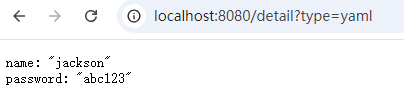

# SpringBoot整合Thymeleaf
## 传统web应用和前后端分离
如果你是做前后端分离的项目，这一章节的内容将用不上。

现代开发大部分应用都会采用前后端分离的方式进行开发，前端是一个独立的系统，后端也是一个独立的系统，后端系统只给前端系统提供数据（JSON数据），不需要后端解析模板页面，前端系统拿到后端提供的数据之后，前端负责填充数据即可。因此这一章节内容作为了解。

传统的WEB应用（非前后端分离）：浏览器页面上展示成什么效果，后端服务器说了算，这是传统web应用最大的特点。

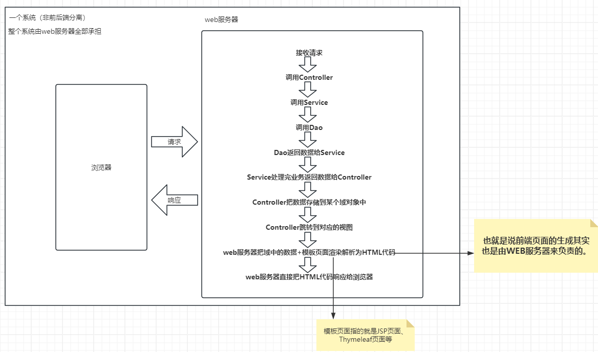

前后端分离的应用：前端是一个独立的系统，后端也是一个独立的系统，后端系统不再负责页面的渲染，后端系统只负责给前端系统提供开放的API接口，后端系统只负责数据的收集，然后将数据以JSON/XML等格式响应给前端系统。前端系统拿到接口返回的数据后，将数据填充到页面上。


前后端分离的好处：

+ 职责清晰：前端专注于用户界面和用户体验，后端专注于业务逻辑和数据处理。
+ 开发效率高：前后端可以并行开发，互不影响，提高开发速度。
+ 可维护性强：代码结构更清晰，便于维护和扩展。
+ 技术栈灵活：前后端可以独立选择最适合的技术栈。
+ 响应式设计：前端可以更好地处理不同设备和屏幕尺寸。
+ 性能优化：前后端可以独立优化，提升整体性能。
+ 易于测试：前后端接口明确，便于单元测试和集成测试。

## SpringBoot整合Thymeleaf
Java的模板技术有很多，SpringBoot支持以下的模板技术：

1. **Thymeleaf**：
    - **特点**：Thymeleaf 是一个现代的服务器端Java模板引擎，它支持HTML5，XML，TEXT，JAVASCRIPT，CSS等多种模板类型。它能够在浏览器中预览，这使得前端开发更加便捷。Thymeleaf 提供了一套强大的表达式语言，可以轻松地处理数据绑定、条件判断、循环等。
    - **优势**：**\<font style="color:#DF2A3F;"\>与Spring框架集成良好，也是SpringBoot官方推荐的\</font\>**。
2. **FreeMarker**：
    - **特点**：FreeMarker 是一个用Java编写的模板引擎，主要用来生成文本输出，如HTML网页、邮件、配置文件等。它不依赖于Servlet容器，可以在任何环境中运行。
    - **优势**：模板语法丰富，灵活性高，支持宏和函数定义，非常适合需要大量定制化的项目。
3. **Velocity**：
    - **特点**：Velocity 是另一个强大的模板引擎，最初设计用于与Java一起工作，但也可以与其他技术结合使用。它提供了简洁的模板语言，易于学习和使用。
    - **优势**：轻量级，性能优秀，特别适合需要快速生成静态内容的应用。
4. **Mustache**：
    - **特点**：Mustache 是一种逻辑无感知的模板语言，可以用于多种编程语言，包括Java。它的设计理念是让模板保持简单，避免模板中出现复杂的逻辑。
    - **优势**：逻辑无感知，确保模板的简洁性和可维护性，易于与前后端开发人员协作。
5. **Groovy Templates**：
    - **特点**：Groovy 是一种基于JVM的动态语言，它可以作为模板引擎使用。Groovy Templates 提供了非常灵活的模板编写方式，可以直接嵌入Groovy代码。
    - **优势**：对于熟悉Groovy语言的开发者来说，使用起来非常方便，可以快速实现复杂逻辑。

这些模板技术各有千秋，选择哪一种取决于项目的具体需求和个人偏好。Spring Boot 对这些模板引擎都提供了良好的支持，通常只需要在项目中添加相应的依赖，然后按照官方文档配置即可开始使用。

\<font style="color:#DF2A3F;"\>提醒：SpringBoot内嵌了Servlet容器（例如：Tomcat、Jetty等），使用SpringBoot不太适合使用JSP模板技术，因为SpringBoot项目最终打成jar包之后，放在jar包中的jsp文件不能被Servlet容器解析。\</font\>

要在SpringBoot中整合Thymeleaf，按照以下步骤操作：

第一步：引入thymeleaf启动器

```xml
<dependency>
  <groupId>org.springframework.boot</groupId>
  <artifactId>spring-boot-starter-thymeleaf</artifactId>
</dependency>
```

第二步：编写配置文件，指定前缀和后缀（**\<font style="color:#DF2A3F;"\>默认不配置就是以下配置\</font\>**）

```properties
spring.thymeleaf.prefix=classpath:/templates/
spring.thymeleaf.suffix=.html
```

第三步：编写控制器

```java
package com.powernode.springboot.controller;

import org.springframework.stereotype.Controller;
import org.springframework.ui.Model;
import org.springframework.web.bind.annotation.GetMapping;
import org.springframework.web.bind.annotation.RequestParam;

// 不能使用 @RestController
@Controller
public class HelloController {

    @GetMapping("/h")
    public String helloThymeleaf(@RequestParam("name") String name, Model model) {
        // 将接收到的name数据存储到域对象中
        model.addAttribute("name", name);
        // 逻辑视图名
        return "hello"; // 最终的物理视图名：classpath:/templates/hello.html
    }
}
```

第四步：编写thymeleaf模板页面

```html
<!DOCTYPE html>
<html lang="en">
<head>
    <meta charset="UTF-8">
    <title>hello, thymeleaf</title>
</head>
<body>
<h1>hello,<span th:text="${name}"></span></h1>
</body>
</html>
```

启动服务器，测试地址为：http://localhost:8080/h


## Thymeleaf的自动配置
Thymeleaf的自动配置类：`ThymeleafAutoConfiguration`

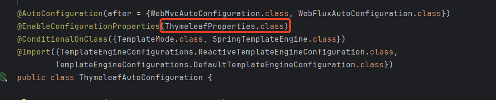

我们通过查看上图中红框中的类，可以找到thymeleaf的相关配置：

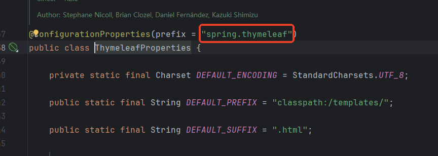

与thymeleaf相关的配置统一使用`spring.thymeleaf`即可。并且通过源码可以进一步了解到默认的前缀和后缀：

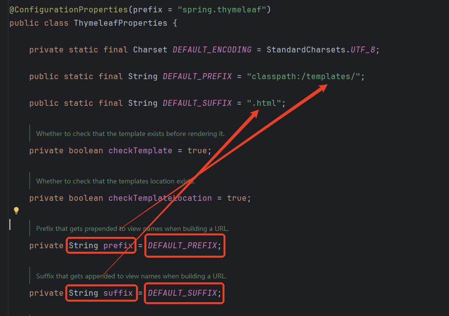

也就是说，默认情况下，只要放在`classpath:/templates/`目录下的`xxx.html`会被自动当做为thymeleaf的模板文件被thymeleaf模板引擎解析。因此放在`classpath:/templates/`目录下的`html`文件不是静态页面，而是动态的thymeleaf模板页面。

## Thymeleaf核心语法
### th:text 替换标签体内容
注意：在根标签\<html\>中引入 xmlns:th="[http://www.thymeleaf.org"](http://www.thymeleaf.org")，在编写`th:`语法时有智能提示。

`th:text`用来替换标签体内容的，例如：

```html
th:text 语法：替换标签体中的内容
<div th:text="${name}">我是一个DIV</div>
```

运行效果：

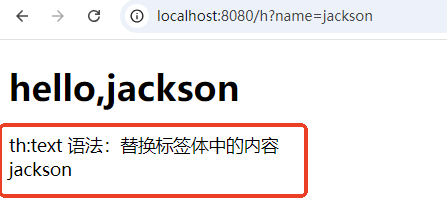

提示：标签体中的内容即使是一段HTML代码，也只是会被当做普通文本对待。例如我们让存储在域中的文本内容是一段HTML代码：

```java
model.addAttribute("htmlCode", "<a href='http://www.bjpowernode.com'>动力节点</a>");
```

```html
<div th:text="${htmlCode}">我是一个DIV</div>
```

测试结果：

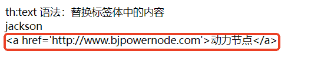

### th:utext 替换标签体内容
作用和 `th:text`一样。只不过`th:utext`会将内容当做一段HTML代码解析并替换。将以上测试代码修改为：

```html
th:utext 语法：替换标签体中的内容
<div th:utext="${htmlCode}">我是一个DIV</div>
```

测试结果：

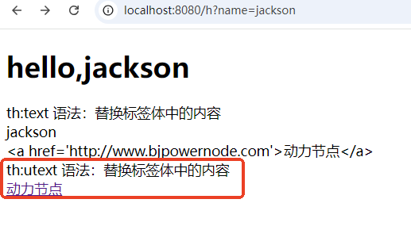

### th:任意属性名 动态替换该属性的值
例如：我们向域中存储以下数据

```java
// 向域中存储一个html标签的某个属性的值
model.addAttribute("company", "动力节点");
model.addAttribute("hrefValue", "http://www.bjpowernode.com");
```

然后使用`th:href`动态替换`href`属性的值：

```html
th:任意属性名 语法：动态替换属性值
<a th:href="${hrefValue}" href="https://www.baidu.com" th:text="${company}">百度</a>
```

测试结果：


### th:attr 属性合并设置
+ 分开设置：

```java
model.addAttribute("hrefValue", "http://www.bjpowernode.com");
model.addAttribute("style", "color:red");
```

```html
<a th:href="${hrefValue}" th:style="${style}">动力节点</a>
```

测试结果：


+ 合并设置：使用`th:attr`

```java
model.addAttribute("hrefValue", "http://www.bjpowernode.com");
model.addAttribute("style", "color:red");
```

```html
<a th:attr="href=${hrefValue},style=${style}">动力节点</a>
```

### th:指令
指令非常多，具有代表性的例如：`th:if`，该指令用来控制元素`隐藏`和`显示`。

在`static`静态资源目录下存放一张图片：dog1.jpg

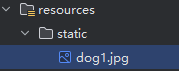

然后编写这样的模板代码：

```html

```

测试结果，图片是显示的：


如果`th:if`的值修改为`false`，我们会发现隐藏了。

### @{} 表达式
`${}`表达式语法是专门用来获取`model`中绑定的数据的。

`@{}`表达式语法是专门用来维护URL请求路径的。它可以动态设置项目的根路径。

SpringBoot中默认的项目根路径是：`/`

假设我们编写这样的java代码，向model中绑定一个路径：

```java
model.addAttribute("imgUrl", "/dog1.jpg");
```

我们编写这样的模板代码：

```html

```

测试结果：

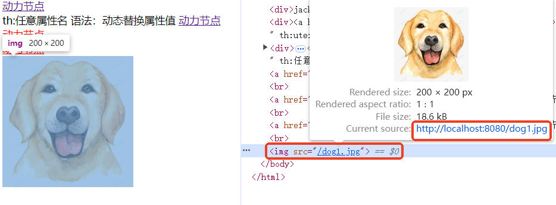

此时是可以正常显示的，但如果我们将web应用的根路径进行了修改，将其配置为：`/myweb`

```properties
server.servlet.context-path=/myweb
```

其他位置代码不做修改，我们再来访问页面，注意访问路径中要添加`/myweb`，例如：[http://localhost:8080/myweb/h?name=jackson](http://localhost:8080/myweb/h?name=jackson)

访问后使用`ctrl + F5`强行刷新，不走浏览器缓存，结果发现无法访问到该图片：


此时我们将模板代码进行如下修改，将`${}`修改为`@{}`：

```html

```

再次测试：


### thymeleaf的内置工具
内置工具很多，可以参考官方文档：[https://www.thymeleaf.org/doc/tutorials/3.1/usingthymeleaf.html#strings](https://www.thymeleaf.org/doc/tutorials/3.1/usingthymeleaf.html#strings)

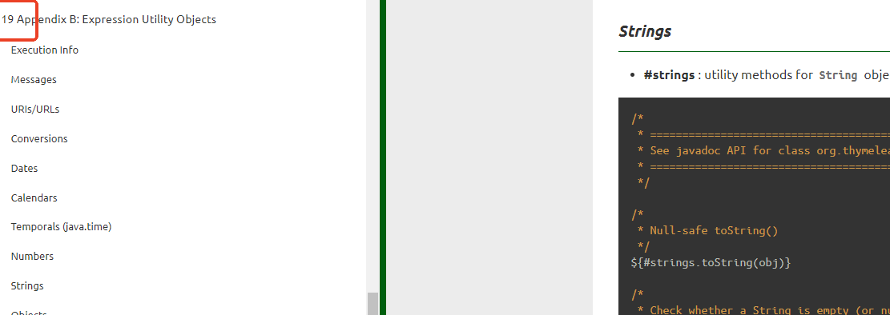

例如我们要完成这样一个效果，用户提交用户名时，如果名字中含有`jack`则显示`狗狗图片`，否则不显示。

模板代码如下：

```html

```

测试结果1：

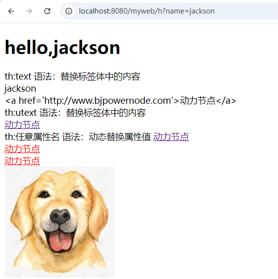

测试结果2：

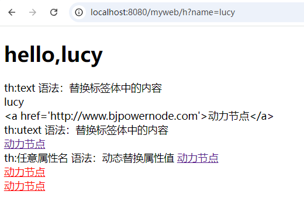

### thymeleaf也支持运算符
例如`>`运算符，我们实现这样一个功能，如果提供的用户名长度大于6，则显示狗狗图片：

```html
 6}">
```

测试结果1：

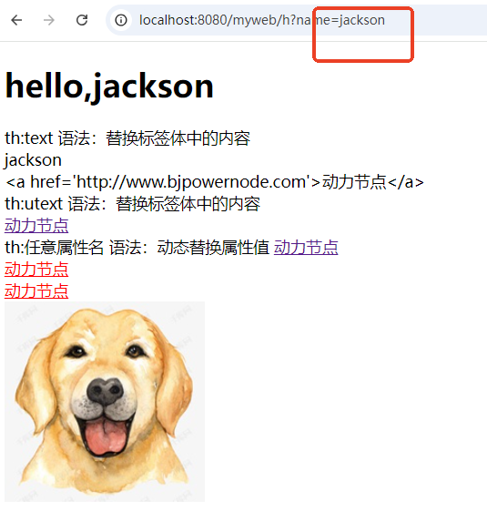

测试结果2：

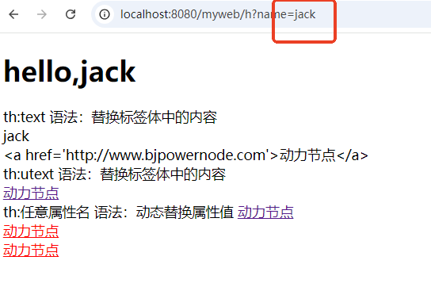

另外thymeleaf也支持三目运算符：

```html
<span th:text="${user.gender ? '男' : '女'}"></span>
```

如果性别是true，则显示男，false，则显示女。

还有很多其他的运算符，可参考thymeleaf官方文档。

### thymeleaf的字符串拼接
第一种方式：使用加号 `+`

```html
<div th:text="${'姓名：' + name + '，年龄：18'}"></div>
```

测试结果：


第二种方式：使用竖线 `||`

```html
<div th:text="|姓名：${name}，年龄：18|"></div>
```


### 循环遍历
代码示例：

```html
<tr th:each="user : ${users}">
  <td th:text="${user.name}"></td>
  <td th:text="${user.age}"></td>
  <td th:text="${user.gender}"></td>
  <td th:text="${user.desc}"></td>
  <td th:text="${user.location}"></td>
</tr>
```

说明：

+ ${users}：代表集合
+ user：代表集合中的每个元素
+ ${user.name}：元素的name属性值

遍历时也可以添加状态对象，代码示例：

```html
<tr th:each="user,state : ${userList}">
    <td th:text="${state.count}">1</td>
    <td th:text="${user.name}">张三</td>
    <td th:text="${user.age}">20</td>
    <td th:text="${user.gender}"></td>
    <td th:text="${user.desc}"></td>
    <td th:text="${user.location}"></td>
    <td>
        thymeleaf的内联表达式：<br>
        下标：[[${state.index}]]<br>
        序号：[[${state.count}]]<br>
        当前对象：[[${state.current}]]<br>
        元素总数：[[${state.size}]]<br>
        是否为偶数行：[[${state.even}]]<br>
        是否为奇数行：[[${state.odd}]]<br>
        是否第一个元素：[[${state.first}]]<br>
        是否最后一个元素：[[${state.last}]]<br>
    </td>
</tr>
```

注意：以上`[[${state.index}]]`这种语法属于thymeleaf中的`内联表达式`写法。也可以写成：`[(${state.index})]`

另外，状态对象`state`的属性包括：

+ index：下标
+ count：序号
+ current：当前对象
+ size：元素总数
+ even：是否为偶数行
+ odd：是否为奇数行
+ first：是否为第一个元素
+ last：是否为最后一个元素

### 条件判断th:if
th:if 语法用来决定元素是否显示：true显示。false隐藏。

\<div th:if="true"\>我是一个div元素\</div\>，则显示该div

\<div th:if="false"\>我也是一个div元素\</div\>，则隐藏该div

实现这样一个功能：用户如果没有留下简介，则显示`你比较懒没有留下任何介绍信息`，如果留下了简介，则显示具体的简介信息。

```html
<td th:if="${#strings.isEmpty(user.desc)}" th:text="'你比较懒没有留下任何介绍信息'"></td>
<td th:if="${not #strings.isEmpty(user.desc)}" th:text="${user.desc}"></td>
```

### 条件判断th:switch
实现一个这样的功能：如果城市编号001则显示北京，002则显示上海，003则显示广州，004则显示深圳，其他值显示未知。

```html
<td th:switch="${user.location}">
  <span th:case="001">北京</span>
  <span th:case="002">上海</span>
  <span th:case="003">广州</span>
  <span th:case="004">深圳</span>
  <span th:case="*">未知</span>
</td>
```

### thymeleaf属性优先级
thymeleaf的属性优先级非常重要，因为它直接决定了模板的解析和执行顺序。

以下是Thymeleaf属性的优先级从高到低的列表，以表格形式展示：

| 优先级 | 属性 | 描述 |
| --- | --- | --- |
| 1 | `th:if` | 如果条件为真，则渲染该元素。 |
| 2 | `th:unless` | 如果条件为假，则渲染该元素。 |
| 3 | `th:with` | 定义局部变量。 |
| 4 | `th:switch` | 开始一个 switch 语句。 |
| 5 | `th:case` | 定义 switch 语句中的 case 分支。 |
| 6 | `th:each` | 遍历列表，用于循环。 |
| 7 | `th:remove` | 移除元素或其属性。 |
| 8 | `th:attr` | 设置或修改元素的属性。 |
| 9 | `th:classappend` | 追加 CSS 类。 |
| 10 | `th:styleappend` | 追加内联样式。 |
| 11 | `th:src` | 设置元素的 `src` 属性。 |
| 12 | `th:href` | 设置元素的 `href` 属性。 |
| 13 | `th:value` | 设置元素的 `value` 属性。 |
| 14 | `th:text` | 设置元素的文本内容。 |
| 15 | `th:utext` | 设置元素的未转义文本内容。 |
| 16 | `th:html` | 设置元素的 HTML 内容。 |
| 17 | `th:fragment` | 定义模板片段。 |
| 18 | `th:insert` | 插入一个模板片段。 |
| 19 | `th:replace` | 替换当前元素为一个模板片段。 |
| 20 | `th:include` | 包含一个模板片段的内容。 |
| 21 | `th:block` | 用于逻辑分组，不产生任何HTML输出。 |

对于thymeleaf属性优先级，我总结了以下一段话，把它记住即可：

**“先控制，再遍历，后操作，末内容。”**

具体来说：

1. **先控制**：`th:if` 和 `th:unless` 用于条件控制，决定是否渲染元素。
2. **再遍历**：`th:each` 用于遍历列表，生成多个元素。
3. **后操作**：`th:with`、`th:switch`、`th:case`、`th:remove`、`th:attr` 等用于局部变量定义、条件分支、属性操作等。
4. **末内容**：`th:text`、`th:utext`、`th:html` 等用于设置元素的内容。

### *{...} 表达式
`*{...}` 主要用于在上下文中访问对象的属性。这种表达式通常在表单处理和对象绑定场景中使用。

**语法**：`*{property}`：访问当前**\<font style="color:#DF2A3F;"\>上下文\</font\>**对象的某个属性。

**使用场景**

+ 表单绑定：在表单中绑定对象的属性。
+ 对象属性访问：在模板中访问对象的属性，特别是当对象是当前上下文的一部分时。

**示例**

1. **表单绑定**

假设你有一个 `User` 对象，包含 `name` 和 `age` 属性，你可以在表单中使用 `*{...}` 表达式来绑定这些属性：

```html
<form th:object="${user}" method="post" action="/submit">
    <label for="name">Name:</label>
    <input type="text" id="name" name="name" th:field="*{name}" /> 
    <label for="age">Age:</label>
    <input type="number" id="age" name="age" th:field="*{age}" />
    <button type="submit">Submit</button>
</form>
```

在这个例子中：

+ `th:object="${user}"` 将 `user` 对象设置为当前上下文对象。
+ `th:field="*{name}"` 和 `th:field="*{age}"` 分别绑定到 `user` 对象的 `name` 和 `age` 属性。

2. **对象属性访问**

假设你有一个 `User` 对象，包含 `name` 和 `age` 属性，你可以在模板中使用 `*{...}` 表达式来访问这些属性：

```html
<div th:object="${user}">
    <p>Name: <span th:text="*{name}">Default Name</span></p>
    <p>Age: <span th:text="*{age}">Default Age</span></p>
</div>

```

在这个例子中：

+ `th:object="${user}"` 将 `user` 对象设置为当前上下文对象。
+ `*{name}` 和 `*{age}` 分别访问 `user` 对象的 `name` 和 `age` 属性。

**与 **`**${...}**`** 的区别**

+ `${...}`：标准表达式，用于访问模型中的变量和执行简单的表达式。
+ `*{...}`：属性选择表达式，用于在上下文中访问对象的属性，通常与 `th:object` 一起使用。

### 代码片段共享
片段是Thymeleaf中用于代码复用的基本机制。你可以将共享的部分提取到单独的HTML文件中，然后在其他模板中引用这些片段。

页面中公共的header.html

```html
<header th:fragment="h">
    <nav>
        <ul>
            <li><a th:href="@{/a}">Home</a></li>
            <li><a th:href="@{/b}">About</a></li>
        </ul>
    </nav>
</header>
```

页面中公共的footer.html

```html
<footer th:fragment="f">
  <p>&copy; 2024 北京动力节点</p>
</footer>
```

在`a.html`中包含以上两个公共部分：

```html
<!DOCTYPE html>
<html xmlns:th="http://www.thymeleaf.org">
<head>
    <title>主页</title>
</head>
<body>
<div th:replace="~{header :: h}"></div>

<main>
    <h1>欢迎来到主页</h1>
    <p>这是主页的主要内容.</p>
</main>

<div th:replace="~{footer :: f}"></div>
</body>
</html>
```

在`b.html`中包含以上两个公共部分：

```html
<!DOCTYPE html>
<html xmlns:th="http://www.thymeleaf.org">
<head>
    <title>关于我们</title>
</head>
<body>

<div th:replace="~{header :: h}"></div>

<main>
    <h1>关于我们</h1>
    <p>动力节点专注IT培训16年.</p>
</main>

<div th:replace="~{footer :: f}"></div>
</body>
</html>
```

主要作用是代码复用。实现此功能的主要代码：

+ 在公共代码部分使用`th:fragment="片段名称"`来声明公共代码片段的名字。
+ 在需要引入的地方使用`th:replace="~{文件名去掉后缀 :: 片段名称}"`来引入。

**\<font style="color:#DF2A3F;"\>小插曲：在springboot中如何实现：直接将请求路径映射到特定的视图，而不需要编写controller？\</font\>**

+ 第一步：视图解析器配置

```properties
spring.mvc.view.prefix=/templates/
spring.mvc.view.suffix=.html
```

+ 第二步：使用`ViewControllerRegistry`进行视图与控制器的注册

```java
package com.powernode.springboot.config;

import org.springframework.context.annotation.Configuration;
import org.springframework.web.servlet.config.annotation.ViewControllerRegistry;
import org.springframework.web.servlet.config.annotation.WebMvcConfigurer;

@Configuration
public class WebMvcConfig implements WebMvcConfigurer {

    @Override
    public void addViewControllers(ViewControllerRegistry registry) {
        registry.addViewController("/a").setViewName("a");
        registry.addViewController("/b").setViewName("b");
    }
}

```

## thymeleaf页面修改如何立即生效
第一步：引入springboot提供的`dev tools`

```xml
<dependency>
  <groupId>org.springframework.boot</groupId>
  <artifactId>spring-boot-devtools</artifactId>
  <scope>runtime</scope>
  <optional>true</optional>
</dependency>
```

第二步：关闭应用重启功能，如果不关闭会导致每一次修改java代码后立即重启应用，不建议。我们现在只希望做到的功能是，修改thymeleaf模板文件后立即生效。

```properties
spring.devtools.restart.enabled=false
```

第三步：修改代码后在IDEA中按组合键`ctrl+f9`

以上三步配合即可。

# 异常处理
在controller层如果程序出现了异常，并且这个异常未被捕获，springboot提供的异常处理机制将生效。

Spring Boot 提供异常处理机制主要是为了提高应用的健壮性和用户体验。它的好处包括：

1. **统一错误响应**：可以定义全局异常处理器来统一处理各种异常，确保返回给客户端的错误信息格式一致，便于前端解析。
2. **提升用户体验**：能够优雅地处理异常情况，避免直接将技术性错误信息暴露给用户，而是显示更加友好的提示信息。
3. **简化代码**：开发者不需要在每个可能抛出异常的方法中重复编写异常处理逻辑，减少冗余代码，使业务代码更加清晰简洁。
4. **增强安全性**：通过控制异常信息的输出，防止敏感信息泄露，增加系统的安全性。

## 自适应的错误处理机制
springboot会根据请求头的Accept字段来决定错误的响应格式。

这种机制的好处就是：客户端设备自适应，提高用户的体验。


## SpringMVC的错误处理方案
**\<font style="color:#DF2A3F;"\>重点：如果程序员使用了SpringMVC的错误处理方案，SpringBoot的错误处理方案不生效。\</font\>**

### 局部控制 @ExceptionHandler
在控制器当中编写一个方法，方法使用@ExceptionHandler注解进行标注，凡是**这个控制器**当中出现了**对应的异常**，则走这个方法来进行异常的处理。局部生效。

```java
package com.powernode.test.controller;

import org.springframework.web.bind.annotation.ExceptionHandler;
import org.springframework.web.bind.annotation.GetMapping;
import org.springframework.web.bind.annotation.PathVariable;
import org.springframework.web.bind.annotation.RestController;

@RestController
public class UserController {

    @GetMapping("/resource/{id}")
    public String getResource(@PathVariable Long id){
        if(id == 1){
            throw new IllegalArgumentException("无效ID：" + id);
        }
        return "ID = " + id;
    }

    @ExceptionHandler(IllegalArgumentException.class)
    public String handler(IllegalArgumentException e){
        return "错误信息：" + e.getMessage();
    }
}

```

可以再编写一个OtherController，让它也发生`IllegalArgumentException`异常，看看它会不会走局部的错误处理机制。

```java
package com.powernode.test.controller;

import org.springframework.web.bind.annotation.GetMapping;
import org.springframework.web.bind.annotation.PathVariable;
import org.springframework.web.bind.annotation.RestController;

@RestController
public class OtherController {
    @GetMapping("/resource2/{id}")
    public String getResource(@PathVariable Long id){
        if(id == 1){
            throw new IllegalArgumentException("无效ID：" + id);
        }
        return "ID = " + id;
    }
}

```

通过测试，确实局部生效。

### 全局控制 @ControllerAdvice + @ExceptionHandler
也可以把以上局部生效的方法单独放到一个类当中，这个类使用@ControllerAdvice注解标注，凡是**任何控制器**当中出现了**对应的异常**，则走这个方法来进行异常的处理。全局生效。

将之前的局部处理方案的代码注释掉。使用全局处理方式，编写以下类：

```java
package com.powernode.test.controller;

import org.springframework.web.bind.annotation.ControllerAdvice;
import org.springframework.web.bind.annotation.ExceptionHandler;
import org.springframework.web.bind.annotation.ResponseBody;

@ControllerAdvice
public class GlobalExceptionHandler {

    @ExceptionHandler(IllegalArgumentException.class)
    @ResponseBody
    public String handler(IllegalArgumentException e){
        return "错误信息：" + e.getMessage();
    }
}

```

通过测试，确实全局生效。

## SpringBoot的错误处理方案
**\<font style="color:#DF2A3F;"\>重点：如果SpringMVC没有对应的处理方案，会开启SpringBoot默认的错误处理方案。\</font\>**

SpringBoot默认的错误处理方案如下：

1. 如果客户端要的是json，则直接响应json格式的错误信息。
2. 如果客户端要的是html页面，则按照下面方案：
+ 第一步（精确错误码文件）：去`classpath:/templates/error/`目录下找`404.html``500.html`等`精确错误码.html`文件。如果找不到，则去静态资源目录下的/error目录下找。如果还是找不到，才会进入下一步。
+ 第二步（模糊错误码文件）：去`classpath:/templates/error/`目录下找`4xx.html``5xx.html`等`模糊错误码.html`文件。如果找不到，则去静态资源目录下的/error目录下找。如果还是找不到，才会进入下一步。
+ 第三步（通用错误页面）：去找`classpath:/templates/error.html`如果找不到则进入下一步。
+ 第四步（默认错误处理）：如果上述所有步骤都未能找到合适的错误页面，Spring Boot 会使用内置的默认错误处理机制，即 `/error` 端点。

## 如何在错误页获取错误信息
Spring Boot 默认会在模型Model中放置以下信息：

+ timestamp: 错误发生的时间戳
+ status: HTTP 状态码
+ error: 错误类型（如 "Not Found"）
+ exception: 异常类名
+ message: 错误消息
+ trace: 堆栈跟踪

在thymeleaf中使用 `${message}`即可取出信息。

注意：**\<font style="color:#DF2A3F;"\>springboot3.3.5\</font\>**版本默认只向Model对象中绑定了`timestamp``status``error`。如果要保存`exception``message``trace`，需要开启以下三个配置：

```plain
server.error.include-stacktrace=always
server.error.include-exception=true
server.error.include-message=always
```

## 前后端分离项目的错误处理方案
统一使用SpringMVC的错误处理方案，定义全局的异常处理机制：@ControllerAdvice + @ExceptionHandler

返回json格式的错误信息，其它的就不需要管了，因为前端接收到错误信息怎么处理是他自己的事儿。

## 服务器端负责页面渲染的项目错误处理方案
建议使用SpringBoot的错误处理方案：

1. 如果发生的异常是HTTP错误状态码：
    1. 建议常见的错误码给定`精确错误码.html`
    2. 建议不常见的错误码给定`模糊错误码.html`
2. 如果发生的异常不是HTTP错误状态码，而是业务相关异常：
    1. 在程序中处理具体的业务异常，自己通过程序来决定跳转到哪个错误页面。
3. 建议提供`classpath:/templates/error.html`来处理通用错误。

# 国际化（了解）
在Spring Boot中实现国际化（i18n）是一个常见的需求，它允许应用程序根据用户的语言和地区偏好显示不同的文本。

## 实现国际化
### 第一步：创建资源文件
创建包含不同语言版本的消息文件。这些文件通常放在`src/main/resources`目录下，并且以`.properties`为扩展名。例如：

+ `messages.properties` (默认语言，如英语)
+ `messages_zh_CN.properties` (简体中文)
+ `messages_fr.properties` (法语)

每个文件都应包含相同的消息键，但值应对应于相应的语言。例如：

**messages.properties**:

```properties
welcome.message=Welcome to our application!
```

**messages_zh_CN.properties**:

```properties
welcome.message=欢迎来到我们的应用！
```

**messages_fr.properties**:

```properties
welcome.message=Bienvenue dans notre application !
```

### 第二步：在模板文件中取出消息
语法格式为：#{welcome.message}

```html
<!DOCTYPE html>
<html lang="en" xmlns:th="http://www.thymeleaf.org">
<head>
    <meta charset="UTF-8">
    <title>Title</title>
</head>
<body>
<h1 th:text="#{welcome.message}"></h1>
</body>
</html>
```

**测试1：浏览器默认的语言环境是中文时**


**测试2：将浏览器默认语言环境修改为法文**

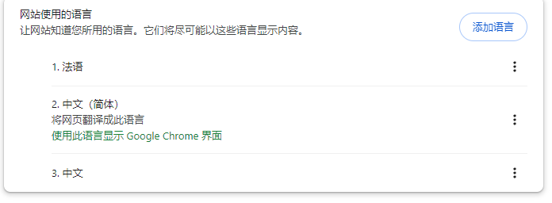


## 国际化实现原理
做国际化的自动配置类是：`MessageSourceAutoConfiguration`

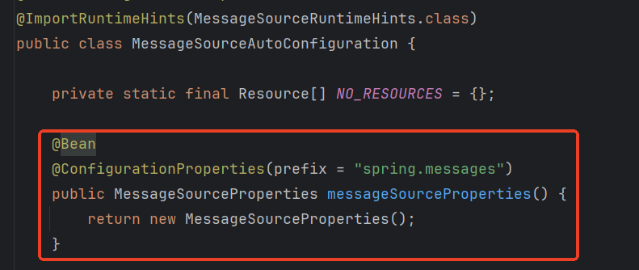

通过以上源码得知，国际化对应的配置前缀是：`spring.message`

例如在`application.properties`中进行如下配置：

```properties
# 配置国际化文件命名的基础名称
spring.messages.basename=messages

# 指定国际化信息的字符编码方式
spring.messages.encoding=UTF-8
```

注意：标准标识符：en_US 和 zh_CN 这样的标识符是固定的，不能更改。可以设置的是basename。

## 在程序当中如何获取国际化信息
在国际化自动配置类中可以看到这样一个Bean：MessageSource，它是专门用来处理国际化的。我们可以将它注入到我们的程序中，然后调用相关方法在程序中获取国际化信息。

```java
@Controller
public class MyController {

    @Autowired
    private MessageSource messageSource;

    @GetMapping("/test")
    @ResponseBody
    public String test(HttpServletRequest request){
        Locale locale = request.getLocale();
        String message = messageSource.getMessage("welcome.message", null, locale);
        return message;
    }
}
```

# 定制web容器
## web服务器切换为jetty
springboot默认嵌入的web服务器是Tomcat，如何切换到jetty服务器？

实现方式：排除Tomcat，添加Jetty依赖

**修改 **`pom.xml`** 文件**：在 `pom.xml` 中，确保你使用 `spring-boot-starter-web` 并排除 Tomcat，然后添加 Jetty 依赖。

```xml
<!-- 排除 Tomcat -->
<dependency>
    <groupId>org.springframework.boot</groupId>
    <artifactId>spring-boot-starter-web</artifactId>
    <exclusions>
        <exclusion>
            <groupId>org.springframework.boot</groupId>
            <artifactId>spring-boot-starter-tomcat</artifactId>
        </exclusion>
    </exclusions>
</dependency>
<!-- 添加 Jetty 依赖 -->
<dependency>
    <groupId>org.springframework.boot</groupId>
    <artifactId>spring-boot-starter-jetty</artifactId>
</dependency>

```

## web服务器切换原理
从哪里可以看出springboot是直接将tomcat服务器嵌入到应用中的呢？看这个类：`ServletWebServerFactoryAutoConfiguration`


以上代码显示嵌入的是3个服务器。但并不是都生效，我们来看一下生效条件：

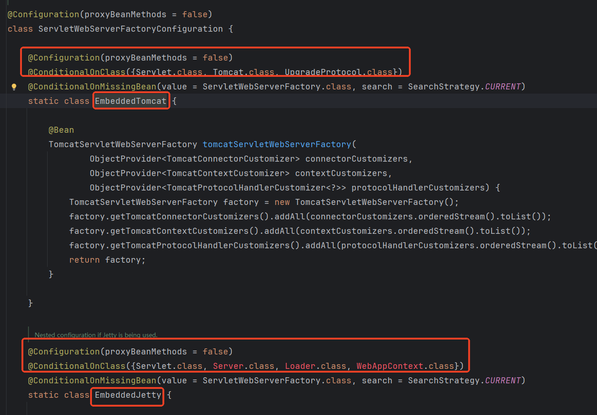

生效条件是，看类路径当中是否有对应服务器相关的类，如果有则生效。`spring-boot-web-starter`这个web启动器引入的时候，大家都知道，它间接引入的是tomcat服务器的jar包。因此默认Tomcat服务器被嵌入。如果想要切换web服务器，将tomcat相关jar包排除掉，引入jetty的jar包之后，jetty服务器就会生效，这就是切换web服务器的原理。

## web服务器优化
通过以下源码得知，web服务器的相关配置和`ServerProperties`有关系：


查看`ServerProperties`源码：

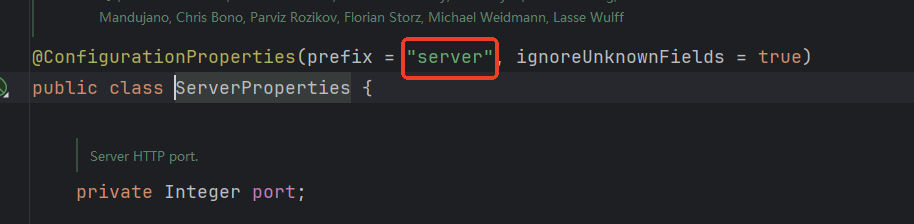

得知web服务器的配置都是以`server`开头的。

那么如果要配置tomcat服务器怎么办？要配置jetty服务器怎么办？请看一下源码

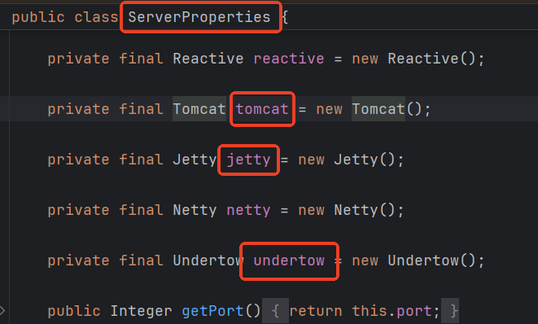

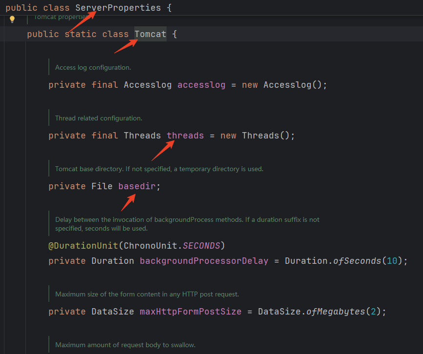

通过以上源码得知，如果要对tomcat服务器进行配置，前缀为：`server.tomcat`

如果要对jetty服务器进行配置，前缀为：`server.jetty`。

在以后的开发中关于tomcat服务器的常见优化配置有：

```properties
# 这个参数决定了 Tomcat 在接收请求时，如果在指定的时间内没有收到完整的请求数据，将会关闭连接。这个超时时间是从客户端发送请求开始计算的。
# 防止长时间占用资源：如果客户端发送请求后，长时间没有发送完所有数据，Tomcat 会在这个超时时间内关闭连接，从而释放资源，避免资源被长时间占用。
server.tomcat.connection-timeout=20000

# 设置 Tomcat 服务器处理请求的最大线程数为 200。
# 如果超过这个数量的请求同时到达，Tomcat 会将多余的请求放入一个等待队列中。
# 如果等待队列也满了（由 server.tomcat.accept-count 配置），新的请求将被拒绝，通常会返回一个“503 Service Unavailable”错误。
server.tomcat.max-threads=200

# 用来设置等待队列的最大容量
server.tomcat.accept-count=100

# 设置 Tomcat 服务器在空闲时至少保持 10 个线程处于活动状态，以便快速响应新的请求。
server.tomcat.min-spare-threads=10

# 允许 Tomcat 服务器在关闭后立即重新绑定相同的地址和端口，即使该端口还在 TIME_WAIT 状态
# 当一个网络连接关闭时，操作系统会将该连接的端口保持在 TIME_WAIT 状态一段时间（通常是 2-4 分钟），以确保所有未完成的数据包都能被正确处理。在这段时间内，该端口不能被其他进程绑定。
server.tomcat.address-reuse-enabled=true

# 设置 Tomcat 服务器绑定到所有可用的网络接口，使其可以从任何网络地址访问。
server.tomcat.bind-address=0.0.0.0

# 设置 Tomcat 服务器使用 HTTP/1.1 协议处理请求。
server.tomcat.protocol=HTTP/1.1

# 设置 Tomcat 服务器的会话(session)超时时间为 30 分钟。具体来说，如果用户在 30 分钟内没有与应用进行任何交互，其会话将被自动注销。
server.tomcat.session-timeout=30

# 设置 Tomcat 服务器的静态资源缓存时间为 3600 秒（即 1 小时），这意味着浏览器会在 1 小时内缓存这些静态资源，减少重复请求。
server.tomcat.resource-cache-period=3600

# 解决get请求乱码。对请求行url进行编码。
server.tomcat.uri-encoding=UTF-8

# 设置 Tomcat 服务器的基础目录为当前工作目录（. 表示当前目录）。这个配置指定了 Tomcat 服务器的工作目录，包括日志文件、临时文件和其他运行时生成的文件的存放位置。 生产环境中可能需要重新配置。
server.tomcat.basedir=.
```

---

## 第6章 SpringBoot实用技术整合

# logo设置
## 关闭logo图标
### 配置方式
```properties
spring.main.banner-mode=off
```

### 代码方式
第一种代码：

```java
@SpringBootApplication
public class Springboot322WebServerApplication {
    public static void main(String[] args) {
        SpringApplication springApplication = new SpringApplication(Springboot322WebServerApplication.class);
        springApplication.setBannerMode(Banner.Mode.OFF);
        springApplication.run(args);
    }
}
```

第二种代码：流式编程/链式编程

```java
new SpringApplicationBuilder()
                .sources(Springboot322WebServerApplication.class)
                .bannerMode(Banner.Mode.OFF)
                .run(args);
```

## 修改logo图标
在`src/main/resources`目录下存放一个`banner.txt`文件。文件名固定。

利用一些网站生成图标：

[https://www.bootschool.net/ascii](https://www.bootschool.net/ascii) （支持中文、英文）

[http://patorjk.com/software/taag/](http://patorjk.com/software/taag/) （只支持英文）

[https://www.degraeve.com/img2txt.php](https://www.degraeve.com/img2txt.php) （只支持图片）

获取图标粘贴到`banner.txt`文件中运行程序即可。

# PageHelper整合
官网地址：[https://pagehelper.github.io/](https://pagehelper.github.io/)

## 引入依赖
```xml
<dependency>
    <groupId>com.github.pagehelper</groupId>
    <artifactId>pagehelper-spring-boot-starter</artifactId>
    <version>2.1.0</version>
</dependency>
```

## 编写代码
```java
@RestController
public class VipController {
    @Autowired
    private VipService vipService;
    
    @GetMapping("/list/{pageNo}")
    public PageInfo<Vip> list(@PathVariable("pageNo") Integer pageNo) {
        // 1.设置当前页码和每页显示的记录条数
        PageHelper.startPage(pageNo, Constant.PAGE_SIZE);
        // 2.获取数据（PageHelper会自动给SQL语句添加limit）
        List<Vip> vips = vipService.findAll();
        // 3.将分页数据封装到PageInfo
        PageInfo<Vip> vipPageInfo = new PageInfo<>(vips);
        return vipPageInfo;
    }
}
```

# web层响应结果封装
对于前后端分离的系统来说，为了降低沟通成本，我们有必要给前端系统开发人员返回统一格式的JSON数据。多数开发团队一般都会封装一个`R`对象来解决统一响应格式的问题。

## 封装R对象
```java
@NoArgsConstructor
@AllArgsConstructor
@Data
@Builder
public class R<T> {

    private int code; // 响应的状态码
    private String msg; // 响应的消息
    private T data; // 响应的数据体

    // 用于构建成功的响应，不携带数据
    public static <T> R<T> OK() {
        return R.<T>builder()
                .code(200)
                .msg("成功")
                .build();
    }

    // 用于构建成功的响应，携带数据
    public static <T> R<T> OK(T data) {
        return R.<T>builder()
                .code(200)
                .msg("成功")
                .data(data)
                .build();
    }

    // 用于构建成功的响应，自定义消息，不携带数据
    public static <T> R<T> OK(String msg) {
        return R.<T>builder()
                .code(200)
                .msg(msg)
                .build();
    }

    // 用于构建成功的响应，自定义消息，携带数据
    public static <T> R<T> OK(String msg, T data) {
        return R.<T>builder()
                .code(200)
                .msg(msg)
                .data(data)
                .build();
    }

    // 用于构建失败的响应，不带任何参数，默认状态码为400，消息为"失败"
    public static <T> R<T> FAIL() {
        return R.<T>builder()
                .code(400)
                .msg("失败")
                .build();
    }

    // 用于构建失败的响应，自定义状态码和消息
    public static <T> R<T> FAIL(int code, String msg) {
        return R.<T>builder()
                .code(code)
                .msg(msg)
                .build();
    }
}

```

## 改进R对象
以上`R`对象存在的问题是，难以维护，项目中可能会出现很多这样的代码：R.FAIL(400, "修改失败")。

引入枚举类型进行改进：

```java
@NoArgsConstructor
@AllArgsConstructor
public enum CodeEnum {

    OK(200, "成功"),
    FAIL(400, "失败"),
    BAD_REQUEST(400, "请求错误"),
    NOT_FOUND(404, "未找到资源"),
    INTERNAL_ERROR(500, "内部服务器错误"),
    MODIFICATION_FAILED(400, "修改失败"),
    DELETION_FAILED(400, "删除失败"),
    CREATION_FAILED(400, "创建失败");

    @Getter
    @Setter
    private int code;
    @Getter
    @Setter
    private String msg;

}
```

改进R：

```java
@NoArgsConstructor
@AllArgsConstructor
@Data
@Builder
public class R<T> {

    private int code; // 响应的状态码
    private String msg; // 响应的消息
    private T data; // 响应的数据体

    // 用于构建成功的响应，不携带数据
    public static <T> R<T> OK() {
        return R.<T>builder()
                .code(CodeEnum.OK.getCode())
                .msg(CodeEnum.OK.getMsg())
                .build();
    }

    // 用于构建成功的响应，携带数据
    public static <T> R<T> OK(T data) {
        return R.<T>builder()
                .code(CodeEnum.OK.getCode())
                .msg(CodeEnum.OK.getMsg())
                .data(data)
                .build();
    }

    // 用于构建失败的响应，不带任何参数，默认状态码为400，消息为"失败"
    public static <T> R<T> FAIL() {
        return R.<T>builder()
                .code(CodeEnum.FAIL.getCode())
                .msg(CodeEnum.FAIL.getMsg())
                .build();
    }

    // 用于构建失败的响应，自定义状态码和消息
    public static <T> R<T> FAIL(CodeEnum codeEnum) {
        return R.<T>builder()
                .code(codeEnum.getCode())
                .msg(codeEnum.getMsg())
                .build();
    }
}

```

# 事务管理
SpringBoot中的事务管理仍然使用的Spring框架中的事务管理机制，在代码实现上更为简单了。不需要手动配置事务管理器，SpringBoot自动配置完成了。我们只需要使用`@Transactional`注解标注需要控制事务的方法即可。另外事务的特性等仍然延用Spring框架。大家可以在老杜发布的Spring视频教程中详细学习事务管理机制。以下代码是在SpringBoot框架中进行的事务控制：

```java
@Transactional(rollbackFor = Exception.class, propagation = Propagation.REQUIRED)
@Service
public class AccountServiceImpl implements AccountService {

    @Autowired
    private AccountMapper accountMapper;

    @Override
    public void transfer(String fromActNo, String toActNo, double money) {
        Account fromAct = accountMapper.selectByActNo(fromActNo);
        if(fromAct.getBalance() < money){
            throw new TransferException("余额不足");
        }
        Account toAct = accountMapper.selectByActNo(toActNo);
        fromAct.setBalance(fromAct.getBalance() - money);
        toAct.setBalance(toAct.getBalance() + money);
        int count = accountMapper.update(fromAct);
        if(1 == 1){
            throw new TransferException("转账失败");
        }
        count += accountMapper.update(toAct);
        if(count != 2){
            throw new TransferException("转账失败！");
        }
    }
}
```

我们只需要在需要控制事务的方法上，或者类上，使用`@Transactional`注解进行标注即可。然后事务的特性和之前Spring中是完全相同的。最重要的是其他的配置我们一律是不需要的。

# SpringBoot打war包
第一步：将打包方式设置为war

```xml
<packaging>war</packaging>
```

第二步：排除内嵌tomcat

```xml
<dependency>
    <groupId>org.springframework.boot</groupId>
    <artifactId>spring-boot-starter-web</artifactId>
    <!--内嵌的tomcat服务器排除掉-->
    <exclusions>
        <exclusion>
            <groupId>org.springframework.boot</groupId>
            <artifactId>spring-boot-starter-tomcat</artifactId>
        </exclusion>
    </exclusions>
</dependency>
```

第三步：添加servlet api依赖（引入tomcat，但scope设置为provided，这样这个tomcat服务器就不会打入war包了）

```xml
<!--额外添加一个tomcat服务器，实际上是为了添加servlet api。scope设置为provided表示这个不会被打入war包当中。-->
<dependency>
    <groupId>org.springframework.boot</groupId>
    <artifactId>spring-boot-starter-tomcat</artifactId>
    <scope>provided</scope>
</dependency>
```

第四步：修改主类

```java
@MapperScan(basePackages = "com.powernode.transaction.repository")
@SpringBootApplication
public class Springboot324TransactionApplication extends SpringBootServletInitializer{

    @Override
    protected SpringApplicationBuilder configure(SpringApplicationBuilder application) {
        return application.sources(Springboot324TransactionApplication.class);
    }

    public static void main(String[] args) {
        SpringApplication.run(Springboot324TransactionApplication.class, args);
    }

}
```

第五步：执行package命令打war包

第六步：配置tomcat环境，将war包放入到webapps目录下，启动tomcat服务器，并访问。

