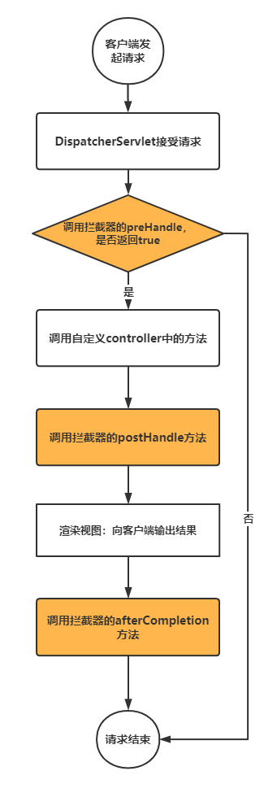
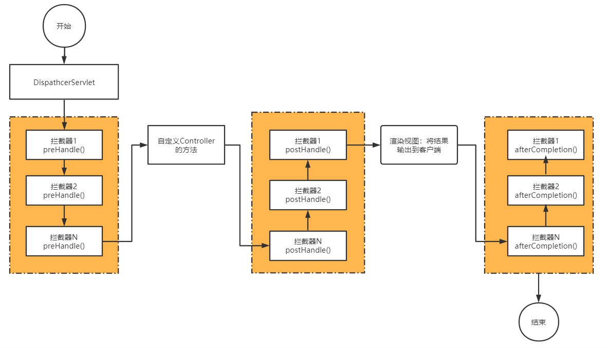

# Spring MVC

## MVC概念

MVC是一种软件架构的思想，将软件按照模型、视图、控制器来划分。

M：Model，模型层，指工程中的JavaBean，作用是处理数据。JavaBean分为两类：一类称为实体类Bean：专门存储业务数据的，如Student，User等。一类称为业务处理Bean：指Service或Dao对象，专门用于处理业务逻辑和数据访问。

V：View，视图层，指工程中的html或jsp等页面，作用是与用户进行交互，展示数据。

C：Controller，控制层，指工程中的servlet，作用是接收请求和响应浏览器。

MVC的工作流程：用户通过视图层发送请求到服务器，在服务器中请求被Controller接收，Controller调用相应的Model层处理请求，处理完毕将结果返回到Controller，Controller再根据请求处理的结果找到相应的View视图，渲染数据后最终响应给浏览器。

## SpringMVC的特点

- Spring家族原生产品，与IOC容器等基础设施无缝对接
- 基于原生的Servlet，通过功能强大的前端控制器DispatcherServlet，对请求和响应进行统一处理
- 表述层各细分领域需要解决的问题全方位覆盖，提供全面解决方案
- 代码清新简洁，大幅度提升开发效率
- 内部组件化程度高，可插拔式组件即插即用，想要什么功能配置相应组件即可
- 性能卓著，尤其适合现代大型、超大型互联网项目要求

## web.xml配置

```xml
<?xml version="1.0" encoding="UTF-8"?>
<web-app xmlns="http://xmlns.jcp.org/xml/ns/javaee"
         xmlns:xsi="http://www.w3.org/2001/XMLSchema-instance"
         xsi:schemaLocation="http://xmlns.jcp.org/xml/ns/javaee http://xmlns.jcp.org/xml/ns/javaee/web-app_4_0.xsd"
         version="4.0">
    <!--
         声明springmvc核心配置对象：DispatcherServlet,这是一个servlet
         这个servlet的url-parttern配置的是：*.do
         表示以.do结尾的请求都发送给DispatcherServlet这个servlet去处理
     -->
    <servlet>
        <servlet-name>springmvc</servlet-name>
        <servlet-class>org.springframework.web.servlet.DispatcherServlet</servlet-class>
        <init-param>
            <!-- contextConfigLocation 用来指定springmvc配置文件的位置，文件名称不一定要交springmvc，大家可以随意起名 -->
            <param-name>contextConfigLocation</param-name>
            <param-value>classpath:springmvc.xml</param-value>
        </init-param>
        <!-- load-on-startup：表示web容器启动的时，当前对象创建的顺序，值越小初始化越早，大于等于0 -->
        <load-on-startup>0</load-on-startup>
    </servlet>
    <servlet-mapping>
        <servlet-name>springmvc</servlet-name>
        <url-pattern>*.do</url-pattern>
    </servlet-mapping>
</web-app>
```

## springmvc.xml配置

```xml
<?xml version="1.0" encoding="UTF-8"?>
<beans xmlns="http://www.springframework.org/schema/beans"
       xmlns:xsi="http://www.w3.org/2001/XMLSchema-instance"
       xmlns:context="http://www.springframework.org/schema/context"
       xsi:schemaLocation="http://www.springframework.org/schema/beans http://www.springframework.org/schema/beans/spring-beans.xsd http://www.springframework.org/schema/context https://www.springframework.org/schema/context/spring-context.xsd">
    <!-- springmvc容器（也就是一个spring容器）会扫描指定包中的组件，将其注册到springmvc容器中 -->
    <context:component-scan base-package="com.javacode2018.springmvcseries.chat01"/>
</beans>
```

手动配置需要注入的bean

```xml
<bean id="viewResolver" class="org.thymeleaf.spring5.view.ThymeleafViewResolver">
    <property name="order" value="1"/>
    <property name="characterEncoding" value="UTF-8"/>
    <property name="templateEngine">
        <bean class="org.thymeleaf.spring5.SpringTemplateEngine">
            <property name="templateResolver">
                <bean class="org.thymeleaf.spring5.templateresolver.SpringResourceTemplateResolver">
                    <!-- 视图前缀 -->
                    <property name="prefix" value="/WEB-INF/templates/"/>
                    <!-- 视图后缀 -->
                    <property name="suffix" value=".html"/>
                    <property name="templateMode" value="HTML5"/>
                    <property name="characterEncoding" value="UTF-8" />
                </bean>
            </property>
        </bean>
    </property>
</bean>
```

## @Controller

用来标注在类上，表示这个类是一个控制器类，可以用来处理http请求，通常会和@RequestMapping一起使用。

源码如下，这个注解上面有@Component注解，说明被@Controller标注的类会被注册到spring容器中，value属性用来指定这个bean的名称，也可以不指定，由容器自动生成

```java
@Target({ElementType.TYPE})
@Retention(RetentionPolicy.RUNTIME)
@Documented
@Component
public @interface Controller {
    @AliasFor(annotation = Component.class)
    String value() default "";
}
```

## @RequestMapping

表示请求映射，一般用在我们自定义的Controller类上或者Controller内部的方法上。

通过这个注解指定配置一些规则，满足这些规则的请求会被标注了@RequestMapping的方法处理

@RequestMapping包含了8个属性，这些属性都是用来配置规则的

```java
@Target({ElementType.TYPE, ElementType.METHOD})
@Retention(RetentionPolicy.RUNTIME)
@Documented
@Mapping
public @interface RequestMapping {
    String name() default "";
    @AliasFor("path")
    String[] value() default {};
    @AliasFor("value")
    String[] path() default {};
    RequestMethod[] method() default {};
    String[] params() default {};
    String[] headers() default {};
    String[] produces() default {};
}
```

当springmvc容器启动时，会扫描标注有@Controller注解的类，将这些Controller中标注有@RequestMapping的方法收集起来，得到一个Map<@RequestMapping,Method>（@RequestMapping和方法的映射），当一个请求到达DispatcherServlet的时候，其内部会根据请求的信息（url、参数、header、请求的类型【通过头中的Content-type指定】、可以接受的类型【可以通过头中的Accept指定】）去这个Map中和@RequestMapping中的规则进行匹配，从而得到可以处理这个请求的方法，然后进行调用，所有的@RequestMapping都匹配失败的时候，会返回404

@RequestMapping支持6种规则，这些规则都是通过@RequestMapping中的属性进行配置的，多个属性的值是AND关系

### 1. 通过value、path来限制请求地址

这几个属性的类型都是String类型的数组，说明可以指定多个值，多个值之间是OR关系

| url的值 | 说明 |
| --- | --- |
| {“/user/insert”} | 可以处理/user/insert这个请求 |
| {“/user/list”,”/user/getList”} | 可以同时处理/user/list和/user/getList这2个请求 |

### 2. 通过header属性来限制请求头

通过header属性来对请求中的header进行限制，比如我们希望请求中必须必须携带token这个头，那么就可以使用这个。

多个值的关系为AND关系

| header的值 | 说明 |
| --- | --- |
| {“header1”} | 请求的header中必须有header1这个头，值随意 |
| {“header1=v1”} | 必须包含header1为v1的头 |
| {“!header1} | 这里用到了!符号，表示头中不能有header1这个头 |
| {“header1”,“header2=v2”} |header的值是and关系，所以这个值表示：头中必须包含header1以及header2，且header2的值为v2 |

### 3. 通过params属性来限制请求参数

通过params属性来限制请求中的参数，比如我们希望请求中必须有某些指定的参数时，才能被指定的方法处理，可以使用这个，多个值的关系为AND关系。配置方式同headers

### 4. 通过method属性来限制http请求额方法

如果需要限制某个方法只能处理http的post请求，那么就可以通过method属性来进行设置，如果不指定method的值，表示对http请求额method无限制。

多个值的关系为OR关系

| method的值 | 说明 |
| --- | --- |
| {POST} | 只能接受post请求 |
| {POST,GET} | post、get请求都可以处理 |

### 5. 通过consumes属性来限制请求的Content-type

Content-Type用来指定http请求中body的数据的类型，是Json呢？还是文本呢？还是图片、pdf呢？

通过Content-Type来进行指定，这样服务器接受到请求的时候，就知道body中数据的类型了，比如application/json，就表示body中是一个json数据，那么服务器就可以以json的方式来解析body中的数据。Content-Type通常有主类型和子类型，中间通过/分割

多个值的关系为OR关系

| consumes的值 | 说明 |
| --- | --- |
|{“application/x-www-form-urlencoded”} | 请求中Content-Type的类型必须是application/x-www-form-urlencoded类型 |
| {“application/*”} | Content-Type的类型必须是application类型的，比如：application/json、application/pdf、application/x-www-form-urlencoded |
| {“image/gif”, “image/png”} | Content-Type的可以是[“image/gif”, “image/png”]中的任意一种 |

### 6. 通过produces属性来限制返回的Accept

Accept是用来指定客户端希望接受的数据的类型的，produces指定返回的内容类型，仅当request请求头中的(Accept)类型中包含该指定类型时，接口才能够正常返回

多个值的关系为OR关系

配置方式同consumes

## 参数接收

### 接收Servlet中的参数

直接在方法的参数中声明这些对象即可，SpringMVC会自动将这些参数传递进来，用到哪个就声明哪个

```java
@RequestMapping("/receiveparam/test1.do")
public ModelAndView test1(HttpServletRequest request,
                          HttpServletResponse response,
                          HttpSession session) {
    String name = request.getParameter("name");
    String age = request.getParameter("age");
    String msg = String.format("name:%s,age:%s", name, age);
    System.out.println(msg);
    ModelAndView modelAndView = new ModelAndView();
    modelAndView.setViewName("/WEB-INF/view/result.jsp");
    modelAndView.addObject("msg", msg);
    return modelAndView;
}
```

### 通过方法形参名称接收参数

form表单中的参数名称和控制器方法中的参数名称一样，会按照名称一一对应进行赋值

```java
/**
 * springmvc调用这个方法之前，会根据方法参数名称，请求中获取参数的值，将其传入
 * 过程：
 * 1、将request.getParameter("name")传递给方法的第1个参数name
 * 2、将Integer.valueOf(request.getParameter("age"))传递给方法的第2个参数age
 *
 * @param name
 * @param age
 * @return
 */
@RequestMapping("/receiveparam/test2.do")
public ModelAndView test2(String name, Integer age) {
    String msg = String.format("name:%s,age:%s", name, age);
    System.out.println(msg);
    ModelAndView modelAndView = new ModelAndView();
    modelAndView.setViewName("/WEB-INF/view/result.jsp");
    modelAndView.addObject("msg", msg);
    return modelAndView;
}
```

### 通过@RequestParam接收参数

方法的参数名称和表单中的参数名称不一致的时候，可以通过 @RequestParam注解的value属性来指定表单中参数的名称，required属性来指定参数是否是必须的，defaultValue属性来指定参数的默认值。

```java
/**
 * 如果方法的参数名称和表单中的参数名称不一致的时候，可以通过 @RequestParam注解的value属性来指定表单中参数的名称
 * 比如：@RequestParam("pname") String name 接收 request.getParameter("pname") 的值
 * 1、将request.getParameter("pname")传递给方法的第1个参数name
 * 2、将Integer.valueOf(request.getParameter("page"))传递给方法的第2个参数age
 *
 * @param name
 * @param age
 * @return
 */
@RequestMapping("/receiveparam/test3.do")
public ModelAndView test3(@RequestParam("pname") String name,
                          @RequestParam("page") Integer age) {
    String msg = String.format("name:%s,age:%s", name, age);
    System.out.println(msg);
    ModelAndView modelAndView = new ModelAndView();
    modelAndView.setViewName("/WEB-INF/view/result.jsp");
    modelAndView.addObject("msg", msg);
    return modelAndView;
}
```

### 通过1个对象接收参数

通常方法不要超过5个，当http请求的参数多的时候，我们可以使用一个对象来接收，对象中的参数名称和http请求中的参数名称一致

```java
/**
 * 传递对象信息，参数比较多的时候，可以通过对象来传递信息
 * 比如表单中2个参数（name、age）
 * 那么可以定义一个类 UserInfoDto(2个属性：name、age) 来接收表单提交的参数
 * 控制器的方法参数为：(UserInfoDto userInfoDto)
 * springmvc调用这个方法的时候，会自动将UserModel创建好，并且将请求中的参数按名称设置到 UserInfoDto 的属性中，然后传递进来
 * 相当于会执行下面代码：
 * UserInfoDto user = new UserInfoDto();
 * user.setName(request.getParameter("name"));
 * user.setAge(Integer.valueOf(request.getParameter("age")));
 * 然后将user对象传给当前方法的第一个参数
 *
 * @param userInfoDto
 * @return
 */
@RequestMapping("/receiveparam/test4.do")
public ModelAndView test4(UserInfoDto userInfoDto) {
    String msg = String.format("userDto：%s", userInfoDto);
    System.out.println(msg);
    ModelAndView modelAndView = new ModelAndView();
    modelAndView.setViewName("/WEB-INF/view/result.jsp");
    modelAndView.addObject("msg", msg);
    return modelAndView;
}
```

### 通过多个对象接收参数

将form表单有一个对象来接收，实际上也可以用多个对象来接收

```java
/**
 * 也可以用多个对象来接收
 * 比如表单有4个元素[name,age,workYear,workAddress]
 * 其中请求的参数 name,age 赋值给UserInfoDto中的2个属性（name,age）
 * 另外2个参数 workYear,workAddress 赋值给WorkInfoDto中的2个属性（workYear,workAddress）
 *
 * @param userInfoDto
 * @param workInfoDto
 * @return
 */
@RequestMapping("/receiveparam/test5.do")
public ModelAndView test5(UserInfoDto userInfoDto, WorkInfoDto workInfoDto) {
    String msg = String.format("userInfoDto：[%s], workInfoDto：[%s]", userInfoDto, workInfoDto);
    System.out.println(msg);
    ModelAndView modelAndView = new ModelAndView();
    modelAndView.setViewName("/WEB-INF/view/result.jsp");
    modelAndView.addObject("msg", msg);
    return modelAndView;
}
```

通过对象接收参数时，对象可以是多层级的，比如：

```java
/**
 * 用户信息
 */
public class UserDto {
    //个人基本信息
    private UserInfoDto userInfo;
    //工作信息
    private WorkInfoDto workInfo;
    //工作经验（0到n个）
    private List<ExperienceInfoDto> experienceInfos;
    //省略了get、set方法
    @Override
    public String toString() {
        return "UserDto{" +
                "userInfo=" + userInfo +
                ", workInfo=" + workInfo +
                ", experienceInfos=" + experienceInfos +
                '}';
    }
}
```

### 通过@PathVariable接受动态url中的参数

我们请求的url有一部是动态的，被{}包裹的部分就是动态的部分，方法参数中可以通过@PathVariable取到url动态部分的值

```java
/**
 * 动态url：url中可以使用{变量名称}来表示动态的部分，{}包裹的部分可以替换为任意内容
 * 比如：/receiveparam/{v1}/{v2}.do可以接受:/receiveparam/1/2.do、/receiveparam/路人/30.do 等等
 * @PathVariable("变量名称")可以获取到url中动态部分的内容，将其赋值给方法的形参
 * 比如当前方法收到了请求：/receiveparam/路人/30.do
 * 那么方法的第1个参数p1的值为：路人
 * 第2个参数p2的职位30
 *
 * @param p1
 * @param p2
 * @return
 */
@RequestMapping("/receiveparam/{v1}/{v2}.do")
public ModelAndView test7(@PathVariable("v1") String p1, @PathVariable("v2") String p2) {
    String msg = String.format("p1：[%s]，p2：[%s]", p1, p2);
    System.out.println(msg);
    ModelAndView modelAndView = new ModelAndView();
    modelAndView.setViewName("/WEB-INF/view/result.jsp");
    modelAndView.addObject("msg", msg);
    return modelAndView;
}
```

### 通过@RequestBody注解接收json参数

body中json格式的数据转换为java对象，spring mvc需要使用json转换器，框架推荐使用jackson

添加jackson依赖

```xml
<!-- 添加jackson配置 -->
<dependency>
    <groupId>com.fasterxml.jackson.core</groupId>
    <artifactId>jackson-core</artifactId>
    <version>2.11.4</version>
</dependency>
<dependency>
    <groupId>com.fasterxml.jackson.core</groupId>
    <artifactId>jackson-databind</artifactId>
    <version>2.11.4</version>
</dependency>
```

spring mvc中添加mvc驱动配置

```xml
<!-- 添加mvc注解驱动 -->
<mvc:annotation-driven/>
```

原理：spring mvc容器中被添加了一个MappingJackson2HttpMessageConverter对象，这个类可以将body中json格式的数据转换为java对象，内部用到的是jackson

当我们希望controller中处理器的方法参数的数据来源于http请求的body时，需要在参数的前面加上@RequestBody注解

```java
@PostMapping("/user/add.do")
public ModelAndView add(@RequestBody UserDto user) {
    System.out.println("user:" + user);
    ModelAndView modelAndView = new ModelAndView();
    modelAndView.setViewName("/WEB-INF/view/result.jsp");
    modelAndView.addObject("msg", user);
    return modelAndView;
}
```

@RequestBody除了接收对象类型，还可以接收其他形式：

使用String类型接受body

```java
public void m1(@RequestBody String body)
```

使用字节数组接受body的数据

```java
public void m1(@RequestBody byte[] bytes);
```

## 文件上传

http上传的请求类型为multipart/form-data类型，spring mvc内部需要为这种请求指定解析器

解析器的类型为org.springframework.web.multipart.MultipartResolver，两个比较有用的属性：

1. maxUploadSizePerFile：单个文件大小限制（byte）
2. maxUploadSize：整个请求大小限制（byte）

使用解析器后，当前台发起文件上传请求，我们可以在controller中通过@RequestParam注解获取上传的MultipartFile类型文件。

```java
@RequestMapping("/upload1.do")
public ModelAndView upload1(@RequestParam("file1") MultipartFile f1){
    //destFile为目标文件，即将上传的文件写到destFile中
    f1.transferTo(destFile);
}
```

MultipartFile对象的常用方法：

1. String getName() 用来获取\<input name=””/\>中name的名称
2. String getOriginalFilename() 获取文件的原始名称
3. String getContentType() 获取文件类型
4. long getSize() 获取文件大小（byte）
5. byte[] getBytes() 获取文件内容
6. InputStream getInputStream() 获取文件流
7. void transferTo(File dest) 将上传的文件写到dest中

### 单文件上传

```java
/**
 * 单文件上传
 * 1、MultipartFile用来接收表单中上传的文件
 * 2、每个MultipartFile对应表单中的一个元素
 * 3、@RequestParam("f1")用来自动接受表单中的哪个元素？value用来指定表单元素的名称
 *
 * @param f1
 * @return
 * @throws IOException
 */
@RequestMapping("/upload1.do")
public ModelAndView upload1(@RequestParam("file1") MultipartFile f1) throws IOException {
    //获取文件名称
    String originalFilename = f1.getOriginalFilename();
    String destFilePath = String.format("E:\\idea\\springmvc-series\\chat04-uploadfile\\src\\main\\webapp\\upfile\\%s", originalFilename);
    File destFile = new File(destFilePath);
    //调用transferTo将上传的文件保存到指定的地址
    f1.transferTo(destFile);
    ModelAndView modelAndView = new ModelAndView();
    modelAndView.setViewName("/WEB-INF/view/result.jsp");
    modelAndView.addObject("msg", destFile.getAbsolutePath());
    return modelAndView;
}
```

### 多文件上传

```java
/**
 * 多文件上传
 * 1、方法中指定多个MultipartFile，每个MultipartFile对应一个上传的文件
 * 2、@RequestParam("file1") 用来指定具体接受上传的表单中哪个元素的名称
 *
 * @param f1
 * @param f2
 * @return
 */
@RequestMapping("/upload2.do")
public ModelAndView upload2(@RequestParam("file1") MultipartFile f1,
                            @RequestParam("file2") MultipartFile f2) {
    System.out.println("f1：" + f1);
    System.out.println("f2：" + f2);
    ModelAndView modelAndView = new ModelAndView();
    modelAndView.setViewName("/WEB-INF/view/result.jsp");
    modelAndView.addObject("msg", null);
    return modelAndView;
}
```

### 通过MultipartHttpServletRequest处理文件上传

spring mvc接受到上传文件的的请求之后，会将请求转换为`MultipartHttpServletRequest`类型的对象，控制器中使用MultipartHttpServletRequest来获取所有参数信息

MultipartHttpServletRequest继承自HttpServletRequest和MultipartRequest，提供了一系列方法来获取请求中的所有参数信息，其中`getParameterMap`用来获取非文件类型的参数列表，`getMultiFileMap`方法用来获取上传的文件列表

### 自定义对象接收多文件上传

自定义了一个UserDto，来接收上面表单的参数

```java

public class UserDto {
    //姓名
    private String name;
    //年龄
    private Integer age;
    //头像
    private MultipartFile headImg;
    //身份证（多张图像）
    private List<MultipartFile> idCardImg;
    //省略了get、set方法...
}
```

控制器中接收

```java
@RequestMapping("/upload4.do")
public ModelAndView upload4(UserDto userDto) {
    System.out.println("姓名：" + userDto.getName());
    System.out.println("年龄：" + userDto.getAge());
    System.out.println("头像文件：" + userDto.getHeadImg());
    System.out.println("多张身份证文件：" + Arrays.asList(userDto.getIdCardImg()));
    ModelAndView modelAndView = new ModelAndView();
    modelAndView.setViewName("/WEB-INF/view/result.jsp");
    modelAndView.addObject("msg", "上传成功");
    return modelAndView;
}
```

## 数据返回

目前比较流行前后端分离，后端只需为前端提供restfull接口，所有的接口都返回json格式的数据，前端接收到json数据之后再进行处理

### @ResponseBody注解方法返回json数据

方法上面添加一个@ResponseBody注解，SpringMVC发现这个方法上有@ResponseBody这个注解，并且方法返回值是一个普通的java对象的时候，会将方法的返回值使用jackson转换为json格式的字符串，然后输出到客户端

```java
@Controller
public class UserController {
    /**
     * 用户列表(用户id->用户信息)
     */
    Map<Long, UserDto> userDtoMap = new ConcurrentHashMap<>();
    {
        userDtoMap.put(1L, new UserDto(1L, "路人", 30));
        userDtoMap.put(2L, new UserDto(2L, "张三", 20));
        userDtoMap.put(3L, new UserDto(3L, "李四", 18));
    }
    @GetMapping("/user/list.do")
    @ResponseBody
    public Collection<UserDto> list() {
        return this.userDtoMap.values();
    }
}
```

### @ResponseBody注解控制器返回json数据

将所有方法上的@ResponseBody注解都去掉，然后在Controller上加上@ResponseBody，此时所有方法都会返回json数据。

```java
@Controller
@ResponseBody
public class UserController {
    Map<Long, UserDto> userDtoMap = new ConcurrentHashMap<>();
    {
        userDtoMap.put(1L, new UserDto(1L, "路人", 30));
        userDtoMap.put(2L, new UserDto(2L, "张三", 20));
        userDtoMap.put(3L, new UserDto(3L, "李四", 18));
    }
    @GetMapping("/user/list.do")
    public Collection<UserDto> list() {
        return this.userDtoMap.values();
    }
    @GetMapping("/user/{id}.do")
    public UserDto user(@PathVariable("id") Long id) {
        return this.userDtoMap.get(id);
    }
}
```

### @RestController控制器返回json数据

@RestController注解相当于@Controller和@ResponseBody的组合注解，可以进行替换

```java
@RestController
public class UserController {
    Map<Long, UserDto> userDtoMap = new ConcurrentHashMap<>();
    {
        userDtoMap.put(1L, new UserDto(1L, "路人", 30));
        userDtoMap.put(2L, new UserDto(2L, "张三", 20));
        userDtoMap.put(3L, new UserDto(3L, "李四", 18));
    }
    @GetMapping("/user/list.do")
    public Collection<UserDto> list() {
        return this.userDtoMap.values();
    }
    @GetMapping("/user/{id}.do")
    public UserDto user(@PathVariable("id") Long id) {
        return this.userDtoMap.get(id);
    }
}
```

> 当控制器方法返回值为void或者为null时，Spring MVC会认为请求已经通过response进行处理并且已经结束
>
## 拦截器

我们的系统中，除了登录的方法，其他所有方法都需要先验证一下用户是否登录了，若未登录，让用户先跳转到登录页面

如果我们将验证登录的代码放在调用自定义controller的方法之前，就不用在所有代码中都添加验证代码了，spring MVC提供了拦截器，拦截器可以拦截所有的请求，然后进行拦截处理，比如验证用户是否登录，若未登录，就跳转到登录页面

拦截器需要实现HandlerInterceptor接口，该接口定义了3个方法：

```java
public interface HandlerInterceptor {
   default boolean preHandle(HttpServletRequest request, HttpServletResponse response, Object handler)
         throws Exception {
      return true;
   }
   default void postHandle(HttpServletRequest request, HttpServletResponse response, Object handler,
         @Nullable ModelAndView modelAndView) throws Exception {
   }
   default void afterCompletion(HttpServletRequest request, HttpServletResponse response, Object handler,
         @Nullable Exception ex) throws Exception {
   }
}
```

1. preHandle方法：在调用自定义的controller之前会调用这个方法，若返回false，将跳过controller方法的调用，否则将进入到controller的方法中。

2. postHandle方法：调用自定义controller中的方法之后会调用这个方法，此时还没有渲染视图，也就是还没有将结果输出到客户端

3. afterCompletion方法：整个请求处理完毕之后，即结果以及输出到客户端之后，调用这个方法，此时可以做一些清理的工作，注意这个方法最后一个参数是Exception类型的，说明这个方法不管整个过程是否有异常，这个方法都会被调用。

3个方法中的handler参数表示处理器，通常就是我们自定义的controller

加入拦截器后，请求的执行流程为：


如果加入多个拦截器，请求执行流程为：


### 使用拦截器

1. 创建拦截器类，实现HandlerInterceptor接口

```java
public class HandlerInterceptor1 implements HandlerInterceptor {
    @Override
    public boolean preHandle(HttpServletRequest request, HttpServletResponse response, Object handler) throws Exception {
        System.out.println(this.getClass().getSimpleName() + ".preHandle");
        return true;
    }
    @Override
    public void postHandle(HttpServletRequest request, HttpServletResponse response, Object handler, ModelAndView modelAndView) throws Exception {
        System.out.println(this.getClass().getSimpleName() + ".postHandle");
    }
    @Override
    public void afterCompletion(HttpServletRequest request, HttpServletResponse response, Object handler, Exception ex) throws Exception {
        System.out.println(this.getClass().getSimpleName() + ".afterCompletion");
    }
}
```

2. 配置拦截器

可以通过xml的方式配置拦截器

```xml
<!-- interceptors用来定义拦截器，其内部可以定义多个拦截器 -->
<mvc:interceptors>
    <!-- mvc:interceptor 标签用来定义一个拦截器 -->
    <mvc:interceptor>
        <!-- 用来指定拦截器匹配的url，比如/user/**会拦截所有以/user开头的url -->
        <mvc:mapping path="/user/**"/>
        <!-- 用来指定拦截器排除的url，即这些url不会被拦截器拦截 -->
        <mvc:exclude-mapping path="/user/login"/>
        <!-- 用来指定拦截器 -->
        <bean class="com.javacode2018.springmvc.chat09.intercetor.LogInterceptor"/>
    </mvc:interceptor>
    <!-- 其他拦截器配置信息 -->
    <mvc:interceptor>
        .....
    </mvc:interceptor>
</mvc:interceptors>
```

拦截器与Spring MVC环境紧密结合，并且是作用范围通常是全局性的，因此大多数情况建议使用api配置

```java
@Configuration
@EnableWebMvc
public class MvcConfig implements WebMvcConfigurer {
    
    @Override
    public void addInterceptors(InterceptorRegistry registry) {
        registry.addInterceptor(new LogInterceptor());
        registry.addInterceptor(new LoginInterceptor()).addPathPatterns("/user/**").excludePathPatterns("/login");
    }
}
```

## 全局异常处理

采用aop的方式，将异常处理和业务代码进行分离，让框架拦截所有方法的执行，目标方法中不要在捕获异常了，直接将异常抛出去，由统一的地方进行进行处理

第1步：创建一个普通的类，作为全局异常处理类

第2步：在类上添加@ControllerAdvice注解，这个注解是对Controller的功能进行增强，用来集中处理Controller的所有异常。

第3步：添加处理异常的方法，方法上需要加上@ExceptionHandler注解，这个注解有个value属性，用来指定匹配的异常类型，当spring mvc捕获到控制器异常后，会和这个异常类型进行匹配，匹配成功了，将调用@ExceptionHandler标注的方法；如果未指定value的值，表示匹配所有类型的异常。

```java
@ControllerAdvice
public class GlobalExceptionHandle {
    /**
     * 此方法用来处理 NameException 类型的异常，
     * 当controller抛出NameException异常的时候，此方法会被调用
     *
     * @param e
     * @return
     */
    @ExceptionHandler({NameException.class})
    public ModelAndView doNameException(Exception e) {
        System.out.println("-----doNameException-----");
        ModelAndView modelAndView = new ModelAndView();
        modelAndView.setViewName("error");
        modelAndView.addObject("msg", "登录名有误!");
        modelAndView.addObject("e", e);
        return modelAndView;
    }
    /**
     * 此方法用来处理 AgeException 类型的异常，
     * 当controller抛出NameException异常的时候，此方法会被调用
     *
     * @param e
     * @return
     */
    @ExceptionHandler({PassException.class})
    public ModelAndView doPassException(Exception e) {
        System.out.println("-----doPassException-----");
        ModelAndView modelAndView = new ModelAndView();
        modelAndView.setViewName("error");
        modelAndView.addObject("msg", "密码有误!");
        modelAndView.addObject("e", e);
        return modelAndView;
    }
    /**
     * 此方法用来处理任意异常（也就是上面2个方法不能够处理的异常都会被这个方法处理）
     *
     * @param e
     * @return
     */
    @ExceptionHandler
    public ModelAndView doException(Exception e) {
        System.out.println("-----doException-----");
        ModelAndView modelAndView = new ModelAndView();
        modelAndView.setViewName("error");
        modelAndView.addObject("msg", "系统异常!");
        modelAndView.addObject("e", e);
        return modelAndView;
    }
}
```

handler函数的返回值可以为一个java对象，spring mvc会自动将这个对象转为json，并返回给前端

## 跨域配置

### 方法或者类上标注@CrossOrigin注解

```java
@RestController
public class CorsController {
    @RequestMapping("/cors/test1")
    @CrossOrigin
    public List<String> test1() {
        List<String> result = Arrays.asList("www.itsoku.com",
                "Spring高手系列",
                "SpringMVC系列",
                "MySQL系列",
                "高并发系列");
        return result;
    }
}
```

### 全局配置的方式

除了细粒度、基于注释的配置之外，您还可能需要定义一些全局CORS配置，这类似于使用筛选器，但可以声明为Spring MVC并结合细粒度@CrossOrigin配置。默认情况下，所有origins and GET, HEAD and POST methods是允许的。

```java
@EnableWebMvc
@Configuration
public class MvcConfig implements WebMvcConfigurer {
    @Override
    public void addCorsMappings(CorsRegistry registry) {
        //每次调用registry.addMappin可以添加一个跨域配置，需要多个配置可以多次调用registry.addMapping
        registry.addMapping("/**")
                .allowedOrigins("*") //放行哪些原始域
                .allowedMethods("PUT", "DELETE"，"POST", "GET") //放行哪些请求方式
                .allowedHeaders("header1", "header2", "header3") //放行哪些原始请求头部信息
                .exposedHeaders("header1", "header2") //暴露哪些头部信息
                .allowCredentials(false) //是否发送 Cookie
                .maxAge(3600);
        // Add more mappings...
    }
}
```
