# 什么是MVC
MVC架构模式相关课程，在老杜的JavaWeb课程中已经详细的讲解了，如果没有学过的，可以看这个视频：[https://www.bilibili.com/video/BV1Z3411C7NZ](https://www.bilibili.com/video/BV1Z3411C7NZ/?share_source=copy_web&vd_source=ec35128d1000684f9b28e503d6278a41)
MVC是一种软件架构模式（是一种软件架构设计思想，不止Java开发中用到，其它语言也需要用到），它将应用分为三块：

- M：Model（模型）
- V：View（视图）
- C：Controller（控制器?
应用为什么要被分为三块，优点是什么？

- 低耦合，扩展能力增?- 代码复用性增?- 代码可维护性增?- 高内聚，让程序员更加专注业务的开?
MVC将应用分为三块，每一块各司其职，都有自己专注的事情要做，他们属于分工协作，互相配合：

- Model：负责业务处理及数据的收集?- View：负责数据的展示
- Controller：负责调度。它是一个调度中心，它来决定什么时候调用Model来处理业务，什么时候调用View视图来展示数据?
MVC架构模式如下所示：

MVC架构模式的描述：前端浏览器发送请求给web服务器，web服务器中的Controller接收到用户的请求，Controller负责将前端提交的数据进行封装，然后Controller调用Model来处理业务，当Model处理完业务后会返回处理之后的数据给Controller，Controller再调用View来完成数据的展示，最终将结果响应给浏览器，浏览器进行渲染展示页面?

面试题：什么是三层模型，并说一说MVC架构模式与三层模型的区别?三层模型?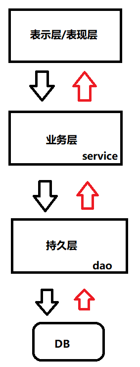                            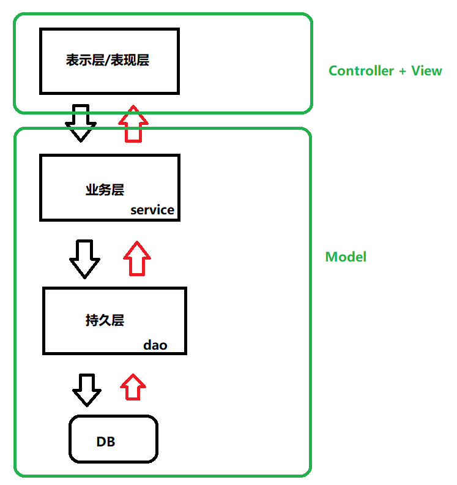

MVC 和三层模型都采用了分层结构来设计应用程序，都是降低耦合度，提高扩展力，提高组件复用性。区别在于：他们的关注点不同，三层模型更加关注业务逻辑组件的划分?MVC架构模式关注的是整个应用程序的层次关系和分离思想。现代的开发方式大部分都是MVC架构模式结合三层模型一起用?
# 什么是SpringMVC
## SpringMVC概述
SpringMVC是一个实现了MVC架构模式的Web框架，底层基于Servlet实现?SpringMVC已经将MVC架构模式实现了，因此只要我们是基于SpringMVC框架写代码，编写的程序就是符合MVC架构模式的。（**MVC的架子搭好了，我们只需要添添补?*?Spring框架中有一个子项目叫做Spring Web，Spring Web子项目当中包含很多模块，例如?
- Spring MVC
- Spring WebFlux
- Spring Web Services
- Spring Web Flow
- Spring WebSocket
- Spring Web Services Client

可见 SpringMVC是Spring Web子项目当中的一个模块。因此也可以说SpringMVC是Spring框架的一部分?所以学习SpringMVC框架之前要先学习Spring框架中的IoC和AOP等内容?另外，使用SpringMVC框架的时候同样也可以使用IoC和AOP?以下就是Spring官方给出的Spring架构图，其中Web中的servlet指的就是Spring MVC?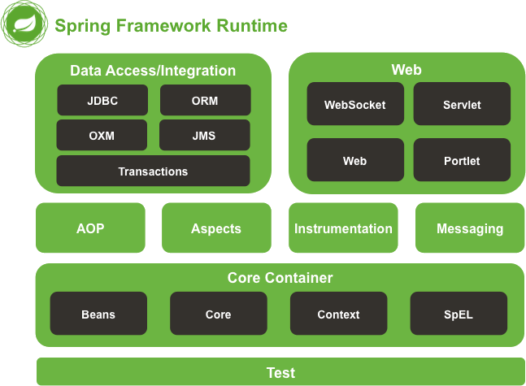


## SpringMVC帮我们做了什?SpringMVC框架帮我们做了什么，与纯粹的Servlet开发有什么区别？

1.  入口控制：SpringMVC框架通过DispatcherServlet作为入口控制器，负责接收请求和分发请求。而在Servlet开发中，需要自己编写Servlet程序，并在web.xml中进行配置，才能接受和处理请求?
2. 在SpringMVC中，表单提交时可以自动将表单数据绑定到相应的JavaBean对象中，只需要在控制器方法的参数列表中声明该JavaBean对象即可，无需手动获取和赋值表单数据。而在纯粹的Servlet开发中，这些都是需要自己手动完成的?3.  IoC容器：SpringMVC框架通过IoC容器管理对象，只需要在配置文件中进行相应的配置即可获取实例对象，而在Servlet开发中需要手动创建对象实例?
4.  统一处理请求：SpringMVC框架提供了拦截器、异常处理器等统一处理请求的机制，并且可以灵活地配置这些处理器。而在Servlet开发中，需要自行编写过滤器、异常处理器等，增加了代码的复杂度和开发难度?
5.  视图解析：SpringMVC框架提供了多种视图模板，如JSP、Freemarker、Velocity等，并且支持国际化、主题等特性。而在Servlet开发中需要手动处理视图层，增加了代码的复杂度?

总之，与Servlet开发相比，SpringMVC框架可以帮我们节省很多时间和精力，减少代码的复杂度，更加专注于业务开发。同时，也提供了更多的功能和扩展性，可以更好地满足企业级应用的开发需求?
## SpringMVC框架的特?
1.  轻量级：相对于其他Web框架，Spring MVC框架比较小巧轻便。（只有几个几百KB左右的Jar包文件） 
2.  模块化：请求处理过程被分成多个模块，以模块化的方式进行处理?
   1. 控制器模块：Controller
   2. 业务逻辑模块：Model
   3. 视图模块：View
3.  依赖注入：Spring MVC框架利用Spring框架的依赖注入功能实现对象的管理，实现松散耦合?
4.  易于扩展：提供了很多口子，允许开发者根据需要插入自己的代码，以扩展实现应用程序的特殊需求?
   1. Spring MVC框架允许开发人员通过自定义模块和组件来扩展和增强框架的功能?   2. Spring MVC框架与其他Spring框架及第三方框架集成得非常紧密，这使得开发人员可以非常方便地集成其他框架，以获得更好的功能?5.  易于测试：支持单元测试框架，提高代码质量和可维护性?（对SpringMVC中的Controller测试时，不需要依靠Web服务器。）
6.  自动化配置：提供自动化配置，减少配置细节?
   1. Spring MVC框架基于约定大于配置的原则，对常用的配置约定进行自动化配置?7.  灵活性：Spring MVC框架支持多种视图技术，如JSP、FreeMarker、Thymeleaf、FreeMarker等，针对不同的视图配置不同的视图解析器即可?

# 本套教程相关版本

- JDK版本：Java21
- Maven版本?.9.6
- Tomcat版本?0
- Spring版本?.1.4
- SpringMVC版本?.1.4
- IDEA版本?023.3
- Thymeleaf版本?.1.2

# 第一个SpringMVC程序
## 创建Maven模块
第一步：创建Empty Project，起名：springmvc?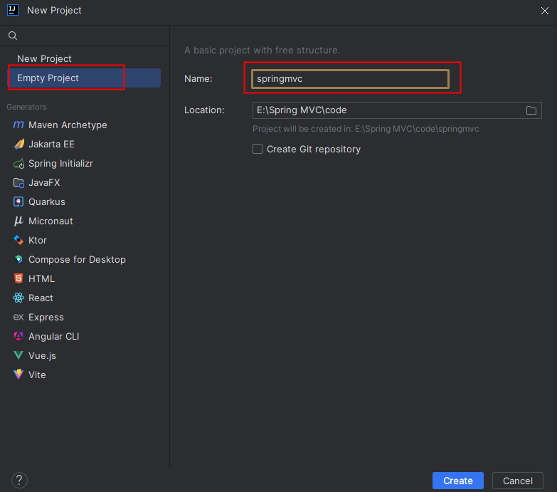
第二步：设置springmvc工程的JDK版本：Java21?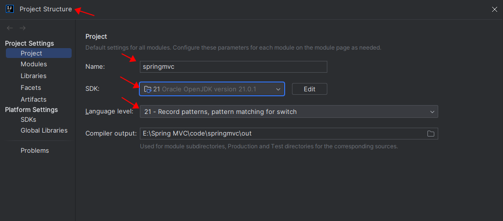
第三步：设置maven?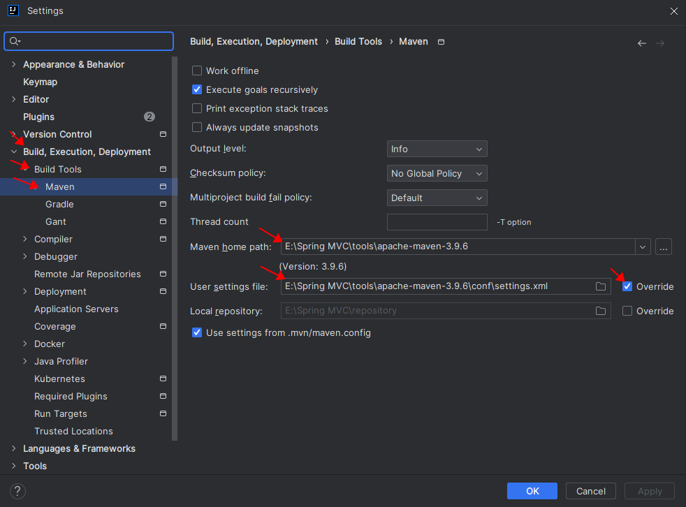
第四步：创建Maven模块
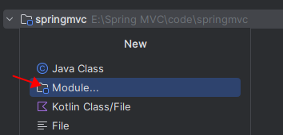
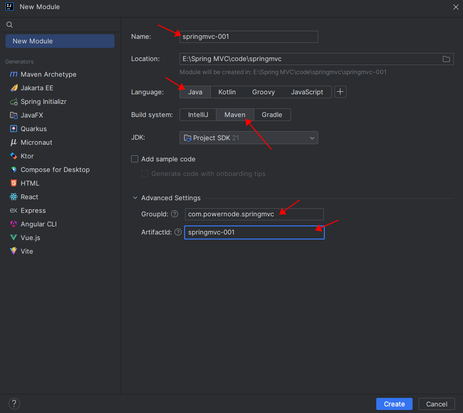
第五步：将pom.xml文件中的打包方式修改为war
```xml
<groupId>com.powernode.springmvc</groupId>
<artifactId>springmvc-001</artifactId>
<version>1.0-SNAPSHOT</version>
<!-- 打包方式设置为war方式 -->
<packaging>war</packaging>
```
第六步：添加以下依赖
```xml
<dependencies>
    <!-- Spring MVC依赖 -->
    <dependency>
        <groupId>org.springframework</groupId>
        <artifactId>spring-webmvc</artifactId>
        <version>6.1.4</version>
    </dependency>
    <!--日志框架Logback依赖-->
    <dependency>
        <groupId>ch.qos.logback</groupId>
        <artifactId>logback-classic</artifactId>
        <version>1.5.3</version>
    </dependency>
    <!--Servlet依赖-->
    <dependency>
        <groupId>jakarta.servlet</groupId>
        <artifactId>jakarta.servlet-api</artifactId>
        <version>6.0.0</version>
        <scope>provided</scope>
    </dependency>
    <!--Spring6和Thymeleaf整合依赖-->
    <dependency>
        <groupId>org.thymeleaf</groupId>
        <artifactId>thymeleaf-spring6</artifactId>
        <version>3.1.2.RELEASE</version>
    </dependency>
</dependencies>
```

## 添加web支持
第一步：在main目录下创建一个webapp目录
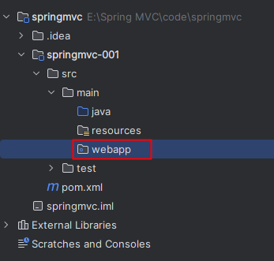
第二步：添加web.xml配置文件
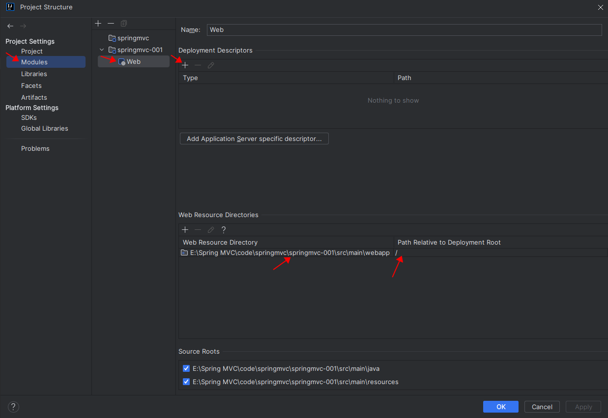
注意 web.xml 文件的位置：E:\Spring MVC\code\springmvc\springmvc-001\**src\main\webapp\WEB-INF\web.xml**
注意版本选择?.0
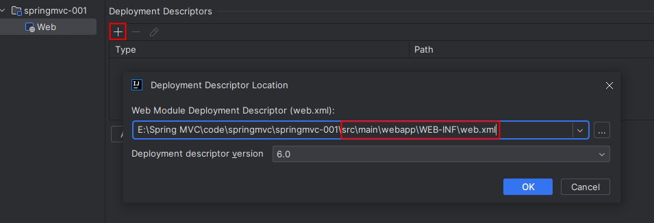
添加web支持后的目录结构?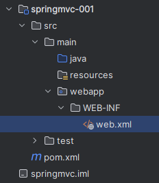

## 配置web.xml文件
Spring MVC是一个web框架，在javaweb中谁来负责接收请求，处理请求，以及响应呢？当然是Servlet。在SpringMVC框架中已经为我们写好了一个Servlet，它的名字叫做：DispatcherServlet，我们称其为前端控制器。既然是Servlet，那么它就需要在web.xml文件中进行配置：
```xml
<?xml version="1.0" encoding="UTF-8"?>
<web-app xmlns="https://jakarta.ee/xml/ns/jakartaee"
         xmlns:xsi="http://www.w3.org/2001/XMLSchema-instance"
         xsi:schemaLocation="https://jakarta.ee/xml/ns/jakartaee https://jakarta.ee/xml/ns/jakartaee/web-app_6_0.xsd"
         version="6.0">

    <!--SpringMVC提供的前端控制器-->
    <servlet>
        <servlet-name>springmvc</servlet-name>
        <servlet-class>org.springframework.web.servlet.DispatcherServlet</servlet-class>
    </servlet>
    <servlet-mapping>
        <servlet-name>springmvc</servlet-name>
        <!-- /* 表示任何一个请求都交给DispatcherServlet来处?-->
        <!-- / 表示当请求不是xx.jsp的时候，DispatcherServlet来负责处理本次请?->
        <!-- jsp本质就是Servlet，因此如果请求是jsp的话，应该走它自己的Servlet，而不应该走DispatcherServlet -->
        <!-- 因此我们?url-pattern 使用 / -->
        <url-pattern>/</url-pattern>
    </servlet-mapping>

</web-app>
```

DispatcherServlet是SpringMVC框架为我们提供的最核心的类，它是整个SpringMVC框架的前端控制器，负责接收HTTP请求、将请求路由到处理程序、处理响应信息，最终将响应返回给客户端。DispatcherServlet是Web应用程序的主要入口点之一，它的职责包括：

1.  接收客户端的HTTP请求：DispatcherServlet监听来自Web浏览器的HTTP请求，然后根据请求的URL将请求数据解析为Request对象?
2.  处理请求的URL：DispatcherServlet将请求的URL（Uniform Resource Locator）与处理程序进行匹配，确定要调用哪个控制器（Controller）来处理此请求?
3.  调用相应的控制器：DispatcherServlet将请求发送给找到的控制器处理，控制器将执行业务逻辑，然后返回一个模型对象（Model）?
4.  渲染视图：DispatcherServlet将调用视图引擎，将模型对象呈现为用户可以查看的HTML页面?
5.  返回响应给客户端：DispatcherServlet将为用户生成的响应发送回浏览器，响应可以包括表单、JSON、XML、HTML以及其它类型的数?
## 编写控制器FirstController
DispatcherServlet接收到请求之后，会根据请求路径分发到对应的Controller，Controller来负责处理请求的核心业务。在SpringMVC框架中Controller是一个普通的Java类（一个普通的POJO类，不需要继承任何类或实现任何接口），需要注意的是：POJO类要纳入IoC容器来管理，POJO类的生命周期由Spring来管理，因此要使用注解标注：
```java
package com.powernode.springmvc.controller;

import org.springframework.stereotype.Controller;

/**
 * ClassName: FirstController
 * Description:
 * Datetime: 2024/3/13 11:56
 * Author: 老杜@动力节点
 * Version: 1.0
 */
@Controller
public class FirstController {
}

```

## 配置springmvc-servlet.xml文件
SpringMVC框架有它自己的配置文件，该配置文件的名字默认为：&lt;servlet-name&gt;-servlet.xml，默认存放的位置是WEB-INF 目录下：
```xml
<?xml version="1.0" encoding="UTF-8"?>
<beans xmlns="http://www.springframework.org/schema/beans"
       xmlns:xsi="http://www.w3.org/2001/XMLSchema-instance"
       xmlns:context="http://www.springframework.org/schema/context"
       xsi:schemaLocation="http://www.springframework.org/schema/beans http://www.springframework.org/schema/beans/spring-beans.xsd http://www.springframework.org/schema/context https://www.springframework.org/schema/context/spring-context.xsd">
    <!--组件扫描-->
    <context:component-scan base-package="com.powernode.springmvc.controller"/>
    <!--视图解析?->
    <bean id="thymeleafViewResolver" class="org.thymeleaf.spring6.view.ThymeleafViewResolver">
        <!--作用于视图渲染的过程中，可以设置视图渲染后输出时采用的编码字符集-->
        <property name="characterEncoding" value="UTF-8"/>
        <!--如果配置多个视图解析器，它来决定优先使用哪个视图解析器，它的值越小优先级越高-->
        <property name="order" value="1"/>
        <!--?ThymeleafViewResolver 渲染模板时，会使用该模板引擎来解析、编译和渲染模板-->
        <property name="templateEngine">
            <bean class="org.thymeleaf.spring6.SpringTemplateEngine">
                <!--用于指定 Thymeleaf 模板引擎使用的模板解析器。模板解析器负责根据模板位置、模板资源名称、文件编码等信息，加载模板并对其进行解析-->
                <property name="templateResolver">
                    <bean class="org.thymeleaf.spring6.templateresolver.SpringResourceTemplateResolver">
                        <!--设置模板文件的位置（前缀?->
                        <property name="prefix" value="/WEB-INF/templates/"/>
                        <!--设置模板文件后缀（后缀），Thymeleaf文件扩展名不一定是html，也可以是其他，例如txt，大部分都是html-->
                        <property name="suffix" value=".html"/>
                        <!--设置模板类型，例如：HTML,TEXT,JAVASCRIPT,CSS?->
                        <property name="templateMode" value="HTML"/>
                        <!--用于模板文件在读取和解析过程中采用的编码字符?->
                        <property name="characterEncoding" value="UTF-8"/>
                    </bean>
                </property>
            </bean>
        </property>
    </bean>
</beans>
```
在WEB-INF目录下新建springmvc-servlet.xml文件，并且提供以上配置信息?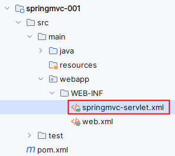
以上配置主要两项?
- 第一项：组件扫描。spring扫描这个包中的类，将这个包中的类实例化并纳入IoC容器的管理?- 第二项：视图解析器。视图解析器（View Resolver）的作用主要是将Controller方法返回的逻辑视图名称解析成实际的视图对象。视图解析器将解析出的视图对象返回给DispatcherServlet，并最终由DispatcherServlet将该视图对象转化为响应结果，呈现给用户?
注意：如果采用了其它视图，请配置对应的视图解析器，例如：

- JSP的视图解析器：InternalResourceViewResolver
- FreeMarker视图解析器：FreeMarkerViewResolver
- Velocity视图解析器：VelocityViewResolver

## 提供视图
在WEB-INF目录下新建templates目录，在templates目录中新建html文件，例如：first.html，并提供以下代码?```html
<!DOCTYPE html>
<!--指定 th 命名空间，让 Thymeleaf 标准表达式可以被解析和执?->
<!--th不是固定的，可以指定其它的命名空间，只不过大部分情况下用th-->
<!--表示程序中出现的 th 开头的后面代码都是 Thymeleaf语法，需要被 Thymeleaf识别-->
&lt;html lang="en" xmlns:th="http://www.thymeleaf.org"&gt;
&lt;head&gt;
    &lt;meta charset="UTF-8"&gt;
    &lt;title&gt;first springmvc&lt;/title&gt;
&lt;/head&gt;
&lt;body&gt;
&lt;h1&gt;我的第一个Spring MVC程序&lt;/h1&gt;
&lt;/body&gt;
&lt;/html&gt;
```
对于每一个Thymeleaf文件来说 xmlns:th="[http://www.thymeleaf.org"](http://www.thymeleaf.org") 是必须要写的，为了方便后续开发，可以将其添加到html模板文件中：
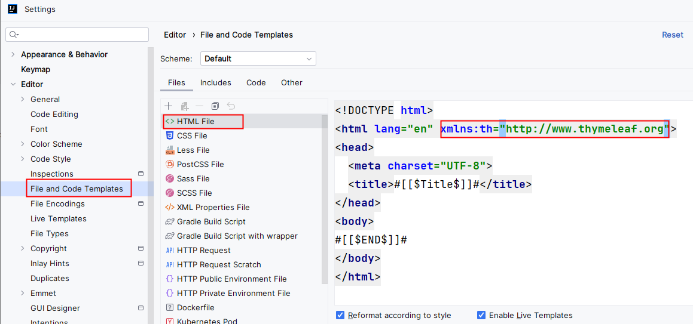

## 控制器FirstController处理请求返回逻辑视图名称
```java
package com.powernode.springmvc.controller;

import org.springframework.stereotype.Controller;
import org.springframework.web.bind.annotation.RequestMapping;

/**
 * ClassName: FirstController
 * Description:
 * Datetime: 2024/3/13 11:56
 * Author: 老杜@动力节点
 * Version: 1.0
 */
@Controller
public class FirstController {
    @RequestMapping(value="/haha")
    public String 名字随意(){
        System.out.println("正在处理请求....");
        // 返回逻辑视图名称（决定跳转到哪个页面?        return "first";
    }
}
```

## 测试
第一步：配置Tomcat服务?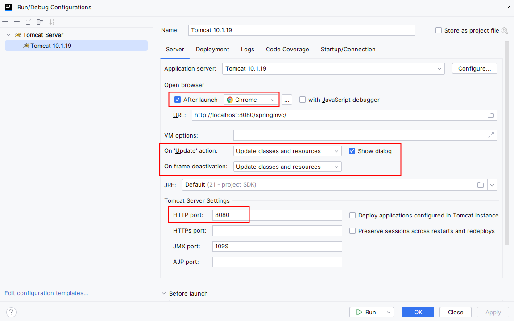
第二步：部署web模块到Tomcat服务?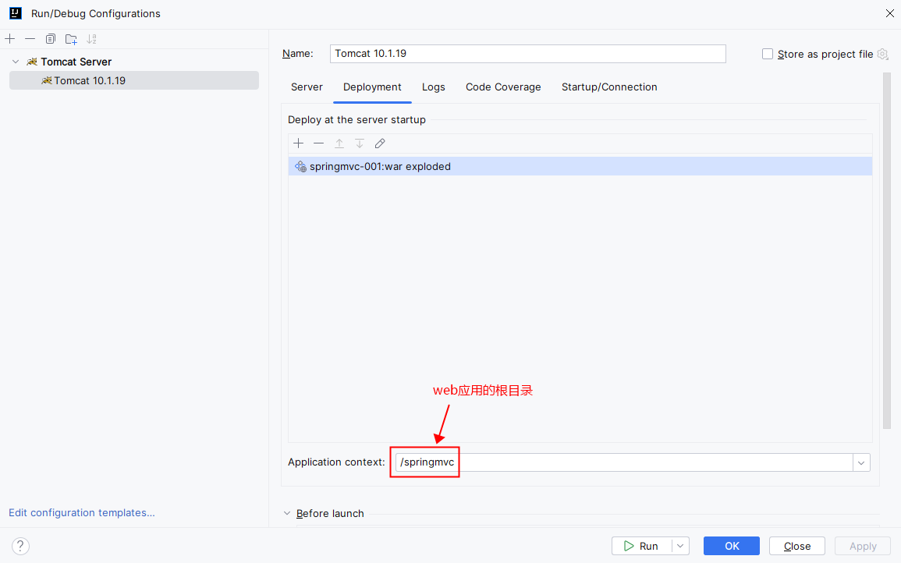
第三步：启动Tomcat服务器。如果在控制台输出的信息有中文乱码，请修改tomcat服务器配置文件：apache-tomcat-10.1.19\conf\logging.properties
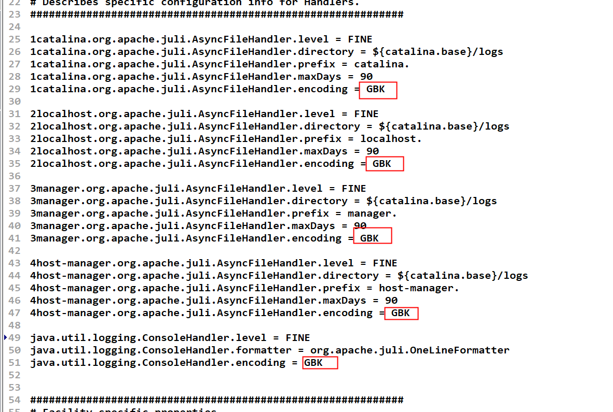
第四步：打开浏览器，在浏览器地址栏上输入地址：http://localhost:8080/springmvc/haha

后端控制台输出：


## 执行流程总结

1. 浏览器发送请求：http://localhost:8080/springmvc/haha
2. SpringMVC的前端控制器DispatcherServlet接收到请?3. DispatcherServlet根据请求路径 /haha 映射?FirstController#名字随意()，调用该方法
4. FirstController#名字随意() 处理请求
5. FirstController#名字随意() 返回逻辑视图名称 first 给视图解析器
6. 视图解析器找?/WEB-INF/templates/first.html 文件，并进行解析，生成视图解析对象返回给前端控制器DispatcherServlet
7. 前端控制器DispatcherServlet响应结果到浏览器?

## 一个Controller可以编写多个方法
一个Controller可以提供多个方法，每个方法通常是处理对应的请求，例如：
```java
@Controller
public class FirstController {
    @RequestMapping(value="/haha")
    public String 名字随意(){
        System.out.println("正在处理请求....");
        // 返回逻辑视图名称（决定跳转到哪个页面?        return "first";
    }
    
    @RequestMapping("/other")
    public String other(){
        System.out.println("正在处理其它请求...");
        return "other";
    }
}
```
提供 other.html 文件
```html
<!DOCTYPE html>
&lt;html lang="en" xmlns:th="http://www.thymeleaf.org"&gt;
&lt;head&gt;
    &lt;meta charset="UTF-8"&gt;
    &lt;title&gt;other&lt;/title&gt;
&lt;/head&gt;
&lt;body&gt;
&lt;h1&gt;other ...&lt;/h1&gt;
&lt;/body&gt;
&lt;/html&gt;
```
?first.html 文件中，添加超链接，用超链接发?/other 请求?```html
<!DOCTYPE html>
<!--指定 th 命名空间，让 Thymeleaf 标准表达式可以被解析和执?->
<!--th不是固定的，可以指定其它的命名空间，只不过大部分情况下用th-->
<!--表示程序中出现的 th 开头的后面代码都是 Thymeleaf语法，需要被 Thymeleaf识别-->
<html lang="en" xmlns:th="http://www.thymeleaf.org">
<head>
    <meta charset="UTF-8">
    <title>first springmvc</title>
</head>
<body>
<h1>我的第一个Spring MVC程序</h1>
<!-- th: 表示后面的代码可以编写Thymeleaf语法，可以被Thymeleaf语法解析 -->
<!-- Thymeleaf检测到?/ 开始，表示绝对路径，自动会将webapp的上下文路径加上?-->
<!-- 最终的效果是：href="/springmvc/other" -->
<a th:href="@{/other}">other请求</a>
</body>
</html>
```
启动Tomcat，打开浏览器，输入请求路径：http://localhost:8080/springmvc/haha

点击超链接：other请求
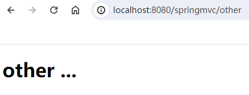

# 第二个SpringMVC程序
## 创建Maven模块

1. pom.xml文件中添加依?   1. springmvc依赖
   2. logback依赖
   3. servlet依赖（scope为provided?   4. thymeleaf与spring6整合依赖
2. 打包方式war

## 添加web支持
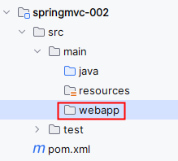
webapp目录没有小蓝点怎么办？添加web支持
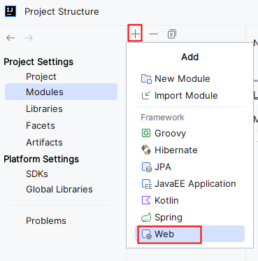
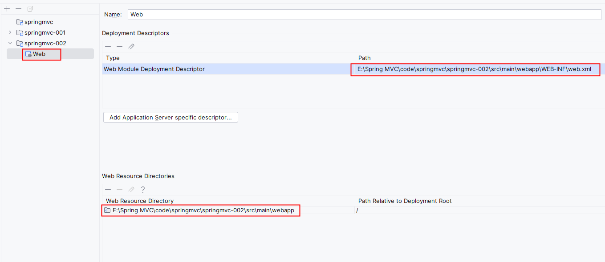

## 配置web.xml文件
重点：SpringMVC配置文件的名字和路径是可以手动设置的，如下：
```xml
<?xml version="1.0" encoding="UTF-8"?>
<web-app xmlns="http://xmlns.jcp.org/xml/ns/javaee"
         xmlns:xsi="http://www.w3.org/2001/XMLSchema-instance"
         xsi:schemaLocation="http://xmlns.jcp.org/xml/ns/javaee http://xmlns.jcp.org/xml/ns/javaee/web-app_4_0.xsd"
         version="4.0">
    <!--配置前端控制?->
    <servlet>
        <servlet-name>springmvc</servlet-name>
        <servlet-class>org.springframework.web.servlet.DispatcherServlet</servlet-class>
        <!--手动设置springmvc配置文件的路径及名字-->
        <init-param>
            <param-name>contextConfigLocation</param-name>
            <param-value>classpath:springmvc.xml</param-value>
        </init-param>
        <!--为了提高用户的第一次访问效率，建议在web服务器启动时初始化前端控制器-->
        <load-on-startup>1</load-on-startup>
    </servlet>
    <servlet-mapping>
        <servlet-name>springmvc</servlet-name>
        <url-pattern>/</url-pattern>
    </servlet-mapping>
</web-app>
```
**通过&lt;init-param&gt;来设置SpringMVC配置文件的路径和名字。在DispatcherServlet的init方法执行时设置的?*
**&lt;load-on-startup&gt;1&lt;/load-on-startup&gt;建议加上，这样可以提高用户第一次访问的效率。表示在web服务器启动时初始化DispatcherServlet?*

## 编写IndexController
```java
package com.powernode.springmvc.controller;

import org.springframework.stereotype.Controller;
import org.springframework.web.bind.annotation.RequestMapping;

/**
 * ClassName: IndexController
 * Description:
 * Datetime: 2024/3/13 15:47
 * Author: 老杜@动力节点
 * Version: 1.0
 */
@Controller
public class IndexController {
    @RequestMapping("/")
    public String toIndex(){
        return "index";
    }
}
```
表示请求路径如果是：[http://localhost:8080/springmvc/](http://localhost:8080/springmvc/) ，则进入 /WEB-INF/templates/index.html 页面?**这就是项目的首页效果！！！！?*

## 在resources目录下配置springmvc.xml文件
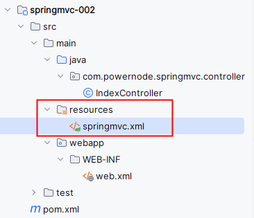
配置内容和之前一样，一个是视图解析器，一个是组件扫描?
## 提供视图

```html
<!DOCTYPE html>
<html lang="en" xmlns:th="http://www.thymeleaf.org">
<head>
    <meta charset="UTF-8">
    <title>index page</title>
</head>
<body>
<h1>index page</h1>
</body>
</html>
```

## 测试
部署到web服务器，启动web服务器，打开浏览器，在地址栏上输入：[http://localhost:8080/springmvc/](http://localhost:8080/springmvc/)

# RequestMapping的作?`@RequestMapping` 注解?Spring MVC 框架中的一个控制器映射注解，用于将请求映射到相应的处理方法上。具体来说，它可以将指定 URL 的请求绑定到一个特定的方法或类上，从而实现对请求的处理和响应?
# RequestMapping的出现位?
通过RequestMapping的源码可以看到RequestMapping注解只能出现在类上或者方法上?
# 类上与方法上结合使用
我们先来看，在同一个web应用中，是否可以有两个完全一样的RequestMapping。测试一下：假设两个RequestMapping，其中一个是展示用户详细信息，另一个是展示商品详细信息。提供两个Controller，一个是UserController，另一个是ProductController。如下：
```java
package com.powernode.springmvc.controller;

import org.springframework.stereotype.Controller;
import org.springframework.web.bind.annotation.RequestMapping;

/**
 * ClassName: UserController
 * Description:
 * Datetime: 2024/3/13 16:40
 * Author: 老杜@动力节点
 * Version: 1.0
 */
@Controller
public class UserController {
    @RequestMapping("/detail")
    public String toDetail(){
        return "detail";
    }
}

```
```java
package com.powernode.springmvc.controller;

import org.springframework.stereotype.Controller;
import org.springframework.web.bind.annotation.RequestMapping;

/**
 * ClassName: ProductController
 * Description:
 * Datetime: 2024/3/13 16:40
 * Author: 老杜@动力节点
 * Version: 1.0
 */
@Controller
public class ProductController {
    @RequestMapping("/detail")
    public String toDetail(){
        return "detail";
    }
}

```
以上两个Controller的RequestMapping相同，都?/detail"，我们来启动服务器看会不会出现问题：异常发生了，异常信息如下
```java
org.springframework.beans.factory.BeanCreationException: 
Error creating bean with name 'org.springframework.web.servlet.mvc.method.annotation.RequestMappingHandlerMapping': 
Ambiguous mapping. Cannot map 'userController' method 
com.powernode.springmvc.controller.UserController#toDetail()
to { [/detail]}: There is already 'productController' bean method
com.powernode.springmvc.controller.ProductController#toDetail() mapped.
```
以上异常信息大致的意思是：不明确的映射。无法映射UserController中的toDetail()方法，因为已经在ProductController中映射过了！！！?通过测试得知，在同一个webapp中，RequestMapping必须具有唯一性。怎么解决以上问题？两种解决方案：

- 第一种方案：将方法上RequestMapping的映射路径修改的不一样?- 第二种方案：在类上添加RequestMapping的映射路径，以类上的RequestMapping作为命名空间，来加以区分两个不同的映射?
## 第一种方?将方法上RequestMapping的映射路径修改的不一样?```java
@RequestMapping("/user/detail")
public String toDetail(){
    return "/user/detail";
}
```
```java
@RequestMapping("/product/detail")
public String toDetail(){
    return "/product/detail";
}
```
再次启动web服务器，会发现没有再报错了?为这两个请求分别提供对应的视图页面：
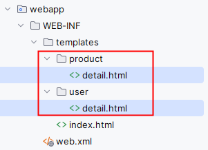
```html
<!DOCTYPE html>
&lt;html lang="en" xmlns:th="http://www.thymeleaf.org"&gt;
&lt;head&gt;
    &lt;meta charset="UTF-8"&gt;
    &lt;title&gt;商品详情页面&lt;/title&gt;
&lt;/head&gt;
&lt;body&gt;
&lt;h1&gt;商品详情&lt;/h1&gt;
&lt;/body&gt;
&lt;/html&gt;
```
```html
<!DOCTYPE html>
&lt;html lang="en" xmlns:th="http://www.thymeleaf.org"&gt;
&lt;head&gt;
    &lt;meta charset="UTF-8"&gt;
    &lt;title&gt;用户详情页面&lt;/title&gt;
&lt;/head&gt;
&lt;body&gt;
&lt;h1&gt;用户详情&lt;/h1&gt;
&lt;/body&gt;
&lt;/html&gt;
```
在首页面添加两个超链接：
```html
<!DOCTYPE html>
&lt;html lang="en" xmlns:th="http://www.thymeleaf.org"&gt;
&lt;head&gt;
    &lt;meta charset="UTF-8"&gt;
    &lt;title&gt;index page&lt;/title&gt;
&lt;/head&gt;
&lt;body&gt;
&lt;h1&gt;index page&lt;/h1&gt;
&lt;a th:href="@{/user/detail}"&gt;用户详情&lt;/a&gt;&lt;br&gt;
&lt;a th:href="@{/product/detail}"&gt;商品详情&lt;/a&gt;&lt;br&gt;
&lt;/body&gt;
&lt;/html&gt;
```
启动Tomcat服务器，并测试：http://localhost:8080/springmvc/
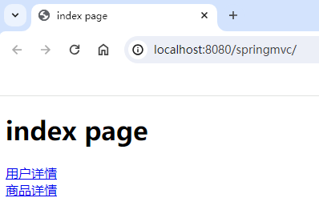
点击用户详情，点击商品详情，都可以正常显示：
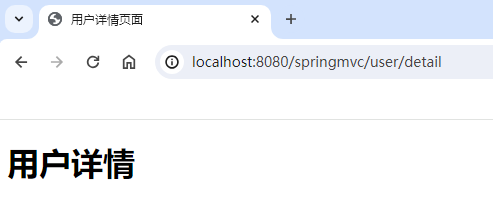
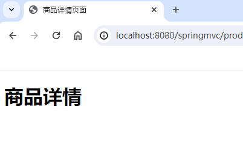

## 第二种方?在类上和方法上都使用RequestMapping注解来进行路径的映射。假设在类上映射的路径是"/a"，在方法上映射的路径?/b"，那么整体表示映射的路径就是?/a/b"
在第一种方案中，假设UserController类中有很多方法，每个方法?RequestMapping注解中都需要以"/user"开始，显然比较啰嗦，干脆将"/user"提升到类级别上，例如?```java
package com.powernode.springmvc.controller;

import org.springframework.stereotype.Controller;
import org.springframework.web.bind.annotation.RequestMapping;

/**
 * ClassName: UserController
 * Description:
 * Datetime: 2024/3/13 16:40
 * Author: 老杜@动力节点
 * Version: 1.0
 */
@Controller
@RequestMapping("/user")
public class UserController {
    @RequestMapping("/detail")
    public String toDetail(){
        return "/user/detail";
    }
}

```
```java
package com.powernode.springmvc.controller;

import org.springframework.stereotype.Controller;
import org.springframework.web.bind.annotation.RequestMapping;

/**
 * ClassName: ProductController
 * Description:
 * Datetime: 2024/3/13 16:40
 * Author: 老杜@动力节点
 * Version: 1.0
 */
@Controller
@RequestMapping("/product")
public class ProductController {
    @RequestMapping("/detail")
    public String toDetail(){
        return "/product/detail";
    }
}

```
经过测试，程序可以正常执行！！！

# RequestMapping注解的value属?## value属性的使用
value属性是该注解最核心的属性，value属性填写的是请求路径，也就是说通过该请求路径与对应的控制器的方法绑定在一起。另外通过源码可以看到value属性是一个字符串数组?
既然是数组，就表示可以提供多个路径，也就是说，在SpringMVC中，多个不同的请求路径可以映射同一个控制器的同一个方法：
编写新的控制器：
```java
package com.powernode.springmvc.controller;

import org.springframework.stereotype.Controller;
import org.springframework.web.bind.annotation.RequestMapping;

/**
 * ClassName: RequestMappingTestController
 * Description: 测试 RequestMapping 注解
 * Datetime: 2024/3/14 9:14
 * Author: 老杜@动力节点
 * Version: 1.0
 */
@Controller
public class RequestMappingTestController {
    @RequestMapping(value = {"/testValue1", "/testValue2"})
    public String testValue(){
        return "testValue";
    }
}

```
提供视图页面?```html
<!DOCTYPE html>
&lt;html lang="en" xmlns:th="http://www.thymeleaf.org"&gt;
&lt;head&gt;
    &lt;meta charset="UTF-8"&gt;
    &lt;title&gt;test Value&lt;/title&gt;
&lt;/head&gt;
&lt;body&gt;
&lt;h1&gt;Test RequestMapping's Value&lt;/h1&gt;
&lt;/body&gt;
&lt;/html&gt;
```
在index.html文件中添加两个超链接?```html
<!DOCTYPE html>
<html lang="en" xmlns:th="http://www.thymeleaf.org">
<head>
    <meta charset="UTF-8">
    <title>index page</title>
</head>
<body>
<h1>index page</h1>
<a th:href="@{/user/detail}">用户详情</a><br>
<a th:href="@{/product/detail}">商品详情</a><br>

<!--测试RequestMapping的value属?->
<a th:href="@{/testValue1}">testValue1</a><br>
<a th:href="@{/testValue2}">testValue2</a><br>

</body>
</html>
```
启动服务器，测试，点击以下的两个超链接，发送请求，都可以正常访问到同一个控制器上的同一个方法：

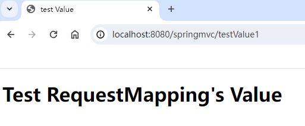


## Ant风格的value
value是可以用来匹配路径的，路径支持模糊匹配，我们把这种模糊匹配称之为Ant风格。关于路径中的通配符包括：

- ?，代表任意一个字?- *，代?到N个任意字?- **，代?到N个任意字符，并且路径中可以出现路径分隔符 /

注意?* 通配符在使用时，左右不能出现字符，只能是 /

测试一下这些通配符，?RequestMappingTestController 中添加以下方法：
```java
@RequestMapping("/x?z/testValueAnt")
public String testValueAnt(){
    return "testValueAnt";
}
```
提供视图页面?```html
<!DOCTYPE html>
&lt;html lang="en" xmlns:th="http://www.thymeleaf.org"&gt;
&lt;head&gt;
    &lt;meta charset="UTF-8"&gt;
    &lt;title&gt;test Value Ant&lt;/title&gt;
&lt;/head&gt;
&lt;body&gt;
&lt;h1&gt;测试RequestMapping注解的value属性支持模糊匹?/h1>
&lt;/body&gt;
&lt;/html&gt;
```
在index.html页面中编写超链接?```html
<!--测试RequestMapping注解的value属性支持模糊匹?->
<a th:href="@{/xyz/testValueAnt}">测试value属性的模糊匹配</a><br>
```
测试结果如下?
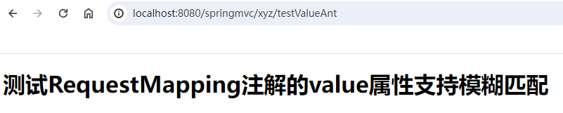


通过修改浏览器地址栏上的路径，可以反复测试通配?? 的语法：

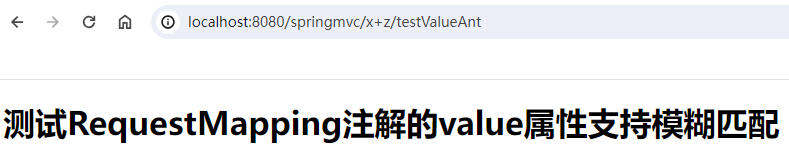
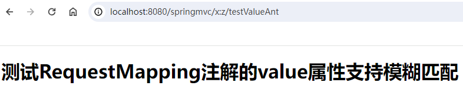

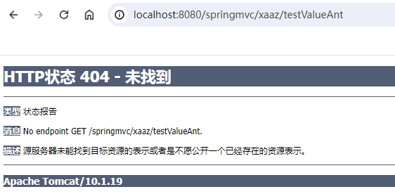


?? 通配符修改为 * 通配符：
```java
//@RequestMapping("/x?z/testValueAnt")
@RequestMapping("/x*z/testValueAnt")
public String testValueAnt(){
    return "testValueAnt";
}
```
打开浏览器直接在地址栏上输入路径进行测试?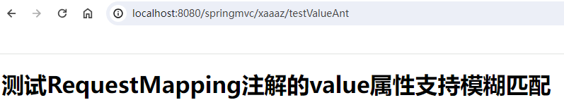


?* 通配符修改为 ** 通配符：
```java
@RequestMapping("/x**z/testValueAnt")
public String testValueAnt(){
    return "testValueAnt";
}
```


注意?x**z/ 实际上并没有使用通配?**，本质上还是使用?*，因为通配?** 在使用的时候，左右两边都不能有任何字符，必须是 /?```java
@RequestMapping("/**/testValueAnt")
public String testValueAnt(){
    return "testValueAnt";
}
```
启动服务器发现报错了?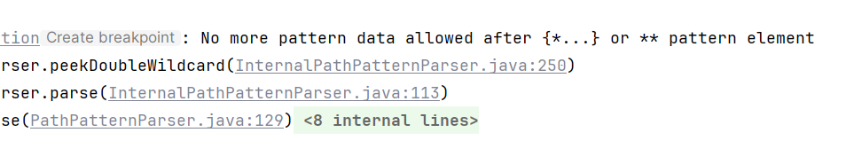
以上写法在Spring5的时候是支持的，但是在Spring6中进行了严格的规定，** 通配符只能出现在路径的末尾，例如?```java
@RequestMapping("/testValueAnt/**")
public String testValueAnt(){
    return "testValueAnt";
}
```
测试结果?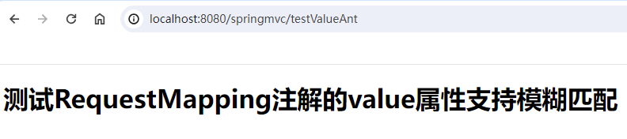
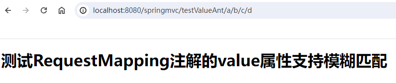

## value中的占位符（重点?到目前为止，我们的请求路径是这样的格式：uri?name1=value1&name2=value2&name3=value3
其实除了这种方式，还有另外一种格式的请求路径，格式为：uri/value1/value2/value3，我们将这样的请求路径叫?RESTful 风格的请求路径?RESTful风格的请求路径在现代的开发中使用较多?
普通的请求路径：http://localhost:8080/springmvc/login?username=admin&password=123&age=20
RESTful风格的请求路径：http://localhost:8080/springmvc/login/admin/123/20

如果使用RESTful风格的请求路径，在控制器中应该如何获取请求中的数据呢？可以在value属性中使用占位符，例如?login/{id}/{username}/{password}

?RequestMappingTestController 类中添加一个方法：
```java
@RequestMapping(value="/testRESTful/{id}/{username}/{age}")
public String testRESTful(
        @PathVariable("id")
        int id,
        @PathVariable("username")
        String username,
        @PathVariable("age")
        int age){
    System.out.println(id + "," + username + "," + age);
    return "testRESTful";
}
```
提供视图页面?```html
<!DOCTYPE html>
&lt;html lang="en" xmlns:th="http://www.thymeleaf.org"&gt;
&lt;head&gt;
    &lt;meta charset="UTF-8"&gt;
    &lt;title&gt;test RESTful&lt;/title&gt;
&lt;/head&gt;
&lt;body&gt;
&lt;h1&gt;测试value属性使用占位符&lt;/h1&gt;
&lt;/body&gt;
&lt;/html&gt;
```
?index.html 页面中添加超链接?```html
<!--测试RequestMapping注解的value属性支持占位符-->
<a th:href="@{/testRESTful/1/zhangsan/20}">测试value属性使用占位符</a>
```

启动服务器测试：
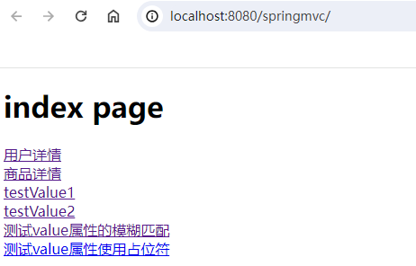

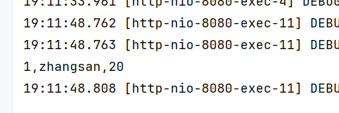

# RequestMapping注解的method属?## method属性的作用
在Servlet当中，如果后端要求前端必须发送一个post请求，后端可以通过重写doPost方法来实现。后端要求前端必须发送一个get请求，后端可以通过重写doGet方法来实现。当重写的方法是doPost时，前端就必须发送post请求，当重写doGet方法时，前端就必须发送get请求。如果前端发送请求的方式和后端的处理方式不一致时，会出现405错误?
HTTP状态码405，这种机制的作用是：限制客户端的请求方式，以保证服务器中数据的安全?
假设后端程序要处理的请求是一个登录请求，为了保证登录时的用户名和密码不被显示到浏览器的地址栏上，后端程序有义务要求前端必须发送一个post请求，如果前端发送get请求，则应该拒绝?
那么在SpringMVC框架中应该如何实现这种机制呢？可以使用RequestMapping注解的method属性来实现?
通过RequestMapping源码可以看到，method属性也是一个数组：
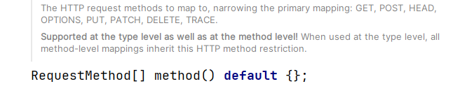
数组中的每个元素?RequestMethod，而RequestMethod是一个枚举类型的数据?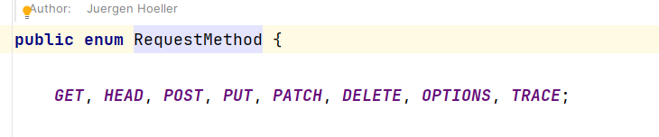
因此如果要求前端发送POST请求，该注解应该这样用：
```java
@RequestMapping(value = "/login", method = RequestMethod.POST)
public String login(){
    return "success";
}
```

接下来，我们来测试一下：
在RequestMappingTestController类中添加以下方法?```java
@RequestMapping(value="/login", method = RequestMethod.POST)
public String testMethod(){
    return "testMethod";
}
```
提供视图页面?```html
<!DOCTYPE html>
<html lang="en" xmlns:th="http://www.thymeleaf.org">
<head>
    <meta charset="UTF-8">
    <title>test Method</title>
</head>
<body>
<h1>Login Success!!!</h1>
</body>
</html>
```


在index.html页面中提供一个登录的form表单，后端要求发送post请求，则form表单的method属性应设置为post?```html
<!--测试RequestMapping的method属?->
&lt;form th:action="@{/login}" method="post"&gt;
    用户名：&lt;input type="text" name="username"/&gt;&lt;br&gt;
    密码?input type="password" name="password"/>&lt;br&gt;
    &lt;input type="submit" value="登录"&gt;
&lt;/form&gt;
```
启动服务器，测试?
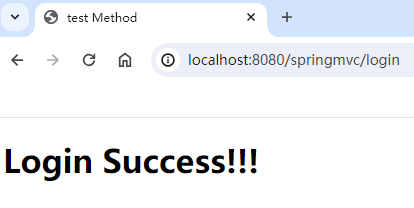


通过测试，前端发送的请求方式post，后端处理请求的方式也是post，就不会有问题?当然，如果后端要求前端必须发送post请求，而前端发送了get请求，则会出?05错误，将index.html中form表单提交方式修改为get?```html
<!--测试RequestMapping的method属?->
<form th:action="@{/login}" method="get">
    用户名：<input type="text" name="username"/><br>
    密码?input type="password" name="password"/><br>
    <input type="submit" value="登录">
</form>
```
再次测试?

**因此，可以看出，对于RequestMapping注解来说，多一个属性，就相当于多了一个映射的条件，如果value和method属性都有，则表示只有前端发送的请求路径 + 请求方式都满足时才能与控制器上的方法建立映射关系，只要有一个不满足，则无法建立映射关系。例如：@RequestMapping(value="/login", method = RequestMethod.POST) 表示当前端发送的请求路径?/login，并且发送请求的方式是POST的时候才会建立映射关系。如果前端发送的是get请求，或者前端发送的请求路径不是 /login，则都是无法建立映射的?*

## 衍生Mapping
对于以上的程序来说，SpringMVC提供了另一个注解，使用这个注解更加的方便，它就是：PostMapping，使用该注解时，不需要指定method属性，因为它默认采用的就是POST处理方式：修改RequestMappingTestController代码如下
```java
//@RequestMapping(value="/login", method = RequestMethod.POST)
@PostMapping("/login")
public String testMethod(){
    return "testMethod";
}
```
当前端发送get请求时，测试一下：
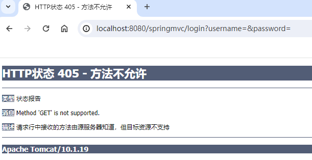
当前端发送post请求时，测试一下：


在SpringMVC中不仅提供了 **PostMaping**注解，像这样的注解还有四个，包括?
- **GetMapping**：要求前端必须发送get请求
- **PutMapping**：要求前端必须发送put请求
- **DeleteMapping**：要求前端必须发送delete请求
- **PatchMapping**：要求前端必须发送patch请求


## web的请求方?前端向服务器发送请求的方式包括哪些？共9种，?种常用，后面作为了解?
- **GET：获取资源，只允许读取数据，不影响数据的状态和功能。使?URL 中传递参数或者在 HTTP 请求的头部使用参数，服务器返回请求的资源?*
- **POST：向服务器提交资源，可能还会改变数据的状态和功能。通过表单等方式提交请求体，服务器接收请求体后，进行数据处理?*
- **PUT：更新资源，用于更新指定的资源上所有可编辑内容。通过请求体发送需要被更新的全部内容，服务器接收数据后，将被更新的资源进行替换或修改?*
- **DELETE：删除资源，用于删除指定的资源。将要被删除的资源标识符放在 URL 中或请求体中?*
- **HEAD：请求服务器返回资源的头部，?GET 命令类似，但是所有返回的信息都是头部信息，不能包含数据体。主要用于资源检测和缓存控制?*
- PATCH：部分更改请求。当被请求的资源是可被更改的资源时，请求服务器对该资源进行部分更新，即每次更新一部分?- OPTIONS：请求获得服务器支持的请求方法类型，以及支持的请求头标志。“OPTIONS *”则返回支持全部方法类型的服务器标志?- TRACE：服务器响应输出客户端的 HTTP 请求，主要用于调试和测试?- CONNECT：建立网络连接，通常用于加密 SSL/TLS 连接?
注意?
1. 使用超链接以及原生的form表单只能提交get和post请求，put、delete、head请求可以使用发送ajax请求的方式来实现?2. 使用超链接发送的是get请求
3. 使用form表单，如果没有设置method，发送get请求
4. 使用form表单，设置method="get"，发送get请求
5. 使用form表单，设置method="post"，发送post请求
6. **使用form表单，设置method="put/delete/head"，发送get请求。（针对这种情况，可以测试一下）**


将index.html中登录表单的提交方式method设置为put?```html
<!--测试RequestMapping的method属?->
&lt;form th:action="@{/login}" method="put"&gt;
    用户名：&lt;input type="text" name="username"/&gt;&lt;br&gt;
    密码?input type="password" name="password"/>&lt;br&gt;
    &lt;input type="submit" value="登录"&gt;
&lt;/form&gt;
```
修改RequestMappingTestController类的代码?```java
@RequestMapping(value="/login", method = RequestMethod.PUT)
//@PostMapping("/login")
public String testMethod(){
    return "testMethod";
}
```
测试结果?
通过测试得知，即使form中method设置为put方式，但仍然采用get方式发送请求?再次修改RequestMappingTestController?```java
@RequestMapping(value="/login", method = RequestMethod.GET)
//@PostMapping("/login")
public String testMethod(){
    return "testMethod";
}
```
再次测试?


## GET和POST的区?在之前发布的JavaWEB视频中对HTTP请求协议的GET和POST进行了详细讲解，这里就不再赘述，大致回顾一下?HTTP请求协议之GET请求?```
GET /springmvc/login?username=lucy&userpwd=1111 HTTP/1.1                           请求?Host: localhost:8080                                                                    请求?Connection: keep-alive
sec-ch-ua: "Google Chrome";v="95", "Chromium";v="95", ";Not A Brand";v="99"
sec-ch-ua-mobile: ?0
sec-ch-ua-platform: "Windows"
Upgrade-Insecure-Requests: 1
User-Agent: Mozilla/5.0 (Windows NT 10.0; Win64; x64) AppleWebKit/537.36 (KHTML, like Gecko) Chrome/95.0.4638.54 Safari/537.36
Accept: text/html,application/xhtml+xml,application/xml;q=0.9,image/avif,image/webp,image/apng,*/*;q=0.8,application/signed-exchange;v=b3;q=0.9
Sec-Fetch-Site: same-origin
Sec-Fetch-Mode: navigate
Sec-Fetch-User: ?1
Sec-Fetch-Dest: document
Referer: http://localhost:8080/springmvc/index.html
Accept-Encoding: gzip, deflate, br
Accept-Language: zh-CN,zh;q=0.9
                                                                                        空白?                                                                                        请求?```
HTTP请求协议之POST请求?```
POST /springmvc/login HTTP/1.1                                                  请求?Host: localhost:8080                                                                  请求?Connection: keep-alive
Content-Length: 25
Cache-Control: max-age=0
sec-ch-ua: "Google Chrome";v="95", "Chromium";v="95", ";Not A Brand";v="99"
sec-ch-ua-mobile: ?0
sec-ch-ua-platform: "Windows"
Upgrade-Insecure-Requests: 1
Origin: http://localhost:8080
Content-Type: application/x-www-form-urlencoded
User-Agent: Mozilla/5.0 (Windows NT 10.0; Win64; x64) AppleWebKit/537.36 (KHTML, like Gecko) Chrome/95.0.4638.54 Safari/537.36
Accept: text/html,application/xhtml+xml,application/xml;q=0.9,image/avif,image/webp,image/apng,*/*;q=0.8,application/signed-exchange;v=b3;q=0.9
Sec-Fetch-Site: same-origin
Sec-Fetch-Mode: navigate
Sec-Fetch-User: ?1
Sec-Fetch-Dest: document
Referer: http://localhost:8080/springmvc/index.html
Accept-Encoding: gzip, deflate, br
Accept-Language: zh-CN,zh;q=0.9
                                                                                      空白?username=lisi&userpwd=123                                                             请求?```

### 区别是什?
1. get请求发送数据的时候，数据会挂在URI的后面，并且在URI后面添加一个?”，"?"后面是数据。这样会导致发送的数据回显在浏览器的地址栏上?
[http://localhost:8080/springmvc/login?username=zhangsan&userpwd=1111](http://localhost:8080/servlet05/getServlet?username=zhangsan&userpwd=1111)

2. post请求发送数据的时候，在请求体当中发送。不会回显到浏览器的地址栏上。也就是说post发送的数据，在浏览器地址栏上看不到?3. get请求只能发送普通的字符串。并且发送的字符串长度有限制，不同的浏览器限制不同。这个没有明确的规范。get请求无法发送大数据量?4. post请求可以发送任何类型的数据，包括普通字符串，流媒体等信息：视频、声音、图片。post请求可以发送大数据量，理论上没有长度限制?5. get请求在W3C中是这样说的：get请求比较适合从服务器端获取数据?6. post请求在W3C中是这样说的：post请求比较适合向服务器端传送数据?7. get请求是安全的。因为在正确使用get请求的前提下，get请求只是为了从服务器上获取数据，不会对服务器数据进行修改?8. post请求是危险的。因为post请求是修改服务器端的资源?9. get请求支持缓存?也就是说当第二次发送get请求时，会走浏览器上次的缓存结果，不再真正的请求服务器。（有时需要避免，怎么避免：在get请求路径后添加时间戳?10. post请求不支持缓存。每一次发送post请求都会真正的走服务器?
### 怎么选择

1. 如果你是想从服务器上获取资源，建议使用GET请求，如果你这个请求是为了向服务器提交数据，建议使用POST请求?2. 大部分的form表单提交，都是post方式，因为form表单中要填写大量的数据，这些数据是收集用户的信息，一般是需要传给服务器，服务器将这些数据保?修改等?3. 如果表单中有敏感信息，建议使用post请求，因为get请求会回显敏感信息到浏览器地址栏上。（例如：密码信息）
4. 做文件上传，一定是post请求。要传的数据不是普通文本?5. 其他情况大部分都是使用get请求?
# RequestMapping注解的params属?## params属性的理解
params属性用来设置通过请求参数来映射请求?对于RequestMapping注解来说?
- value属性是一个数组，只要满足数组中的任意一个路径，就能映射成功
- method属性也是一个数组，只要满足数组中任意一个请求方式，就能映射成功?- **params属性也是一个数组，不过要求请求参数必须和params数组中要求的所有参数完全一致后，才能映射成功?*


## params属性的4种用?@RequestMapping(value="/login", params={**"username"**, "password"}) 表示：请求参数中必须包含 username ?password，才能与当前标注的方法进行映射?@RequestMapping(value="/login", params={**"!username"**, "password"}) 表示：请求参数中不能包含username参数，但必须包含password参数，才能与当前标注的方法进行映射?@RequestMapping(value="/login", params={**"username=admin"**, "password"}) 表示：请求参数中必须包含username参数，并且参数的值必须是admin，另外也必须包含password参数，才能与当前标注的方法进行映射?@RequestMapping(value="/login", params={**"username!=admin"**, "password"}) 表示：请求参数中必须包含username参数，但参数的值不能是admin，另外也必须包含password参数，才能与当前标注的方法进行映射?
注意：如果前端提交的参数，和后端要求的请求参数不一致，则出?00错误！！?**HTTP状态码400的原因：请求参数格式不正确而导致的?*

## 测试params属??RequestMappingTestController 类中添加如下方法?```java
@RequestMapping(value="/testParams", params = {"username", "password"})
public String testParams(){
    return "testParams";
}
```
提供视图页面?```html
<!DOCTYPE html>
&lt;html lang="en" xmlns:th="http://www.thymeleaf.org"&gt;
&lt;head&gt;
    &lt;meta charset="UTF-8"&gt;
    &lt;title&gt;testParams&lt;/title&gt;
&lt;/head&gt;
&lt;body&gt;
&lt;h1&gt;测试RequestMapping注解的Params属?/h1>
&lt;/body&gt;
&lt;/html&gt;
```
在index.html文件中添加超链接?```html
<!--测试RequestMapping的params属?->
<a th:href="@{/testParams(username='admin',password='123')}">测试params属?/a>
```
当然，你也可以这样写：这样写IDEA会报错，但不影响使用?```html
&lt;a th:href="@{/testParams?username=admin&password=123}"&gt;测试params属?/a>&lt;br&gt;
```
启动服务器，测试?
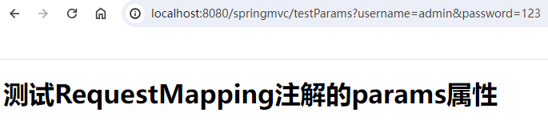


假如发送请求时，没有传递username参数会怎样?```html
<a th:href="@{/testParams(password='123')}">测试params属?/a><br>
```
启动服务器，测试?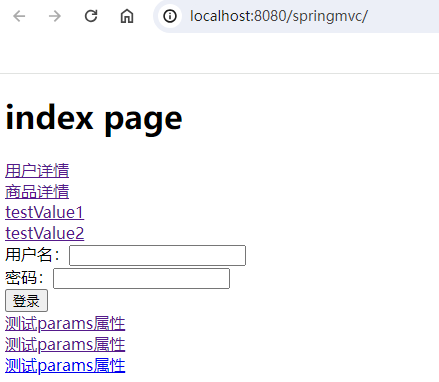

提示无效的请求参数，服务器无法或不会处理当前请求?params属性剩下的三种情况，自行测试！！！?
# RequestMapping注解的headers属?## 认识headers属?headers和params原理相同，用法也相同?当前端提交的请求头信息和后端要求的请求头信息一致时，才能映射成功?请求头信息怎么查看？在chrome浏览器中，F12打开控制台，找到Network，可以查看具体的请求协议和响应协议。在请求协议中可以看到请求头信息，例如：

请求头信息和请求参数信息一样，都是键值对形式，例如上图中?
- Referer: http://localhost:8080/springmvc/     键是Referer，值是http://localhost:8080/springmvc/
- Host: localhost:8080     键是Host，值是localhost:8080

## headers属性的4种用?@RequestMapping(value="/login", headers={**"Referer"**, "Host"}) 表示：请求头信息中必须包含Referer和Host，才能与当前标注的方法进行映射?@RequestMapping(value="/login", headers={**"Referer"**, "!Host"}) 表示：请求头信息中必须包含Referer，但不包含Host，才能与当前标注的方法进行映射?@RequestMapping(value="/login", headers={**"Referer=http://localhost:8080/springmvc/"**, "Host"}) 表示：请求头信息中必须包含Referer和Host，并且Referer的值必须是http://localhost:8080/springmvc/，才能与当前标注的方法进行映射?@RequestMapping(value="/login", headers={**"Referer!=http://localhost:8080/springmvc/"**, "Host"}) 表示：请求头信息中必须包含Referer和Host，并且Referer的值不是http://localhost:8080/springmvc/，才能与当前标注的方法进行映射?
注意：如果前端提交的请求头信息，和后端要求的请求头信息不一致，则出?04错误！！?
## 测试headers属??RequestMappingTestController 类中添加以下方法?```java
@RequestMapping(value="/testHeaders", headers = {"Referer=http://localhost:8080/springmvc/"})
public String testHeaders(){
    return "testHeaders";
}
```
提供视图页面?```html
<!DOCTYPE html>
<html lang="en" xmlns:th="http://www.thymeleaf.org">
<head>
    <meta charset="UTF-8">
    <title>test Headers</title>
</head>
<body>
<h1>测试RequestMapping注解的headers属?/h1>
</body>
</html>
```
在index.html页面中添加超链接?```html
<!--测试RequestMapping的headers属?->
&lt;a th:href="@{/testHeaders}"&gt;测试headers属?/a>&lt;br&gt;
```
启动服务器，测试结果?
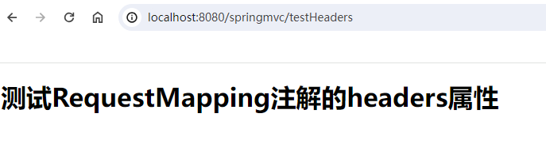
将后端控制器中的headers属性值进行修改：
```java
@RequestMapping(value="/testHeaders", headers = {"Referer=http://localhost:8888/springmvc/"})
public String testHeaders(){
    return "testHeaders";
}
```
再次测试?
其他情况自行测试！！！！

假设有这样一个请求：http://localhost:8080/springmvc/register?name=zhangsan&password=123&email=zhangsan@powernode.com
在SpringMVC中应该如何获取请求提交的数据呢？
在SpringMVC中又应该如何获取请求头信息呢?在SpringMVC中又应该如何获取客户端提交的Cookie数据呢？

# 准备
## 创建模块，添加依?```xml
<?xml version="1.0" encoding="UTF-8"?>
<project xmlns="http://maven.apache.org/POM/4.0.0"
         xmlns:xsi="http://www.w3.org/2001/XMLSchema-instance"
         xsi:schemaLocation="http://maven.apache.org/POM/4.0.0 http://maven.apache.org/xsd/maven-4.0.0.xsd">
    <modelVersion>4.0.0</modelVersion>

    <groupId>com.powernode.springmvc</groupId>
    <artifactId>springmvc-003</artifactId>
    <version>1.0-SNAPSHOT</version>
    <packaging>war</packaging>

    <dependencies>
        <!--springmvc依赖-->
        <dependency>
            <groupId>org.springframework</groupId>
            <artifactId>spring-webmvc</artifactId>
            <version>6.1.4</version>
        </dependency>
        <!--logback依赖-->
        <dependency>
            <groupId>ch.qos.logback</groupId>
            <artifactId>logback-classic</artifactId>
            <version>1.5.3</version>
        </dependency>
        <!--servlet依赖-->
        <dependency>
            <groupId>jakarta.servlet</groupId>
            <artifactId>jakarta.servlet-api</artifactId>
            <version>6.0.0</version>
            <scope>provided</scope>
        </dependency>
        <!--thymeleaf和spring6整合的依?->
        <dependency>
            <groupId>org.thymeleaf</groupId>
            <artifactId>thymeleaf-spring6</artifactId>
            <version>3.1.2.RELEASE</version>
        </dependency>
    </dependencies>

    <properties>
        <maven.compiler.source>21</maven.compiler.source>
        <maven.compiler.target>21</maven.compiler.target>
        <project.build.sourceEncoding>UTF-8</project.build.sourceEncoding>
    </properties>

</project>
```

## 添加web支持
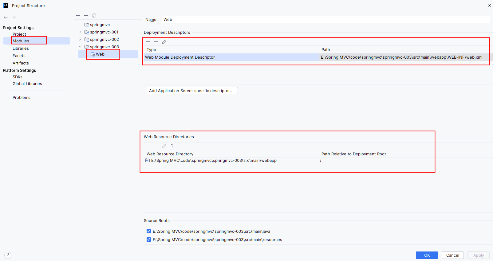

## 编写web.xml文件
```xml
<?xml version="1.0" encoding="UTF-8"?>
<web-app xmlns="https://jakarta.ee/xml/ns/jakartaee"
         xmlns:xsi="http://www.w3.org/2001/XMLSchema-instance"
         xsi:schemaLocation="https://jakarta.ee/xml/ns/jakartaee https://jakarta.ee/xml/ns/jakartaee/web-app_6_0.xsd"
         version="6.0">

    <!--前端控制?->
    <servlet>
        <servlet-name>springmvc</servlet-name>
        <servlet-class>org.springframework.web.servlet.DispatcherServlet</servlet-class>
        <!--通过初始化参数来指定springmvc配置文件的路径和名字?->
        <init-param>
            <param-name>contextConfigLocation</param-name>
            <param-value>classpath:springmvc.xml</param-value>
        </init-param>
        <!--在服务器启动的时候初始化DispatcherServlet，提高第一次访问的效率-->
        <load-on-startup>1</load-on-startup>
    </servlet>
    <servlet-mapping>
        <servlet-name>springmvc</servlet-name>
        <url-pattern>/</url-pattern>
    </servlet-mapping>

</web-app>
```

## 创建UserController
```java
package com.powernode.springmvc.controller;

import org.springframework.stereotype.Controller;
import org.springframework.web.bind.annotation.RequestMapping;

/**
 * ClassName: UserController
 * Description:
 * Datetime: 2024/3/14 20:05
 * Author: 老杜@动力节点
 * Version: 1.0
 */
@Controller
public class UserController {
    @RequestMapping("/")
    public String toRegisterPage(){
        return "register";
    }
}
```

## 编写springmvc.xml
```xml
<?xml version="1.0" encoding="UTF-8"?>
<beans xmlns="http://www.springframework.org/schema/beans"
       xmlns:xsi="http://www.w3.org/2001/XMLSchema-instance"
       xmlns:context="http://www.springframework.org/schema/context"
       xsi:schemaLocation="http://www.springframework.org/schema/beans http://www.springframework.org/schema/beans/spring-beans.xsd http://www.springframework.org/schema/context https://www.springframework.org/schema/context/spring-context.xsd">

    <!--组件扫描-->
    <context:component-scan base-package="com.powernode.springmvc.controller"/>

    <!--视图解析?->
    <bean id="thymeleafViewResolver" class="org.thymeleaf.spring6.view.ThymeleafViewResolver">
        <!--作用于视图渲染的过程中，可以设置视图渲染后输出时采用的编码字符集-->
        <property name="characterEncoding" value="UTF-8"/>
        <!--如果配置多个视图解析器，它来决定优先使用哪个视图解析器，它的值越小优先级越高-->
        <property name="order" value="1"/>
        <!--?ThymeleafViewResolver 渲染模板时，会使用该模板引擎来解析、编译和渲染模板-->
        <property name="templateEngine">
            <bean class="org.thymeleaf.spring6.SpringTemplateEngine">
                <!--用于指定 Thymeleaf 模板引擎使用的模板解析器。模板解析器负责根据模板位置、模板资源名称、文件编码等信息，加载模板并对其进行解析-->
                <property name="templateResolver">
                    <bean class="org.thymeleaf.spring6.templateresolver.SpringResourceTemplateResolver">
                        <!--设置模板文件的位置（前缀?->
                        <property name="prefix" value="/WEB-INF/templates/"/>
                        <!--设置模板文件后缀（后缀），Thymeleaf文件扩展名不一定是html，也可以是其他，例如txt，大部分都是html-->
                        <property name="suffix" value=".html"/>
                        <!--设置模板类型，例如：HTML,TEXT,JAVASCRIPT,CSS?->
                        <property name="templateMode" value="HTML"/>
                        <!--用于模板文件在读取和解析过程中采用的编码字符?->
                        <property name="characterEncoding" value="UTF-8"/>
                    </bean>
                </property>
            </bean>
        </property>
    </bean>

</beans>
```

## 编写register.html文件
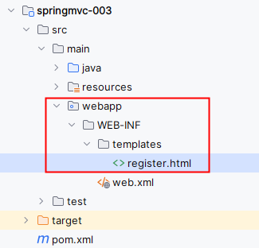
```xml
<!DOCTYPE html>
<html lang="en" xmlns:th="http://www.thymeleaf.org">
<head>
    <meta charset="UTF-8">
    <title>用户注册</title>
</head>
<body>
<h3>用户注册</h3>
<hr>
</body>
</html>
```

## 部署测试
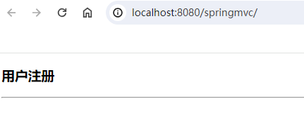

# 使用原生的Servlet API进行获取
原生的Servlet API指的是：HttpServletRequest
在SpringMVC当中，一个Controller类中的方法参数上如果有HttpServletRequest，SpringMVC会自动将`**当前请求对象**`传递给这个参数，因此我们可以通过这个参数来获取请求提交的数据。测试一下?
?register.html 中准备一个注册的表单?```html
<!DOCTYPE html>
&lt;html lang="en" xmlns:th="http://www.thymeleaf.org"&gt;
&lt;head&gt;
    &lt;meta charset="UTF-8"&gt;
    &lt;title&gt;用户注册&lt;/title&gt;
&lt;/head&gt;
&lt;body&gt;
&lt;h3&gt;用户注册&lt;/h3&gt;
&lt;hr&gt;
&lt;form th:action="@{/register}" method="post"&gt;
    用户名：&lt;input type="text" name="username"&gt;&lt;br&gt;
    密码?input type="password" name="password">&lt;br&gt;
    性别?        ?&lt;input type="radio" name="sex" value="1"&gt;
        ?&lt;input type="radio" name="sex" value="0"&gt;
        &lt;br&gt;
    爱好?        抽烟 &lt;input type="checkbox" name="hobby" value="smoke"&gt;
        喝酒 &lt;input type="checkbox" name="hobby" value="drink"&gt;
        烫头 &lt;input type="checkbox" name="hobby" value="perm"&gt;
        &lt;br&gt;
    简介：&lt;textarea rows="10" cols="60" name="intro"&gt;&lt;/textarea&gt;&lt;br&gt;
    &lt;input type="submit" value="注册"&gt;
&lt;/form&gt;
&lt;/body&gt;
&lt;/html&gt;
```
先测试这个页面是否可以正常打开，是否可以正常提交数据：
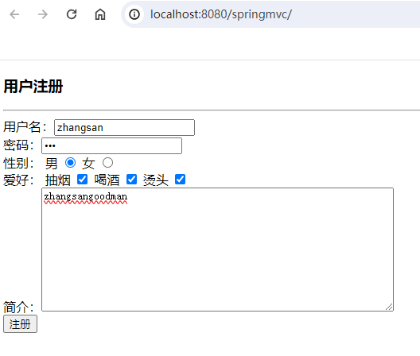


点击注册：F12的方式查看是否提交了数据?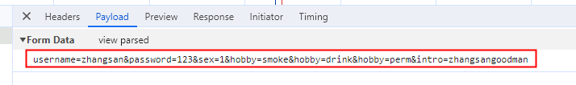
通过测试得知：可以正常提交数据?
接下来在控制器添加一个方法来处理这个注册的请求：
```java
@PostMapping(value="/register")
public String register(HttpServletRequest request){
    // 通过当前请求对象获取提交的数?    String username = request.getParameter("username");
    String password = request.getParameter("password");
    String sex = request.getParameter("sex");
    String[] hobbies = request.getParameterValues("hobby");
    String intro = request.getParameter("intro");
    System.out.println(username + "," + password + "," + sex + "," + Arrays.toString(hobbies) + "," + intro);
    return "success";
}
```

提供视图页面?```html
<!DOCTYPE html>
<html lang="en" xmlns:th="http://www.thymeleaf.org">
<head>
    <meta charset="UTF-8">
    <title>注册成功</title>
</head>
<body>
<h1>注册成功</h1>
</body>
</html>
```


测试?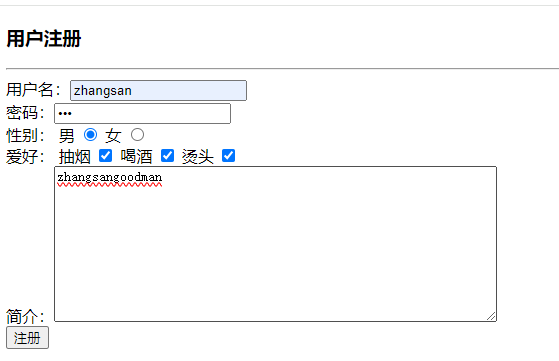
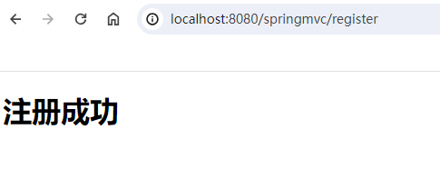
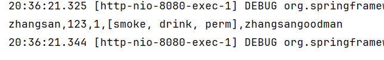

**这样通过Servlet原生的API获取到提交的数据。但是这种方式不建议使用，因为方法的参数依赖Servlet原生API，Controller的测试将不能单独测试，必须依赖WEB服务器才能测试。另外，换句话说，如果在SpringMVC中使用了原生的Servlet，你为什么还要用SpringMVC框架呢！！！！！**

# 使用RequestParam注解标注
## RequestParam注解的基本使?RequestParam注解作用：将`请求参数`与方法上的`形参`映射?```java
@PostMapping(value = "/register")
public String register(
        @RequestParam(value="username")
        String a,
        @RequestParam(value="password")
        String b,
        @RequestParam(value="sex")
        String c,
        @RequestParam(value="hobby")
        String[] d,
        @RequestParam(name="intro")
        String e) {
    System.out.println(a);
    System.out.println(b);
    System.out.println(c);
    System.out.println(Arrays.toString(d));
    System.out.println(e);
    return "success";
}
```

注意：对于@RequestParam注解来说，属性有value和name，这两个属性的作用相同，都是用来指定提交数据的name?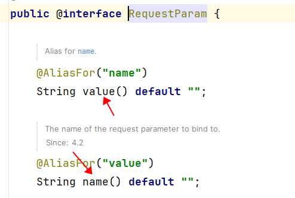
例如：发送请求时提交的数据是：name1=value1&name2=value2，则这个注解应该这样写：@RequestParam(value="name1")、@RequestParam(value="name2")


启动服务器测试：
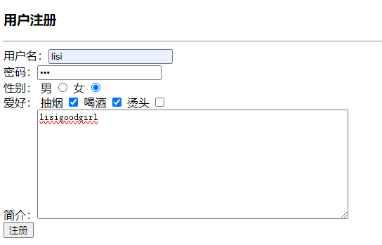
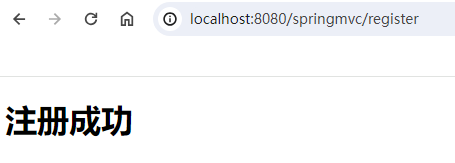
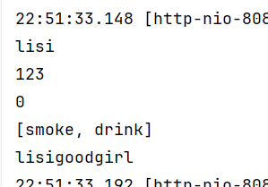

一定要注意?@RequestParam(value="name2") 中value一定不要写错，写错就会出现以下问题?
测试结果?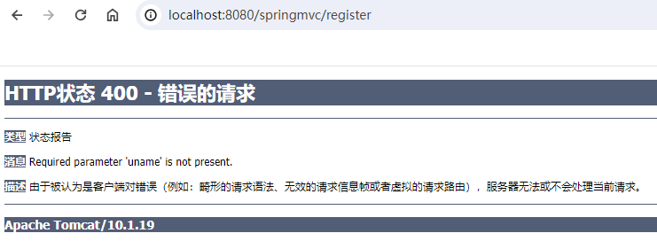

## RequestParam注解的required属?
required属性用来设置该方法参数是否为必须的?默认情况下，这个参数?`true`，表示方法参数是必需的。如果请求中缺少对应的参数，则会抛出异常?可以将其设置为`false`，false表示不是必须的，如果请求中缺少对应的参数，则方法的参数为null?
测试，修改register方法，如下：
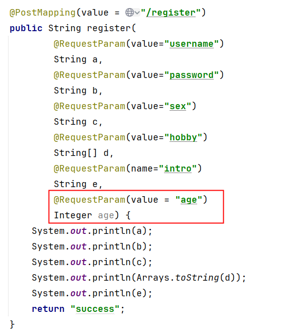


添加了一?age 形参，没有指?required 属性时，默认是true，表示必需的，但前端表单中没有年龄age，我们来看报错信息：
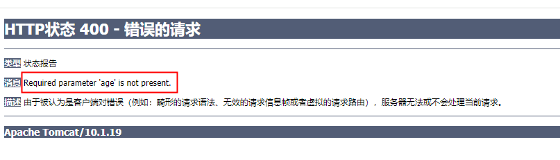
错误信息告诉我们：参数age是必需的。没有提供这个请求参数，HTTP状态码 400

如果?required 属性设置为 false。则该参数则不是必须的，如果请求参数仍然未提供时，我们来看结果：


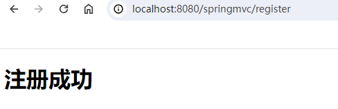

通过测试得知，如果一个参数被设置为`不是必需的`，当没有提交对应的请求参数时，形参默认值null?当然，如果请求参数中提供了age，则age为真实提交的数据?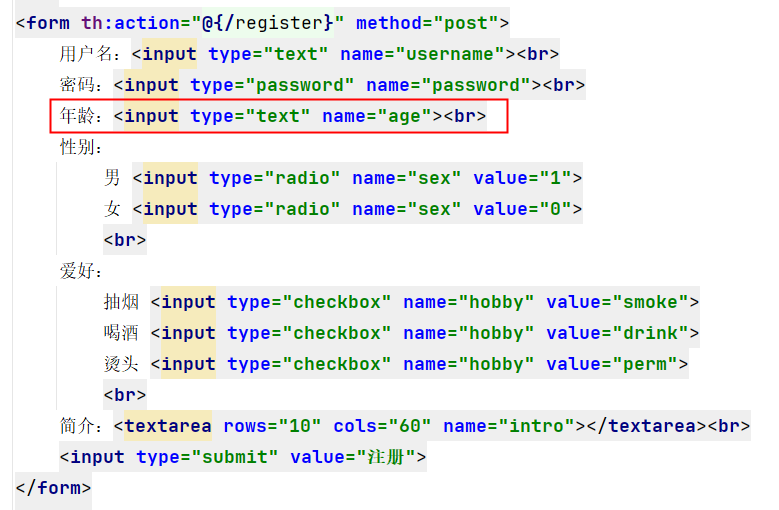


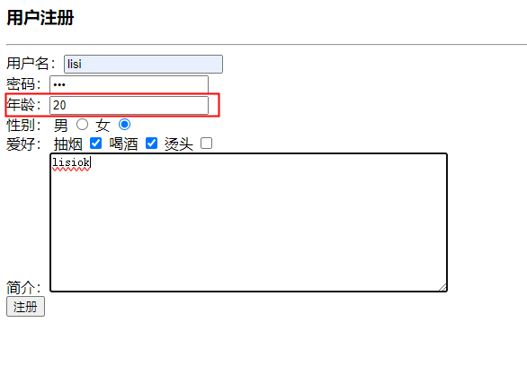
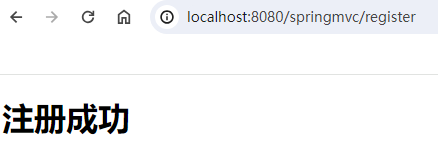
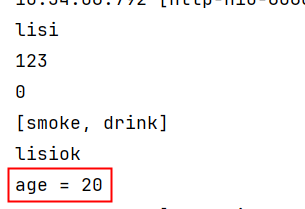


## RequestParam注解的defaultValue属?defaultValue属性用来设置形参的默认值，当`没有提供对应的请求参数`或者`请求参数的值是空字符串""`的时候，方法的形参会采用默认值?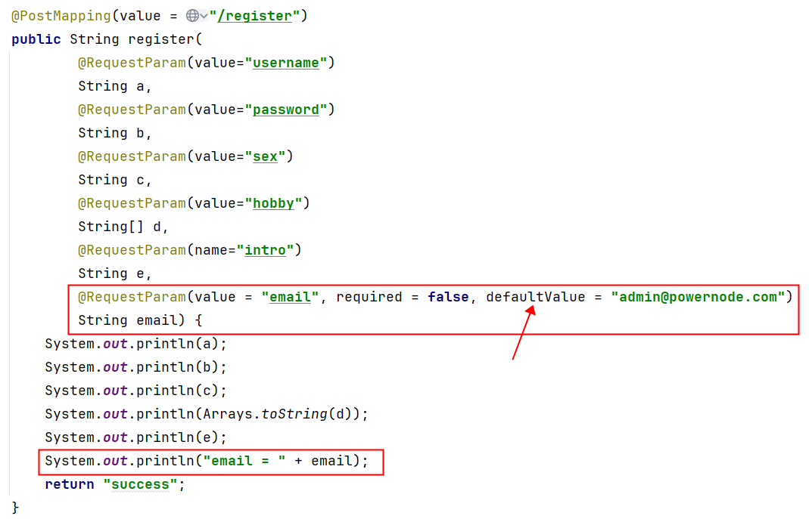

当前端页面没有提交email的时候：
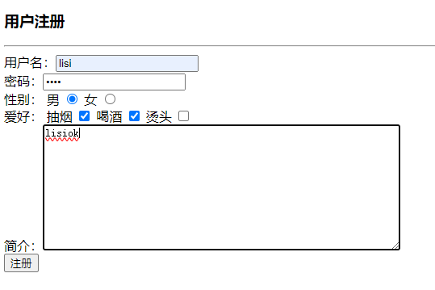


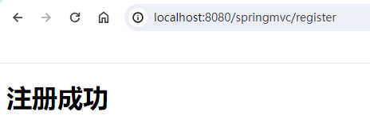
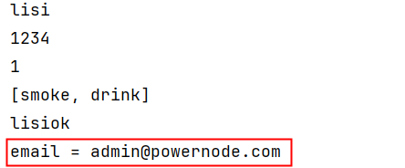

当前端页面提交的email是空字符串的时候：
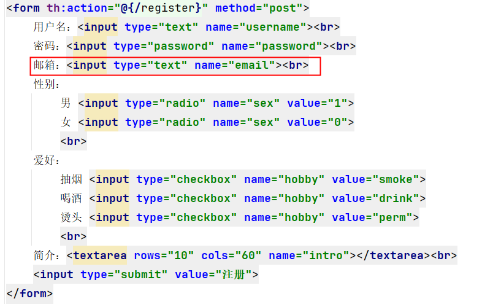


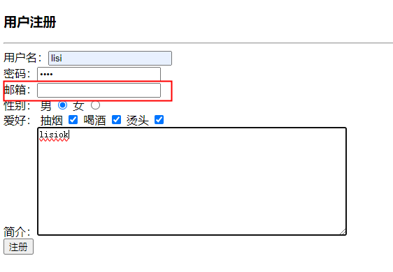

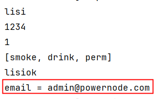


当前端提交的email不是空字符串的时候：
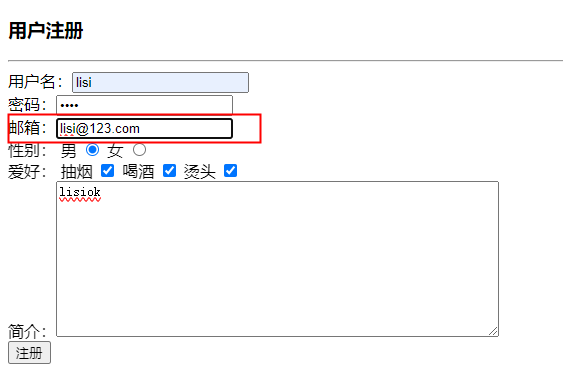
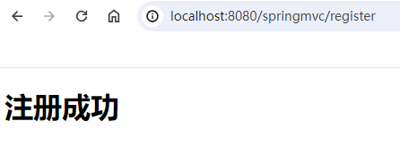
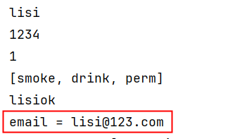


# 依靠控制器方法上的形参名来接?@RequestParam 这个注解是可以省略的，如果方法形参的名字和提交数据时的name相同，则 @RequestParam 可以省略?
但有一个前提：如果你采用的是Spring6+版本，你需要在pom.xml文件中指定编译参?-parameter'，配置如下：
```xml
&lt;build&gt;
    &lt;plugins&gt;
        &lt;plugin&gt;
            &lt;groupId&gt;org.apache.maven.plugins&lt;/groupId&gt;
            &lt;artifactId&gt;maven-compiler-plugin&lt;/artifactId&gt;
            &lt;version&gt;3.12.1&lt;/version&gt;
            &lt;configuration&gt;
                &lt;source&gt;21&lt;/source&gt;
                &lt;target&gt;21&lt;/target&gt;
                &lt;compilerArgs&gt;
                    &lt;arg&gt;-parameters&lt;/arg&gt;
                &lt;/compilerArgs&gt;
            &lt;/configuration&gt;
        &lt;/plugin&gt;
    &lt;/plugins&gt;
&lt;/build&gt;
```
**注意：如果你使用的是Spring5的版本，以上的配置是不需要的?*

Controller中的方法只需要这样写?*形参的名字必须和提交的数据的name一致！！！！！**
```java
@PostMapping(value="/register")
public String register(String username, String password, String sex, String[] hobby, String intro){
    System.out.println(username + "," + password + "," + sex + "," + Arrays.toString(hobby) + "," + intro);
    return "success";
}
```
测试结果?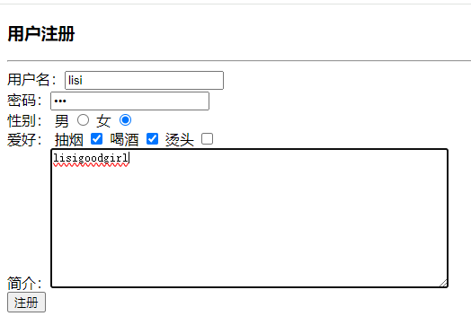
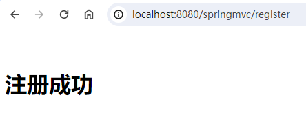
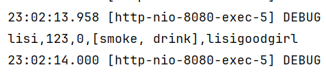


如果形参名和提交的数据的name不一致时?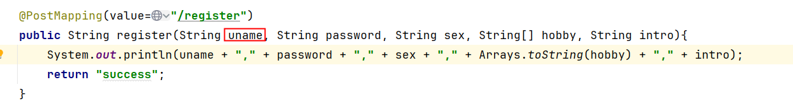
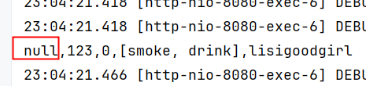

另外，还有一点，对于提交的hobby数据，也可以采用String来接收，不一定使用数组方式：
```java
@PostMapping(value="/register")
public String register(String username, String password, String sex, String hobby, String intro){
    System.out.println(username + "," + password + "," + sex + "," + hobby + "," + intro);
    return "success";
}
```
测试结果?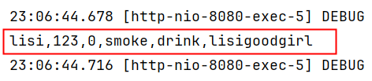
根据输出结果可以看到多个hobby是采用?”进行连接的?
# 使用POJO?JavaBean接收请求参数
以上方式大家可以看到，当提交的数据非常多时，方法的形参个数会非常多，这不是很好的设计。在SpringMVC中也可以使用POJO?JavaBean来接收请求参数。不过有一个非常重要的要求：`POJO类的属性名`必须和`请求参数的参数名`保持一致。提供以下的JavaBean?```java
package com.powernode.springmvc.pojo;

import java.util.Arrays;

/**
 * ClassName: User
 * Description:
 * Datetime: 2024/3/15 10:51
 * Author: 老杜@动力节点
 * Version: 1.0
 */
public class User {
    private Long id;
    private String username;
    private String password;
    private String sex;
    private String[] hobby;
    private String intro;

    public User() {
    }

    public User(Long id, String username, String password, String sex, String[] hobby, String intro) {
        this.id = id;
        this.username = username;
        this.password = password;
        this.sex = sex;
        this.hobby = hobby;
        this.intro = intro;
    }

    public Long getId() {
        return id;
    }

    public void setId(Long id) {
        this.id = id;
    }

    public String getUsername() {
        return username;
    }

    public void setUsername(String username) {
        this.username = username;
    }

    public String getPassword() {
        return password;
    }

    public void setPassword(String password) {
        this.password = password;
    }

    public String getSex() {
        return sex;
    }

    public void setSex(String sex) {
        this.sex = sex;
    }

    public String[] getHobby() {
        return hobby;
    }

    public void setHobby(String[] hobby) {
        this.hobby = hobby;
    }

    public String getIntro() {
        return intro;
    }

    public void setIntro(String intro) {
        this.intro = intro;
    }

    @Override
    public String toString() {
        return "User{" +
                "id=" + id +
                ", username='" + username + '\'' +
                ", password='" + password + '\'' +
                ", sex='" + sex + '\'' +
                ", hobby=" + Arrays.toString(hobby) +
                ", intro='" + intro + '\'' +
                '}';
    }
}

```

在控制器方法的形参位置上使用javabean来接收请求参数：
```java
@PostMapping("/register")
public String register(User user){
    System.out.println(user);
    return "success";
}
```


执行结果?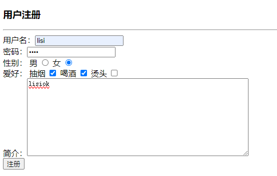
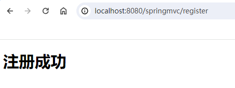
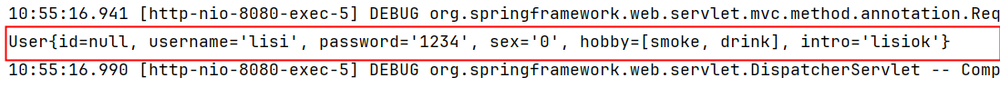

**底层的实现原理：反射机制。先获取请求参数的名字，因为请求参数的名字就是JavaBean的属性名，通过这种方式给对应的属性赋?*?

我们来测试一下：当JavaBean的属性名和请求参数的参数名不一致时，会出现什么问题？（注意：**getter和setter的方法名不修改，只修改属性名**?```java
package com.powernode.springmvc.pojo;

import java.util.Arrays;

/**
 * ClassName: User
 * Description:
 * Datetime: 2024/3/15 10:51
 * Author: 老杜@动力节点
 * Version: 1.0
 */
public class User {
    private Long id;
    private String uname;
    private String upwd;
    private String usex;
    private String[] uhobby;
    private String uintro;

    public User() {
    }

    public User(Long id, String username, String password, String sex, String[] hobby, String intro) {
        this.id = id;
        this.uname = username;
        this.upwd = password;
        this.usex = sex;
        this.uhobby = hobby;
        this.uintro = intro;
    }

    public Long getId() {
        return id;
    }

    public void setId(Long id) {
        this.id = id;
    }

    public String getUsername() {
        return uname;
    }

    public void setUsername(String username) {
        this.uname = username;
    }

    public String getPassword() {
        return upwd;
    }

    public void setPassword(String password) {
        this.upwd = password;
    }

    public String getSex() {
        return usex;
    }

    public void setSex(String sex) {
        this.usex = sex;
    }

    public String[] getHobby() {
        return uhobby;
    }

    public void setHobby(String[] hobby) {
        this.uhobby = hobby;
    }

    public String getIntro() {
        return uintro;
    }

    public void setIntro(String intro) {
        this.uintro = intro;
    }

    @Override
    public String toString() {
        return "User{" +
                "id=" + id +
                ", username='" + uname + '\'' +
                ", password='" + upwd + '\'' +
                ", sex='" + usex + '\'' +
                ", hobby=" + Arrays.toString(uhobby) +
                ", intro='" + uintro + '\'' +
                '}';
    }
}

```


测试结果?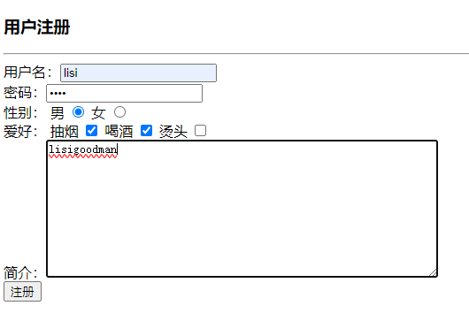
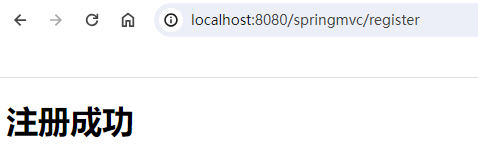
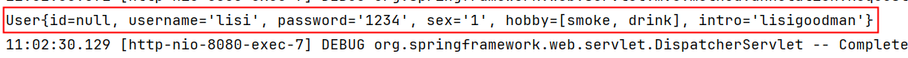
通过测试，我们得知：`请求参数名`可以和`JavaBean的属性名`不一致?
我们继续将其中一个属性的setter和getter方法名修改一下：


再次测试?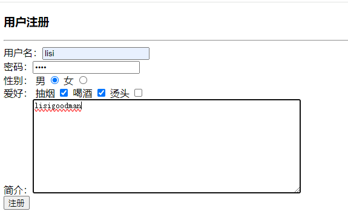
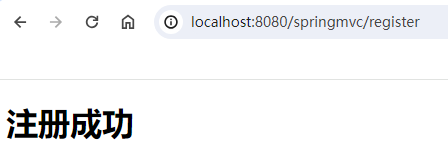


**通过测试可以看到：username属性没有赋上值。可见请求参数是否可以赋值到JavaBean对应的属性上，不是取决于属性名，而是setter方法?*?
# RequestHeader注解
该注解的作用是：将`请求头信息`映射到`方法的形参上`?和RequestParam注解功能相似，RequestParam注解的作用：将`请求参数`映射到`方法的形参`上?当然，对于RequestHeader注解来说，也有三个属性：value、required、defaultValue，和RequestParam一样，这里就不再赘述了?
测试?```java
@PostMapping("/register")
public String register(User user, 
                       @RequestHeader(value="Referer", required = false, defaultValue = "") 
                       String referer){
    System.out.println(user);
    System.out.println(referer);
    return "success";
}
```

执行结果?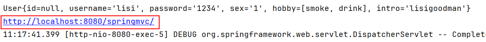

# CookieValue注解
该注解的作用：将`请求提交的Cookie数据`映射到`方法形参`?同样是有三个属性：value、required、defaultValue

前端页面中编写发送cookie的代码：
```html
<script type="text/javascript">
    function sendCookie(){
        document.cookie = "id=123456789; expires=Thu, 18 Dec 2025 12:00:00 UTC; path=/";
        document.location = "/springmvc/register";
    }
</script>
<button onclick="sendCookie()">向服务器端发送Cookie</button>
```

后端UserController代码?```java
    @GetMapping("/register")
    public String register(User user,
                           @RequestHeader(value="Referer", required = false, defaultValue = "")
                           String referer,
                           @CookieValue(value="id", required = false, defaultValue = "2222222222")
                           String id){
        System.out.println(user);
        System.out.println(referer);
        System.out.println(id);
        return "success";
    }
```

测试结果?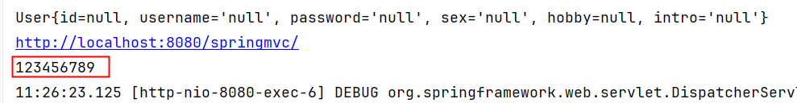

# 请求的中文乱码问?## get请求乱码
get请求数据在URI后面提交，这个乱码问题怎么解决呢？解决办法是找?CATALINA_HOME/config/server.xml文件，找到其中配置端口号的标?Connector>，在该标签中添加  URIEncoding="UTF-8"。但是对于高版本的Tomcat服务器来说，是不需要设置的，例如Tomcat10，Tomcat9，有如下的默认配置，在默认情况下URIEncoding使用的就是UTF-8的编码方式?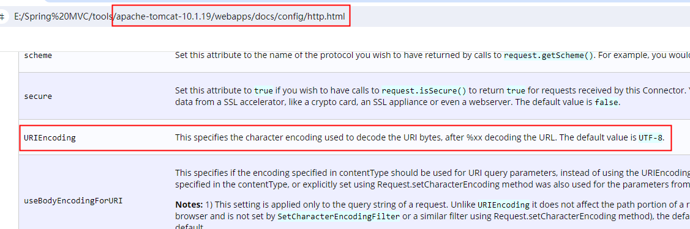
但对于低版本的Tomcat服务器，例如：Tomcat8。URIEncoding的默认配置是ISO-8859-1，因此在Tomcat8中需要手动配置server.xml文件?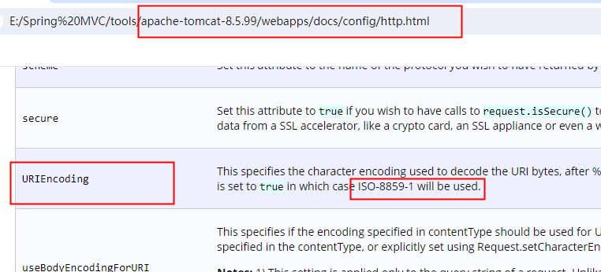
配置如下?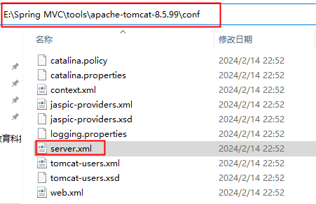
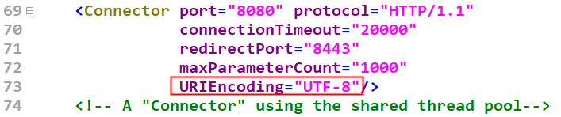


接下来，我们测试一下，在默认情况下，Tomcat10是否已经解决了get请求乱码问题?```html
<form th:action="@{/register}" method="get">
    用户名：<input type="text" name="username"><br>
    密码?input type="password" name="password"><br>
    性别?        ?<input type="radio" name="sex" value="1">
        ?<input type="radio" name="sex" value="0">
        <br>
    爱好?        抽烟 <input type="checkbox" name="hobby" value="smoke">
        喝酒 <input type="checkbox" name="hobby" value="drink">
        烫头 <input type="checkbox" name="hobby" value="perm">
        <br>
    简介：<textarea rows="10" cols="60" name="intro"></textarea><br>
    <input type="submit" value="注册">
</form>
```
注意，以上表单已经修改为get请求了?```java
@GetMapping("/register")
public String register(User user){
    System.out.println(user);
    return "success";
}
```
测试结果?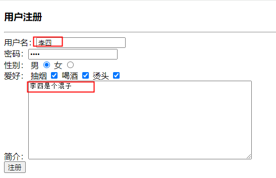
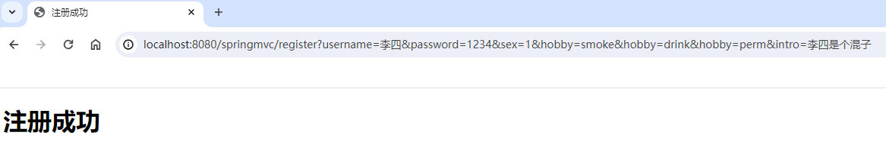
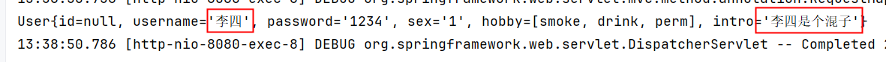

## post请求乱码
post请求是解决请求体的中文乱码问题。解决办法大家都知道?```java
request.setCharacterEncoding("UTF-8");
```

同样，对于高版本?*Tomcat10**服务器来说，针对请求体中的字符编码也是配置好的，默认也是采用了UTF-8，中文乱码问题也解决了，在这个文件中配置的：apache-tomcat-10.1.19\conf\web.xml
配置内容如下?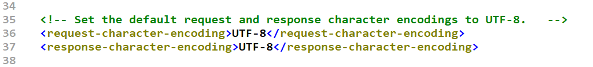
通过以上配置可以看到，Tomcat10对请求和响应都设置了默认的字符编码方式为UTF-8
**一定要注意：Tomcat9以及之前的版本，以上的配置是没有的?*

我们来测试一下，针对Tomcat10来说，SpringMVC会不会有乱码问题?```html
&lt;form th:action="@{/register}" method="post"&gt;
    用户名：&lt;input type="text" name="username"&gt;&lt;br&gt;
    密码?input type="password" name="password">&lt;br&gt;
    性别?        ?&lt;input type="radio" name="sex" value="1"&gt;
        ?&lt;input type="radio" name="sex" value="0"&gt;
        &lt;br&gt;
    爱好?        抽烟 &lt;input type="checkbox" name="hobby" value="smoke"&gt;
        喝酒 &lt;input type="checkbox" name="hobby" value="drink"&gt;
        烫头 &lt;input type="checkbox" name="hobby" value="perm"&gt;
        &lt;br&gt;
    简介：&lt;textarea rows="10" cols="60" name="intro"&gt;&lt;/textarea&gt;&lt;br&gt;
    &lt;input type="submit" value="注册"&gt;
&lt;/form&gt;
```
注意：以上表单已经修改为post请求
```java
@PostMapping("/register")
public String register(User user, HttpServletRequest request) throws UnsupportedEncodingException {
    System.out.println(user);
    return "success";
}
```
测试结果?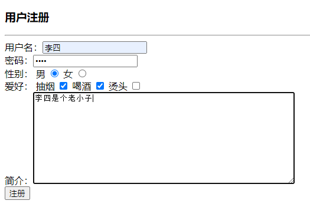


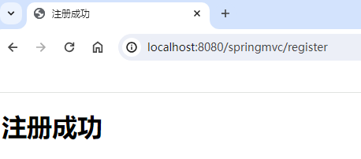
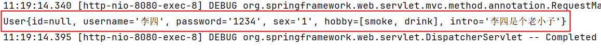
通过测试可以看到在Tomcat10当中，默认SpringMVC，发送POST请求，是不会出现乱码问题的?
有可能很多同学使用的不是Tomcat10，如果不是Tomcat10，则会出现乱码问题，我们来模拟一下乱码的产生，将apache-tomcat-10.1.19\conf\web.xml文件中的UTF-8配置修改为ISO-8859-1?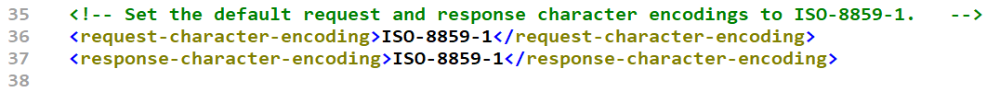
**一定要重启Tomcat10**，新的配置才能生效，来测试一下是否存在乱码：


那么，在SpringMVC中如何解决请求体的中文乱码问题呢？当然，还是使用`request.setCharacterEncoding("UTF-8")`
使用它有一个前提条件，要想解决请求体乱码问题，以上代码必须?`request.getParameter("username")`执行之前执行才有效?也就是说以上代码如果放在Controller的相关方法中执行是无效的，因为Controller的方法在执行之前 DispatcherServlet已经调用?`request.getParameter("username")`方法。因此在Controller方法中使用`request.setCharacterEncoding("UTF-8");`无效我们来测试一下：
```html
&lt;form th:action="@{/register}" method="post"&gt;
    用户名：&lt;input type="text" name="username"&gt;&lt;br&gt;
    密码?input type="password" name="password">&lt;br&gt;
    性别?        ?&lt;input type="radio" name="sex" value="1"&gt;
        ?&lt;input type="radio" name="sex" value="0"&gt;
        &lt;br&gt;
    爱好?        抽烟 &lt;input type="checkbox" name="hobby" value="smoke"&gt;
        喝酒 &lt;input type="checkbox" name="hobby" value="drink"&gt;
        烫头 &lt;input type="checkbox" name="hobby" value="perm"&gt;
        &lt;br&gt;
    简介：&lt;textarea rows="10" cols="60" name="intro"&gt;&lt;/textarea&gt;&lt;br&gt;
    &lt;input type="submit" value="注册"&gt;
&lt;/form&gt;
```
注意：以上表单已经修改为post请求
```java
@PostMapping("/register")
public String register(User user, HttpServletRequest request) throws UnsupportedEncodingException {
    request.setCharacterEncoding("UTF-8");
    System.out.println(user);
    return "success";
}
```


测试结果?

通过测试可以看到：在Controller当中调用`request.setCharacterEncoding("UTF-8")`是无法解决POST乱码问题的?

那怎么办呢？怎么样才能在DispatcherServlet之前执行`request.setCharacterEncoding("UTF-8")`呢？没错，我相信大家想到了：过滤器Filter。过滤器Filter可以在Servlet执行之前执行。有同学又说了：监听器不行吗？不行。因为我们需要对每一次请求解决乱码，而监听器只在服务器启动阶段执行一次。因此这里解决每一次请求的乱码问题，应该使用过滤器Filter。并且，告诉大家一个好消息，SpringMVC已经将这个字符编码的过滤器提前写好了，我们直接配置好即可：`CharacterEncodingFilter`，我们一起看一下它的源码：
```java
/*
 * Copyright 2002-2018 the original author or authors.
 *
 * Licensed under the Apache License, Version 2.0 (the "License");
 * you may not use this file except in compliance with the License.
 * You may obtain a copy of the License at
 *
 *      https://www.apache.org/licenses/LICENSE-2.0
 *
 * Unless required by applicable law or agreed to in writing, software
 * distributed under the License is distributed on an "AS IS" BASIS,
 * WITHOUT WARRANTIES OR CONDITIONS OF ANY KIND, either express or implied.
 * See the License for the specific language governing permissions and
 * limitations under the License.
 */

package org.springframework.web.filter;

import java.io.IOException;

import jakarta.servlet.FilterChain;
import jakarta.servlet.ServletException;
import jakarta.servlet.http.HttpServletRequest;
import jakarta.servlet.http.HttpServletResponse;

import org.springframework.lang.Nullable;
import org.springframework.util.Assert;

/**
 * Servlet Filter that allows one to specify a character encoding for requests.
 * This is useful because current browsers typically do not set a character
 * encoding even if specified in the HTML page or form.
 *
 * &lt;p&gt;This filter can either apply its encoding if the request does not already
 * specify an encoding, or enforce this filter's encoding in any case
 * ("forceEncoding"="true"). In the latter case, the encoding will also be
 * applied as default response encoding (although this will usually be overridden
 * by a full content type set in the view).
 *
 * @author Juergen Hoeller
 * @since 15.03.2004
 * @see #setEncoding
 * @see #setForceEncoding
 * @see jakarta.servlet.http.HttpServletRequest#setCharacterEncoding
 * @see jakarta.servlet.http.HttpServletResponse#setCharacterEncoding
 */
public class CharacterEncodingFilter extends OncePerRequestFilter {

	@Nullable
	private String encoding;

	private boolean forceRequestEncoding = false;

	private boolean forceResponseEncoding = false;


	/**
	 * Create a default {@code CharacterEncodingFilter},
	 * with the encoding to be set via {@link #setEncoding}.
	 * @see #setEncoding
	 */
	public CharacterEncodingFilter() {
	}

	/**
	 * Create a {@code CharacterEncodingFilter} for the given encoding.
	 * @param encoding the encoding to apply
	 * @since 4.2.3
	 * @see #setEncoding
	 */
	public CharacterEncodingFilter(String encoding) {
		this(encoding, false);
	}

	/**
	 * Create a {@code CharacterEncodingFilter} for the given encoding.
	 * @param encoding the encoding to apply
	 * @param forceEncoding whether the specified encoding is supposed to
	 * override existing request and response encodings
	 * @since 4.2.3
	 * @see #setEncoding
	 * @see #setForceEncoding
	 */
	public CharacterEncodingFilter(String encoding, boolean forceEncoding) {
		this(encoding, forceEncoding, forceEncoding);
	}

	/**
	 * Create a {@code CharacterEncodingFilter} for the given encoding.
	 * @param encoding the encoding to apply
	 * @param forceRequestEncoding whether the specified encoding is supposed to
	 * override existing request encodings
	 * @param forceResponseEncoding whether the specified encoding is supposed to
	 * override existing response encodings
	 * @since 4.3
	 * @see #setEncoding
	 * @see #setForceRequestEncoding(boolean)
	 * @see #setForceResponseEncoding(boolean)
	 */
	public CharacterEncodingFilter(String encoding, boolean forceRequestEncoding, boolean forceResponseEncoding) {
		Assert.hasLength(encoding, "Encoding must not be empty");
		this.encoding = encoding;
		this.forceRequestEncoding = forceRequestEncoding;
		this.forceResponseEncoding = forceResponseEncoding;
	}


	/**
	 * Set the encoding to use for requests. This encoding will be passed into a
	 * {@link jakarta.servlet.http.HttpServletRequest#setCharacterEncoding} call.
	 * &lt;p&gt;Whether this encoding will override existing request encodings
	 * (and whether it will be applied as default response encoding as well)
	 * depends on the {@link #setForceEncoding "forceEncoding"} flag.
	 */
	public void setEncoding(@Nullable String encoding) {
		this.encoding = encoding;
	}

	/**
	 * Return the configured encoding for requests and/or responses.
	 * @since 4.3
	 */
	@Nullable
	public String getEncoding() {
		return this.encoding;
	}

	/**
	 * Set whether the configured {@link #setEncoding encoding} of this filter
	 * is supposed to override existing request and response encodings.
	 * &lt;p&gt;Default is "false", i.e. do not modify the encoding if
	 * {@link jakarta.servlet.http.HttpServletRequest#getCharacterEncoding()}
	 * returns a non-null value. Switch this to "true" to enforce the specified
	 * encoding in any case, applying it as default response encoding as well.
	 * &lt;p&gt;This is the equivalent to setting both {@link #setForceRequestEncoding(boolean)}
	 * and {@link #setForceResponseEncoding(boolean)}.
	 * @see #setForceRequestEncoding(boolean)
	 * @see #setForceResponseEncoding(boolean)
	 */
	public void setForceEncoding(boolean forceEncoding) {
		this.forceRequestEncoding = forceEncoding;
		this.forceResponseEncoding = forceEncoding;
	}

	/**
	 * Set whether the configured {@link #setEncoding encoding} of this filter
	 * is supposed to override existing request encodings.
	 * &lt;p&gt;Default is "false", i.e. do not modify the encoding if
	 * {@link jakarta.servlet.http.HttpServletRequest#getCharacterEncoding()}
	 * returns a non-null value. Switch this to "true" to enforce the specified
	 * encoding in any case.
	 * @since 4.3
	 */
	public void setForceRequestEncoding(boolean forceRequestEncoding) {
		this.forceRequestEncoding = forceRequestEncoding;
	}

	/**
	 * Return whether the encoding should be forced on requests.
	 * @since 4.3
	 */
	public boolean isForceRequestEncoding() {
		return this.forceRequestEncoding;
	}

	/**
	 * Set whether the configured {@link #setEncoding encoding} of this filter
	 * is supposed to override existing response encodings.
	 * &lt;p&gt;Default is "false", i.e. do not modify the encoding.
	 * Switch this to "true" to enforce the specified encoding
	 * for responses in any case.
	 * @since 4.3
	 */
	public void setForceResponseEncoding(boolean forceResponseEncoding) {
		this.forceResponseEncoding = forceResponseEncoding;
	}

	/**
	 * Return whether the encoding should be forced on responses.
	 * @since 4.3
	 */
	public boolean isForceResponseEncoding() {
		return this.forceResponseEncoding;
	}


	@Override
	protected void doFilterInternal(
			HttpServletRequest request, HttpServletResponse response, FilterChain filterChain)
			throws ServletException, IOException {

		String encoding = getEncoding();
		if (encoding != null) {
			if (isForceRequestEncoding() || request.getCharacterEncoding() == null) {
				request.setCharacterEncoding(encoding);
			}
			if (isForceResponseEncoding()) {
				response.setCharacterEncoding(encoding);
			}
		}
		filterChain.doFilter(request, response);
	}

}

```


最核心的方法是?```java
@Override
protected void doFilterInternal(
        HttpServletRequest request, HttpServletResponse response, FilterChain filterChain)
        throws ServletException, IOException {

    String encoding = getEncoding();
    if (encoding != null) {
        if (isForceRequestEncoding() || request.getCharacterEncoding() == null) {
            request.setCharacterEncoding(encoding);
        }
        if (isForceResponseEncoding()) {
            response.setCharacterEncoding(encoding);
        }
    }
    filterChain.doFilter(request, response);
}
```
分析以上核心方法得知该过滤器对请求和响应都设置了字符编码方式?
- 当`强行使用请求字符编码方式为true`时，或者`请求对象的字符编码方式为null`时，设置请求的字符编码方式?- 当`强行使用响应字符编码方式为true`时，设置响应的字符编码方式?

根据以上代码，可以得出以下配置信息，在web.xml文件中对过滤器进行如下配置：
```xml
<!--字符编码过滤?->
<filter>
    <filter-name>characterEncodingFilter</filter-name>
    <filter-class>org.springframework.web.filter.CharacterEncodingFilter</filter-class>
    <init-param>
        <param-name>encoding</param-name>
        <param-value>UTF-8</param-value>
    </init-param>
    <init-param>
        <param-name>forceRequestEncoding</param-name>
        <param-value>true</param-value>
    </init-param>
    <init-param>
        <param-name>forceResponseEncoding</param-name>
        <param-value>true</param-value>
    </init-param>
</filter>
<filter-mapping>
    <filter-name>characterEncodingFilter</filter-name>
    <url-pattern>/*</url-pattern>
</filter-mapping>
```


我们再来测试，重启Tomcat10，看看乱码是否能够解决？
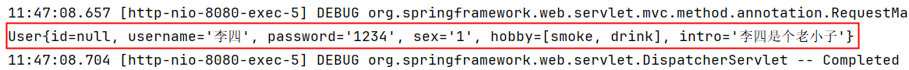

注意：针对于我们当前的Tomcat10的配置来说，它有默认的字符集ISO-8859-1，因此以下在web.xml文件中的配置是不能缺少的?```xml
&lt;init-param&gt;
    &lt;param-name&gt;forceRequestEncoding&lt;/param-name&gt;
    &lt;param-value&gt;true&lt;/param-value&gt;
&lt;/init-param&gt;
```
如果缺少它，仍然是会存在乱码问题的。自行测试一下！！！?

# Servlet中的三个域对?请求域：request
会话域：session
应用域：application
三个域都有以下三个方法：
```java
// 向域中存储数?void setAttribute(String name, Object obj);

// 从域中读取数?Object getAttribute(String name);

// 删除域中的数?void removeAttribute(String name);
```
主要是通过：setAttribute + getAttribute方法来完成在域中数据的传递和共享?
## request
接口名：HttpServletRequest
简称：request
request对象代表了一次请求。一次请求一个request?使用请求域的业务场景：在A资源中通过转发的方式跳转到B资源，因为是转发，因此从A到B是一次请求，如果想让A资源和B资源共享同一个数据，可以将数据存储到request域中?
## session
接口名：HttpSession
简称：session
session对象代表了一次会话。从打开浏览器开始访问，到最终浏览器关闭，这是一次完整的会话。每个会话session对象都对应一个JSESSIONID，而JSESSIONID生成后以cookie的方式存储在浏览器客户端。浏览器关闭，JSESSIONID失效，会话结束?
使用会话域的业务场景?
1. 在A资源中通过重定向的方式跳转到B资源，因为是重定向，因此从A到B是两次请求，如果想让A资源和B资源共享同一个数据，可以将数据存储到session域中?2. 登录成功后保存用户的登录状态?

## application
接口名：ServletContext
简称：application
application对象代表了整个web应用，服务器启动时创建，服务器关闭时销毁。对于一个web应用来说，application对象只有一个?使用应用域的业务场景：记录网站的在线人数?
# request域对?在SpringMVC中，在request域中共享数据有以下几种方式：

1. 使用原生Servlet API方式?2. 使用Model接口?3. 使用Map接口?4. 使用ModelMap类?5. 使用ModelAndView类?
## 使用原生Servlet API方式
在Controller的方法上使用HttpServletRequest?```java
package com.powernode.springmvc.controller;

import jakarta.servlet.http.HttpServletRequest;
import org.springframework.stereotype.Controller;
import org.springframework.web.bind.annotation.RequestMapping;

/**
 * ClassName: RequestScopeTestController
 * Description:
 * Datetime: 2024/3/18 15:20
 * Author: 老杜@动力节点
 * Version: 1.0
 */
@Controller
public class RequestScopeTestController {

    @RequestMapping("/testServletAPI")
    public String testServletAPI(HttpServletRequest request){
        // 向request域中存储数据
        request.setAttribute("testRequestScope", "在SpringMVC中使用原生Servlet API实现request域数据共?);
        return "view";
    }
}

```

页面?```html
<!DOCTYPE html>
&lt;html lang="en" xmlns:th="http://www.thymeleaf.org"&gt;
&lt;head&gt;
    &lt;meta charset="UTF-8"&gt;
    &lt;title&gt;view&lt;/title&gt;
&lt;/head&gt;
&lt;body&gt;
&lt;div th:text="${testRequestScope}"&gt;&lt;/div&gt;
&lt;/body&gt;
&lt;/html&gt;
```

超链接：
```html
<!DOCTYPE html>
&lt;html lang="en" xmlns:th="http://www.thymeleaf.org"&gt;
&lt;head&gt;
    &lt;meta charset="UTF-8"&gt;
    &lt;title&gt;index&lt;/title&gt;
&lt;/head&gt;
&lt;body&gt;
&lt;h1&gt;Index Page&lt;/h1&gt;
&lt;a th:href="@{/testServletAPI}"&gt;在SpringMVC中使用原生Servlet API实现request域数据共?/a>&lt;br&gt;
&lt;/body&gt;
&lt;/html&gt;
```
测试结果?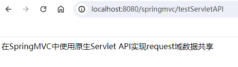

这种方式当然可以，用SpringMVC框架，不建议使用原生Servlet API?
## 使用Model接口
```java
@RequestMapping("/testModel")
public String testModel(Model model){
    // 向request域中存储数据
    model.addAttribute("testRequestScope", "在SpringMVC中使用Model接口实现request域数据共?);
    return "view";
}
```

## 使用Map接口
```java
@RequestMapping("/testMap")
public String testMap(Map&lt;String, Object&gt; map){
    // 向request域中存储数据
    map.put("testRequestScope", "在SpringMVC中使用Map接口实现request域数据共?);
    return "view";
}
```
## 使用ModelMap?```java
@RequestMapping("/testModelMap")
public String testModelMap(ModelMap modelMap){
    // 向request域中存储数据
    modelMap.addAttribute("testRequestScope", "在SpringMVC中使用ModelMap实现request域数据共?);
    return "view";
}
```

### Model、Map、ModelMap的关?可以在以上Model、Map、ModelMap的测试程序中将其输出，看看输出什么：

看不出来什么区别，从输出结果上可以看到都是一样的?可以将其运行时类名输出：

通过输出结果可以看出，无论是Model、Map还是ModelMap，底层实例化的对象都是：BindingAwareModelMap?

可以查看BindingAwareModelMap的继承结构：
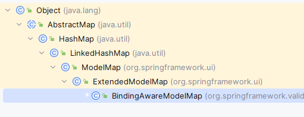
通过继承结构可以看出：BindingAwareModelMap继承了ModelMap，而ModelMap又实现了Map接口?另外，请看以下源码：
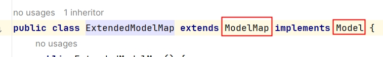
可以看出ModelMap又实现了Model接口。因此表面上是采用了不同方式，底层本质上是相同的?SpringMVC之所以提供了这些方式，目的就是方便程序员的使用，提供了多样化的方式，可见它的重要性?
## 使用ModelAndView?在SpringMVC框架中为了更好的体现MVC架构模式，提供了一个类：ModelAndView。这个类的实例封装了Model和View。也就是说这个类既封装业务处理之后的数据，也体现了跳转到哪个视图。使用它也可以完成request域数据共享?```java
@RequestMapping("/testModelAndView")
public ModelAndView testModelAndView(){
    // 创建“模型与视图对象?    ModelAndView modelAndView = new ModelAndView();
    // 绑定数据
    modelAndView.addObject("testRequestScope", "在SpringMVC中使用ModelAndView实现request域数据共?);
    // 绑定视图
    modelAndView.setViewName("view");
    // 返回
    return modelAndView;
}
```
这种方式需要注意的是：

1. 方法的返回值类型不是String，而是ModelAndView对象?2. ModelAndView不是出现在方法的参数位置，而是在方法体中new的?3. 需要调用addObject向域中存储数据?4. 需要调用setViewName设置视图的名字?

### ModelAndView源码分析
以上我们通过了五种方式完成了request域数据共享，包括：原生Servlet API，Model、Map、ModelMap、ModelAndView
其中后四种：Model、Map、ModelMap、ModelAndView。这四种方式在底层DispatcherServlet调用我们的Controller之后，返回的对象都是ModelAndView，这个可以通过源码进行分析?
在以上四种方式中，拿Model举例，添加断点进行调试：

启动服务器，发送请求，走到断点?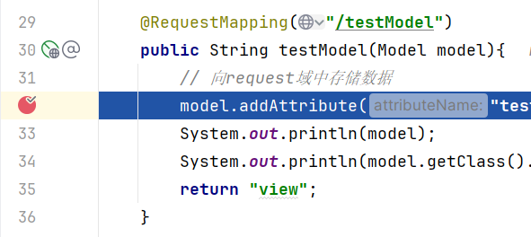
查看VM Stack信息?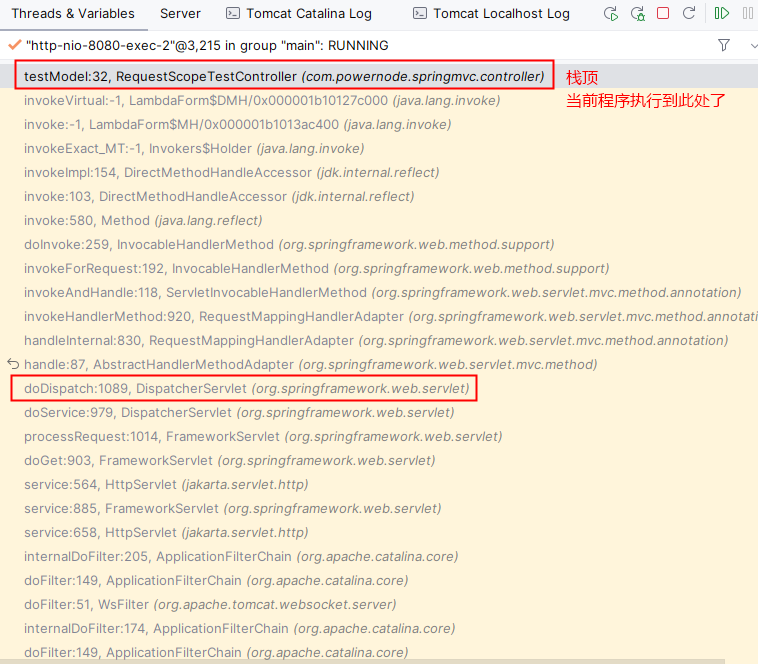
查看DispatcherServlet?089行，源码如下?
可以看到这里，无论你使用哪种方式，最终都要返回一个ModelAndView对象?
提醒：大家可以通过以下断点调试方式，采用一级一级返回，最终可以看到都会返回ModelAndView对象?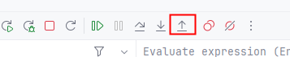

# session域对?在SpringMVC中使用session域共享数据，实现方式有多种，其中比较常见的两种方式：

1. 使用原生Servlet API
2. 使用SessionAttributes注解


## 使用原生Servlet API
```java
package com.powernode.springmvc.controller;

import jakarta.servlet.http.HttpServletRequest;
import jakarta.servlet.http.HttpSession;
import org.springframework.stereotype.Controller;
import org.springframework.web.bind.annotation.RequestMapping;

/**
 * ClassName: SessionScopeTestController
 * Description:
 * Datetime: 2024/3/18 17:18
 * Author: 老杜@动力节点
 * Version: 1.0
 */
@Controller
public class SessionScopeTestController {

    @RequestMapping("/testSessionScope1")
    public String testServletAPI(HttpSession session) {
        // 向会话域中存储数?        session.setAttribute("testSessionScope1", "使用原生Servlet API实现session域共享数?);
        return "view";
    }

}
```


视图页面?```html
<div th:text="${session.testSessionScope1}"></div>
```

超链接：
```html
<a th:href="@{/testSessionScope1}">在SpringMVC中使用原生Servlet API实现session域共享数?/a><br>
```

## 使用SessionAttributes注解
使用SessionAttributes注解标注Controller?```java
package com.powernode.springmvc.controller;

import jakarta.servlet.http.HttpServletRequest;
import jakarta.servlet.http.HttpSession;
import org.springframework.stereotype.Controller;
import org.springframework.ui.ModelMap;
import org.springframework.web.bind.annotation.RequestMapping;
import org.springframework.web.bind.annotation.SessionAttributes;

/**
 * ClassName: SessionScopeTestController
 * Description:
 * Datetime: 2024/3/18 17:18
 * Author: 老杜@动力节点
 * Version: 1.0
 */
@Controller
@SessionAttributes(value = {"x", "y"})
public class SessionScopeTestController {

    @RequestMapping("/testSessionScope2")
    public String testSessionAttributes(ModelMap modelMap){
        // 向session域中存储数据
        modelMap.addAttribute("x", "我是埃克?);
        modelMap.addAttribute("y", "我是?);

        return "view";
    }
}
```

注意：SessionAttributes注解使用在Controller类上。标注了当key?x 或?y 时，数据将被存储到会话session中。如果没?SessionAttributes注解，默认存储到request域中?
# application域对?在SpringMVC实现application域数据共享，最常见的方案就是直接使用Servlet API了：
```java
package com.powernode.springmvc.controller;

import jakarta.servlet.ServletContext;
import jakarta.servlet.http.HttpServletRequest;
import org.springframework.stereotype.Controller;
import org.springframework.web.bind.annotation.RequestMapping;

/**
 * ClassName: ApplicationScopeTestController
 * Description:
 * Datetime: 2024/3/18 17:37
 * Author: 老杜@动力节点
 * Version: 1.0
 */
@Controller
public class ApplicationScopeTestController {

    @RequestMapping("/testApplicationScope")
    public String testApplicationScope(HttpServletRequest request){
        
        // 获取ServletContext对象
        ServletContext application = request.getServletContext();

        // 向应用域中存储数?        application.setAttribute("applicationScope", "我是应用域当中的一条数?);

        return "view";
    }
}

```


视图页面?```html
<div th:text="${application.applicationScope}"></div>
```

超链接：
```html
<a th:href="@{/testApplicationScope}">在SpringMVC中使用ServletAPI实现application域共享数?/a><br>
```

# SpringMVC中视图的实现原理
## Spring MVC视图支持可配?在Spring MVC中，视图View是支持定制的，例如我们之前在 springmvc.xml 文件中进行了如下的配置：
```xml
<!--视图解析?->
<bean id="thymeleafViewResolver" class="org.thymeleaf.spring6.view.ThymeleafViewResolver">
    <!--作用于视图渲染的过程中，可以设置视图渲染后输出时采用的编码字符集-->
    <property name="characterEncoding" value="UTF-8"/>
    <!--如果配置多个视图解析器，它来决定优先使用哪个视图解析器，它的值越小优先级越高-->
    <property name="order" value="1"/>
    <!--?ThymeleafViewResolver 渲染模板时，会使用该模板引擎来解析、编译和渲染模板-->
    <property name="templateEngine">
        <bean class="org.thymeleaf.spring6.SpringTemplateEngine">
            <!--用于指定 Thymeleaf 模板引擎使用的模板解析器。模板解析器负责根据模板位置、模板资源名称、文件编码等信息，加载模板并对其进行解析-->
            <property name="templateResolver">
                <bean class="org.thymeleaf.spring6.templateresolver.SpringResourceTemplateResolver">
                    <!--设置模板文件的位置（前缀?->
                    <property name="prefix" value="/WEB-INF/templates/"/>
                    <!--设置模板文件后缀（后缀），Thymeleaf文件扩展名不一定是html，也可以是其他，例如txt，大部分都是html-->
                    <property name="suffix" value=".html"/>
                    <!--设置模板类型，例如：HTML,TEXT,JAVASCRIPT,CSS?->
                    <property name="templateMode" value="HTML"/>
                    <!--用于模板文件在读取和解析过程中采用的编码字符?->
                    <property name="characterEncoding" value="UTF-8"/>
                </bean>
            </property>
        </bean>
    </property>
</bean>
```
以上的配置表明当前SpringMVC框架使用的视图View是Thymeleaf的?如果你需要换成其他的视图View，修改以上的配置即可。这样就可以非常轻松的完成视图View的扩展?这种设计是完全符合OCP开闭原则的。视图View和框架是解耦合的，耦合度低扩展能力强。视图View可以通过配置文件进行灵活切换?
## Spring MVC支持的常见视?Spring MVC支持的常见视图包括：

1. InternalResourceView：内部资源视图（Spring MVC框架内置的，专门为`JSP模板语法`准备的）
2. RedirectView：重定向视图（Spring MVC框架内置的，用来完成重定向效果）
3. ThymeleafView：Thymeleaf视图（第三方的，为`Thymeleaf模板语法`准备的）
4. FreeMarkerView：FreeMarker视图（第三方的，为`FreeMarker模板语法`准备的）
5. VelocityView：Velocity视图（第三方的，为`Velocity模板语法`准备的）
6. PDFView：PDF视图（第三方的，专门用来生成pdf文件视图?7. ExcelView：Excel视图（第三方的，专门用来生成excel文件视图?8. ......

## 实现视图机制的核心接?实现视图的核心类与接口包括：

1. DispatcherServlet类（前端控制器）?   1. 职责：在整个Spring MVC执行流程中，负责中央调度?   2. 核心方法：doDispatch


2. ViewResolver接口（视图解析器）：
   1. 职责：负责将`逻辑视图名`转换为`物理视图名`，最终创建View接口的实现类，即视图实现类对象?   2. 核心方法：resolveViewName


3. View接口（视图）:
   1. 职责：负责将模型数据Model渲染为视图格式（HTML代码），并最终将生成的视图（HTML代码）输出到客户端。（它负责将模板语言转换成HTML代码?   2. 核心方法：render

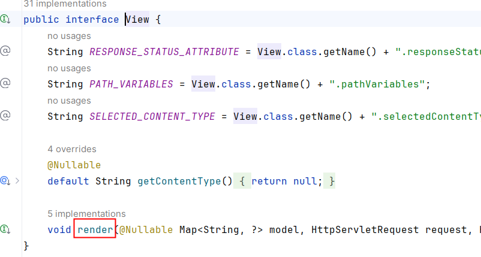

4. ViewResolverRegistry（视图解析器注册器）?   1. 负责在web容器（Tomcat）启动的时候，完成视图解析器的注册。如果有多个视图解析器，会将视图解析器对象按照order的配置放入List集合?
**总结?*

- **实现视图的核心类和接口包括：ViewResolverRegistry、DispatcherServlet、ViewResolver、View**
- **如果你想定制自己的视图组件：**
   - **编写类实现ViewResolver接口，实现resolveViewName方法，在该方法中完成**`**逻辑视图?*`**转换?*`**物理视图?*`**，并返回View对象?*
   - **编写类实现View接口，实现render方法，在该方法中将模板语言转换成HTML代码，并将HTML代码响应到浏览器?*
- **如果Spring MVC框架中使用Thymeleaf作为视图技术。那么相关的类包括：**
   - **ThymeleafView**
   - **ThymeleafViewResolver**


## 实现视图机制的原理描?假设我们SpringMVC中使用了Thymeleaf作为视图?第一步：浏览器发送请求给web服务?第二步：Spring MVC中的DispatcherServlet接收到请?第三步：DispatcherServlet根据请求路径分发到对应的Controller
第四步：DispatcherServlet调用Controller的方?第五步：Controller的方法处理业务并返回一个`逻辑视图名`给DispatcherServlet
第六步：DispatcherServlet调用ThymeleafViewResolver的resolveViewName方法，将`逻辑视图名`转换为`物理视图名`，并创建ThymeleafView对象返回给DispatcherServlet
第七步：DispatcherServlet再调用ThymeleafView的render方法，render方法将模板语言转换为HTML代码，响应给浏览器，完成最终的渲染?

假设我们SpringMVC中使用了JSP作为视图?第一步：浏览器发送请求给web服务?第二步：Spring MVC中的DispatcherServlet接收到请?第三步：DispatcherServlet根据请求路径分发到对应的Controller
第四步：DispatcherServlet调用Controller的方?第五步：Controller的方法处理业务并返回一个`逻辑视图名`给DispatcherServlet
第六步：DispatcherServlet调用`InternalResourceViewResolver`的`resolveViewName`方法，将`逻辑视图名`转换为`物理视图名`，并创建`InternalResourceView`对象返回给DispatcherServlet
第七步：DispatcherServlet再调用`InternalResourceView`的`render`方法，render方法将模板语言转换为HTML代码，响应给浏览器，完成最终的渲染?

## 逻辑视图名到物理视图名的转换
逻辑视图名最终转换的物理视图名是什么，取决再springmvc.xml文件中视图解析器的配置：
假如视图解析器配置的是ThymeleafViewResolver，如下：
```xml
<bean id="thymeleafViewResolver" class="org.thymeleaf.spring6.view.ThymeleafViewResolver">
    <property name="characterEncoding" value="UTF-8"/>
    <property name="order" value="1"/>
    <property name="templateEngine">
        <bean class="org.thymeleaf.spring6.SpringTemplateEngine">
            <property name="templateResolver">
                <bean class="org.thymeleaf.spring6.templateresolver.SpringResourceTemplateResolver">
                    <property name="prefix" value="/WEB-INF/templates/"/>
                    <property name="suffix" value=".html"/>
                    <property name="templateMode" value="HTML"/>
                    <property name="characterEncoding" value="UTF-8"/>
                </bean>
            </property>
        </bean>
    </property>
</bean>
```
以下程序返回逻辑视图名：index
```java
@RequestMapping("/index")
public String toIndex(){
    return "index";
}
```
最终逻辑视图?index" 转换为物理视图名?WEB-INF/templates/index.html

假如视图解析器配置的是InternalResourceViewResolver，如下：
```xml
<bean id="viewResolver" class="org.springframework.web.servlet.view.InternalResourceViewResolver">
  <property name="prefix" value="/WEB-INF/templates/"/>
  <property name="suffix" value=".jsp"/>
</bean>
```
以下程序返回逻辑视图名：index
```java
@RequestMapping("/index")
public String toIndex(){
    return "index";
}
```
最终逻辑视图?index" 转换为物理视图名?WEB-INF/templates/index.jsp

# Thymeleaf视图
我们在学习前面内容的时候，采用的都是Thymeleaf视图。我们再来测试一下，看看底层创建的视图对象是不是`ThymeleafView`
springmvc.xml配置内容如下?```xml
<?xml version="1.0" encoding="UTF-8"?>
<beans xmlns="http://www.springframework.org/schema/beans"
       xmlns:xsi="http://www.w3.org/2001/XMLSchema-instance"
       xmlns:context="http://www.springframework.org/schema/context"
       xsi:schemaLocation="http://www.springframework.org/schema/beans http://www.springframework.org/schema/beans/spring-beans.xsd http://www.springframework.org/schema/context https://www.springframework.org/schema/context/spring-context.xsd">

    <!--组件扫描-->
    &lt;context:component-scan base-package="com.powernode.springmvc.controller"/&gt;

    <!--视图解析?->
    &lt;bean id="thymeleafViewResolver" class="org.thymeleaf.spring6.view.ThymeleafViewResolver"&gt;
        &lt;property name="characterEncoding" value="UTF-8"/&gt;
        &lt;property name="order" value="1"/&gt;
        &lt;property name="templateEngine"&gt;
            &lt;bean class="org.thymeleaf.spring6.SpringTemplateEngine"&gt;
                &lt;property name="templateResolver"&gt;
                    &lt;bean class="org.thymeleaf.spring6.templateresolver.SpringResourceTemplateResolver"&gt;
                        &lt;property name="prefix" value="/WEB-INF/thymeleaf/"/&gt;
                        &lt;property name="suffix" value=".html"/&gt;
                        &lt;property name="templateMode" value="HTML"/&gt;
                        &lt;property name="characterEncoding" value="UTF-8"/&gt;
                    &lt;/bean&gt;
                &lt;/property&gt;
            &lt;/bean&gt;
        &lt;/property&gt;
    &lt;/bean&gt;
&lt;/beans&gt;
```
Controller代码如下?```java
package com.powernode.springmvc.controller;

import org.springframework.stereotype.Controller;
import org.springframework.web.bind.annotation.RequestMapping;

@Controller
public class IndexController {
    @RequestMapping("/index")
    public String toIndex(){
        return "index";
    }
}

```
视图页面?```html
<!DOCTYPE html>
&lt;html lang="en" xmlns:th="http://www.thymeleaf.org"&gt;
&lt;head&gt;
    &lt;meta charset="UTF-8"&gt;
    &lt;title&gt;index page&lt;/title&gt;
&lt;/head&gt;
&lt;body&gt;
&lt;h1&gt;index page&lt;/h1&gt;
&lt;/body&gt;
&lt;/html&gt;
```


添加断点：在DispatcherServlet的doDispatch方法的下图位置添加断?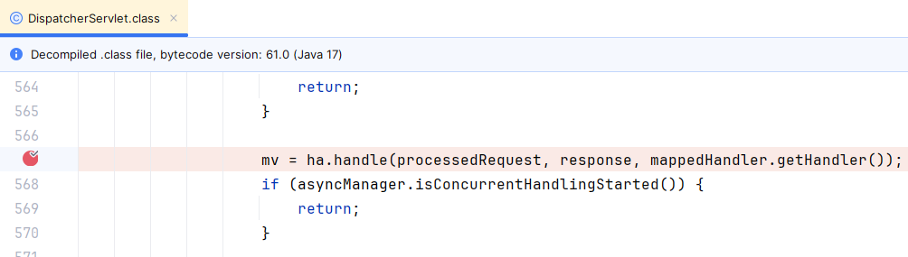

启动Tomcat，在浏览器地址栏上发送请求：http://localhost:8080/springmvc/index

程序走到以上位置，这行代码是调用对应的Controller，并且Controller最终会返回ModelAndView对象：mv
按照我们之前所讲，返回mv之后，接下来就是视图处理与渲染，接着往下走，走到下图这一行：

这个方法的作用是处理分发结果，就是在这个方法当中进行了视图的处理与渲染，进入该方法：

进去之后走到上图位置：这个方法就是用来渲染页面的方法，再进入该方法：

走到上图位置就可以看到底层创建的是ThymeleafView对象?
# JSP视图（了解）
我们再来跟一下源码，看看JSP视图底层创建的是不是InternalResourceView对象?我们前面说过 InternalResourceView是SpringMVC框架内置的，翻译为内部资源视图，SpringMVC把JSP看做是内部资源。可见JSP在之前的技术栈中有很高的地位?不过，当下流行的开发中JSP使用较少，这里不再详细讲解。只是测试一下?springmvc.xml配置如下?```xml
<?xml version="1.0" encoding="UTF-8"?>
<beans xmlns="http://www.springframework.org/schema/beans"
       xmlns:xsi="http://www.w3.org/2001/XMLSchema-instance"
       xmlns:context="http://www.springframework.org/schema/context"
       xsi:schemaLocation="http://www.springframework.org/schema/beans http://www.springframework.org/schema/beans/spring-beans.xsd http://www.springframework.org/schema/context https://www.springframework.org/schema/context/spring-context.xsd">

    <!--组件扫描-->
    <context:component-scan base-package="com.powernode.springmvc.controller"/>

    <!--视图解析?->
    <bean id="viewResolver" class="org.springframework.web.servlet.view.InternalResourceViewResolver">
        <property name="prefix" value="/WEB-INF/jsp/"/>
        <property name="suffix" value=".jsp"/>
    </bean>
</beans>
```
Controller代码如下?```java
package com.powernode.springmvc.controller;

import org.springframework.stereotype.Controller;
import org.springframework.web.bind.annotation.RequestMapping;

@Controller
public class IndexController {
    @RequestMapping("/index")
    public String toIndex(){
        return "index";
    }
}
```
视图页面?```html
<%@ page contentType="text/html;charset=UTF-8" language="java" %>
<html>
  <head>
    <title>index jsp</title>
  </head>
  <body>
    <h1>index jsp!</h1>
  </body>
</html>
```

启动web容器，添加断点跟踪：
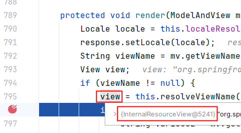
通过测试得知：对于JSP视图来说，底层创建的视图对象是InternalResourceView?
# 转发与重定向
## 回顾转发和重定向区别

1. 转发是一次请求。因此浏览器地址栏上的地址不会发生变化?2. 重定向是两次请求。因此浏览器地址栏上的地址会发生变化?3. 转发的代码实现：request.getRequestDispatcher("/index").forward(request, response);
4. 重定向的代码实现：response.sendRedirect("/webapproot/index");
5. 转发是服务器内部资源跳转，由服务器来控制。不可实现跨域访问?6. 重定向可以完成内部资源的跳转，也可以完成跨域跳转?7. 转发的方式可以访问WEB-INF目录下受保护的资源?8. 重定向相当于浏览器重新发送了一次请求，在浏览器直接发送的请求是无法访问WEB-INF目录下受保护的资源的?9. 转发原理?   1. 假设发送了 /a 请求，执行了 AServlet
   2. 在AServlet 中通过`request.getRequestDispatcher("/b").forward(request,response);`转发到BServlet
   3. 从AServlet跳转到BServlet是服务器内部来控制的。对于浏览器而言，浏览器只发送了一?/a 请求?10. 重定向原理：
   1. 假设发送了 /a 请求，执行了 AServlet
   2. 在AServlet 中通过`response.sendRedirect("/webapproot/b")`重定向到BServlet
   3. 此时服务器会将请求路径`/webapproot/b`响应给浏览器
   4. 浏览器会自发的再次发送`/webapproot/b`请求来访问BServlet
   5. 因此对于重定向来说，发送了两次请求，一次是 `/webapproot/a`，另一次是`/webapproot/b`?
以上所描述的是使用原生Servlet API来完成转发和重定向。在Spring MVC中是如何转发和重定向的呢?
## forward
在Spring MVC中默认就是转发的方式，我们之前所写的程序，都是转发的方式。只不过都是转发到Thymeleaf的模板文件xxx.html上?那么，在Spring MVC中如何转发到另一个Controller上呢？可以使用Spring MVC的`forward`
代码实现如下?```java
package com.powernode.springmvc.controller;

import org.springframework.stereotype.Controller;
import org.springframework.web.bind.annotation.RequestMapping;

@Controller
public class IndexController {

    @RequestMapping("/a")
    public String toA(){
        return "forward:/b";
    }

    @RequestMapping("/b")
    public String toB(){
        return "b";
    }
}
```
视图页面?```html
<!DOCTYPE html>
<html lang="en" xmlns:th="http://www.thymeleaf.org">
<head>
    <meta charset="UTF-8">
    <title>b</title>
</head>
<body>
<h1>Page B!!!</h1>
</body>
</html>
```
启动服务器，浏览器地址栏上输入：http://localhost:8080/springmvc/a

通过测试，可以顺利的完成转发，转发是一次请求，可以看到地址栏上的地址没有发生改变?
我们来跟踪一下源码，看看以上程序执行过程中，创建了几个视图对象，分别是什么？

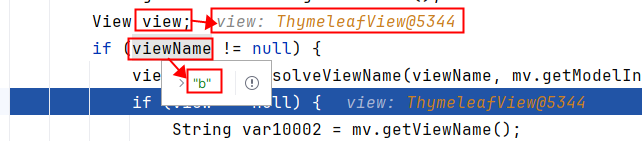


通过源码的跟踪得知：整个请求处理过程中，一共创建了两个视图对象

- InternalResourceView
- ThymeleafView

这说明转发底层创建的视图对象是：InternalResourceView?**思考：既然会创建InternalResourceView，应该会对应一个视图解析器呀（InternalResourceViewResolver）？但是我在springmvc.xml文件中只配置了ThymeleafViewResolver，并没有配置InternalResourceViewResolver呀？这是为什么？**
**这是因为**`**forward:**`** 后面的不?*`**逻辑视图?*`**，而是一?*`**请求路径**`**。因此转发是不需要视图解析器的?*
**另外，转发使用的是InternalResourceView，也说明了转发是内部资源的跳转。（Internal是内部的意思，Resource是资源的意思。）**

## redirect
redirect是专门完成重定向效果的。和forward语法类似，只需要将之前?`return "forward:/b"`修改?`return "redirect:/b"`即可?```java
package com.powernode.springmvc.controller;

import org.springframework.stereotype.Controller;
import org.springframework.web.bind.annotation.RequestMapping;

@Controller
public class IndexController {

    @RequestMapping("/a")
    public String toA(){
        return "redirect:/b";
    }

    @RequestMapping("/b")
    public String toB(){
        return "b";
    }
}

```
视图页面?```html
<!DOCTYPE html>
<html lang="en" xmlns:th="http://www.thymeleaf.org">
<head>
    <meta charset="UTF-8">
    <title>b</title>
</head>
<body>
<h1>Page B!!!</h1>
</body>
</html>
```
启动服务器，浏览器地址栏上输入：http://localhost:8080/springmvc/a
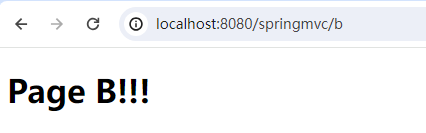
可见，重定向是两次请求，地址栏上的地址发生了改变?
可以看一下源码，在重定向的时候，Spring MVC创建哪个视图对象?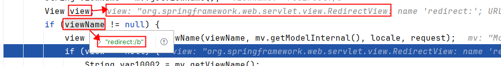
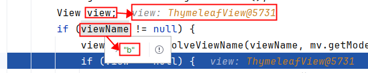
通过断点调试可以看出，当重定向的时候，SpringMVC会创建一个重定向视图对象?*RedirectView**。这个视图对象也是SpringMVC框架内置的?另外可以看出重定向之后的第二次请求创建的视图对象就是ThymeleafView了?

注意：从springmvc应用重定向到springmvc2应用（跨域），语法是?```java
@RequestMapping("/a")
public String a(){
    return "redirect:http://localhost:8080/springmvc2/b";
}
```
可以自行测试一下！！！

# <mvc:view-controller>
`<mvc:view-controller>` 配置用于将某个请求映射到特定的视图上，即指定某一?URL 请求到一个视图资源的映射，使得这个视图资源可以被访问。它相当于是一个独立的处理程序，不需要编写任?Controller，只需要指?URL 和对应的视图名称就可以了?一般情况下，`<mvc:view-controller>` 配置可以替代一些没有业务逻辑?Controller，例如首页、错误页面等。当用户访问配置?URL 时，框架将直接匹配到对应的视图，而无需再经过其他控制器的处理?`<mvc:view-controller>` 配置的格式如下： 
```xml
&lt;mvc:view-controller path="/如何访问该页? view-name="对应的逻辑视图名称" /&gt;
```
其中?
- `path`：被映射?URL 路径?- `view-name`：对应的逻辑视图名称?
例如，配置首页的映射?```xml
<mvc:view-controller path="/" view-name="index" />
```
上述配置将会匹配上访问应用程序的根路径，如：http://localhost:8080/。当用户在浏览器中访问该根路径时，就会直接渲染名?`index` 的视图?
# &lt;mvc:annotation-driven/&gt;
在SpringMVC中，如果在springmvc.xml文件中配置了 `&lt;mvc:view-controller&gt;`，就需要同时在springmvc.xml文件中添加如下配置：
```xml
<mvc:annotation-driven/>
```
该配置的作用是：启用Spring MVC的注解?如果没有以上的配置，Controller就无法访问到。访问之前的Controller会发?404 问题?
# 访问静态资?一个项目可能会包含大量的静态资源，比如：css、js、images等?由于我们DispatcherServlet的url-pattern配置的是?”，之前我们说过，这?/"代表的是除jsp请求之外的所有请求，也就是说访问应用中的静态资源，也会走DispatcherServlet，这会导?04错误，无法访问静态资源，如何解决，两种方案：

- 使用默认 Servlet 处理静态资?- 使用 `mvc:resources` 标签配置静态资源处?
这两种方式都可以。自行选择?
## 使用默认Servlet处理静态资?首先需要在springmvc.xml文件中添加以下配置，开?`默认Servlet处理静态资源` 功能?```xml
<!-- 开启注解驱?-->
&lt;mvc:annotation-driven /&gt;

<!--开启默认Servlet处理-->
&lt;mvc:default-servlet-handler&gt;
```
然后在web.xml文件中指定什么样的路径走其他Servlet?```xml
<servlet>
    <servlet-name>default</servlet-name>
    <servlet-class>org.apache.catalina.servlets.DefaultServlet</servlet-class>
    <init-param>
        <param-name>debug</param-name>
        <param-value>0</param-value>
    </init-param>
    <init-param>
        <param-name>listings</param-name>
        <param-value>false</param-value>
    </init-param>
    <load-on-startup>1</load-on-startup>
</servlet>
<servlet-mapping>
    <servlet-name>default</servlet-name>
    <url-pattern>/</url-pattern>
</servlet-mapping>
```
以上配置url-pattern使用的也?/"，和DispatcherServlet一样。表示的含义是：**同一个请求路径，先走DispatcherServlet，如果找不到则走默认的Servlet?*
默认?Servlet 类中的代码已经由 Tomcat 服务器提供了实现，一般不需要开发者自己编写。在上面的示例中，我们指定了 `org.apache.catalina.servlets.DefaultServlet`，则 Tomcat 服务器会自动将请求转发给该类处理。在处理时，该类会根据请求的 URL 去查?Web 应用的静态资源（?HTML、CSS、JavaScript 和图片等），并将其返回给用户?告诉大家一个好消息，以上在web.xml文件中的配置我们也可以省略了，因为在Tomcat服务器中已经为我们提前配置好了，在CATALINA_HOME/conf/web.xml文件中，如下?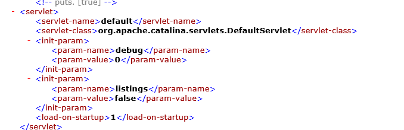

因此我们只需要在springmvc.xml文件中启用这个默认的Servlet即可：`&lt;mvc:default-servlet-handler&gt;`

## 使用 mvc:resources 标签配置静态资?访问静态资源，也可以在springmvc.xml文件中添加如下的配置?```xml
<!-- 开启注解驱?-->
&lt;mvc:annotation-driven /&gt;

<!-- 配置静态资源处?-->
&lt;mvc:resources mapping="/static/**" location="/static/" /&gt;
```
表示凡是请求路径?/static/"开始的，都会去"/static/"目录下找该资源?注意：要想使?`<mvc:resources>` 配置，必须开启注解驱?`<mvc:annotation-driven />`
# RESTFul编程风格
## RESTFul是什?RESTFul是`WEB服务接口`的一种设计风格?RESTFul定义了一组约束条件和规范，可以让`WEB服务接口`更加简洁、易于理解、易于扩展、安全可靠?
RESTFul对一个`WEB服务接口`都规定了哪些东西?
- 对请求的URL格式有约束和规范
- 对HTTP的请求方式有约束和规?- 对请求和响应的数据格式有约束和规?- 对HTTP状态码有约束和规范
- ?......

REST对请求方式的约束是这样的?
- 查询必须发送GET请求
- 新增必须发送POST请求
- 修改必须发送PUT请求
- 删除必须发送DELETE请求

REST对URL的约束是这样的：

- 传统的URL：get请求?springmvc/getUserById?id=1
- REST风格的URL：get请求?springmvc/user/1

- 传统的URL：get请求?springmvc/deleteUserById?id=1
- REST风格的URL：delete请求, /springmvc/user/1


RESTFul对URL的约束和规范的核心是?*通过采用**`**不同的请求方?*`**+ **`**URL**`**来确定WEB服务中的资源?*

**RESTful 的英文全称是 Representational State Transfer（表述性状态转移）。简称REST?*
表述性（Representational）是：URI + 请求方式?状态（State）是：服务器端的数据?转移（Transfer）是：变化?表述性状态转移是指：通过 URI + 请求方式 来控制服务器端数据的变化?
## RESTFul风格与传统方式对?传统?URL ?RESTful URL 的区别是传统?URL 是基于方法名进行资源访问和操作，?RESTful URL 是基于资源的结构和状态进行操作的。下面是一张表格，展示两者之间的具体区别?
| **传统?URL** | **RESTful URL** |
| --- | --- |
| GET /getUserById?id=1 | GET /user/1 |
| GET /getAllUser | GET /user |
| POST /addUser | POST /user |
| POST /modifyUser | PUT /user |
| GET /deleteUserById?id=1 | DELETE /user/1 |

从上表中我们可以看出，传统的URL是基于动作的，?RESTful URL 是基于资源和状态的，因?RESTful URL 更加清晰和易于理解，这也?REST 架构风格被广泛使用的主要原因之一?
## RESTFul方式演示查询
RESTFul规范中规定，如果要查询数据，需要发送GET请求?### 根据id查询(GET /api/user/1)
```xml
<?xml version="1.0" encoding="UTF-8"?>
<beans xmlns="http://www.springframework.org/schema/beans"
       xmlns:xsi="http://www.w3.org/2001/XMLSchema-instance"
       xmlns:context="http://www.springframework.org/schema/context"
       xmlns:mvc="http://www.springframework.org/schema/mvc"
       xsi:schemaLocation="http://www.springframework.org/schema/beans http://www.springframework.org/schema/beans/spring-beans.xsd http://www.springframework.org/schema/context https://www.springframework.org/schema/context/spring-context.xsd http://www.springframework.org/schema/mvc https://www.springframework.org/schema/mvc/spring-mvc.xsd">

    <!--组件扫描-->
    &lt;context:component-scan base-package="com.powernode.springmvc.controller"/&gt;

    <!--视图解析?->
    &lt;bean id="thymeleafViewResolver" class="org.thymeleaf.spring6.view.ThymeleafViewResolver"&gt;
        &lt;property name="characterEncoding" value="UTF-8"/&gt;
        &lt;property name="order" value="1"/&gt;
        &lt;property name="templateEngine"&gt;
            &lt;bean class="org.thymeleaf.spring6.SpringTemplateEngine"&gt;
                &lt;property name="templateResolver"&gt;
                    &lt;bean class="org.thymeleaf.spring6.templateresolver.SpringResourceTemplateResolver"&gt;
                        &lt;property name="prefix" value="/WEB-INF/thymeleaf/"/&gt;
                        &lt;property name="suffix" value=".html"/&gt;
                        &lt;property name="templateMode" value="HTML"/&gt;
                        &lt;property name="characterEncoding" value="UTF-8"/&gt;
                    &lt;/bean&gt;
                &lt;/property&gt;
            &lt;/bean&gt;
        &lt;/property&gt;
    &lt;/bean&gt;

    <!--启用注解-->
    &lt;mvc:annotation-driven/&gt;

    <!--视图控制器映?->
    &lt;mvc:view-controller path="/" view-name="index"/&gt;
&lt;/beans&gt;
```


首页index.html
```html
<!DOCTYPE html>
&lt;html lang="en" xmlns:th="http://www.thymeleaf.org"&gt;
&lt;head&gt;
    &lt;meta charset="UTF-8"&gt;
    &lt;title&gt;index&lt;/title&gt;
&lt;/head&gt;
&lt;body&gt;
&lt;h1&gt;index page&lt;/h1&gt;
&lt;hr&gt;
<!--根据id查询：GET /api/user/1 -->
&lt;a th:href="@{/api/user/1}"&gt;根据id查询用户信息&lt;/a&gt;&lt;br&gt;

&lt;/body&gt;
&lt;/html&gt;
```

控制器Controller?```java
package com.powernode.springmvc.controller;

import org.springframework.stereotype.Controller;
import org.springframework.web.bind.annotation.PathVariable;
import org.springframework.web.bind.annotation.RequestMapping;
import org.springframework.web.bind.annotation.RequestMethod;

@Controller
public class UserController {

    @RequestMapping(value = "/api/user/{id}", method = RequestMethod.GET)
    public String getById(@PathVariable("id") Integer id){
        System.out.println("根据用户id查询用户信息，用户id? + id);
        return "ok";
    }

}

```


视图页面?```html
<!DOCTYPE html>
&lt;html lang="en" xmlns:th="http://www.thymeleaf.org"&gt;
&lt;head&gt;
    &lt;meta charset="UTF-8"&gt;
    &lt;title&gt;ok&lt;/title&gt;
&lt;/head&gt;
&lt;body&gt;
&lt;h1&gt;ok&lt;/h1&gt;
&lt;/body&gt;
&lt;/html&gt;
```

启动服务器，测试：http://localhost:8080/springmvc
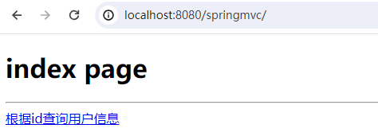
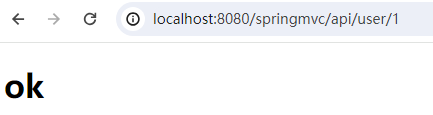
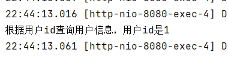


### 查询所?GET /api/user)
```html
<!--查询所?->
&lt;a th:href="@{/api/user}"&gt;查询所?/a>&lt;br&gt;
```
```java
@RequestMapping(value = "/api/user", method = RequestMethod.GET)
public String getAll(){
    System.out.println("查询所有用户信?);
    return "ok";
}
```
启动服务器测试：
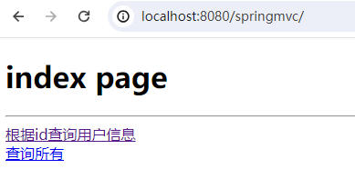

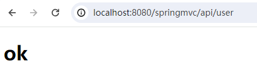

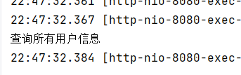

## RESTFul方式演示增加(POST /api/user)
RESTFul规范中规定，如果要进行保存操作，需要发送POST请求?```html
<!--保存用户-->
<form th:action="@{/api/user}" method="post">
    <input type="submit" th:value="保存">
</form>
```

```java
@RequestMapping(value = "/api/user", method = RequestMethod.POST)
public String save(){
    System.out.println("保存用户信息");
    return "ok";
}
```

启动服务器测试：
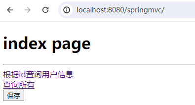
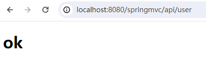
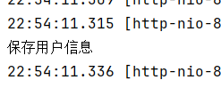

## RESTFul方式演示修改
RESTFul规范中规定，如果要进行保存操作，需要发送PUT请求?**如何发送PUT请求?*
**第一步：首先你必须是一个POST请求?*
**第二步：在发送POST请求的时候，提交这样的数据：**`**_method=PUT**`
**第三步：在web.xml文件配置SpringMVC提供的过滤器：HiddenHttpMethodFilter**

实践一下：
```html
<!--修改用户-->
<hr>
<form th:action="@{/api/user}" method="post">
    <!--隐藏域的方式提交 _method=put -->
    <input type="hidden" name="_method" value="put">
    用户名：<input type="text" name="username"><br>
    <input type="submit" th:value="修改">
</form>
```
```xml
<!--隐藏的HTTP请求方式过滤?->
<filter>
    <filter-name>hiddenHttpMethodFilter</filter-name>
    <filter-class>org.springframework.web.filter.HiddenHttpMethodFilter</filter-class>
</filter>
<filter-mapping>
    <filter-name>hiddenHttpMethodFilter</filter-name>
    <url-pattern>/*</url-pattern>
</filter-mapping>
```
```java
@RequestMapping(value = "/api/user", method = RequestMethod.PUT)
public String update(String username){
    System.out.println("修改用户信息，用户名? + username);
    return "ok";
}
```


注意pom.xml文件中添加如下配置：
```xml
<build>
    <plugins>
        <plugin>
            <groupId>org.apache.maven.plugins</groupId>
            <artifactId>maven-compiler-plugin</artifactId>
            <version>3.12.1</version>
            <configuration>
                <source>21</source>
                <target>21</target>
                <compilerArgs>
                    <arg>-parameters</arg>
                </compilerArgs>
            </configuration>
        </plugin>
    </plugins>
</build>
```
**一定要重新build一下：**
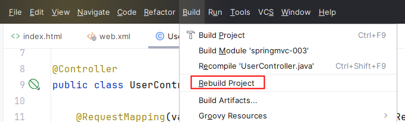

测试结果?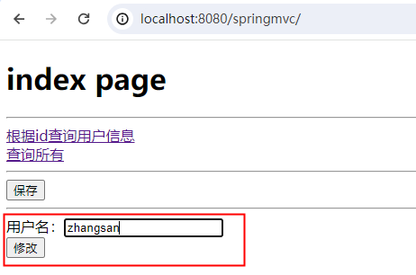
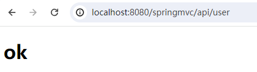
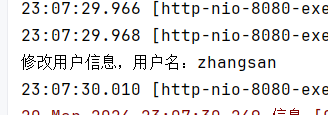


## HiddenHttpMethodFilter
HiddenHttpMethodFilter是Spring MVC框架提供的，专门用于RESTFul编程风格?实现原理可以通过源码查看?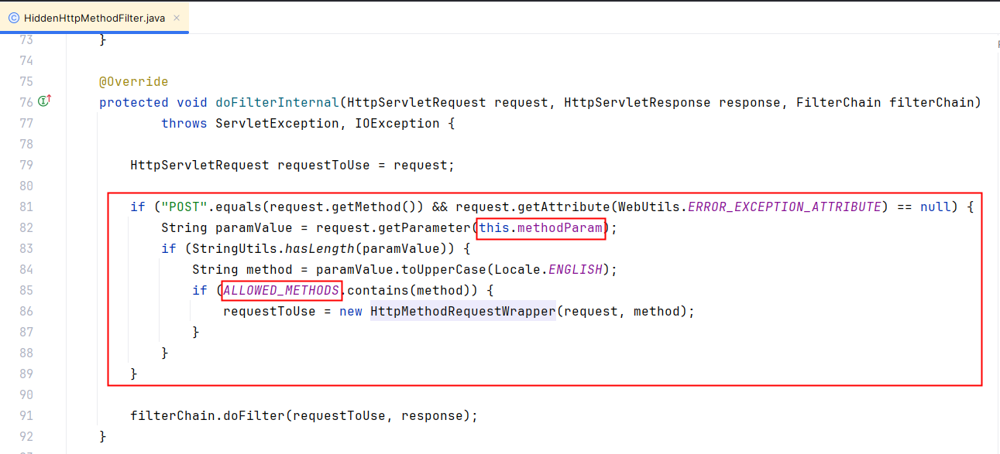
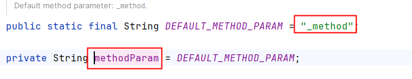
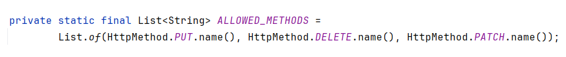
通过源码可以看到，if语句中，首先判断是否为POST请求，如果是POST请求，调用`request.getParameter(this.methodParam)`。可以看到`this.methodParam`是`_method`，这样就要求我们在提交请求方式的时候必须采用这个格式：`_method=put`。获取到请求方式之后，调用了toUpperCase转换成大写了。因此前端页面中小写的put或者大写的PUT都是可以的。if语句中嵌套的if语句说的是，只有请求方式?PUT,DELETE,PATCH的时候会创建HttpMethodRequestWrapper对象。而HttpMethodRequestWrapper对象的构造方法是这样的：

这样method就从POST变成了：PUT/DELETE/PATCH?

**重点注意事项：CharacterEncodingFilter和HiddenHttpMethodFilter的顺?*
细心的同学应该注意到了，在HiddenHttpMethodFilter源码中有这样一行代码：
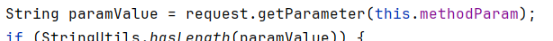
大家是否还记得，字符编码过滤器执行之前不能调?request.getParameter方法，如果提前调用了，乱码问题就无法解决了。因为request.setCharacterEncoding()方法的执行必须在所有request.getParameter()方法之前执行。因此这两个过滤器就有先后顺序的要求，在web.xml文件中，应该先配置CharacterEncodingFilter，然后再配置HiddenHttpMethodFilter?
# 使用RESTFul实现用户管理系统
## 静态页面准?文件包括：user.css、user_index.html、user_list.html、user_add.html、user_edit.html。代码如下：
### user.css
```css
.header {
  background-color: #f2f2f2;
  padding: 20px;
  text-align: center;
}

ul {
  list-style-type: none;
  margin: 0;
  padding: 0;
  overflow: hidden;
  background-color: #333;
}

li {
  float: left;
}

li a {
  display: block;
  color: white;
  text-align: center;
  padding: 14px 16px;
  text-decoration: none;
}

li a:hover:not(.active) {
  background-color: #111;
}

.active {
  background-color: #4CAF50;
}

form {
  width: 50%;
  margin: 0 auto;
  padding: 20px;
  border: 1px solid #ddd;
  border-radius: 4px;
}

label {
  display: block;
  margin-bottom: 8px;
}

input[type="text"], input[type="email"], select {
  width: 100%;
  padding: 6px 10px;
  margin: 8px 0;
  box-sizing: border-box;
  border: 1px solid #555;
  border-radius: 4px;
  font-size: 16px;
}

button[type="submit"] {
  padding: 10px;
  background-color: #4CAF50;
  color: #fff;
  border: none;
  border-radius: 4px;
  cursor: pointer;
}

button[type="submit"]:hover {
  background-color: #3e8e41;
}

table {
  border-collapse: collapse;
  width: 100%;
}

th, td {
  border: 1px solid #ddd;
  padding: 8px;
  text-align: left;
}

th {
  background-color: #f2f2f2;
}

tr:nth-child(even) {
  background-color: #f2f2f2;
}

.header {
  background-color: #f2f2f2;
  padding: 20px;
  text-align: center;
}

a {
  text-decoration: none;
  color: #333;
}

.add-button {
  margin-bottom: 20px;
  padding: 10px;
  background-color: #4CAF50;
  color: #fff;
  border: none;
  border-radius: 4px;
  cursor: pointer;
}

.add-button:hover {
  background-color: #3e8e41;
}
```

### user_index.html
```html
<!DOCTYPE html>
<html lang="en">
<head>
  <meta charset="UTF-8">
  <title>用户管理系统</title>
  <link rel="stylesheet" href="user.css" type="text/css"></link>
</head>
<body>
  <div class="header">
    <h1>用户管理系统</h1>
  </div>
  <ul>
    <li><a class="active" href="user_list.html">用户列表</a></li>
  </ul>
</body>
</html>
```
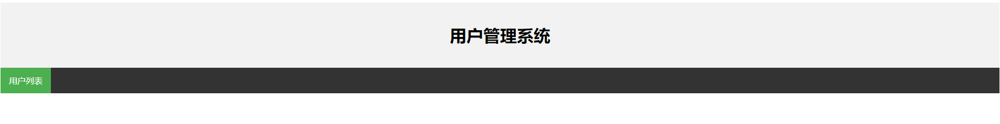

### user_list.html
```html
<!DOCTYPE html>
<html lang="en">
<head>
  <meta charset="UTF-8">
  <title>用户列表</title>
  <link rel="stylesheet" href="user.css" type="text/css"></link>
</head>
<body>
  <div class="header">
    <h1>用户列表</h1>
  </div>
  <div class="add-button-wrapper">
    <a class="add-button" href="user_add.html">新增用户</a>
  </div>
  <table>
    <thead>
      <tr>
        <th>编号</th>
        <th>用户?/th>
        <th>性别</th>
        <th>邮箱</th>
        <th>操作</th>
      </tr>
    </thead>
	<tbody>
      <tr>
        <td>1</td>
        <td>张三</td>
        <td>?/td>
        <td>zhangsan@powernode.com</td>
        <td>
          修改
          删除
        </td>
      </tr>
      <tr>
        <td>2</td>
        <td>李四</td>
        <td>?/td>
        <td>lisi@powernode.com</td>
        <td>
          修改
          删除
        </td>
      </tr>
    </tbody>
  </table>
</body>
</html>
```
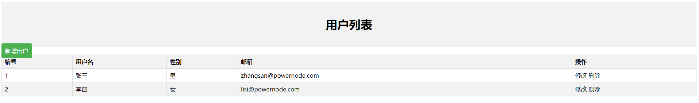

### user_add.html
```html
<!DOCTYPE html>
<html lang="en">
<head>
  <meta charset="UTF-8">
  <title>新增用户</title>
  <link rel="stylesheet" href="user.css" type="text/css"></link>
</head>
<body>
  <h1>新增用户</h1>
  <form>
    <label>用户?</label>
    <input type="text" name="username" required>

    <label>性别:</label>
    <select name="gender" required>
      <option value="">-- 请选择 --</option>
      <option value="1">?/option>
      <option value="0">?/option>
    </select>

    <label>邮箱:</label>
    <input type="email" name="email" required>

	<button type="submit">保存</button>
  </form>
</body>
</html>
```
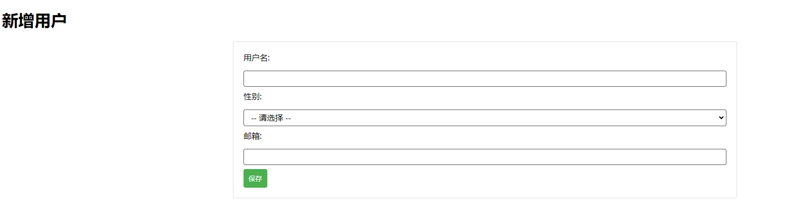

### user_edit.html
```html
<!DOCTYPE html>
<html lang="en">
<head>
  <meta charset="UTF-8">
  <title>修改用户</title>
  <link rel="stylesheet" href="user.css" type="text/css"></link>
</head>
<body>
  <h1>修改用户</h1>
  <form>
    <label>用户?</label>
    <input type="text" name="username" value="张三" required>

    <label>性别:</label>
    <select name="gender" required>
      <option value="">-- 请选择 --</option>
      <option value="1" selected>?/option>
      <option value="0">?/option>
    </select>

    <label>邮箱:</label>
    <input type="email" name="email" value="zhangsan@powernode.com" required>

    <button type="submit">修改</button>
  </form>
</body>
</html>
```
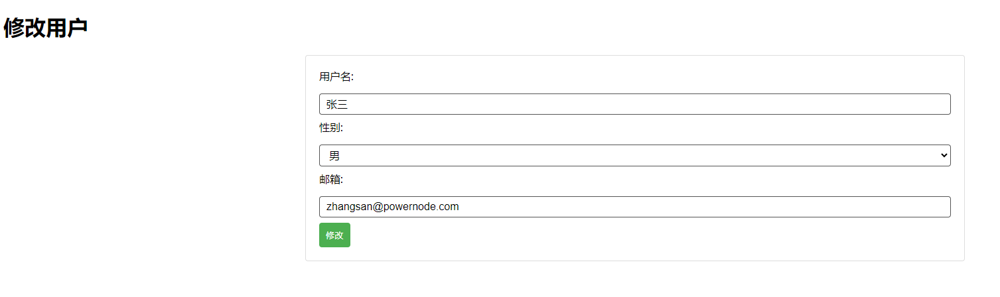

## SpringMVC环境搭建
### 创建module：usermgt
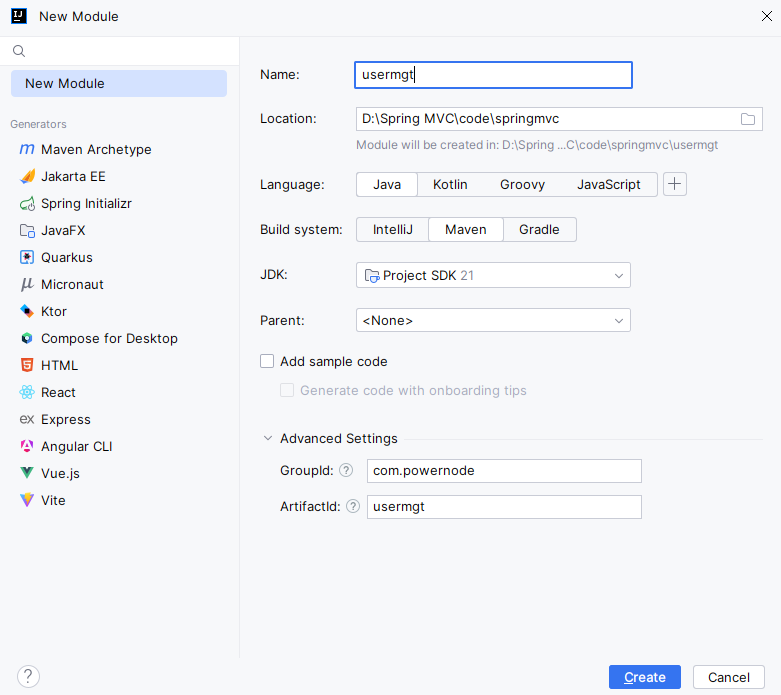
```xml
<?xml version="1.0" encoding="UTF-8"?>
<project xmlns="http://maven.apache.org/POM/4.0.0"
         xmlns:xsi="http://www.w3.org/2001/XMLSchema-instance"
         xsi:schemaLocation="http://maven.apache.org/POM/4.0.0 http://maven.apache.org/xsd/maven-4.0.0.xsd">
    <modelVersion>4.0.0</modelVersion>

    <groupId>com.powernode</groupId>
    <artifactId>usermgt</artifactId>
    <version>1.0-SNAPSHOT</version>
    <packaging>war</packaging>

    <dependencies>
        <!--springmvc-->
        <dependency>
            <groupId>org.springframework</groupId>
            <artifactId>spring-webmvc</artifactId>
            <version>6.1.5</version>
        </dependency>
        <!--servlet api-->
        <dependency>
            <groupId>jakarta.servlet</groupId>
            <artifactId>jakarta.servlet-api</artifactId>
            <version>6.0.0</version>
        </dependency>
        <!--logback-->
        <dependency>
            <groupId>ch.qos.logback</groupId>
            <artifactId>logback-classic</artifactId>
            <version>1.5.3</version>
        </dependency>
        <!--thymeleaf+spring6整合依赖-->
        <dependency>
            <groupId>org.thymeleaf</groupId>
            <artifactId>thymeleaf-spring6</artifactId>
            <version>3.1.2.RELEASE</version>
        </dependency>
    </dependencies>
    
    <properties>
        <maven.compiler.source>21</maven.compiler.source>
        <maven.compiler.target>21</maven.compiler.target>
        <project.build.sourceEncoding>UTF-8</project.build.sourceEncoding>
    </properties>

</project>
```

### 添加web支持
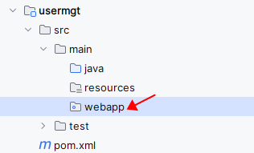
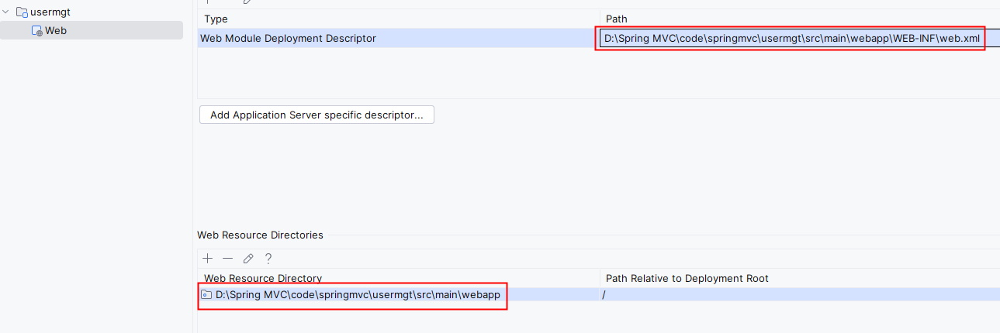

### 配置web.xml文件
```xml
<?xml version="1.0" encoding="UTF-8"?>
<web-app xmlns="https://jakarta.ee/xml/ns/jakartaee"
         xmlns:xsi="http://www.w3.org/2001/XMLSchema-instance"
         xsi:schemaLocation="https://jakarta.ee/xml/ns/jakartaee https://jakarta.ee/xml/ns/jakartaee/web-app_6_0.xsd"
         version="6.0">

    <!--字符编码过滤?->
    <filter>
        <filter-name>characterEncodingFilter</filter-name>
        <filter-class>org.springframework.web.filter.CharacterEncodingFilter</filter-class>
        <init-param>
            <param-name>encoding</param-name>
            <param-value>UTF-8</param-value>
        </init-param>
        <init-param>
            <param-name>forceRequestEncoding</param-name>
            <param-value>true</param-value>
        </init-param>
        <init-param>
            <param-name>forceResponseEncoding</param-name>
            <param-value>true</param-value>
        </init-param>
    </filter>
    <filter-mapping>
        <filter-name>characterEncodingFilter</filter-name>
        <url-pattern>/*</url-pattern>
    </filter-mapping>
    
    <!--HTTP请求方式过滤?->
    <filter>
        <filter-name>hiddenHttpMethodFilter</filter-name>
        <filter-class>org.springframework.web.filter.HiddenHttpMethodFilter</filter-class>
    </filter>
    <filter-mapping>
        <filter-name>hiddenHttpMethodFilter</filter-name>
        <url-pattern>/*</url-pattern>
    </filter-mapping>
    
    <!--前端控制?->
    <servlet>
        <servlet-name>springmvc</servlet-name>
        <servlet-class>org.springframework.web.servlet.DispatcherServlet</servlet-class>
        <init-param>
            <param-name>contextConfigLocation</param-name>
            <param-value>classpath:springmvc.xml</param-value>
        </init-param>
        <load-on-startup>1</load-on-startup>
    </servlet>
    <servlet-mapping>
        <servlet-name>springmvc</servlet-name>
        <url-pattern>/</url-pattern>
    </servlet-mapping>

</web-app>
```
注意两个过滤器Filter的配置顺序：

- 先配?CharacterEncodingFilter
- 再配?HiddenHttpMethodFilter

### 配置springmvc.xml文件
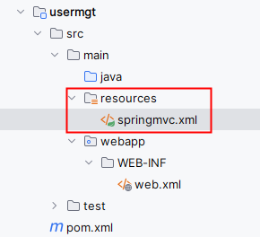
```xml
<?xml version="1.0" encoding="UTF-8"?>
<beans xmlns="http://www.springframework.org/schema/beans"
       xmlns:xsi="http://www.w3.org/2001/XMLSchema-instance" xmlns:mvc="http://www.springframework.org/schema/mvc"
       xmlns:context="http://www.springframework.org/schema/context"
       xsi:schemaLocation="http://www.springframework.org/schema/beans http://www.springframework.org/schema/beans/spring-beans.xsd http://www.springframework.org/schema/mvc https://www.springframework.org/schema/mvc/spring-mvc.xsd http://www.springframework.org/schema/context https://www.springframework.org/schema/context/spring-context.xsd">

    <!--组件扫描-->
    <context:component-scan base-package="com.powernode.usermgt.controller,com.powernode.usermgt.dao"/>

    <!--视图解析?->
    <bean id="thymeleafViewResolver" class="org.thymeleaf.spring6.view.ThymeleafViewResolver">
        <property name="characterEncoding" value="UTF-8"/>
        <property name="order" value="1"/>
        <property name="templateEngine">
            <bean class="org.thymeleaf.spring6.SpringTemplateEngine">
                <property name="templateResolver">
                    <bean class="org.thymeleaf.spring6.templateresolver.SpringResourceTemplateResolver">
                        <property name="prefix" value="/WEB-INF/thymeleaf/"/>
                        <property name="suffix" value=".html"/>
                        <property name="templateMode" value="HTML"/>
                        <property name="characterEncoding" value="UTF-8"/>
                    </bean>
                </property>
            </bean>
        </property>
    </bean>

    <!--开启注?->
    <mvc:annotation-driven/>

    <!--开启默认Servlet-->
    <mvc:default-servlet-handler/>

</beans>
```
在WEB-INF目录下新建：thymeleaf目录
创建package?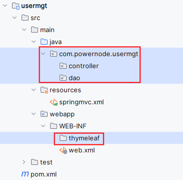

## 显示首页
在应用的根下新建目录：static，将user.css文件拷贝进去?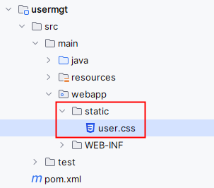
将user_index.html拷贝到WEB-INF/thymeleaf目录下：
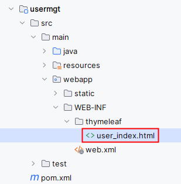
代码有两处需要修改：


重要：在springmvc.xml文件中配置视图控制器映射?```xml
<!--视图控制器映?->
&lt;mvc:view-controller path="/" view-name="user_index"/&gt;
```

部署，启动服务器，测试：
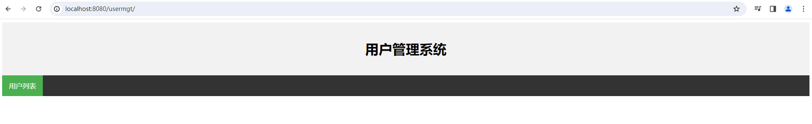

## 实现用户列表
修改user_index.html中的超链接：
```html
<!DOCTYPE html>
&lt;html lang="en" xmlns:th="http://www.thymeleaf.org"&gt;
&lt;head&gt;
  &lt;meta charset="UTF-8"&gt;
  &lt;title&gt;用户管理系统&lt;/title&gt;
  &lt;link rel="stylesheet" th:href="@{/static/user.css}" type="text/css"&gt;&lt;/link&gt;
&lt;/head&gt;
&lt;body&gt;
  &lt;div class="header"&gt;
    &lt;h1&gt;用户管理系统&lt;/h1&gt;
  &lt;/div&gt;
  &lt;ul&gt;
    &lt;li&gt;&lt;a class="active" th:href="@{/user}"&gt;用户列表&lt;/a&gt;&lt;/li&gt;
  &lt;/ul&gt;
&lt;/body&gt;
&lt;/html&gt;
```
编写bean：User
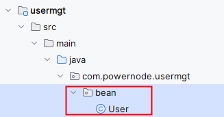

```java
package com.powernode.usermgt.bean;

public class User {
    private Long id;
    private String name;
    private String email;
    private Integer gender;

    public User() {
    }

    public User(Long id, String name, String email, Integer gender) {
        this.id = id;
        this.name = name;
        this.email = email;
        this.gender = gender;
    }

    public Long getId() {
        return id;
    }

    public void setId(Long id) {
        this.id = id;
    }

    public String getName() {
        return name;
    }

    public void setName(String name) {
        this.name = name;
    }

    public String getEmail() {
        return email;
    }

    public void setEmail(String email) {
        this.email = email;
    }

    public Integer getGender() {
        return gender;
    }

    public void setGender(Integer gender) {
        this.gender = gender;
    }

    @Override
    public String toString() {
        return "User{" +
                "id=" + id +
                ", name='" + name + '\'' +
                ", email='" + email + '\'' +
                ", gender=" + gender +
                '}';
    }
}

```

编写UserDao，提供selectAll方法?```java
package com.powernode.usermgt.dao;

import com.powernode.usermgt.bean.User;
import org.springframework.stereotype.Repository;

import java.util.ArrayList;
import java.util.List;

@Repository
public class UserDao {
    private static List<User> users = new ArrayList<>();
    static {
        User user1 = new User(10001L, "张三", "zhangsan@powernode.com", 1);
        User user2 = new User(10002L, "李四", "lisi@powernode.com", 1);
        User user3 = new User(10003L, "王五", "wangwu@powernode.com", 1);
        User user4 = new User(10004L, "赵六", "zhaoliu@powernode.com", 0);
        User user5 = new User(10005L, "钱七", "qianqi@powernode.com", 0);
        users.add(user1);
        users.add(user2);
        users.add(user3);
        users.add(user4);
        users.add(user5);
    }

    public List<User> selectAll(){
        return users;
    }
}

```
编写控制器UserController?```java
package com.powernode.usermgt.controller;

import com.powernode.usermgt.bean.User;
import com.powernode.usermgt.dao.UserDao;
import org.springframework.beans.factory.annotation.Autowired;
import org.springframework.stereotype.Controller;
import org.springframework.ui.Model;
import org.springframework.web.bind.annotation.GetMapping;

import java.util.List;

@Controller
public class UserController {

    @Autowired
    private UserDao userDao;

    @GetMapping("/user")
    public String list(Model model){
        // 获取所有的用户
        List&lt;User&gt; users = userDao.selectAll();
        // 存储到request?        model.addAttribute("users", users);
        // 跳转视图
        return "user_list";
    }
}

```

将user_list.html拷贝到thymeleaf目录下，并进行代码修改，显示用户列表?```html
<!DOCTYPE html>
<html lang="en" xmlns:th="http://www.thymeleaf.org">
<head>
  <meta charset="UTF-8">
  <title>用户列表</title>
  <link rel="stylesheet" th:href="@{/static/user.css}" type="text/css"></link>
</head>
<body>
  <div class="header">
    <h1>用户列表</h1>
  </div>
  <div class="add-button-wrapper">
    <a class="add-button" href="user_add.html">新增用户</a>
  </div>
  <table>
    <thead>
      <tr>
        <th>编号</th>
        <th>用户?/th>
        <th>性别</th>
        <th>邮箱</th>
        <th>操作</th>
      </tr>
    </thead>
	<tbody>

      <tr th:each="user : ${users}">
        <td th:text="${user.id}"></td>
        <td th:text="${user.name}"></td>
        <td th:text="${user.gender == 1 ? '? : '?}"></td>
        <td th:text="${user.email}"></td>
        <td>
          <a href="">修改</a>
          <a href="">删除</a>
        </td>
      </tr>

    </tbody>
  </table>
</body>
</html>
```

测试结果?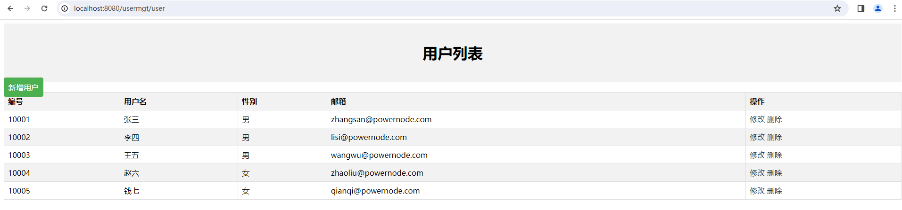

## 实现新增功能
### 跳转到新增页?在用户列表页面，修改`新增用户`的超链接?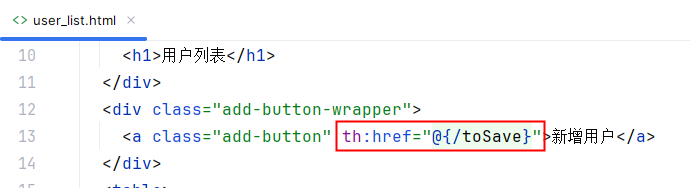
将user_add.html拷贝到thymeleaf目录下，并进行代码修改如下：
```html
<!DOCTYPE html>
<html lang="en" xmlns:th="http:www.thymeleaf.org">
<head>
  <meta charset="UTF-8">
  <title>新增用户</title>
  <link rel="stylesheet" th:href="@{/static/user.css}" type="text/css"></link>
</head>
<body>
  <h1>新增用户</h1>
  <form>
    <label>用户?</label>
    <input type="text" name="username" required>

    <label>性别:</label>
    <select name="gender" required>
      <option value="">-- 请选择 --</option>
      <option value="1">?/option>
      <option value="0">?/option>
    </select>

    <label>邮箱:</label>
    <input type="email" name="email" required>

	<button type="submit">保存</button>
  </form>
</body>
</html>
```


在springmvc.xml文件中配置`视图控制器映射`?```xml
&lt;mvc:view-controller path="/toSave" view-name="user_add"/&gt;
```
启动服务器测试：
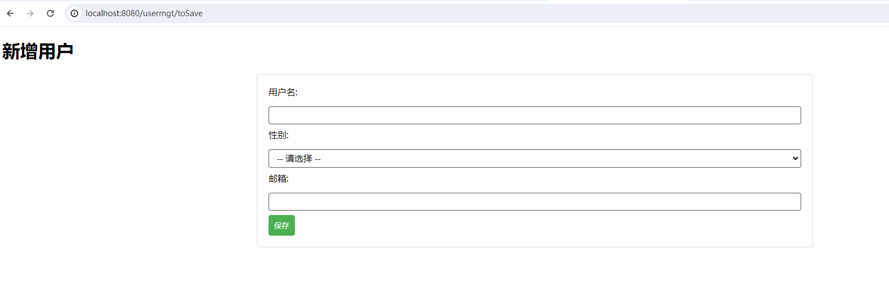

### 实现新增功能
前端页面发送POST请求，提交表单，user_add.html代码如下?```html
<!DOCTYPE html>
<html lang="en" xmlns:th="http:www.thymeleaf.org">
<head>
  <meta charset="UTF-8">
  <title>新增用户</title>
  <link rel="stylesheet" th:href="@{/static/user.css}" type="text/css"></link>
</head>
<body>
  <h1>新增用户</h1>
  <form th:action="@{/user}" method="post">
    <label>用户?</label>
    <input type="text" name="name" required>

    <label>性别:</label>
    <select name="gender" required>
      <option value="">-- 请选择 --</option>
      <option value="1">?/option>
      <option value="0">?/option>
    </select>

    <label>邮箱:</label>
    <input type="email" name="email" required>

	<button type="submit">保存</button>
  </form>
</body>
</html>
```
编写控制器UserController?```java
@PostMapping("/user")
public String save(User user){
    // 保存用户
    userDao.save(user);
    // 重定向到列表
    return "redirect:/user";
}
```
**注意：保存成功后，采用重定向的方式跳转到用户列表?*


编写UserDao?```java
public static Long generateId(){
    // Stream API
    Long maxId = users.stream().map(user -> user.getId()).reduce((id1, id2) -> id1 > id2 ? id1 : id2).get();
    return maxId + 1;
}

public void save(User user){
    // 设置id
    user.setId(generateId());
    // 保存
    users.add(user);
}
```
**注意：单独写了一个方法生成id，内部使用了Stream API，不会这块内容的可以看老杜最新发布的2024版JavaSE?*


启动服务器测试：
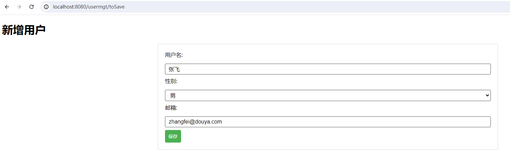
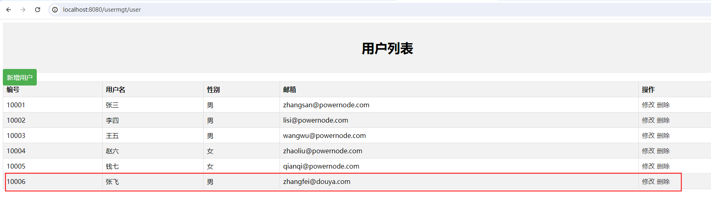

## 跳转到修改页?修改user_list.html中`修改`超链接：
```html
<a th:href="@{'/user/' + ${user.id}}">修改</a>
```
编写Controller?```java
@GetMapping("/user/{id}")
public String toUpdate(@PathVariable("id") Long id, Model model){
    // 根据id查询用户信息
    User user = userDao.selectById(id);
    // 将对象存储到request?    model.addAttribute("user", user);
    // 跳转视图
    return "user_edit";
}
```
编写UserDao?```java
public User selectById(Long id){
    return users.stream().filter(user -> user.getId().equals(id)).findFirst().get();
}
```
将user_edit.html拷贝thymeleaf目录下，并修改代码如下：
```html
<!DOCTYPE html>
<html lang="en" xmlns:th="http://www.thymeleaf.org">
<head>
  <meta charset="UTF-8">
  <title>修改用户</title>
  <link rel="stylesheet" th:href="@{/static/user.css}" type="text/css"></link>
</head>
<body>
  <h1>修改用户</h1>
  <form>
    <label>用户?</label>
    <input type="text" name="username" th:value="${user.name}" required>

    <label>性别:</label>
    <select name="gender" required>
      <option value="">-- 请选择 --</option>
      <option value="1" th:field="${user.gender}">?/option>
      <option value="0" th:field="${user.gender}">?/option>
    </select>

    <label>邮箱:</label>
    <input type="email" name="email" th:value="${user.email}" required>

    <button type="submit">修改</button>
  </form>
</body>
</html>
```


启动服务器测试：
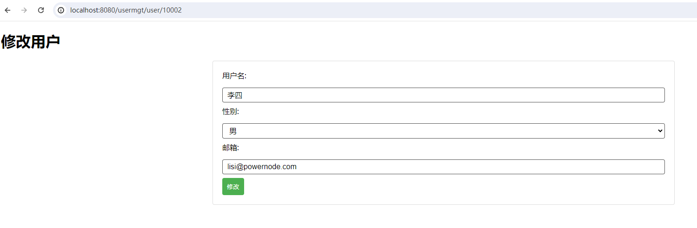

## 实现修改功能
将user_edit.html页面中的form表单修改一下，添加action，添加method，隐藏域的方式提交请求方式put，隐藏域的方式提交id?```html
&lt;form th:action="@{/user}" method="post"&gt;
  <!--隐藏域的方式设置请求方式为put请求-->
  &lt;input type="hidden" name="_method" value="put"&gt;
  <!--隐藏域的方式提交id-->
  &lt;input type="hidden" name="id" th:value="${user.id}"&gt;

  &lt;label&gt;用户?&lt;/label&gt;
  &lt;input type="text" name="name" th:value="${user.name}" required&gt;

  &lt;label&gt;性别:&lt;/label&gt;
  &lt;select name="gender" required&gt;
    &lt;option value=""&gt;-- 请选择 --&lt;/option&gt;
    &lt;option value="1" th:field="${user.gender}"&gt;?/option>
    &lt;option value="0" th:field="${user.gender}"&gt;?/option>
  &lt;/select&gt;

  &lt;label&gt;邮箱:&lt;/label&gt;
  &lt;input type="email" name="email" th:value="${user.email}" required&gt;

  &lt;button type="submit"&gt;修改&lt;/button&gt;
&lt;/form&gt;
```
编写Controller?```java
@PutMapping("/user")
public String modify(User user){
    // 更新数据
    userDao.update(user);
    // 重定?    return "redirect:/user";
}
```
编写UserDao?```java
public void update(User user){
    for (int i = 0; i < users.size(); i++) {
        if(user.getId().equals(users.get(i).getId())){
            users.set(i, user);
            break;
        }
    }
}
```


启动服务器测试：
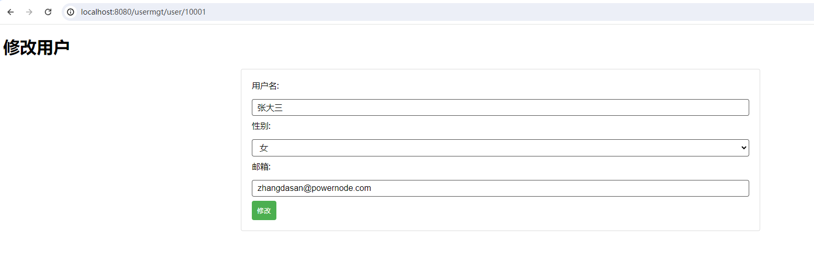
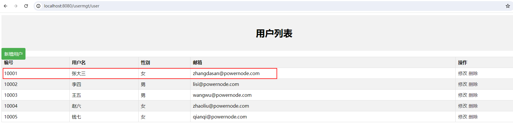

## 实现删除功能
删除应该发送DELETE请求，要模拟DELETE请求，就需要使用表单方式提交。因此我们点击`删除`超链接时需要采用表单方式提交?在user_list.html页面添加form表单，并且点击超链接时应该提交表单，代码如下?```html
<!DOCTYPE html>
<html lang="en" xmlns:th="http://www.thymeleaf.org">
<head>
  <meta charset="UTF-8">
  <title>用户列表</title>
  <link rel="stylesheet" th:href="@{/static/user.css}" type="text/css"></link>
</head>
<body>
  <div class="header">
    <h1>用户列表</h1>
  </div>
  <div class="add-button-wrapper">
    <a class="add-button" th:href="@{/toSave}">新增用户</a>
  </div>
  <table>
    <thead>
      <tr>
        <th>编号</th>
        <th>用户?/th>
        <th>性别</th>
        <th>邮箱</th>
        <th>操作</th>
      </tr>
    </thead>
	<tbody>

      <tr th:each="user : ${users}">
        <td th:text="${user.id}"></td>
        <td th:text="${user.name}"></td>
        <td th:text="${user.gender == 1 ? '? : '?}"></td>
        <td th:text="${user.email}"></td>
        <td>
          <a th:href="@{'/user/' + ${user.id}}">修改</a>
          <!--为删除提供一个鼠标单击事?->
          <a th:href="@{'/user/' + ${user.id}}" onclick="del(event)">删除</a>
        </td>
      </tr>

    </tbody>
  </table>

  <!--为删除操作准备一个form表单，点击删除时提交form表单-->
  <div style="display: none">
  <form method="post" id="delForm">
    <input type="hidden" name="_method" value="delete"/>
  </form>
  </div>

  <script>
    function del(event){
      // 获取表单
      let delForm = document.getElementById("delForm");
      // 设置表单action
      delForm.action = event.target.href;
      if(window.confirm("您确定要删除吗？")){
        // 提交表单
        delForm.submit();
      }
      // 阻止超链接默认行?      event.preventDefault();
    }
  </script>
</body>
</html>
```


编写Controller:
```java
@DeleteMapping("/user/{id}")
public String del(@PathVariable("id") Long id){
    // 删除
    userDao.deleteById(id);
    // 重定?    return "redirect:/user";
}
```
编写UserDao:
```java
public void deleteById(Long id){
    for (int i = 0; i < users.size(); i++) {
        if(id.equals(users.get(i).getId())){
            users.remove(i);
            break;
        }
    }
}
```
启动服务器测试：
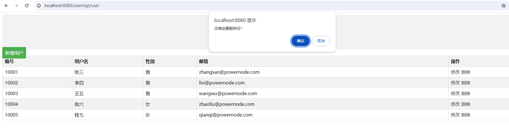
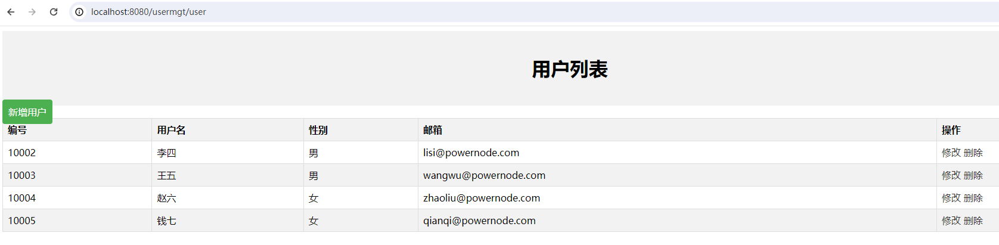

# HttpMessageConverter
HttpMessageConverter是Spring MVC中非常重要的一个接口。翻译为：HTTP消息转换器。该接口下提供了很多实现类，不同的实现类有不同的转换方式?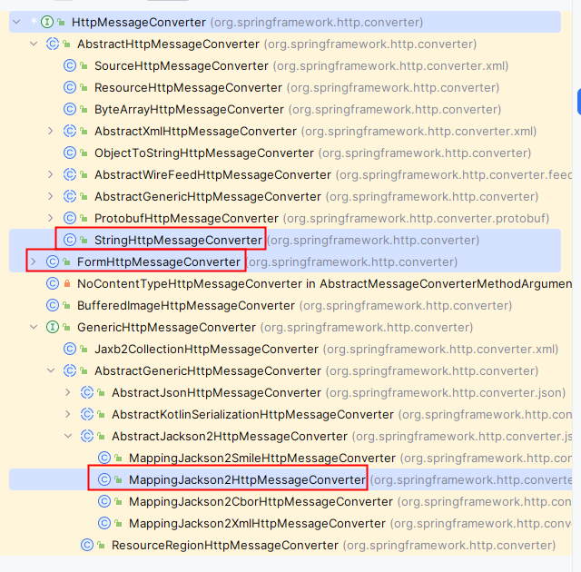

## 什么是HTTP消息
HTTP消息其实就是HTTP协议。HTTP协议包括请求协议和响应协议?以下是一份HTTP POST请求协议?```
POST /springmvc/user/login HTTP/1.1																												--请求?Content-Type: application/x-www-form-urlencoded																						--请求?Content-Length: 32
Host: www.example.com
User-Agent: Mozilla/5.0
Connection: Keep-Alive
Accept: text/html,application/xhtml+xml,application/xml;q=0.9,*/*;q=0.8
                                                                                          --空白?username=admin&password=1234																															--请求?```
以下是一份HTTP GET请求协议?```
GET /springmvc/user/del?id=1&name=zhangsan HTTP/1.1																				--请求?Host: www.example.com																																			--请求?User-Agent: Mozilla/5.0
Connection: Keep-Alive
Accept: text/html,application/xhtml+xml,application/xml;q=0.9,*/*;q=0.8
```
以下是一份HTTP响应协议?```
HTTP/1.1 200 OK																																					--状态行
Date: Thu, 01 Jul 2021 06:35:45 GMT																											--响应?Content-Type: text/plain; charset=utf-8
Content-Length: 12
Connection: keep-alive
Server: Apache/2.4.43 (Win64) OpenSSL/1.1.1g
                                                                                        --空白?<!DOCTYPE html>																																					--响应?<html>
  <head>
    <title>hello</title>
  </head>
  <body>
    <h1>Hello World!</h1>
  </body>
</html>
```

## 转换器转换的是什?转换的是`HTTP协议`与`Java程序中的对象`之间的互相转换。请看下图：
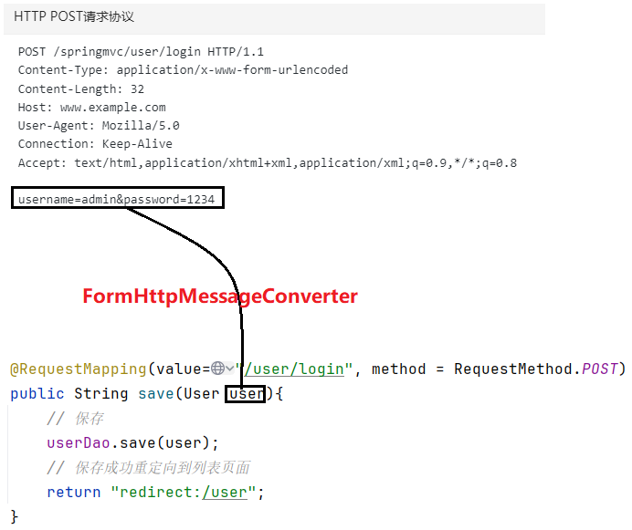
上图是我们之前经常写的代码。请求体中的数据是如何转换成user对象的，底层实际上使用了`HttpMessageConverter`接口的其中一个实现类`FormHttpMessageConverter`?通过上图可以看出`FormHttpMessageConverter`是负责将`请求协议`转换为`Java对象`的?
再看下图?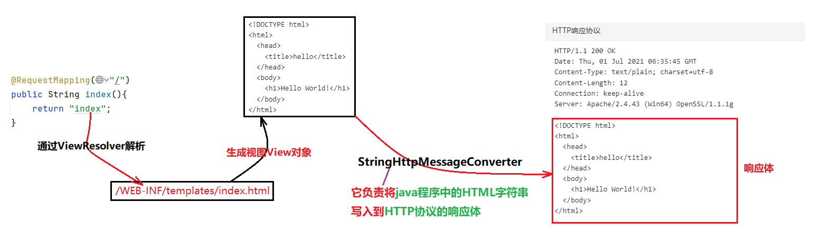
上图的代码也是之前我们经常写的，Controller返回值看做逻辑视图名称，视图解析器将其转换成物理视图名称，生成视图对象，`StringHttpMessageConverter`负责将视图对象中的HTML字符串写入到HTTP协议的响应体中。最终完成响应?通过上图可以看出`StringHttpMessageConverter`是负责将`Java对象`转换为`响应协议`的?


通过以上内容的学习，大家应该能够了解到`HttpMessageConverter`接口是用来做什么的了：
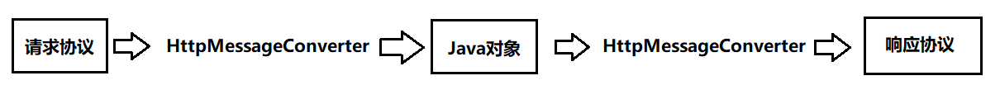
如上图所示：HttpMessageConverter接口的可以将请求协议转换成Java对象，也可以把Java对象转换为响应协议?**HttpMessageConverter是接口，SpringMVC帮我们提供了非常多而丰富的实现类。每个实现类都有自己不同的转换风格?*
**对于我们程序员来说，Spring MVC已经帮助我们写好了，我们只需要在不同的业务场景下，选择合适的HTTP消息转换器即可?*
**怎么选择呢？当然是通过SpringMVC为我们提供的注解，我们通过使用不同的注解来启用不同的消息转换器?*

在HTTP消息转换器这一小节，我们重点要掌握的是两个注解两个类：

- @ResponseBody
- @RequestBody
- ResponseEntity
- RequestEntity

# Spring MVC中的AJAX请求
SpringMVC+Vue3+Thymeleaf+Axios发送一个简单的AJAX请求?
引入Vue和Axios的js文件?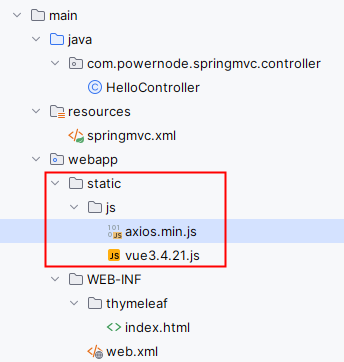

```xml
<?xml version="1.0" encoding="UTF-8"?>
<beans xmlns="http://www.springframework.org/schema/beans"
       xmlns:xsi="http://www.w3.org/2001/XMLSchema-instance"
       xmlns:context="http://www.springframework.org/schema/context"
       xmlns:mvc="http://www.springframework.org/schema/mvc"
       xsi:schemaLocation="http://www.springframework.org/schema/beans http://www.springframework.org/schema/beans/spring-beans.xsd http://www.springframework.org/schema/context https://www.springframework.org/schema/context/spring-context.xsd http://www.springframework.org/schema/mvc https://www.springframework.org/schema/mvc/spring-mvc.xsd">

    <!--组件扫描-->
    <context:component-scan base-package="com.powernode.springmvc.controller"/>

    <!--视图解析?->
    <bean id="thymeleafViewResolver" class="org.thymeleaf.spring6.view.ThymeleafViewResolver">
        <property name="characterEncoding" value="UTF-8"/>
        <property name="order" value="1"/>
        <property name="templateEngine">
            <bean class="org.thymeleaf.spring6.SpringTemplateEngine">
                <property name="templateResolver">
                    <bean class="org.thymeleaf.spring6.templateresolver.SpringResourceTemplateResolver">
                        <property name="prefix" value="/WEB-INF/thymeleaf/"/>
                        <property name="suffix" value=".html"/>
                        <property name="templateMode" value="HTML"/>
                        <property name="characterEncoding" value="UTF-8"/>
                    </bean>
                </property>
            </bean>
        </property>
    </bean>

    <!--视图控制器映?->
    <mvc:view-controller path="/" view-name="index"/>

    <!--开启注解驱?->
    <mvc:annotation-driven/>

    <!--静态资源处?->
    <mvc:default-servlet-handler/>

</beans>
```
重点是静态资源处理、开启注解驱动、视图控制器映射等相关配置?

Vue3+Thymeleaf+Axios发送AJAX请求:
```html
<!DOCTYPE html>
<html lang="en" xmlns:th="http://www.thymeleaf.org">
<head>
    <meta charset="UTF-8">
    <title>首页</title>
    <script th:src="@{/static/js/vue3.4.21.js}"></script>
    <script th:src="@{/static/js/axios.min.js}"></script>
</head>
<body>
<h1>首页</h1>
<hr>

<div id="app">
    <h1>{{message}}</h1>
    <button @click="getMessage">获取消息</button>
</div>

<script th:inline="javascript">
    Vue.createApp({
        data(){
            return {
                message : "这里的信息将被刷?
            }
        },
        methods:{
            async getMessage(){
                try {
                    const response = await axios.get([[@{/}]] + 'hello')
                    this.message = response.data
                }catch (e) {
                    console.error(e)
                }
            }
        }
    }).mount("#app")
</script>

</body>
</html>
```


**重点来了，Controller怎么写呢，之前我们都是传统的请求，Controller返回一?*`**逻辑视图?*`**，然后交?*`**视图解析?*`**解析。最后跳转页面。而AJAX请求是不需要跳转页面的，因为AJAX是页面局部刷新，以前我们在Servlet中使?*`**response.getWriter().print("message")**`**的方式响应。在Spring MVC中怎么办呢？当然，我们在Spring MVC中也可以使用Servlet原生API来完成这个功能，代码如下?*
```java
package com.powernode.springmvc.controller;

import jakarta.servlet.http.HttpServletResponse;
import org.springframework.stereotype.Controller;
import org.springframework.web.bind.annotation.RequestMapping;

import java.io.IOException;

@Controller
public class HelloController {

    @RequestMapping(value = "/hello")
    public String hello(HttpServletResponse response) throws IOException {
        response.getWriter().print("hello");
        return null;
    }
}

```
或者这样也行：不需要有返回?```java
package com.powernode.springmvc.controller;

import jakarta.servlet.http.HttpServletResponse;
import org.springframework.stereotype.Controller;
import org.springframework.web.bind.annotation.RequestMapping;

import java.io.IOException;

@Controller
public class HelloController {

    @RequestMapping(value = "/hello")
    public void hello(HttpServletResponse response) throws IOException {
        response.getWriter().print("hello");
    }
}

```


启动服务器测试：[http://localhost:8080/springmvc/](http://localhost:8080/springmvc/)
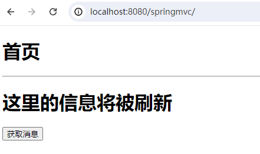
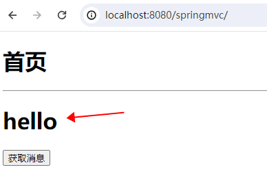
**注意：如果采用这种方式响应，则和 springmvc.xml 文件中配置的视图解析器没有关系，不走视图解析器了?*


难道我们以后AJAX请求都要使用原生Servlet API吗？

- 不需要，我们可以使用SpringMVC中提供的HttpMessageConverter消息转换器?
我们要向前端响应一个字符串"hello"，这?hello"就是响应协议中的响应体?我们可以使用 @ResponseBody 注解来启用对应的消息转换器。而这种消息转换器只负责将Controller返回的信息以响应体的形式写入响应协议?
# @ResponseBody
## StringHttpMessageConverter
上面的AJAX案例，Controller的代码可以修改为?```java
package com.powernode.springmvc.controller;

import org.springframework.stereotype.Controller;
import org.springframework.web.bind.annotation.RequestMapping;
import org.springframework.web.bind.annotation.ResponseBody;

@Controller
public class HelloController {

    @RequestMapping(value = "/hello")
    @ResponseBody
    public String hello(){
        // 由于你使用了 @ResponseBody 注解
        // 以下的return语句返回的字符串则不再是“逻辑视图名”了
        // 而是作为响应协议的响应体进行响应?        return "hello";
    }
}
```
最核心需要理解的位置是：return "hello";
这里?hello"不是逻辑视图名了，而是作为响应体的内容进行响应。直接输出到浏览器客户端?以上程序中使用的消息转换器是?*StringHttpMessageConverter**，为什么会启用这个消息转换器呢？因为你添加`@ResponseBody`这个注解?
通常AJAX请求需要服务器给返回一段JSON格式的字符串，可以返回JSON格式的字符串吗？当然可以，代码如下：
```java
package com.powernode.springmvc.controller;

import org.springframework.stereotype.Controller;
import org.springframework.web.bind.annotation.RequestMapping;
import org.springframework.web.bind.annotation.ResponseBody;

@Controller
public class HelloController {

    @RequestMapping(value = "/hello")
    @ResponseBody
    public String hello(){
        return "{\"username\":\"zhangsan\",\"password\":\"1234\"}";
    }
}
```


测试?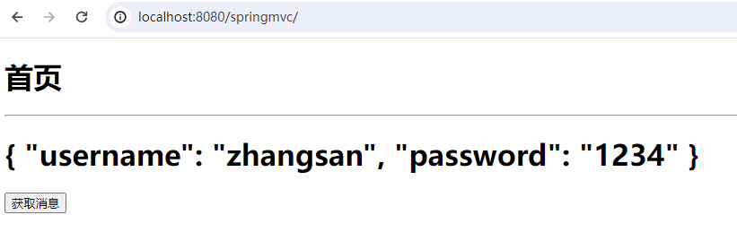
这是完全可以的，此时底层使用的消息转换器还是?*StringHttpMessageConverter**

那如果在程序中是一个POJO对象，怎么将POJO对象以JSON格式的字符串响应给浏览器呢？两种方式?
- 第一种方式：自己写代码将POJO对象转换成JSON格式的字符串，用上面的方式直接return即可?- 第二种方式：启用`MappingJackson2HttpMessageConverter`消息转换器?
## MappingJackson2HttpMessageConverter
启用MappingJackson2HttpMessageConverter消息转换器的步骤如下?
第一步：引入jackson依赖，可以将java对象转换为json格式字符?```xml
&lt;dependency&gt;
  &lt;groupId&gt;com.fasterxml.jackson.core&lt;/groupId&gt;
  &lt;artifactId&gt;jackson-databind&lt;/artifactId&gt;
  &lt;version&gt;2.17.0&lt;/version&gt;
&lt;/dependency&gt;
```

第二步：开启注解驱?这一步非常关键，开启注解驱动后，在HandlerAdapter中会自动装配一个消息转换器：MappingJackson2HttpMessageConverter
```xml
&lt;mvc:annotation-driven/&gt;
```


第三步：准备一个POJO
```java
package com.powernode.springmvc.bean;

public class User {
    private String username;
    private String password;

    public User() {
    }

    public User(String username, String password) {
        this.username = username;
        this.password = password;
    }

    public String getUsername() {
        return username;
    }

    public void setUsername(String username) {
        this.username = username;
    }

    public String getPassword() {
        return password;
    }

    public void setPassword(String password) {
        this.password = password;
    }
}
```


第四步：控制器方法使?@ResponseBody 注解标注(非常重要），控制器方法返回这个POJO对象
```java
package com.powernode.springmvc.controller;

import com.powernode.springmvc.bean.User;
import org.springframework.stereotype.Controller;
import org.springframework.web.bind.annotation.RequestMapping;
import org.springframework.web.bind.annotation.ResponseBody;

@Controller
public class HelloController {

    @RequestMapping(value = "/hello")
    @ResponseBody
    public User hello(){
        User user = new User("zhangsan", "22222");
        return user;
    }
}

```


测试?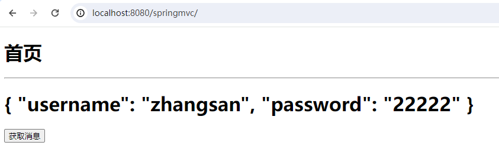

以上代码底层启用的就?MappingJackson2HttpMessageConverter 消息转换器?他的功能很强大，可以将POJO对象转换成JSON格式的字符串，响应给前端?其实这个消息转换器`MappingJackson2HttpMessageConverter`本质上只是比`StringHttpMessageConverter`多了一个json字符串的转换，其他的还是一样?
# @RestController
因为我们现代的开发方式都是基于AJAX方式的，因此 @ResponseBody 注解非常重要，很常用?为了方便，Spring MVC中提供了一个注?@RestController。这一个注解代表了：@Controller + @ResponseBody?@RestController 标注在类上即可。被它标注的Controller中所有的方法上都会自动标?@ResponseBody

```java
package com.powernode.springmvc.controller;

import com.powernode.springmvc.bean.User;
import org.springframework.web.bind.annotation.RequestMapping;
import org.springframework.web.bind.annotation.RestController;

@RestController
public class HelloController {

    @RequestMapping(value = "/hello")
    public User hello(){
        User user = new User("zhangsan", "22222");
        return user;
    }
}

```


测试?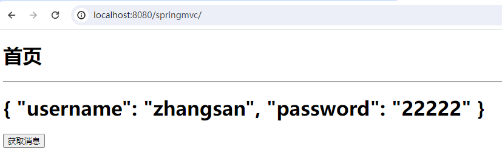

# @RequestBody
## FormHttpMessageConverter
这个注解的作用是直接将请求体传递给Java程序，在Java程序中可以直接使用一个String类型的变量接收这个请求体的内容?
在没有使用这个注解的时候：
```java
@RequestMapping("/save")
public String save(User user){
    // 执行保存的业务逻辑
    userDao.save(user);
    // 保存成功跳转到成功页?    return "success";
}
```
当请求体提交的数据是?```
username=zhangsan&password=1234&email=zhangsan@powernode.com
```
那么Spring MVC会自动使?`FormHttpMessageConverter`消息转换器，将请求体转换成user对象?

当使用这个注解的时候：**这个注解只能出现在方法的参数上?*
```java
@RequestMapping("/save")
public String save(@RequestBody String requestBodyStr){
    System.out.println("请求体：" + requestBodyStr);
    return "success";
}
```
Spring MVC仍然会使?`FormHttpMessageConverter`消息转换器，将请求体直接以字符串形式传递给 requestBodyStr 变量?测试输出结果?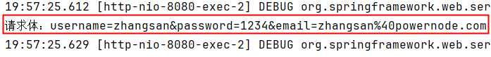

## MappingJackson2HttpMessageConverter
另外，如果在请求体中提交的是一个JSON格式的字符串，这个JSON字符串传递给Spring MVC之后，能不能将JSON字符串转换成POJO对象呢？答案是可以的?此时必须使用@RequestBody 注解来完?。并且底层使用的消息转换器是：`MappingJackson2HttpMessageConverter`。实现步骤如下：

- 第一步：引入jackson依赖
- 第二步：开启注解驱?- 第三步：创建POJO类，将POJO类作为控制器方法的参数，并使?@RequestBody 注解标注该参?```java
@RequestMapping("/send")
@ResponseBody
public String send(@RequestBody User user){
    System.out.println(user);
    System.out.println(user.getUsername());
    System.out.println(user.getPassword());
    return "success";
}
```

- 第四步：在请求体中提交json格式的数?```html
<!DOCTYPE html>
<html lang="en" xmlns:th="http://www.thymeleaf.org">
<head>
    <meta charset="UTF-8">
    <title>首页</title>
    <script th:src="@{/static/js/vue3.4.21.js}"></script>
    <script th:src="@{/static/js/axios.min.js}"></script>
</head>
<body>

<div id="app">
    <button @click="sendJSON">通过POST请求发送JSON给服务器</button>
    <h1>{{message}}</h1>
</div>

<script>
    let jsonObj = {"username":"zhangsan", "password":"1234"}

    Vue.createApp({
        data(){
            return {
                message:""
            }
        },
        methods: {
            async sendJSON(){
                console.log("sendjson")
                try{
                    const res = await axios.post('/springmvc/send', JSON.stringify(jsonObj), {
                        headers : {
                            "Content-Type" : "application/json"
                        }
                    })
                    this.message = res.data
                }catch(e){
                    console.error(e)
                }
            }
        }
    }).mount("#app")
</script>

</body>
</html>
```


测试结果?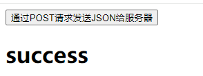

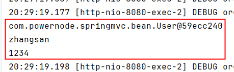


# RequestEntity
RequestEntity不是一个注解，是一个普通的类。这个类的实例封装了整个请求协议：包括请求行、请求头、请求体所有信息?出现在控制器方法的参数上?```html
<!DOCTYPE html>
&lt;html lang="en" xmlns:th="http://www.thymeleaf.org"&gt;
&lt;head&gt;
    &lt;meta charset="UTF-8"&gt;
    &lt;title&gt;首页&lt;/title&gt;
    &lt;script th:src="@{/static/js/vue3.4.21.js}"&gt;&lt;/script&gt;
    &lt;script th:src="@{/static/js/axios.min.js}"&gt;&lt;/script&gt;
&lt;/head&gt;
&lt;body&gt;

&lt;div id="app"&gt;
    &lt;button @click="sendJSON"&gt;通过POST请求发送JSON给服务器&lt;/button&gt;
    &lt;h1&gt;{{message}}&lt;/h1&gt;
&lt;/div&gt;

&lt;script&gt;
    let jsonObj = {"username":"zhangsan", "password":"1234"}

    Vue.createApp({
        data(){
            return {
                message:""
            }
        },
        methods: {
            async sendJSON(){
                console.log("sendjson")
                try{
                    const res = await axios.post('/springmvc/send', JSON.stringify(jsonObj), {
                        headers : {
                            "Content-Type" : "application/json"
                        }
                    })
                    this.message = res.data
                }catch(e){
                    console.error(e)
                }
            }
        }
    }).mount("#app")
&lt;/script&gt;

&lt;/body&gt;
&lt;/html&gt;
```
```java
@RequestMapping("/send")
@ResponseBody
public String send(RequestEntity&lt;User&gt; requestEntity){
    System.out.println("请求方式? + requestEntity.getMethod());
    System.out.println("请求URL? + requestEntity.getUrl());
    HttpHeaders headers = requestEntity.getHeaders();
    System.out.println("请求的内容类型：" + headers.getContentType());
    System.out.println("请求头：" + headers);

    User user = requestEntity.getBody();
    System.out.println(user);
    System.out.println(user.getUsername());
    System.out.println(user.getPassword());
    return "success";
}
```
测试结果?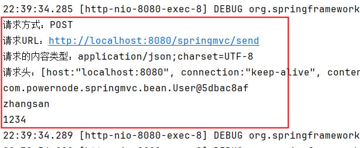
在实际的开发中，如果你需要获取更详细的请求协议中的信息。可以使用`RequestEntity`

# ResponseEntity
ResponseEntity不是注解，是一个类。用该类的实例可以封装响应协议，包括：状态行、响应头、响应体。也就是说：如果你想定制属于自己的响应协议，可以使用该类?假如我要完成这样一个需求：前端提交一个id，后端根据id进行查询，如果返回null，请在前端显?04错误。如果返回不是null，则输出返回的user?```java
@Controller
public class UserController {
     
    @GetMapping("/users/{id}")
    public ResponseEntity<User> getUserById(@PathVariable Long id) {
        User user = userService.getUserById(id);
        if (user == null) {
            return ResponseEntity.status(HttpStatus.NOT_FOUND).body(null);
        } else {
            return ResponseEntity.ok(user);
        }
    }
}
```


测试：当用户不存在时


测试：当用户存在?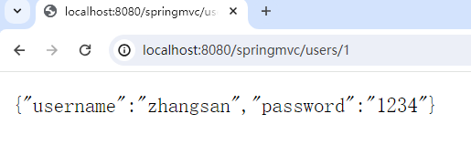
# 文件上传
使用SpringMVC6版本?*不需?*添加以下依赖?```xml
&lt;dependency&gt;
    &lt;groupId&gt;commons-fileupload&lt;/groupId&gt;
    &lt;artifactId&gt;commons-fileupload&lt;/artifactId&gt;
    &lt;version&gt;1.5&lt;/version&gt;
&lt;/dependency&gt;
```
前端页面?```html
<!DOCTYPE html>
<html lang="en" xmlns:th="http://www.thymeleaf.org">
<head>
    <meta charset="UTF-8">
    <title>文件上传</title>
</head>
<body>

<!--文件上传表单-->
<form th:action="@{/file/up}" method="post" enctype="multipart/form-data">
    文件?input type="file" name="fileName"/><br>
    <input type="submit" value="上传">
</form>

</body>
</html>
```
重点是：form表单采用post请求，enctype是multipart/form-data，并且上传组件是：type="file"


web.xml文件?```xml
<!--前端控制?->
&lt;servlet&gt;
    &lt;servlet-name&gt;dispatcherServlet&lt;/servlet-name&gt;
    &lt;servlet-class&gt;org.springframework.web.servlet.DispatcherServlet&lt;/servlet-class&gt;
    &lt;init-param&gt;
        &lt;param-name&gt;contextConfigLocation&lt;/param-name&gt;
        &lt;param-value&gt;classpath:springmvc.xml&lt;/param-value&gt;
    &lt;/init-param&gt;
    &lt;load-on-startup&gt;1&lt;/load-on-startup&gt;
    &lt;multipart-config&gt;
        <!--设置单个支持最大文件的大小-->
        &lt;max-file-size&gt;102400&lt;/max-file-size&gt;
        <!--设置整个表单所有文件上传的最大?->
        &lt;max-request-size&gt;102400&lt;/max-request-size&gt;
        <!--设置最小上传文件大?->
        &lt;file-size-threshold&gt;0&lt;/file-size-threshold&gt;
    &lt;/multipart-config&gt;
&lt;/servlet&gt;
&lt;servlet-mapping&gt;
    &lt;servlet-name&gt;dispatcherServlet&lt;/servlet-name&gt;
    &lt;url-pattern&gt;/&lt;/url-pattern&gt;
&lt;/servlet-mapping&gt;
```
**重点：在DispatcherServlet配置时，添加 multipart-config 配置信息。（这是Spring6，如果是Spring5，则不是这样配置，而是在springmvc.xml文件中配置：CommonsMultipartResolver?*
**SpringMVC6中把这个类已经删除了。废弃了?*


Controller中的代码?```java
package com.powernode.springmvc.controller;

import jakarta.servlet.http.HttpServletRequest;
import org.springframework.stereotype.Controller;
import org.springframework.web.bind.annotation.RequestMapping;
import org.springframework.web.bind.annotation.RequestMethod;
import org.springframework.web.bind.annotation.RequestParam;
import org.springframework.web.multipart.MultipartFile;

import java.io.*;
import java.util.UUID;

@Controller
public class FileController {

    @RequestMapping(value = "/file/up", method = RequestMethod.POST)
    public String fileUp(@RequestParam("fileName") MultipartFile multipartFile, HttpServletRequest request) throws IOException {
        String name = multipartFile.getName();
        System.out.println(name);
        // 获取文件?        String originalFilename = multipartFile.getOriginalFilename();
        System.out.println(originalFilename);
        // 将文件存储到服务器中
        // 获取输入?        InputStream in = multipartFile.getInputStream();
        // 获取上传之后的存放目?        File file = new File(request.getServletContext().getRealPath("/upload"));
        // 如果服务器目录不存在则新?        if(!file.exists()){
            file.mkdirs();
        }
        // 开始写
        //BufferedOutputStream out = new BufferedOutputStream(new FileOutputStream(file.getAbsolutePath() + "/" + originalFilename));
        // 可以采用UUID来生成文件名，防止服务器上传文件时产生覆?        BufferedOutputStream out = new BufferedOutputStream(new FileOutputStream(file.getAbsolutePath() + "/" + UUID.randomUUID().toString() + originalFilename.substring(originalFilename.lastIndexOf("."))));
        byte[] bytes = new byte[1024 * 100];
        int readCount = 0;
        while((readCount = in.read(bytes)) != -1){
            out.write(bytes,0,readCount);
        }
        // 刷新缓冲?        out.flush();
        // 关闭?        in.close();
        out.close();

        return "ok";
    }

}

```


最终测试结果：
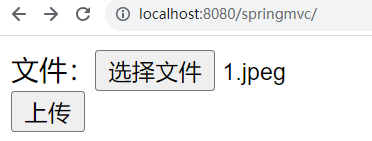

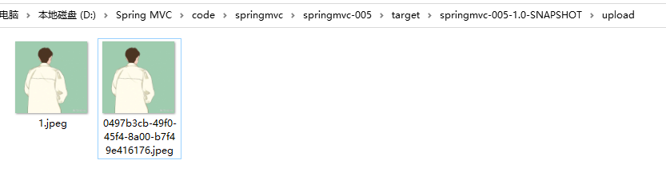

**建议：上传文件时，文件起名采用UUID。以防文件覆盖?*

# 文件下载
```html
<!--文件下载-->
<a th:href="@{/download}">文件下载</a>
```

文件下载核心程序，使用ResponseEntity?```java
@GetMapping("/download")
public ResponseEntity&lt;byte[]&gt; downloadFile(HttpServletResponse response, HttpServletRequest request) throws IOException {
    File file = new File(request.getServletContext().getRealPath("/upload") + "/1.jpeg");
    // 创建响应头对?    HttpHeaders headers = new HttpHeaders();
    // 设置响应内容类型
    headers.setContentType(MediaType.APPLICATION_OCTET_STREAM);
    // 设置下载文件的名?    headers.setContentDispositionFormData("attachment", file.getName());

    // 下载文件
    ResponseEntity&lt;byte[]&gt; entity = new ResponseEntity&lt;byte[]&gt;(Files.readAllBytes(file.toPath()), headers, HttpStatus.OK);
    return entity;
}
```


效果?

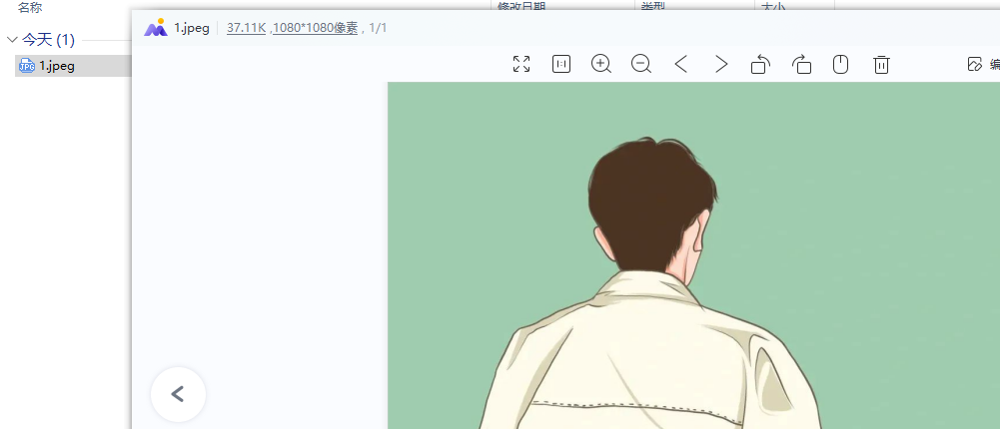

# 什么是异常处理?Spring MVC在`处理器方法`执行过程中出现了异常，可以采用`异常处理器`进行应对?一句话概括异常处理器作用：处理器方法执行过程中出现了异常，跳转到对应的视图，在视图上展示友好信息?
SpringMVC为异常处理提供了一个接口：HandlerExceptionResolver

核心方法是：resolveException?该方法用来编写具体的异常处理方案。返回值ModelAndView，表示异常处理完之后跳转到哪个视图?
HandlerExceptionResolver 接口有两个常用的默认实现?
- DefaultHandlerExceptionResolver
- SimpleMappingExceptionResolver

# 默认的异常处理器
DefaultHandlerExceptionResolver 是默认的异常处理器?核心方法?
当请求方式和处理方式不同时，DefaultHandlerExceptionResolver的默认处理态度是：
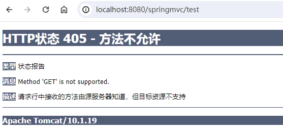

# 自定义的异常处理?自定义异常处理器需要使用：SimpleMappingExceptionResolver
自定义异常处理机制有两种语法?
- 通过XML配置文件
- 通过注解
## 配置文件方式
```xml
&lt;bean class="org.springframework.web.servlet.handler.SimpleMappingExceptionResolver"&gt;
    &lt;property name="exceptionMappings"&gt;
        &lt;props&gt;
            <!--用来指定出现异常后，跳转的视?->
            &lt;prop key="java.lang.Exception"&gt;tip&lt;/prop&gt;
        &lt;/props&gt;
    &lt;/property&gt;
    <!--将异常信息存储到request域，value属性用来指定存储时的key?->
    &lt;property name="exceptionAttribute" value="e"/&gt;
&lt;/bean&gt;
```
在视图页面上展示异常信息?```html
<!DOCTYPE html>
<html lang="en" xmlns:th="http://www.thymeleaf.org">
<head>
    <meta charset="UTF-8">
    <title>出错?/title>
</head>
<body>
<h1>出错了，请联系管理员?/h1>
<div th:text="${e}"></div>
</body>
</html>
```


## 注解方式
```java
@ControllerAdvice
public class ExceptionController {

    @ExceptionHandler
    public String tip(Exception e, Model model){
        model.addAttribute("e", e);
        return "tip";
    }
}
```


# 拦截器概?**拦截器（Interceptor）类似于过滤器（Filter?*
Spring MVC的拦截器作用是在请求到达控制器之前或之后进行拦截，可以对请求和响应进行一些特定的处理?拦截器可以用于很多场景下?
1.  登录验证：对于需要登录才能访问的网址，使用拦截器可以判断用户是否已登录，如果未登录则跳转到登录页面?
2.  权限校验：根据用户权限对部分网址进行访问控制，拒绝未经授权的用户访问?
3.  请求日志：记录请求信息，例如请求地址、请求参数、请求时间等，用于排查问题和性能优化?
4.  更改响应：可以对响应的内容进行修改，例如添加头信息、调整响应内容格式等?

拦截器和过滤器的区别在于它们的作用层面不同?
- 过滤器更注重在请求和响应的流程中进行处理，可以修改请求和响应的内容，例如设置编码和字符集、请求头、状态码等?- 拦截器则更加侧重于对控制器进行前置或后置处理，在请求到达控制器之前或之后进行特定的操作，例如打印日志、权限验证等?
**Filter、Servlet、Interceptor、Controller的执行顺序：**
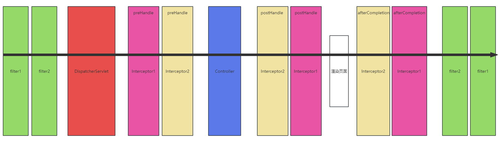

# 拦截器的创建与基本配?## 定义拦截?实现`org.springframework.web.servlet.HandlerInterceptor` 接口，共有三个方法可以进行选择性的实现?
- preHandle：处理器方法调用之前执行
   - **只有该方法有返回值，返回值是布尔类型，true放行，false拦截?*
- postHandle：处理器方法调用之后执行
- afterCompletion：渲染完成后执行

## 拦截器基本配?在springmvc.xml文件中进行如下配置：
第一种方式：
```xml
<mvc:interceptors>
    <bean class="com.powernode.springmvc.interceptors.Interceptor1"/>
</mvc:interceptors>
```

第二种方式：
```xml
<mvc:interceptors>
    <ref bean="interceptor1"/>
</mvc:interceptors>
```
第二种方式的前提?
- 前提1：包扫描

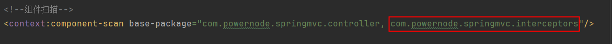

- 前提2：使?@Component 注解进行标注


**注意：对于这种基本配置来说，拦截器是拦截所有请求的?*

## 拦截器部分源码分?### 方法执行顺序的源码分?```java
public class DispatcherServlet extends FrameworkServlet {
    protected void doDispatch(HttpServletRequest request, HttpServletResponse response) throws Exception {
        // 调用所有拦截器?preHandle 方法
        if (!mappedHandler.applyPreHandle(processedRequest, response)) {
            return;
        }
        // 调用处理器方?        mv = ha.handle(processedRequest, response, mappedHandler.getHandler());
        // 调用所有拦截器?postHandle 方法
        mappedHandler.applyPostHandle(processedRequest, response, mv);
        // 处理视图
        processDispatchResult(processedRequest, response, mappedHandler, mv, dispatchException);
    }

    private void processDispatchResult(HttpServletRequest request, HttpServletResponse response,
			@Nullable HandlerExecutionChain mappedHandler, @Nullable ModelAndView mv,
			@Nullable Exception exception) throws Exception {
        // 渲染页面
        render(mv, request, response);
        // 调用所有拦截器?afterCompletion 方法
        mappedHandler.triggerAfterCompletion(request, response, null);
    }
}
```

### 拦截与放行的源码分析
```java
public class DispatcherServlet extends FrameworkServlet {
    protected void doDispatch(HttpServletRequest request, HttpServletResponse response) throws Exception {
        // 调用所有拦截器?preHandle 方法
        if (!mappedHandler.applyPreHandle(processedRequest, response)) {
            // 如果 mappedHandler.applyPreHandle(processedRequest, response) 返回false，以下的return语句就会执行
            return;
        }
    }
}
```
```java
public class HandlerExecutionChain {
    boolean applyPreHandle(HttpServletRequest request, HttpServletResponse response) throws Exception {
		for (int i = 0; i < this.interceptorList.size(); i++) {
			HandlerInterceptor interceptor = this.interceptorList.get(i);
			if (!interceptor.preHandle(request, response, this.handler)) {
				triggerAfterCompletion(request, response, null);
                // 如果 interceptor.preHandle(request, response, this.handler) 返回 false，以下的 return false;就会执行?				return false;
			}
			this.interceptorIndex = i;
		}
		return true;
	}
}
```

# 拦截器的高级配置
采用以上基本配置方式，拦截器是拦截所有请求路径的。如果要针对某些路径进行拦截，某些路径不拦截，可以采用高级配置：
```xml
&lt;mvc:interceptors&gt;
    &lt;mvc:interceptor&gt;
        <!--拦截所有路?->
        &lt;mvc:mapping path="/**"/&gt;
        <!--?/test 路径之外-->
        &lt;mvc:exclude-mapping path="/test"/&gt;
        <!--拦截?->
        &lt;ref bean="interceptor1"/&gt;
    &lt;/mvc:interceptor&gt;
&lt;/mvc:interceptors&gt;
```
以上的配置表示，?/test 请求路径之外，剩下的路径全部拦截?
# 拦截器的执行顺序
## 执行顺序
### 如果所有拦截器preHandle都返回true
按照springmvc.xml文件中配置的顺序，自上而下调用 preHandle?```xml
<mvc:interceptors>
    <ref bean="interceptor1"/>
    <ref bean="interceptor2"/>
</mvc:interceptors>
```
执行顺序?

### 如果其中一个拦截器preHandle返回false
```xml
<mvc:interceptors>
    <ref bean="interceptor1"/>
    <ref bean="interceptor2"/>
</mvc:interceptors>
```
如果`interceptor2`的preHandle返回false，执行顺序：

规则：只要有一个拦截器`preHandle`返回false，任何`postHandle`都不执行。但返回false的拦截器的前面的拦截器按照逆序执行`afterCompletion`?
## 源码分析
DispatcherServlet?HandlerExecutionChain的部分源码：
```java
public class DispatcherServlet extends FrameworkServlet {
    protected void doDispatch(HttpServletRequest request, HttpServletResponse response) throws Exception {
        // 按照顺序执行所有拦截器的preHandle方法
        if (!mappedHandler.applyPreHandle(processedRequest, response)) {
            return;
        }
        // 执行处理器方?        mv = ha.handle(processedRequest, response, mappedHandler.getHandler());
        // 按照逆序执行所有拦截器?postHanle 方法
        mappedHandler.applyPostHandle(processedRequest, response, mv);
        // 处理视图
        processDispatchResult(processedRequest, response, mappedHandler, mv, dispatchException);
    }

    private void processDispatchResult(HttpServletRequest request, HttpServletResponse response,
			@Nullable HandlerExecutionChain mappedHandler, @Nullable ModelAndView mv,
			@Nullable Exception exception) throws Exception {
        // 渲染视图
        render(mv, request, response);
        // 按照逆序执行所有拦截器?afterCompletion 方法
        mappedHandler.triggerAfterCompletion(request, response, null);
    }
}
```
```java
public class HandlerExecutionChain {
    // 顺序执行 preHandle
    boolean applyPreHandle(HttpServletRequest request, HttpServletResponse response) throws Exception {
        for (int i = 0; i < this.interceptorList.size(); i++) {
            HandlerInterceptor interceptor = this.interceptorList.get(i);
            if (!interceptor.preHandle(request, response, this.handler)) {
                // 如果其中一个拦截器preHandle返回false
                // 将该拦截器前面的拦截器按照逆序执行所有的afterCompletion
                triggerAfterCompletion(request, response, null);
                return false;
            }
            this.interceptorIndex = i;
        }
        return true;
	}
    // 逆序执行 postHanle
    void applyPostHandle(HttpServletRequest request, HttpServletResponse response, @Nullable ModelAndView mv) throws Exception {
        for (int i = this.interceptorList.size() - 1; i >= 0; i--) {
            HandlerInterceptor interceptor = this.interceptorList.get(i);
            interceptor.postHandle(request, response, this.handler, mv);
        }
	}
    // 逆序执行 afterCompletion
	void triggerAfterCompletion(HttpServletRequest request, HttpServletResponse response, @Nullable Exception ex) {
		for (int i = this.interceptorIndex; i >= 0; i--) {
			HandlerInterceptor interceptor = this.interceptorList.get(i);
			try {
				interceptor.afterCompletion(request, response, this.handler, ex);
			}
			catch (Throwable ex2) {
				logger.error("HandlerInterceptor.afterCompletion threw exception", ex2);
			}
		}
	}
}
```

# 从源码角度看执行流程
以下是核心代码：
```java
public class DispatcherServlet extends FrameworkServlet {
    protected void doDispatch(HttpServletRequest request, HttpServletResponse response) throws Exception {
        // 根据请求对象request获取
        // 这个对象是在每次发送请求时都创建一个，是请求级别的
        // 该对象中描述了本次请求应该执行的拦截器是哪些，顺序是怎样的，要执行的处理器是哪个
        HandlerExecutionChain mappedHandler = getHandler(processedRequest);

        // 根据处理器获取处理器适配器。（底层使用了适配器模式）
        // HandlerAdapter在web服务器启动的时候就创建好了。（启动时创建多个HandlerAdapter放在List集合中）
        // HandlerAdapter有多种类型：
        // RequestMappingHandlerAdapter：用于适配使用注解 @RequestMapping 标记的控制器方法
        // SimpleControllerHandlerAdapter：用于适配实现?Controller 接口的控制器
        // 注意：此时还没有进行数据绑定（也就是说，表单提交的数据，此时还没有转换为pojo对象。）
        HandlerAdapter ha = getHandlerAdapter(mappedHandler.getHandler());

        // 执行请求对应的所有拦截器中的 preHandle 方法
        if (!mappedHandler.applyPreHandle(processedRequest, response)) {
            return;
        }

        // 通过处理器适配器调用处理器方法
        // 在调用处理器方法之前会进行数据绑定，将表单提交的数据绑定到处理器方法上。（底层是通过WebDataBinder完成的）
        // 在数据绑定的过程中会使用到消息转换器：HttpMessageConverter
        // 结束后返回ModelAndView对象
        mv = ha.handle(processedRequest, response, mappedHandler.getHandler());

        //  执行请求对应的所有拦截器中的 postHandle 方法
        mappedHandler.applyPostHandle(processedRequest, response, mv);

        // 处理分发结果（在这个方法中完成了响应?        processDispatchResult(processedRequest, response, mappedHandler, mv, dispatchException);
    }

    // 根据每一次的请求对象来获取处理器执行链对?    protected HandlerExecutionChain getHandler(HttpServletRequest request) throws Exception {
		if (this.handlerMappings != null) {
            // HandlerMapping在服务器启动的时候就创建好了，放到了List集合中。HandlerMapping也有多种类型
            // RequestMappingHandlerMapping：将 URL 映射到使用注?@RequestMapping 标记的控制器方法的处理器?            // SimpleUrlHandlerMapping：将 URL 映射到处理器中指定的 URL ?URL 模式的处理器?			for (HandlerMapping mapping : this.handlerMappings) {
                // 重点：这是一次请求的开始，实际上是通过处理器映射器来获取的处理器执行链对象
                // 底层实际上会通过 HandlerMapping 对象获取 HandlerMethod对象，将HandlerMethod 对象传递给 HandlerExecutionChain对象?                // 注意：HandlerMapping对象和HandlerMethod对象都是在服务器启动阶段创建的?                // RequestMappingHandlerMapping对象中有多个HandlerMethod对象?				HandlerExecutionChain handler = mapping.getHandler(request);
				if (handler != null) {
					return handler;
				}
			}
		}
		return null;
	}

    private void processDispatchResult(HttpServletRequest request, HttpServletResponse response,
			@Nullable HandlerExecutionChain mappedHandler, @Nullable ModelAndView mv,
			@Nullable Exception exception) throws Exception {
        // 渲染
        render(mv, request, response);
        // 渲染完毕后，调用该请求对应的所有拦截器?afterCompletion方法?        mappedHandler.triggerAfterCompletion(request, response, null);
    }

    protected void render(ModelAndView mv, HttpServletRequest request, HttpServletResponse response) throws Exception {
        // 通过视图解析器返回视图对?        view = resolveViewName(viewName, mv.getModelInternal(), locale, request);
        // 真正的渲染视?        view.render(mv.getModelInternal(), request, response);
    }

    protected View resolveViewName(String viewName, @Nullable Map<String, Object> model,
			Locale locale, HttpServletRequest request) throws Exception {
        // 通过视图解析器返回视图对?        View view = viewResolver.resolveViewName(viewName, locale);
	}
}
```
```java
public interface ViewResolver {
    View resolveViewName(String viewName, Locale locale) throws Exception;
}
```
```java
public interface View {
    void render(@Nullable Map<String, ?> model, HttpServletRequest request, HttpServletResponse response)
			throws Exception;
}
```


# 从图片角度看执行流程
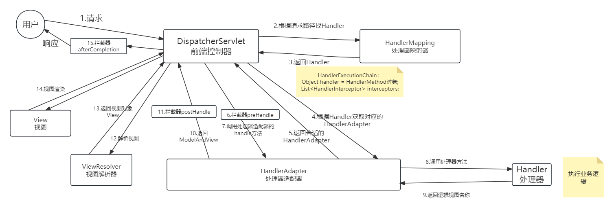

先搞明白核心类的继承关系?DispatcherServlet extends FrameworkServlet extends HttpServletBean extends HttpServlet extends GenericServlet implements Servlet

服务器启动阶段完成了?
1. 初始化Spring上下文，也就是创建所有的bean，让IoC容器将其管理起来?2. 初始化SpringMVC相关的对象：处理器映射器，处理器适配器等。。?


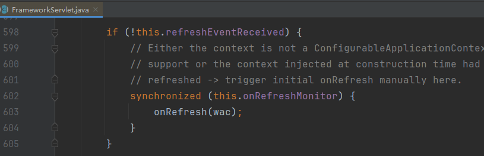
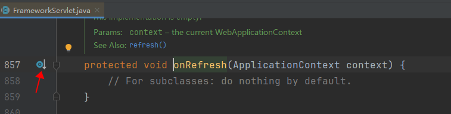


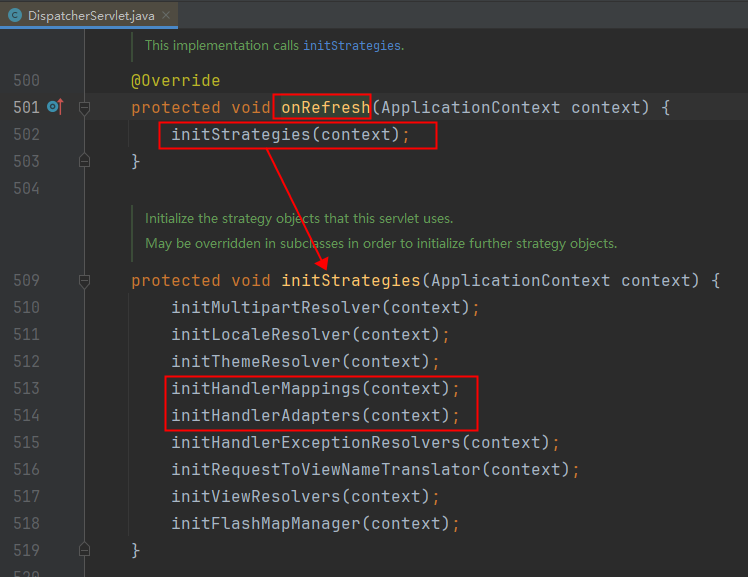

# 整个完整系统的参与?对于一个完整的web项目参与者包括：

- Servlet规范的制定者（已有?- 实现Servlet规范的Tomcat服务器（已有?- Spring MVC框架的开发者（手写Spring MVC框架?- 编写webapp的开发者（用Spring MVC框架的人?
# 基本结构搭建
## 创建Maven模块
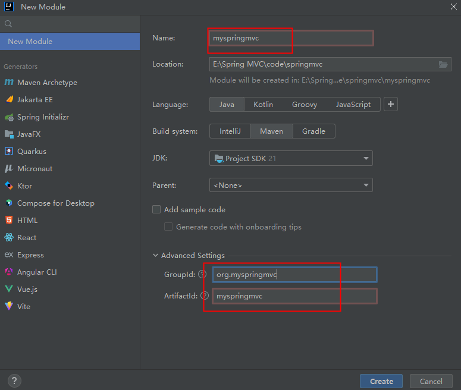

## 引入Servlet依赖
```xml
<?xml version="1.0" encoding="UTF-8"?>
<project xmlns="http://maven.apache.org/POM/4.0.0"
         xmlns:xsi="http://www.w3.org/2001/XMLSchema-instance"
         xsi:schemaLocation="http://maven.apache.org/POM/4.0.0 http://maven.apache.org/xsd/maven-4.0.0.xsd">
    <modelVersion>4.0.0</modelVersion>

    <groupId>org.springmvc</groupId>
    <artifactId>myspringmvc</artifactId>
    <version>1.0-SNAPSHOT</version>
    <packaging>war</packaging>

    <dependencies>
        <!--servlet api-->
        <dependency>
            <groupId>jakarta.servlet</groupId>
            <artifactId>jakarta.servlet-api</artifactId>
            <version>6.0.0</version>
            <scope>provided</scope>
        </dependency>
    </dependencies>

    <properties>
        <maven.compiler.source>21</maven.compiler.source>
        <maven.compiler.target>21</maven.compiler.target>
        <project.build.sourceEncoding>UTF-8</project.build.sourceEncoding>
    </properties>

</project>
```

## 配置Tomcat服务?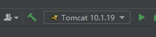
## 添加web支持
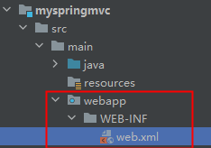
```xml
<?xml version="1.0" encoding="UTF-8"?>
<web-app xmlns="https://jakarta.ee/xml/ns/jakartaee"
         xmlns:xsi="http://www.w3.org/2001/XMLSchema-instance"
         xsi:schemaLocation="https://jakarta.ee/xml/ns/jakartaee https://jakarta.ee/xml/ns/jakartaee/web-app_6_0.xsd"
         version="6.0">
</web-app>
```

## 创建基本类和接口
根据Spring MVC执行流程，目前先创建出以下的类和接口，后期如果需要其他的再添加：
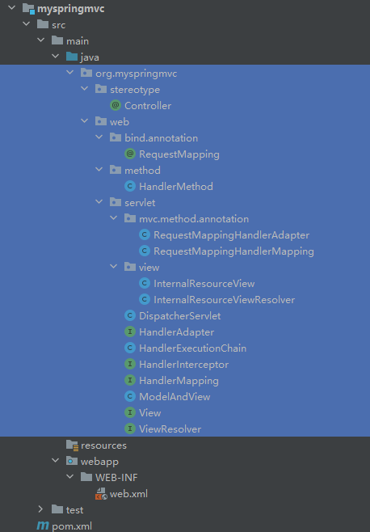

# 部分类和接口的代码完?## @Controller注解
```java
package org.myspringmvc.stereotype;

import java.lang.annotation.ElementType;
import java.lang.annotation.Retention;
import java.lang.annotation.RetentionPolicy;
import java.lang.annotation.Target;

/**
 * ClassName: Controller
 * Description: 用来标注处理器，被标注的处理器，纳入IoC容器的管理。该注解只允许出现在类上，另外可以被反射机制读取? * Datetime: 2024/4/2 9:01
 * Author: 老杜@动力节点
 * Version: 1.0
 */
@Target(ElementType.TYPE)
@Retention(RetentionPolicy.RUNTIME)
public @interface Controller {
}

```

## RequestMethod枚举（新建）
```java
package org.myspringmvc.web.bind.annotation;

/**
 * ClassName: RequestMethod
 * Description: 请求方式枚举
 * Datetime: 2024/4/2 10:35
 * Author: 老杜@动力节点
 * Version: 1.0
 */
public enum RequestMethod {
    GET, POST
}

```

## @RequestMapping注解
```java
package org.myspringmvc.web.bind.annotation;

import java.lang.annotation.ElementType;
import java.lang.annotation.Retention;
import java.lang.annotation.RetentionPolicy;
import java.lang.annotation.Target;

/**
 * ClassName: RequestMapping
 * Description: 用来标注处理器方法，允许标注方法和类，可以被反射机制读取? * Datetime: 2024/4/2 8:59
 * Author: 老杜@动力节点
 * Version: 1.0
 */
@Target({ElementType.TYPE, ElementType.METHOD})
@Retention(RetentionPolicy.RUNTIME)
public @interface RequestMapping {
    /**
     * 用来指定请求路径
     * @return
     */
    String[] value();

    /**
     * 用来指定请求方式
     * @return
     */
    RequestMethod method();
}

```

## HandlerMethod
```java
package org.myspringmvc.web.method;

import java.lang.reflect.Method;

/**
 * ClassName: HandlerMethod
 * Description: 处理器方? * Datetime: 2024/4/2 8:53
 * Author: 老杜@动力节点
 * Version: 1.0
 */
public class HandlerMethod {
    /**
     * 处理器对?     */
    private Object handler;
    /**
     * 要执行的方法
     */
    private Method method;

    public HandlerMethod() {
    }

    public HandlerMethod(Object handler, Method method) {
        this.handler = handler;
        this.method = method;
    }

    public Object getHandler() {
        return handler;
    }

    public void setHandler(Object handler) {
        this.handler = handler;
    }

    public Method getMethod() {
        return method;
    }

    public void setMethod(Method method) {
        this.method = method;
    }
}

```

## HandlerMapping接口
```java
package org.myspringmvc.web.servlet;

import jakarta.servlet.http.HttpServletRequest;

/**
 * ClassName: HandlerMapping
 * Description: 主要是通过请求获取对应的处理器执行链? * Datetime: 2024/4/2 8:50
 * Author: 老杜@动力节点
 * Version: 1.0
 */
public interface HandlerMapping {
    /**
     * 根据请求获取处理器执行链?     * @param request
     * @return
     * @throws Exception
     */
    HandlerExecutionChain getHandler(HttpServletRequest request) throws Exception;
}

```

## RequestMappingHandlerMapping
```java
package org.myspringmvc.web.servlet.mvc.method.annotation;

import jakarta.servlet.http.HttpServletRequest;
import org.myspringmvc.web.servlet.HandlerExecutionChain;
import org.myspringmvc.web.servlet.HandlerMapping;

/**
 * ClassName: RequestMappingHandlerMapping
 * Description:
 * Datetime: 2024/4/2 9:44
 * Author: 老杜@动力节点
 * Version: 1.0
 */
public class RequestMappingHandlerMapping implements HandlerMapping {
    @Override
    public HandlerExecutionChain getHandler(HttpServletRequest request) throws Exception {
        return null;
    }
}

```

## HandlerAdapter接口
```java
package org.myspringmvc.web.servlet;

import jakarta.servlet.http.HttpServletRequest;
import jakarta.servlet.http.HttpServletResponse;

/**
 * ClassName: HandlerAdapter
 * Description: 通过处理器适配器调用处理器方法
 * Datetime: 2024/4/2 8:51
 * Author: 老杜@动力节点
 * Version: 1.0
 */
public interface HandlerAdapter {
    /**
     * 执行处理器方?     * @param request
     * @param response
     * @param handler
     * @return
     * @throws Exception
     */
    ModelAndView handle(HttpServletRequest request, HttpServletResponse response, Object handler) throws Exception;
}

```

## RequestMappingHandlerAdapter
```java
package org.myspringmvc.web.servlet.mvc.method.annotation;

import jakarta.servlet.http.HttpServletRequest;
import jakarta.servlet.http.HttpServletResponse;
import org.myspringmvc.web.servlet.HandlerAdapter;
import org.myspringmvc.web.servlet.ModelAndView;

/**
 * ClassName: RequestMappingHandlerAdapter
 * Description:
 * Datetime: 2024/4/2 9:44
 * Author: 老杜@动力节点
 * Version: 1.0
 */
public class RequestMappingHandlerAdapter implements HandlerAdapter {
    @Override
    public ModelAndView handle(HttpServletRequest request, HttpServletResponse response, Object handler) throws Exception {
        return null;
    }
}

```

## View接口
```java
package org.myspringmvc.web.servlet;

import jakarta.servlet.http.HttpServletRequest;
import jakarta.servlet.http.HttpServletResponse;

import java.util.Map;

/**
 * ClassName: View
 * Description:
 * Datetime: 2024/4/2 8:58
 * Author: 老杜@动力节点
 * Version: 1.0
 */
public interface View {
    /**
     * 获取响应的内容类?     * @return
     */
    String getContentType();

    /**
     * 渲染
     * @param model
     * @param request
     * @param response
     * @throws Exception
     */
    void render(Map<String, ?> model, HttpServletRequest request, HttpServletResponse response)
            throws Exception;
}

```

## InternalResourceView
```java
package org.myspringmvc.web.servlet.view;

import jakarta.servlet.http.HttpServletRequest;
import jakarta.servlet.http.HttpServletResponse;
import org.myspringmvc.web.servlet.View;

import java.util.Map;

/**
 * ClassName: InternalResourceView
 * Description:
 * Datetime: 2024/4/2 10:17
 * Author: 老杜@动力节点
 * Version: 1.0
 */
public class InternalResourceView implements View {
    @Override
    public String getContentType() {
        return null;
    }

    @Override
    public void render(Map<String, ?> model, HttpServletRequest request, HttpServletResponse response) throws Exception {
    }
}

```

## ViewResolver接口
```java
package org.myspringmvc.web.servlet;

import java.util.Locale;

/**
 * ClassName: ViewResolver
 * Description:解析逻辑视图名称，返回视图对? * Datetime: 2024/4/2 8:58
 * Author: 老杜@动力节点
 * Version: 1.0
 */
public interface ViewResolver {
    /**
     * 解析逻辑视图名称，返回视图对?     * @param viewName
     * @param locale
     * @return
     * @throws Exception
     */
    View resolveViewName(String viewName, Locale locale) throws Exception;
}

```

## InternalResourceViewResolver
```java
package org.myspringmvc.web.servlet.view;

import org.myspringmvc.web.servlet.View;
import org.myspringmvc.web.servlet.ViewResolver;

import java.util.Locale;

/**
 * ClassName: InternalResourceViewResolver
 * Description:
 * Datetime: 2024/4/2 9:45
 * Author: 老杜@动力节点
 * Version: 1.0
 */
public class InternalResourceViewResolver implements ViewResolver {
    @Override
    public View resolveViewName(String viewName, Locale locale) throws Exception {
        return null;
    }
}

```

## DispatcherServlet
```java
package org.myspringmvc.web.servlet;

import jakarta.servlet.ServletException;
import jakarta.servlet.http.HttpServlet;
import jakarta.servlet.http.HttpServletRequest;
import jakarta.servlet.http.HttpServletResponse;

import java.io.IOException;

/**
 * ClassName: DispatcherServlet
 * Description:
 * Datetime: 2024/4/2 8:50
 * Author: 老杜@动力节点
 * Version: 1.0
 */
public class DispatcherServlet extends HttpServlet {
    @Override
    public void init() throws ServletException {

    }

    @Override
    protected void service(HttpServletRequest req, HttpServletResponse resp) throws ServletException, IOException {
        doDispatch(req, resp);
    }

    /**
     * 处理请求的核心方?     * @param request
     * @param response
     * @throws ServletException
     * @throws IOException
     */
    private void doDispatch(HttpServletRequest request, HttpServletResponse response) throws ServletException, IOException {
    }
}

```

## HandlerExecutionChain
```java
package org.myspringmvc.web.servlet;

import java.util.List;

/**
 * ClassName: HandlerExecutionChain
 * Description:
 * Datetime: 2024/4/2 8:55
 * Author: 老杜@动力节点
 * Version: 1.0
 */
public class HandlerExecutionChain {
    private Object handler;
    private List<HandlerInterceptor> interceptorList;
    private int interceptorIndex = -1;

    public HandlerExecutionChain() {
    }

    public HandlerExecutionChain(Object handler, List<HandlerInterceptor> interceptorList) {
        this.handler = handler;
        this.interceptorList = interceptorList;
    }

    public Object getHandler() {
        return handler;
    }

    public void setHandler(Object handler) {
        this.handler = handler;
    }

    public List<HandlerInterceptor> getInterceptorList() {
        return interceptorList;
    }

    public void setInterceptorList(List<HandlerInterceptor> interceptorList) {
        this.interceptorList = interceptorList;
    }

    public int getInterceptorIndex() {
        return interceptorIndex;
    }

    public void setInterceptorIndex(int interceptorIndex) {
        this.interceptorIndex = interceptorIndex;
    }
}

```

## HandlerInterceptor拦截器接?```java
package org.myspringmvc.web.servlet;

import jakarta.servlet.http.HttpServletRequest;
import jakarta.servlet.http.HttpServletResponse;

/**
 * ClassName: HandlerInterceptor
 * Description: 拦截器接? * Datetime: 2024/4/2 8:54
 * Author: 老杜@动力节点
 * Version: 1.0
 */
public interface HandlerInterceptor {
    default boolean preHandle(HttpServletRequest request, HttpServletResponse response, Object handler) throws Exception {
        return true;
    }

    default void postHandle(HttpServletRequest request, HttpServletResponse response, Object handler, ModelAndView modelAndView) throws Exception {
    }

    default void afterCompletion(HttpServletRequest request, HttpServletResponse response, Object handler, Exception ex) throws Exception {
    }
}

```

## ModelMap类（新建?```java
package org.myspringmvc.ui;

import java.util.LinkedHashMap;

/**
 * ClassName: ModelMap
 * Description: 将数据存储到域中? * Datetime: 2024/4/2 11:07
 * Author: 老杜@动力节点
 * Version: 1.0
 */
public class ModelMap extends LinkedHashMap<String, Object> {
    public ModelMap() {
    }

    public ModelMap addAttribute(String name, String value){
        this.put(name, value);
        return this;
    }
}

```

## ModelAndView
```java
package org.myspringmvc.web.servlet;

import org.myspringmvc.ui.ModelMap;

/**
 * ClassName: ModelAndView
 * Description:
 * Datetime: 2024/4/2 8:57
 * Author: 老杜@动力节点
 * Version: 1.0
 */
public class ModelAndView {
    private Object view;
    private ModelMap model;

    public ModelAndView() {
    }

    public ModelAndView(Object view, ModelMap model) {
        this.view = view;
        this.model = model;
    }

    public Object getView() {
        return view;
    }

    public void setView(Object view) {
        this.view = view;
    }

    /**
     * 该方法待实现
     * @param viewName
     */
    public void setViewName(String viewName){
        // TODO
    }

    public ModelMap getModel() {
        return model;
    }

    public void setModel(ModelMap model) {
        this.model = model;
    }
}

```

# webapp开发者写应用
## web.xml文件
```xml
<?xml version="1.0" encoding="UTF-8"?>
<web-app xmlns="https://jakarta.ee/xml/ns/jakartaee"
         xmlns:xsi="http://www.w3.org/2001/XMLSchema-instance"
         xsi:schemaLocation="https://jakarta.ee/xml/ns/jakartaee https://jakarta.ee/xml/ns/jakartaee/web-app_6_0.xsd"
         version="6.0">
    
    <!--配置前端控制?->
    <servlet>
        <servlet-name>springmvc</servlet-name>
        <servlet-class>org.myspringmvc.web.servlet.DispatcherServlet</servlet-class>
        <init-param>
            <param-name>contextConfigLocation</param-name>
            <param-value>classpath:springmvc.xml</param-value>
        </init-param>
        <load-on-startup>1</load-on-startup>
    </servlet>
    <servlet-mapping>
        <servlet-name>springmvc</servlet-name>
        <url-pattern>/</url-pattern>
    </servlet-mapping>
    
</web-app>
```

DispatcherServlet?init-param>的contextConfigLocation可以编写代码了：
```java
@Override
public void init() throws ServletException {
    ServletConfig servletConfig = this.getServletConfig();
    String contextConfigLocation = servletConfig.getInitParameter(Constant.CONTEXT_CONFIG_LOCATION);
    String springMvcXmlPath = getSpringMvcXmlPath(contextConfigLocation);
    System.out.println("Spring MVC配置文件路径解析完成? + springMvcXmlPath);
}

private String getSpringMvcXmlPath(String contextConfigLocation) throws UnsupportedEncodingException {
    if(contextConfigLocation.startsWith(Constant.CLASSPATH)){
        String path = contextConfigLocation.substring(Constant.CLASSPATH.length()).trim();
        String springMvcXmlPath = Thread.currentThread().getContextClassLoader().getResource(path).getPath();
        // 对路径解码，防止路径中有 % 等字符?        return URLDecoder.decode(springMvcXmlPath, Charset.defaultCharset());
    }
    return null;
}
```
定义系统常量类：Constant
```java
package org.myspringmvc.web.constant;

/**
 * ClassName: Constant
 * Description:SpringMVC系统常量? * Datetime: 2024/4/2 11:28
 * Author: 老杜@动力节点
 * Version: 1.0
 */
public class Constant {
    public static final String CONTEXT_CONFIG_LOCATION = "contextConfigLocation";
    public static final String CLASSPATH = "classpath:";
}

```

## 编写处理器Controller
```java
package com.powernode.springmvc.controller;

import org.myspringmvc.stereotype.Controller;
import org.myspringmvc.web.bind.annotation.RequestMapping;
import org.myspringmvc.web.bind.annotation.RequestMethod;

/**
 * ClassName: UserController
 * Description:
 * Datetime: 2024/4/2 11:38
 * Author: 老杜@动力节点
 * Version: 1.0
 */
@Controller
public class UserController {
    @RequestMapping(value = "/", method = RequestMethod.GET)
    public String index(){
        return "index";
    }
}

```

## 编写拦截?```java
package com.powernode.springmvc.interceptors;

import jakarta.servlet.http.HttpServletRequest;
import jakarta.servlet.http.HttpServletResponse;
import org.myspringmvc.web.servlet.HandlerInterceptor;
import org.myspringmvc.web.servlet.ModelAndView;

/**
 * ClassName: Interceptor1
 * Description:
 * Datetime: 2024/4/2 11:40
 * Author: 老杜@动力节点
 * Version: 1.0
 */
public class Interceptor1 implements HandlerInterceptor {
    @Override
    public boolean preHandle(HttpServletRequest request, HttpServletResponse response, Object handler) throws Exception {
        System.out.println("Interceptor1's preHandle");
        return true;
    }

    @Override
    public void postHandle(HttpServletRequest request, HttpServletResponse response, Object handler, ModelAndView modelAndView) throws Exception {
        System.out.println("Interceptor1's postHandle");
    }

    @Override
    public void afterCompletion(HttpServletRequest request, HttpServletResponse response, Object handler, Exception ex) throws Exception {
        System.out.println("Interceptor1's afterCompletion");
    }
}

```

```java
package com.powernode.springmvc.interceptors;

import jakarta.servlet.http.HttpServletRequest;
import jakarta.servlet.http.HttpServletResponse;
import org.myspringmvc.web.servlet.HandlerInterceptor;
import org.myspringmvc.web.servlet.ModelAndView;

/**
 * ClassName: Interceptor2
 * Description:
 * Datetime: 2024/4/2 11:41
 * Author: 老杜@动力节点
 * Version: 1.0
 */
public class Interceptor2 implements HandlerInterceptor {
    @Override
    public boolean preHandle(HttpServletRequest request, HttpServletResponse response, Object handler) throws Exception {
        System.out.println("Interceptor2's preHandle");
        return true;
    }

    @Override
    public void postHandle(HttpServletRequest request, HttpServletResponse response, Object handler, ModelAndView modelAndView) throws Exception {
        System.out.println("Interceptor2's postHandle");
    }

    @Override
    public void afterCompletion(HttpServletRequest request, HttpServletResponse response, Object handler, Exception ex) throws Exception {
        System.out.println("Interceptor2's afterCompletion");
    }
}

```

## 编写springmvc.xml
```xml
<?xml version="1.0" encoding="UTF-8"?>
&lt;beans&gt;
    <!--组件扫描-->
    &lt;component-scan base-package="com.powernode.springmvc.controller"/&gt;
    <!--视图解析?->
    &lt;bean class="org.myspringmvc.web.servlet.view.InternalResourceViewResolver"&gt;
        &lt;property name="prefix" value="/WEB-INF/jsp/"/&gt;
        &lt;property name="suffix" value=".jsp"/&gt;
    &lt;/bean&gt;
    <!--拦截?->
    &lt;interceptors&gt;
        &lt;bean class="com.powernode.springmvc.interceptors.Interceptor1"/&gt;
        &lt;bean class="com.powernode.springmvc.interceptors.Interceptor2"/&gt;
    &lt;/interceptors&gt;
&lt;/beans&gt;
```


InternalResourceViewResolver类中添加属性：suffix和prefix
```java
package org.myspringmvc.web.servlet.view;

import org.myspringmvc.web.servlet.View;
import org.myspringmvc.web.servlet.ViewResolver;

import java.util.Locale;

/**
 * ClassName: InternalResourceViewResolver
 * Description:
 * Datetime: 2024/4/2 9:45
 * Author: 老杜@动力节点
 * Version: 1.0
 */
public class InternalResourceViewResolver implements ViewResolver {
    private String suffix;
    private String prefix;

    public String getSuffix() {
        return suffix;
    }

    public void setSuffix(String suffix) {
        this.suffix = suffix;
    }

    public String getPrefix() {
        return prefix;
    }

    public void setPrefix(String prefix) {
        this.prefix = prefix;
    }

    @Override
    public View resolveViewName(String viewName, Locale locale) throws Exception {
        return null;
    }
}

```

## 提供视图
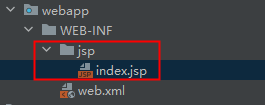
```html
<%@ page contentType="text/html;charset=UTF-8" language="java" %>
&lt;html&gt;
&lt;head&gt;
    &lt;title&gt;index jsp&lt;/title&gt;
&lt;/head&gt;
&lt;body&gt;
&lt;h1&gt;动力节点：手写Spring MVC框架&lt;/h1&gt;
&lt;/body&gt;
&lt;/html&gt;
```

# 服务器启动阶段的处理
## 分析服务器启动阶段都需要初始化什?
1. 初始化Spring容器
   1. 组件扫描包下的类纳入IoC容器的管理?   2. 创建视图解析器对?   3. 创建所有的拦截器对?   4. 扫描这个包下所有的类：org.myspringmvc.web.servlet.mvc.method.annotation，全部实例化，纳入IoC容器管理
2. 初始化HandlerMapping
3. 初始化HandlerAdapter
4. 初始化ViewResolver

## 初始化Spring容器
Spring容器：ApplicationContext
Spring Web容器：WebApplicationContext
### 组件扫描
添加解析xml文件的依?```xml
<!--dom4j-->
<dependency>
    <groupId>dom4j</groupId>
    <artifactId>dom4j</artifactId>
    <version>1.6.1</version>
</dependency>
<!--jaxen-->
<dependency>
    <groupId>jaxen</groupId>
    <artifactId>jaxen</artifactId>
    <version>1.1.6</version>
</dependency>
```
```java
package org.myspringmvc.context;

import org.dom4j.Document;
import org.dom4j.Element;
import org.dom4j.io.SAXReader;

import java.io.File;
import java.lang.reflect.Constructor;
import java.net.URLDecoder;
import java.util.HashMap;
import java.util.Map;

/**
 * ClassName: ApplicationContext
 * Description: Spring容器，启动服务器时，初始? * Datetime: 2024/4/2 13:52
 * Author: 老杜@动力节点
 * Version: 1.0
 */
public class ApplicationContext {
    private Map<String, Object> beanMap = new HashMap<>();

    public ApplicationContext(String xmlPath) throws Exception {
        // 组件扫描
        SAXReader saxReader = new SAXReader();
        Document document = saxReader.read(new File(xmlPath));
        Element componentScanElement = (Element)document.selectSingleNode("/beans/context:component-scan");
        String basePackage = componentScanElement.attributeValue("base-package");
        System.out.println("组件扫描? + basePackage);
        componentScan(basePackage);
        System.out.println("Spring Web容器当下状态：" + beanMap);
    }

    private void componentScan(String basePackage) throws Exception{
        String dirPath = Thread.currentThread().getContextClassLoader().getResource(basePackage.replace(".", "/")).getPath();
        File file = new File(URLDecoder.decode(dirPath));
        if(file.isDirectory()){
            File[] files = file.listFiles();
            for (File classFile : files){
                if(classFile.getName().endsWith(".class")){
                    String className = basePackage + "." + classFile.getName().substring(0, classFile.getName().lastIndexOf("."));
                    Class<?> clazz = Class.forName(className);
                    Constructor<?> defaultCon = clazz.getDeclaredConstructor();
                    Object bean = defaultCon.newInstance();
                    beanMap.put(firstCharLowerCase(clazz.getSimpleName()), bean);
                }
            }
        }
    }

    private String firstCharLowerCase(String simpleName) {
        return simpleName.substring(0, 1).toLowerCase() + simpleName.substring(1);
    }

    public Object getBean(String beanName){
        return beanMap.get(beanName);
    }
}

```

```java
package org.myspringmvc.context;

import jakarta.servlet.ServletContext;

/**
 * ClassName: WebApplicationContext
 * Description:
 * Datetime: 2024/4/2 14:24
 * Author: 老杜@动力节点
 * Version: 1.0
 */
public class WebApplicationContext extends ApplicationContext{

    private ServletContext servletContext;

    public WebApplicationContext(String xmlPath, ServletContext servletContext) throws Exception {
        super(xmlPath);
        this.servletContext = servletContext;
    }

    public ServletContext getServletContext() {
        return servletContext;
    }
}

```
在DispatcherServlet中添加如下代码：
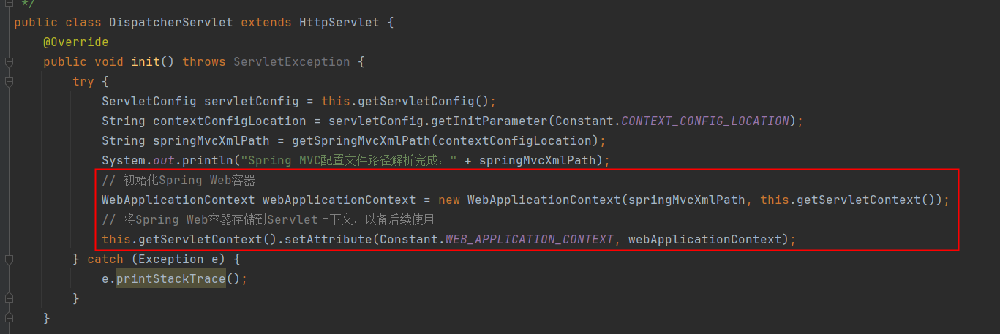
添加常量值：
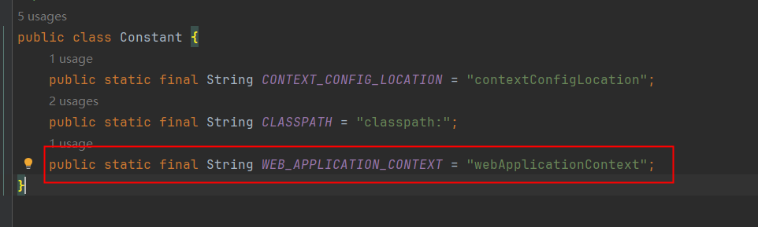

启动服务器测试：
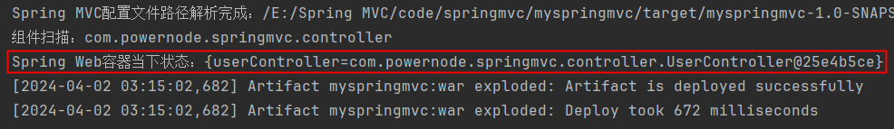

### 创建视图解析器对?InternalResourceViewResolver类代码改动，添加prefix和suffix属性：
```java
package org.myspringmvc.web.servlet.view;

import org.myspringmvc.web.servlet.View;
import org.myspringmvc.web.servlet.ViewResolver;

import java.util.Locale;

/**
 * ClassName: InternalResourceViewResolver
 * Description:
 * Datetime: 2024/4/2 9:45
 * Author: 老杜@动力节点
 * Version: 1.0
 */
public class InternalResourceViewResolver implements ViewResolver {
    private String suffix;
    private String prefix;

    public String getSuffix() {
        return suffix;
    }

    public void setSuffix(String suffix) {
        this.suffix = suffix;
    }

    public String getPrefix() {
        return prefix;
    }

    public void setPrefix(String prefix) {
        this.prefix = prefix;
    }

    @Override
    public View resolveViewName(String viewName, Locale locale) throws Exception {
        return null;
    }
}

```

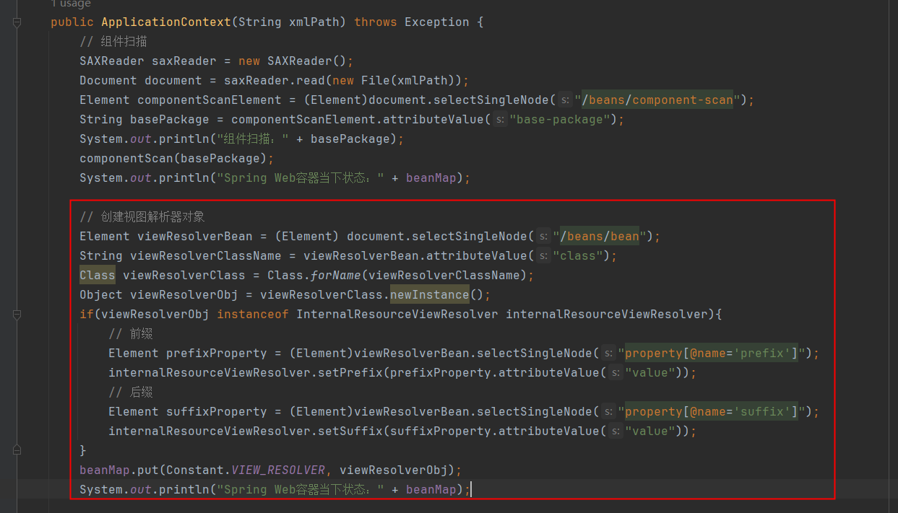

```java
// 创建视图解析器对?Element viewResolverBean = (Element) document.selectSingleNode("/beans/bean");
String viewResolverClassName = viewResolverBean.attributeValue("class");
Class viewResolverClass = Class.forName(viewResolverClassName);
Object viewResolverObj = viewResolverClass.newInstance();
if(viewResolverObj instanceof InternalResourceViewResolver internalResourceViewResolver){
    // 前缀
    Element prefixProperty = (Element)viewResolverBean.selectSingleNode("property[@name='prefix']");
    internalResourceViewResolver.setPrefix(prefixProperty.attributeValue("value"));
    // 后缀
    Element suffixProperty = (Element)viewResolverBean.selectSingleNode("property[@name='suffix']");
    internalResourceViewResolver.setSuffix(suffixProperty.attributeValue("value"));
}
beanMap.put(Constant.VIEW_RESOLVER, viewResolverObj);
System.out.println("Spring Web容器当下状态：" + beanMap);
```

### 创建所有的拦截器对?在ApplicationContext构造方法中继续添加如下代码?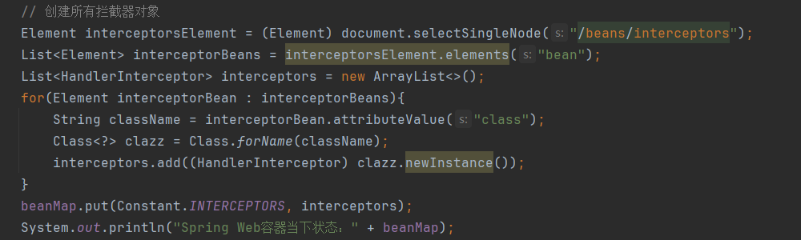
```java
// 创建所有拦截器对象
Element interceptorsElement = (Element) document.selectSingleNode("/beans/interceptors");
List<Element> interceptorBeans = interceptorsElement.elements("bean");
List<HandlerInterceptor> interceptors = new ArrayList<>();
for(Element interceptorBean : interceptorBeans){
    String className = interceptorBean.attributeValue("class");
    Class<?> clazz = Class.forName(className);
    interceptors.add((HandlerInterceptor) clazz.newInstance());
}
beanMap.put(Constant.INTERCEPTORS, interceptors);
System.out.println("Spring Web容器当下状态：" + beanMap);
```

### 初始化annotation包下所有类的实?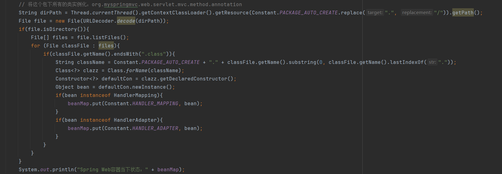
```java
// 将这个包下所有的类实例化：org.myspringmvc.web.servlet.mvc.method.annotation
String dirPath = Thread.currentThread().getContextClassLoader().getResource(Constant.PACKAGE_AUTO_CREATE.replace(".", "/")).getPath();
File file = new File(URLDecoder.decode(dirPath));
if(file.isDirectory()){
    File[] files = file.listFiles();
    for (File classFile : files){
        if(classFile.getName().endsWith(".class")){
            String className = Constant.PACKAGE_AUTO_CREATE + "." + classFile.getName().substring(0, classFile.getName().lastIndexOf("."));
            Class<?> clazz = Class.forName(className);
            Constructor<?> defaultCon = clazz.getDeclaredConstructor();
            Object bean = defaultCon.newInstance();
            if(bean instanceof HandlerMapping){
                beanMap.put(Constant.HANDLER_MAPPING, bean);
            }
            if(bean instanceof HandlerAdapter){
                beanMap.put(Constant.HANDLER_ADAPTER, bean);
            }
        }
    }
}
System.out.println("Spring Web容器当下状态：" + beanMap);
```

## 初始化HandlerMapping
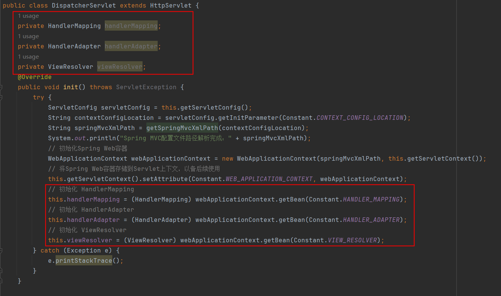

## 初始化HandlerAdapter


## 初始化ViewResolver


# 根据请求流程补充代码
## 根据请求获取处理器执行链
```java
private void doDispatch(HttpServletRequest request, HttpServletResponse response) throws ServletException, IOException {
    try {
        // 根据请求获取处理器执行链
        HandlerExecutionChain mappedHandler = handlerMapping.getHandler(request);
        System.out.println(mappedHandler);
    } catch (Exception e) {
        e.printStackTrace();
    }
}
```
```java
package org.myspringmvc.web.servlet.mvc.method.annotation;

import jakarta.servlet.http.HttpServletRequest;
import org.myspringmvc.context.WebApplicationContext;
import org.myspringmvc.web.constant.Constant;
import org.myspringmvc.web.method.HandlerMethod;
import org.myspringmvc.web.servlet.HandlerExecutionChain;
import org.myspringmvc.web.servlet.HandlerInterceptor;
import org.myspringmvc.web.servlet.HandlerMapping;
import org.myspringmvc.web.servlet.mvc.RequestMappingInfo;

import java.util.HashMap;
import java.util.List;
import java.util.Map;

/**
 * ClassName: RequestMappingHandlerMapping
 * Description:
 * Datetime: 2024/4/2 9:44
 * Author: 老杜@动力节点
 * Version: 1.0
 */
public class RequestMappingHandlerMapping implements HandlerMapping {

    private Map<RequestMappingInfo, HandlerMethod> map;

    public RequestMappingHandlerMapping(Map<RequestMappingInfo, HandlerMethod> map) {
        this.map = map;
    }

    @Override
    public HandlerExecutionChain getHandler(HttpServletRequest request) throws Exception {
        RequestMappingInfo requestMappingInfo = new RequestMappingInfo(request.getServletPath(), request.getMethod());
        HandlerExecutionChain handlerExecutionChain = new HandlerExecutionChain();
        handlerExecutionChain.setHandler(map.get(requestMappingInfo));
        WebApplicationContext wac = (WebApplicationContext) request.getServletContext().getAttribute(Constant.WEB_APPLICATION_CONTEXT);
        handlerExecutionChain.setInterceptorList((List<HandlerInterceptor>)wac.getBean(Constant.INTERCEPTORS));
        return handlerExecutionChain;
    }
}

```

```java
private Map<RequestMappingInfo, HandlerMethod> componentScan(String basePackage) throws Exception{
    // 初始化HandlerMethod
    Map<RequestMappingInfo, HandlerMethod> handlerMethodMap = new HashMap<>();

    String dirPath = Thread.currentThread().getContextClassLoader().getResource(basePackage.replace(".", "/")).getPath();
    File file = new File(URLDecoder.decode(dirPath));
    if(file.isDirectory()){
        File[] files = file.listFiles();
        for (File classFile : files){
            if(classFile.getName().endsWith(".class")){
                String className = basePackage + "." + classFile.getName().substring(0, classFile.getName().lastIndexOf("."));
                Class<?> clazz = Class.forName(className);
                Constructor<?> defaultCon = clazz.getDeclaredConstructor();
                Object bean = defaultCon.newInstance();
                beanMap.put(firstCharLowerCase(clazz.getSimpleName()), bean);
                // 如果clazz被@Controller注解标注
                if(clazz.isAnnotationPresent(Controller.class)){
                    // 获取该类中所有的方法
                    Method[] methods = clazz.getDeclaredMethods();
                    for(Method method : methods){
                        if(method.isAnnotationPresent(RequestMapping.class)){
                            RequestMapping requestMapping = method.getAnnotation(RequestMapping.class);
                            // 创建RequestMappingInfo对象
                            RequestMappingInfo requestMappingInfo = new RequestMappingInfo();
                            requestMappingInfo.setRequestURI(requestMapping.value()[0]);
                            requestMappingInfo.setRequestMethod(requestMapping.method().toString());
                            // 创建HandlerMethod对象
                            HandlerMethod handlerMethod = new HandlerMethod();
                            handlerMethod.setMethod(method);
                            handlerMethod.setHandler(bean);

                            handlerMethodMap.put(requestMappingInfo, handlerMethod);
                        }
                    }
                }
            }
        }
    }
    return handlerMethodMap;
}
```

ApplicationContext代码还有以下改造：
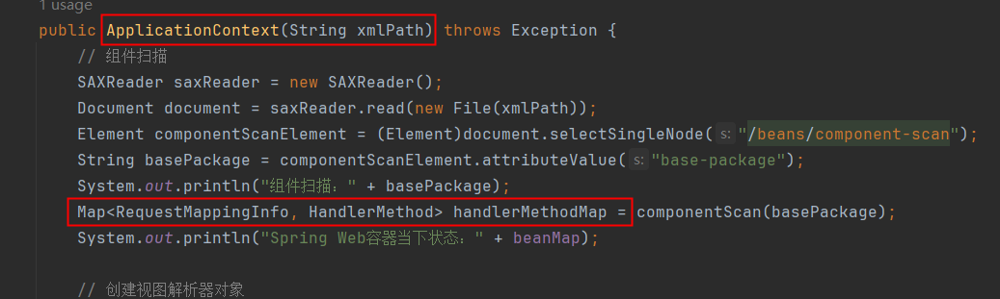
添加一个新的类：RequestMappingInfo
```java
package org.myspringmvc.web.servlet.mvc;

import java.util.Objects;

/**
 * ClassName: RequestMappingInfo
 * Description:
 * Datetime: 2024/4/2 17:58
 * Author: 老杜@动力节点
 * Version: 1.0
 */
public class RequestMappingInfo {
    private String requestURI;
    private String requestMethod;

    public RequestMappingInfo() {
    }

    public RequestMappingInfo(String requestURI, String requestMethod) {
        this.requestURI = requestURI;
        this.requestMethod = requestMethod;
    }

    public String getRequestURI() {
        return requestURI;
    }

    public void setRequestURI(String requestURI) {
        this.requestURI = requestURI;
    }

    public String getRequestMethod() {
        return requestMethod;
    }

    public void setRequestMethod(String requestMethod) {
        this.requestMethod = requestMethod;
    }


    @Override
    public boolean equals(Object o) {
        if (this == o) return true;
        if (o == null || getClass() != o.getClass()) return false;
        RequestMappingInfo that = (RequestMappingInfo) o;
        return Objects.equals(requestURI, that.requestURI) && Objects.equals(requestMethod, that.requestMethod);
    }

    @Override
    public int hashCode() {
        return Objects.hash(requestURI, requestMethod);
    }

    @Override
    public String toString() {
        return "RequestMappingInfo{" +
                "requestURI='" + requestURI + '\'' +
                ", requestMethod='" + requestMethod + '\'' +
                '}';
    }
}

```

## 执行拦截器的preHandle
添加以下代码?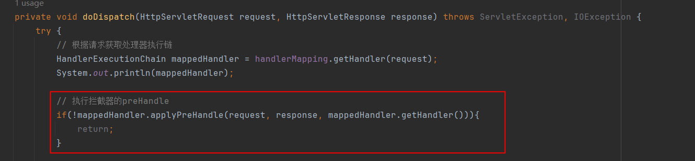

HandlerExecutionChain添加以下代码?```java
public boolean applyPreHandle(HttpServletRequest request, HttpServletResponse response, Object handler) throws Exception {
    for (int i = 0; i < interceptorList.size(); i++) {
        HandlerInterceptor handlerInterceptor = interceptorList.get(i);
        boolean result = handlerInterceptor.preHandle(request, response, handler);
        if(!result){
            return false;
        }
        interceptorIndex = i;
    }
    return true;
}
```

## 执行处理器方?DispatcherServlet中的doDispatch方法?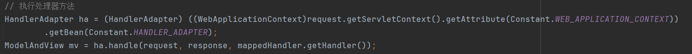
先让handle方法返回一个固定的ModelAndView，后期在详细编写 handle 方法?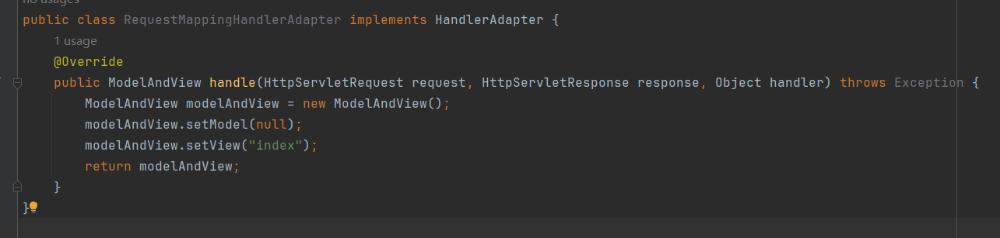

## 执行拦截器的postHandle
DispatcherServlet的doDispatch方法中：
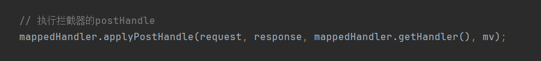

HandlerExecutionChain的方法：
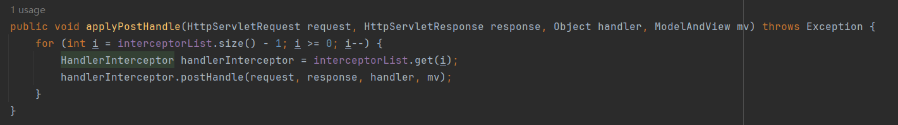

## 处理响应
在DispatcherServlet?doDispatch方法中：
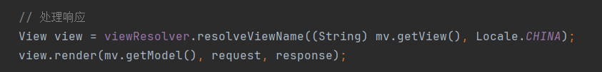

```java
package org.myspringmvc.web.servlet.view;

import org.myspringmvc.web.servlet.View;
import org.myspringmvc.web.servlet.ViewResolver;

import java.util.Locale;

/**
 * ClassName: InternalResourceViewResolver
 * Description:
 * Datetime: 2024/4/2 9:45
 * Author: 老杜@动力节点
 * Version: 1.0
 */
public class InternalResourceViewResolver implements ViewResolver {
    private String suffix;
    private String prefix;

    public String getSuffix() {
        return suffix;
    }

    public void setSuffix(String suffix) {
        this.suffix = suffix;
    }

    public String getPrefix() {
        return prefix;
    }

    public void setPrefix(String prefix) {
        this.prefix = prefix;
    }

    @Override
    public View resolveViewName(String viewName, Locale locale) throws Exception {
        return new InternalResourceView("text/html;charset=UTF-8", prefix + viewName + suffix);
    }
}

```
```java
package org.myspringmvc.web.servlet.view;

import jakarta.servlet.http.HttpServletRequest;
import jakarta.servlet.http.HttpServletResponse;
import org.myspringmvc.web.servlet.View;

import java.util.Map;

/**
 * ClassName: InternalResourceView
 * Description:
 * Datetime: 2024/4/2 10:17
 * Author: 老杜@动力节点
 * Version: 1.0
 */
public class InternalResourceView implements View {

    private String contentType;
    private String path;

    public InternalResourceView(String contentType, String path) {
        this.contentType = contentType;
        this.path = path;
    }

    public String getPath() {
        return path;
    }

    public void setPath(String path) {
        this.path = path;
    }

    public void setContentType(String contentType) {
        this.contentType = contentType;
    }

    @Override
    public String getContentType() {
        return contentType;
    }

    @Override
    public void render(Map&lt;String, ?&gt; model, HttpServletRequest request, HttpServletResponse response) throws Exception {
        // 设置响应内容类型
        response.setContentType(getContentType());
        // 向request域中绑定数据
        if(model != null){
            model.forEach(request::setAttribute);    
        }
        // 转发
        request.getRequestDispatcher(path).forward(request, response);
    }
}

```

## 执行拦截器的afterCompletion
在DispatcherServlet类的doDispatch方法中：
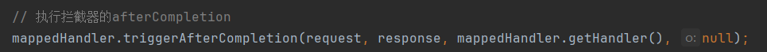

在HandlerExecutionChain中：
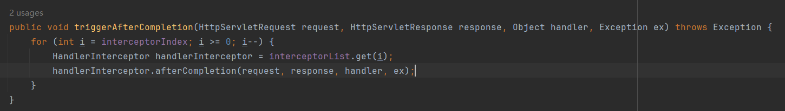

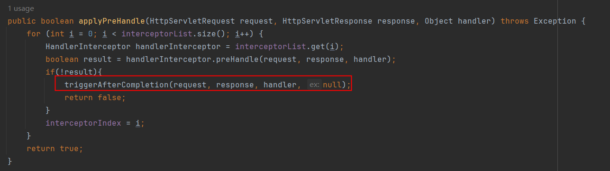

## 初步测试
启动服务器，浏览器地址栏：http://localhost:8080/myspringmvc
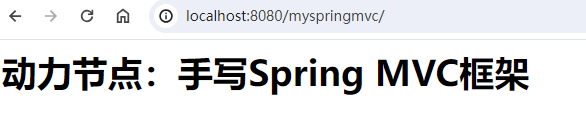
后台效果?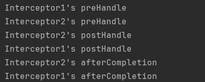

如果让第二个拦截器返回false尝试一下：
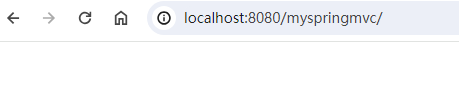
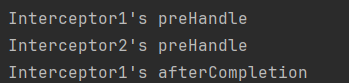
初步测试通过！！?
# 调用处理器方?
# web.xml文件的替?## Servlet3.0新特?Servlet3.0新特性：web.xml文件可以不写了?在Servlet3.0的时候，规范中提供了一个接口：

服务器在启动的时候会自动从容器中?`ServletContainerInitializer`接口的实现类，自动调用它的`onStartup`方法来完成Servlet上下文的初始化?

在Spring3.1版本的时候，提供了这样一个类，实现以上的接口?
它的核心方法如下?
可以看到在服务器启动的时候，它会去加载所有实现`WebApplicationInitializer`接口的类?
这个接口下有一个子类是我们需要的：`AbstractAnnotationConfigDispatcherServletInitializer`


当我们编写类继承`AbstractAnnotationConfigDispatcherServletInitializer`之后，web服务器在启动的时候会根据它来初始化Servlet上下文?
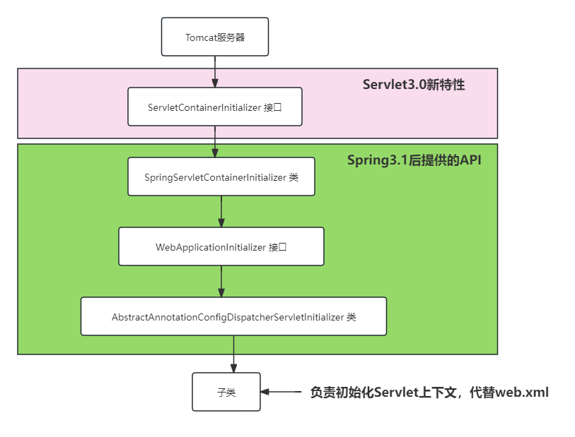

## 编写WebAppInitializer
以下这个类就是用来代替web.xml文件的：
```java
package com.powernode.springmvc.config;

import jakarta.servlet.Filter;
import org.springframework.web.filter.CharacterEncodingFilter;
import org.springframework.web.filter.HiddenHttpMethodFilter;
import org.springframework.web.servlet.support.AbstractAnnotationConfigDispatcherServletInitializer;

/**
 * ClassName: WebAppInitializer
 * Description:
 * Datetime: 2024/3/29 16:50
 * Author: 老杜@动力节点
 * Version: 1.0
 */
public class WebAppInitializer extends AbstractAnnotationConfigDispatcherServletInitializer {
    /**
     * Spring的配?     * @return
     */
    @Override
    protected Class<?>[] getRootConfigClasses() {
        return new Class[]{SpringConfig.class};
    }

    /**
     * SpringMVC的配?     * @return
     */
    @Override
    protected Class<?>[] getServletConfigClasses() {
        return new Class[]{SpringMVCConfig.class};
    }

    /**
     * 用于配置 DispatcherServlet 的映射路?     * @return
     */
    @Override
    protected String[] getServletMappings() {
        return new String[]{"/"};
    }

    /**
     * 配置过滤?     * @return
     */
    @Override
    protected Filter[] getServletFilters() {
        CharacterEncodingFilter characterEncodingFilter = new CharacterEncodingFilter();
        characterEncodingFilter.setEncoding("UTF-8");
        characterEncodingFilter.setForceRequestEncoding(true);
        characterEncodingFilter.setForceResponseEncoding(true);
        HiddenHttpMethodFilter hiddenHttpMethodFilter = new HiddenHttpMethodFilter();
        return new Filter[]{characterEncodingFilter, hiddenHttpMethodFilter};
    }
}

```


Spring配置如下?```java
package com.powernode.springmvc.config;

import org.springframework.context.annotation.Configuration;

/**
 * ClassName: SpringConfig
 * Description:
 * Datetime: 2024/3/29 17:03
 * Author: 老杜@动力节点
 * Version: 1.0
 */
@Configuration // 使用该注解指定这是一个配置类
public class SpringConfig {
}

```


SpringMVC配置如下?```java
package com.powernode.springmvc.config;

import org.springframework.context.annotation.Configuration;

/**
 * ClassName: SpringMVCConfig
 * Description:
 * Datetime: 2024/3/29 17:03
 * Author: 老杜@动力节点
 * Version: 1.0
 */
@Configuration
public class SpringMVCConfig {
}

```

# Spring MVC的配?## 组件扫描
```java
// 指定该类是一个配置类，可以当配置文件使用
@Configuration
// 开启组件扫?@ComponentScan("com.powernode.springmvc.controller")
public class SpringMVCConfig {
}
```

## 开启注解驱?```java
// 指定该类是一个配置类，可以当配置文件使用
@Configuration
// 开启组件扫?@ComponentScan("com.powernode.springmvc.controller")
// 开启注解驱?@EnableWebMvc
public class SpringMVCConfig {
}
```

## 视图解析?```java
// 指定该类是一个配置类，可以当配置文件使用
@Configuration
// 开启组件扫?@ComponentScan("com.powernode.springmvc.controller")
// 开启注解驱?@EnableWebMvc
public class SpringMVCConfig {

    @Bean
    public ThymeleafViewResolver getViewResolver(SpringTemplateEngine springTemplateEngine) {
        ThymeleafViewResolver resolver = new ThymeleafViewResolver();
        resolver.setTemplateEngine(springTemplateEngine);
        resolver.setCharacterEncoding("UTF-8");
        resolver.setOrder(1);
        return resolver;
    }

    @Bean
    public SpringTemplateEngine templateEngine(ITemplateResolver iTemplateResolver) {
        SpringTemplateEngine templateEngine = new SpringTemplateEngine();
        templateEngine.setTemplateResolver(iTemplateResolver);
        return templateEngine;
    }

    @Bean
    public ITemplateResolver templateResolver(ApplicationContext applicationContext) {
        SpringResourceTemplateResolver resolver = new SpringResourceTemplateResolver();
        resolver.setApplicationContext(applicationContext);
        resolver.setPrefix("/WEB-INF/thymeleaf/");
        resolver.setSuffix(".html");
        resolver.setTemplateMode(TemplateMode.HTML);
        resolver.setCharacterEncoding("UTF-8");
        resolver.setCacheable(false);//开发时关闭缓存，改动即可生?        return resolver;
    }
}
```

## 开启默认Servlet处理
让SpringMVCConfig类实现这个接口：`WebMvcConfigurer`
并且重写以下的方法：
```java
@Override
public void configureDefaultServletHandling(DefaultServletHandlerConfigurer configurer) {
    configurer.enable();
}
```

## view-controller
重写以下方法?```java
@Override
public void addViewControllers(ViewControllerRegistry registry) {
    registry.addViewController("/test").setViewName("test");
}
```

## 异常处理?重写以下方法?```java
@Override
public void configureHandlerExceptionResolvers(List&lt;HandlerExceptionResolver&gt; resolvers) {
    SimpleMappingExceptionResolver resolver = new SimpleMappingExceptionResolver();
    Properties prop = new Properties();
    prop.setProperty("java.lang.Exception", "tip");
    resolver.setExceptionMappings(prop);
    resolver.setExceptionAttribute("yiChang");
    resolvers.add(resolver);
}
```

## 拦截?重写以下方法?```java
@Override
public void addInterceptors(InterceptorRegistry registry) {
    MyInterceptor myInterceptor = new MyInterceptor();
    registry.addInterceptor(myInterceptor).addPathPatterns("/**").excludePathPatterns("/test");
}
```


# 引入相关依赖
```xml
<?xml version="1.0" encoding="UTF-8"?>
<project xmlns="http://maven.apache.org/POM/4.0.0"
         xmlns:xsi="http://www.w3.org/2001/XMLSchema-instance"
         xsi:schemaLocation="http://maven.apache.org/POM/4.0.0 http://maven.apache.org/xsd/maven-4.0.0.xsd">
    <modelVersion>4.0.0</modelVersion>

    <groupId>com.powernode</groupId>
    <artifactId>ssmtest</artifactId>
    <version>1.0-SNAPSHOT</version>
    <packaging>war</packaging>

    <dependencies>
        <!--springmvc-->
        <dependency>
            <groupId>org.springframework</groupId>
            <artifactId>spring-webmvc</artifactId>
            <version>6.1.4</version>
        </dependency>
        <!--spring jdbc-->
        <dependency>
            <groupId>org.springframework</groupId>
            <artifactId>spring-jdbc</artifactId>
            <version>6.1.4</version>
        </dependency>
        <!--mybatis-->
        <dependency>
            <groupId>org.mybatis</groupId>
            <artifactId>mybatis</artifactId>
            <version>3.5.15</version>
        </dependency>
        <!--mybatis spring-->
        <dependency>
            <groupId>org.mybatis</groupId>
            <artifactId>mybatis-spring</artifactId>
            <version>3.0.3</version>
        </dependency>
        <!--mysql驱动-->
        <dependency>
            <groupId>com.mysql</groupId>
            <artifactId>mysql-connector-j</artifactId>
            <version>8.3.0</version>
        </dependency>
        <!--德鲁伊连接池-->
        <dependency>
            <groupId>com.alibaba</groupId>
            <artifactId>druid</artifactId>
            <version>1.2.22</version>
        </dependency>
        <!--jackson-->
        <dependency>
            <groupId>com.fasterxml.jackson.core</groupId>
            <artifactId>jackson-databind</artifactId>
            <version>2.17.0</version>
        </dependency>
        <!--servlet api-->
        <dependency>
            <groupId>jakarta.servlet</groupId>
            <artifactId>jakarta.servlet-api</artifactId>
            <version>6.0.0</version>
            <scope>provided</scope>
        </dependency>
        <!--logback-->
        <dependency>
            <groupId>ch.qos.logback</groupId>
            <artifactId>logback-classic</artifactId>
            <version>1.5.3</version>
        </dependency>
        <!--thymeleaf和spring6的整合依?->
        <dependency>
            <groupId>org.thymeleaf</groupId>
            <artifactId>thymeleaf-spring6</artifactId>
            <version>3.1.2.RELEASE</version>
        </dependency>
    </dependencies>

    <properties>
        <maven.compiler.source>21</maven.compiler.source>
        <maven.compiler.target>21</maven.compiler.target>
        <project.build.sourceEncoding>UTF-8</project.build.sourceEncoding>
    </properties>

</project>
```

# SSM整合
## 创建包结?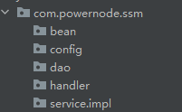
## 创建webapp目录
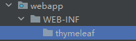

## Spring整合MyBatis
### 编写jdbc.properties
在类根路径下创建属性配置文件，配置连接数据库的信息：jdbc.properties
```properties
jdbc.driver=com.mysql.cj.jdbc.Driver
jdbc.url=jdbc:mysql://localhost:3306/powernode?useUnicode=true&serverTimezone=Asia/Shanghai&useSSL=true&characterEncoding=utf-8
jdbc.username=root
jdbc.password=1234
```


### 编写DataSourceConfig
```java
package com.powernode.ssm.config;

import com.alibaba.druid.pool.DruidDataSource;
import org.springframework.beans.factory.annotation.Value;
import org.springframework.context.annotation.Bean;

import javax.sql.DataSource;

/**
 * ClassName: DataSourceConfig
 * Description:
 * Datetime: 2024/4/1 14:25
 * Author: 老杜@动力节点
 * Version: 1.0
 */
public class DataSourceConfig {

    @Value("${jdbc.driver}")
    private String driver;

    @Value("${jdbc.url}")
    private String url;

    @Value("${jdbc.username}")
    private String username;

    @Value("${jdbc.password}")
    private String password;

    @Bean
    public DataSource dataSource(){
        DruidDataSource dataSource = new DruidDataSource();
        dataSource.setDriverClassName(driver);
        dataSource.setUrl(url);
        dataSource.setUsername(username);
        dataSource.setPassword(password);
        return dataSource;
    }
}

```

### 编写MyBatisConfig
```java
package com.powernode.ssm.config;

import org.mybatis.spring.SqlSessionFactoryBean;
import org.mybatis.spring.mapper.MapperScannerConfigurer;
import org.springframework.context.annotation.Bean;

import javax.sql.DataSource;

/**
 * ClassName: MyBatisConfig
 * Description:
 * Datetime: 2024/4/1 14:25
 * Author: 老杜@动力节点
 * Version: 1.0
 */
public class MyBatisConfig {

    @Bean
    public SqlSessionFactoryBean sqlSessionFactory(DataSource dataSource){
        SqlSessionFactoryBean sqlSessionFactoryBean = new SqlSessionFactoryBean();
        sqlSessionFactoryBean.setDataSource(dataSource);
        sqlSessionFactoryBean.setTypeAliasesPackage("com.powernode.ssm.bean");
        return sqlSessionFactoryBean;
    }

    @Bean
    public MapperScannerConfigurer mapperScannerConfigurer(){
        MapperScannerConfigurer msc = new MapperScannerConfigurer();
        msc.setBasePackage("com.powernode.ssm.dao");
        return msc;
    }

}
```

### 编写SpringConfig
```java
package com.powernode.ssm.config;

import org.springframework.context.annotation.ComponentScan;
import org.springframework.context.annotation.Configuration;
import org.springframework.context.annotation.Import;
import org.springframework.context.annotation.PropertySource;

/**
 * ClassName: SpringConfig
 * Description:
 * Datetime: 2024/4/1 14:22
 * Author: 老杜@动力节点
 * Version: 1.0
 */
@Configuration
@ComponentScan({"com.powernode.ssm.service"})
@PropertySource("classpath:jdbc.properties")
@Import({DataSourceConfig.class, MyBatisConfig.class})
public class SpringConfig {
}
```

## Spring整合Spring MVC
### 编写WebAppInitializer（web.xml?```java
package com.powernode.ssm.config;

import jakarta.servlet.Filter;
import org.springframework.context.annotation.Configuration;
import org.springframework.web.filter.CharacterEncodingFilter;
import org.springframework.web.filter.HiddenHttpMethodFilter;
import org.springframework.web.servlet.support.AbstractAnnotationConfigDispatcherServletInitializer;

/**
 * ClassName: WebAppInitializer
 * Description:
 * Datetime: 2024/4/1 14:59
 * Author: 老杜@动力节点
 * Version: 1.0
 */
public class WebAppInitializer extends AbstractAnnotationConfigDispatcherServletInitializer {
    /**
     * Spring的配?     * @return
     */
    @Override
    protected Class<?>[] getRootConfigClasses() {
        return new Class[]{SpringConfig.class};
    }

    /**
     * SpringMVC的配?     * @return
     */
    @Override
    protected Class<?>[] getServletConfigClasses() {
        return new Class[]{SpringMvcConfig.class};
    }

    /**
     * 用来配置DispatcherServlet?&lt;url-pattern&gt;
     * @return
     */
    @Override
    protected String[] getServletMappings() {
        return new String[]{"/"};
    }

    /**
     * 配置过滤?     * @return
     */
    @Override
    protected Filter[] getServletFilters() {
        // 配置字符编码过滤?        CharacterEncodingFilter characterEncodingFilter = new CharacterEncodingFilter();
        characterEncodingFilter.setEncoding("UTF-8");
        characterEncodingFilter.setForceResponseEncoding(true);
        characterEncodingFilter.setForceRequestEncoding(true);
        // 配置HiddenHttpMethodFilter
        HiddenHttpMethodFilter hiddenHttpMethodFilter = new HiddenHttpMethodFilter();
        return new Filter[]{characterEncodingFilter, hiddenHttpMethodFilter};
    }
}


```

### 编写SpringMvcConfig
```java
package com.powernode.ssm.config;

import org.springframework.context.ApplicationContext;
import org.springframework.context.annotation.Bean;
import org.springframework.context.annotation.ComponentScan;
import org.springframework.context.annotation.Configuration;
import org.springframework.web.servlet.HandlerExceptionResolver;
import org.springframework.web.servlet.config.annotation.*;
import org.thymeleaf.spring6.SpringTemplateEngine;
import org.thymeleaf.spring6.templateresolver.SpringResourceTemplateResolver;
import org.thymeleaf.spring6.view.ThymeleafViewResolver;
import org.thymeleaf.templatemode.TemplateMode;
import org.thymeleaf.templateresolver.ITemplateResolver;

import java.util.List;

/**
 * ClassName: SpringMvcConfig
 * Description:
 * Datetime: 2024/4/1 15:02
 * Author: 老杜@动力节点
 * Version: 1.0
 */
@Configuration
@ComponentScan("com.powernode.ssm.handler")
@EnableWebMvc
public class SpringMvcConfig implements WebMvcConfigurer {

    // 以下三个方法合并起来就是开启视图解析器
    @Bean
    public ThymeleafViewResolver getViewResolver(SpringTemplateEngine springTemplateEngine) {
        ThymeleafViewResolver resolver = new ThymeleafViewResolver();
        resolver.setTemplateEngine(springTemplateEngine);
        resolver.setCharacterEncoding("UTF-8");
        resolver.setOrder(1);
        return resolver;
    }

    @Bean
    public SpringTemplateEngine templateEngine(ITemplateResolver iTemplateResolver) {
        SpringTemplateEngine templateEngine = new SpringTemplateEngine();
        templateEngine.setTemplateResolver(iTemplateResolver);
        return templateEngine;
    }

    @Bean
    public ITemplateResolver templateResolver(ApplicationContext applicationContext) {
        SpringResourceTemplateResolver resolver = new SpringResourceTemplateResolver();
        resolver.setApplicationContext(applicationContext);
        resolver.setPrefix("/WEB-INF/thymeleaf/");
        resolver.setSuffix(".html");
        resolver.setTemplateMode(TemplateMode.HTML);
        resolver.setCharacterEncoding("UTF-8");
        resolver.setCacheable(false);//开发时关闭缓存，改动即可生?        return resolver;
    }

    // 开启静态资源处理，开启默认的Servlet处理
    @Override
    public void configureDefaultServletHandling(DefaultServletHandlerConfigurer configurer) {
        configurer.enable();
    }

    // 视图控制?    @Override
    public void addViewControllers(ViewControllerRegistry registry) {}
    // 配置异常处理?    @Override
    public void configureHandlerExceptionResolvers(List&lt;HandlerExceptionResolver&gt; resolvers) {}

    // 配置拦截?    @Override
    public void addInterceptors(InterceptorRegistry registry) {}
}

```

## 添加事务控制
第一步：在SpringConfig中开启事务管理器
```java
@EnableTransactionManagement
public class SpringConfig {
}
```
第二步：在DataSourceConfig中添加事务管理器对象
```java
@Bean
public PlatformTransactionManager platformTransactionManager(DataSource dataSource){
    DataSourceTransactionManager dataSourceTransactionManager = new DataSourceTransactionManager();
    dataSourceTransactionManager.setDataSource(dataSource);
    return dataSourceTransactionManager;
}
```
第三步：在service类上添加如下注解?```java
@Transactional
public class UserService {}
```

# 实现功能测试ssm整合
## 数据库表
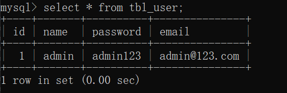

## pojo类编?```java
package com.powernode.ssm.bean;

/**
 * ClassName: User
 * Description:
 * Datetime: 2024/4/1 15:42
 * Author: 老杜@动力节点
 * Version: 1.0
 */
public class User {
    private Long id;
    private String name;
    private String password;
    private String email;

    @Override
    public String toString() {
        return "User{" +
                "id=" + id +
                ", name='" + name + '\'' +
                ", password='" + password + '\'' +
                ", email='" + email + '\'' +
                '}';
    }

    public User() {
    }

    public User(Long id, String name, String password, String email) {
        this.id = id;
        this.name = name;
        this.password = password;
        this.email = email;
    }

    public Long getId() {
        return id;
    }

    public void setId(Long id) {
        this.id = id;
    }

    public String getName() {
        return name;
    }

    public void setName(String name) {
        this.name = name;
    }

    public String getPassword() {
        return password;
    }

    public void setPassword(String password) {
        this.password = password;
    }

    public String getEmail() {
        return email;
    }

    public void setEmail(String email) {
        this.email = email;
    }
}

```

## dao编写
```java
package com.powernode.ssm.dao;

import com.powernode.ssm.bean.User;
import org.apache.ibatis.annotations.Select;

/**
 * ClassName: UserDao
 * Description:
 * Datetime: 2024/4/1 15:43
 * Author: 老杜@动力节点
 * Version: 1.0
 */
public interface UserDao {

    @Select("select * from tbl_user where id = #{id}")
    User selectById(Long id);

}

```

## service编写
```java
package com.powernode.ssm.service;

import com.powernode.ssm.bean.User;

/**
 * ClassName: UserService
 * Description:
 * Datetime: 2024/4/1 15:45
 * Author: 老杜@动力节点
 * Version: 1.0
 */
public interface UserService {

    /**
     * 根据id获取用户信息
     * @param id
     * @return
     */
    User getById(Long id);

}

```
```java
package com.powernode.ssm.service.impl;

import com.powernode.ssm.bean.User;
import com.powernode.ssm.dao.UserDao;
import com.powernode.ssm.service.UserService;
import org.springframework.beans.factory.annotation.Autowired;
import org.springframework.stereotype.Service;

/**
 * ClassName: UserServiceImpl
 * Description:
 * Datetime: 2024/4/1 15:45
 * Author: 老杜@动力节点
 * Version: 1.0
 */
@Service
public class UserServiceImpl implements UserService {

    @Autowired
    private UserDao userDao;

    @Override
    public User getById(Long id) {
        return userDao.selectById(id);
    }
}
```

## handler编写
```java
package com.powernode.ssm.handler;

import com.powernode.ssm.bean.User;
import com.powernode.ssm.service.UserService;
import org.springframework.beans.factory.annotation.Autowired;
import org.springframework.web.bind.annotation.GetMapping;
import org.springframework.web.bind.annotation.PathVariable;
import org.springframework.web.bind.annotation.RequestMapping;
import org.springframework.web.bind.annotation.RestController;

/**
 * ClassName: UserHandler
 * Description:
 * Datetime: 2024/4/1 15:46
 * Author: 老杜@动力节点
 * Version: 1.0
 */
@RestController
@RequestMapping("/users")
public class UserHandler {

    @Autowired
    private UserService userService;

    @GetMapping("/{id}")
    public User detail(@PathVariable("id") Long id){
        return userService.getById(id);
    }
}

```

## 前端发送ajax
### 引入js文件
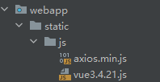
### 开启静态资源处?```java
@Override
public void configureDefaultServletHandling(DefaultServletHandlerConfigurer configurer) {
    configurer.enable();
}
```

### 视图控制?```java
public void addViewControllers(ViewControllerRegistry registry) {
    registry.addViewController("/").setViewName("index");
}
```
### 编写ajax
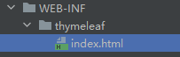
```html
<!DOCTYPE html>
&lt;html lang="en" xmlns:th="http://www.thymeleaf.org"&gt;
&lt;head&gt;
    &lt;meta charset="UTF-8"&gt;
    &lt;title&gt;ssm整合&lt;/title&gt;
    <!--引入vue-->
    &lt;script th:src="@{/static/js/vue3.4.21.js}"&gt;&lt;/script&gt;
    <!--引入axios-->
    &lt;script th:src="@{/static/js/axios.min.js}"&gt;&lt;/script&gt;
&lt;/head&gt;
&lt;body&gt;
&lt;div id="app"&gt;
    &lt;button @click="getMessage"&gt;查看id=1的用户信?/button>
    &lt;h1&gt;{{message}}&lt;/h1&gt;
&lt;/div&gt;
&lt;script th:inline="javascript"&gt;
    Vue.createApp({
        data(){
            return {
                message : ''
            }
        },
        methods : {
            async getMessage(){
                let response = await axios.get([[@{/}]] + 'users/1')
                this.message = response.data
            }
        }
    }).mount("#app")
&lt;/script&gt;
&lt;/body&gt;
&lt;/html&gt;
```
测试结果?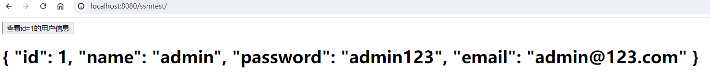


