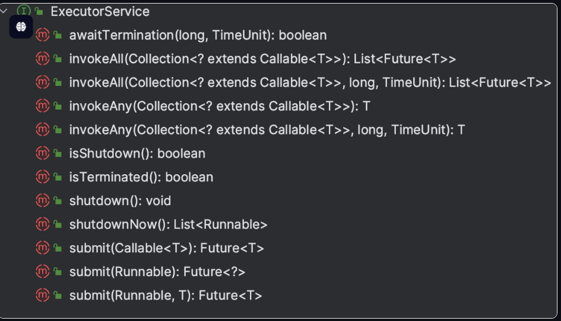

# 获取线程执行结果

创建线程的3种方式中，继承Thread和实现Runnable在执行完任务之后无法获取执行结果，如果需要获取执行结果，就必须通过共享变量或者线程通信的方式来达到目的，这样使用起来就比较麻烦

Java 1.5 提供了 Callable、Future、FutureTask，它们可以在任务执行完后得到执行结果，今天我们就来详细的了解一下

## 有返回值的Callable

Callable 位于 java.util.concurrent 包下，也是一个接口，一般会配合ExecutorService来使用，它定义了一个call()方法：

```java
public interface Callable<V> {
    V call() throws Exception;
}
```

## ExecutorService

ExecutorService是一个接口，位于java.util.concurrent包下，它是Java线程池框架的核心接口，用来异步执行任务，它提供了一些关键方法用来进行线程管理



通过ExecutorService提交Callable任务：

```java
// 创建一个包含5个线程的线程池
ExecutorService executorService = Executors.newFixedThreadPool(5);

// 创建一个Callable任务
Callable<String> task = new Callable<String>() {
    public String call() {
        return "Hello from " + Thread.currentThread().getName();
    }
};

// 提交任务到ExecutorService执行，并获取Future对象
Future[] futures = new Future[10];
for (int i = 0; i < 10; i++) {
    futures[i] = executorService.submit(task);
}

// 通过Future对象获取任务的结果
for (int i = 0; i < 10; i++) {
    System.out.println(futures[i].get());
}

// 关闭ExecutorService，不再接受新的任务，等待所有已提交的任务完成
executorService.shutdown();
```

通过ExecutorService提交Runnable任务：

```java
// 创建一个包含5个线程的线程池
ExecutorService executorService = Executors.newFixedThreadPool(5);

// 创建一个Runnable任务
Runnable task = new Runnable() {
    public void run() {
        System.out.println("Hello from " + Thread.currentThread().getName());
    }
};

// 提交任务到ExecutorService执行
for (int i = 0; i < 10; i++) {
    executorService.submit(task);
}

// 关闭ExecutorService，不再接受新的任务，等待所有已提交的任务完成
executorService.shutdown();
```

## Future计算结果

Future 位于java.util.concurrent包下，它是一个接口，提供了`判断任务是否完成`、`能够中断任务`、`能够获取任务执行结果`三种功能

```java
public interface Future<V> {
    boolean cancel(boolean mayInterruptIfRunning);
    boolean isCancelled();
    boolean isDone();
    V get() throws InterruptedException, ExecutionException;
    V get(long timeout, TimeUnit unit)
        throws InterruptedException, ExecutionException, TimeoutException;
}
```

一共声明了5个方法：

- cancel() 方法用来取消任务，如果取消任务成功则返回 true，如果取消任务失败则返回 false。参数 mayInterruptIfRunning 表示是否允许取消正在执行却没有执行完毕的任务，如果设置 true，则表示可以取消正在执行过程中的任务。如果任务已经完成，则无论 mayInterruptIfRunning 为 true 还是 false，此方法肯定返回 false，即如果取消已经完成的任务会返回 false；如果任务正在执行，若 mayInterruptIfRunning 设置为 true，则返回 true，若 mayInterruptIfRunning 设置为 false，则返回 false；如果任务还没有执行，则无论 mayInterruptIfRunning 为 true 还是 false，肯定返回 true。
- isCancelled() 方法表示任务是否被取消成功，如果在任务正常完成前被取消成功，则返回 true。
- isDone() 方法表示任务是否已经完成，若任务完成，则返回 true；
- get()方法用来获取执行结果，这个方法会产生阻塞，会一直等到任务执行完毕才返回；
- get(long timeout, TimeUnit unit)用来获取执行结果，如果在指定时间内，还没获取到结果，就直接返回 null

由于Future只是一个接口，如果直接new的话，编译器会有一个警告，它会提醒我们最好使用FutureTask

## FutureTask计算结果

FutureTask是Future接口的一个唯一实现类，executorService.submit()返回的就是FutureTask

FutureTask类实现了RunnableFuture 接口，RunnableFuture继承了Runnable接口和Future接口，而FutureTask实现了RunnableFuture接口。所以它既可以作为Runnable被线程执行，又可以作为Future得到Callable的返回值

```java
// 创建一个固定大小的线程池
ExecutorService executorService = Executors.newFixedThreadPool(3);

// 创建一系列 Callable
Callable<Integer>[] tasks = new Callable[5];
for (int i = 0; i < tasks.length; i++) {
    final int index = i;
    tasks[i] = new Callable<Integer>() {
        @Override
        public Integer call() throws Exception {
            TimeUnit.SECONDS.sleep(index + 1);
            return (index + 1) * 100;
        }
    };
}

// 将 Callable 包装为 FutureTask，并提交到线程池
FutureTask<Integer>[] futureTasks = new FutureTask[tasks.length];
for (int i = 0; i < tasks.length; i++) {
    futureTasks[i] = new FutureTask<>(tasks[i]);
    executorService.submit(futureTasks[i]);
}

// 获取任务结果
for (int i = 0; i < futureTasks.length; i++) {
    System.out.println("Result of task" + (i + 1) + ": " + futureTasks[i].get());
}

// 关闭线程池
executorService.shutdown();
```
