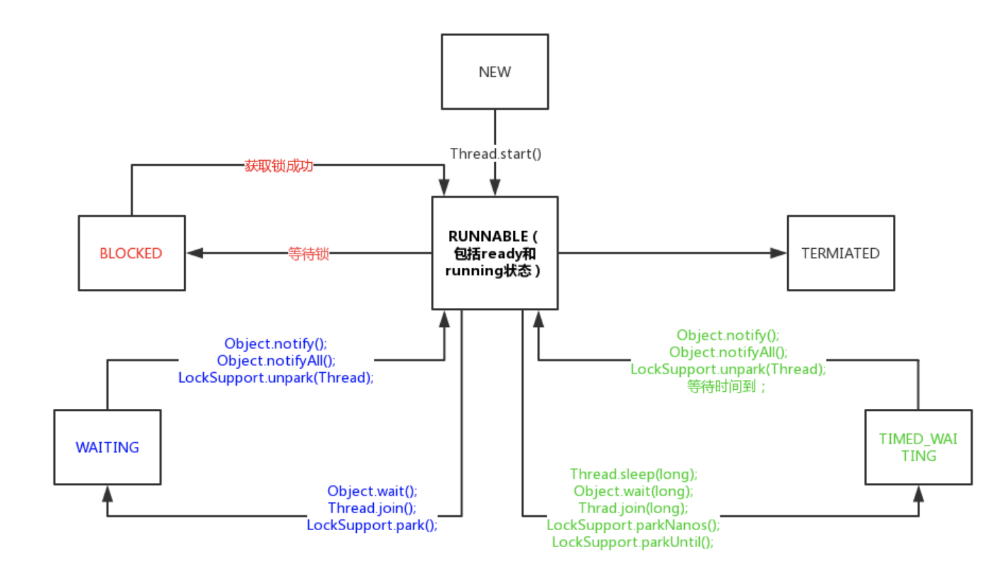

# 线程状态

操作系统的线程主要有以下三个状态：

- 绪状态(ready)：线程正在等待使用 CPU，经调度程序调用之后进入 running 状态。
- 执行状态(running)：线程正在使用 CPU。
- 等待状态(waiting): 线程经过等待事件的调用或者正在等待其他资源（如 I/O）

## NEW

处于NEW状态的线程此时尚未启动。这里的尚未启动指的是还没调用Thread实例的start()方法

```java
private void testStateNew() {
    Thread thread = new Thread(() -> {});
    System.out.println(thread.getState()); // 输出 NEW
}
```

在调用start之后，threadStatus的值会改变（threadStatus !=0），再次调用start方法会抛出IllegalThreadStateException异常

假如一个线程执行完毕，threadStatus为2代表当前线程状态为TERMINATED，不能再调用start方法

## RUNNABLE

表示当前线程正在运行中，处于RUNNABLE状态的线程在Java虚拟机中运行，也有可能在等待CPU分配资源

Java线程的RUNNABLE状态其实包括了操作系统线程的ready和running两个状态

## BLOCKED

阻塞状态，处于BLOCKED状态的线程正等待锁的释放以进入同步区

## WAITING

等待状态，处于等待状态的线程变成RUNNABLE状态需要其他线程唤醒

## TIMED_WAITING

超时等待状态，线程等待一个具体的时间，时间到后会被自动唤醒

## TERMINATED

终止状态，此时线程已执行完毕

## 线程状态的转换

线程状态转换图



## 线程中断

在某些情况下，我们在线程启动后发现并不需要它继续执行下去时，需要中断线程。目前在 Java 里还没有安全方法来直接停止线程，但是 Java 提供了线程中断机制来处理需要中断线程的情况。

线程中断机制是一种协作机制。需要注意，通过中断操作并不能直接终止一个线程，而是通知需要被中断的线程自行处理。

Thread类里提供的关于线程中断的几个方法：

- Thread.interrupt()：中断线程。这里的中断线程并不会立即停止线程，而是设置线程的中断状态为true（默认是false）
- Thread.isInterrupted()：测试当前线程是否被中断
- Thread.interrupted()：检测当前线程是否被中断，与 isInterrupted() 方法不同的是，这个方法如果发现当前线程被中断，会清除线程的中断状态

在线程中断机制里，当其他线程通知需要被中断的线程后，线程中断的状态被设置为 true，但是具体被要求中断的线程要怎么处理，完全由被中断线程自己决定，可以在合适的时机中断请求，也可以完全不处理继续执行下去
