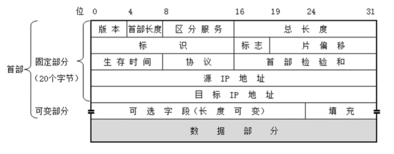
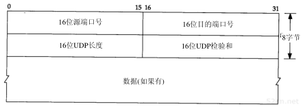
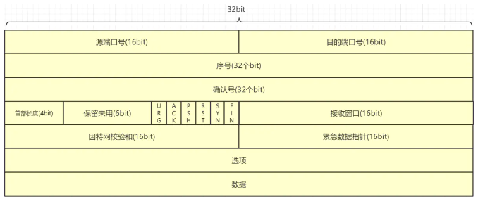
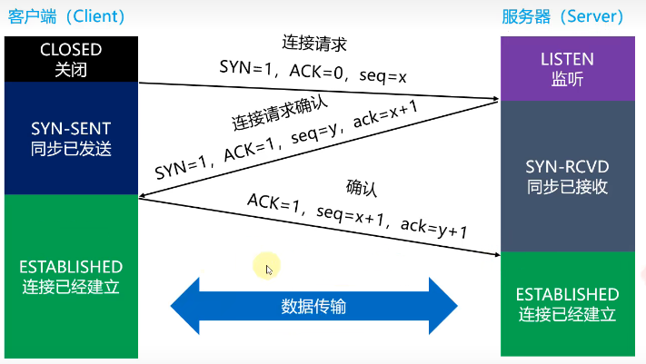
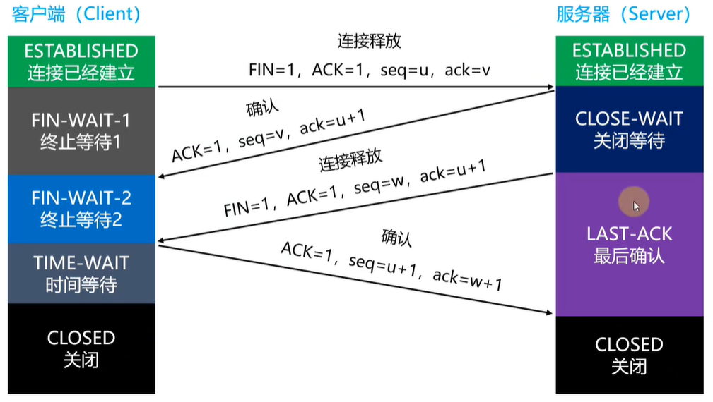
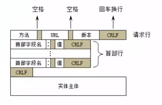
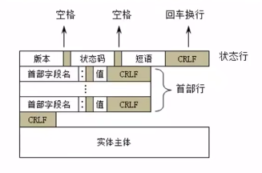

# 计算机网络

## 基础概念

### 集线器-hub

集线器用于连接多台网络设备，每台设备接入到集线器的一个网口当中，当其中一台设备发送信号，集线器将对应网口接收到的信号通过中继电路广播到所有端口

优点：

可以连接多台设备

缺点：

- 每次收到信号，都会无脑的将信号传递给每个端口，即使有了mac地址

- 使用的半双工通信

### 网桥-共享网线

网桥是一种对帧进行转发的技术，根据MAC分区块，可隔离碰撞。网桥将网络的同一网段在数据链路层上连接起来，但是只可以连接同构的网络（即统一网段），不能连接异构网络（即不同网段）。通过将两个相似的网络连接起来，且对网络数据的流通进行管理。因其工作在二层网络（数据链路层），不仅可以扩展网络的距离或范围，还可以提高网络的性能、安全性和可靠性

优点：

- 过滤通信量，隔绝冲突域
- 可以增加局域网的工作站数目
缺点：
- 适用于设备不多的情况，不然可能会产生广播风暴
- 查找mac地址的存在，增加传输延时

### 交换机-共享网线

网络交换机是让两个或多个`IT设备`（例如计算机）相互通信的设备。将多个`IT`设备连接在一起即可搭建起一个通信网络。

计算、打印、服务器、文件存储、互联网访问和其他 IT 资源均可通过网络共享。

交换机在接收到数据时，会先检查数据中包含的MAC地址，再将数据从目的主机所在的端口转发出去。交换机之所以能实现这一功能，是因为交换机内存有一张MAC地址表，该表记录了网络中所有MAC地址与该交换机各端口的对应信息。当有数据帧需要通过该交换机进行转发时，交换机根据内部存储的MAC地址表获取目的设备所对应的端口，通过找到的端口转发数据

### 路由器-共享ip

路由器是连接计算机网络的网络设备，路由器是在网络之间传输数据包以在互联网络中的两个节点之间建立和维持通信的主力。

路由器在OSI 模型的第 3 层（网络层）运行；路由器使用数据包中的目标 IP 地址来确定将数据包转发到哪里

路由器主要完成两个功能：

1. 路由选择：路由器按照复杂的分布式算法，根据从各相邻的路由器获得整个网络拓扑的变化情况，选择合适的路由
2. 分组转发：路由器根据转发表将用户的数据从合适的端口转发出去

## TCP/IP五层网络模型

### 物理层--比特流

该层为上层协议提供了一个传输数据的可靠的物理媒体。简单的说，物理层确保原始的数据可在各种物理媒体上传输

### 数据链路层--帧

数据链路层在物理层提供的服务的基础上向网络层提供服务，其最基本的服务是将源自网络层来的数据可靠地传输到相邻节点的目标机网络层。

为达到这一目的，数据链路必须具备一系列相应的功能，主要有：如何将数据组合成数据块，在数据链路层中称这种数据块为帧（frame），帧是数据链路层的传送单位；如何控制帧在物理信道上的传输，包括如何处理传输差错，如何调节发送速率以使与接收方相匹配；以及在两个网络实体之间提供数据链路通路的建立、维持和释放的管理。

数据链路层在不可靠的物理介质上提供可靠的传输。

该层的作用包括：物理地址寻址、数据的成帧、流量控制、数据的检错、重发

数据链路层以太网帧组成：

目标mac地址+源mac地址+网络类型+数据+FCS（完整性、正确性校验）

数据链路层的数据帧中，来自网络层的数据包被放在数据部分，但是数据部分有MTU（最大传输单元）的限制，只允许40<=MTU<=1500字节的数据包，如果来自网络层的数据包大于1500字节，则会将包进行分割，在每个包的前方加上网络层的首部

### 网络层--包

本层通过IP寻址来建立两个节点之间的连接，为源端的运输层送来的分组，选择合适的路由和交换节点，正确无误地按照地址传送给目的端的运输层。就是通常说的IP层。这一层就是我们经常说的IP协议层。

网络层就相当于快递公司庞大的快递网络，全国不同的集散中心，比如说，从深圳发往北京的顺丰快递（陆运为例啊，空运好像直接就飞到北京了），首先要到顺丰的深圳集散中心，从深圳集散中心再送到武汉集散中心，从武汉集散中心再寄到北京顺义集散中心。这个每个集散中心，就相当于网络中的一个IP节点

网络层数据包组成：

- 版本：ipv4、ipv6
- 首部长度：网络层首部长度，一般是固定的20个字节
- 区分服务：对服务进行标识
- 总长度：首部加上数据部分的长度
- 标识：分包时对同一组包进行标识
- 标志：.0.，标志是否可以进行分片，..1，标志后面是否有更多的片
- 片偏移：当前片偏移的字节数，需要乘以8
- 协议：IP数据报的数据部分（上层）使用的协议类型
- 首部校验和：首部所有数据生成的校验和

常见协议： ICMP、IP、ARP

### 传输层--段

传输层建立了主机端到端的链接，传输层的作用是为上层协议提供端到端的可靠和透明的数据传输服务，包括处理差错控制和流量控制等问题。该层向高层屏蔽了下层数据通信的细节，使层用户看到的只是在两个传输实体间的一条主机到主机的、可由用户控制和设定的、可靠的数据通路。我们通常说的，TCP UDP就是在这一层。端口号既是这里的“端”。

传输层就相当于公司中的负责快递邮件收发的人，公司自己的投递员，他们负责将上一层的要寄出的资料投递到快递公司或邮局。

#### UDP

用户数据包协议就，是一个简单的面向数据报的运输层协议：进程的每个输出操作都正好产生一个UDP数据报，并组装成一份待发送的IP数据报。这与面向流字符的协议不同，如TCP，应用程序产生的全体数据与真正发送的单个IP数据报可能没有什么联系

- 源端口号：发送方的端口号，范围(0~65535)
- 目的端口号： 接收者的端口号，范围(0~65535)
- 长度：表示UDP报文段的长度(包括首部和数据)
- 校验和：接收方用于校验该报文段中是否存在了差错
- 应用数据：报文实体数据。

#### TCP

**首部结构:**

- 源端口号：发送方的端口号，范围(0~65535)
- 目的端口号： 接收者的端口号，范围(0~65535)
- 序号：如果 TCP 数据太大时(大于 IP 封包的容许程度)， 就得要进行分段。这个序号就是记录每个封包的序号，可以让接收端重新将 TCP 的数据组合起来，序号字段的值则指的是本报- 文段所发送的数据的第一个字节的序号。简称为seq
- 确认号：为了确认接收端确实有收到发送端所送出的封包数据，当发送端收到这个确认码时，就能够确定之前传递的封包已经被正确的收下了，这个确认号是期望收到对方的下一个报文段的- 数据的第一个字节的序号。简称ack
- 首部长度：表示TCP首部的长度，范围(0~15)，单位32bit，例如值为5时，表示首部长度是20Byte(160bit)，如果选项字段为空，则TCP首部长度为20Byte，即值为5
- URG：URG=1时表示存在着紧急数据，紧急是数据的最后一个字节由紧急数据指针指出，一般较少使用
- PSH：当URG＝1时，表明紧急指针字段有效,代表该封包为紧急封包。它告诉系统此报文段中有紧急数据，应尽快传送(相当于高优先级的数据)
- RST：RSP=1时重建连接，如果接收到RST位时候，通常发生了某些错误
- ACK：ACK=1表示确认号字段中的值是有效的，为0表示无效
- SYN：SYN=1时，就表示这是一个连接请求或连接接受报文，一般用于握手阶段
- FIN：用来释放一个连接，当FIN＝1时，表明此报文段的发送端的数据已发送完毕，并要求释放运输连接。
- 接收窗口：用于流量控制，指示接收方愿意接收的字节数量，范围0~65535字节。
- 因特网校验和：检验和覆盖了整个的TCP报文段即TCP首部和TCP数据，这是一个强制性的字段，一定是由发送端计算和存储，并由接收端进行验证。
- 紧急数据指针：当URG=1时有效，是一个正的偏移量，和序号中的值相加表示表示紧急数据最后一个字节的序号。
- 选项：用于发送方和接收方协商最大报文长度(MSS)时(只存在于SYN报文)或在高速网络环境下用作窗口调节因子时使用，还可存放时间戳数据

**可靠传输：**

保证数据包能够完整高效地发送到接收方，主要是通过确认号来实现

1. 停止等待协议-一问一答，效率低
发送了一个分组后，停止发送后面的分组，等待确认后再接着发送，效率低下
2. 连续ARQ协议+滑动窗口协议-效率高
连续arq协议根据接收端返回的tcp包中的窗口大小，一次性发送多个连续的tcp包，接收端收到包并确认以后，向发送方发送一个确认号，告诉发送方下次应该从那个序号发送
3. 选择性确认sack
选择性确认使用到了tcp首部中的选项部分，是接收方告诉发送方自己收到了上次的哪些分组，丢失了哪些分组，对没收到的进行重发，既保证了数据完整，又保证了传输效率

**流量控制：**

流量控制限制发送方发送包的大小和速度。通过接收方返回接收的滑动窗口大小，接收方发送不同包数量，避免接收方处理不过来包而丢弃，是一种点对点的控制
当接收方返回的滑动窗口为0，发送方会暂停发送数据，而数据还没发送完毕时，发送方会主动询问接收方是否可以继续发送数据

**拥塞控制：**

拥塞控制避免网络传输介质上注入过多的数据，导致路由器或者链路过载，是一种多对多的控制。

1. 慢开始
发送方先发送接收窗口允许的少量数据包，后续成倍增加（指数增加）

2. 拥塞避免
当单次发送的数据量达到一定的阈值后，后续的发送窗口增加量减小（幂增加），当出现网络拥塞后，然后恢复到初始值重新慢开始，单次发送数据量倍数减小，已弃用

3. 快重传+快恢复
当单次发送的数据量达到一定的阈值后，将阈值减半，后续数据量呈加法递增，现在使用这种方式

### 应用层--报文

**DNS**

域名解析系统，用于从域名到ip地址的解析，DNS可以基于UDP协议，也可以基于TCP协议，服务器一般占用53端口

所有DNS服务器都存储了根服务器的地址

所有DNS服务器都存储了下一级DNS服务器的地址

客户端首先会访问本地的DNS服务器

**DHCP**

动态主机配置协议，用于动态获取ip地址，如平时家庭使用的路由器可以充当DHCP服务器

**ip地址分配过程**

1. 发现阶段：发送源ip地址为0.0.0.0，目标ip地址为255.255.255.255，目标mac地址为FF:FF:FF:FF:FF:FF的广播包
2. 提供阶段：DHCP服务器收到广播后，返回可用的ip地址、租用期限、子网掩码、网关、DNS信息
3. 选择阶段：客户端选择一个ip地址并对DHCP服务器进行回应
4. 确认阶段：服务器收到选择的ip后，发送确认包给客户端

## TCP连接

### 建立连接

建立连接就是常说的三次握手过程，保证服务端和客户端都收发数据能力都正常，整体流程如下：

1. 客户端向服务器发送SYN信号，告诉服务器自己需要建立连接，此时确认号ACK为0，因为并不需要服务器立即发送数据。客户端同时发送一个原始序号seq为x给服务器
2. 服务器收到来自客户端的建立连接请求，如果服务器条件允许，向客户端发送SYN为1信号，ACK为1，此时ack为客户端原始序号x+1，表示从第一个字节发送，同时将自己原始序号seq为y发送给客户端
3. 客户端收到来自服务器可以连接请求的SYN信号后，客户端发送一个SYN为0，ACK为1的信号，告诉服务器马上向服务器发送资源，发送的seq为服务器发送过来的ack号x+1，但是发送的数据内容为0，同时发送确认号ack为服务器原始序号y+1给服务器，告诉服务器从第一个字节发送，此时连接建立完成
4. 发送真正的数据，此时SYN为0，ACK为1，seq为x+1，ack为y+1，包含一定的数据字节

### 释放连接

释放连接就是常说的四次挥手的过程，tcp的断开连接发起者既可以是客户端也可以是服务端，四次挥手保证了发送方和接收方都已经发送数据完毕，整体流程如下：

1. 客户端向服务器发送FIN报文，并发送ACK确认，表示请求断开连接，此时客户端进入终止等待1状态，等待服务器的ACK确认
2. 服务器收到FIN报文后，返回ACK报文，表示已经收到断开请求，此时可能服务器数据尚未发送完成 ，此时客户端进入终止等待2状态，等待服务器发送FIN信号，服务器进入关闭等待状态
3. 当服务器数据发送完成后，向客户端发送FIN报文，表示释放连接，服务器进入最后确认状态
4. 客户端收到来自服务器的断开请求后，返回ACK报文，客户端进入时间等待状态，一般是4分钟，四分钟后服务器没有发送FIN信号，然后双方断开连接

## HTTP

### HTTP版本

1. HTTP/0.9

- 只支持GET请求，无法支持很多请求头和响应头
- 并且只能获取html文本资源
- 请求完成后立刻关闭连接

2. HTTP/1.0

- 支持POST、HEAD等请求，支持更多的请求头和响应头
- 支持更多形式的内容，如图像、视频、二进制文件
- 每次请求都会与服务器建立连接，数据传输完毕都会关闭连接

3. HTTP/1.1

- 支持PUT、DELETE等请求方法
- TCP连接默认不关闭，为相同的服务请求共用一个连接
- 新增了Host字段，用于标明服务器的地址
- 支持分块编码传输，用于动态生成的内容，边生成边发送

> 1. 同一个连接一次只能发送一个请求
> 2. 只允许客户端主动发送请求
> 3. 同一个会话的多次请求，头信息会重复发送多次

4. HTTP/2.0

HTTP2的实线机制主要使用到了二进制分帧，HTTP1使用文本的形式传输，并以回车换行作为分隔符，回车换行消耗了很多的字节，而HTTP2将头部和数据部分分割成header和多个data二进制帧，与http/1.1的文本形式，二进制分帧在到达传输层以前已经进行了二进制编码，效率更高；同时每一帧都有自己的数据流标识，为多路复用提供了可能

- 多路复用：对于同一个服务，使用一个TCP连接，可以包含多个虚拟的双向数据流，每一个流都有唯一的流ID，多个请求在不同的流中进行传输，接收方再对帧数据进行重组
- 头部压缩：对于同一个服务，很多请求头是相同的，如cookie、user-agent等，对于这些不进行重复发送，每次发送的请求头都只发送差异部分
- 服务器推送：服务器可以主动向客户端推送资源，如访问了html资源，同时返回html文本中包含的css、js连接资源

### 报文格式

#### 请求报文

#### 响应报文

### 请求方法

- get：用于获取资源，请求体中不会包含请求数据，通过地址传递参数，可能会受到服务器的限制，支持快取、缓存、可保留书签
- post：可以用户获取和修改资源，可以传递更大的参数，提交的资源放在请求体中，不支持快取

>get与post的区别：
>
>1. post方法传输相对更加安全：get方法是将参数放在url中，通过查看历史记录很容易获取参数信息，而post方法是将参数信息放在请求体中，不容易被查看到
>
>2. get方法访问相对更加安全：get方法访问不会修改服务器资源，是安全非幂等（一次和多次访问的结果相同）的
>
>3. get方法是无害的：get方法在前进后退等操作中是无害的，而post可能重新提交表单
>
>4. 支持的数据类型不同：get方法只支持ASCII字符，而post没有限制

- put：用于覆盖资源，和post类似，html表单不支持，发送资源与服务器，并存储在服务器指定位置，要求客户端事先知道该位置
- delete：用于删除资源
- patch：用于修改资源，如果资源不存在，创建资源
- head：和get方法类似，但是不会返回响应体，主要用来检查资源或超链接的有效性或是否可以可达、检查网页是否被串改或更新，获取头信息等，特别适用在有限的速度和带宽下
- options：用于获取服务器的支持信息，通常用于预检请求
- trace：回显请求信息，用于测试连通性
- connect：常用在ssl中

### 头部字段

#### 通用头字段

请求和响应中都可以用的字段，不可以是实体头

- Date：请求或响应发出的时间，与实体无关
- Cache-Control：通过单向的方式实现缓存机制
- Connection：决定当前的事务完成后，是否会关闭网络连接。如果该值是“keep-alive”，网络连接就是持久的，不会关闭，使得对同一个服务器的请求可以继续在该连接上完成；如果是“close”，本次通信结束后会断开连接，协议规定HTTP/1.0如果想要保持长连接，需要在请求头中加上Connection: keep-alive

#### 请求头字段

1. 请求方信息

- User-Agent：发送请求的客户端信息
- Referer：告知服务器请求是从哪个页面发起的，包括url中除用户名密码hash外的所有路径信息
- Origin：请求发起的来源，包括且仅仅包括协议、域名和端口，并不包含任何路径信息，只有跨域或者同域的post请求才会发送
- Host：服务器的域名、ip地址和端口
- Cookie：cookie信息
- Max-Forwards：请求允许被转发的最大次数，每经过一次转发，值就减一，到零时不做转发，通过此字段可定位通信问题，比如之前支付宝光纤被挖断，就可通过设置Max-Forwards来定位大概的位置

2. 内容协商

- Accept：可接受的媒体类型，如text/html，媒体类型的格式一般为：type/subType, 表示优先请求subType类型的数据，如果没有，返回type类型
数据也可以。
常见的媒体类型： 文本文件：text/html, text/plain, text/css, application/xml 图片文件：iamge/jpeg, image/gif, image/png; 视频文件：video/mpeg 应用程序使用的二进制文件：application/octet-stream, application/zip
- Accept-Encoding：可接受的编码格式，如gzip
常用的内容编码： gzip: 由文件压缩程序gzip生成的编码格式； compress: 由Unix文件压缩程序compress生成的编码格式； deflate: 组合使用zlib和deflate压缩算法生成的编码格式； identity：默认的编码格式，不执行压缩
- Accept-Charset：可接受的字符集
- Accept-Language：可接受的语言，如zh，zh-CN
- Range：获取部分资源。例如：Range: bytes=500-1000表示获取指定资源的第500到1000字节之间的内容，如果服务器
能够正确处理，则返回206作为应答，表示返回了部分数据，如果不能处理这种范围请求，则以200作为应答，返回完整的
数据

3. 缓存

- If-Modified-Since：发送资源的Last-Modified，用于验证客户端本地资源的时效性，如果服务器资源没有更改，不处理资源和返回资源
- If-None-Match：发送资源的ETag，如果服务器资源的etag一致，则不处理这里请求和资源

#### 响应头字段

1. 响应信息

- Set-Cookie：cookie信息
NAME=VALUE：赋予Cookie的名称和值；
expires=DATE: Cookie的有效期；
path=PATH: 将服务器上的目录作为Cookie的适用对象，若不指定，则默认为文档所在的文件目录； domain=域名：作为Cookies适用对象的域名，若不指定，则默认为创建Cookie的服务器域名； Secure: 仅在HTTPS安全通信是才会发送Cookie； HttpOnly: 使Cookie不能被JS脚本访问；

- Server：服务器名称
- Location：重定向地址

2. 内容信息

- Content-Type：实体类型
- Content-Encoding：内容编码方式，如gzip
- Content-Language：响应内容所使用的语言
- Content-Range：返回的资源范围
- Content-Length：响应资源的大小
- Content-Disposition：对资源的MIME描述，浏览器可以根据自身情况打开或者下载资源

3. 缓存信息

- ETag：对于某个资源的某个特定版本的一个标识符，通常是一个 消息散列
- Expires：指定一个过期时间
- Last-Modified：资源的最后修改时间
- Cache-Control：控制客户端缓存

4. 跨域配置信息

- Access-Control-Allow-Origin：控制可访问的来源
- Access-Control-Expose-Headers：可以暴露给客户端的响应头
- Access-Control-Allow-Methods：客户端可以使用的请求方法
- Access-Control-Allow-Headers：客户端可以使用的自定义请求头

### 状态码

#### 1xx

表示服务器已收到请求，处理将继续。

- 100 [继续]： 现在一切正常，继续。
- 101 [切换协议]： 有消息，例如升级请求、正在将事物更改为不同的协议。

#### 2xx

表示客户端请求已被接收、理解、和处理，主要与报文内容相关。

- 200 [OK]: 一切都好，一切都很成功。
- 201 [Created]：请求成功并且服务器创建了新的资源，一般用于put请求
- 204 [No Content]: 无内容。服务器成功处理，但未返回内容。在未更新网页的情况下，可确保浏览器继续显示当前文档，一般用于head请求
- 205 [Reset Content]: 重置内容。服务器处理成功，用户终端（例如：浏览器）应重置文档视图。可通过此返回码清除浏览器的表单域
- 206 [Partial Content]: 成功处理了请求并返回了部分内容

#### 3xx

表示客户端在请求成功之前还需要做一些事情，主要与重定向相关，很少有例外。

- 300 [Multiple Choices]：多种选择，请求的资源包含多个位置，可返回一个资源与特征对应的列表供客户端选择
- 301 [Moved Permanently]：永久重定向，资源已经永久地放在另一台服务器上，后续所有的请求都去这个地址拿。浏览器收到301后会将original_url和redirect_url存储在浏览器缓存中，以后请求original_url，无论浏览器中是否有缓存，都请求重定向的地址，现在浏览器一般使用get方法访问重定向地址，如果不允许切换，使用308。
- 302 [Found]：临时重定向，以后请求还是这个地址，现在浏览器一般使用get方法访问重定向地址，如果不允许切换，使用307。
- 304 [Not Modified]：无修改，所请求的资源未修改，服务器返回此状态码时，不会返回任何资源。客户端通常会缓存访问过的资源，通过提供一个头信息指出客户端希望只返回在指定日期之后修改的资源。
- 305 [使用代理]: 请求的资源仅在你使用代理时可用。
- 307 [临时重定向]: 具有与 302 重定向相同的功能，但你不能在 `POST` 和 `GET` 之间切换。
- 308 [永久重定向]: 具有与 301 重定向相同的功能，但你不能在 `POST` 和 `GET` 之间切换。

#### 4xx

表示客户端有错误。该错误通常会在响应中显示。

- 400 [Bad Request]：客户端请求语法错误，服务器无法理解。可能是地址格式、参数格式有问题
- 401 [Unauthorized]：未授权。
- 403 [Forbidden]：阻止访问，服务器理解了请求但没有访问权限。
- 404 [Not Found]：未找到请求的资源。
- 405 [Method Not Allowed]：不支持使用的请求方法，例如，表单需要使用 POST 但使用 GET 代替。
- 413 [超出限制]: 请求大小超出服务器的限制。
- 414 [URI 过长]: 请求的 URI 超出服务器限制。
- 415 [不支持该格式]: 服务器不支持请求的媒体格式。
- 416 [超出范围]: 客户端请求服务器无法提供的文件部分。例如，它请求文件实际结束位置之外的文件部分。
- 422 [实体无法处理]: 请求中存在语义错误。

#### 5xx

表示服务器有错误，它知道它不能执行请求。响应将包含错误原因。

- 500 [Internal Server Error]：内部服务器错误 – 服务器遇到某种问题、并且没有更好或更具体的错误代码。
- 502 [Bad Gateway]：网关错误 – 服务器处于请求中间状态。但是它从它路由到的服务器收到了错误的响应。
- 504 [Gateway Time-out]：网关超时，网关没有及时从服务器获取到资源。
- 505 [HTTP Version not support]：服务器不支持请求中的 HTTP 协议版本。

### HTTP缓存

http的缓存策略，是由客户端和服务器端共同去控制的，客户端可以通过在请求头里添加Cache-Control等字段来决定是否走缓存，服务器端也可以在响应头中添加Cache-Control等字段来告诉客户端是否可以缓存数据
强缓存失效后，浏览器先向服务器发送一个请求，如果资源没有发生修改，则返回一个 304 状态，让浏览器使用本地的缓存副本。如果资源发生了修改，则返回修改后的资源

1. Expires：

在HTTP/1.0中，服务器在响应头中返回该字段，表示资源的过期时间，如果未到过期时间，浏览器使用该缓存，不会向服务器发起请求。但是这种方式比较绝对，及时服务器资源更新了，但是浏览器中的缓存还没有到时间，依然会使用浏览器中的缓存，无法获取最新的资源，现在很少使用

2. Cache-Control：

**可缓存性：**

- public：表明可以被任何对象缓存，即使是不可缓存的内容，如使用了post方法、没有max-age、没有expires
- private：表明响应只能被单个用户缓存，不能作为共享缓存（即代理服务器不能缓存它）。私有缓存可以缓存响应内容，比如：对应用户的本地浏览器

**缓存协商：**

- max-age=`<seconds>`：设置缓存存储的最大周期，超过多少秒后资源失效。这是一个相对时间，时间是从服务器创建完成资源开始计算。
- no-store：不应存储有关客户端请求或服务器响应的任何内容，即不使用任何缓存
- no-cache：可以缓存内容，如果不是no-store，无论缓存是否过期，都会向服务器发送请求 (协商缓存验证)
- must-revalidate：如果设置了max-age并且缓存没有过期，可以直接使用缓存，过期后必须向服务器验证

3. Last-Modified & If-Modified-Since：

服务器通过在响应头中添加 Last-Modified 属性来指出资源最后一次修改的时间，当浏览器下一次发起请求时，会在请求头中添加一个 If-Modified-Since 的属性，属性值为上一次资源返回时的 Last-Modified 的值。当请求发送到服务器后服务器会通过这个属性来和资源的最后一次的修改时间来进行比较，以此来判断资源是否做了修改。如果资源没有修改，那么返回 304 状态，让客户端使用本地的缓存。如果资源已经被修改了，则返回修改后的资源。
使用这种方法有一个缺点，就是 Last-Modified 标注的最后修改时间只能精确到秒级，如果某些文件在1秒钟以内，被修改多次的话，那么文件已将改变了但是 Last-Modified 却没有改变，这样会造成缓存命中的不准确。

4. Etag & If-None-Match：

因为 Last-Modified 的这种可能发生的不准确性，http 中提供了另外一种方式，那就是 Etag 属性。服务器在返回资源的时候，在头信息中添加了 Etag 属性，这个属性是资源生成的唯一标识符，当资源发生改变的时候，这个值也会发生改变。在下一次资源请求时，浏览器会在请求头中添加一个 If-None-Match 属性，这个属性的值就是上次返回的资源的 Etag 的值。服务接收到请求后会根据这个值来和资源当前的 Etag 的值来进行比较，以此来判断资源是否发生改变，是否需要返回资源。通过这种方式，比 Last-Modified 的方式更加精确。

#### 浏览器刷新

1. 浏览器刷新
即我们按F5刷新页面的时候，该页面的http请求中会添加：Cache-Control:max-age:0; 即说明缓存直接失效啦，就不走缓存了，直接从服务器端读取数据。

2. 浏览器强制刷新
即我们按ctrl+f5强制刷新页面的时候，该页面的http请求会添加：Cache-Control:no-cache; 即表示此时要首先去服务器端验证资源是否有更新，如果有更新则直接返回最新资源，如果没有更新，则返回304，然后浏览器端判断是304的话，则从缓存中读取数据。

3. 浏览器前进后退重定向
当我们点击浏览器的前进后退操作时，这个时候请求中不会有Cache-Control的字段，没有该字段，就表示会检查缓存，直接利用之前的资源，不再重新请求服务器。

### HTTPS

#### 加密

http默认使用的是明文传输的，在通信过程中被截获后很容易被中间人接渠道通信内容并破解，因此需要对通信内容加密后进行传输

1. 不可逆加密
不可逆加密是指通过一定方式将内容进行加密获得加密结果（指纹）以后，无法再通过加密结果再获取原始的内容，常用的不可逆加密方式有MD5、SHA

2. 可逆加密
即可以通过加密结果获取到原始的加密内容，如base64、DES、AES、RSA

3. 对称加密
对称加密是指加密算法使用的加密秘钥和解密秘钥是同一个，常见的如AES、DES、3DES

- DES
DES是一种使用64bit密钥对64bit消息进行加密的对称加密方式，对于超过64bit的消息，会通过反复加密的方式进行加密，安全性较低，现在很少使用
- AES
AES是一种使用128bit、192bit、256bit密钥对消息加密的方式

对称加密加密方和解密方使用的是同一个密钥，就涉及到密钥传输的问题，一般的方式是通过事先共享、密钥分配中心、DH等方式共享密钥

4. 非对称加密
非对称加密是指加密算法加密使用一个秘钥（公钥），一般是公开的，都可以使用，解密使用另一个秘钥（私钥），可以解决对称加密密钥传输的问题，常见的如RSA

5. 混合加密
对称加密安全性比较低，非对称加密的加密算法复杂，整个加密过程比较长，尤其对于信息数据较多是效率较低，因此使用混合加密的方式可以保证加密的安全性和效率
混合加密，就是使用对称加密的方式对消息进行加密，使用非对称加密对密钥进行加密

#### TLS

TLS建立在SSL的基础上，是工作在应用层和传输层之间的一个协议，用于对通信内容进行加密，在进行网络通信过程中，会建立TLS链接
