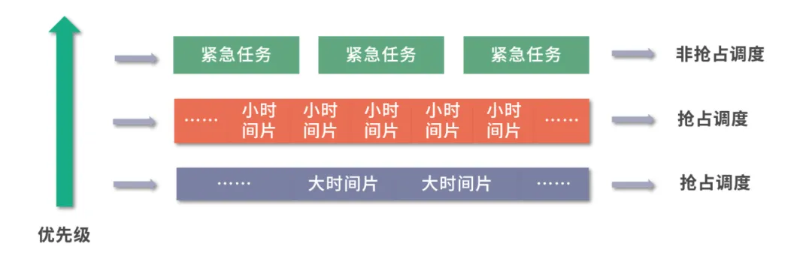

# 操作系统

## 计算机组成

控制器：是整个计算机的中枢神经，其功能是对程序规定的控制信息进行解释，根据其要求进行控制，调度程序、数据、地址，协调计算机各部分工作及内存与外设的访问等。

运算器：运算器的功能是对数据进行各种算术运算和逻辑运算，即对数据进行加工处理。

存储器：存储器的功能是存储程序、数据和各种信号、命令等信息，并在需要时提供这些信息。

输入：输入设备是计算机的重要组成部分，输入设备与输出设备合你为外部设备，简称外设，输入设备的作用是将程序、原始数据、文字、字符、控制命令或现场采集的数据等信息输入到计算机。常见的输入设备有键盘、鼠标器、光电输入机、磁带机、磁盘机、光盘机等。

输出：输出设备与输入设备同样是计算机的重要组成部分，它把外算机的中间结果或最后结果、机内的各种数据符号及文字或各种控制信号等信息输出出来，微机常用的输出设备有显示终端CRT、打印机、激光印字机、绘图仪及磁带、光盘机等

## 计算机结构


### 内存

在冯诺依曼模型中，程序和数据被存储在一个被称作内存的线性排列存储区域。

存储的数据单位是一个二进制位，英文是 bit，最小的存储单位叫作字节，也就是 8 位，英文是 byte，每一个字节都对应一个内存地址。

内存地址由 0 开始编号，比如第 1 个地址是 0，第 2 个地址是 1， 然后自增排列，最后一个地址是内存中的字节数减 1。

我们通常说的内存都是随机存取器，也就是读取任何一个地址数据的速度是一样的，写入任何一个地址数据的速度也是一样的

### CPU

冯诺依曼模型中CPU负责控制和计算，为了方便计算较大的数值，CPU每次可以计算多个字节的数据。CPU 中有一个控制单元专门负责控制CPU工作；还有逻辑运算单元专门负责计算

- 如果 CPU 每次可以计算 4 个 byte，那么我们称作 32 位 CPU；
- 如果 CPU 每次可以计算 8 个 byte，那么我们称作 64 位 CPU。

这里的 32 和 64，称作 CPU 的位宽

#### 寄存器

寄存器是 CPU 的一个特殊内存，它的作用是保存 CPU 的临时数据，比如 CPU 的执行指令，CPU 的执行结果，CPU 的执行地址，CPU 的执行状态，CPU 的执行计数器

常见的寄存器种类：

- 通用寄存器，用来存放需要进行运算的数据，比如需要进行加和运算的两个数据。
- 程序计数器，用来存储 CPU 要执行下一条指令所在的内存地址，注意不是存储了下一条要执行的指令，此时指令还在内存中，程序计数器只是存储了下一条指令的地址。
- 指令寄存器，用来存放程序计数器指向的指令，也就是指令本身，指令被执行完成之前，指令都存储在这里

#### 多级缓存

现代CPU为了提升执行效率，减少CPU与内存的交互(交互影响CPU效率)，一般在CPU上集成了多级缓存架构

CPU缓存即高速缓冲存储器，是位于CPU与主内存间的一种容量较小但速度很高的存储器

由于CPU的速度远高于主内存，CPU直接从内存中存取数据要等待一定时间周期，Cache中保存着CPU刚用过或循环使用的一部分数据，当CPU再次使用该部分数据时可从Cache中直接调用，减少CPU的等待时间，提高了系统的效率

当 CPU 需要内存中某个数据的时候，如果寄存器中有这个数据，我们可以直接使用；如果寄存器中没有这个数据，我们就要先查询 L1 缓存；L1 中没有，再查询 L2 缓存；L2 中没有再查询 L3 缓存；L3 中没有，再去内存中拿

具体包括以下几种：

##### L1-Cache

L1- 缓存在 CPU 中，相比寄存器，虽然它的位置距离 CPU 核心更远，但造价更低，通常 L1-Cache 大小在几十 Kb 到几百 Kb 不等，读写速度在 2~4 个 CPU 时钟周期。

##### L2-Cache

L2- 缓存也在 CPU 中，位置比 L1- 缓存距离 CPU 核心更远，它的大小比 L1-Cache 更大，具体大小要看 CPU 型号，有 2M 的，也有更小或者更大的，速度在 10~20 个 CPU 周期。

##### L3-Cache

L3- 缓存同样在 CPU 中，位置比 L2- 缓存距离 CPU 核心更远，大小通常比 L2-Cache 更大，读写速度在 20~60 个 CPU 周期。

L3 缓存大小也是看型号的，比如 i9 CPU 有 512KB L1 Cache；有 2MB L2 Cache；有16MB L3 Cache。

#### CPU运行安全等级

CPU有4个运行级别，分别为：

ring0，ring1，ring2，ring3
ring0只给操作系统用，ring3谁都能用。

ring0是指CPU的运行级别，是最高级别，ring1次之，ring2更次之……

系统（内核）的代码运行在最高运行级别ring0上，可以使用特权指令，控制中断、修改页表、访问设备等等。

应用程序的代码运行在最低运行级别上ring3上，不能做受控操作。

如果要做，比如要访问磁盘，写文件，那就要通过执行系统调用（函数），执行系统调用的时候，CPU的运行级别会发生从ring3到ring0的切换，并跳转到系统调用对应的内核代码位置执行，这样内核就为你完成了设备访问，完成之后再从ring0返回ring3。

这个过程也称作用户态和内核态的切换

#### CPU执行过程

- 第一步，CPU 读取程序计数器的值，这个值是指令的内存地址，然后 CPU 的控制单元操作地址总线指定需要访问的内存地址，接着通知内存设备准备数据，数据准备好后通过数据总线将指令数据传给 CPU，CPU 收到内存传来的数据后，将这个指令数据存入到指令寄存器。
- 第二步，CPU 分析指令寄存器中的指令，确定指令的类型和参数，如果是计算类型的指令，就把指令交给逻辑运算单元运算；如果是存储类型的指令，则交由控制单元执行；
- 第三步，CPU 执行完指令后，程序计数器的值自增，表示指向下一条指令。这个自增的大小，由 CPU 的位宽决定，比如 32 位的 CPU，指令是 4 个字节，需要 4 个内存地址存放，因此程序计数器的值会自增 4

### 总线

CPU 和内存以及其他设备之间，也需要通信，因此我们用一种特殊的设备进行控制，就是总线。

- 地址总线，用于指定 CPU 将要操作的内存地址
- 数据总线，用于读写内存的数据
- 控制总线，用于发送和接收信号，比如中断、设备复位等信号，CPU 收到信号后自然进行响应，这时也需要控制总线

当 CPU 要读写内存数据的时候，一般需要通过两个总线：

- 首先要通过地址总线来指定内存的地址；
- 再通过数据总线来传输数据；

### 输入、输出设备

输入设备向计算机输入数据，计算机经过计算，将结果通过输出设备向外界传达。

如果输入设备、输出设备想要和 CPU 进行交互，比如说用户按键需要 CPU 响应，这时候就需要用到控制总线

## 相关概念

### 中断

中断可以由 CPU 指令直接触发，这种主动触发的中断，叫作同步中断。

- 比如系统调用，需要从用户态切换内核态，这种情况需要程序触发一个中断，叫作陷阱（Trap），中断触发后需要继续执行系统调用。

- 还有一种同步中断情况是错误（Fault），通常是因为检测到某种错误，需要触发一个中断，中断响应结束后，会重新执行触发错误的地方，比如后面我们要学习的缺页中断。

- 最后还有一种情况是程序的异常，这种情况和 Trap 类似，用于实现程序抛出的异常

另一部分中断不是由 CPU 直接触发，是因为需要响应外部的通知，比如响应键盘、鼠标等设备而触发的中断，这种中断我们称为异步中断

CPU 通常都支持设置一个中断屏蔽位（一个寄存器），设置为 1 之后 CPU 暂时就不再响应中断，对于键盘鼠标输入，比如陷阱、错误、异常等情况，会被临时屏蔽

### 内核态和用户态

很多操作系统，将内存分成了两个区域：

- 内核空间（Kernal Space），这个空间只有内核程序可以访问
- 用户空间（User Space），这部分内存专门给应用程序使用

当我们在系统中执行一个程序时，大部分时间是运行在用户态下的，由于需要限制不同的程序之间的访问能力，防止他们获取别的程序的内存数据，或者获取外围设备的数据，并发送到网络，在其需要操作系统帮助完成某些它没有权力和能力完成的工作时就会切换到内核态


## 线程

线程：系统分配处理器时间资源的基本单元，是程序执行的最小单位

线程可以看做轻量级的进程，共享内存空间，每个线程都有自己独立的运行栈和程序计数器，线程之间切换的开销小。

在同一个进程（程序）中有多个线程同时执行（通过CPU调度，在每个时间片中只有一个线程执行）

进程可以通过 API 创建用户态的线程，也可以通过系统调用创建内核态的线程

### 用户态线程

用户态线程也称作用户级线程，操作系统内核并不知道它的存在，它完全是在用户空间中创建。

用户级线程有很多优势，比如：

- 管理开销小：创建、销毁不需要系统调用
- 切换成本低：用户空间程序可以自己维护，不需要走操作系统调度

但是这种线程也有很多的缺点：

- 与内核协作成本高：比如这种线程完全是用户空间程序在管理，当它进行 I/O 的时候，无法利用到内核的优势，需要频繁进行用户态到内核态的切换
- 线程间协作成本高：设想两个线程需要通信，通信需要 I/O，I/O 需要系统调用，因此用户态线程需要额外的系统调用成本
- 无法利用多核优势：比如操作系统调度的仍然是这个线程所属的进程，所以无论每次一个进程有多少用户态的线程，都只能并发执行一个线程，因此一个进程的多个线程无法利用多核的优势

操作系统无法针对线程调度进行优化：当一个进程的一个用户态线程阻塞（Block）了，操作系统无法及时发现和处理阻塞问题，它不会更换执行其他线程，从而造成资源浪费

### 内核态线程

内核态线程也称作内核级线程（Kernel Level Thread），这种线程执行在内核态，可以通过系统调用创造一个内核级线程。

内核级线程有很多优势：

- 可以利用多核 CPU 优势：内核拥有较高权限，因此可以在多个 CPU 核心上执行内核线程。
- 操作系统级优化：内核中的线程操作 I/O 不需要进行系统调用；一个内核线程阻塞了，可以立即让另一个执行。

当然内核线程也有一些缺点：

- 创建成本高：创建的时候需要系统调用，也就是切换到内核态。
- 扩展性差：由一个内核程序管理，不可能数量太多。
- 切换成本较高：切换的时候，也同样存在需要内核操作，需要切换内核态

## 进程

在系统中正在运行的一个应用程序；程序一旦运行就是进程；是资源分配的最小单位

在操作系统中能同时运行多个进程

开机的时候，磁盘的内核镜像被导入内存作为一个执行副本，成为内核进程

进程可以分成用户态进程和内核态进程两类，用户态进程通常是应用程序的副本，内核态进程就是内核本身的进程

如果用户态进程需要申请资源，比如内存，可以通过系统调用向内核申请

每个进程都有独立的内存空间，存放代码和数据段等，程序之间的切换会有较大的开销

### 分时和调度

每个进程在执行时都会获得操作系统分配的一个时间片段，如果超出这个时间，就会轮到下一个进程（线程）执行

> 现代操作系统都是直接调度线程，不会调度进程
>
#### 分配时间片段

如下图所示，进程 1 需要 2 个时间片段，进程 2 只有 1 个时间片段，进程 3 需要 3 个时间片段

因此当进程 1 执行到一半时，会先挂起，然后进程 2 开始执行；进程 2 一次可以执行完，然后进程 3 开始执行，不过进程 3 一次执行不完，在执行了 1 个时间片段后，进程 1 开始执行；就这样如此周而复始，这个就是分时技术


### 进程状态


#### 创建状态

进程由创建而产生，创建进程是一个非常复杂的过程，一般需要通过多个步骤才能完成：如首先由进程申请一个空白的进程控制块(PCB)，并向PCB中填写用于控制和管理进程的信息；然后为该进程分配运行时所必须的资源；最后，把该进程转入就绪状态并插入到就绪队列中

#### 就绪状态

这是指进程已经准备好运行的状态，即进程已分配到除CPU以外所有的必要资源后，只要再获得CPU，便可立即执行，如果系统中有许多处于就绪状态的进程，通常将它们按照一定的策略排成一个队列，该队列称为就绪队列，有执行资格，没有执行权的进程

#### 运行状态

这里指进程已经获取CPU，其进程处于正在执行的状态。对任何一个时刻而言，在单处理机的系统中，只有一个进程处于执行状态而在多处理机系统中，有多个进程处于执行状态，既有执行资格，又有执行权的进程

#### 阻塞状态

这里是指正在执行的进程由于发生某事件（如I/O请求、申请缓冲区失败等）暂时无法继续执行的状态，即进程执行受到阻塞，此时引起进程调度，操作系统把处理机分配给另外一个就绪的进程，而让受阻的进程处于暂停的状态，一般将这个暂停状态称为阻塞状态

### 进程间通信IPC

每个进程各自有不同的用户地址空间，任何一个进程的全局变量在另一个进程中都看不到，所以进程之间要交换数据必须通过内核，在内核中开辟一块缓冲区，进程1把数据从用户空间拷到内核缓冲区，进程2再从内核缓冲区把数据读走，内核提供的这种机制称为进程间通信

#### 管道/匿名管道

管道是半双工的，数据只能向一个方向流动；需要双方通信时，需要建立起两个管道

只能用于父子进程或者兄弟进程之间(具有亲缘关系的进程)

单独构成一种独立的文件系统：管道对于管道两端的进程而言，就是一个文件，但它不是普通的文件，它不属于某种文件系统，而是自立门户，单独构成一种文件系统，并且只存在与内存中

数据的读出和写入：一个进程向管道中写的内容被管道另一端的进程读出，写入的内容每次都添加在管道缓冲区的末尾，并且每次都是从缓冲区的头部读出数据

#### 有名管道(FIFO)

匿名管道，由于没有名字，只能用于亲缘关系的进程间通信

有名管道不同于匿名管道之处在于它提供了一个路径名与之关联，以有名管道的文件形式存在于文件系统中，这样，即使与有名管道的创建进程不存在亲缘关系的进程，只要可以访问该路径，就能够彼此通过有名管道相互通信，因此，通过有名管道不相关的进程也能交换数据

#### 信号

信号是Linux系统中用于进程间互相通信或者操作的一种机制，信号可以在任何时候发给某一进程，而无需知道该进程的状态。

如果该进程当前并未处于执行状态，则该信号就有内核保存起来，直到该进程恢复执行并传递给它为止。

如果一个信号被进程设置为阻塞，则该信号的传递被延迟，直到其阻塞被取消时才被传递给进程

#### 消息队列

消息队列是存放在内核中的消息链表，每个消息队列由消息队列标识符表示。

与管道（无名管道：只存在于内存中的文件；命名管道：存在于实际的磁盘介质或者文件系统）不同的是消息队列存放在内核中，只有在内核重启(即操作系统重启)或者显式地删除一个消息队列时，该消息队列才会被真正的删除。

另外与管道不同的是，消息队列在某个进程往一个队列写入消息之前，并不需要另外某个进程在该队列上等待消息的到达

#### 共享内存

使得多个进程可以直接读写同一块内存空间，是最快的可用IPC形式，是针对其他通信机制运行效率较低而设计的。

为了在多个进程间交换信息，内核专门留出了一块内存区，可以由需要访问的进程将其映射到自己的私有地址空间，进程就可以直接读写这一块内存而不需要进行数据的拷贝，从而大大提高效率。

由于多个进程共享一段内存，因此需要依靠某种同步机制（如信号量）来达到进程间的同步及互斥。

共享内存示意图：


一旦这样的内存映射到共享它的进程的地址空间，这些进程间数据传递不再涉及到内核，换句话说是进程不再通过执行进入内核的系统调用来传递彼此的数据

#### 信号量

信号量是一个计数器，用于多进程对共享数据的访问，信号量的意图在于进程间同步。

为了获得共享资源，进程需要执行下列操作：

1. 创建一个信号量：这要求调用者指定初始值，对于二值信号量来说，它通常是1，也可是0。
2. 等待一个信号量：该操作会测试这个信号量的值，如果小于0，就阻塞，也称为P操作。
3. 挂出一个信号量：该操作将信号量的值加1，也称为V操作。

#### 套接字

套接字是一种通信机制，凭借这种机制，客户/服务器（即要进行通信的进程）系统的开发工作既可以在本地单机上进行，也可以跨网络进行。也就是说它可以让不在同一台计算机但通过网络连接计算机上的进程进行通信

### 信号

信号是进程间通信机制中唯一的异步通信机制，可以看作是异步通知，通知接收信号的进程有哪些事情发生了。

也可以简单理解为信号是某种形式上的软中断

可运行kill -l查看Linux支持的信号列表：

```bash
kill -l
 1) SIGHUP  2) SIGINT  3) SIGQUIT  4) SIGILL  5) SIGTRAP
 6) SIGABRT  7) SIGBUS  8) SIGFPE  9) SIGKILL 10) SIGUSR1
11) SIGSEGV 12) SIGUSR2 13) SIGPIPE 14) SIGALRM 15) SIGTERM
16) SIGSTKFLT 17) SIGCHLD 18) SIGCONT 19) SIGSTOP 20) SIGTSTP
21) SIGTTIN 22) SIGTTOU 23) SIGURG 24) SIGXCPU 25) SIGXFSZ
26) SIGVTALRM 27) SIGPROF 28) SIGWINCH 29) SIGIO 30) SIGPWR
31) SIGSYS 34) SIGRTMIN 35) SIGRTMIN+1 36) SIGRTMIN+2 37) SIGRTMIN+3
38) SIGRTMIN+4 39) SIGRTMIN+5 40) SIGRTMIN+6 41) SIGRTMIN+7 42) SIGRTMIN+8
43) SIGRTMIN+9 44) SIGRTMIN+10 45) SIGRTMIN+11 46) SIGRTMIN+12 47) SIGRTMIN+13
48) SIGRTMIN+14 49) SIGRTMIN+15 50) SIGRTMAX-14 51) SIGRTMAX-13 52) SIGRTMAX-12
53) SIGRTMAX-11 54) SIGRTMAX-10 55) SIGRTMAX-9 56) SIGRTMAX-8 57) SIGRTMAX-7
58) SIGRTMAX-6 59) SIGRTMAX-5 60) SIGRTMAX-4 61) SIGRTMAX-3 62) SIGRTMAX-2
63) SIGRTMAX-1 64) SIGRTMAX
```

几个常用的信号：

|信号| 描述|
|----| ----|
|SIGHUP |当用户退出终端时，由该终端开启的所有进程都会接收到这个信号，默认动作为终止进程。|
|SIGINT| 程序终止(interrupt)信号, 在用户键入INTR字符(通常是Ctrl+C)时发出，用于通知前台进程组终止进程。|
|SIGQUIT| 和SIGINT类似, 但由QUIT字符(通常是Ctrl+\)来控制，进程在因收到SIGQUIT退出时会产生core文件, 在这个意义上类似于一个程序错误信号。|
|SIGKILL |用来立即结束程序的运行，本信号不能被阻塞、处理和忽略。|
|SIGTERM |程序结束(terminate)信号, 与SIGKILL不同的是该信号可以被阻塞和处理。通常用来要求程序自己正常退出。|
|SIGSTOP |停止(stopped)进程的执行. 注意它和terminate以及interrupt的区别:该进程还未结束, 只是暂停执行，本信号不能被阻塞, 处理或忽略|

### 进程同步

#### 临界区

通过对多线程的串行化来访问公共资源或一段代码，速度快，适合控制数据访问

优点：保证在某一时刻只有一个线程能访问数据的简便办法

缺点：虽然临界区同步速度很快，但却只能用来同步本进程内的线程，而不可用来同步多个进程中的线程

#### 互斥量

为协调共同对一个共享资源的单独访问而设计的

互斥量跟临界区很相似，比临界区复杂，互斥对象只有一个，只有拥有互斥对象的线程才具有访问资源的权限

优点：使用互斥不仅仅能够在同一应用程序不同线程中实现资源的安全共享，而且可以在不同应用程序的线程之间实现对资源的安全共享

为控制一个具有有限数量用户资源而设计，它允许多个线程在同一时刻访问同一资源，但是需要限制在同一时刻访问此资源的最大线程数目，互斥量是信号量的一种特殊情况，当信号量的最大资源数=1就是互斥量了

#### 信号量

信号量（Semaphore）是一个整型变量，可以对其执行 down 和 up 操作，也就是常见的 P 和 V 操作

down : 如果信号量大于 0 ，执行 -1 操作；如果信号量等于 0，进程睡眠，等待信号量大于 0；
up ：对信号量执行 +1 操作，唤醒睡眠的进程让其完成 down 操作。
down 和 up 操作需要被设计成原语，不可分割，通常的做法是在执行这些操作的时候屏蔽中断。

如果信号量的取值只能为 0 或者 1，那么就成为了 互斥量（Mutex） ，0 表示临界区已经加锁，1 表示临界区解锁。

#### 事件

用来通知线程有一些事件已发生，从而启动后继任务的开始

优点：事件对象通过通知操作的方式来保持线程的同步，并且可以实现不同进程中的线程同步操作

#### 管程

管程有一个重要特性：在一个时刻只能有一个进程使用管程。

进程在无法继续执行的时候不能一直占用管程，否则其它进程永远不能使用管程。

管程引入了 条件变量 以及相关的操作：wait() 和 signal() 来实现同步操作。

对条件变量执行 wait() 操作会导致调用进程阻塞，把管程让出来给另一个进程持有。

signal() 操作用于唤醒被阻塞的进程。

使用信号量机制实现的生产者消费者问题需要客户端代码做很多控制，而管程把控制的代码独立出来，不仅不容易出错，也使得客户端代码调用更容易

### 上下文切换

对于单核单线程CPU而言，在某一时刻只能执行一条CPU指令。

上下文切换(Context Switch)是一种将CPU资源从一个进程分配给另一个进程的机制。

从用户角度看，计算机能够并行运行多个进程，这恰恰是操作系统通过快速上下文切换造成的结果。

在切换的过程中，操作系统需要先存储当前进程的状态(包括内存空间的指针，当前执行完的指令等等)，再读入下一个进程的状态，然后执行此进程

### 进程调度算法

#### 先来先服务调度算法

该算法既可用于作业调度，也可用于进程调度，当在作业调度中采用该算法时，每次调度都是从后备作业队列中选择一个或多个最先进入该队列的作业，将它们调入内存，为它们分配资源、创建进程，然后放入就绪队列

#### 短作业优先调度算法

从后备队列中选择一个或若干个估计运行时间最短的作业，将它们调入内存运行

#### 时间片轮转法

每次调度时，把CPU分配给队首进程，并令其执行一个时间片，时间片的大小从几ms到几百ms，当执行的时间片用完时，由一个计时器发出时钟中断请求，调度程序便据此信号来停止该进程的执行，并将它送往就绪队列的末尾

然后，再把处理机分配给就绪队列中新的队首进程，同时也让它执行一个时间片，这样就可以保证就绪队列中的所有进程在一给定的时间内均能获得一时间片的处理机执行时间

#### 最短剩余时间优先

最短作业优先的抢占式版本，按剩余运行时间的顺序进行调度，当一个新的作业到达时，其整个运行时间与当前进程的剩余时间作比较。

如果新的进程需要的时间更少，则挂起当前进程，运行新的进程。否则新的进程等待

#### 多级反馈队列调度算法

前面介绍的几种进程调度的算法都有一定的局限性，如短进程优先的调度算法，仅照顾了短进程而忽略了长进程，多级反馈队列调度算法既能使高优先级的作业得到响应又能使短作业迅速完成，因而它是目前被公认的一种较好的进程调度算法，UNIX 操作系统采取的便是这种调度算法

多级队列，就是多个队列执行调度，先考虑最简单的两级模型


上图中设计了两个优先级不同的队列，从下到上优先级上升，上层队列调度紧急任务，下层队列调度普通任务。

只要上层队列有任务，下层队列就会让出执行权限。

低优先级队列可以考虑抢占 + 优先级队列的方式实现，这样每次执行一个时间片段就可以判断一下高优先级的队列中是否有任务。

高优先级队列可以考虑用非抢占（每个任务执行完才执行下一个）+ 优先级队列实现，这样紧急任务优先级有个区分，如果遇到十万火急的情况，就可以优先处理这个任务。

上面这个模型虽然解决了任务间的优先级问题，但是还是没有解决短任务先行的问题，可以考虑再增加一些队列，让级别更多



紧急任务仍然走高优队列，非抢占执行。

普通任务先放到优先级仅次于高优任务的队列中，并且只分配很小的时间片；如果没有执行完成，说明任务不是很短，就将任务下调一层。

下面一层，最低优先级的队列中时间片很大，长任务就有更大的时间片可以用。

通过这种方式，短任务会在更高优先级的队列中执行完成，长任务优先级会下调，也就类似实现了最短作业优先的问题。

实际操作中，可以有 n 层，一层层把大任务筛选出来，最长的任务，放到最闲的时间去执行，要知道，大部分时间 CPU 不是满负荷的

### 守护进程

守护进程是脱离于终端并且在后台运行的进程，脱离终端是为了避免在执行的过程中的信息在终端上显示，并且进程也不会被任何终端所产生的终端信息所打断。

守护进程一般的生命周期是系统启动到系统停止运行。

Linux系统中有很多的守护进程，最典型的就是我们经常看到的服务进程。

当然，我们也经常会利用守护进程来完成很多的系统或者自动化任务

### 孤儿进程

父进程早于子进程退出时候子进程还在运行，子进程会成为孤儿进程，Linux会对孤儿进程进行处理，把孤儿进程的父进程设为进程号为1的进程，也就是由init进程来托管，init进程负责子进程退出后的善后清理工作

### 僵尸进程

子进程执行完毕时发现父进程未退出，会向父进程发送 SIGCHLD 信号，但父进程没有使用 wait/waitpid 或其他方式处理 SIGCHLD 信号来回收子进程，子进程变成为了对系统有害的僵尸进程

子进程退出后留下的进程信息没有被收集，会导致占用的进程控制块PCB不被释放，形成僵尸进程，进程已经死去，但是进程资源没有被释放掉

#### 问题及危害

如果系统中存在大量的僵尸进程，他们的进程号就会一直被占用，但是系统所能使用的进程号是有限的，系统将因为没有可用的进程号而导致系统不能产生新的进程

任何一个子进程(init除外)在exit()之后，并非马上就消失掉，而是留下一个称为僵尸进程(Zombie)的数据结构，等待父进程处理，这是每个子进程在结束时都要经过的阶段，如果子进程在exit()之后，父进程没有来得及处理，这时用ps命令就能看到子进程的状态是Z。

如果父进程能及时处理，可能用ps命令就来不及看到子进程的僵尸状态，但这并不等于子进程不经过僵尸状态

产生僵尸进程的元凶其实是他们的父进程，杀掉父进程，僵尸进程就变为了孤儿进程，便可以转交给 init 进程回收处理

### 死锁

#### 产生原因

- 系统资源的竞争：系统资源的竞争导致系统资源不足，以及资源分配不当，导致死锁
- 进程运行推进顺序不合适：进程在运行过程中，请求和释放资源的顺序不当，会导致死锁

#### 发生死锁的四个必要条件

1. 互斥条件：一个资源每次只能被一个进程使用，即在一段时间内某资源仅为一个进程所占有，此时若有其他进程请求该资源，则请求进程只能等待
2. 占用且等待条件：进程已经保持了至少一个资源，但又提出了新的资源请求时，该资源已被其他进程占有，此时请求进程被阻塞，但对自己已获得的资源保持不放
3. 不可抢占条件:进程所获得的资源在未使用完毕之前，不能被其他进程强行夺走，即只能由获得该资源的进程自己来释放（只能是主动释放)
4. 循环等待条件: 若干进程间形成首尾相接循环等待资源的关系

这四个条件是死锁的必要条件，只要系统发生死锁，这些条件必然成立，而只要上述条件之一不满足，就不会发生死锁

#### 处理方法

##### 鸵鸟策略

把头埋在沙子里，假装根本没发生问题。

因为解决死锁问题的代价很高，因此鸵鸟策略这种不采取任务措施的方案会获得更高的性能。

当发生死锁时不会对用户造成多大影响，或发生死锁的概率很低，可以采用鸵鸟策略。

##### 死锁检测

不试图阻止死锁，而是当检测到死锁发生时，采取措施进行恢复。

- 每种类型一个资源的死锁检测
- 每种类型多个资源的死锁检测

##### 死锁恢复

- 利用抢占恢复
- 利用回滚恢复
- 通过杀死进程恢复

##### 死锁避免

系统在进行资源分配时，如何使系统不进入不安全状态

在避免死锁的方法中，允许进程动态地申请资源，但系统在进行资源分配之前，应先计算此次资源分配的安全性，若此次分配不会导致系统进入不安全状态，则将资源分配给进程；否则，令进程等待

## 内存管理

### 逻辑地址和物理地址

我们编程一般只有可能和逻辑地址打交道，比如在 C 语言中，指针里面存储的数值就可以理解成为内存里的一个地址，这个地址也就是我们说的逻辑地址，逻辑地址由操作系统决定。

物理地址指的是真实物理内存中地址，更具体一点来说就是内存地址寄存器中的地址，物理地址是内存单元真正的地址。

编译时只需确定变量x存放的相对地址是100 ( 也就是说相对于进程在内存中的起始地址而言的地址)。

CPU想要找到x在内存中的实际存放位置，只需要用进程的起始地址+100即可。

相对地址又称逻辑地址，绝对地址又称物理地址

### 内存管理方式

#### 块式管理

将内存分为几个固定大小的块，每个块中只包含一个进程，如果程序运行需要内存的话，操作系统就分配给它一块，如果程序运行只需要很小的空间的话，分配的这块内存很大一部分几乎被浪费了，这些在每个块中未被利用的空间，我们称之为碎片

#### 页式管理

把主存分为大小相等且固定的一页一页的形式，页较小，相比于块式管理的划分粒度更大，提高了内存利用率，减少了碎片，页式管理通过页表对应逻辑地址和物理地址

#### 段式管理

页式管理虽然提高了内存利用率，但是页式管理其中的页实际并无任何实际意义，段式管理把主存分为一段段的，每一段的空间又要比一页的空间小很多 ，段式管理通过`段表`对应逻辑地址和物理地址

#### 段页式管理机制

段页式管理机制结合了段式管理和页式管理的优点，简单来说段页式管理机制就是把主存先分成若干段，每个段又分成若干页，也就是说段页式管理机制中段与段之间以及段的内部的都是离散的


### 虚拟地址

现代处理器使用的是一种称为**虚拟寻址(Virtual Addressing)**的寻址方式

使用虚拟寻址，CPU 需要将虚拟地址翻译成物理地址，这样才能访问到真实的物理内存。

实际上完成虚拟地址转换为物理地址转换的硬件是 CPU 中含有一个被称为`内存管理单元（Memory Management Unit, MMU）`的硬件


#### 为什么

没有虚拟地址空间的时候，程序都是直接访问和操作的都是物理内存，存在以下问题：

1. 用户程序可以访问任意内存，寻址内存的每个字节，这样就很容易破坏操作系统，造成操作系统崩溃。
2. 想要同时运行多个程序特别困难，比如你想同时运行一个微信和一个 QQ 音乐都不行，为什么呢？举个简单的例子：微信在运行的时候给内存地址 1xxx 赋值后，QQ 音乐也同样给内存地址 1xxx 赋值，那么 QQ 音乐对内存的赋值就会覆盖微信之前所赋的值，这就造成了微信这个程序就会崩溃

#### 优势

1. 程序可以使用一系列相邻的虚拟地址来访问物理内存中不相邻的大内存缓冲区。
2. 程序可以使用一系列虚拟地址来访问大于可用物理内存的内存缓冲区。
3. 不同进程使用的虚拟地址彼此隔离，一个进程中的代码无法更改正在由另一进程或操作系统使用的物理内存

### 虚拟内存

通过虚拟内存可以让程序可以拥有超过系统物理内存大小的可用内存空间

虚拟内存为每个进程提供了一个一致的、私有的地址空间，它让每个进程产生了一种自己在独享主存的错觉（每个进程拥有一片连续完整的内存空间），这样会更加有效地管理内存并减少出错

虚拟内存是计算机系统内存管理的一种技术，意义是它定义了一个连续的虚拟地址空间，并且把内存扩展到硬盘空间，我们可以手动设置自己电脑的虚拟内存

#### 实现方式

1. 请求分页存储管理 ：请求分页是目前最常用的一种实现虚拟存储器的方法，请求分页存储管理系统中，在作业开始运行之前，仅装入当前要执行的部分段即可运行，假如在作业运行的过程中发现要访问的页面不在内存，则由处理器通知操作系统按照对应的页面置换算法将相应的页面调入到主存，同时操作系统也可以将暂时不用的页面置换到外存中。
2. 请求分段存储管理 ：请求分段储存管理方式就如同请求分页储存管理方式一样，在作业开始运行之前，仅装入当前要执行的部分段即可运行；在执行过程中，可使用请求调入中断动态装入要访问但又不在内存的程序段；当内存空间已满，而又需要装入新的段时，根据置换功能适当调出某个段，以便腾出空间而装入新的段。
3. 请求段页式存储管理
